# 5 个你需要了解的强大 Python 库，用于增强你的 EDA 过程

> 原文：[`towardsdatascience.com/5-powerful-python-libraries-you-need-to-know-to-enhance-your-eda-process-f0100d563c16`](https://towardsdatascience.com/5-powerful-python-libraries-you-need-to-know-to-enhance-your-eda-process-f0100d563c16)

## 利用 Python 的强大功能探索和理解你的数据

[](https://andymcdonaldgeo.medium.com/?source=post_page-----f0100d563c16--------------------------------)[](https://towardsdatascience.com/?source=post_page-----f0100d563c16--------------------------------) [安迪·麦克唐纳](https://andymcdonaldgeo.medium.com/?source=post_page-----f0100d563c16--------------------------------)

·发布于 [走向数据科学](https://towardsdatascience.com/?source=post_page-----f0100d563c16--------------------------------) ·阅读时间 10 分钟·2023 年 2 月 15 日

--


图片由 [Gerd Altmann](https://pixabay.com/users/geralt-9301/?utm_source=link-attribution&utm_medium=referral&utm_campaign=image&utm_content=6511448) 提供，来源于 [Pixabay](https://pixabay.com//?utm_source=link-attribution&utm_medium=referral&utm_campaign=image&utm_content=6511448)

在运行机器学习模型之前，确保数据质量良好是至关重要的。如果我们将质量差的数据输入这些模型，可能会得到意想不到或不愿意看到的结果。然而，对数据进行准备工作并尝试理解你拥有的或缺失的内容是非常耗时的。[通常，这个过程可能会消耗项目可用时间的 90%。](https://www.researchgate.net/publication/357867454_Data_Quality_Considerations_for_Petrophysical_Machine-Learning_Models)

如果你在 Python 中进行探索性数据分析（EDA），你会知道一些常见的库，比如 pandas、matplotlib 和 seaborn。它们都是很棒的库，但每个库都有自己的细微差别，这可能需要时间去学习或记住。

近年来，出现了一些强大的低代码 Python 库，使数据探索和分析阶段的项目变得更快、更容易。

在这篇文章中，我将向你介绍这五个 Python 库，它们将提升你的数据分析工作流程。所有这些库都可以在 Jupyter notebook 环境中运行。

# 1\. YData Profiling（之前称为 Pandas Profiling）

[YData Profiling 库](https://ydata-profiling.ydata.ai/docs/master/pages/getting_started/overview.html)，前身为 [Pandas Profiling](https://pypi.org/project/pandas-profiling/)，允许你基于 pandas dataframe 创建详细的报告。它非常易于导航，并提供有关各个变量、缺失数据分析、数据相关性和交互的信息。

YData Profiling 的一个小问题是处理较大数据集的能力，这可能会导致报告生成变慢。

## 如何使用 YData Profiling 库

可以通过终端使用 pip 安装 YData Profiling：

```py
pip install ydata-profiling
```

在库安装到你的 Python 环境后，我们可以简单地从库中导入 `ProfileReport` 模块，并与 pandas 一起使用。[Pandas](https://pandas.pydata.org/) 用于从 CSV 文件或其他格式加载数据。

```py
import pandas as pd
from ydata_profiling import ProfileReport

df = pd.read_csv('Data/Xeek_Well_15-9-15.csv')
ProfileReport(df)
```

一旦数据被读取，我们可以将 dataframe 传递给 `ProfileReport`，报告将开始生成。

生成报告所需的时间将取决于数据集的大小。数据集越大，生成时间就越长。

报告生成后，你可以开始滚动查看报告，如下所示。

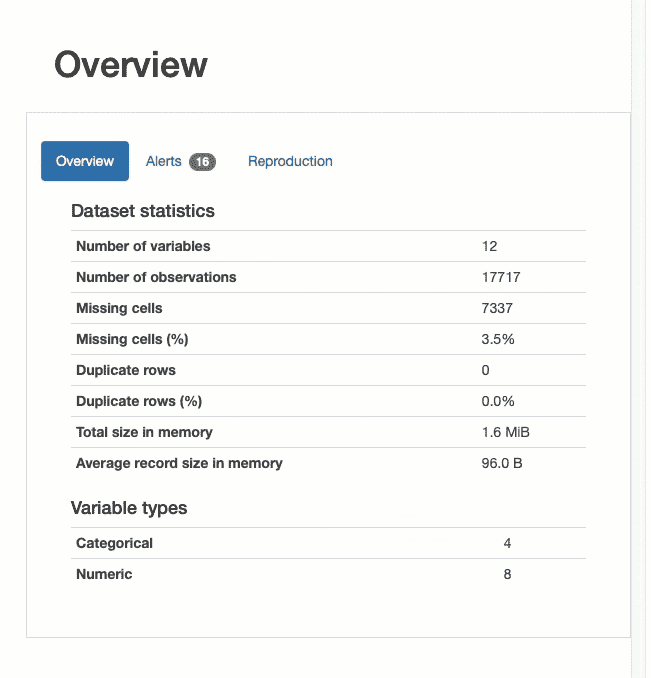

选择的数据集的 Ydata Profile 报告。图片来源于作者。

我们可以深入探讨数据集中的每个变量，查看数据完整性、统计数据和数据类型的信息。

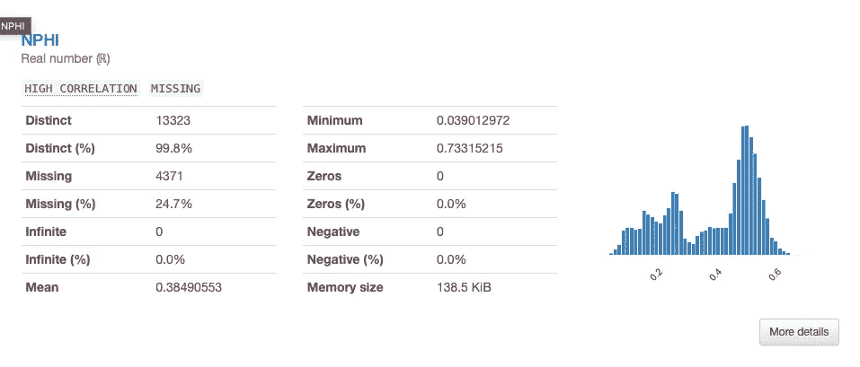

查看数据集内数字变量的关键统计数据。图片来源于作者。

我们还可以创建数据完整性的可视化。这让我们理解缺失的数据以及缺失情况如何在不同变量之间相关联。

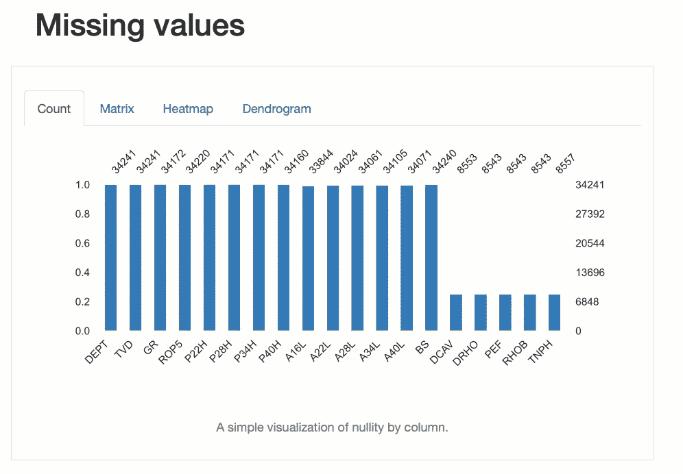

通过 YData Profiling 报告的各种视图识别缺失值。图片来源于作者。

你可以在下面的文章中探索更多 Pandas Profiling（改名之前）的功能。

[](/pandas-profiling-easy-exploratory-data-analysis-in-python-65d6d0e23650?source=post_page-----f0100d563c16--------------------------------) [## Pandas Profiling — Python 中的简易探索性数据分析]

### 使用 Pandas Profiling 库进行快速有效的 EDA

towardsdatascience.com](/pandas-profiling-easy-exploratory-data-analysis-in-python-65d6d0e23650?source=post_page-----f0100d563c16--------------------------------)

# 2\. D-Tale

[D-Tale](https://pypi.org/project/dtale/) 将你的 Pandas dataframe 提升到一个全新的水平。这个强大且快速的库使得与数据交互、进行基本分析甚至编辑变得非常简单。

我最近才发现这个库，但它已成为我探索数据时的首选库之一。

如果你想在下载之前尝试这个库，库作者提供了一个 [实时示例](http://alphatechadmin.pythonanywhere.com/dtale/main/1)。

## 如何使用 D-Tale

可以通过终端使用 pip 安装 D-Tale：

```py
pip install dtale
```

然后可以与 pandas 一起导入，如下所示。一旦 pandas 读取了数据，结果数据框可以传递给 `dtale.show()`

```py
import pandas as pd
import dtale

df = pd.read_csv('Data/Xeek_Well_15-9-15.csv')

dtale.show(df)
```

稍等片刻，D-Tale 交互式表格将出现，显示数据框中的所有数据。

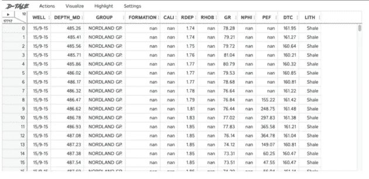

D-Tale 配备了大量功能，允许你审查数据、可视化其完整性、编辑数据等。

当我们查看个别变量时，比如数据集中的 DTC 列，我们可以使用直方图可视化其分布：

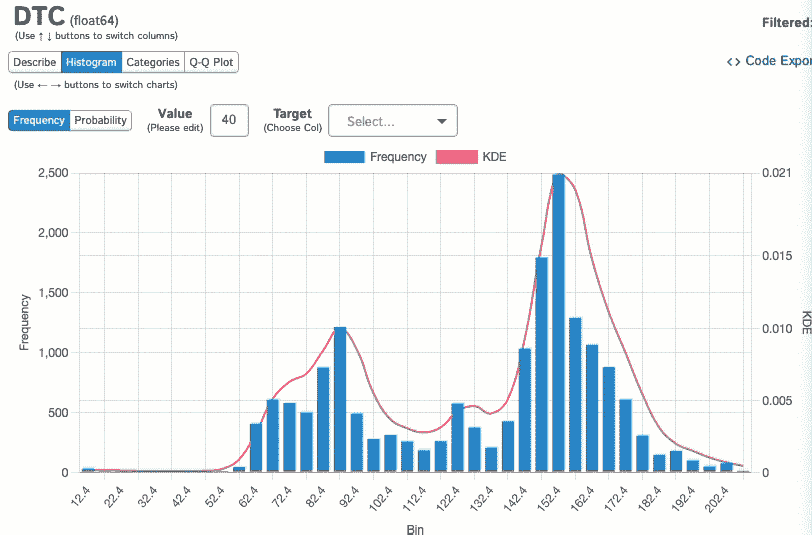

D-Tale 的 Describe 模块中的交互式直方图。图片由作者提供。

还可以查看数据在分类变量中的分布情况：

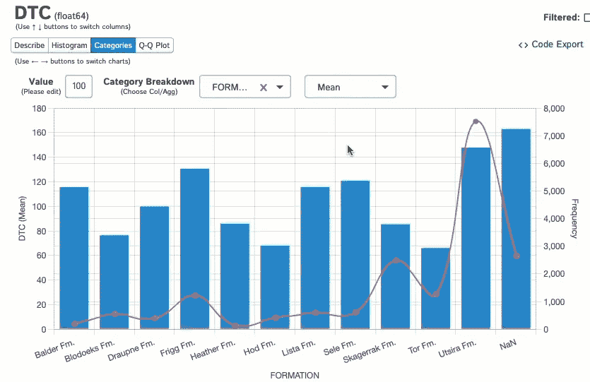

通过岩性或地质形成等类别轻松可视化数据。图片由作者提供。

如果你想探索更多 D-Tale 的功能，可以在我下面的文章中找到更多信息：

[](/d-tale-for-fast-and-easy-exploratory-data-analysis-of-well-log-data-a2ffca5295b6?source=post_page-----f0100d563c16--------------------------------) ## D-Tale 用于快速和轻松的井日志数据探索性数据分析

### 使用 D-Tale Python 库加速探索性数据分析工作流

towardsdatascience.com

# 3\. SweetViz

SweetViz 是另一个低代码的交互式数据可视化和探索库。通过几行代码，我们可以创建一个交互式 HTML 文件来探索数据。

## 如何使用 SweetViz

Sweetviz 可以通过终端使用 pip 安装：

```py
pip install sweetviz
```

安装完成后，我们可以将其导入到笔记本中，并使用 pandas 加载数据。

```py
import sweetviz as sv
import pandas as pd

df = pd.read_csv('Data/Xeek_Well_15-9-15.csv')
```

然后我们需要调用两行代码来生成报告：

```py
report = sv.analyze(df)
report.show_html()
```

这将打开一个新的浏览器标签页，显示以下设置。


SweetViz — 一个快速而强大的 EDA Python 库。图片由作者提供。

浏览器标签页打开后，你可以浏览数据框中的每个变量，查看每个变量的关键统计数据和完整性。当你点击任何变量时，如果数据是数值型数据，将打开数据分布的直方图；如果是分类数据，将显示值的计数。

此外，它还会显示该变量与数据集中其他变量之间的关系，具体以数字表示。

如果你想直观地查看，可以点击仪表板顶部的 Associations 按钮，打开一个图形相关性图。在下图中，我们可以看到一个混合的方形和圆圈，分别代表分类变量和数值变量。

方块/圆圈的大小代表关系的强度，颜色代表 Pearson 相关系数值。这应该是我迄今为止在 Python 中见过的最好的变量关系可视化之一。

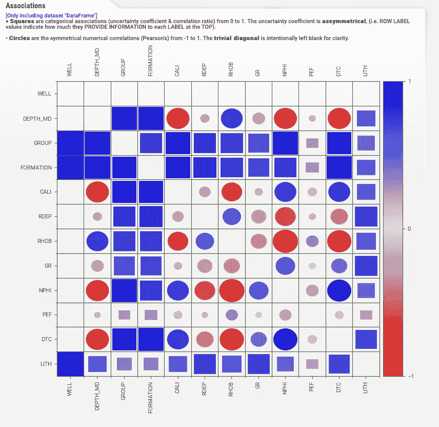

使用 SweetViz 生成的变量关联。图片由作者提供。

我发现这个库的一个小问题是你需要一个宽屏幕才能查看所有水平内容而不需要滚动。然而，不要让这阻碍你利用这个库带给你 EDA 的强大功能。

# 4\. Missingno

如果你对使用轻量级库来探索数据的完整性感兴趣，那么 [missingno](https://github.com/ResidentMario/missingno) 是你应该在 EDA 工具箱中考虑的一个。

这是一个 Python 库，它提供了一系列可视化工具，用于理解 pandas dataframe 中缺失数据的存在及其分布。该库提供了一小部分图表（条形图、矩阵图、热图或树状图）来可视化你的 dataframe 中哪些列包含缺失值，以及缺失程度在变量之间的关系。

## 如何使用 MissingNo

Missingno 可以通过终端使用 pip 安装：

```py
pip install missingno
```

一旦安装了库，我们可以将其与 pandas 一起导入，并将数据加载到 dataframe 中。

```py
import pandas as pd
import missingno as msno
df = pd.read_csv('xeek_train_subset.csv')
```

然后，我们可以从可用的图表中调用我们想要的图表：

```py
msno.bar(df)
msno.matrix(df)
msno.denrogram(df)
msno.heatmap(df)
```

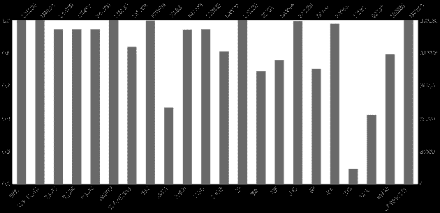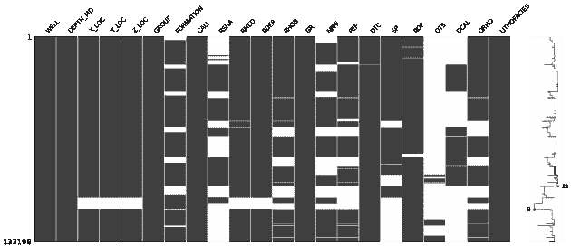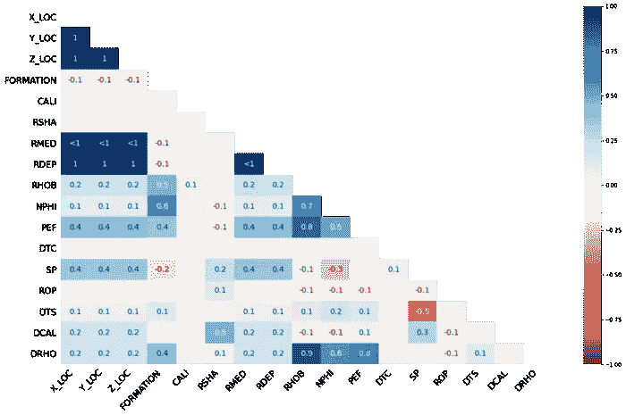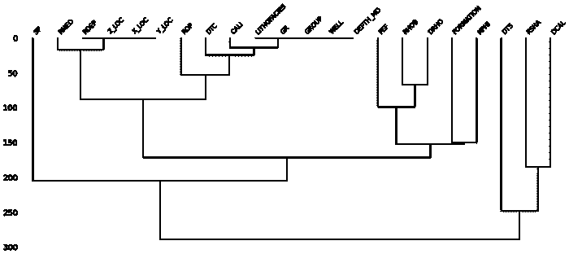

missingno 库中的四个主要图表。图片由作者提供。

上述四种图表为我们提供了以下洞见：

+   数据框中每一列的完整性 — `msno.bar()`

+   缺失数据出现的位置 — `msno.matrix()`

+   缺失值之间的相关性 — `msno.heatmap()` 和 `msno.dendrogram()`

这个库的优点在于图表简洁易懂，并且可以快速直接地融入到报告中。

要了解更多关于这些图表的信息，我推荐深入阅读下面的文章。

## 使用 missingno Python 库识别和可视化机器学习前的缺失数据

### 使用岩石物理测井数据的示例

towardsdatascience.com

# 5\. 草图

[Sketch](https://github.com/approximatelabs/sketch) 是一个非常新的（截至 2023 年 2 月）库，利用 AI 的力量帮助你通过自然语言问题直接在 Jupyter 中理解你的 Pandas 数据框。你还可以使用它生成示例代码，例如如何绘制数据框中的 x 和 y，然后使用该代码生成所需的图表。

该库大多是自包含的，它使用机器学习算法来理解你的问题与数据集之间的关系。有一个函数依赖于 OpenAI 的 API，但这并不影响库的使用。

Sketch 具有很大的潜力，特别是如果你希望为客户提供一个对 Python 编码知识要求非常有限的界面的话。

## 如何使用 Sketch

可以通过终端使用 pip 安装 Sketch：

```py
pip install sketch
```

然后我们将 pandas 和 sketch 导入到我们的笔记本中，接着从 CSV 文件中加载数据。

```py
import sketch
import pandas as pd

df = pd.read_csv('Data/Xeek_Well_15-9-15.csv')
```

一旦导入了 Sketch，我们的数据框将有三个新方法可用。

第一个方法是 `.ask`，它允许你用自然语言提问关于数据框的内容。

```py
df.sketch.ask('What are the max values of each numerical column?')
```

这将返回数据框中每个数值列的最大值的以下行。

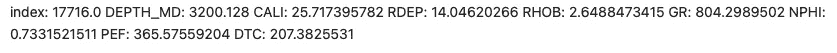

当询问 Sketch 返回每列最大值时的响应。图像由作者提供。

我们还可以询问数据框的完整性：

```py
df.sketch.ask('How complete is the data?')
```

它将返回以下响应，以人类编写的形式而不是表格或图形。

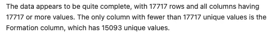

当询问 Sketch 关于数据框的完整性时的响应。图像由作者提供。

非常令人印象深刻。但这还不是全部。

我们甚至可以查询库关于如何使用 `.sketch.howto()` 绘制数据框中的数据

```py
df.sketch.howto("""How do I plot RHOB against DEPTH_MD 
                using a line plot and have the line coloured in red?""")
```

它将返回一个代码片段，说明如何执行：

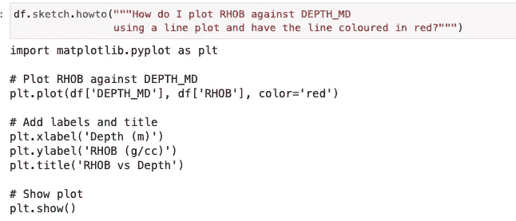

从 sketch.howto 函数返回的代码片段。图像由作者提供。

运行时，将返回以下图表：

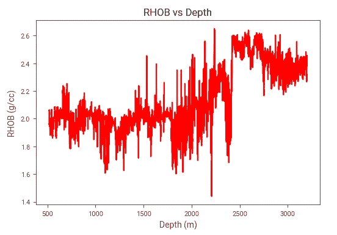

从 sketch python 库返回的代码生成的图表。图像由作者提供。

Sketch 的第三个选项是 `.apply` 方法，它需要一个 OpenAI API 才能运行。当我们想要从现有特征创建新特征或生成新特征时，这个功能非常有用。到目前为止，我还没有探索这个选项，但希望在不久的将来能够进行。

有关 Sketch 的更多细节，请查看以下文章：

[](https://andymcdonaldgeo.medium.com/sketch-a-promising-ai-library-to-help-with-pandas-dataframes-directly-in-jupyter-5162c32c66ef?source=post_page-----f0100d563c16--------------------------------) [## Sketch：一个有前景的 AI 库，用于直接在 Jupyter 中帮助处理 Pandas 数据框

### 在 Jupyter Notebook 中利用 AI 的力量

[andymcdonaldgeo.medium.com](https://andymcdonaldgeo.medium.com/sketch-a-promising-ai-library-to-help-with-pandas-dataframes-directly-in-jupyter-5162c32c66ef?source=post_page-----f0100d563c16--------------------------------)

# 摘要

在本文中，我们已经介绍了五个强大的 Python 库，它们可以用来加快和增强项目的探索性数据分析阶段。这些库从简单的图形到利用自然语言处理技术与数据进行交互都有涉及。

我强烈建议你查看这些库并探索它们的功能。你永远不知道，也许你会发现你新的最爱 Python 库。

*感谢阅读。在你离开之前，你应该订阅我的内容，将我的文章直接发送到你的收件箱。* [***你可以在这里做到这一点！***](https://andymcdonaldgeo.medium.com/subscribe)*或者，你也可以* [***注册我的通讯***](https://fabulous-founder-2965.ck.page/2ca286e572) *以便将额外的内容直接免费发送到你的收件箱。*

*其次，你可以通过注册会员来获得完整的 Medium 体验，同时支持成千上万的其他作者和我。它只需每月 $5，你将能够完全访问所有精彩的 Medium 文章，并有机会通过你的写作赚钱。*

*如果你通过* [***我的链接***](https://andymcdonaldgeo.medium.com/membership)***，*** *你将直接支持我，你的费用也不会增加。如果你这样做了，非常感谢你的支持。*

本文使用的数据集是 Xeek 和 FORCE 2020 机器学习竞赛的一部分训练数据集的子集（*Bormann et al., 2020*）。它在挪威政府的 NOLD 2.0 许可证下发布，详细信息可以在这里找到：[挪威开放政府数据许可证（NLOD）2.0](https://data.norge.no/nlod/en/2.0/)。完整数据集可以通过[这里](https://doi.org/10.5281/zenodo.4351155)访问。

数据集的完整参考是：

Bormann, Peter, Aursand, Peder, Dilib, Fahad, Manral, Surrender, & Dischington, Peter. (2020). FORCE 2020 油井记录和岩性数据集用于机器学习竞赛 [数据集]。Zenodo. [`doi.org/10.5281/zenodo.4351156`](http://doi.org/10.5281/zenodo.4351156)
