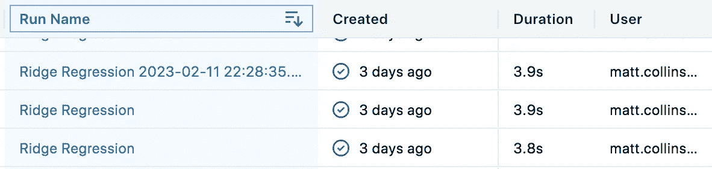

# 提升您的 MLflow 模型实验的 5 个快速技巧

> 原文：[`towardsdatascience.com/5-quick-tips-to-improve-your-mlflow-model-experimentation-dae346db825?source=collection_archive---------11-----------------------#2023-03-13`](https://towardsdatascience.com/5-quick-tips-to-improve-your-mlflow-model-experimentation-dae346db825?source=collection_archive---------11-----------------------#2023-03-13)

## 使用 MLflow Python API 来驱动更好的模型开发

[](https://medium.com/@mc12338?source=post_page-----dae346db825--------------------------------)[](https://towardsdatascience.com/?source=post_page-----dae346db825--------------------------------) [Matt Collins](https://medium.com/@mc12338?source=post_page-----dae346db825--------------------------------)

·

[关注](https://medium.com/m/signin?actionUrl=https%3A%2F%2Fmedium.com%2F_%2Fsubscribe%2Fuser%2Fd1970f1605f1&operation=register&redirect=https%3A%2F%2Ftowardsdatascience.com%2F5-quick-tips-to-improve-your-mlflow-model-experimentation-dae346db825&user=Matt+Collins&userId=d1970f1605f1&source=post_page-d1970f1605f1----dae346db825---------------------post_header-----------) 发表在 [Towards Data Science](https://towardsdatascience.com/?source=post_page-----dae346db825--------------------------------) ·7 分钟阅读·2023 年 3 月 13 日[](https://medium.com/m/signin?actionUrl=https%3A%2F%2Fmedium.com%2F_%2Fvote%2Ftowards-data-science%2Fdae346db825&operation=register&redirect=https%3A%2F%2Ftowardsdatascience.com%2F5-quick-tips-to-improve-your-mlflow-model-experimentation-dae346db825&user=Matt+Collins&userId=d1970f1605f1&source=-----dae346db825---------------------clap_footer-----------)

--

[](https://medium.com/m/signin?actionUrl=https%3A%2F%2Fmedium.com%2F_%2Fbookmark%2Fp%2Fdae346db825&operation=register&redirect=https%3A%2F%2Ftowardsdatascience.com%2F5-quick-tips-to-improve-your-mlflow-model-experimentation-dae346db825&source=-----dae346db825---------------------bookmark_footer-----------)

MLflow 是加速机器学习模型开发过程的绝佳工具，其强大的实验组件使数据科学家能够记录最佳算法和参数组合，并迅速迭代模型开发。

本博客旨在展示如何充分利用 MLflow 实验。我们将重点介绍`start_run()`及其参数，这些参数可以增强您的实验过程。此外，我们还将介绍`search_runs()`函数，它提供了您实验历史的广泛视图，并在分析中提供更大的灵活性。

如果你是 MLflow 的新手，我建议在进入此博客之前，查看一下 MLflow [网站](https://mlflow.org/)、[文档](https://mlflow.org/docs/latest/quickstart.html)、一些博客文章或教程视频。


照片由[Adrien Converse](https://unsplash.com/@adrienconverse?utm_source=medium&utm_medium=referral)提供，来源于[Unsplash](https://unsplash.com/?utm_source=medium&utm_medium=referral)

## **mlflow.start_run()**

这些技巧大多数是`start_run()`函数的参数。我们调用此函数来启动实验运行，它成为活动运行，我们可以在其中记录参数、指标和其他信息。

这是我在 MLflow 中使用最频繁的函数，它为用户提供了最即时的价值。

## 1\. run_id

`run_id`是一个特定于每个实验运行的 UUID。一旦运行启动，就无法覆盖诸如模型类型或参数值等属性。然而，你可以使用`run_id`来回溯记录额外的值，如指标、标签或描述。

```py
# Start MLflow run for this experiment

# End any existing runs
mlflow.end_run()

with mlflow.start_run() as run:
    # Turn autolog on to save model artifacts, requirements, etc.
    mlflow.autolog(log_models=True)

    print(run.info.run_id)

    diabetes_X = diabetes.data
    diabetes_y = diabetes.target

    # Split data into test training sets, 3:1 ratio
    (
        diabetes_X_train,
        diabetes_X_test,
        diabetes_y_train,
        diabetes_y_test,
    ) = train_test_split(diabetes_X, diabetes_y, test_size=0.25, random_state=42)

    alpha = 0.9
    solver = "cholesky"
    regr = linear_model.Ridge(alpha=alpha, solver=solver)

    regr.fit(diabetes_X_train, diabetes_y_train)

    diabetes_y_pred = regr.predict(diabetes_X_test)

    # Log desired metrics
    mlflow.log_metric("mse", mean_squared_error(diabetes_y_test, diabetes_y_pred))
    mlflow.log_metric(
        "rmse", sqrt(mean_squared_error(diabetes_y_test, diabetes_y_pred))
    )
```

在这种情况下，我们可能还希望记录此运行的决定系数（r²）值：

```py
with mlflow.start_run(run_id="3fcf403e1566422493cd6e625693829d") as run:
    mlflow.log_metric("r2", r2_score(diabetes_y_test, diabetes_y_pred))
```

`run_id`可以通过从之前的运行中`print(run.info.run_id)`提取，或通过查询`mlflow.search_runs()`来获得，稍后会详细介绍。

## 2\. experiment_id

在 MLflow 中，你可以通过几种不同的方式设置要记录的实验。第一个命令将所有后续运行的实验设置为“mlflow_sdk_test”。

```py
mlflow.set_experiment("/mlflow_sdk_test")
```

这也可以通过`experiment_id`参数在逐次运行中进行配置。

```py
my_experiment = mlflow.set_experiment("/mlflow_sdk_test")
experiment_id = my_experiment.experiment_id
```

然后，这个值可以在传递给`start_run()`时重复使用：

```py
# End any existing runs
mlflow.end_run()

with mlflow.start_run(experiment_id=experiment_id):
    # Turn autolog on to save model artifacts, requirements, etc.
    mlflow.autolog(log_models=True)

    print(run.info.run_id)

    diabetes_X = diabetes.data
    diabetes_y = diabetes.target

    # Split data into test training sets, 3:1 ratio
    (
        diabetes_X_train,
        diabetes_X_test,
        diabetes_y_train,
        diabetes_y_test,
    ) = train_test_split(diabetes_X, diabetes_y, test_size=0.25, random_state=42)

    alpha = 0.8
    solver = "cholesky"
    regr = linear_model.Ridge(alpha=alpha, solver=solver)

    regr.fit(diabetes_X_train, diabetes_y_train)

    diabetes_y_pred = regr.predict(diabetes_X_test)

    # Log desired metrics
    mlflow.log_metric("mse", mean_squared_error(diabetes_y_test, diabetes_y_pred))
    mlflow.log_metric(
        "rmse", sqrt(mean_squared_error(diabetes_y_test, diabetes_y_pred))
    )
    mlflow.log_metric("r2", r2_score(diabetes_y_test, diabetes_y_pred))
```

## 3\. run_name

当你指定运行名称时，你可以比依赖 MLflow 生成的默认名称更好地控制命名过程。这使你能够建立一致的实验运行命名约定，类似于你管理环境中其他资源的方式。

```py
# Start MLflow run for this experiment

# End any existing runs
mlflow.end_run()

# Explicitly name runs
today = dt.today()

run_name = "Ridge Regression " + str(today)

with mlflow.start_run(run_name=run_name) as run:
    # Turn autolog on to save model artifacts, requirements, etc.
    mlflow.autolog(log_models=True)

    print(run.info.run_id)

    diabetes_X = diabetes.data
    diabetes_y = diabetes.target

    # Split data into test training sets, 3:1 ratio
    (
        diabetes_X_train,
        diabetes_X_test,
        diabetes_y_train,
        diabetes_y_test,
    ) = train_test_split(diabetes_X, diabetes_y, test_size=0.25, random_state=42)

    alpha = 0.5
    solver = "cholesky"
    regr = linear_model.Ridge(alpha=alpha, solver=solver)

    regr.fit(diabetes_X_train, diabetes_y_train)

    diabetes_y_pred = regr.predict(diabetes_X_test)

    # Log desired metrics
    mlflow.log_metric("mse", mean_squared_error(diabetes_y_test, diabetes_y_pred))
    mlflow.log_metric(
        "rmse", sqrt(mean_squared_error(diabetes_y_test, diabetes_y_pred))
    )
    mlflow.log_metric("r2", r2_score(diabetes_y_test, diabetes_y_pred))
```

但是，请注意`run_name`在 MLflow 中并不是唯一约束。这意味着你可能会有多个实验（具有唯一的运行 ID）共享相同的名称。



MLflow 实验表视图——重复的运行名称：作者提供的图片

这意味着每次在*with*语句中执行新运行时，它将创建一个同名的新实验，而不是将细节附加到此运行中。

这使我们顺利过渡到下一个参数。

## 4\. 嵌套

如果你使用过 scikit-learn 的`GridSearchCV`函数来执行超参数优化，你可能对嵌套实验运行有所了解。

在 MLflow 中，嵌套实验看起来像下面这样：


MLflow 实验表视图——嵌套实验：作者提供的图片

注意，这里的指标是针对父运行保存的，它返回子运行记录的最佳值。子运行值本身是空白的。

虽然嵌套实验非常适合评估和记录参数组合以确定最佳模型，但它们也是组织工作的大型逻辑容器。通过分组实验，您可以将各个数据科学调查进行分隔，并保持实验页面的有序和整洁。

```py
# End any existing runs
mlflow.end_run()

# Explicitly name runs
run_name = "Ridge Regression Nested"

with mlflow.start_run(run_name=run_name) as parent_run:
    print(parent_run.info.run_id)

    with mlflow.start_run(run_name="Child Run: alpha 0.1", nested=True):
        # Turn autolog on to save model artifacts, requirements, etc.
        mlflow.autolog(log_models=True)

        diabetes_X = diabetes.data
        diabetes_y = diabetes.target

        # Split data into test training sets, 3:1 ratio
        (
            diabetes_X_train,
            diabetes_X_test,
            diabetes_y_train,
            diabetes_y_test,
        ) = train_test_split(diabetes_X, diabetes_y, test_size=0.25, random_state=42)

        alpha = 0.1
        solver = "cholesky"
        regr = linear_model.Ridge(alpha=alpha, solver=solver)

        regr.fit(diabetes_X_train, diabetes_y_train)

        diabetes_y_pred = regr.predict(diabetes_X_test)

        # Log desired metrics
        mlflow.log_metric("mse", mean_squared_error(diabetes_y_test, diabetes_y_pred))
        mlflow.log_metric(
            "rmse", sqrt(mean_squared_error(diabetes_y_test, diabetes_y_pred))
        )
        mlflow.log_metric("r2", r2_score(diabetes_y_test, diabetes_y_pred))
```

如果需要在此嵌套运行中进行添加，则在后续执行时指定父运行的`run_id`作为参数，附加更多子运行。

```py
# End any existing runs
mlflow.end_run()

with mlflow.start_run(run_id="61d34b13649c45699e7f05290935747c") as parent_run:
    print(parent_run.info.run_id)
    with mlflow.start_run(run_name="Child Run: alpha 0.2", nested=True):
        # Turn autolog on to save model artifacts, requirements, etc.
        mlflow.autolog(log_models=True)

        diabetes_X = diabetes.data
        diabetes_y = diabetes.target

        # Split data into test training sets, 3:1 ratio
        (
            diabetes_X_train,
            diabetes_X_test,
            diabetes_y_train,
            diabetes_y_test,
        ) = train_test_split(diabetes_X, diabetes_y, test_size=0.25, random_state=42)

        alpha = 0.2
        solver = "cholesky"
        regr = linear_model.Ridge(alpha=alpha, solver=solver)

        regr.fit(diabetes_X_train, diabetes_y_train)

        diabetes_y_pred = regr.predict(diabetes_X_test)

        # Log desired metrics
        mlflow.log_metric("mse", mean_squared_error(diabetes_y_test, diabetes_y_pred))
        mlflow.log_metric(
            "rmse", sqrt(mean_squared_error(diabetes_y_test, diabetes_y_pred))
        )
        mlflow.log_metric("r2", r2_score(diabetes_y_test, diabetes_y_pred))
```

关于这种方法要注意的一点是，您的指标现在将记录在每个**子**运行中。

## 5\. mlflow.search_runs()

这个技巧是使用 `search_runs()` 函数。

这个函数允许我们以编程方式查询实验 GUI，结果以易于理解和操作的表格格式返回。

在下面的示例中，我们可以从实验中的运行中选择特定字段，并将其加载到 Pandas DataFrame 中。请注意，可用的列远远超过实验 GUI 中提供的列！

```py
# Create DataFrame of all runs in *current* experiment
df = mlflow.search_runs(order_by=["start_time DESC"])

# Print a list of the columns available
# print(list(df.columns))

# Create DataFrame with subset of columns
runs_df = df[
    [
        "run_id",
        "experiment_id",
        "status",
        "start_time",
        "metrics.mse",
        "tags.mlflow.source.type",
        "tags.mlflow.user",
        "tags.estimator_name",
        "tags.mlflow.rootRunId",
    ]
].copy()
runs_df.head()
```

由于这是一个 Pandas DataFrame，我们可以添加一些可能对分析有用的列：

```py
# Feature engineering to create some additional columns
runs_df["start_date"] = runs_df["start_time"].dt.date
runs_df["is_nested_parent"] = runs_df[["run_id","tags.mlflow.rootRunId"]].apply(lambda x: 1 if x["run_id"] == x["tags.mlflow.rootRunId"] else 0, axis=1)
runs_df["is_nested_child"] = runs_df[["run_id","tags.mlflow.rootRunId"]].apply(lambda x: 1 if x["tags.mlflow.rootRunId"] is not None and x["run_id"] != x["tags.mlflow.rootRunId"]else 0, axis=1)
runs_df
```

如果我们想要汇总结果集以提供随时间变化的运行信息，我们可以使用：

```py
pd.DataFrame(runs_df.groupby("start_date")["run_id"].count()).reset_index()
```


上述查询的输出：作者提供的图像

自动生成的 tags.estimator_name 字段允许我们查看每个算法的测试运行数量。

```py
pd.DataFrame(runs_df.groupby("tags.estimator_name")["run_id"].count()).reset_index()
```


上述查询的输出：作者提供的图像

由于这是一个 DataFrame，我们可以将数据导出以满足任何报告要求，从而为可能没有访问工作区的用户提供所需的可见性，并在工作区之间进行比较。

# 结束语

这些只是如何扩展 MLflow 函数和参数在实验过程中的使用的一些示例，但在 Python API 中还有许多其他可用的函数和参数。

希望这篇文章能激发您探索一些可用的函数和参数，并查看它们是否能为您的模型开发过程带来好处。有关更多信息，请参考 API [文档](https://mlflow.org/docs/latest/python_api/index.html)，并尝试不同的配置以找到最适合您需求的配置。

如果您当前使用了我在本文中没有提到的任何函数或参数，请在评论中告诉我！

所有代码可以在我的 [GitHub Repo](https://github.com/MattPCollins/MLflowExperimentation) 中找到。
