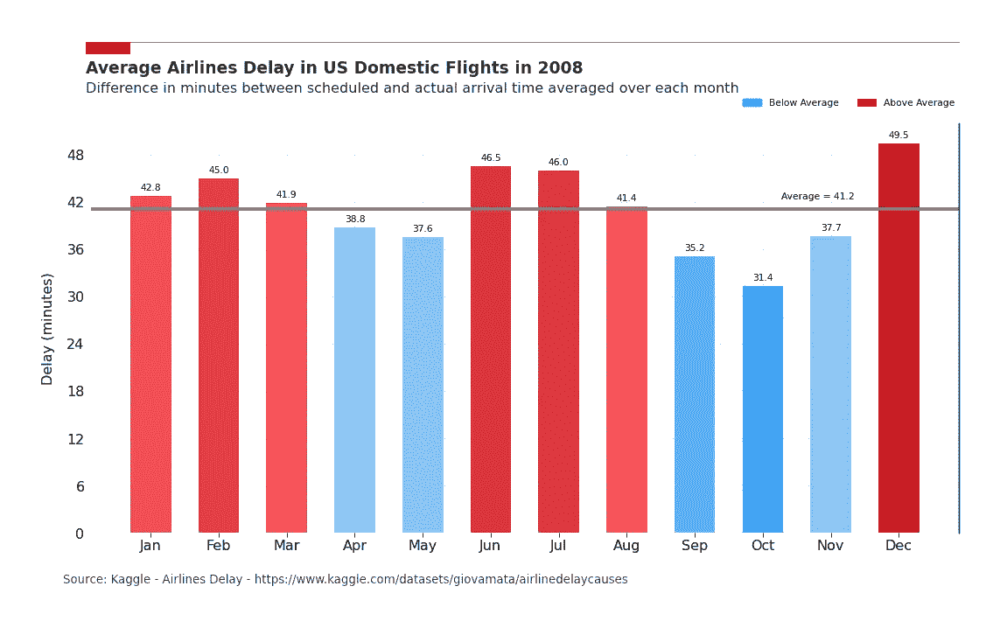
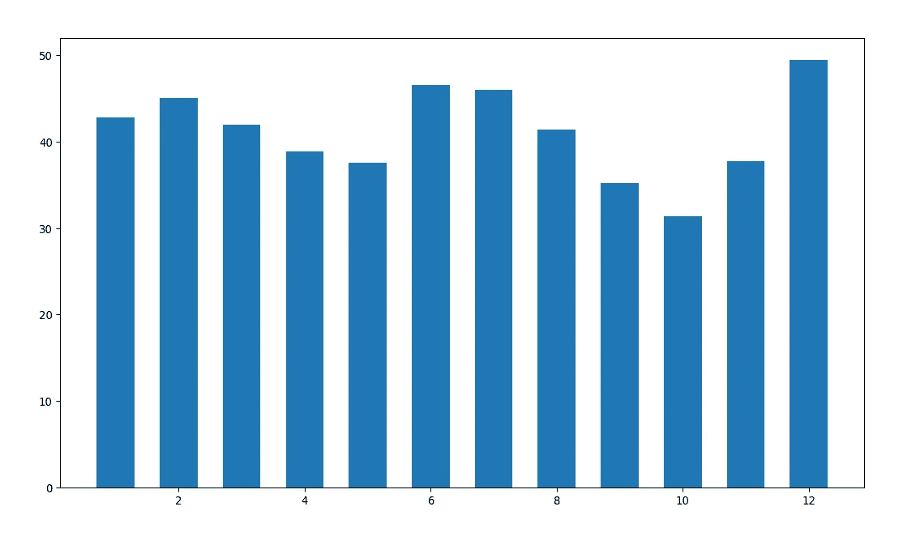

# 使用 Python 构建美观条形图的 5 个步骤

> 原文：[`towardsdatascience.com/5-steps-to-build-beautiful-bar-charts-with-python-3691d434117a?source=collection_archive---------2-----------------------#2023-01-23`](https://towardsdatascience.com/5-steps-to-build-beautiful-bar-charts-with-python-3691d434117a?source=collection_archive---------2-----------------------#2023-01-23)

## 如何利用 Matplotlib 的全部功能讲述更具吸引力的故事

 [Guillaume Weingertner](https://guillaume-weingertner.medium.com/?source=post_page-----3691d434117a--------------------------------)

·

[关注](https://medium.com/m/signin?actionUrl=https%3A%2F%2Fmedium.com%2F_%2Fsubscribe%2Fuser%2F4ebea49e580e&operation=register&redirect=https%3A%2F%2Ftowardsdatascience.com%2F5-steps-to-build-beautiful-bar-charts-with-python-3691d434117a&user=Guillaume+Weingertner&userId=4ebea49e580e&source=post_page-4ebea49e580e----3691d434117a---------------------post_header-----------) 发表在 [Towards Data Science](https://towardsdatascience.com/?source=post_page-----3691d434117a--------------------------------) · 7 分钟阅读 · 2023 年 1 月 23 日

--

2008 年美国国内航班的平均延误 — 作者提供的图片

# 动机

使用数据讲述引人入胜的故事会变得更简单，当这些图表支持的故事**清晰**、**自解释**且对观众**视觉愉悦**时。

在许多情况下，内容和形式同样重要。

呈现不佳的数据不会引起应有的关注，而以华丽方式呈现的差数据很容易被质疑。

Matplotlib 使得用现成函数快速绘制数据变得容易，但细节调整步骤则需要更多的努力。

我花了相当多的时间研究使用 Matplotlib 构建引人注目的图表的最佳实践，这样你就不必再花时间研究了。

在这篇文章中，我专注于**条形图**，并解释了我如何将零碎的知识拼接在一起，从而从这个…

2008 年美国国内航班的平均延误 — 图片由作者提供

…到那个：
