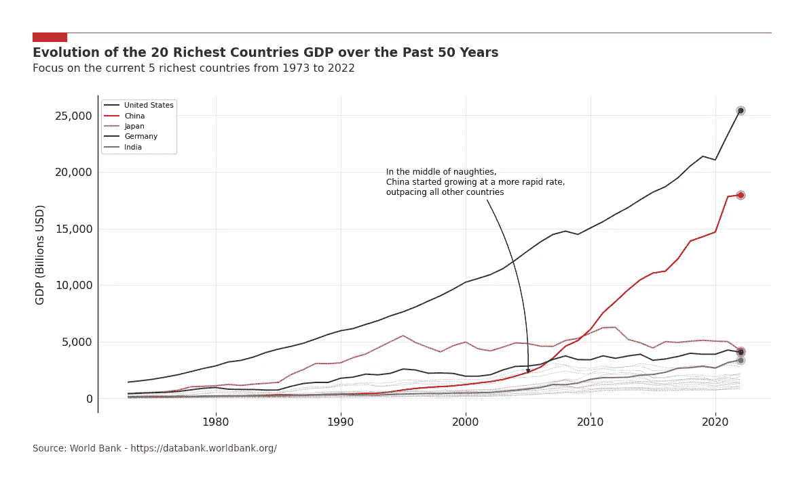

# 5 步骤用 Python 绘制美观的折线图

> 原文：[`towardsdatascience.com/5-steps-to-build-beautiful-line-charts-with-python-655ac5477310`](https://towardsdatascience.com/5-steps-to-build-beautiful-line-charts-with-python-655ac5477310)

## 如何使用 Matplotlib 的全部功能来讲述更具吸引力的故事

[](https://guillaume-weingertner.medium.com/?source=post_page-----655ac5477310--------------------------------)[](https://towardsdatascience.com/?source=post_page-----655ac5477310--------------------------------) [Guillaume Weingertner](https://guillaume-weingertner.medium.com/?source=post_page-----655ac5477310--------------------------------)

·发表于 [Towards Data Science](https://towardsdatascience.com/?source=post_page-----655ac5477310--------------------------------) ·阅读时间 7 分钟·2023 年 10 月 27 日

--


5 个最富有国家的 GDP 随时间的演变 — 图片由作者提供

# 动机

几个月前，我写了一篇关于条形图的文章，讨论了如何使它们**清晰**、**自我解释**和**视觉上令人愉悦**，以讲述更具吸引力的故事（链接见下文）。

[](/5-steps-to-build-beautiful-bar-charts-with-python-3691d434117a?source=post_page-----655ac5477310--------------------------------) ## 5 步骤用 Python 绘制美观的条形图

### 如何使用 Matplotlib 的全部功能来讲述更具吸引力的故事

towardsdatascience.com

在这篇文章中，我转而探讨**折线图**，它们具有其他值得探索的特性。

Matplotlib 使得使用现成函数绘制数据变得快捷而简单，但细节调整步骤则需要更多的努力。

我花了相当多的时间研究使用 Matplotlib 构建引人入胜的图表的最佳实践，因此你不必亲自去做。

目的是从这个…


… 变成这样：



*除非另有说明，否则所有图片均由作者提供。*

# #0 数据

为了说明方法，我使用了一个包含过去 50 年各国 GDP 信息的公开数据集：

> 来源：世界银行国家账户数据和 OECD 国家账户数据文件。
> 
> 许可网址：[`datacatalog.worldbank.org/public-licenses#cc-by`](https://datacatalog.worldbank.org/public-licenses#cc-by)
> 
> 许可类型：CC BY-4.0

在导入了读取数据和构建图表所需的包之后，我简单地筛选了 2022 年的前 20 个国家：

```py
import pandas as pd
import matplotlib.pyplot as plt
from datetime import timedelta

# Read the data
df = pd.read_csv('88a1e584-0a94-4e73-b650-749332831ef4_Data.csv', sep=',')
df.drop(['Series Name', 'Series Code', 'Country Code'], axis=1, inplace=True)
df = df.dropna(subset=['Country Name'])

# Filter on the Top 20 richest countries of 2022
top_20_countries = df[df['Year'] == '2022-01-01'].sort_values('GDP', ascending = False).head(20)['Country Name'].tolist()
df = df[df['Country Name'].isin(top_20_countries)].reset_index(drop = True)

df.head()
```

文章中用于构建不同版本折线图的数据集如下：


本文使用的数据集摘录 — 作者提供的图片

# #1 基本图

首先，4 行代码足以创建图形并循环绘制各国的折线：

```py
# Create the figure and axes objects, specify the size and the dots per inches 
fig, ax = plt.subplots(figsize=(13.33,7.5), dpi = 96)

# Plot lines
for country in top_20_countries:
    data = df[df['Country Name'] == country]
    line = ax.plot(data['Year'], data['GDP'], label=country)
```


Matplotlib 中最基本的折线图 — 作者提供的图片

# #2 必要功能

让我们在图表中添加一些重要元素，以使其对观众更具可读性。

+   **网格**

    为了提高可读性，图表的网格至关重要。它们的透明度设置为 0.5，以免对数据点产生过多干扰。

+   **X 轴和 Y 轴格式调整**

    我故意添加了比必要更多的参数，以便更全面地查看微调的可能性。例如，x 轴不需要 major_formatter 和 major_locator 对象，因为我们只显示年份，但如果读者的 x 轴包含其他数据，这将非常有用。

+   **图例**

    由于我们展示了许多线条，因此重要的是添加标签和图例，以便区分各条线。

```py
# Add legend
ax.legend(loc="best", fontsize=8)

# Create the grid 
ax.grid(which="major", axis='x', color='#DAD8D7', alpha=0.5, zorder=1)
ax.grid(which="major", axis='y', color='#DAD8D7', alpha=0.5, zorder=1)

# Reformat x-axis label and tick labels
ax.set_xlabel('', fontsize=12, labelpad=10) # No need for an axis label
ax.xaxis.set_label_position("bottom")
#ax.xaxis.set_major_formatter(lambda s, i : f'{s:,.0f}') #in case we need additional formatting
#ax.xaxis.set_major_locator(MaxNLocator(integer=True)) #in case we need additional formatting
ax.xaxis.set_tick_params(pad=2, labelbottom=True, bottom=True, labelsize=12, labelrotation=0)

# Reformat y-axis
ax.set_ylabel('GDP (Billions USD)', fontsize=12, labelpad=10)
ax.yaxis.set_label_position("left")
ax.yaxis.set_major_formatter(lambda s, i : f'{s*10**-9:,.0f}')
#ax.yaxis.set_major_locator(MaxNLocator(integer=True)) #in case we need additional formatting
ax.yaxis.set_tick_params(pad=2, labeltop=False, labelbottom=True, bottom=False, labelsize=12)
```


在我们的图表中添加一些必要功能 — 作者提供的图片

# #3 专注于讲述故事

现在是时候突出显示图表中需要突出的内容，以讲述其背后的故事。在这种情况下，我们将突出显示 5 个最富有的国家，并跟踪它们随时间变化的 GDP。

我们在字典中定义了具体的颜色和线条样式，并稍微修改了代码以单独绘制它们。

```py
# Color and line style
colors_dict = {'United States': '#014f86', 'China': '#DC0000', 'Japan': '#ff4d6d', 'Germany': '#403d39', 'India': '#6a994e'}
line_styles_dict = {'United States': '-', 'China': '-', 'Japan': '-', 'Germany': '-', 'India': '-'}

# Plot the Top 5 lines
for country in top_20_countries[:5]:
    color = colors_dict.get(country, 'grey')  # get the color from the dictionary, default to grey if not found
    line_style = line_styles_dict.get(country, '-')  # get the line style from the dictionary, default to solid line if not found
    data = df[df['Country Name'] == country]
    line = ax.plot(data['Year'], data['GDP'], color=color, linestyle=line_style, zorder=2, label=country)

# Add legend
ax.legend(loc="best", fontsize=8)

# Plot the rest
for country in top_20_countries[5:]:
    data = df[df['Country Name'] == country]
    line = ax.plot(data['Year'], data['GDP'], color='grey', linestyle=':', linewidth=0.5, zorder=2)
```


仍然是相同的折线图，但故事更加清晰 — 作者提供的图片

# #4 专业外观

在图表中添加更多功能将使其看起来更专业。这些功能会叠加在任何图表之上，并且与我们在本文中使用的数据无关。

借助以下代码片段，这些调整将几乎无需努力即可实现。作者建议：保存并随意重用。

读者可以调整这些元素以创建自己的视觉风格。

+   **坐标轴**

    坐标轴组成了图表周围可见的框架。它们被移除，除了左侧的坐标轴，它被设置为稍微粗一点。

+   **红线和矩形**

    在标题上方添加了红线和矩形，以便将图表与上面的文本清晰隔离开来。

+   **标题和副标题**

    没有标题的图表如何引人注目呢？

    副标题可用于进一步解释内容或甚至提出初步结论。

+   **来源** 所有生产的图表中必不可少。

+   **边距调整**

    调整了围绕图表区域的边距，以确保充分利用所有可用空间。

+   **白色背景**

    设置白色背景（默认为透明）在通过电子邮件、Teams 或其他工具发送图表时会很有用，因为透明背景可能会带来问题。

```py
# Remove the spines
ax.spines[['top','right','bottom']].set_visible(False)

# Make the left spine thicker
ax.spines['left'].set_linewidth(1.1)

# Add in red line and rectangle on top
ax.plot([0.05, .9], [.98, .98], transform=fig.transFigure, clip_on=False, color='#E3120B', linewidth=.6)
ax.add_patch(plt.Rectangle((0.05,.98), 0.04, -0.02, facecolor='#E3120B', transform=fig.transFigure, clip_on=False, linewidth = 0))

# Add in title and subtitle
ax.text(x=0.05, y=.93, s="Evolution of the 20 Richest Countries GDP over the Past 50 Years", transform=fig.transFigure, ha='left', fontsize=14, weight='bold', alpha=.8)
ax.text(x=0.05, y=.90, s="Focus on the current 5 richest countries from 1973 to 2022", transform=fig.transFigure, ha='left', fontsize=12, alpha=.8)

# Set source text
ax.text(x=0.05, y=0.12, s="Source: World Bank - https://databank.worldbank.org/", transform=fig.transFigure, ha='left', fontsize=10, alpha=.7)

# Adjust the margins around the plot area
plt.subplots_adjust(left=None, bottom=0.2, right=None, top=0.85, wspace=None, hspace=None)

# Set a white background
fig.patch.set_facecolor('white')
```


我们的视觉识别应用于图表，使其更加整洁 —— 作者提供的图片

# #5 最后的修饰

为了达到文章开头介绍的最终结果，剩下的工作就是实现这些额外的组件：

+   **终点标记**

    这些元素纯粹是美学上的，但为我们的折线图增添了亮点。我们用标记突出显示每条线的最后一个点，使其更为显眼。

+   **注释**

    多亏了注释方法，我们可以在图表中突出显示特定点，并直接添加评论。

```py
# Plot the Top 5 lines
for country in top_20_countries[:5]:
    color = colors_dict.get(country, 'grey')  # get the color from the dictionary, default to black if not found
    line_style = line_styles_dict.get(country, '-')  # get the line style from the dictionary, default to solid line if not found
    data = df[df['Country Name'] == country]
    line = ax.plot(data['Year'], data['GDP'], color=color, linestyle=line_style, zorder=2, label = country)
    ax.plot(data['Year'].iloc[-1], data['GDP'].iloc[-1], 'o', color=color, markersize=10, alpha=0.3)
    ax.plot(data['Year'].iloc[-1], data['GDP'].iloc[-1], 'o', color=color, markersize=5)

# Add some text on the graph
ax.annotate('During the 2000s,\nChina began experiencing rapid economic growth,\noutpacing all other countries.',
            (data['Year'].iloc[-18], 2000000000000),
            xytext=(data['Year'].iloc[-28]-timedelta(days=500), 18000000000000),
            ha='left', fontsize=9, arrowprops=dict(arrowstyle='-|>', facecolor='k', connectionstyle="arc3,rad=-0.15"))
```


最终产品：折线图易于阅读 —— 作者提供的图片

# #6 最后的思考

这篇文章的目的是分享在制作更具吸引力的折线图时积累的知识。我尽量使其尽可能实用，提供了可重复使用的代码片段。

我相信还有其他调整是我没想到的。如果你有任何改进建议，请随时评论，让这篇文章对大家更有帮助！

本文仅专注于**折线图**，敬请关注更多内容！

*感谢你阅读到文章的最后。* ***关注以获取更多内容！*** *如果有任何问题或建议，请随时在下方留言，或通过* [*LinkedIn*](https://www.linkedin.com/in/guillaume-weingertner-a4a27972/) */* [*X*](https://twitter.com/GuillaumeWein) *联系我！*

[](https://guillaume-weingertner.medium.com/subscribe?source=post_page-----655ac5477310--------------------------------) [## 订阅以获取 Guillaume Weingertner 发布的新邮件。

### 订阅以获取 Guillaume Weingertner 发布的新邮件。通过注册，你将创建一个 Medium 账户（如果你还没有的话）…

guillaume-weingertner.medium.com](https://guillaume-weingertner.medium.com/subscribe?source=post_page-----655ac5477310--------------------------------)
