# 用 Python 展示地理空间数据同时变化的 5 种可视化方法

> 原文：[`towardsdatascience.com/5-visualizations-with-python-to-show-simultaneous-changes-in-geospatial-data-ddc2eaab9d78`](https://towardsdatascience.com/5-visualizations-with-python-to-show-simultaneous-changes-in-geospatial-data-ddc2eaab9d78)

## 表达多个位置随时间变化的数据值的想法

[](https://medium.com/@borih.k?source=post_page-----ddc2eaab9d78--------------------------------)[](https://towardsdatascience.com/?source=post_page-----ddc2eaab9d78--------------------------------) [Boriharn K](https://medium.com/@borih.k?source=post_page-----ddc2eaab9d78--------------------------------)

·发布于[Towards Data Science](https://towardsdatascience.com/?source=post_page-----ddc2eaab9d78--------------------------------) ·阅读时长 8 分钟·2023 年 11 月 4 日

--


[John Matychuk](https://unsplash.com/@john_matychuk?utm_source=medium&utm_medium=referral)的照片，来源于[Unsplash](https://unsplash.com/?utm_source=medium&utm_medium=referral)

时间和空间在一些科幻电影中被设定为主要主题，比如《星际穿越》，这是我最喜欢的电影。这类电影有趣的原因之一是它们讲述了发生在不同位置的同时故事，并且这些故事彼此影响。

地理空间数据是一种包含空间信息和属性的数据，这些属性是事件或对象的特征。

如果将数据可视化视为讲述故事的一种方式，地理空间数据随着时间的属性变化可以成为创建有趣情节的良好素材，因为它与科幻电影共享一些概念。

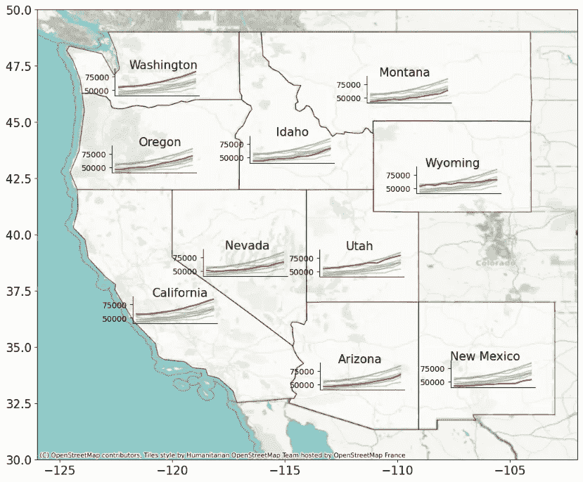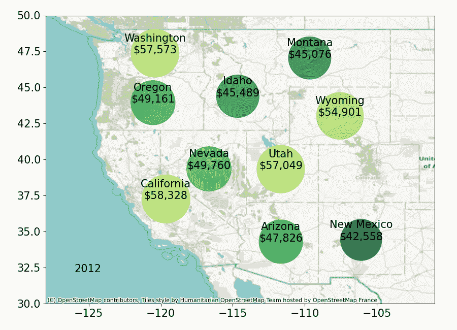

本文中使用 Python 构建的图表示例，以表达地理空间数据的同时变化。图片由作者提供。

本文将指导你使用 Python 代码中的图表和技术来表达地理空间数据的同时变化。

让我们开始吧！！

# 获取数据

## 几何数据

从导入库开始。我们主要使用[GeoPandas](https://geopandas.org/en/stable/)，这是一个有用且易于使用的地理空间数据绘图库。

```py
import numpy as np
import pandas as pd
import geopandas as gpd
import matplotlib.pyplot as plt
import seaborn as sns
%matplotlib inline
```

接下来，可以从[geojson.xyz](https://geojson.xyz/)获取地理空间信息，这是一 个开源网站，提供 GeoJSON 数据用于网页地图示例和实验。

我们将使用的是[美国西部州的边界](https://d2ad6b4ur7yvpq.cloudfront.net/naturalearth-3.3.0/ne_110m_admin_1_states_provinces_shp.geojson)几何数据。下面的代码展示了如何获取 [几何数据](https://geojson.io/#map=2.61/48.23/-119.38)，不包括夏威夷和阿拉斯加。

本区域将是本文的主要区域。如果您想选择不同的州，请随意修改下面的列表。

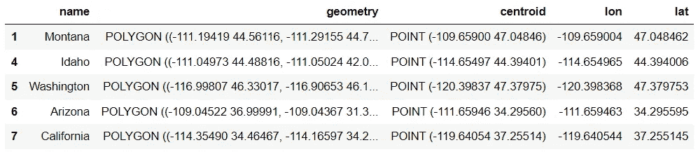

既然我们已有几何图形，让我们绘制地理空间数据。

可以使用 [contextily](https://contextily.readthedocs.io/en/latest/intro_guide.html) 库将基础地图作为背景添加，使图表看起来更真实。方法见下面的代码。

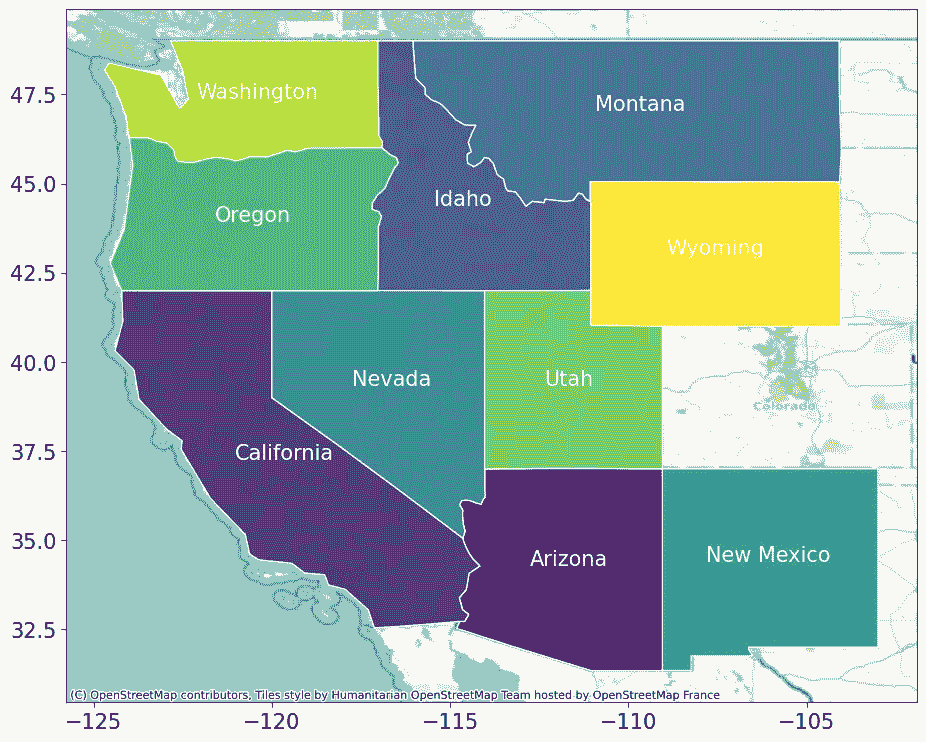

使用 GeoPandas 绘制地理空间数据。图像由作者提供。

## 数据值

为了展示本文中的方法如何应用于实际数据，将使用 [Wikipedia](https://en.wikipedia.org/wiki/List_of_U.S._states_and_territories_by_income) 上的“美国各州和领地按收入分类”信息作为示例，以表达数据值的年度变化。

数据在 [CC BY-SA 4.0 国际许可证](https://en.wikipedia.org/wiki/Wikipedia:Text_of_the_Creative_Commons_Attribution-ShareAlike_4.0_International_License) 下使用。

只需几行代码，信息即可通过 Panda 的 [read_html](https://pandas.pydata.org/docs/reference/api/pandas.read_html.html) 函数下载。请注意，检索到的表格没有来自 2020 年的信息。

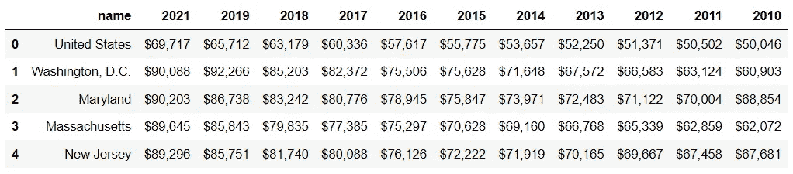

接下来，将获得的 DataFrame 与之前的 DataFrame 合并。

```py
df_m = pd.merge(df, df_w, on='name')
df_m.head()
```

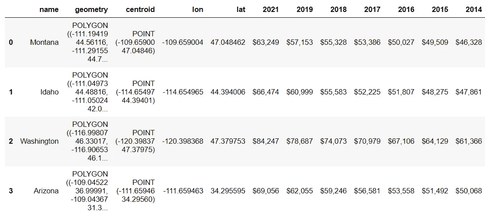

**中位家庭收入**值必须转换为整数，因为获取的数据值是字符串格式。顺便说一下，字符串格式的值用于标注输出图表。

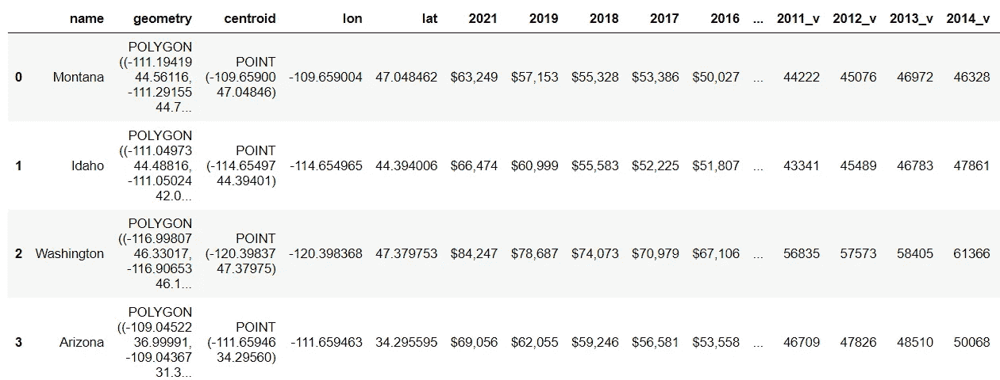

# 可视化

本文将提供 5 个图表创意，用于展示地理空间数据的同步变化。

让我们开始吧！！

## 1\. 使用空间区域和颜色进行地理分层图

地理分层图是一种典型的空间图表，根据地理特征显示颜色。通过结合多个图表，我们可以表达时间上的变化。

从下面的代码开始，循环函数将用于按年份绘制**地理分层图**。除了颜色映射外，标注数据值可以帮助展示**中位收入值**的进展。

请注意，获得的图表将保存在您的计算机上，以便在下一步导入。

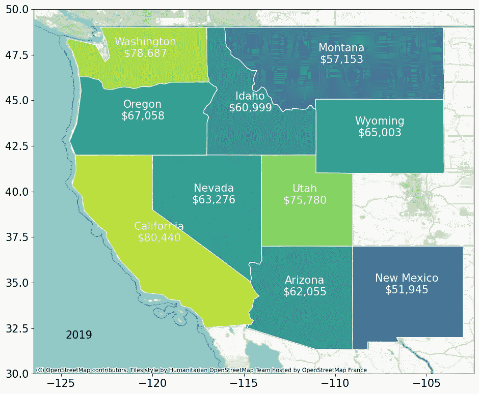

一个地理分层图的示例。图像由作者提供。

现在我们已有多个图表，以下方法是将它们组合在一起的创意。

## **1.1 创建照片拼贴**

第一个想法是将所有图表结合在一起作为照片拼贴。这可以被认为是制作信息图的一个好选择。

让我们定义一个函数来完成任务。我在这个[链接](https://stackoverflow.com/questions/35438802/making-a-collage-in-pil)上找到了一个有用的代码和方法来创建照片拼贴。

接下来，将图表导入并与定义的函数结合。

瞧！！

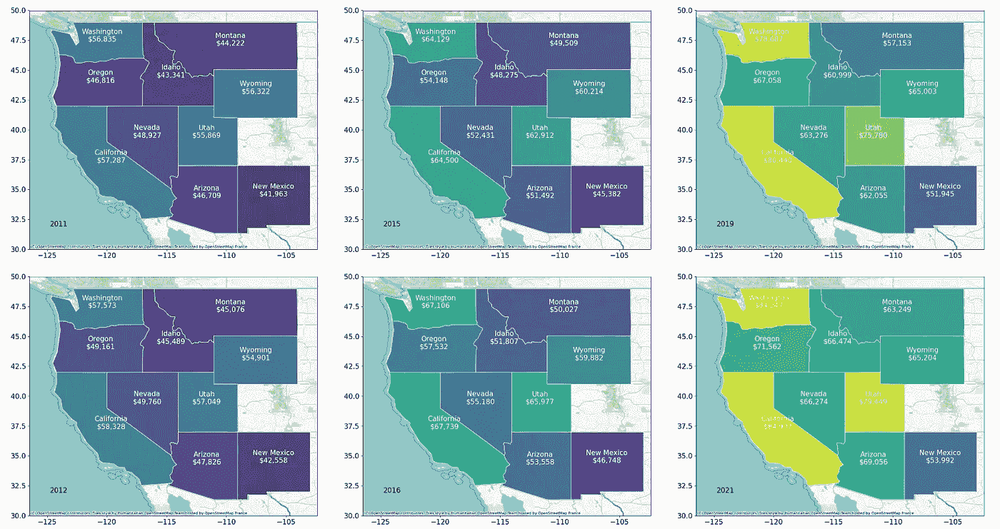

结合分级地图的照片拼贴的一部分。图片由作者提供。

照片拼贴可以展示并帮助比较地理空间数据的同时变化。从结果来看，可以很容易地区分加利福尼亚州的中位数家庭收入最高，而新墨西哥州的收入最低。

## 1.2 创建动画

除了将地图并排放置，我们还可以将它们收集在一起以创建动画。如果你使用的媒体允许以 GIF 文件格式显示动态图像，这可能是一个不错的选择来吸引读者的注意。

哒哒！！

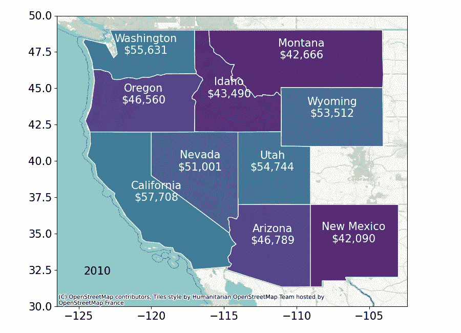

显示地理空间数据同时变化的分级地图动画。图片由作者提供。

## 2\. 使用气泡图比较大小

与之前的方法相同，气泡图中的圆形区域可以用来表示数据值。这些气泡位于州的重心位置，大小会随着年度数据值的变化而变化。

为了后续的颜色映射，我们将提取一个颜色调色板以创建颜色列表。

接下来，使用 Python 的 for-loop 函数绘制每年的气泡图。

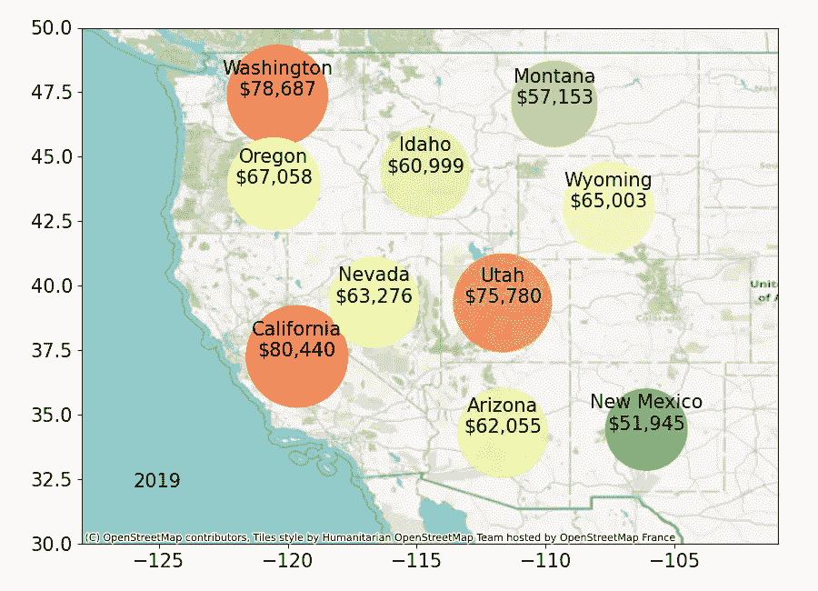

空间图上的气泡图示例。图片由作者提供。

创建气泡图后，我们将它们组合起来以表达空间数据的变化。

## 2.1 创建照片拼贴

使用之前定义的函数来获取照片拼贴。

```py
get_collage(3, 4, 900*3, 650*4,
            ['bubble_'+y+'.png' for y in y_list], 'bubble_collage.png') 
```

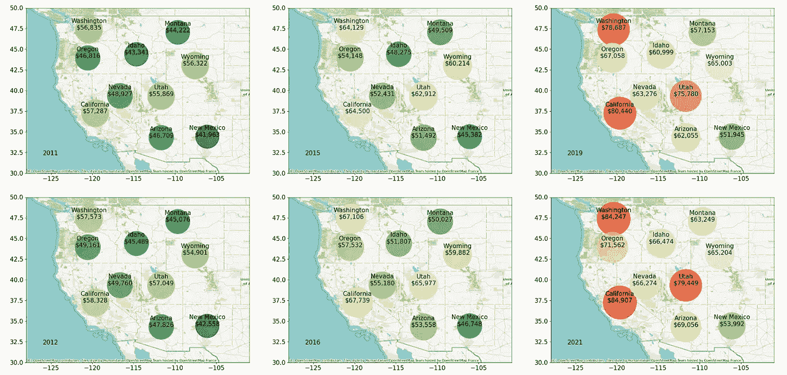

一部分结合了气泡图的照片拼贴。图片由作者提供。

## 2.2 创建动画

将图表组合在一起，创建一个动态图 GIF 文件。

```py
img = [Image.open('bubble_'+y+'.png') for y in y_list]
imageio.mimsave('bubble.gif', img, duration=0.4)
```

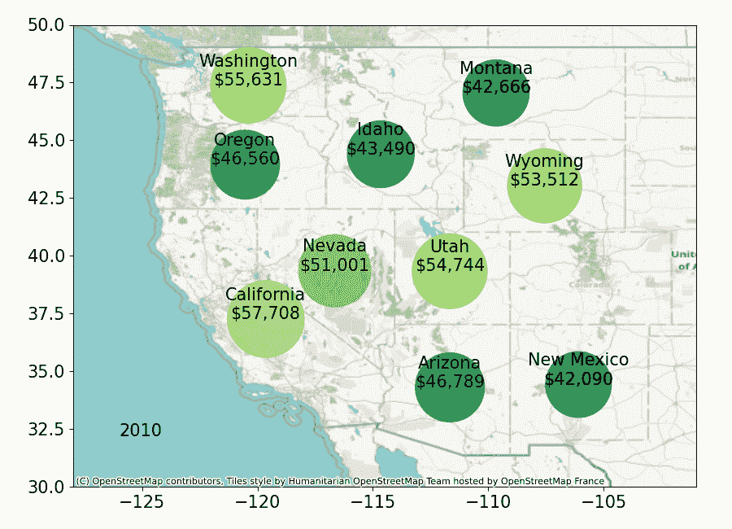

显示地理空间数据同时变化的气泡图动画。图片由作者提供。

与分级地图**相比**，除了标记数据和用颜色映射外，圆形区域也有助于比较空间数据值。我们可以看到圆圈的大小会随时间更新。

## 3\. 使用饼图显示比例

如果目标是局部比较数据值，可以使用饼图来方便阅读，因为它们能够显示每个位置与其他位置的比例。

为了让每个位置的数据更加突出，诀窍是将每个位置的片段与其他部分分开。这将有助于更容易地区分比例。可以在下面的代码中看到设置的‘explode’参数。

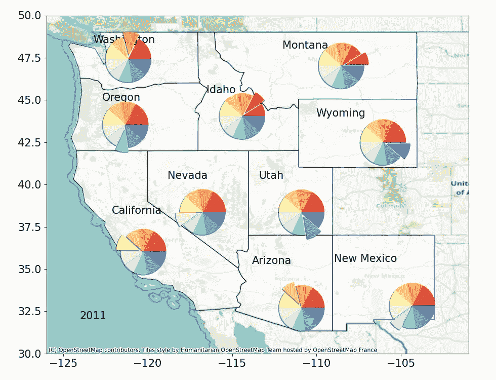

空间图上的饼图示例。图像由作者提供。

## 创建照片拼贴

让我们结合结果。

```py
get_collage(3, 4, 980*3, 750*4,
            ['pie_'+ y +'.png' for y in y_list],
            'pie_collage.png')
```

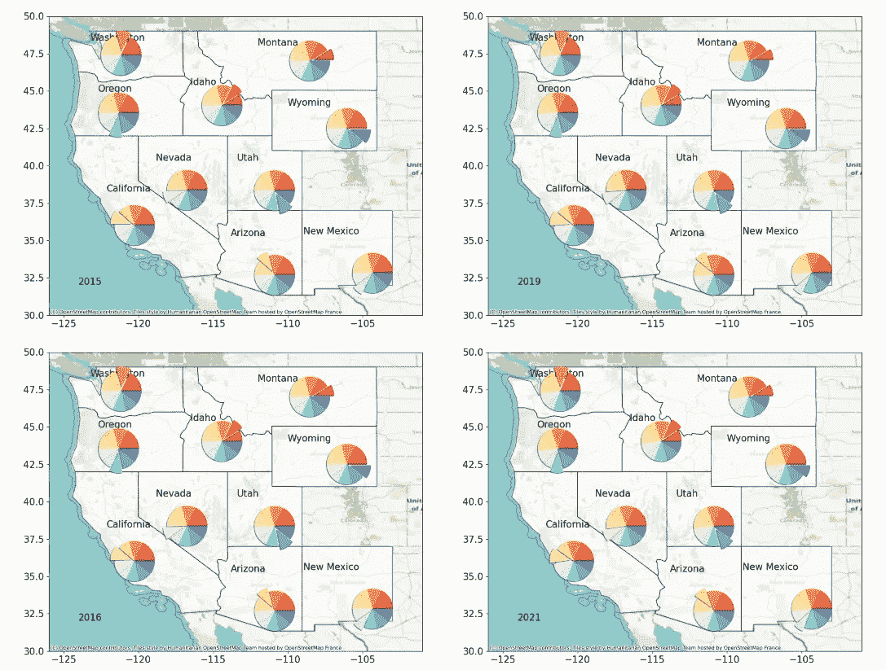

一个结合饼图的照片拼贴部分。图像由作者提供。

创建动画也可以使用之前提到的方法，如区域图和气泡图所示。

## 4\. 使用柱状图简化事物

到目前为止，之前提到的技术都是将多个图表结合起来。它们需要作为照片拼贴或动画组合在一起。当需要一个简单的单一图表时，这可能是一个限制。

没问题！！

一个简单的单一图表也可以满足需求。通过应用柱状图，所有内容可以绘制在一个图表中。主要概念是每个位置都有自己的柱状图，每根柱子代表每年的值。颜色映射将用于帮助比较柱子的数值。

这种方法可以作为本文中区域图和气泡图的替代选项。

哒哒！！

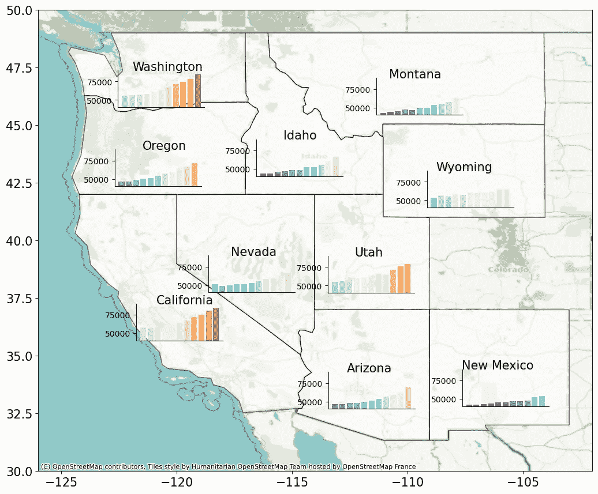

在空间图上绘制多个柱状图。图像由作者提供。

## 5\. 使用折线图处理时间序列数据

实际上，我们拥有的年度数据是时间序列数据。我们可以应用多条折线图来表示随时间变化的情况。其他位置的数据轮廓可以局部展示，以便于阅读并帮助比较数值。

这种方法可以作为本文中饼图的替代选项，因为它有助于关注每个位置的数据，同时能够与其他数据进行比较。


在空间图上绘制多条折线图以表示时间序列数据。图像由作者提供。

# 总结

首先，让我们总结一下本文提到的每个图表。

1.  区域图

1.  气泡图

1.  饼图

1.  柱状图

1.  折线图

如果我们仔细查看这些图表，大多数只是普通图表，没有什么复杂的。主要思想是应用它们的简洁性来展示复杂的情境：多个位置随时间的同步数据值变化。

> “从杂乱中寻找简洁” — **阿尔伯特·爱因斯坦**

最后，我非常确定对于这种数据可以有其他图表。本文的主要目的是提供一些思路，文中解释的图表只是示例。

如果您想分享或有任何建议，请随时留言。

感谢阅读。

这里有一些我关于数据可视化的文章，您可能会感兴趣：

+   使用 Python 处理多变量分类数据的 7 种可视化方法 ([link](https://medium.com/towards-data-science/7-visualizations-with-python-to-handle-multivariate-categorical-data-63158db0911d))

+   使用 Python 处理多个时间序列数据的 8 种可视化方法 (link)

+   7 个使用 Python 的可视化图表，用于表达排名随时间的变化 (link)

+   9 个使用 Python 的可视化图表，用于显示比例或百分比，替代饼图 (link)

+   9 个使用 Python 的可视化图表，比条形图更吸引注意 (link)

# 参考文献

+   *Geojson-XYZ*. GitHub. (无日期). [`github.com/geojson-xyz`](https://github.com/geojson-xyz)

+   *什么是地理空间数据？*. IBM. (无日期). [`www.ibm.com/topics/geospatial-data`](https://www.ibm.com/topics/geospatial-data)

+   维基媒体基金会. (2023 年 10 月 17 日). *按收入列出的美国州和领土*. 维基百科. [`en.wikipedia.org/wiki/List_of_U.S._states_and_territories_by_income`](https://en.wikipedia.org/wiki/List_of_U.S._states_and_territories_by_income)

+   *contextily 的简介指南*. contextily 1.1.0 文档中的简介指南. (无日期). [`contextily.readthedocs.io/en/latest/intro_guide.html`](https://contextily.readthedocs.io/en/latest/intro_guide.html)

+   维基媒体基金会. (2023 年 8 月 13 日). *分级统计地图*. 维基百科. [`en.wikipedia.org/wiki/Choropleth_map`](https://en.wikipedia.org/wiki/Choropleth_map)
