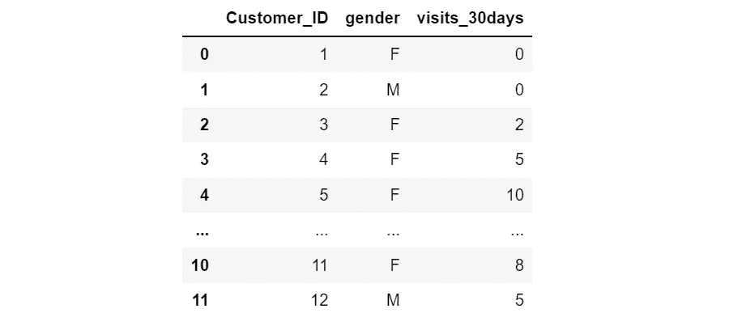
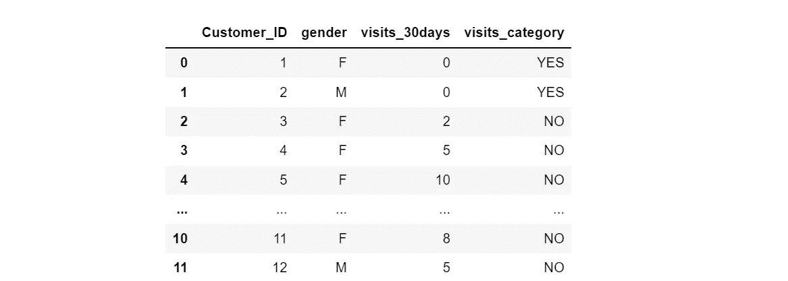
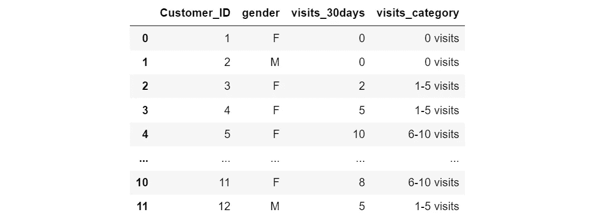

# 在 Pandas 中应用 if-else 条件语句的 5 种方法

> 原文：[`towardsdatascience.com/5-ways-to-apply-if-else-conditional-statements-in-pandas-b9627e5f475b`](https://towardsdatascience.com/5-ways-to-apply-if-else-conditional-statements-in-pandas-b9627e5f475b)

## 重新审视 Pandas 基础知识并提升你的数据处理技能

[](https://medium.com/@insightsbees?source=post_page-----b9627e5f475b--------------------------------)[](https://towardsdatascience.com/?source=post_page-----b9627e5f475b--------------------------------) [My Data Talk](https://medium.com/@insightsbees?source=post_page-----b9627e5f475b--------------------------------)

·发表于 [Towards Data Science](https://towardsdatascience.com/?source=post_page-----b9627e5f475b--------------------------------) ·阅读时间 5 分钟·2023 年 1 月 6 日

--


图片由 [muxin alkayis](https://pixabay.com/users/muxin25-17301468/?utm_source=link-attribution&utm_medium=referral&utm_campaign=image&utm_content=5364820) 提供，来源于 [Pixabay](https://pixabay.com//?utm_source=link-attribution&utm_medium=referral&utm_campaign=image&utm_content=5364820)

在 Pandas 数据框中创建新列或修改现有列——基于一组 `if-else` 条件——可能是所有数据处理任务中最常遇到的问题之一。在这篇文章中，我想与大家分享我的笔记本，总结了在 Pandas 数据框中应用 `if-else` 条件语句的 5 种流行方法，并附有实用的代码片段。为简便起见，我创建了一个小的示例数据集，并将在整个教程中使用它进行演示。

假设我们有一个如下所示的 Pandas 数据框。列 ‘visits_30days’ 显示了客户在过去 30 天内访问网站的次数。我们希望创建一个新列，将这些客户分类为‘非访问者’或‘访问者’（一种二元分类），或者将他们分类为多个类别，如 ‘0 次访问’，‘1–5 次访问’，‘6-10 次访问’等。我们将把这个新列命名为 ‘visits_category’。



作者提供的图片

## 方法 1：使用 **numpy.where()** 函数

`numpy.where()` 函数是一个优雅而高效的 Python 函数，你可以用它来基于‘真’或‘假’的 **二元** 条件添加新列。语法如下：

```py
np.where(condition, value if condition is true, value if condition is false)
```

将该语法应用于我们的数据框中，我们的代码将如下所示。新列 ‘visits_category’ 的值为 ‘Yes’ 或 ‘No’，这取决于 ‘visits_30days’ 列的值是否等于 0。

```py
import pandas as pd
import numpy as np
df['visits_category'] = np.where(df['visits_30days']== 0, 'YES', 'NO')
```



图片来源于作者

## **方法 2：使用 lambda 函数**

像 `np.where()` 一样，当你需要基于简单的二元 `if-else` 条件添加列时，`lambda` 函数是另一个极好的选择。使用 `lambda` 函数的通用代码结构如下：

```py
df['new column name'] = df['column name'].apply(lambda x: 'value if condition is true' if x condition else 'value if condition is false')
```

对于我们的具体示例，代码将如下所示：

```py
df['visits_category'] = df['visits_30days'].apply(lambda x: 'YES' if x == 0 else 'NO')
```

## 方法 3：使用 numpy.select() 函数

现在，让我们进入一个更复杂的场景。假设我们想为‘visits_category’创建多个类别，并涉及多个条件。你不能通过使用 `np.where()` 实现它。相反，你可以使用 `np.select()` 来应用更复杂的条件。

首先，创建一个 Python `list`，按顺序指定你的条件，以确定哪些条件需要首先执行、其次执行等。

```py
#Create a python list to specify all the conditions
conditions = [
    (df['visits_30days'] == 0),
    (df['visits_30days'] > 0) & (df['visits_30days'] <= 5),
    (df['visits_30days'] > 5) & (df['visits_30days'] <= 10),
    (df['visits_30days'] > 10)
    ]
```

接着，创建一个包含我们想要分配给每个条件的值的 Python `list`。确保每个值对应于第一步中创建的条件。

```py
#create a python list of values to be assigned to the conditions
values = ['0 visits', '1-5 visits', '6-10 visits', '>10 visits']
```

最后，使用 `np.select()` 创建新列，传入之前创建的两个 `lists` 作为参数。

```py
# use np.select() to create a new column
df['visits_category'] = np.select(conditions, values)
```

将这三段代码结合在一起，你会得到以下结果：

```py
df['visits_category'] = np.select([
    (df['visits_30days'] == 0),
    (df['visits_30days'] > 0) & (df['visits_30days'] <= 5),
    (df['visits_30days'] > 5) & (df['visits_30days'] <= 10),
    (df['visits_30days'] > 10)
    ], ['0 visits', '1-5 visits', '6-10 visits', '>10 visits'])
```



图片来源于作者

## 方法 4：使用 Pandas `apply()` 函数

使用这种方法，我们可以首先定义一个指定条件的函数。然后，将该函数应用到列上（`axis=1`）。

```py
def conditions(row):
    if row['visits_30days'] == 0:
        val = '0 visits'
    elif row['visits_30days'] >0 & row['visits_30days']<=5:
        val = '1-5 visits'
    elif row['visits_30days'] >5 & row['visits_30days']<=10:
        val = '5-10 visits'  
    elif row['visits_30days'] >10:
        val = '>10 visits'  
    else:
        val = 'NA'
    return val

#Apply the function to each data point in the data frame
df['visits_category']= df.apply(conditions, axis=1)
```

## 方法 5：使用 DataFrame.loc()

Pandas `DataFrame.loc()` 通过标签选择 `DataFrame` 中的行和列。例如，在下面的代码中，第一行代码选择了 `dataframe` 中 `visits_30days` 值为零的行，并将 ‘0 visits’ 分配给新列 ‘visits_category’，仅对符合该特定条件的行进行操作。然后，你对其他条件也做同样的操作。

```py
df.loc[(df['visits_30days'] == 0), 'visits_category'] = '0 visits' 
df.loc[(df['visits_30days'] > 0) & (df['visits_30days'] <= 5), 'visits_category'] = '1-5 visits' 
df.loc[(df['visits_30days'] > 5) & (df['visits_30days'] <= 10), 'visits_category'] = '5-10 visits'  
df.loc[(df['visits_30days'] > 10) , 'visits_category'] = '>10 visits' 
```

学习和总结最常见的 pandas 数据清洗技术一直是我日常数据科学家工作中的有趣且有帮助的练习。数据清洗是数据科学家日常工作中的一个重要环节，占据了数据分析项目近 80% 的时间。身边有一个记事本，将你最喜欢的代码片段分类和总结，是提高工作效率的好方法。希望你喜欢本教程，谢谢阅读。

**数据来源：** 本教程使用的样本数据集由作者创建，用于演示目的。

你可以通过这个 [推荐链接](https://medium.com/@insightsbees/membership) 注册 Medium 会员（每月 5 美元）来解锁我所有的写作内容和 Medium 的其余部分。通过这个链接注册，我将获得你会员费的一部分，而你无需额外支付费用。谢谢！
