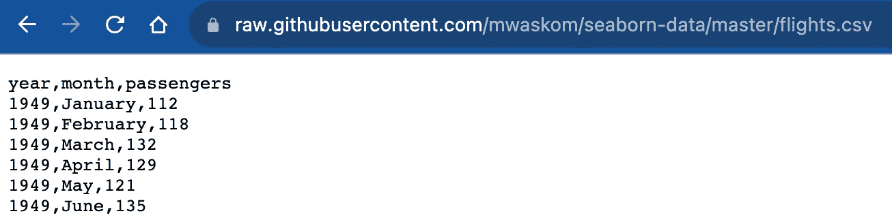
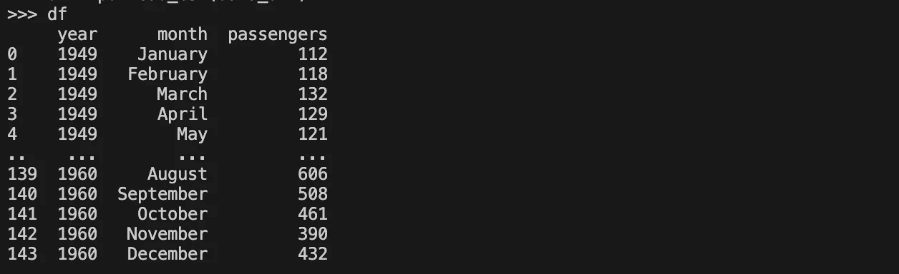

# 6 个你应该了解的与索引相关的 Pandas 操作

> 原文：[`towardsdatascience.com/6-common-index-related-operations-you-should-know-about-pandas-783fdba59768`](https://towardsdatascience.com/6-common-index-related-operations-you-should-know-about-pandas-783fdba59768)

## 在数据框中有效地处理索引

[](https://yongcui01.medium.com/?source=post_page-----783fdba59768--------------------------------)[](https://towardsdatascience.com/?source=post_page-----783fdba59768--------------------------------) [Yong Cui](https://yongcui01.medium.com/?source=post_page-----783fdba59768--------------------------------)

·发表于 [Towards Data Science](https://towardsdatascience.com/?source=post_page-----783fdba59768--------------------------------) ·阅读时间 9 分钟·2023 年 10 月 17 日

--


图片由 [Alejandro Luengo](https://unsplash.com/@aluengo91?utm_source=medium&utm_medium=referral) 提供，来源于 [Unsplash](https://unsplash.com/?utm_source=medium&utm_medium=referral)

想象一下，你有一个装满成千上万本书的图书馆，每本书都包含大量信息。为了找到你需要的确切书籍，你会查看图书馆的索引（如果有的话），对吧？在处理实际数据时，拥有一个类似图书馆的索引对于你筛选大量数据、准确找到所需信息而无需翻遍每一部分是至关重要的。

在这篇文章中，我将分享一些常见但重要的与索引相关的操作，通过简单的适用场景来拆解这些操作。无论你是数据新手还是经验丰富的专业人士，你将很快看到这些操作如何成为你数据的最佳伙伴。

不再赘述，开始吧。

> 简单说明一下，在数据框中，行和列都被视为索引，但在大多数数据操作中，我们通常只将行视为感兴趣的索引，因为许多数据集以宽格式呈现——每一行代表一个数据记录，每一列代表数据记录的不同方面。
> 
> 在这篇文章中，我们将重点处理沿行操作索引。也就是说，每个索引项对应一行。

## 1. 设置索引

常见的数据操作从导入数据开始，比如 CSV 文件。下面的截图展示了来自 GitHub 的在线数据源。



本博客文章使用的源数据（由作者提供的截图）

当你导入这个文件时，你会看到一个“额外”的没有名称的列出现在我们在源文件中看到的三个列之前。

```py
# Read raw data online
import pandas as pd

data_url = "https://raw.githubusercontent.com/mwaskom/seaborn-data/master/flights.csv"
df = pd.read_csv(data_url)
df
```



从源读取的数据框显示索引

自动生成的索引从 0 开始，并为每个附加行递增 1。你可以通过调用以下方法访问索引：

```py
>>> df.index
RangeIndex(start=0, stop=144, step=1)
```

如果你在之前知道数据结构，在本例中，数据集具有年和月作为数据的唯一标识符。你可以在读取数据时将这两列设置为索引，如下所示：

```py
>>> df = pd.read_csv(data_url, index_col=["year", "month"])
>>> df
                passengers
year month                
1949 January           112
     February          118
     March             132
     April             129
     May               121
...                    ...
1960 August            606
     September         508
     October           461
     November          390
     December          432

[144 rows x 1 columns]
```

请注意，由于我们将两个列设置为索引，我们正在创建一个使用多重索引的数据框：

```py
>>> df.index
MultiIndex([(1949,   'January'),
            (1949,  'February'),
            (1949,     'March'),
            (1949,     'April'),
            (1949,       'May'),
            (1949,      'June'),
            (1949,      'July'),
            (1949,    'August'),
            (1949, 'September'),
            (1949,   'October'),
            ...
            (1960,     'March'),
            (1960,     'April'),
            (1960,       'May'),
            (1960,      'June'),
            (1960,      'July'),
            (1960,    'August'),
            (1960, 'September'),
            (1960,   'October'),
            (1960,  'November'),
            (1960,  'December')],
           names=['year', 'month'], length=144)
```

由于多重索引不是本文的重点，我不会在这里过多讨论。然而，如果你对多重索引感兴趣，请参考[我之前的文章](https://medium.com/p/e6aec29ee6d8)。

## 2\. 重置索引

让我们继续讨论具有多重索引的数据框。因为我们中的许多人不太习惯多重索引，我们仍然希望使用单一标量索引。为此，我们可以重置索引，如下所示：

```py
>>> df = df.reset_index()
>>> df
     year      month  passengers
0    1949    January         112
1    1949   February         118
2    1949      March         132
3    1949      April         129
4    1949        May         121
..    ...        ...         ...
139  1960     August         606
140  1960  September         508
141  1960    October         461
142  1960   November         390
143  1960   December         432

[144 rows x 3 columns]
```

从输出中，你可以看出我们现在使用的是基于 0 的索引。对于`reset_index`函数，它有一个参数`drop`，默认设置为`False`，以通过将原始索引转换为列来保留原始索引。然而，有时你可能希望丢弃原始索引，例如在合并/组合数据框时。

```py
>>> df1 = df.copy()
>>> combined_df = pd.concat([df, df1])
>>> combined_df.index
Index([  0,   1,   2,   3,   4,   5,   6,   7,   8,   9,
       ...
       134, 135, 136, 137, 138, 139, 140, 141, 142, 143],
      dtype='int64', length=288) 
```

如上所示的简单示例，合并的数据框具有由两个数据框的索引组成的索引（顺便提一下，Pandas 允许索引中有重复值）。在大多数情况下，我们不希望索引中有重复项，因此我们希望重置索引，如下所示。

```py
>>> combined_df.reset_index(drop=False)
     index  year      month  passengers
0        0  1949    January         112
1        1  1949   February         118
2        2  1949      March         132
3        3  1949      April         129
4        4  1949        May         121
..     ...   ...        ...         ...
283    139  1960     August         606
284    140  1960  September         508
285    141  1960    October         461
286    142  1960   November         390
287    143  1960   December         432

[288 rows x 4 columns]
>>> combined_df.reset_index(drop=True)
     year      month  passengers
0    1949    January         112
1    1949   February         118
2    1949      March         132
3    1949      April         129
4    1949        May         121
..    ...        ...         ...
283  1960     August         606
284  1960  September         508
285  1960    October         461
286  1960   November         390
287  1960   December         432

[288 rows x 3 columns]
```

在上述代码片段中，我展示了当`drop`设置为`False`（默认值）和`True`时的对比。正如你所见，在这种情况下，理想的操作是后者——丢弃原始索引。

## 3\. 使用索引选择数据

我们已经学习了如何设置和重置索引，但我们可以用索引做些什么呢？正如你可能已经注意到的，索引标记了数据的位置，作为每行的标识符，因此第一个用途是使用索引进行数据选择。

在使用索引进行数据选择时，最常用的方法是使用`iloc`方法。以下代码演示了如何选择单行数据。

```py
>>> df.iloc[0]
year             1949
month         January
passengers        112
Name: 0, dtype: object
>>> df.iloc[1, :]
year              1949
month         February
passengers         118
Name: 1, dtype: object
```

如上所示，你可以使用一个数字——在本例中，0 选择了第一行，或者你可以使用一个数字和： （选择所有列）。如果你想选择一个或一个子集的列，你需要指定列的索引：

```py
>>> df.iloc[2, 0]
1949
>>> df.iloc[2, :2]
year      1949
month    March
Name: 2, dtype: object
```

在上述示例中，`iloc[2, 0]`选择了第 3 行第 1 列的数据。请注意，行和列都使用基于 0 的索引。代码`iloc[2, :2]`选择第 3 行和前两个列（第 0 列和第 1 列）—就像其他 Python 切片操作一样，结束索引（在本例中为 2）是不包括在内的。

另一个需要了解的事情是，当你有许多列时，通过计数来找出感兴趣列的索引可能会很繁琐。幸运的是，我们可以使用以下解决方案：

```py
>>> df.iloc[2:5, df.columns.get_loc("month")]
2    March
3    April
4      May
Name: month, dtype: object
```

## 4\. 使用索引合并数据

当你处理多个数据框时，你通常需要合并数据以进行后续处理。虽然你可以使用各种方法进行合并操作，如`merge`、`join`、`combine`和`concat`，但最通用的方法是`merge`。

在我的日常数据处理工作中，我大多使用命名列来进行`merge`。以下是一个代码示例。我们通过将现有年份加 11 来创建了一些模拟数据，并使用了`“year”`和`“month”`进行合并。

```py
>>> df2 = df.copy()
>>> df2["year"] = df2["year"] + 11
>>> df.merge(df2, on=["year", "month"])
    year      month  passengers_x  passengers_y
0   1960    January           417           112
1   1960   February           391           118
2   1960      March           419           132
3   1960      April           461           129
4   1960        May           472           121
5   1960       June           535           135
6   1960       July           622           148
7   1960     August           606           148
8   1960  September           508           136
9   1960    October           461           119
10  1960   November           390           104
11  1960   December           432           118
```

但是，`merge`方法也支持基于索引的合并。以下是一个示例。

```py
>>> df.merge(df2, left_index=True, right_index=True)
     year_x    month_x  passengers_x  year_y    month_y  passengers_y
0      1949    January           112    1960    January           112
1      1949   February           118    1960   February           118
2      1949      March           132    1960      March           132
3      1949      April           129    1960      April           129
4      1949        May           121    1960        May           121
..      ...        ...           ...     ...        ...           ...
139    1960     August           606    1971     August           606
140    1960  September           508    1971  September           508
141    1960    October           461    1971    October           461
142    1960   November           390    1971   November           390
143    1960   December           432    1971   December           432

[144 rows x 6 columns]
```

如上所示，我们通过将`True`设置为`left_index`和`right_index`来指定使用索引。这种方式，我们得到一个合并后的数据框，其索引与单个数据框相同。

## 5\. 导出数据时包括/排除索引

当我们与合作伙伴一起工作时，我们需要共享数据集。数据的一种常见格式是 CSV 格式。因此，我们需要将数据框导出为 CSV 文件，如下所示：

```py
>>> df.to_csv("exported_df.csv")
>>> with open("exported_df.csv") as file:
...     some_data = file.read(110)
... 
>>> print(some_data)
,year,month,passengers
0,1949,January,112
1,1949,February,118
2,1949,March,132
3,1949,April,129
4,1949,May,121
```

如上面的代码片段所示，我们使用`to_csv`方法创建一个 CSV 文件。你可能会注意到，当我们读取 CSV 文件时，我们发现 CSV 文件中有一个额外的列，除了我们开始时的 3 列。很容易看出，额外的列就是索引。也就是说，当你将数据框导出到 CSV 文件时，默认情况下会导出索引。然而，如果包含这个索引列可能会让其他人感到困惑，因此你可以通过以下方法覆盖默认行为：

```py
>>> df.to_csv("exported_df_no_index.csv", index=False)
>>> with open("exported_df_no_index.csv") as file:
...     other_data = file.read(110)
... 
>>> print(other_data)
year,month,passengers
1949,January,112
1949,February,118
1949,March,132
1949,April,129
1949,May,121
1949,June,
```

从打印输出中，你可以看出索引已经从导出的 CSV 文件中移除。这是因为我们在`to_csv`方法调用中将索引参数设置为 False。此设置指示不要在导出的文件中包含索引。

## 6\. 在 Groupby 操作中将索引转换为列

当你汇总数据时，一种常见的方法是使用`groupby`方法。例如，在数据框中，我们想要找出每年的乘客总数，如下所示：

```py
>>> total_passengers = df.groupby("year")["passengers"].sum()
>>> total_passengers
year
1949    1520
1950    1676
1951    2042
1952    2364
1953    2700
1954    2867
1955    3408
1956    3939
1957    4421
1958    4572
1959    5140
1960    5714
Name: passengers, dtype: int64
```

如上所示，我们通过按年份分组数据来计算乘客总数。你可能没有注意到的一点是，输出的`total_passengers`是`Series`格式。

```py
>>> type(total_passengers)
<class 'pandas.core.series.Series'>
```

如你所知，`Series`与其他数据框一起使用时并不是最佳选择。因此，如果我们能在 Groupby 操作中获得数据框作为输出，通常会更为理想。以下展示了如何操作：

```py
>>> total_passengers1 = df.groupby("year", as_index=False)["passengers"].sum()
>>> total_passengers1
    year  passengers
0   1949        1520
1   1950        1676
2   1951        2042
3   1952        2364
4   1953        2700
5   1954        2867
6   1955        3408
7   1956        3939
8   1957        4421
9   1958        4572
10  1959        5140
11  1960        5714
>>> type(total_passengers1)
<class 'pandas.core.frame.DataFrame'>
```

在`groupby`方法调用中，我们只是简单地将`as_index`设置为`False`，这意味着我们不希望使用分组变量作为结果数据框。使用这种数据框输出，操作会更简单。

## 结论

在本文中，我们回顾了与数据框中的索引相关的最常见的 6 个操作。希望你觉得这篇文章有用。

想了解更多关于 Python 和 Pandas 的内容吗？请考虑订阅我的电子邮件通讯。如果你想系统地提升你的 Python 技能，请查看 Manning 出版的我的新书 [Python How-To](https://www.manning.com/books/python-how-to)。
