# 数据科学代码中需避免的 6 个常见错误

> 原文：[`towardsdatascience.com/6-common-mistakes-to-avoid-in-data-science-code-d0fc38f96594`](https://towardsdatascience.com/6-common-mistakes-to-avoid-in-data-science-code-d0fc38f96594)

## 以及如何克服这些问题

[](https://khuyentran1476.medium.com/?source=post_page-----d0fc38f96594--------------------------------)[](https://towardsdatascience.com/?source=post_page-----d0fc38f96594--------------------------------) [Khuyen Tran](https://khuyentran1476.medium.com/?source=post_page-----d0fc38f96594--------------------------------)

·发表于 [Towards Data Science](https://towardsdatascience.com/?source=post_page-----d0fc38f96594--------------------------------) ·阅读时间 10 分钟·2023 年 12 月 21 日

--

# 动机

数据科学家通常在迭代和探索性环境中工作。因此，常常关注快速结果而非创建可维护或可扩展的代码。

然而，数据科学家必须避免编写糟糕的代码，原因如下：

1.  **减少代码可读性：** 编写不佳的代码可能难以阅读和理解，使得原作者和其他团队成员在未来维护或修改代码时变得更加困难。

1.  **增加引入错误的机会：** 结构不良或效率低下的代码更容易出错，可能影响分析或模型的准确性。

1.  **集成挑战：** 编写不佳的代码可能会阻碍与生产系统的集成，以及向其他团队成员（包括数据工程师和机器学习工程师）的交接。

在数据科学项目中编写更好的代码至关重要，需要认识和解决常见的糟糕实践，包括：

1.  过度使用 Jupyter Notebooks

1.  模糊的变量名

1.  冗余代码

1.  重复的代码段

1.  频繁使用全局变量

1.  缺乏适当的代码测试


除非另有说明，所有图片均由作者提供

这些糟糕的实践使得代码的可读性、可重用性和可维护性降低。

为了说明这些问题，我们将研究在 Kaggle 竞赛中参与的[*我如何在 Kaggle 竞赛中进入前 0.3%*](https://www.kaggle.com/code/lavanyashukla01/how-i-made-top-0-3-on-a-kaggle-competition#Feature-Engineering)笔记本，该竞赛是[*房价 — 高级回归技术*](https://www.kaggle.com/competitions/house-prices-advanced-regression-techniques)。

我选择了这个笔记本，因为它展示了与我合作过的数据科学家的代码中常见错误相似的编码实践。通过检查这个笔记本，我们可以获得有关数据科学家应避免的陷阱的宝贵见解。

# Jupyter 笔记本的过度使用

## 问题

Jupyter 笔记本提供了一个交互式的代码执行、可视化和即时反馈环境，使其在探索性分析和概念验证中非常有价值。

然而，由于多种原因，数据科学家不适合将 Jupyter 笔记本用于生产相关任务，例如特征工程和模型训练。

**单元格执行中的依赖性问题**

首先，一些单元格可能依赖于之前单元格的输出，以不同的顺序执行可能会导致依赖单元格中的错误或不一致。

在提供的示例中，在执行第 16 个单元格之前执行第 18 个单元格会导致两个异常值被移除。

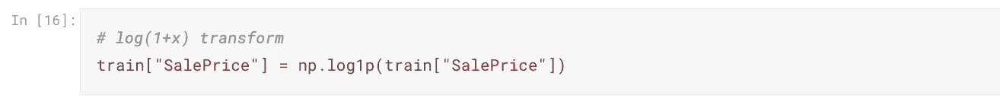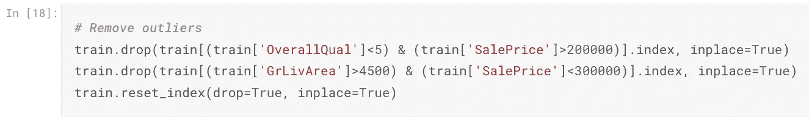

> 丢弃的行数：2

然而，在第 16 个单元格之前执行第 18 个单元格会导致三个异常值被移除。


> 丢弃的行数：3

**性能问题**

其次，笔记本经常包含可视化和分析代码以及生产代码。这种将代码混合在一个笔记本中的做法可能会导致资源密集型任务，从而对生产系统的性能产生负面影响。

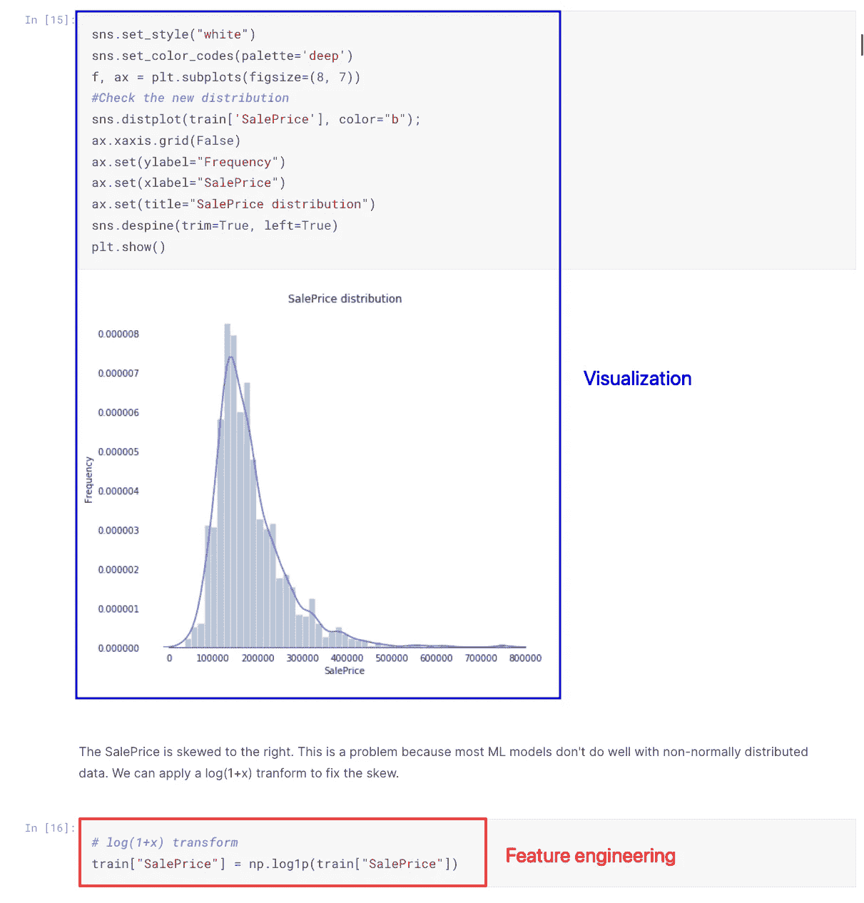

## 解决方案

用笔记本进行 EDA 和分析，同时使用 Python 脚本进行特征工程和机器学习模型训练。

为了进一步组织你的项目，在特征工程之前创建一个数据分析的笔记本，而在特征工程之后创建另一个分析中间数据的笔记本。

```py
.
├── data/
│   ├── raw
│   ├── intermediate
│   └── final
├── notebooks/
│   ├── pre_processing.ipynb
│   └── post_processing.ipynb
└── src/
    ├── __init__.py
    ├── process_data.py
    └── train_model.py
```

这种方法可以在各种项目中使用 Python 脚本，同时保持笔记本的清洁和有序。

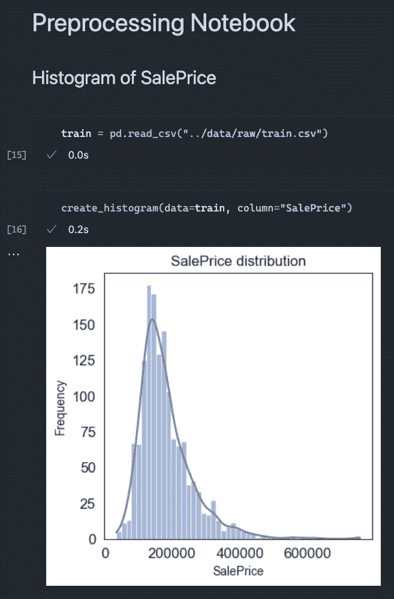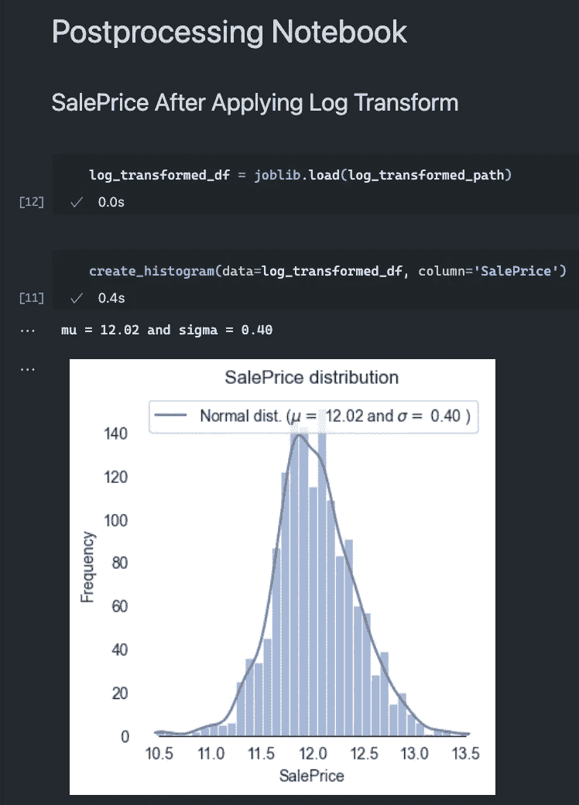

# 模糊的变量名

## 问题

在以下代码片段中，变量`res`、`ls`、`l`和`m`的含义不明确，使得审阅者难以理解代码的逻辑，并可能导致变量的误用。

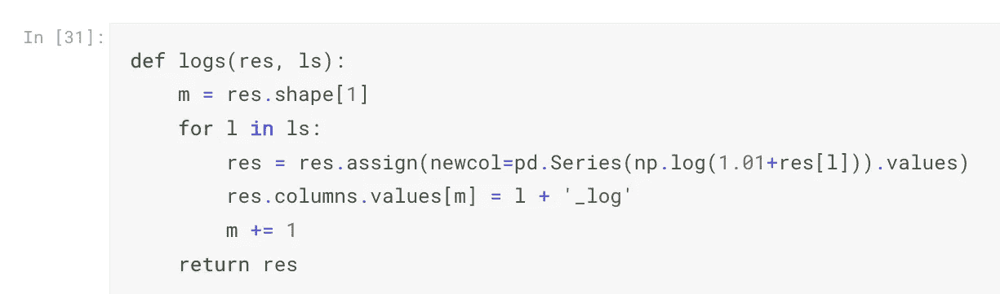

## 解决方案

使用描述性和有意义的变量名，以传达变量的目的和内容。

```py
def add_log_transform_columns(data, columns):
    num_columns = data.shape[1]
    for column in columns:
        transformed_column = pd.Series(np.log(1.01 + data[column])).values
        data = data.assign(new_column=transformed_column)
        data.columns.values[num_columns] = column + '_log'
        num_columns += 1
    return data
```

# 冗余代码

## 问题

**降低代码可读性**

冗余代码会降低代码的可读性。

在笔记本中，`YrSold`列在整数和字符串类型之间进行不必要的转换。

最初，`YrSold`列被表示为整数：

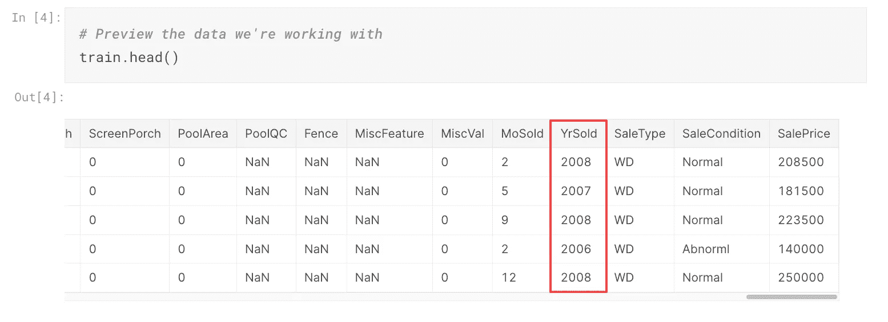

随后，代码将`YrSold`列转换为字符串：

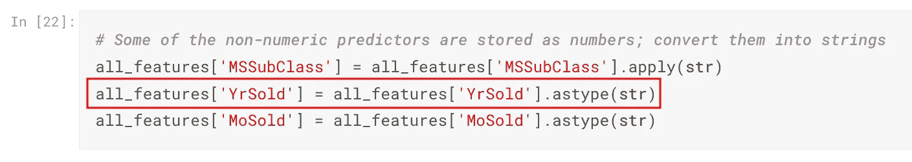

然后，`YrSold` 列暂时被转换回整数：

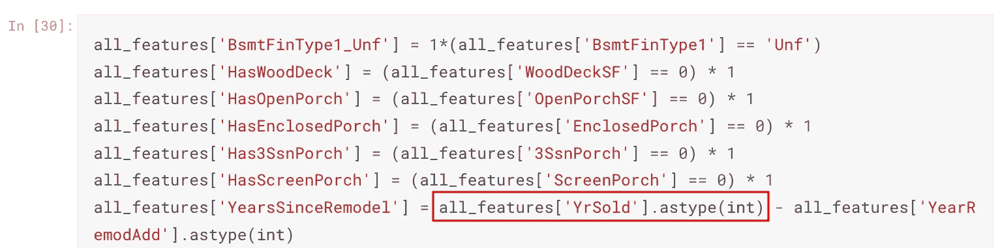

最后，`YrSold` 列以及其他分类列使用独热编码转换回整数：

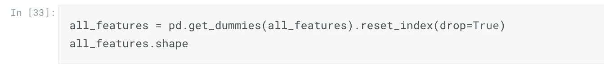

```py
all_features.filter(regex="YrSold").dtypes
"""
YrSold_2006    int64
YrSold_2007    int64
YrSold_2008    int64
YrSold_2009    int64
YrSold_2010    int64
"""
```

这些不必要的转换会使得作者和维护者难以跟踪列的数据类型，从而可能导致列的错误使用。

**负面性能影响**

多余的代码也会通过引入不必要的计算开销影响性能。

在提供的代码中，作者不必要地使用 `pd.DataFrame(df)` 两次来创建两个 DataFrame 的副本。然而，创建 DataFrame 的副本是不必要的，因为目标只是为了获取列名。

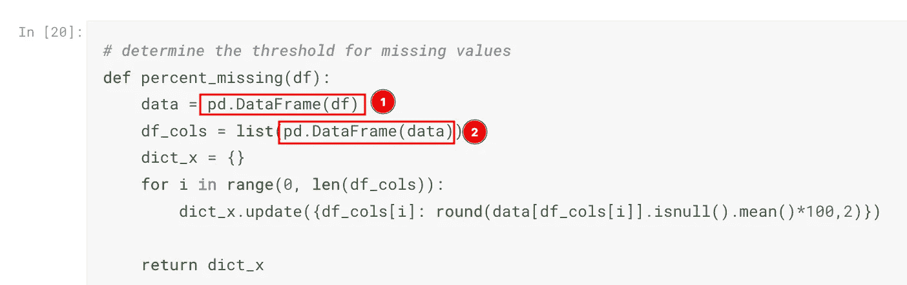

如果原始 DataFrame 很大，创建新的 DataFrame 可能会计算开销很大。

## 解决方案

保持你的代码简洁明了。删除那些对程序没有价值的多余代码行。

例如，我们可以将上述代码重写为直接从原始 DataFrame 中获取列。

```py
import pandas as pd

def percent_missing(df):
    columns = list(df)
    dict_x = {}
    for i in range(0, len(columns)):
        dict_x.update({columns[i]: round(df_copy[columns[i]].isnull().mean() * 100, 2)})
    return missing_percentages
```

# 代码段重复

## 问题

代码重复增加了维护的负担。

代码 `1 if x > 0 else 0` 被多次重用。任何修改或更新，比如将其更改为 `1 if x < 0 else 0`，都需要在每个重复代码实例中进行相同的更改。这一过程既耗时又容易出错。

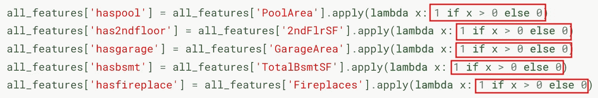

## 解决方案

将重复的代码封装在函数或类中，以提高代码的重用性和可维护性。

例如，我们可以创建一个名为 `is_positive` 的函数，将代码片段 `1 if x > 0 else 0` 封装在其中。

```py
def is_positive(column):
  return 1 if column > 0 else 0

all_features['haspool'] = all_features['PoolArea'].apply(is_positive)
all_features['has2ndfloor'] = all_features['2ndFlrSF'].apply(is_positive)
all_features['hasgarage'] = all_features['GarageArea'].apply(is_positive)
all_features['hasbsmt'] = all_features['TotalBsmtSF'].apply(is_positive)
all_features['hasfireplace'] = all_features['Fireplaces'].apply(is_positive)
```

[## Python 清理代码：使你的 Python 函数更具可读性的 6 个最佳实践](https://towardsdatascience.com/python-clean-code-6-best-practices-to-make-your-python-functions-more-readable-7ea4c6171d60?source=post_page-----d0fc38f96594--------------------------------)

### 停止编写需要超过 3 分钟才能理解的 Python 函数

[towardsdatascience.com](https://towardsdatascience.com/python-clean-code-6-best-practices-to-make-your-python-functions-more-readable-7ea4c6171d60?source=post_page-----d0fc38f96594--------------------------------)

# 频繁使用全局变量

## 问题

使用全局变量可能会导致混淆，并且很难理解值是如何以及在哪里被修改的。

在以下代码中，`X`、`train_labels` 和 `kf` 是在代码库的不同部分定义的全局变量。

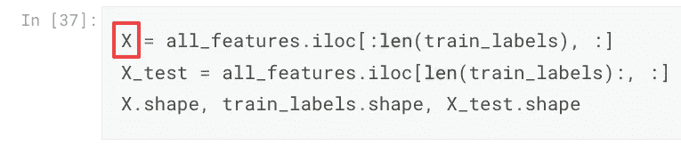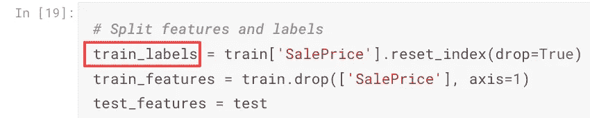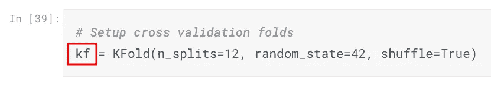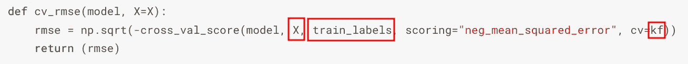

在查看函数调用时，维护者可能错误地认为`cv_rmse`函数只需要定义`model`变量即可调用：

```py
model = LinearRegression()

rmse_scores = cv_rsme(model)
```

，… 但实际上，该函数还需要定义`X`、`train_labels`和`kf`。

```py
Traceback (most recent call last):
  File "/Users/khuyentran/software-engineering-for-data-scientists/variables/global_variables/main.py", line 20, in <module>
    scores = cv_rsme(model)
             ^^^^^^^^^^^^^^
  File "/Users/khuyentran/software-engineering-for-data-scientists/variables/global_variables/main.py", line 13, in cv_rsme
    return np.sqrt(-cross_val_score(model, X, train_labels, scoring='neg_mean_squared_error', cv=kf))
                                           ^
NameError: name 'X' is not defined
```

## 解决方案

不要使用全局变量，而是将必要的变量作为参数传递给函数。这将使函数更模块化，更易于测试。

```py
def cv_rmse(model, X, train_labels, kf):
    rmse = np.sqrt(-cross_val_score(model, X, train_labels, scoring="neg_mean_squared_error", cv=kf))
    return rmse

model = LinearRegression()
rmse_scores = cv_rmse(model, X=..., train_labels=..., kf=...)
print((rmse_scores.mean(), rmse_scores.std()))
# (1.092857142857143, 0.5118992247762547)
```

# 缺乏适当的代码测试

## 问题

**隐藏的代码问题**

未经测试的代码可能会产生意外的结果，即使输出看似正确。

在代码示例中，使用`create_booleans`函数处理整数应该将其转换为 0 和 1。输出看似正确，但实际上是错误的。非零值应该是 1，而零值应该是 0。

```py
import pandas as pd

data = {
    'WoodDeckSF': [150, 0, 80, 120, 200],
    'OpenPorchSF': [30, 40, 0, 20, 60],
    'EnclosedPorch': [0, 20, 10, 0, 30],
    '3SsnPorch': [0, 0, 0, 15, 0],
    'ScreenPorch': [0, 0, 25, 0, 40]
}

all_features = pd.DataFrame(data)

all_features['HasWoodDeck'] = (all_features['WoodDeckSF'] == 0) * 1
all_features['HasOpenPorch'] = (all_features['OpenPorchSF'] == 0) * 1
all_features['HasEnclosedPorch'] = (all_features['EnclosedPorch'] == 0) * 1
all_features['Has3SsnPorch'] = (all_features['3SsnPorch'] == 0) * 1
all_features['HasScreenPorch'] = (all_features['ScreenPorch'] == 0) * 1
all_features.iloc[:, -5:]

# The results are wrong
"""
   HasWoodDeck  HasOpenPorch  HasEnclosedPorch  Has3SsnPorch  HasScreenPorch
0            0             0                 1             1               1
1            1             0                 0             1               1
2            0             1                 0             1               0
3            0             0                 1             0               1
4            0             0                 0             1               0
"""
```

依赖不准确的结果可能导致错误的分析和误导性的结论。

**解决方案**

通过单元测试，我们可以指定预期的输出，减少遗漏错误的可能性。

```py
import pandas as pd
from pandas.testing import assert_series_equal

def create_booleans(feature):
    return (feature == 0) * 1

def test_create_booleans():
    feature = pd.Series([4, 2, 0, 1])
    expected = pd.Series([1, 1, 0, 1])
    actual = create_booleans(feature)
    assert_series_equal(expected, actual)
```

```py
============================ FAILURES ============================
______________________ test_create_booleans ______________________
    def test_create_booleans():
        feature = pd.Series([4, 2, 0, 1])
        expected = pd.Series([1, 1, 0, 1])
        actual = create_booleans(feature)
>       assert_series_equal(expected, actual)
_ _ _ _ _ _ _ _ _ _ _ _ _ _ _ _ _ _ _ _ _ _ _ _ _ _ _ _ _ _ _ _ _ _

E   AssertionError: Series are different
E   
E   Series values are different (100.0 %)
E   [index]: [0, 1, 2, 3]
E   [left]:  [1, 1, 0, 1]
E   [right]: [0, 0, 1, 0]
E   At positional index 0, first diff: 1 != 0
```

## 被忽视的边缘情况

**问题**

代码在特定条件下可能表现良好，但在其他情况下可能出现意外行为。

在这个示例中，代码根据`MSSubClass`列中每组值的众数填充`MSZoning`列中的缺失值。当`MSSubClass`没有 NaN 值时，它按预期工作。

```py
features = pd.DataFrame(
 {
  "MSZoning": [1, np.nan, 2, 3, 4, 5, 6, np.nan],
    "MSSubClass": ["a", "a", "a", "a", "b", "b", "b", "b"],
  }
)

features['MSZoning'] = features.groupby('MSSubClass')['MSZoning'].transform(lambda x: x.fillna(x.mode()[0]))
list(features["MSZoning"])
# [1.0, 1.0, 2.0, 3.0, 4.0, 5.0, 6.0, 4.0]
```

然而，当`MSSubClass`包含缺失值时，代码的表现不如预期，留下了`MSZoning`中的一些缺失值。

```py
features = pd.DataFrame(
    {
        "MSZoning": [1, np.nan, 2, 3, 4, 5, 6, np.nan],
        "MSSubClass": ["a", "a", np.nan, "a", np.nan, "b", "b", "b"],
    }
)

features['MSZoning'] = features.groupby('MSSubClass')['MSZoning'].transform(lambda x: x.fillna(x.mode()[0]))
list(features["MSZoning"])
# [1.0, 1.0, nan, 3.0, nan, 5.0, 6.0, 5.0]
```

忽视边缘情况可能导致现实应用中的问题。

**解决方案**

我们可以使用单元测试来测试边缘情况：

```py
 def fill_missing_values_with_mode_in_a_group(
    df: pd.DataFrame, group_column: str, target_column: str
) -> pd.DataFrame:
    df[target_column] = df.groupby(group_column)[target_column].transform(
        lambda x: x.fillna(x.mode()[0])
    )
    return df

def test_fill_missing_values_with_mode_in_a_group():
    data = pd.DataFrame(
        {
            "col1": [1, np.nan, 2, 3, 4, 5, 6, np.nan],
            "col2": ["a", "a", np.nan, "a", np.nan, "b", "b", "b"],
        }
    )
    imputed_data = fill_missing_values_with_mode_in_a_group(
    df=data, 
    group_column="col2", 
    target_column="col1",
    )
    assert imputed_data['col1'].isnull().sum() == 0, "There are missing values in the column."AssertionError: There are missing values in the column.
assert 2 == 0
```

```py
AssertionError: There are missing values in the column.
assert 2 == 0
```

… 并调整代码以考虑边缘情况：

```py
 def fill_missing_values_with_mode_in_a_group(
    df: pd.DataFrame, group_column: str, target_column: str
) -> pd.DataFrame:
  if df[group_column].isna().any():
    raise ValueError(
          f"The {group_column} used for grouping cannot contain null values"
    )
    df[target_column] = df.groupby(group_column)[target_column].transform(
        lambda x: x.fillna(x.mode()[0])
    )
    return df

def test_fill_missing_values_with_mode_in_a_group():
  with pytest.raises(ValueError):
        data = pd.DataFrame(
            {
                "col1": [1, np.nan, 2, 3, 4, 5, 6, np.nan],
                "col2": ["a", "a", np.nan, "a", np.nan, "b", "b", "b"],
            }
        )
        imputed_data = fill_missing_values_with_mode_in_a_group(
      df=data, 
      group_column="col2", 
      target_column="col1",
      )
```

# 结论

本文讨论了数据科学项目中遇到的常见挑战，并提供了一些实用的解决方案。请注意，本文并未穷尽所有可能的解决方案，而是提供了一些可能帮助克服这些问题的策略。

要获取有关在数据科学项目中集成最佳实践的全面指南，请参考以下文章：

[](/how-to-structure-a-data-science-project-for-readability-and-transparency-360c6716800?source=post_page-----d0fc38f96594--------------------------------) ## 如何结构化数据科学项目以提高可读性和透明度

### 如何在一行代码中创建一个

towardsdatascience.com [](/stop-hard-coding-in-a-data-science-project-use-config-files-instead-479ac8ffc76f?source=post_page-----d0fc38f96594--------------------------------) ## 在数据科学项目中停止硬编码 — 改用配置文件

### 如何高效地与 Python 中的配置文件交互

[towardsdatascience.com [](/git-deep-dive-for-data-scientists-1c9cc45c7612?source=post_page-----d0fc38f96594--------------------------------) ## 数据科学家的 Git 深度解析

### 通过真实场景学习 Git

[towardsdatascience.com [](/pytest-for-data-scientists-2990319e55e6?source=post_page-----d0fc38f96594--------------------------------) ## 数据科学家的 Pytest

### 针对你的数据科学项目的 Pytest 综合指南

[towardsdatascience.com
