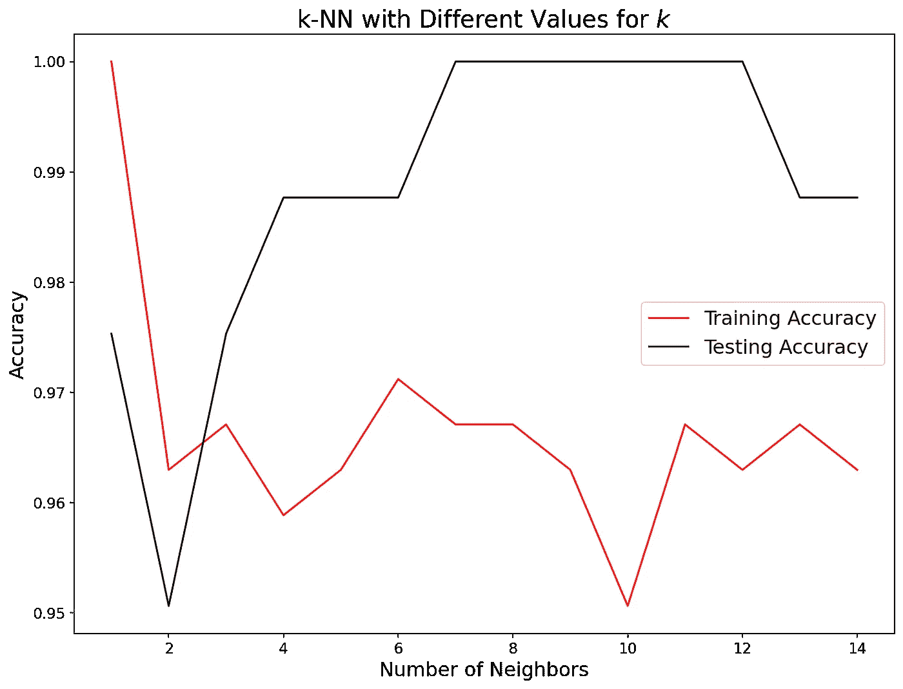
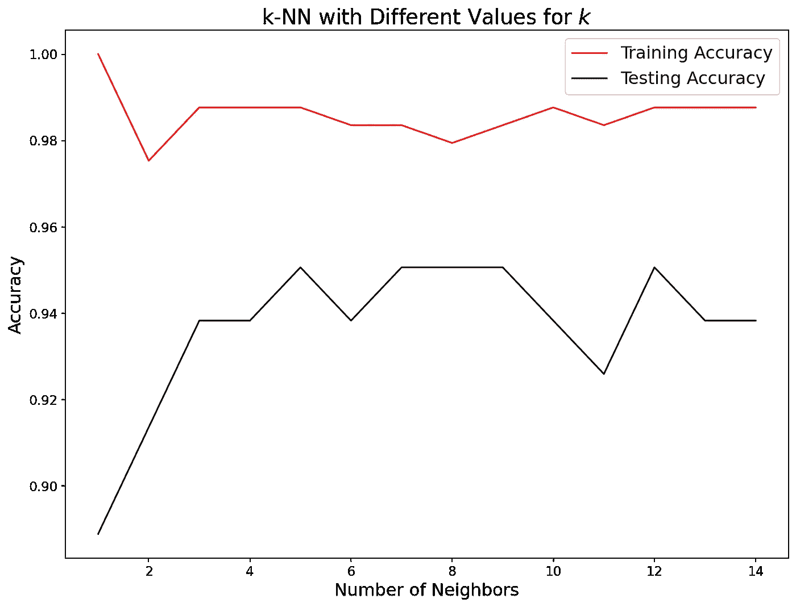
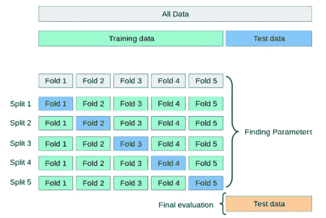

# 你可能会犯的 6 个尴尬的 Sklearn 错误及如何避免它们

> 原文：[`towardsdatascience.com/6-embarrassing-sklearn-mistakes-you-may-be-making-and-how-to-avoid-them-6be5bbdbb987`](https://towardsdatascience.com/6-embarrassing-sklearn-mistakes-you-may-be-making-and-how-to-avoid-them-6be5bbdbb987)

## 没有错误信息——这就是它们微妙的原因

 [Bex T.](https://ibexorigin.medium.com/?source=post_page-----6be5bbdbb987--------------------------------)

·发布在 [Towards Data Science](https://towardsdatascience.com/?source=post_page-----6be5bbdbb987--------------------------------) ·10 分钟阅读·2023 年 6 月 5 日

--

通过 Sklearn 学习避免初学者常犯的六个与机器学习理论相关的严重错误。

图片由我与 Leonardo AI 制作

通常，Sklearn 在你犯错时会抛出大红色的错误信息和警告。这些信息表明你的代码有严重问题，阻止了 Sklearn 魔法的正常运行。

但如果你没有收到任何错误或警告会发生什么？这是否意味着你做得很好？*不一定*。许多旋钮和拨盘使 Sklearn 成为最优秀的 ML 库，其世界级的*代码设计*就是一个例子。

编写 Sklearn 代码时的错误很容易修复。*可以*被忽视的是与*内部逻辑*和支持 Sklearn 算法及变换器的 ML 理论相关的错误。

这些错误在你是初学者时尤其常见且微妙。因此，本文将讲述我在初学者阶段犯的六个错误以及如何避免它们。

## 1️⃣. 到处使用 `fit` 或 `fit_transform`

让我们从最严重的错误开始——这是与*数据泄漏*相关的错误。数据泄漏很微妙，可能对模型性能造成破坏。

当在模型训练过程中使用预测时无法获得的信息时，就会发生数据泄漏。数据泄漏会导致模型给出非常乐观的结果，即使在交叉验证中也是如此，但在测试*实际*的新数据时表现会非常糟糕。

数据泄漏在数据预处理中很常见，特别是当训练集和测试集没有分开时。许多 Sklearn 预处理变换器，如 插补器，归一化器、标准化函数和对数变换器，在拟合期间会接触到底层的数据分布。

例如，`StandardScaler`通过从每个样本中减去均值并除以标准差来归一化数据。对完整数据（X）调用`fit()`函数允许变换器学习每个特征的整个分布的均值和标准差。

如果这些数据在变换**之后**被拆分为训练集和测试集，那么训练集将会被*污染*，因为`StandardScaler`泄露了实际分布中的重要信息。

尽管这对我们可能不明显，但 Sklearn 算法足够强大，能够察觉到这一点并在测试中利用它。换句话说，训练数据对模型来说可能过于完美，因为它包含了关于测试集的有用信息，而测试集对于模型在实际未见数据上的表现测试可能不够新颖。

最简单的解决方案是绝不要在全部数据上调用`fit`。在进行任何预处理之前，始终将数据拆分为训练集和测试集。即使在拆分之后，你也绝不要在测试集上调用`fit`或`fit_transform`，否则你将遇到相同的问题。

由于训练集和测试集都应接受相同的预处理步骤，一个黄金法则是对训练数据使用`fit_transform`——这确保了变换器仅从训练集中学习并同时进行转换。然后，在测试集上调用`transform`方法，根据从训练数据中学到的信息进行转换。

更稳健的解决方案是使用 Sklearn 的内置管道。管道类专门用于保护算法免受数据泄漏的影响。使用管道可以确保训练数据仅在`fit`期间使用，而测试数据仅用于计算。你可以在我的另一篇文章中详细了解它们：

 ## 如何使用 Sklearn 管道编写极简代码

### 编辑描述

[towardsdatascience.com

## 2️⃣. 仅通过测试分数评估模型性能

你获得了超过 0.85 的测试分数——这值得庆祝吗？大大的“不”！

尽管高测试得分通常意味着鲁棒的表现，但解读测试结果时有一些重要的警告。首先也是最重要的，无论得分值如何，测试得分应仅根据你从训练中得到的分数来判断。

你唯一应该对你的模型感到满意的时候，是当训练得分高于测试得分，并且两者都足够高以满足你独特情况的期望。然而，这并不意味着训练得分和测试得分之间的差异越大越好。

例如，0.85 的训练得分和 0.8 的测试得分表明模型既不过拟合也不欠拟合。但如果训练得分超过 0.9 而测试得分为 0.8，你的模型就是过拟合了。模型在训练过程中没有进行泛化，而是记住了部分训练数据，导致测试得分大幅下降。

你常常会在基于树的和集成模型中看到这种情况。例如，像随机森林这样的算法如果不控制树的深度，往往会获得非常高的训练得分，导致过拟合。你可以阅读[这个讨论](https://stats.stackexchange.com/questions/156694/how-can-training-and-testing-error-comparisons-be-indicative-of-overfitting?noredirect=1&lq=1)来了解训练和测试得分之间的差异。

还有一种情况是测试得分高于训练得分。如果测试得分即使略微高于训练得分，也要感到警惕，因为你犯了错误！这种情况的主要原因是数据泄露，我们在上一节中讨论了一个例子。

有时候，即使在训练集上取得了良好的评分，测试集上的评分也可能极低。当训练和测试得分之间的差异很大时，这个问题往往与*测试集*有关，而不是过拟合。这可能是由于对训练集和测试集使用了不同的预处理步骤，或者仅仅是忘记对测试集进行预处理所导致的。

总之，始终仔细检查训练和测试得分之间的差距。这将告诉你是否应该应用正则化以克服过拟合，寻找在[预处理](https://towardsdev.com/data-type-constraints-data-range-constraints-duplicate-data-with-pandas-44897a350b1e)中可能犯的错误，或者在最佳情况下，为最终评估和部署准备模型。

## 3️⃣. 在分类中生成不正确的训练/测试集

初学者常见的一个错误是忘记为分类任务生成*分层*的训练集和测试集。

当新数据分布尽可能匹配训练数据时，模型更可能产生正确的预测。在分类问题中，我们只关心类别权重或比例。

例如，在一个三类分类问题中，类别权重为 0.4、0.3、0.3。当我们将数据划分为训练集和测试集时，这两个集合的分布应该反映完整数据的分布。

我们通常使用 Sklearn 的`train_test_split`函数来划分数据，Sklearn 提供了一个方便的参数 - `stratify`，用于生成 stratified splits。以下是有和没有分层切分的训练/测试集的示例：

查看分裂前的类别权重

在没有分层的情况下再次检查训练和测试集中的类别权重。

如你所见，训练集和测试集在第一类和第二类上有不同的类别权重。让我们解决这个问题：

在分层切分后检查训练/测试集的类别权重。

将`stratify`设置为目标（`y`）在训练集和测试集中产生了相同的类别权重。

类别权重的变化是一个严重的问题，可能使模型对某一特定类别更有偏见。忘记生成分层切分可能导致训练集或测试集变得更加有利，或者引发如下问题：

图片来自作者

上面是我在开始学习 Sklearn 时构建的 KNN 分类器的表现。如你所见，几乎所有测试分数都高于训练分数，因为我忘记生成分层切分。因此，测试集的分布对我的模型来说过于有利。

解决问题后：

图片来自作者

一切恢复正常。

使用交叉验证或管道时，你不必担心这个问题，因为 CV 分割器在底层使用`[StratifiedKFold](https://scikit-learn.org/stable/modules/generated/sklearn.model_selection.StratifiedKFold.html)`进行分类问题的分层。

## 4️⃣. 使用`LabelEncoder`对 X 数组进行编码

你是否曾经因为发现`[LabelEncoder](https://scikit-learn.org/stable/modules/generated/sklearn.preprocessing.LabelEncoder.html)`只能一次编码一个类别列而感到烦恼？与可以同时转换多个特征的其他文本转换器，如`[OneHotEncoder](https://scikit-learn.org/stable/modules/generated/sklearn.preprocessing.OneHotEncoder.html)`相比，这似乎有点让人失望😔。

但我要告诉你，实际上并不是这样！这只是我们不愿意阅读文档的结果。以下是`LabelEncoder`的两句文档摘录：

> 这个转换器应该用于编码目标值，即`*y*`，而不是输入`*X*`。

那么，我们用什么来编码有序文本特征呢？如果我们亲切地查阅 Sklearn 用户指南中的*编码分类特征*，我们会看到它清楚地说明：

> 为了将类别特征转换为整数代码，我们可以使用`*OrdinalEncoder*`。这个估计器将每个类别特征转换为一个新的整数特征（0 到 n_categories - 1）

使用`[OrdinalEncoder](https://scikit-learn.org/stable/modules/generated/sklearn.preprocessing.OrdinalEncoder.html)`可以让我们一次性转换多个列，并且它具有能够集成到 Pipeline 实例中的优点，而`LabelEncoder`则不能。该编码器遵循 Sklearn 的熟悉转换器 API：

你可以通过阅读文档和用户指南来了解很多关于 Sklearn 的内容！

## 5️⃣. 在没有交叉验证的情况下判断模型性能

我认为你已经对过拟合这一主题感到舒适。过拟合在机器学习中是一个非常紧迫的问题，因此已经设计了无数种技术来克服它。

最基本的方式是将一部分数据保留作为测试集，以模拟和测量模型在未见数据上的表现。然而，模型的超参数可以被调整，直到模型在特定测试集上达到最高分，这又意味着过拟合。

我们可能会将另一部分完整数据作为‘验证集’再进行一次处理。一个模型会在训练数据上进行训练，在验证集上微调其性能，并通过测试集进行最终评估。

但将我们宝贵的数据划分为 3 个集合将意味着模型可以学习的数据量减少。模型的整体表现将取决于那一对特定的训练集和验证集。

所以，机器学习从业者通常使用一种叫做 K 折交叉验证（简称 CV）的程序。根据其值，完整数据被分为*K*个称为折叠的集合，对于每个折叠，模型将使用*K-1*个折叠作为训练数据，其余作为测试集。完成 CV 后，模型将在所有数据上进行训练和测试。以下是 Sklearn 为 5 折 CV 绘制的过程图：

图片来源于 Sklearn 用户指南

交叉验证的另一个好处是它完全消除了随机性。换句话说，你无需担心`train_test_split`偶然生成过于有利的训练和测试集，这会使模型的目标函数产生偏差。

 ## 一站式教程：你可以（应该）使用的所有交叉验证技术

### 作为数据科学家，你需要了解的所有交叉验证程序，解释如下

towardsdatascience.com

你可以从[官方用户指南](https://scikit-learn.org/stable/modules/cross_validation.html)中了解更多关于在代码中实现交叉验证的内容。

## 6️⃣. 使用准确率作为评估分类器性能的指标

默认情况下，所有 Sklearn 分类器在调用`.score`函数时使用*准确率*作为评分方法。由于这种指标的易得性，初学者通常会广泛使用它来评估模型的性能。

不幸的是，原始的*准确率* *评分*仅在一种场景下有用——一个二分类问题，即具有相等、平衡的类别权重。

有时，它是一个极具误导性的指标，甚至最差的模型也可以通过高准确率掩盖其真正的表现。例如，如果模型检测垃圾邮件，它可以在没有发现任何垃圾邮件的情况下达到超过 90%的准确率。

为什么？由于垃圾邮件并不常见，分类器可以检测所有非垃圾邮件，这可以提升其准确率，即使分类器完全未能实现其目的——检测垃圾邮件！

对于多分类问题来说，这个问题更为严重。如果你获得了 80%的准确率，这是否意味着模型在检测类别 1、类别 2、类别 3，还是所有类别上都更准确？

准确率无法回答此类问题，但幸运的是，还有多种其他分类指标可以提供更有信息量的性能总结。你可以在我另一篇文章中阅读这些指标的介绍，文章讨论了适用于二分类和多分类问题的指标：

 ## 多分类指标综合指南

### 编辑描述

[towardsdatascience.com

## 结论

犯错确实很尴尬，但这是旅程的一部分。即使是最有经验的人也会承认他们在自己的时间里曾犯过让他们脸红的错误。

但所有这些指标都有某些人最终指出了它们的错误并展示了正确的处理方式。如果你曾经犯过上述错误，我希望我成为了你心目中的那个人。

感谢阅读！

喜欢这篇文章吗？让我们面对现实，它那奇特的写作风格？想象一下，能访问更多类似的文章，都是由一位才华横溢、迷人、风趣的作者（顺便说一句，就是我 :)）撰写的。

仅需 4.99 美元的会员资格，你将不仅能访问我的故事，还能获得来自 Medium 上最聪明才智的宝贵知识。如果你使用[我的推荐链接](https://ibexorigin.medium.com/membership)，你将获得我的超级感激和一个虚拟的击掌，感谢你对我工作的支持。

 [## 使用我的推荐链接加入 Medium — Bex T.

### 获取对我所有⚡优质⚡内容的独家访问权限，并在 Medium 上无限制阅读。通过购买我的…

[ibexorigin.medium.com](https://ibexorigin.medium.com/membership?source=post_page-----6be5bbdbb987--------------------------------) 支持我的工作
