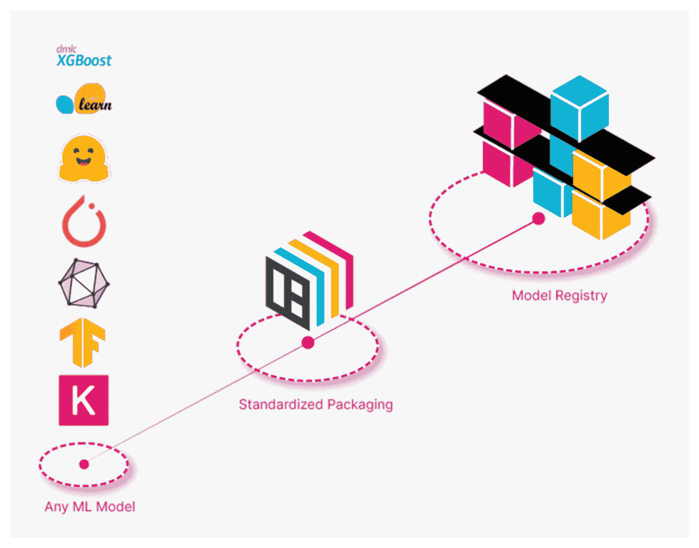
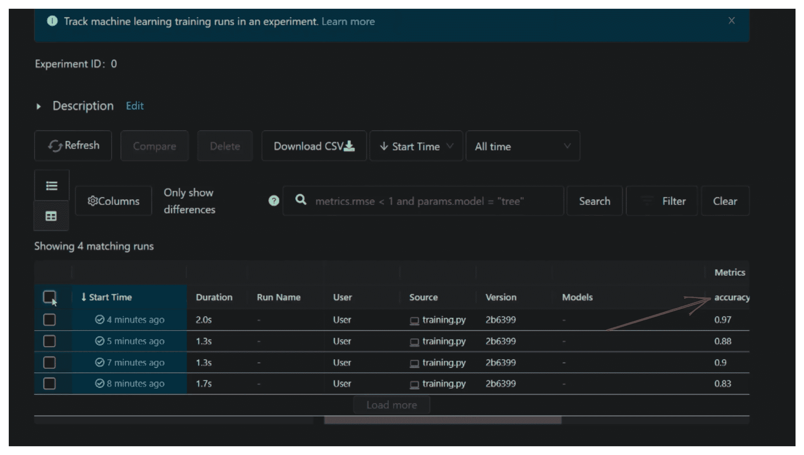
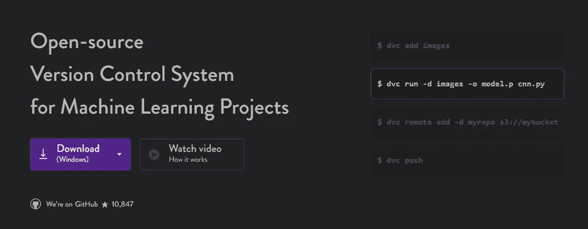
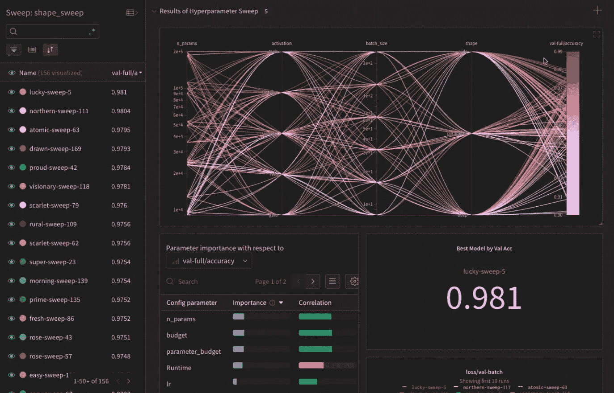
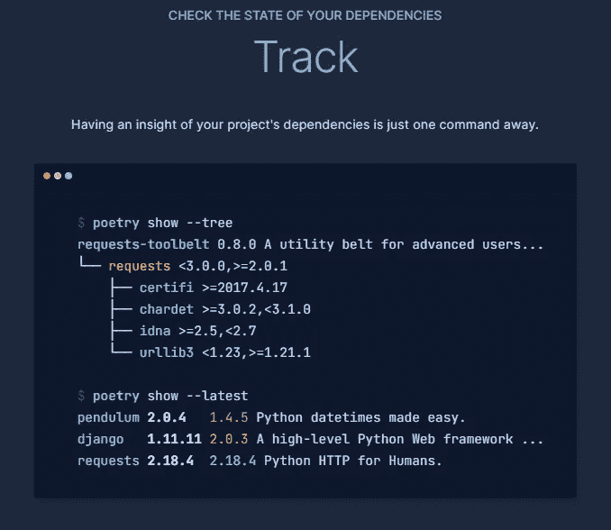
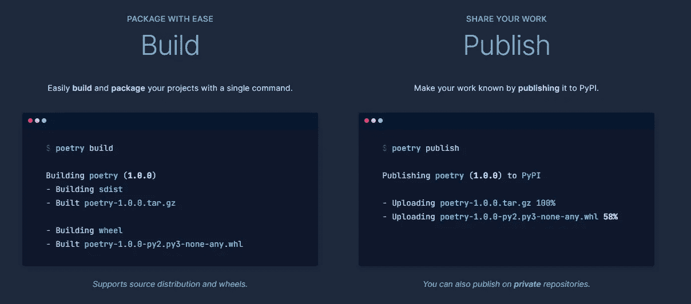

# 2023 年你必须学习的 6 个新兴数据科学库，以提升你的技能

> 原文：[`towardsdatascience.com/6-new-booming-data-science-libraries-you-must-learn-to-boost-your-skill-set-in-2023-106b318d9fa`](https://towardsdatascience.com/6-new-booming-data-science-libraries-you-must-learn-to-boost-your-skill-set-in-2023-106b318d9fa)

## 数据科学不再只是 Pandas、NumPy 和 Scikit-learn

[](https://ibexorigin.medium.com/?source=post_page-----106b318d9fa--------------------------------)[](https://towardsdatascience.com/?source=post_page-----106b318d9fa--------------------------------) [Bex T.](https://ibexorigin.medium.com/?source=post_page-----106b318d9fa--------------------------------)

·发布于 [Towards Data Science](https://towardsdatascience.com/?source=post_page-----106b318d9fa--------------------------------) ·阅读时间 7 分钟·2023 年 1 月 9 日

--


**照片来源** [**Tobit Nazar Nieto Hernandez**](https://www.pexels.com/photo/white-dirt-bike-3046023/)

## 动机

随着 2023 年的到来，现在是时候发现新的数据科学和机器学习趋势了。虽然旧的工具仍然很重要，但仅仅掌握 Pandas、NumPy、Matplotlib 和 Scikit-learn 已经不够了。

去年版本的这篇文章 更多地涉及经典的机器学习，包括像 CatBoost、LightGBM、Optuna 或 UMAP 这样的库。

在 2022 年，我观察到比 2021 年有更多的“我亲爱的联系，我很高兴宣布我是一名 MLOps 工程师”帖子。因此，关于 MLOps 的内容也多了很多，MLOps 工具的受欢迎程度大幅上升。

所以，今年的文章关注 MLOps 生态系统中的六颗新星；这些工具专注于以最有效的方式生成最佳表现的模型，然后将它们投入生产。

## 1\. BentoML

你可能已经厌倦了听到“机器学习模型不在 Jupyter Notebook 中”。如果你还没厌倦，我再说一遍：

> 机器学习模型不会只存在于 Jupyter 中，积满灰尘。

他们存在于生产环境中，真正执行他们应该做的事情——预测新数据。

我去年发现的最好的模型部署库之一是 BentoML。BentoML 是一个全方位的框架，用于维护、打包和将任何框架的模型部署到任何云提供商作为 API 服务。

它支持以统一格式（版本化和标记）保存/加载模型，使你能够建立一个有组织的模型注册库。



作者截图，已获得 BentoML 的许可

从那里，你可以通过一个命令构建最佳模型的 Docker 镜像并在本地提供服务：

```py
$ bentoml containerize my_classifier:latest
$ docker run -it --rm -p 3000:3000 my_classifier:6otbsmxzq6lwbgxi serve --production
```

或者使用几个命令将其部署到任何云提供商，而无需离开 CLI。以下是 AWS Sagemaker 的示例：

```py
$ pip install bentoctl terraform
$ bentoctl operator install aws-sagemaker
$ export AWS_ACCESS_KEY_ID=REPLACE_WITH_YOUR_ACCESS_KEY
$ export AWS_SECRET_ACCESS_KEY=REPLACE_WITH_YOUR_SECRET_KEY
$ bentoctl init
$ bentoctl build -b model_name:latest -f deployment_config.yaml
$ terraform init
$ terraform apply -var-file=bentoctl.tfvars -auto-approve
```

这是一个逐步教程，我展示了如何将 XGBoost 模型部署到 AWS Lambda：

[](/comprehensive-guide-to-deploying-any-ml-model-as-apis-with-python-and-aws-lambda-b441d257f1ec?source=post_page-----106b318d9fa--------------------------------) ## 完整指南：如何将任何机器学习模型部署为 Python 和 AWS Lambda 的 API

### 人们说 Python 最好的地方在于其开源库的丰富。我不同意。拥有很多…

towardsdatascience.com

统计数据和链接：

+   [GitHub (4.4k ⭐)](https://github.com/bentoml/BentoML)

+   [文档 📚](https://docs.bentoml.org/en/latest/#)

## 2\. MLFlow

在将最佳模型投入生产之前，你必须通过实验来生成它。通常，这可能需要几十次甚至上百次的迭代。

随着迭代次数的增加，跟踪你已经尝试过的配置以及哪些过去的实验看起来有前景变得越来越困难。

为了帮助你完成这个过程，你需要一个可靠的框架来同时跟踪代码、数据、模型、超参数和指标。

手动构建该框架（或像原始人一样使用 Excel）是世界上最糟糕的主意，因为有很多出色的 Python 库可以完成这项工作。

其中之一是 MLFlow，我个人最喜欢的。通过将以下代码行添加到训练 scikit-learn 模型的脚本中，MLFlow 将捕获所有内容——模型本身、其超参数以及使用`sklearn.metrics`函数计算的任何指标：

```py
mlflow.sklearn.autolog()
```

一旦你完成了各种尝试，就在终端上运行`mlflow ui`，它会打开一个实验仪表盘，带有排序和可视化实验的控制功能：



作者截图

MLFlow 有一个`mlflow.framework.autolog()`功能，支持更多框架，比你能说出的还要多。它简单又实用，让你*无法不使用*它。

这是我关于该框架的教程，讨论了它的功能以及与数据生态系统中其他工具的集成。

[](/complete-guide-to-experiment-tracking-with-mlflow-and-dagshub-a0439479e0b9?source=post_page-----106b318d9fa--------------------------------) ## 完整指南：使用 MLFlow 和 DagsHub 进行实验跟踪

### 编辑描述

towardsdatascience.com

统计数据和链接：

+   [GitHub (13.3k ⭐)](https://github.com/mlflow/mlflow)

+   [文档 📚](https://mlflow.org/docs/latest/index.html)

## 3\. DVC

简而言之，DVC 就是数据的 Git。



作者截图

DVC（数据版本控制）正成为首选的数据和模型版本库。它可以：

1.  像 Git 追踪轻量级脚本一样追踪千兆字节级的数据集或模型。

1.  创建主代码库的分支以安全地进行实验，而不必复制大型文件。

当你用`dvc add directory`追踪一个大文件或目录时，会创建一个轻量级的`directory.dvc`元数据文件。然后，DVC 将这些轻量文件作为原始重型文件的占位符来管理。

DVC 承担了重担，而 Git 处理小事务，比如你的脚本。它们一起组成了一个完美的组合。

DVC 的另一个卖点是智能工作流管道。一个典型的机器学习工作流涉及到的数据收集、数据清洗、特征工程和模型训练等步骤。

DVC 可以从这些步骤中创建智能管道，这样你只需用两个关键词——`dvc repro`来运行它们。

聪明的部分是什么？DVC 只执行管道中修改过的步骤，从而节省你数小时的时间和计算资源。

将 MLFlow 添加到你的训练脚本中，使用 DVC 追踪模型工件，这样你就拥有了完美的三重奏（Git、DVC、MLFlow）。

查看我为初学者准备的 DVC 教程开始学习：

[](/how-to-version-gigabyte-sized-datasets-just-like-code-with-dvc-in-python-5197662e85bd?source=post_page-----106b318d9fa--------------------------------) ## 在 DVC 中进行数据版本控制：了解其他数据科学家忽略的内容

### 编辑描述

[towardsdatascience.com

统计信息和链接：

+   [GitHub (10.8k ⭐)](https://github.com/iterative/dvc)

+   [文档 📚](https://dvc.org/)

[](https://ibexorigin.medium.com/membership?source=post_page-----106b318d9fa--------------------------------) [## 通过我的推荐链接加入 Medium - BEXGBoost

### 获得独家访问所有我的⚡高级⚡内容，并在 Medium 上无限制浏览。请通过给我买杯咖啡来支持我的工作……

ibexorigin.medium.com](https://ibexorigin.medium.com/membership?source=post_page-----106b318d9fa--------------------------------)

## 4. Weights & Biases

另一个完全开源的实验追踪框架是 Weights & Biases（wandb.ai）。唯一的区别是？它由一家拥有超过 2 亿美元资金的公司提供，该公司的客户包括 OpenAI、NVIDIA、Lyft、BMW、三星等。

他们的主要卖点是：

+   与 ML 生态系统其他部分的优秀集成，就像 MLFlow 一样

+   追踪和比较实验的最美观的 UI（个人感觉）



作者截图

+   协作报告和仪表板

+   超参数优化（在 MLFlow 中无法实现）

最棒的是，以上所有功能都可以直接通过 Jupyter 使用。这意味着你不需要放弃你喜欢的 IDE 而转到脚本中来跟踪实验。

因此，你的完美组合可能实际上是 Git、DVC 和 Weights & Biases。

统计数据和链接：

+   [GitHub (5.2k ⭐)](https://github.com/wandb/wandb)

+   [Docs 📚](https://docs.wandb.ai/)

## 5\. NannyML

部署模型只是故事的一部分。为了维持成功的机器学习产品，你必须持续监控其性能。

监控的问题在于，当模型失败时你不会收到明显的、红色的错误提示。随着时间的推移，它们的预测可能会变得越来越差，导致一种称为沉默模型失败的现象。

例如，你部署了一个检测 Nike 服装的模型。时尚变化迅速，因此 Nike 不断改进其设计。

由于你的模型训练没有包含新的设计，它开始逐渐错过图像中的 Nike 服装。你不会收到错误提示，但你的模型很快就会变得无用。

NannyML 帮助解决了这个确切的问题。通过使用他们开发的新型[基于置信度的性能估计](https://nannyml.readthedocs.io/en/stable/how_it_works/performance_estimation.html)算法和一些其他稳健的统计测试，他们可以在生产环境中检测性能下降或沉默模型失败。

NannyML 还具有智能警报功能，使你始终能够了解生产环境中的发生情况。

这里是一个实用教程，帮助你入门：

[](/data-drift-explainability-interpretable-shift-detection-with-nannyml-83421319d05f?source=post_page-----106b318d9fa--------------------------------) ## 数据漂移可解释性：使用 NannyML 的可解释性漂移检测

### 编辑描述

[towardsdatascience.com

统计数据和链接：

+   [GitHub (1.3k ⭐)](https://github.com/NannyML/nannyml)

+   [Docs 📚](https://nannyml.readthedocs.io/en/stable/index.html)

## 6\. Poetry

你可能已经听到 Python 程序员对`pip`及其依赖问题抱怨了无数次，而我也是这些抱怨者之一，直到我看到了 Poetry。

Poetry 是一个改变游戏规则的开源 Python 打包和依赖管理框架。在最简单的用例中，Poetry 可以在你安装库之前检测依赖冲突，从而完全避免依赖地狱。



作者截图

你还可以使用`pyproject.toml`文件将 Python 项目配置为*包*，Poetry 会通过简单的命令处理虚拟环境、构建和发布到 PyPI。



作者截图

这里有一个全面的 Real Python 教程关于 Poetry：

[## 使用 Python Poetry 进行依赖管理 - Real Python](https://realpython.com/dependency-management-python-poetry/?source=post_page-----106b318d9fa--------------------------------)

### 在深入了解 Python Poetry 的细节之前，你需要处理一些前置条件。首先，你需要阅读一篇…

[realpython.com](https://realpython.com/dependency-management-python-poetry/?source=post_page-----106b318d9fa--------------------------------)

统计数据和链接：

+   [GitHub (23.1k ⭐)](https://github.com/python-poetry/poetry)

+   [文档 📚](https://python-poetry.org/)

## 结论

数据科学领域不断发展，新工具和库以惊人的速度不断推出。跟上这些变化的压力比以往任何时候都要大。在这篇文章中，我尽力将你的关注点缩小到 2023 年有望迅速发展的机器学习领域。感谢阅读！

喜欢这篇文章吗？让我们面对现实，它那奇特的写作风格？想象一下，访问更多类似的文章，全由一位聪明、迷人、风趣的作者（顺便说一下，就是我 :）撰写。

仅需 4.99 美元会员费，你将获得不仅仅是我的故事，还有来自 Medium 上最佳和最聪明头脑的宝贵知识。如果你使用[我的推荐链接](https://ibexorigin.medium.com/membership)，你将获得我超级 nova 般的感激之情和一个虚拟的击掌，感谢你对我工作的支持。

[## 通过我的推荐链接加入 Medium — Bex T.](https://ibexorigin.medium.com/membership?source=post_page-----106b318d9fa--------------------------------)

### 获取对我所有⚡高级⚡内容的独家访问权限，以及 Medium 上的所有内容，无限制。通过为我购买一份…来支持我的工作。

[ibexorigin.medium.com](https://ibexorigin.medium.com/membership?source=post_page-----106b318d9fa--------------------------------) 
