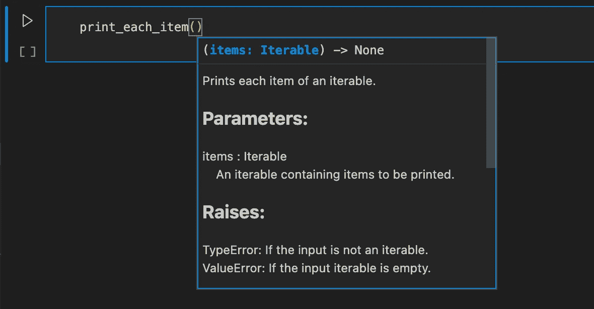

# 区分资深开发人员与初级开发人员的 6 个 Python 最佳实践

> 原文：[`towardsdatascience.com/6-python-best-practices-that-distinguish-seniors-from-juniors-84199d4cac3c`](https://towardsdatascience.com/6-python-best-practices-that-distinguish-seniors-from-juniors-84199d4cac3c)

## 如何编写被认为来自经验丰富的开发人员的 Python 代码

[](https://medium.com/@tomergabay?source=post_page-----84199d4cac3c--------------------------------)[](https://towardsdatascience.com/?source=post_page-----84199d4cac3c--------------------------------) [Tomer Gabay](https://medium.com/@tomergabay?source=post_page-----84199d4cac3c--------------------------------)

·发表于 [Towards Data Science](https://towardsdatascience.com/?source=post_page-----84199d4cac3c--------------------------------) ·12 min 阅读·2023 年 4 月 18 日

--


照片由 [Desola Lanre-Ologun](https://unsplash.com/@disruptxn?utm_source=medium&utm_medium=referral) 提供，发布于 [Unsplash](https://unsplash.com/?utm_source=medium&utm_medium=referral)

2023 年 1 月，我发表了 [一篇关于区分资深开发人员与初级开发人员的 5 个 Python 技巧](https://medium.com/towards-data-science/5-python-tricks-that-distinguish-senior-developers-from-juniors-826d57ab3940)。在这篇文章中，我们不关注“技巧”，而是探讨 6 个 Python 最佳实践，这些实践可以区分经验丰富的开发人员和初学者。通过各种示例，我们将深入了解资深开发人员和初级开发人员编写的代码之间的差异。

通过学习这些最佳实践，你可以编写出不仅被视为资深开发人员创作的代码，而且实际上代码质量也会更高。这些特点在向同事或在工作面试中展示你的代码时都会很有优势。

# 1\. 使用正确的可迭代类型

> 可迭代对象是任何能够逐个返回其成员的 Python 对象，允许在 for 循环中进行迭代。 ([source](https://www.pythonlikeyoumeanit.com/Module2_EssentialsOfPython/Iterables.html#:~:text=An%20iterable%20is%20any%20Python,over%20in%20a%20for%2Dloop.))

初级开发人员往往每次需要可迭代对象时都使用列表。然而，不同类型的可迭代对象在 Python 中有不同的用途。总结最基本的可迭代对象：

+   **列表**用于需要**排序**和**可变**的可迭代对象。

+   **集合**是用于**仅包含唯一值**的可迭代对象，它们是**可变**和**无序**的。当检查某项是否存在时，它们应该是首选，因为它们非常快速。然而，当用于迭代时，它们比`list`要慢。

+   **元组**是用于**有序**和**不可变**的可迭代对象。元组比列表更快，更节省内存。

首先让我们看看使用 `set` 和 `list` 的区别。想象一下一个简单的任务：当请求的用户名已被使用时警告用户。例如，你可能经常遇到如下代码：

```py
requested_usernames = ["John123", "Delilah42"]
taken_usernames = []
for username in requested_usernames:
  if username not in taken_usernames:
    taken_usernames.append(username)
  else:
    print(f"Username '{username}' is already taken!")
```

在上述代码中，`taken_usernames` 是一个 `list`。然而，由于 `taken_usernames` 中的所有值只能出现一次，不需要重复值，因为不允许重复的用户名。因此，这里没有必要使用 `list`。相反，使用 `set` 更好，因为我们在上面提到过，当使用 `set` 时，检查是否存在更快，并且没有必要存储重复的值。

```py
requested_usernams = ["John123", "Delilah42"] 
taken_usernames = set()
for username in requested_usernames:
  if username not in taken_usernames:
    taken_usernames.add(username)
  else:
    print(f"Username '{username}' is already taken!")
```

尽管这两个代码片段的结果相同，但使用 `set` 进行存在性检查而不是 `list` 向他人展示了你理解不同的可迭代类型适用于不同的用例，而不是每次需要可迭代对象时都使用 `list`。

对于在执行期间不会发生变化并且需要顺序的可迭代对象，`tuple`是最佳选择；例如：

```py
# more junior example
weekdays = ["Monday", "Tuesday", "Wednesday", "Thursday", "Friday"]

for day in weekdays:
  ...

--------------------------------------------------------------------------
# more senior example
WEEKDAYS = ("Monday", "Tuesday", "Wednesday", "Thursday", "Friday")

for day in WEEKDAYS:
  ...
```

现在你对何时使用哪种可迭代类型有了更好的理解！当你使用 `set` 来处理仅包含唯一值且不需要顺序的可迭代对象时，你的代码会显得更高级，而 `tuple` 则用于有序且值不应更改的可迭代对象。

在下一节中，我们将探讨 Python 的命名规范，之后会明确为什么例如 `WEEKDAYS` 在上面的代码片段中使用了大写字母。

如果你想深入了解何时使用哪种可迭代对象，请参阅例如这篇文章：

## 15 Examples to Master Python Lists vs Sets vs Tuples

### 理解这些数据结构之间的区别

towardsdatascience.com

# 2\. 使用 Python 的命名规范

Python 中变量名的‘规则’有两种：

+   强制规则

+   命名规范

强制规则防止无效的变量名，例如以数字开头或包含连字符的变量名：

```py
2nd_name = "John"

# output 
SyntaxError: invalid syntax

---------------------------

second-name = "John"

# output 
SyntaxError: invalid syntax
```

当然，由于这些规则是由 Python 解释器强制执行的，所以（希望）你不会在代码中看到它们的应用。然而，对于变量名，有一些样式指南（即命名约定）是没有强制执行的，因此，你可以对错误的对象使用错误的样式。

以下是 Python 中一些最重要的命名约定：

**变量：** 仅使用小写字母，并用下划线分隔单词，例如：

+   `first_name` `items` `names_list`

**函数**和**方法：** 与*变量*相同的规则，全部小写，并用下划线分隔单词，例如：

+   `get_avg` `load_data` `print_each_item`

**类：** 使用 [CamelCasing](https://www.techtarget.com/whatis/definition/CamelCase#:~:text=CamelCase%20is%20a%20way%20to,humps%20on%20a%20camel's%20back.)；以大写字母开头，每个新单词也以大写字母开头，中间没有下划线：

+   `Person` `TrainStation` `MarineAnimal`

**常量：** 仅使用大写字母，并用下划线分隔单词，例如：

+   `WEEKDAYS` `FORBIDDEN_WORDS`

**模块：** 对于 Python 文件名，使用与*变量、函数*和*方法*相同的约定（小写字母并用下划线分隔单词）：

+   `calculations.py` `data_preprocessing.py`

使用正确的命名约定不仅显示了你在 Python 中的成熟度，而且不使用正确的命名约定可能导致代码显著混乱，正如下文所示。

遵循 PEP-8 命名约定的 Python 代码：

```py
# circle.py

PI = 3.14 # Value won't change, so it's a constant

class Circle:
    def __init__(self, radius: float):
        self.radius = radius

    @property
    def area(self):
        return (self.radius **2) * PI

    @property
    def perimeter(self):
        return 2 * self.radius * PI

small_circle = Circle(1)
big_circle = Circle(5)

print(f"Area of small circle = {small_circle.area}")
print(f"Perimeter of small circle = {small_circle.perimeter}")

print(f"Area of big circle = {big_circle.area}")
print(f"Perimeter of big circle = {big_circle.perimeter}")
```

不使用命名约定的 Python 代码：

```py
# CIRCLE.py

Pi = 3.14

class CIRCLE:
    def __init__(Self, RADIUS: float):
        Self.Radius = RADIUS

    @property
    def AREA(Self):
        return (Self.Radius **2) * Pi

    @property
    def PERIMETER(Self):
        return 2 * Self.Radius * Pi

SmallCIRCLE = CIRCLE(1)
BigCIRCLE = CIRCLE(5)

print(f"Area of small circle = {SmallCIRCLE.AREA}")
print(f"Perimeter of small circle = {SmallCIRCLE.PERIMETER}")

print(f"Area of big circle = {BigCIRCLE.AREA}")
print(f"Perimeter of big circle = {BigCIRCLE.PERIMETER}")
```

如果你提供的代码片段是第二种，那么大多数开发人员肯定会高度怀疑你的 Python 技能，而如果提供的是第一种片段，他们会认为是高质量的 Python 代码。因此，确保遵守 Python 的命名约定是非常重要的。

有关 Python 命名约定的更多详细信息，请参见 [PEP-8](https://peps.python.org/pep-0008/#naming-conventions)

# 3\. 使用适当的比较语句

> 比较运算符（…）比较它们两边的值并返回一个布尔值。它们告诉你一个语句是 True 还是 False，具体取决于条件。 ([source](https://flexiple.com/python/comparison-operators-in-python/))

在 Python 中，有很多种方法来编写（几乎）相同的比较语句，但它们并不一定同样合适。我们来看一个小例子：

```py
def is_even(x):
  return True if x % 2 == 0 else False

x = 10

# different comparison statements which result in the same result:
if is_even(x) == True:
  print(f"{x} is an even number!")

if is_even(x) is True:
  print(f"{x} is an even number!")

if is_even(x):
  print(f"{x} is an even number!")
```

最后一个例子 `if is_even(x):` 能够工作，因为在没有任何比较对象的情况下，Python 评估 `is_even(x)` 是否为 `True`。然而，需要注意的是，几乎任何 Python 变量都将被评估为 `True`，除非：

+   空序列，如列表、元组、字符串等。

+   数字 `0`（无论是整数还是浮点数类型）

+   `None`

+   `False`（显而易见）

这意味着，例如，每个`if <number>:`语句将评估为`True`，除非该数字是`0`。因此，没有具体示例的 if 语句可能看起来过于宽泛，因为它可能无意中评估为`True`的可能性很高。然而，我们可以很好地利用空序列始终评估为`False`这一事实，而至少有一个值的序列始终评估为`True`。在初级 Python 代码中，你常常会遇到以下比较语句：`if <variable> != []`，如下片段所示。

```py
def print_each_item(items):
  if items != []:
    for item in items:
      print(item)
  else:
    raise ValueError("'items' is an empty list, nothing to print!")
```

然而，当有人插入不同类型的可迭代对象时会发生什么呢？例如，一个`set`。如果你希望对空`list`引发`ValueError`，你可能也希望对空`set`引发`ValueError`。在上述代码中，空`set`仍将评估为`True`，因为空`set`与空`list`不相等。避免这种不必要行为的一种方法是使用`if items`而不是`if items != []`，因为`if items`现在将对每个空的可迭代对象引发`ValueError`，包括`list`、`set`和第一部分中的`tuple`。

```py
def print_each_item(items):
  if items:
    for item in items:
      print(item)
  else:
    raise ValueError("No items to print inside 'items'")
```

如果你想显式地将值与`True`或`False`进行比较，你应该使用`is True`或`is False`，而不是`== True`和`== False`。这同样适用于`None`，因为它们都是[*单例*](https://www.geeksforgeeks.org/singleton-pattern-in-python-a-complete-guide/)。见[PEP285](https://peps.python.org/pep-0285/)。虽然性能差异微小，但`is True`比`== True`稍快。最重要的是，这表明你熟悉 PEP（Python 增强提案），这显示了开发者的技能成熟度。

```py
# more junior example
if is_even(number) == True:

# more senior example
if is_even is True:

-------------------

# more junior example
if value == None:

# more senior example
if value is None:
```

> **额外提示：** [PEP8](https://peps.python.org/pep-0008/#programming-recommendations)警告使用`if value`来确保`value`不是`None`。要检查值是否不是`None`，请明确使用`if value is not None`。

选择最合适的比较语句有时可以避免你或他人调试棘手的错误。但最重要的是，高级开发者会更看重你使用，例如`if value is True`而非`if value == True`。

当然，与其仅仅编写变量值的比较语句，不如首先检查数据类型，但我们如何为此引发好的异常呢？让我们看看本节中的信息性异常引发方法！

# 4\. 提升信息性异常

初级开发者很少做的一件事是‘手动’引发带有自定义消息的异常。让我们考虑以下情况：我们想创建一个名为`print_each_item()`的函数，该函数打印每个可迭代类型的项。

最简单的解决方案是：

```py
def print_each_item(items):
  for item in items:
    print(item)
```

当然，这段代码是有效的。然而，当这个函数是大型代码库的一部分时，运行程序时可能缺少打印结果可能会让人困惑。函数是否被正确调用？解决这种问题的一种方法是使用**日志记录**，我们将在下一节讨论。首先，让我们看看如何通过抛出`Exceptions`来防止诸如缺少打印结果等不安全问题。

函数 `print_each_item()` 仅对可迭代的 Python 对象有效，因此我们首先应该检查 Python 是否可以通过使用内置函数 `iter()` 对提供的参数进行迭代：

```py
def print_each_item(items):

  # check whether items is iterable
  try:
    iter(items)
  except TypeError as error:
    raise (
      TypeError(f"items should be iterable but is of type: {type(items)}")
      .with_traceback(error.__traceback__)  
    )
```

通过对 `items` 尝试 `iter()` 函数，我们检查是否可以对 `items` 进行迭代。当然，也可以通过 `isinstance(items, Iterable)` 来检查 `items` 的类型，但某些自定义的 Python 类型可能不被算作 `Iterable`，尽管它们可能是可迭代的，因此 `iter(items)` 更加可靠。我们在 `Exception` 中添加 `.with_traceback` 以提供更多调试时的上下文。

接下来，当我们确认 `items` 是可迭代的时，我们必须确保 `items` 不是空的可迭代对象，以防止打印结果缺失。我们可以使用之前学到的 `if items:` 来实现。如果 `if items:` 为 `False`，我们想要抛出一个 `ValueError`，因为这意味着可迭代对象是空的。下面是经过验证的 `print_each_item()` 函数：

```py
def print_each_item(items):

  # check whether items is an Iterable
  try:
    iter(items)
  except TypeError as e:
    raise (
      TypeError(f"'items' should be iterable but is of type: {type(items)}")
      .with_traceback(e.__traceback__)  
    )

  # if items is iterable, check whether it contains items
  else:
    if items:
      for item in items:
        print(item)

    # if items doesn't contain any items, raise a ValueError
    else:
      raise ValueError("'items' should not be empty")
```

当然，最简单的 `print_each_item()` 适用于大多数用例，但如果你在公司担任开发人员，或编写开源代码，并且该函数经常被重用，你的 Python 同行可能会要求或至少会更高兴看到第二个示例中的函数。能够理解函数可能出现的异常以及如何正确处理它们，并抛出有用的异常，绝对是成为（更）高级开发者所需的技能。

然而，当你的函数被其他人审查时，仍然可能会被拒绝。因为它没有包含文档字符串或任何类型提示，这些都是高质量 Python 代码的必要条件。

# 5\. 类型提示和文档字符串

类型提示在 Python 3.5 中引入。通过类型提示，你可以*提示*预期的类型。一个非常简单的示例可以是：

```py
def add_exclamation_mark(sentence: str) -> str:
  return f"{sentence}!"
```

通过指定`str`作为`sentence`的类型提示，我们知道`sentence`应该是一个字符串，而不是例如一个包含单词的列表。通过`-> str`我们指定该函数返回一个字符串类型的对象。Python 不会强制执行正确的类型（如果插入了不同类型的对象不会引发`Exception`），但通常像 [Visual Studio Code](https://code.visualstudio.com/) 和 [PyCharm](https://www.jetbrains.com/pycharm/promo/?medium=cpc&campaign=14124132615&term=pycharm&content=536947779960&gclid=CjwKCAjwue6hBhBVEiwA9YTx8AeY9b1iUuYFfKf0ae1o-GKo3jbkTjE361ftJkshc6vKDk7dPqDPdxoC7boQAvD_BwE) 这样的 IDE 会通过利用代码中的类型提示来帮助你编程（见本节进一步下方的截图）。

我们也可以在`print_each_item()`中应用这一点，通过：

```py
from collections.abc import Iterable

def print_each_item(items: Iterable) -> None:
  ...
```

**文档字符串** 有助于解释代码片段，如函数或类。我们可以向`print_each_item()`添加以下文档字符串，以使其他用户和未来的自己清楚函数的作用：

```py
from collections.abc import Iterable

def print_each_item(items: Iterable) -> None:
  """
  Prints each item of an iterable.

  Parameters:
  -----------
  items : Iterable
      An iterable containing items to be printed.

  Raises:
  -------
  TypeError: If the input is not an iterable.
  ValueError: If the input iterable is empty.

  Returns:
  --------
  None

  Examples:
  ---------
  >>> print_each_item([1,2,3])
  1
  2
  3

  >>> print_each_item(items=[])
  ValueError: 'items' should not be empty
  """
  ...
```

现在，如果我们编写使用`print_each_item`的代码，我们会看到以下信息出现：



（截图由作者提供）

通过添加类型提示和文档字符串，我们使我们的函数变得更加用户友好！

关于类型提示的更多信息请点击 [这里](https://docs.python.org/3/library/typing.html)。有关文档字符串的更多信息请参见 [PEP-257](https://peps.python.org/pep-0257/)。

**注意：** 为这样一个简单的函数编写长文档字符串可能会觉得有些过头，尽管你可以争辩说确实有时是这样。幸运的是，当一个函数不是秘密的时，你可以轻松地请求 [ChatGPT](https://chat.openai.com/) 为你编写一个非常准确和详细的文档字符串！

# 6\. 使用日志记录

有几件事可以使使用你的代码对其他人更加愉快，例如类型提示和文档字符串。然而，最重要、最少使用且被低估的特性之一是日志记录。尽管许多（初级）开发者认为日志记录是困难或不必要的，但运行一个适当记录的程序可以对任何使用你的代码的人产生巨大差异。

只需要两行代码即可使日志记录在你的代码中成为可能：

```py
import logging

logger = logging.getLogger(__name__)
```

现在，你可以轻松地添加日志来帮助，例如调试：

```py
import logging
from collections.abc import Iterable

logger = logging.getLogger(__name__)

def print_each_item(items: Iterable) -> None:
  """
  <docstring>
  """
  logger.debug(
    f"Printing each item of an object that contains {len(items)} items."
  )
  ... 
```

它还可以通过记录错误信息真正帮助其他开发者进行调试：

```py
import logging
from collections.abc import Iterable

logger = logging.getLogger(__name__)

def print_each_item(items: Iterable) -> None:
  """
  <docstring>
  """

  logger.debug(
      f"Printing each item of an object that contains {len(items)} items."
    )

  # check whether items is iterable
  try:
    iter(items)
  except TypeError as e:
    error_msg = f"'items' should be iterable but is of type: {type(items)}"
    logger.error(error_msg)
    raise TypeError(error_msg).with_traceback(e.__traceback__)

  # if items is iterable, check whether it contains items
  else:
    if items:
      for item in items:
        print(item)

    # if items doesn't contain any items, raise a ValueError
    else:
      error_msg = "'items' should not be empty"
      logger.error(error_msg)
      raise ValueError(error_msg)
```

因为日志记录在较初级开发者的代码中是一个很少见的特性，添加它到你自己的代码中会让你显得（更）有经验一些！

# 总结

在这篇文章中，我们回顾了 6 个 Python 最佳实践，这些实践可以让你看起来像是一个资深开发者，而不是一个初级开发者。当然，还有许多其他因素区分资深开发者和初级开发者，不过，通过应用这 6 个最佳实践，你肯定会在你的工作、编程面试或贡献开源项目时，明显区别于那些不应用这些最佳实践的初级开发者！

要了解高级和初级代码之间的差异，请查看：

[](/5-python-tricks-that-distinguish-senior-developers-from-juniors-826d57ab3940?source=post_page-----84199d4cac3c--------------------------------) ## 5 个 Python 技巧，区分高级开发者和初级开发者

### 通过 Advent of Code 题目的解法差异进行说明

towardsdatascience.com

如果你想了解如何自己晋升为更高级别的开发者，请查看：

[](/how-to-level-up-your-python-skills-by-learning-from-these-professionals-3e906b83f355?source=post_page-----84199d4cac3c--------------------------------) ## 如何通过向这些专业人士学习来提升你的 Python 技能

### 避免停留在 Python 编程的初级水平

towardsdatascience.com

# 资源

**可迭代对象** [`www.pythonlikeyoumeanit.com/Module2_EssentialsOfPython/Iterables.html#`](https://www.pythonlikeyoumeanit.com/Module2_EssentialsOfPython/Iterables.html#)

[`stackoverflow.com/questions/2831212/python-sets-vs-lists`](https://stackoverflow.com/questions/2831212/python-sets-vs-lists)

`towardsdatascience.com/15-examples-to-master-python-lists-vs-sets-vs-tuples-d4ffb291cf07`

**命名约定**

[`peps.python.org/pep-0008`](https://peps.python.org/pep-0008)

[`www.techtarget.com/whatis/definition/CamelCase#:~:text=CamelCase%20is%20a%20way%20to,humps%20on%20a%20camel's%20back`](https://www.techtarget.com/whatis/definition/CamelCase#:~:text=CamelCase%20is%20a%20way%20to,humps%20on%20a%20camel's%20back).

**适当的比较语句** [`peps.python.org/pep-0008`](https://peps.python.org/pep-0008)

[`peps.python.org/pep-0285/`](https://peps.python.org/pep-0285/)

[`flexiple.com/python/comparison-operators-in-python/`](https://flexiple.com/python/comparison-operators-in-python/)

**类型提示和文档字符串** [`docs.python.org/3/library/typing.html`](https://docs.python.org/3/library/typing.html)

[`peps.python.org/pep-0257/`](https://peps.python.org/pep-0257/)

**日志记录** [`docs.python.org/3/library/logging.html`](https://docs.python.org/3/library/logging.html)

**表情包** [`www.reddit.com/r/ProgrammerHumor/comments/l9lbm2/code_review_be_like/`](https://www.reddit.com/r/ProgrammerHumor/comments/l9lbm2/code_review_be_like/)
