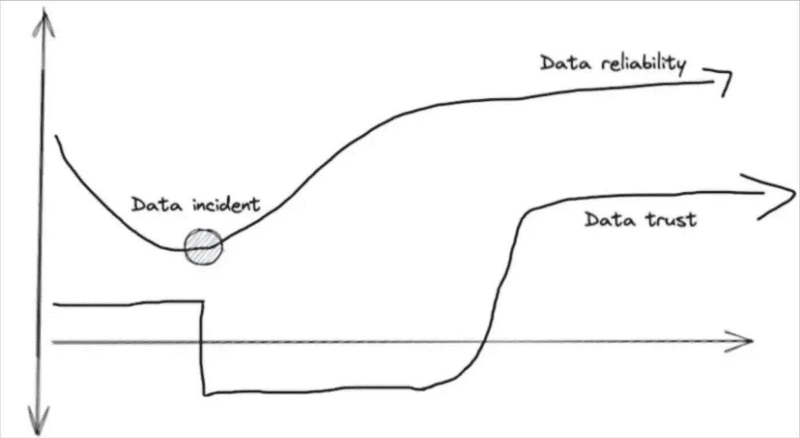

# 使数据可靠性成为习惯的 6 个步骤

> 原文：[`towardsdatascience.com/6-steps-to-making-data-reliability-a-habit-521389b04aca?source=collection_archive---------10-----------------------#2023-02-10`](https://towardsdatascience.com/6-steps-to-making-data-reliability-a-habit-521389b04aca?source=collection_archive---------10-----------------------#2023-02-10)

## 一些组织对待数据质量的方式就像快速减肥。然而，试试这 6 个步骤，实现可持续的数据质量管理。

 [Barr Moses](https://barrmoses.medium.com/?source=post_page-----521389b04aca--------------------------------)

·

[关注](https://medium.com/m/signin?actionUrl=https%3A%2F%2Fmedium.com%2F_%2Fsubscribe%2Fuser%2F2818bac48708&operation=register&redirect=https%3A%2F%2Ftowardsdatascience.com%2F6-steps-to-making-data-reliability-a-habit-521389b04aca&user=Barr+Moses&userId=2818bac48708&source=post_page-2818bac48708----521389b04aca---------------------post_header-----------) 发表在 [Towards Data Science](https://towardsdatascience.com/?source=post_page-----521389b04aca--------------------------------) · 10 分钟阅读 · 2023 年 2 月 10 日

--

图片来源：[Bruno Nascimento](https://unsplash.com/@bruno_nascimento?utm_source=unsplash&utm_medium=referral&utm_content=creditCopyText) 在 [Unsplash](https://unsplash.com/photos/PHIgYUGQPvU?utm_source=unsplash&utm_medium=referral&utm_content=creditCopyText)

我喜欢将数据可靠性的操作化视为一种身体健康的管理。

你可以通过努力工作来保持身体健康，**但保持健康需要良好的习惯。** 最重要的是，这是一种心态和生活方式。

你也需要付出努力。至少一点点。没有任何技术，包括数据可观察性，能像瘦身带那样在你放松时提升数据质量。

也有很多关于数据质量的错误建议。与其关注 7 分钟腹肌，不如关注[数据质量的 6 个维度](https://www.techtarget.com/searchdatamanagement/tip/6-dimensions-of-data-quality-boost-data-performance)。是的：完整性、一致性、准确性、有效性、完整性和唯一性都很重要，但这些都是情境性的诊断快照。而且这些在董事会上从未被提及。

随着我们稳步进入数据云时代，数据领导者需要与最终（数据）产品一样关注机器的鲁棒性和可靠性——数据管道、系统和工程师。

最重要的是，**数据质量**管理需要有一个可重复的过程，而不仅仅是静态的数据清理、测试和分析。这些传统方法无法在现今拥有数十个数据源、数百个数据模型、数千个表和受到运营用例影响的数百万美元的组织中扩展。

在过去三年中，我观察了数百个已经实现数据质量的团队。以下是最成功团队所经历的 6 个数据质量成熟阶段。

# 阶段 1：基线当前数据可靠性状态

启动数据质量管理策略的最佳地方之一是对你当前（以及理想的近期）数据使用案例进行盘点。按以下类别进行分类：

+   **分析性**：数据主要用于决策或通过 BI 仪表盘评估不同业务策略的效果。这一直是组织内数据最传统的使用方式，并且今天仍然是最突出的用例之一。虽然你可以选择更详细的方式，有时快速的大致描述对基线而言更好。要确定每个分析用例是“可有可无”还是“必不可少”，**大致评估数据消费者的数量和它帮助优化的操作的商业价值。**

+   **操作性**：数据直接用于支持接近实时的业务操作。这通常是流数据或微批处理数据。一些用例可能包括在支持/服务过程中接待客户，或一个电子商务机器学习算法推荐“你可能喜欢的其他产品”。

+   **面向客户**：在产品中显示并为产品提供价值的数据，或本身就是产品的数据。例如，这可以是数字广告平台中的报告套件。

为什么这很重要？正如前面提到的，数据质量是情境性的。在某些场景中，例如财务报告，准确性至关重要。其他用例，例如一些机器学习应用，新鲜度将是关键，**“方向上准确”将足够。**

下一步是评估系统和团队的整体表现。在这一阶段，你刚刚开始你的旅程，因此不太可能对整体数据健康状况或操作有详细的了解。然而，你可以使用一些定量和定性的代理指标。

+   **定量：** 你无法测量那些你未捕捉到的数据事件的数量，但可以通过计算环境中的表格数量并除以 15 大致估计每年的数据事件数量。你可以测量数据消费者的投诉数量、整体数据采纳情况以及数据信任水平（NPS 调查）。你还可以让团队估算他们在数据质量管理相关任务上花费的时间，如维护数据测试和解决事件。

+   **定性：** 是否有进一步的数据高级用例的需求或机会？领导者是否感觉他们已经挖掘出了组织数据的全部价值？文化是否以数据驱动？是否有最近的数据质量灾难导致了非常高层的升级？

对数据用例进行分类并基准当前表现，也将帮助你**评估基础设施、团队、流程和表现之间的当前状态和期望未来状态的差距**。这是对影响数据质量的更广泛战术问题的回答：

**技术**：

+   我是否需要将任何本地数据库迁移到云端？

+   我们需要在哪里使用数据流处理与批处理？ETL 还是 ELT？

+   我如何优先考虑并构建现代数据平台的层级，包括数据摄取、存储、转换/编排、可视化、数据质量、数据治理/访问管理？

+   我们需要多大的数据管道监控覆盖率？

**人员**：

+   应该设立一个中央数据团队、去中心化的数据网格，还是一个带有卓越数据中心的混合模式？

+   我是否需要专门的角色和/或团队来管理数据治理，例如数据管理员，或数据质量，例如数据可靠性工程师？

**流程**：

+   我们在识别数据事件根本原因方面是否高效？

+   我们是否理解每个资产的相对重要性及其相互关系？

+   我们应当制定哪些数据服务级别协议（SLA）？

+   我们如何引入数据集？

+   适当的文档水平是什么？

+   我们如何促使发现并优先考虑数据的自助访问？

“鉴于我们在金融行业，我们看到分析和操作报告的用例非常不同，这要求我们达到很高的准确性，”Checkout.com 高级数据工程师 Martynas Matimaitis [告诉我们](https://resources.montecarlodata.com/case-studies/how-contentsquare-re?lx=n4O3Ws&_ga=2.93532509.1599205969.1676047257-1194006764.1672769785)。“这迫使我们在旅程的早期阶段就开始[扩展数据质量管理]，这成为了我们日常业务的关键部分。”

# 阶段 2：组织对齐

一旦你有了基准和一个有根据的意见，你就可以开始为你的计划建立支持。你需要了解不同利益相关者感受到的痛点。

这将帮助你合理调整你的计划，并将目标与业务价值对齐。我建议考虑将数据停机时间作为关键数据质量指标，但**最终最好的指标是那个测量你老板和客户关心的东西的指标**。

如果没有痛点，你需要花时间理解原因。可能是你的数据操作规模或数据的重要性还不够成熟，不值得投资于提高数据质量。然而，假设你有超过 50 个表格和一些数据团队成员，这种情况不太可能发生。

更可能的是，你的组织有相当多的未实现的风险。数据质量低，昂贵的数据事件就在眼前……但[尚未发生](https://www.aporia.com/blog/unity-software-ml-fault-causes-stock-drop/)。**你的数据消费者通常会信任数据，直到你给他们一个理由不信任**。到那时，恢复信任比失去它要困难得多。

数据信任是数据可靠性的滞后指标。图片由 Shane Murray 提供。

评估数据质量差的总体风险可能很困难。不良数据的后果可能从稍微优化不足的决策到向华尔街报告错误数据不等。一种方法是通过估算你的数据停机时间并将其归因于低效成本来**汇总这一风险**。或者你可以参考行业的基准——我们的[研究显示](https://www.montecarlodata.com/blog-data-quality-survey-2022/)不良数据平均能影响公司 26%的收入。

风险评估和商业利益相关者处理不良数据的成本虽然信息丰富但可能有些模糊。它还应该与数据团队处理不良数据的成本相结合。这可以通过汇总在数据质量相关任务上花费的时间，皱眉头，然后将这些时间乘以平均数据工程薪资来实现。

> 专业提示：数据测试通常是数据团队最大效率低下的环节之一。定义、维护和扩展每个数据集中的每一个期望和假设都是耗时的。更糟糕的是，由于数据可能以几乎无限的方式破坏（未知的未知），这种覆盖程度通常是极其不足的。

恭喜！你现在有了一个关于数据质量管理计划的业务案例，以及你需要在人员、技术和流程方面做出的改变。

此时，以下阶段将假设你已经获得了授权，并决定[构建](https://www.montecarlodata.com/blog-how-to-build-your-own-data-anomaly-detectors-using-sql/) 或获取数据质量或数据可观测性解决方案以协助你的工作。现在，是时候实施和扩展了。

# 阶段 3：广泛的数据质量覆盖和全面的可见性

第三阶段的数据质量管理是确保你在数据环境中有基本的机器学习监控（新鲜度、体量、架构）。许多组织（排除最大企业）将希望更广泛地推出，而不是采取试点再扩展的方法。

**这将加速你的价值实现时间，并帮助你建立与不同团队的关键接触点，如果你还没有这样做的话。**

更广泛推广的另一个原因是，即使在最分散的组织中，数据也是相互依赖的。如果你在客厅安装了灭火系统，而厨房正在着火，这并没有多大用处。

此外，大规模的数据监控和/或数据可观测性将为你提供关于数据环境和整体健康的完整视图。拥有 30,000 英尺的视角在进入下一阶段的数据质量管理时非常有帮助。

“通过…广泛覆盖和自动化血统…我们的团队可以以更快的速度识别、理解下游影响、优先处理并解决数据问题，” [Ashley VanName](https://www.montecarlodata.com/blog-introducing-the-next-class-of-data-reliability-pioneers/) 说道，她是 JetBlue 的数据工程总经理。

# 阶段 4：事件分类和解决

在这一数据质量管理阶段，我们希望开始优化事件分类和解决响应。**这涉及到建立明确的责任划分。**

数据质量应该有团队负责人，并且在数据产品甚至数据管道层面也应该有整体数据资产负责人。如果你还没有将环境划分为多个领域，这可以帮助为不同团队维护的整体数据健康水平创建额外的责任和透明度。

拥有明确的责任划分也能让你更好地调整警报设置，确保警报被发送到负责团队的正确沟通渠道，并在适当的升级层级进行处理。

“我们开始建立这些关系，现在我知道谁是推动数据集的团队，” [Lior Solomon](https://www.montecarlodata.com/blog-how-vimeo-jumped-into-the-future-with-monte-carlo/) 说道，他是 Drata 的数据副总裁。“我可以设置这些 Slack 频道，将警报发送到这些频道，并确保相关方和发布者都在这些频道上，我们可以进行全面的讨论，以确定问题是否需要调查。”

# 阶段 5：定制数据质量监控

这一数据质量管理阶段专注于叠加更复杂的自定义监控器。这些监控器可以是手动定义的，例如，如果数据需要在每个工作日早上 8:00 是最新的，供一位细致的高管使用，或者基于机器学习的。

后者通常涉及指明哪些表或数据段需要重点检查，并设置机器学习警报，当数据开始出现异常时触发。

**我们建议在组织最关键的数据资产上叠加自定义监控器（或测试）。** 这些通常可以识别为有许多下游消费者或重要依赖项的数据。

自定义监控器和 SLA 还可以围绕不同的数据可靠性等级构建，以帮助设定期望。你可以将最可靠的数据集认证为“黄金”，或将用于有限用例的临时数据拉取标记为“铜”，以表明其支持程度较弱。

最复杂的组织通过代码（监控即代码）来管理大部分自定义数据质量监控，作为 CI/CD 过程的一部分。

Checkout.com 的数据团队通过将监控即代码功能添加到每个部署管道中，减少了对手动监控器和测试的依赖。这使他们能够在 dbt 存储库中部署监控器，从而帮助协调和扩展数据平台。

“监控逻辑现在是同一个存储库的一部分，并且与数据管道堆叠在一起，成为每一个部署的不可或缺的一部分，”马丁纳斯说道。

此外，这种集中监控逻辑使所有监控器和问题的清晰和便捷展示成为可能，从而加快了解决问题的时间。

# 阶段 6：事件预防

到这一点，你已经为业务带来了显著的价值，并显著改善了组织的数据质量管理。之前的数据质量管理阶段帮助我们显著缩短了检测时间和解决时间，但数据停机公式中还有第三个变量：数据事件的数量。

本数据质量管理阶段的主要目标之一是开始将数据质量向左移动，并使预防性维护操作化。**换句话说，就是在管道发生故障之前预防数据事件。**

这可以通过关注数据健康见解，例如未使用的表或恶化的查询来实现。分析和报告不同领域的数据质量水平或服务水平协议（SLA）遵守情况，也可以帮助数据领导者确定资源分配的方向。

“…数据血缘图突出显示了我们数据生态系统中的上下游依赖关系，包括 Salesforce，帮助我们更好地理解数据健康状况，” [Moon Active 的商业分析组负责人 Yoav Kamin](https://www.montecarlodata.com/blog-data-observability-how-yotpo-fixes-data-quality-at-scale-with-monte-carlo/) 说道。“我们不再是被动地在仪表盘出现故障后修复，[我们]拥有了需要的可见性，能够主动进行管理。”

# 最后的想法

我们在本文中涵盖了很多内容——有些人可能会称之为数据可靠性马拉松。我们的一些关键数据质量管理要点包括：

+   确保你监控数据管道及其流动的数据。

+   你可以通过了解团队修复管道所花费的时间以及这对业务的影响来为数据监控构建业务案例。

+   你可以选择构建或购买数据监控解决方案——选择权在你——但如果你决定购买解决方案，请确保评估其端到端的可视性、监控范围和事件解决能力。

+   通过从广泛覆盖开始来使数据监控系统化，并随着时间的推移逐步完善警报、责任、预防性维护和程序化操作。

也许最重要的一点是，数据管道会出现故障，数据也会“变坏”——除非你保持其健康。

无论你下一步的数据质量管理措施是什么，最好尽早采取行动。你会感激我们的。

***Will Robins 共同撰写了本文。***

***对讨论如何使数据可靠性操作化感兴趣？请联系*** [***Barr***](https://www.linkedin.com/in/barrmoses/) ***，或*** [***与我们的团队交谈***](https://www.montecarlodata.com/request-a-demo/)***。***
