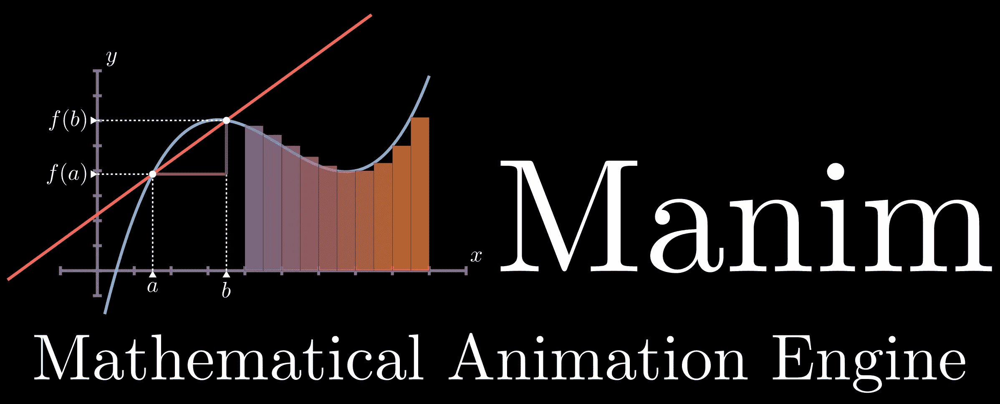

# 6 个值得更多关注的数据科学弱势库

> 原文：[`towardsdatascience.com/6-underdog-data-science-libraries-that-deserve-much-more-attention-ef64187b562a?source=collection_archive---------1-----------------------#2023-04-13`](https://towardsdatascience.com/6-underdog-data-science-libraries-that-deserve-much-more-attention-ef64187b562a?source=collection_archive---------1-----------------------#2023-04-13)

## 该是走出阴影的时候

 [Bex T.](https://ibexorigin.medium.com/?source=post_page-----ef64187b562a--------------------------------)

·

[关注](https://medium.com/m/signin?actionUrl=https%3A%2F%2Fmedium.com%2F_%2Fsubscribe%2Fuser%2F39db050c2ac2&operation=register&redirect=https%3A%2F%2Ftowardsdatascience.com%2F6-underdog-data-science-libraries-that-deserve-much-more-attention-ef64187b562a&user=Bex+T.&userId=39db050c2ac2&source=post_page-39db050c2ac2----ef64187b562a---------------------post_header-----------) 发表在 [Towards Data Science](https://towardsdatascience.com/?source=post_page-----ef64187b562a--------------------------------) ·9 min read·Apr 13, 2023

--

图片由我通过 Midjourney 提供。

当大佬们，如 Pandas、Scikit-learn、NumPy、Matplotlib、TensorFlow 等，把你的所有关注都吸引走时，很容易忽略一些朴实无华，却令人惊叹的库。

它们可能不是 GitHub 的明星项目，也不会出现在昂贵的 Coursera 专业课程中，但成千上万的开源开发者倾注了他们的心血在编写这些库中。它们静静地填补了流行库留下的空白，从阴影中默默贡献。

本文的目的是为这些库照亮一盏灯，并一同惊叹开源社区的力量。

让我们开始吧！

## 0\. Manim

图片来源于[Manim GitHub 页面](https://github.com/3b1b/manim)。MIT 许可证。

我们都对[3Blue1Brown](https://www.youtube.com/c/3blue1brown)的视频之美感到惊叹和震撼。但是大多数人不知道所有这些动画都是由 Grant Sanderson 本人编写的数学动画引擎（Manim）库创建的。（我们对 Grant Sanderson 的贡献常常*视为理所当然*。）

每一个 3b1b 视频都由 Manim 中成千上万行代码驱动。例如，传奇性的“The…
