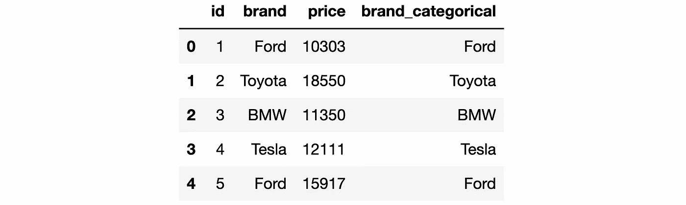

# 使用 Python Pandas 掌握分类数据操作的 7 个示例

> 原文：[`towardsdatascience.com/7-examples-to-master-categorical-data-operations-with-python-pandas-51cdcb0228ba`](https://towardsdatascience.com/7-examples-to-master-categorical-data-operations-with-python-pandas-51cdcb0228ba)

## 在处理低基数类别特征时使用类别数据类型

[](https://sonery.medium.com/?source=post_page-----51cdcb0228ba--------------------------------)[](https://towardsdatascience.com/?source=post_page-----51cdcb0228ba--------------------------------) [Soner Yıldırım](https://sonery.medium.com/?source=post_page-----51cdcb0228ba--------------------------------)

·发表于 [Towards Data Science](https://towardsdatascience.com/?source=post_page-----51cdcb0228ba--------------------------------) ·阅读时长 8 分钟·2023 年 11 月 9 日

--


（作者创建的图片）

类别变量可以从有限数量的值中取值，这些值通常是固定的。以下是一些类别变量的例子：

+   英语水平指标（A1、A2、B1、B2、C1、C2）

+   一个体的血型（A、B、AB、O）

+   人口统计信息，如种族和性别

+   教育水平

Pandas 提供了一种专用的分类变量数据类型（`category`或`CategoricalDtype`）。尽管这样的数据也可以用`object`或`string`数据类型存储，但使用`category`数据类型有几个优点。我们将了解这些优点，但首先让我们开始学习如何处理分类数据。

当我们用文本数据创建 Series 或 DataFrame 时，其数据类型默认为`object`。要使用`category`数据类型，我们需要明确地定义它。

```py
import pandas as pd

# create Series
blood_type = pd.Series(["A", "B", "AB", "0"])

print(blood_type)
# output
0     A
1     B
2    AB
3     0
dtype: object

# create Series with category data type
blood_type = pd.Series(["A", "B", "AB", "0"], dtype="category")

print(blood_type)
# output
0     A
1     B
2    AB
3     0
dtype: category
Categories (4, object): ['0', 'A', 'AB', 'B']
```

尽管值相同，但正如你在打印 Series 时通过`dtype`所示，数据类型不同。

我们将通过 7 组示例来学习以下主题：

1.  DataFrames 中的类别数据类型

1.  类别

1.  添加和更新值

1.  添加和删除类别

1.  类别之间的顺序

1.  重命名类别

1.  使用类别数据类型的优点

## 示例 1 — DataFrames 中的类别数据类型

我们可以在创建 Series 或 DataFrame 时声明`category`数据类型，如上所述。我们也可以使用`astype`函数将其转换为`category`。

在下面的代码片段中，我们首先创建一个包含两个`object`数据类型的列的 DataFrame。然后，我们将`blood_type`列的数据类型更改为`category`。记住，DataFrame 的每一列都是一个 Series。

```py
# create a DataFrame with two columns
df = pd.DataFrame(
    {
        "name": ["Jane", "John", "Ashley", "Matt"],
        "blood_type": ["A", "B", "AB", "0"]
    }
)

# check the data types
df.dtypes
# output
name          object
blood_type    object
dtype: object

# convert the blood_type column to category
df["blood_type"] = df["blood_type"].astype("category")

# check the data types again
df.dtypes
# output
name            object
blood_type    category
dtype: object
```

## 示例 2 — 类别

`category` 数据类型的 Pandas Series 是通过类别来定义的。默认情况下，类别是 Series 中的唯一值。

```py
# create Series with category dtype
brands = pd.Series(["Ford", "Toyota", "BMW"], dtype="category")

print(brands)
# output
0      Ford
1    Toyota
2       BMW
dtype: category
Categories (3, object): ['BMW', 'Ford', 'Toyota']
```

打印品牌时显示类别。我们也可以使用通过 cat 访问器提供的 `categories` 方法来提取它们。

```py
brands.cat.categories

# output
Index(['BMW', 'Ford', 'Toyota'], dtype='object')
```

它返回类别的索引。

我们还可以在创建 Series 时定义类别，具体方法如下：

```py
# create Series with category data type
brands = pd.Series(
    pd.Categorical(
        ["Ford", "Toyota", "BMW"], 
        categories=["Ford", "Toyota", "BMW", "Honda"]
    )
)

print(brands)
# output
0      Ford
1    Toyota
2       BMW
dtype: category
Categories (4, object): ['Ford', 'Toyota', 'BMW', 'Honda']
```

当前 Series 中不存在值“本田”，但它可以被添加，因为它列在类别中。

## 示例 3 — 添加和更新值

要在 `category` 数据类型的 Series 中添加新值或替换现有值，我们应该从定义的类别中选择一个值。否则，Pandas 会将 Series 的数据类型更改为 `object`。

```py
# create a Series with category data type
brands = pd.Series(["Ford", "Toyota", "BMW"], dtype="category")

print(brands)
# output
0      Ford
1    Toyota
2       BMW
dtype: category
Categories (3, object): ['BMW', 'Ford', 'Toyota']

# Add a new item of a different category
brands[3] = "Honda"

print(brands)
# output
0      Ford
1    Toyota
2       BMW
3     Honda
dtype: object
```

当我们添加了新的项“本田”时，它不在列出的类别中，最终得到的 Series 的数据类型为 `object`。

如果我们尝试将现有值更改为不同于现有类别的值，Pandas 会引发类型错误。

```py
# create a Series with category data type
brands = pd.Series(["Ford", "Toyota", "BMW"], dtype="category")

# replace the third value with Honda
brands[2] = "Honda"

# output
TypeError: Cannot setitem on a Categorical with a new category (Honda), set the categories first
```

解决这个问题的方法有很多。例如，我们可以在使用 Series 之前将“本田”作为新类别添加。

```py
# add Honda as a category
brands = brands.cat.add_categories("Honda")

# replace the third value with Honda
brands[2] = "Honda"

print(brands)

# output
0      Ford
1    Toyota
2     Honda
dtype: category
Categories (4, object): ['BMW', 'Ford', 'Toyota', 'Honda'] 
```

## 示例 4—添加和删除类别

我们可以使用 Python 列表一次添加多个类别。

```py
# create Series with category data type
sizes = pd.Series(["S", "M", "L"], dtype="category")

# add two new categories
sizes = sizes.cat.add_categories(["XS", "XL"])

print(sizes)

# output
0    S
1    M
2    L
dtype: category
Categories (5, object): ['L', 'M', 'S', 'XS', 'XL']
```

就像我们可以添加新类别一样，也可以删除现有类别。

```py
# create Series with category data type
sizes = pd.Series(["S", "M", "L", "XL", "XXL"], dtype="category")

# remove XL and XXL categories
sizes = sizes.cat.remove_categories(["XL", "XXL"])

print(sizes)

# output
0      S
1      M
2      L
3    NaN
4    NaN
dtype: category
Categories (3, object): ['L', 'M', 'S']
```

需要注意的是，如果 Series 包含属于已移除类别的值（即不再存在的类别），这些值将变为缺失值（即 NaN）。

我们可以使用 `categories` 方法从 Series 中提取现有类别。

```py
# create Series with category data type
sizes = pd.Series(["S", "M", "M", "L", "L", "S"], dtype="category")

# extract categories
sizes.cat.categories 

# output
Index(['L', 'M', 'S'], dtype='object')

# extract categories as a list
list(sizes.cat.categories)

# output
['L', 'M', 'S']
```

## 示例 5—类别之间的顺序

在某些情况下，类别之间有顺序（例如 S < M < L）。有不同的方法来强制执行这种顺序。

一种选择是使用 `as_ordered` 函数为现有的分类数据 Series 添加顺序。

```py
# create Series with category data type
sizes = pd.Series(["L", "S", "XL", "M", "L", "S"], dtype="category")

# convert it to ordered
sizes = sizes.cat.as_ordered()

print(sizes)

# output
0     L
1     S
2    XL
3     M
4     L
5     S
dtype: category
Categories (4, object): ['L' < 'M' < 'S' < 'XL']
```

我们现在看到类别之间有顺序，但顺序错误。Pandas 为字符串数据分配字母顺序，这实际上是有意义的。我们可以通过重新排序类别来修复这个问题（请查看下一个示例）。

上一个示例中的 sizes Series 有排序的类别，但顺序错误。让我们使用 `reorder_categories` 方法来修复它。

```py
# convert it to ordered
sizes = sizes.cat.reorder_categories(["S", "M", "L", "XL"])

print(sizes)

# output
0     L
1     S
2    XL
3     M
4     L
5     S
dtype: category
Categories (4, object): ['S' < 'M' < 'L' < 'XL']
```

我们将所需的类别顺序写在 Python 列表中，并将其传递给 `reorder_categories` 方法。

要从类别中移除顺序，我们可以使用 `as_unordered` 方法。让我们将其应用于之前示例中创建的 sizes Series。

```py
# convert it to unordered
sizes = sizes.cat.as_unordered()

print(sizes)

# output
0     L
1     S
2    XL
3     M
4     L
5     S
dtype: category
Categories (4, object): ['L', 'M', 'S', 'XL']
```

在创建 Series 时也可以通过使用 `ordered` 参数来强制执行顺序。

```py
# create Series with category data type
divisions = pd.Series(pd.Categorical(

    values=["C", "C", "A", "B", "A", "C", "A"], 
    categories=["C", "B", "A"], 
    ordered=True

))

print(divisions)

# output
0    C
1    C
2    A
3    B
4    A
5    C
6    A
dtype: category
Categories (3, object): ['C' < 'B' < 'A']
```

顺序是根据我们写入类别的顺序来确定的（在此示例中为 C、B、A）。

## 示例 6—重命名类别

如果需要重命名类别，我们可以使用 `rename_categories` 方法。

在之前的示例中，我们创建了一个名为“division”的 Series，包含类别 C、B 和 A。让我们重命名这些类别。

```py
# rename the categories
divisions = divisions.cat.rename_categories(["group C", "group B", "group A"])

print(divisions)

# output
0    group C
1    group C
2    group A
3    group B
4    group A
5    group C
6    group A
dtype: category
Categories (3, object): ['group C' < 'group B' < 'group A']
```

正如我们在输出中看到的，重命名类别也会更新 Series 中的值。

## 示例 7——使用类别数据类型的优势

Pandas 的主要数据结构是 DataFrame，它是一个带有标签的二维数据结构。DataFrame 中的每一列也是一个 Series 对象。因此，我们可以很容易地在 DataFrame 中使用类别数据类型。

在这个例子中，我们将创建一个示例 DataFrame，然后通过将现有列的数据类型更改为类别类型来添加一个新列。

```py
import numpy as np

# create a DataFrame with 100000 rows
cars = pd.DataFrame({

    "id": np.arange(1, 100001),
    "brand": ["Ford", "Toyota", "BMW", "Tesla"] * 25000,
    "price": np.random.randint(10000, 20000, size=100000)

})

# add a brand_categorical column
cars["brand_categorical"] = cars["brand"].astype("category")

# check the data types
cars.dtypes

# output
id                      int64
brand                  object
price                   int64
brand_categorical    category
dtype: object
```

我们创建的 DataFrame 如下所示。`brand` 和 `brand_categorical` 列存储了相同的数据，但数据类型不同。



车辆 DataFrame 的前 5 行（图像来源：作者）

使用类别数据类型而不是对象或字符串数据类型的目的是什么？数据本身还是一样的。

答案是内存使用情况。特别是当不同值的数量远低于总值数量（低基数）时，使用类别数据类型而不是对象类型可以节省大量的内存空间。

让我们通过计算车辆 DataFrame 中列的内存使用量来确认。

```py
# check the data types
cars.memory_usage()

# output
Index                   132
id                   800000
brand                800000
price                800000
brand_categorical    100204
dtype: int64
```

它计算的是以字节为单位的内存使用量。使用类别数据类型相比于对象数据类型，可以节省 8 倍的内存。当我们处理更大的数据集（例如，数百万行）时，这种差异更为重要。

## 结语

类别数据类型相比其他基于字符串的数据类型相对较少见。原因可能是我们通常在将字符串数据用于机器学习模型之前会对其进行编码。然而，即使在数据清理和准备过程中，类别数据类型也提供了重要的优势。因此，如果一个基于字符串的变量相对于总值包含的不同值较少，我强烈建议使用类别数据类型。

感谢阅读。如有任何反馈，请告诉我。
