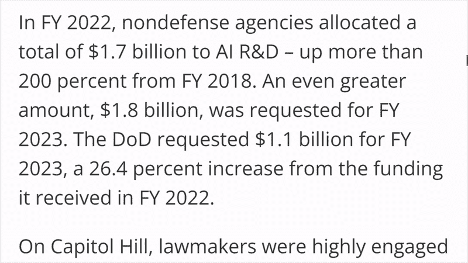
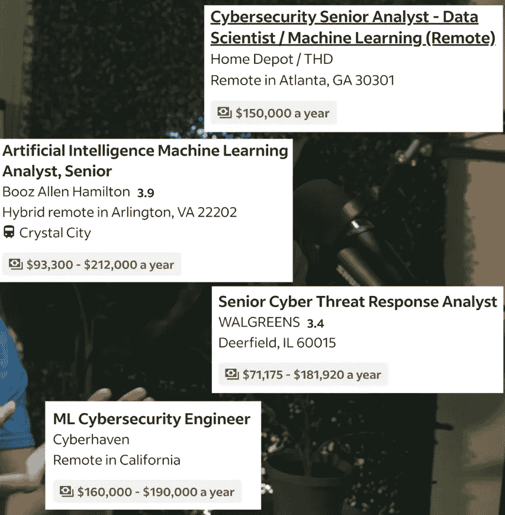
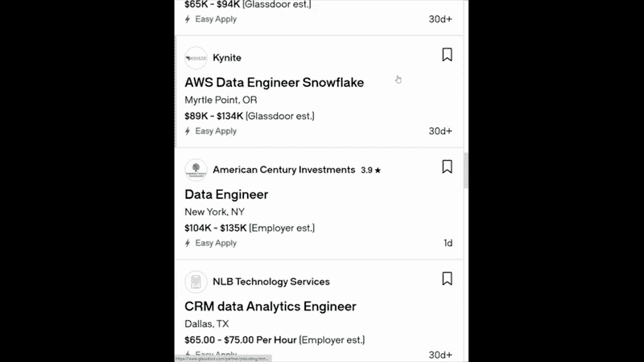
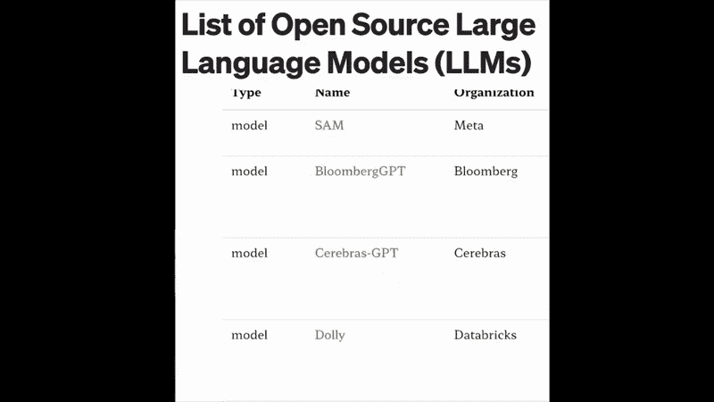
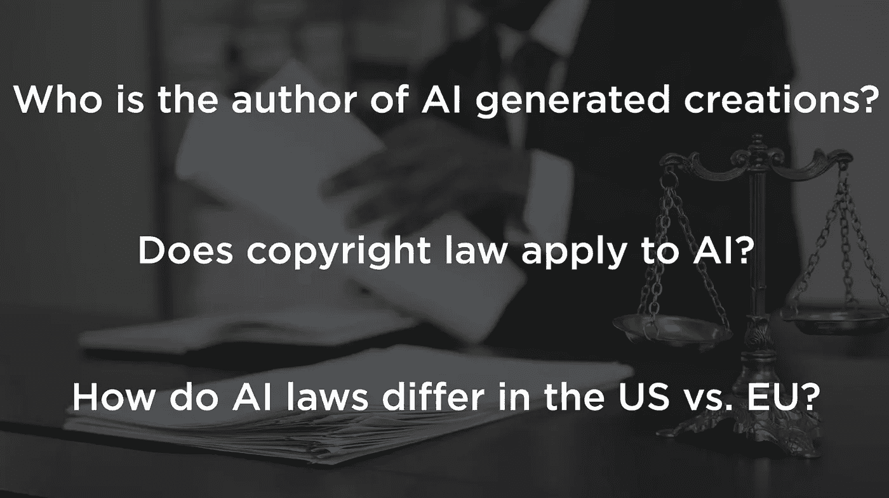
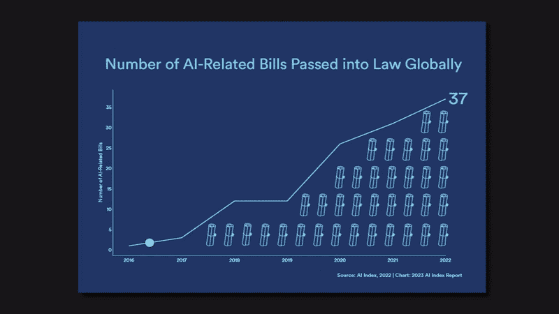
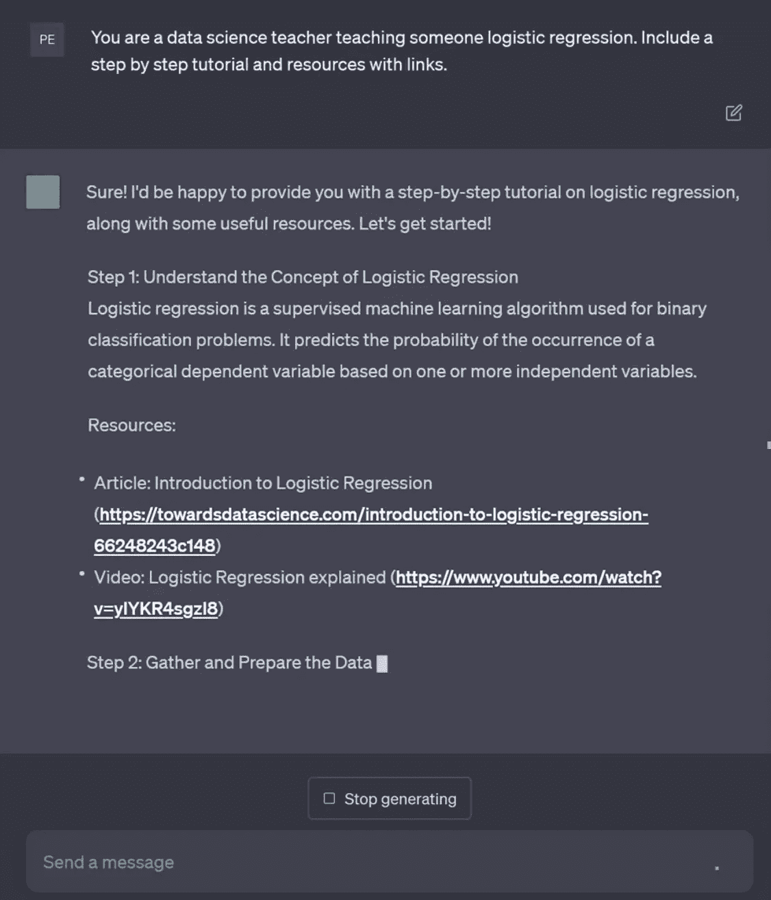
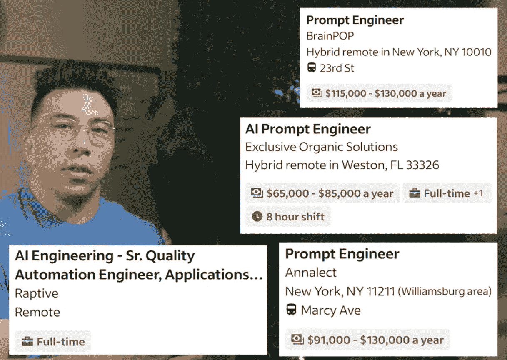
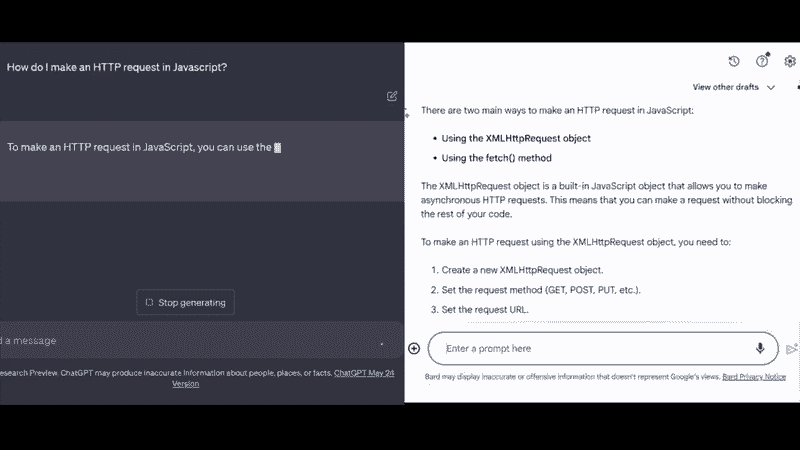

# AI 并没有威胁我们的工作！这里有 7 个值得关注的前沿职位，预计到 2030 年会崭露头角

> 原文：[`towardsdatascience.com/7-kinds-of-ai-jobs-created-in-the-future-b87191452f99`](https://towardsdatascience.com/7-kinds-of-ai-jobs-created-in-the-future-b87191452f99)

## 这篇文章突出了 AI 将在未来几年带来的创新角色。

 [Ken Jee](https://medium.com/@kenneth.b.jee?source=post_page-----b87191452f99--------------------------------)

·发布于 [Towards Data Science](https://towardsdatascience.com/?source=post_page-----b87191452f99--------------------------------) ·12 分钟阅读·2023 年 8 月 30 日

--

图片来源于 [Lucas](https://pixabay.com/users/computerizer-4588466/?utm_source=link-attribution&utm_medium=referral&utm_campaign=image&utm_content=2301646) 在 Pixabay

# 目录

+   职位 #1: AI 安全分析师与 AI 防御工程师

+   职位 #2: AI 数据工程师与数据策展人

+   职位 #3: AI 数据合规专家

+   职位 #4: AI 政策监管者

+   职位 #5: 首席 AI 伦理官和定量 AI 伦理学家

+   职位 #6: Prompt 工程师

+   职位 #7: AI 体验工程师

+   结论

ChatGPT 已经引起了世界的轰动。它已经拥有超过 1 亿用户，是有史以来增长最快的产品。

作者提供的图片

毫无疑问，它将颠覆我们的工作和操作方式。它已经彻底改变了我作为数据科学家的工作。

其他公司也没有落后于 OpenAI。来自 NVIDIA、Midjourney 以及其他大型科技公司、初创公司和开源社区的生成式 AI 技术每天都在取得令人印象深刻的进展。

在未来几年中，工作环境将经历重大变化。AI 将取代许多工作，但我认为它也会创造一些真正引人入胜的职位。现在正是开始思考未来雇主可能需要的职位和技能的时候。

# 职位 #1: **AI 安全分析师与 AI 防御工程师**

虽然令人恐惧，但 AI 已经被用来威胁和诈骗他人。语音克隆让人们能够伪装成亲人以索要和窃取金钱。全球安全威胁带来了更大的问题。

我预计政府和私人企业将大力投资于 AI 威胁的安全。例如，美国政府在过去一年中将其非机密 AI 预算增加了 26%，这似乎符合这一趋势。我预计机密预算会更高。

作者提供的图片

新角色 **AI 安全分析师或 AI 防御工程师** 将 **专注于分析和打击对公司和个人的 AI 威胁**。

作者提供的图片

## 一些所需的技能和资格

+   了解 AI 技术和应用，如语音克隆、深度伪造、自然语言处理、计算机视觉等。

+   能够识别和分析潜在的 AI 威胁和漏洞，如欺骗、网络钓鱼、恶意软件、数据泄露等。

+   能够设计和实施 AI 防御策略和解决方案，如加密、认证、验证、监控等。

+   熟悉安全标准和最佳实践，如 ISO 27001、NIST 框架等。

+   具有安全工具和框架的经验，如 TensorFlow Privacy、PySyft、PyTorch Crypten 等。

# 职位 #2: **AI 数据工程师与数据策展人**

在 Sam Altman 与 Lex Fridman 的采访中，Altman 强调了数据作为 GPT-4 改进的重要贡献者。寻找新的数据源来训练模型将对这些新技术的发展至关重要。

寻找数据是一回事，但还需要有人将这些数据结构化，以便用于训练这些大型模型。这就是 **AI 数据工程师和数据策展人** 发挥作用的地方。**他们需要找到数据，并使其适用于 AI 模型。**

需要注意的是，为这些大型语言模型收集和存储的数据通常与传统商业用途的数据收集和存储方式有很大不同。这是因为数据的多样性、体积和质量等因素差异。学习处理大型模型数据的不同技能和工具可以使某人领先于行业。

作者提供的图片

我认为这一角色将远远超出仅仅是像 GPT 这样的大型 AI 模型训练公司。随着 AI 的民主化，所有公司都希望为他们自己的用例，如客户服务和文档，训练开源的大型语言模型。

作者提供的图片

我不认为像这样的数据角色需求会很快减缓。

## 一些所需的技能和资格

+   了解数据源和格式，如文本、音频、视频、图像等。

+   能够收集、清理、标记和组织 AI 模型的数据，如使用数据管道、标注工具、数据质量检查等。

+   能够存储和管理大规模数据集，例如使用云平台、数据库、数据仓库、数据湖等。

+   能够理解和应用数据伦理和隐私原则，例如通用数据保护条例（GDPR）、消费者隐私法、数据匿名化、数据治理等。

+   熟悉人工智能技术和框架，例如自然语言处理、计算机视觉、TensorFlow、PyTorch 等。

# 职位#3: **人工智能数据合规专家**

虽然一切都围绕数据，但通常谁拥有数据仍然不清楚。在全球范围内，数据隐私法律和可用于训练大模型的数据也存在差异。公司可能需要那些对数据立法模糊地带感到舒适的律师，因为这正是这些公司运营的领域。

图片由作者提供

OpenAI、Microsoft 和 GitHub 目前因涉嫌抓取许可代码而面临诉讼。还有人猜测许多这些模型是基于盗版书籍和其他内容进行训练的。

这些模型通常还会通过用户输入的文本或图像进行训练。这是一个额外的领域，情况变得有些模糊。

随着这些问题逐渐引起重视，公司将需要具有**法律背景以及一些数据专业知识**的人员，担任**人工智能数据合规专家**，以**帮助他们应对这些挑战并降低潜在法律问题的风险**。

图片由作者提供

## 一些必需的技能和资格

+   了解数据隐私法律和法规，例如 GDPR、消费者隐私法等。

+   能够进行数据保护影响评估（DPIAs），并识别在人工智能系统中使用个人数据的潜在风险和缓解措施。

+   能够管理和映射人工智能合规的权威规则和要求，并确保与业务目标和控制的对齐。

+   能够监控和审计人工智能系统的性能和行为，确保其遵守伦理原则和标准。

+   能够与利益相关者沟通和协作，如数据科学家、工程师、法律监管者、客户等。

# 职位#4: **人工智能政策监管员**

当公司努力保持领先于法律或避免法律问题时，其他公司将需要努力弄清楚如何立法那些我们前所未见的人工智能系统。

与 ChatGPT 的进步一起，人工智能相关法案的通过数量每年都在增长，我认为我们将会看到新的立法爆炸性增长。

图片由作者提供，灵感来自于[斯坦福大学](https://hai.stanford.edu/news/2023-state-ai-14-charts)

我认为大多数 AI 立法将由智库、大学和特殊利益集团发起，但最终我们将有充分信息的个人与州和地方政府合作，以规范和监督 AI 的使用。

我会称这些人**AI 政策监管者**。他们将**帮助制定有关 AI 的立法，并在其管辖范围内执行标准实践**。

## 一些必要的技能和资格

+   AI 技术和应用及其经济和社会影响的知识。

+   能够使用 AI 工具和方法生成政策制定和评估的见解和预测。

+   能够与各种利益相关者（如研究人员、行业、民间社会和其他政府）进行沟通和合作。

+   能够平衡 AI 监管的风险和机会，并确保与伦理原则和人权的一致性。

+   能够监控和强制执行 AI 系统和用户遵守相关法律和标准。

# 职位 #5: **首席 AI 伦理官及定量 AI 伦理学家**

尽管 AI 数据合规专家将专注于在围绕 AI 的设计选择之后避免法律问题，但仍需要有人专注于是否应该做出该设计选择。所有发布的 AI 模型都应与人进行交互。我们希望这些互动能为这些人的生活带来积极的结果。

我认为 AI 伦理将进入 C-suite。我预计公司将在不久的将来任命**首席 AI 伦理官**或类似职位。

图片来源：作者

这个职位的工作是**尽可能减少生产模型和过程中的偏见**。还要**确保模型的结果对相关方是积极和公平的**。

我认为这个角色会在 C-suite 中，因为这个角色涉及到大量的限制。如果这个人没有高的职位或在组织中的尊重，解雇他们并聘用一个会放任事情发展的人会比较容易。实际上，这种情况可能仍会发生。

## 一些必要的技能和资格

+   AI 技术及其对社会和个人的影响的技术知识。

+   了解现有和新兴与 AI 伦理相关的法律和标准的监管知识。

+   具有商业头脑和关于 AI 应用的特定领域及背景的行业知识。

+   沟通技巧以及跨组织边界和与不同利益相关者合作的能力。

+   具有前瞻性和预测能力，以预见 AI 创新的潜在后果和机会。

**首席 AI 伦理官**的最大武器将是**定量 AI 伦理学家**。他们的工作是**分析模型中的偏见水平并衡量对受影响群体的影响**。

我认为这个角色将标志着伦理观念在组织中的重大变化。对于创建这些模型的人来说，需要数据来推动变革。尽可能量化伦理将提高认可的速度。

## 一些必需的技能和资格

+   对 AI 技术、系统、算法和工具的技术知识。

+   对指导 AI 开发和使用的理论和原则的伦理理解。

+   分析和批判性思维技能，以评估复杂的伦理问题并提出解决方案。

+   沟通技能和向不同听众解释和辩护伦理决策的能力。

+   统计和数学技能，以测量和量化 AI 模型及结果中的偏见和公平性水平。

# 职位 #6: **提示工程师**

作为数据科学家，我每天使用 ChatGPT。老实说，我几乎不再写代码了。我大部分时间都在编写和修订提示，以改进 ChatGPT 编写的代码。

在我看来，未来大量的知识工作将依赖于提示**，** 即我们创建输入以要求 AI 生成所需结果的方式。

例如，我可以提示 ChatGPT 成为数据科学教师，并向其提问。

作者提供的图片

我还可以将它提示成为一个著名的艺术评论家，利用我对图片的描述来改善它们，以便输入到像 Midjourney 这样的文本到图像模型中。

**创造脚本以将这些模型塑造成你想要的样子或执行你希望的操作**是一门艺术。

我认为特定行业会有**提示工程师**的市场。而且有些人已经在尝试聘请这些工程师，薪资超过 $300,000。

作者提供的图片

## 一些必需的技能和资格

+   批判性思维和解决问题的技能，以创建有效的提示，向 AI 模型传达人的意图。

+   数学和分析技能，以理解和操作数学公式及数据。

+   沟通和写作技能，以使用自然语言编写清晰简明的提示。

+   关注细节和准确性，以避免提示中的错误和模糊性。

+   多才多艺和适应能力，以应对不同的 AI 系统和领域。

+   团队合作和协作技能，以协调其他提示工程师和相关方。

+   编码和编程技能，以使用各种工具和框架进行提示工程。

+   A/B 测试和实验技能，以评估和优化提示的性能。

# 职位 #7: **AI 体验工程师**

目前，我们通过文本、图片以及有时通过语音直接与 AI 互动。我预计随着 AI 的不断发展，这种情况将迅速变化。公司将希望让 AI 融入我们的生活。这个工作的主要部分由设计师或用户体验工程师完成。

如果人们不断使用这些工具，公司将希望它们能提供最佳的体验。这可能是选择一种产品而非另一种产品的关键因素。

我个人在使用 ChatGPT 与 Bard 相比时获得了这种体验。我发现使用 ChatGPT 的体验要好得多：我喜欢它的美学，更喜欢它将所有文本写在屏幕上的方式，还喜欢我可以将其设置为暗模式。即使输出相同，我通常也会更喜欢 ChatGPT。

ChatGPT（左图）和 Bard（右图）之间用户体验的比较。图片由作者提供

我认为公司将大量投资于新的**AI 体验工程师**，以**理解和开发消费者使用其产品的方式**，使产品脱颖而出**。**

## 一些必要的技能和资格

+   具有用户研究、用户测试和用户反馈的经验，以了解用户的需求、偏好和痛点。

+   能够创建用户角色、用户旅程、用户流程、线框图、模型图和原型，以设计和传达用户体验。

+   了解设计原则、模式和最佳实践，以创建直观、可访问和引人入胜的用户界面。

+   熟练使用设计工具，如 Sketch、Figma、Adobe XD 等，以创建和迭代产品的视觉设计。

+   熟悉 HTML、CSS 和 JavaScript 等编程语言，以实施产品的前端设计并与开发人员合作。

+   理解 AI 概念、框架和工具，以将 AI 功能集成到产品中。

+   了解 AI 伦理和原则，以确保 AI 的负责任和公平使用。

# 结论

生成式 AI 的兴起将取代许多传统工作，但它也承诺带来一系列令人兴奋的新就业前景。这一影响已经显而易见，显著改变了各行业专业人士的工作环境。随着这一波 AI 创新的持续推进，它为这些有趣且必要的角色的创造提供了机会：

1.  **AI 安全分析师 & AI 防御工程师：** 鉴于 AI 潜在的恶意使用，专注于识别和缓解 AI 威胁的角色变得至关重要。

1.  **AI 数据工程师 & 数据策展人：** 这些专业人士将负责采购、组织和管理与大型语言模型相关的数据。

1.  **AI 数据合规专家：** AI 数据使用的法律复杂性需要专业人士能够处理 AI 法规中的复杂问题，特别是合规性，以确保减少法律风险。

1.  **AI 政策监管员：** 随着 AI 系统挑战现有法律框架，亟需熟练的专业人士与政府合作，制定有关 AI 实施的适当规则和标准。

1.  **首席 AI 伦理官和定量 AI 伦理学家：** 将会有越来越大的需求来确保道德和公正的结果。公司可能会设立首席 AI 伦理官（以解决生成模型中的突出偏见）和定量 AI 伦理学家（通过量化这些模型中的偏见及其对利益相关者的影响来帮助实现这一目标）的角色。

1.  **提示工程师：** 这一角色预计将会兴起，因为从业者通过制定强有力的提示来优化 AI 模型的输出，从而提高模型的效果和实用性。

1.  **AI 体验工程师：** 为了提升 AI 产品的用户友好性和实用性，公司将需要专门设计用户与 AI 互动的 AI 体验工程师。这将影响消费者在竞争市场中的产品偏好。

适应性和前瞻性将是拥抱这些新兴角色及其技能要求的关键，这些角色和要求正在被 AI 重塑的行业中不断发展。

你对这些工作职位中哪个最感兴趣？我是否遗漏了什么？留下评论吧！我很想知道！

如果你喜欢这篇文章，记得在 Medium 上关注我，获取更多类似的内容，或者[通过电子邮件订阅我](https://medium.com/@kenneth.b.jee/subscribe)。你还可以将这篇文章分享给你网络中的数据科学爱好者！

如果你喜欢有关数据科学、机器学习和 AI 的有趣且富有信息的视频，[请查看我的 YouTube 频道](https://www.youtube.com/@KenJee_ds)，我提供评论、教程和其他教育视频。

要获取我内容创作的每周更新和数据科学行业的额外学习资源，[请订阅我的通讯，《数据滴滴！*](https://www.kennethjee.com/newsletter)

此外，考虑通过[注册会员](https://medium.com/@kenneth.b.jee/membership)来支持我和其他成千上万的作者。

 [## 使用我的推荐链接加入 Medium — Ken Jee

### 作为 Medium 会员，你的会员费的一部分将用于支持你阅读的作者，你可以全面访问每一个故事…

medium.com](https://medium.com/@kenneth.b.jee/membership?source=post_page-----b87191452f99--------------------------------)
