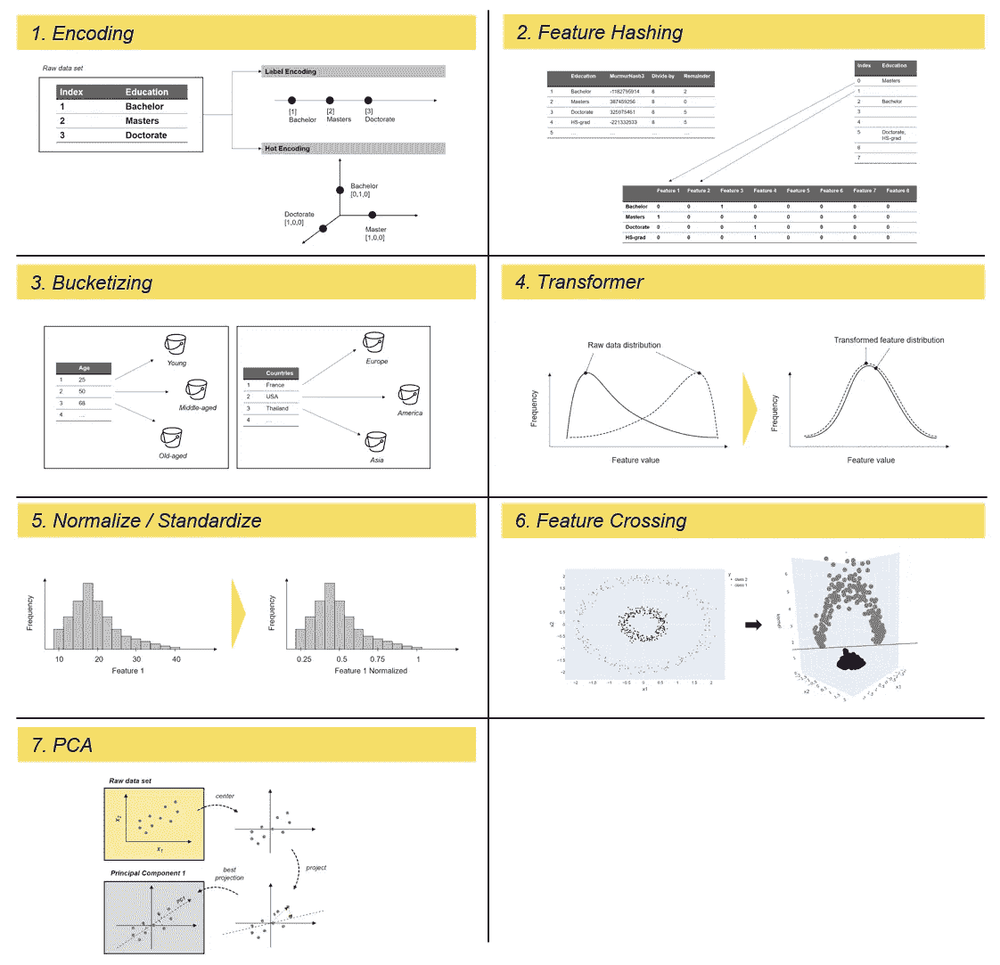

# 最常用的 7 种特征工程技术

> 原文：[`towardsdatascience.com/7-of-the-most-used-feature-engineering-techniques-bcc50f48474d?source=collection_archive---------0-----------------------#2023-01-09`](https://towardsdatascience.com/7-of-the-most-used-feature-engineering-techniques-bcc50f48474d?source=collection_archive---------0-----------------------#2023-01-09)

## 使用 Scikit-Learn、Tensorflow、Pandas 和 Scipy 的实践特征工程

[](https://dmnkplzr.medium.com/?source=post_page-----bcc50f48474d--------------------------------)[](https://towardsdatascience.com/?source=post_page-----bcc50f48474d--------------------------------) [Dominik Polzer](https://dmnkplzr.medium.com/?source=post_page-----bcc50f48474d--------------------------------)

·

[关注](https://medium.com/m/signin?actionUrl=https%3A%2F%2Fmedium.com%2F_%2Fsubscribe%2Fuser%2F3ab8d3143e32&operation=register&redirect=https%3A%2F%2Ftowardsdatascience.com%2F7-of-the-most-used-feature-engineering-techniques-bcc50f48474d&user=Dominik+Polzer&userId=3ab8d3143e32&source=post_page-3ab8d3143e32----bcc50f48474d---------------------post_header-----------) 发表在 [Towards Data Science](https://towardsdatascience.com/?source=post_page-----bcc50f48474d--------------------------------) · 37 分钟阅读 · 2023 年 1 月 9 日 [](https://medium.com/m/signin?actionUrl=https%3A%2F%2Fmedium.com%2F_%2Fvote%2Ftowards-data-science%2Fbcc50f48474d&operation=register&redirect=https%3A%2F%2Ftowardsdatascience.com%2F7-of-the-most-used-feature-engineering-techniques-bcc50f48474d&user=Dominik+Polzer&userId=3ab8d3143e32&source=-----bcc50f48474d---------------------clap_footer-----------)

--

[](https://medium.com/m/signin?actionUrl=https%3A%2F%2Fmedium.com%2F_%2Fbookmark%2Fp%2Fbcc50f48474d&operation=register&redirect=https%3A%2F%2Ftowardsdatascience.com%2F7-of-the-most-used-feature-engineering-techniques-bcc50f48474d&source=-----bcc50f48474d---------------------bookmark_footer-----------)

最常用的 7 种特征工程技术 — 作者提供的图片

# 内容目录

```py
Introduction 1\. Encoding
  1.1 Label Encoding using Scikit-learn
  1.2 One-Hot Encoding using Scikit-learn, Pandas and Tensorflow
2\. Feature Hashing
  2.1 Feature Hashing using Scikit-learn
3\. Binning / Bucketizing
  3.1 Bucketizing using Pandas
  3.2 Bucketizing using Tensorflow
  3.3 Bucketizing using Scikit-learn
4\. Transformer
  4.1 Log-Transformer using Numpy
  4.2 Box-Cox Function using Scipy
5\. Normalize / Standardize
  5.1 Normalize and Standardize using Scikit-learn
6\. Feature Crossing
  6.1 Feature Crossing in Polynomial Regression
  6.2 Feature Crossing and the Kernel-Trick
7\. Principal Component Analysis (PCA)
  7.1 PCA using Scikit-learn
Summary
References
```

# 介绍

特征工程描述了制定相关特征的过程，这些特征尽可能准确地描述了潜在的数据科学问题，并使算法能够理解和学习模式。换句话说：

> 你提供的特征作为与模型沟通你对世界的理解和知识的方式。
