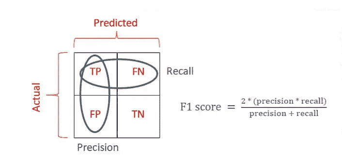
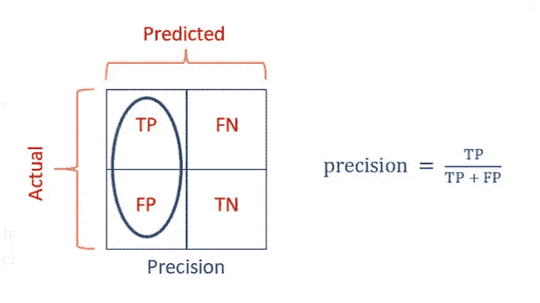
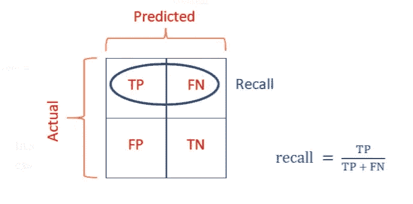
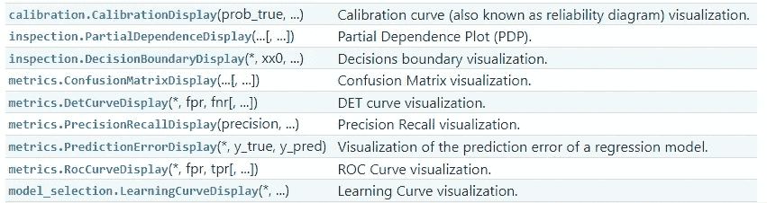

# 你已经成为一个高级 Sklearn 用户的 7 个迹象

> 原文：[`towardsdatascience.com/7-signs-youve-become-an-advanced-sklearn-user-without-even-realizing-it-3b7085c600f1`](https://towardsdatascience.com/7-signs-youve-become-an-advanced-sklearn-user-without-even-realizing-it-3b7085c600f1)

## 以及一个专业的机器学习工程师…

[](https://ibexorigin.medium.com/?source=post_page-----3b7085c600f1--------------------------------)[](https://towardsdatascience.com/?source=post_page-----3b7085c600f1--------------------------------) [Bex T.](https://ibexorigin.medium.com/?source=post_page-----3b7085c600f1--------------------------------)

·发表于 [Towards Data Science](https://towardsdatascience.com/?source=post_page-----3b7085c600f1--------------------------------) ·阅读时间 10 分钟·2023 年 6 月 1 日

--


图片由我使用 Midjourney 制作

## 介绍

准备好被惊艳到吧！我将列出 **七个** 不可否认的迹象，表明你已经成为一个高级的 Sklearn 用户而丝毫未曾察觉。由于 Sklearn 是地球上使用最广泛的机器学习库，你不妨将这些迹象看作是你已经是一个非常有能力的机器学习从业者的标志。

让我们开始吧！

## 0\. 三个分区

我们在机器学习中几乎所做的一切，都是为了避免过拟合。而对抗过拟合的最强工具之一，就是将数据拆分为三部分，而非两部分！

谷歌决策智能部门负责人**Cassie Kozyrkov**表示，数据拆分是机器学习中最强大的理念，你也同意她的观点。

你知道过拟合不仅会发生在训练集上，还可能出现在验证集上。你已经观察到，使用相同的数据集进行测试和超参数调优，常常会引入微妙的数据泄露。

通过不断调整超参数，基于模型在特定测试集上的表现，有可能使模型对该特定数据集过拟合。

所以，你使用 50% 的可用数据训练所选模型。接着，你使用包含 25% 数据的独立验证集对模型进行微调和评估。最后，当你的模型准备好投入实际使用时，你会用一个完全未接触过的、原始的（我指的是你甚至没有查看前五行）测试集进行最后一次测试。

牢记这一规则，你已经将这段代码片段保存在桌面上，以便随时复制粘贴：

```py
from sklearn.model_selection import train_test_split

def split_dataset(data, target, train_size=0.5, random_state=42):
    # Splitting the dataset into training set and remaining data
    X_train, remaining_data, y_train, remaining_target = train_test_split(
        data, target, train_size=train_size, random_state=random_state
    )

    # Splitting the remaining data equally into test and validation sets
    X_val, X_test, y_val, y_test = train_test_split(
        remaining_data, remaining_target, test_size=0.5, random_state=random_state
    )

    return X_train, X_val, X_test, y_train, y_val, y_test
```

> SYDD！如果说未经审视的生活不值得过，那么这里有四个字供你遵循：拆分你该死的数据。 — **Cassie Kozyrkov**

[## 数据科学中最强大的理念](https://towardsdatascience.com/the-most-powerful-idea-in-data-science-78b9cd451e72?source=post_page-----3b7085c600f1--------------------------------)

### 编辑描述

[数据科学中最强大的理念](https://towardsdatascience.com/the-most-powerful-idea-in-data-science-78b9cd451e72?source=post_page-----3b7085c600f1--------------------------------)

## 1. 设置常识基线

如何判断自己在机器学习项目中所做的任何事情是否对最终产品——完美模型有贡献？

在这里，“一见钟情”的方法永远不够。那个人需要一个北极星，能随时参考以判断他们刚训练的模型是否能通过即使是最简单的测试。

在你的项目中，你一次又一次地看到，这一关键的北极星是**常识基线**性能。

一旦确定了机器学习任务、选择了特征并定义了目标变量，你可以拟合`DummyRegressor`或`DummyClassifier`来评估随机猜测模型在你特定问题上的表现。这一得分作为基线，你所有后续的实验都旨在提高这一初始结果。

```py
from sklearn.dummy import DummyClassifier

clf = DummyRegressor().fit(X_train, y_train)
clf.score(X_test, y_test)
```

你也总是不厌其烦地向他人推荐这一做法，包括你的好友 Bex。

他曾经愚蠢地尝试了所有适合的 Sklearn 模型和越来越复杂的深度学习架构用于图像分类任务，以弄清楚为什么所有实验都无法超过某个阈值。

你指出 Bex 缺少基线，当他尝试`DummyClassifier`时，他意识到整个任务是不可解的，他的所有努力都浪费了，因为没有一个实验能够超越随机猜测模型。他不得不寻找新的数据集。

没有什么比**过度工程**的恐怖更让人不安了，完全相信你的模型是卓越的，结果却发现它仅仅和一个盲人投掷飞镖的猴子一样有效。

你给你的朋友上了一堂宝贵的课。

## 2. 特征选择与工程

当面对一个拥有几十甚至数百个特征的数据集时，你会注意到你的宝贵时间和硬件资源。与其盲目地在所有现有特征上测试模型，你会退一步，尝试隔离出最有潜力的特征。

首先，你可以逐一查看特征，使用`VarianceThreshold`去除那些方差不显著的特征。然后，你可以通过分析特征之间的关系来查看大局，从中决定哪些特征是值得保留的。

为了帮助你做出决定，你可以使用诸如成对相关系数这样的指标，或者更好的是，采用基于模型的方法，使用如`RFECV`（递归特征消除与交叉验证）或`SelectFromModel`的类。

[## 3 步特征选择指南：提升模型的表现](https://towardsdatascience.com/3-step-feature-selection-guide-in-sklearn-to-superchage-your-models-e994aa50c6d2?source=post_page-----3b7085c600f1--------------------------------)

### 编辑描述

[## 3 步特征选择指南：提升模型的表现](https://towardsdatascience.com/3-step-feature-selection-guide-in-sklearn-to-superchage-your-models-e994aa50c6d2?source=post_page-----3b7085c600f1--------------------------------)

随后，你施展你的特征工程魔法，以最大限度地发挥最佳特征的作用。在这里，你对数值变换（如标准化、归一化和对数变换）之间复杂差异的了解将是关键。

你对`StandardScaler`、`MinMaxScaler`、`QuantileTransformer`、`PowerTransformer`等的权衡了如掌中之物。

[## 如何区分缩放、标准化和对数变换](https://towardsdatascience.com/how-to-differentiate-between-scaling-normalization-and-log-transformations-69873d365a94?source=post_page-----3b7085c600f1--------------------------------)

### 编辑描述

[## 如何区分缩放、标准化和对数变换](https://towardsdatascience.com/how-to-differentiate-between-scaling-normalization-and-log-transformations-69873d365a94?source=post_page-----3b7085c600f1--------------------------------)

在处理缺失值时，你不仅仅停留在`SimpleImputer`的均值/众数插补等简单策略上。你对基于模型的高级插补技术如`KNNImputer`或`IterativeImputer`有着深刻的理解，并能够根据缺失值的类型选择最合适的方法。

[## Sklearn 高级缺失数据插补方法深入教程](https://towardsdatascience.com/advanced-missing-data-imputation-methods-with-sklearn-d9875cbcc6eb?source=post_page-----3b7085c600f1--------------------------------)

### 编辑描述

[## 高级缺失数据插补方法教程：使用 Sklearn](https://towardsdatascience.com/advanced-missing-data-imputation-methods-with-sklearn-d9875cbcc6eb?source=post_page-----3b7085c600f1--------------------------------)

对于分类特征，你使用多种技术来正确编码它们，如`OrdinalEncoder`或`OneHotEncoder`。当使用后一种方法时，你会非常小心虚拟变量陷阱，这可能会在数据集中引入多重共线性。

尽管我只是一个接一个地列出了特征选择和特征工程，你这位经验丰富的专家知道不应将两者锁定在一个固定的顺序中。你在两者之间迭代，反复试验和完善你的方法。

## 3\. 模型选择

这时，你展示了你所参加的众多在线课程或你华丽的教育背景并未白费。

你以*完全*的冷静和自信直观地选择最适合给定任务的算法和模型架构。在这里，你的目标并非总是选择性能最好的模型，而是选择在现有约束下最适合问题的模型。

这些约束在你的大脑中像五个巨大的障碍：

1.  **计算资源**：如果硬件有限，你选择更简单和更小的模型，即使这意味着性能下降。

1.  **时间限制**：当森林模型和深度学习模型对你的时间和预算施加过大压力时，你倾向于选择旧的线性模型或浅层树。

1.  **模型复杂度与性能权衡**：你在强大预测能力的模型（但可能过拟合）和简单模型（可能欠拟合）的之间找到平衡。

1.  **可解释性**：当模型解释性和利益相关者信心至关重要时，你优先考虑线性模型或树模型。

1.  **数据集大小**：你根据数据的大小指导模型选择。一些模型在大型数据集上表现出色，比如深度学习模型，而 SVM 等模型更适合小型数据集。

模型选择是一门艺术，你也如此对待它。

## 4\. 战略性交叉验证

如果说有什么比将数据分成三份更让你喜欢的，那就是交叉验证。每当你的时间和资源限制允许时，你总是尝试使用适当的 CV 策略。

你非常清楚，交叉验证（CV）是提供最可靠模型性能估计的方法，使其成为你在应对过拟合或欠拟合时最宝贵的工具。

除了简单的 `KFold` CV，你还利用其他强大的策略，例如：

1.  `StratifiedKFold` - 用于分类任务。

1.  `RepeatedKFold` - 当你特别关注模型性能的准确估计时。

1.  `ShuffleSplit` - 用于更好地控制训练/测试分割。

1.  `GroupKFold` - 用于非 IID 数据（独立同分布）。

1.  `TimeSeriesSplit` - 用于时间序列数据。

[](/one-stop-tutorial-on-all-cross-validation-techniques-you-can-should-use-7e1645fb703c?source=post_page-----3b7085c600f1--------------------------------) ## 一站式教程：你可以（应该）使用的所有交叉验证技术

### 编辑描述

towardsdatascience.com

在你的交叉验证工作中，Sklearn 管道占据了重要位置。你将预处理和建模结合成一个单一的管道，而不是在 CV 分割器外部执行预处理和内部建模。

管道是你防止数据泄露的额外保障，允许你编写可读的、模块化的代码，其他人也很乐意阅读。

[](/sklearn-pipelines-for-the-modern-ml-engineer-9-techniques-you-cant-ignore-637788f05df5?source=post_page-----3b7085c600f1--------------------------------) ## Sklearn 管道现代 ML 工程师指南：你不能忽视的 9 种技术

### 编辑描述

towardsdatascience.com

## 5\. 对随机性的完全控制

你不和随机性开玩笑。你从经验中学到，紧紧控制伪随机生成器可以节省你几个小时的时间，具体表现为：

+   可重复性

+   调试和测试

+   模型性能比较

+   超参数调整

你也很自豪地知道各种播种方法的细节：

1.  `random_state=None` - Sklearn 使用全局 NumPy 种子 `np.random.seed(seed_number)` 作为默认行为。在这种情况下，每次调用涉及随机性的函数，如`fit`、`train_test_split`、`split`、CV 类等，都会产生不同的结果。

1.  `random_state=integer` - 调用依赖于随机性的函数（如上所述）总是会产生相同的结果，前提是使用相同的整数种子。你有你最喜欢的种子（我的是 1121218）。

1.  `random_state=np.random.RandomState`（一个 RNG 实例） - 这种播种方法提供了最稳健的 CV 结果，尽管传递整数被认为更安全且更可取。它每次运行都会返回不同的结果。

你还在 iPhone 上设置了每周提醒，以便阅读 [控制随机性](https://scikit-learn.org/stable/common_pitfalls.html#controlling-randomness) 部分，以免这些细节从记忆中泄漏。

## 6\. 不使用 Sklearn 进行超参数调整

你尊敬 Sklearn，因为它引入了`HalvingGridSearch`和`HalvingRandomSearch`来修复比乌龟还慢的`GridSearch`，但在你当前的工作流程中，你友好地转向其他工具。

像今天的酷孩子一样，你的首选是 Optuna。它更具 Python 风格，更智能，并提供了 Sklearn 甚至不会考虑添加的大量小玩意。

你最喜欢的 Optuna 特性包括：

+   与各种框架的无缝集成：Jupyter、Sklearn、XGBoost、CatBoost、TensorFlow、PyTorch，等等。

+   先进的调整算法，名字你甚至发音不出来。

+   在调整过程开始之前，自动排除不靠谱的超参数。

+   更具 Python 风格且更易读的参数网格。

+   可视化和分析功能，包括参数重要性图、平行坐标图和优化历史图。

+   分布式计算以利用多个核心。

很可能，你最喜欢的 Optuna 教程是：

[## 为什么 Kaggle 上的每个人都对 Optuna 在超参数调整中的狂热？

### 编辑描述

[towardsdatascience.com](https://towardsdatascience.com/why-is-everyone-at-kaggle-obsessed-with-optuna-for-hyperparameter-tuning-7608fdca337c?source=post_page-----3b7085c600f1--------------------------------)

## 7\. 在另一个层次上的模型评估

就像你擅长烹饪主菜一样，你在准备甜点——模型评估方面也表现出色。

在你的一生中，你无数次调用过：

```py
import sklearn

sklearn.metrics.SCORERS.keys()
```

查看你测量模型表现的所有选项。你不满足于从这个列表中选择一个指标，而是倾向于选择多个指标，从不同角度评估和优化你的模型。

## 多类别分类指标的综合指南

### 编辑描述

towardsdatascience.com

在这方面你最大的优势是区分所有疯狂的分类指标及其根据所选分类器是**OVO**还是**OVR**而变化的微妙方式。

你也曾因为将这些图片设置为手机的自动更换壁纸而被称为**怪咖**几次（但你一点也不在意 :）。



图片由我提供

为了更准确地展示你模型的表现，你努力避免炫耀，使用了以下一些可视化工具：



[Sklearn 用户指南的截图。BSD-3 条款许可证。](https://scikit-learn.org/stable/visualizations.html#available-plotting-utilities)

## 结论

尽管标题和文章在承认老 Sklearn 高手的同时有一种玩笑的语气，但我内在的意图是为初学者提供指导。我想弥合廉价在线课程中流行的陈旧的复制粘贴知识与只能通过几个月的实际操作和经验获得的实用知识和专业技能之间的差距。

我希望这篇文章不仅为你提供了灵感，还带来了一点娱乐，帮助你深入探索 Sklearn 并成为它的高手！

感谢阅读！

喜欢这篇文章和它那古怪的写作风格？想象一下，能够访问更多类似的文章，所有这些都由一个聪明、迷人、机智的作者（顺便说一句，就是我 :)）编写。

仅需 4.99 美元的会员，你将不仅能访问我的故事，还能获得 Medium 上最聪明、最杰出的头脑的宝贵知识。如果你使用[我的推荐链接](https://ibexorigin.medium.com/membership)，你将获得我超新星般的感激和一个虚拟的高五，以支持我的工作。

[## 使用我的推荐链接加入 Medium - Bex T.](https://ibexorigin.medium.com/membership?source=post_page-----3b7085c600f1--------------------------------)

### 获取所有⚡高级⚡内容的独家访问权限，无限制地浏览 Medium。通过购买我支持我的工作……

[ibexorigin.medium.com](https://ibexorigin.medium.com/membership?source=post_page-----3b7085c600f1--------------------------------) 

图片由我使用 Midjourney 制作
