# 7 步骤帮助你让 Matplotlib 条形图更美观

> 原文：[`towardsdatascience.com/7-steps-to-help-you-make-your-matplotlib-bar-charts-beautiful-f87419cb14cb`](https://towardsdatascience.com/7-steps-to-help-you-make-your-matplotlib-bar-charts-beautiful-f87419cb14cb)

## 通过简单的调整轻松提升 Matplotlib 数据可视化的质量

[](https://andymcdonaldgeo.medium.com/?source=post_page-----f87419cb14cb--------------------------------)[](https://towardsdatascience.com/?source=post_page-----f87419cb14cb--------------------------------) [Andy McDonald](https://andymcdonaldgeo.medium.com/?source=post_page-----f87419cb14cb--------------------------------)

·发布于 [Towards Data Science](https://towardsdatascience.com/?source=post_page-----f87419cb14cb--------------------------------) ·13 分钟阅读·2023 年 3 月 27 日

--

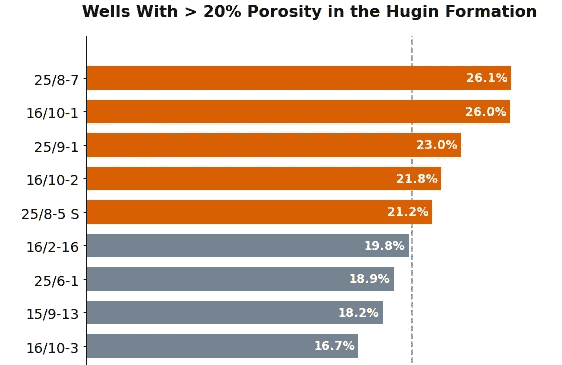

Matplotlib 的水平条形图，在更改了多个特征后，使其更具视觉吸引力。图片来源于作者。

条形图是一种常用的数据可视化工具，其中分类特征由长度/高度不同的条形表示。条形的高度或长度对应于该类别所表示的值。

条形图可以在 [**matplotlib**](https://matplotlib.org/) 中轻松创建。然而， [**matplotlib**](https://matplotlib.org/) 库通常被认为是生成不令人兴奋的图表的库，并且使用起来可能具有挑战性。然而，通过坚持、探索以及几行额外的 [**Python**](https://www.python.org/) 代码，我们可以生成独特、美观且信息量丰富的图形。

如果你想了解 Matplotlib 在稍加努力后的能力，你可能会对查看我之前的文章感兴趣：

[](/3-unique-charts-created-with-matplotlib-you-probably-havent-seen-before-421ab8cdd36f?source=post_page-----f87419cb14cb--------------------------------) ## 3 个你没想到是用 Matplotlib 创建的独特图表

### 利用 Python 的 Matplotlib 创建高级数据可视化

towardsdatascience.com

在本文中，我们将探讨如何将一个无聊的图表转变为：

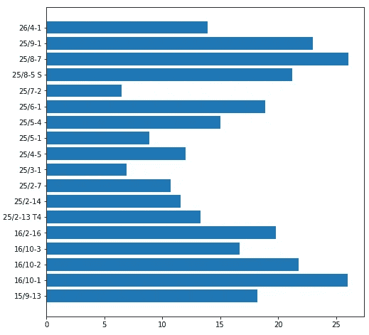

Matplotlib 的水平条形图显示了不同储层区间的孔隙度值。图片来源于作者。

变成这样：

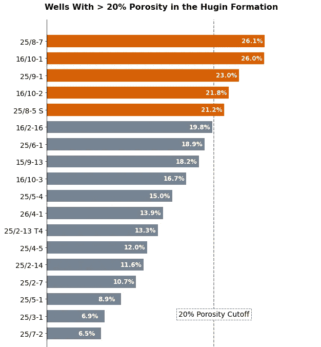

在将条形图从一个平淡的图形转变为更具视觉吸引力的图形之前和之后的对比。作者提供的图片。

我们将看到如何通过几行简单的 Python 代码来改善我们试图讲述的故事。

# 教程的视频版本

如果你想查看如何从零开始构建这段代码的视频形式，你可能会对以下内容感兴趣：

# 导入库并设置数据

第一步是导入我们将要使用的库。在这种情况下，我们将使用 [**pandas**](https://pandas.pydata.org/) 来存储数据，并使用 [**matplotlib**](https://matplotlib.org/) 来创建图形。

```py
import pandas as pd
import matplotlib.pyplot as plt
```

接下来，我们将创建一些数据，这些数据来源于 [**Xeex Force 2020 Lithology Machine Learning competition**](https://zenodo.org/record/4351156#.ZCFr8OzMIeY)。这些数据表示单个井，包含 Hugin Fm 内砂岩岩性平均孔隙度值。这些井起源于挪威大陆架。

请参阅文章底部以获取有关此数据集的更多详细信息。

我们可以通过一个简单的字典来创建数据，而不是从 CSV 文件中加载，并将其传递给 `pd.DataFrame()` 函数。

```py
wells_porosity = {'15/9-13': 18.2, '16/10-1': 26.0, 
 '16/10-2': 21.8, '16/10-3': 16.7, '16/2-16': 19.8,
 '25/2-13 T4': 13.3, '25/2-14': 11.6, '25/2-7': 10.7, 
 '25/3-1': 6.9, '25/4-5': 12.0, '25/5-1': 8.9,
 '25/5-4': 15.0, '25/6-1': 18.9, '25/7-2': 6.5, 
 '25/8-5 S': 21.2, '25/8-7': 26.1, '25/9-1': 23.0,
 '26/4-1': 13.9}

df = pd.DataFrame(wells_porosity.items(), columns=['well', 'porosity'])
```

# 使用 Matplotlib 创建基本条形图

现在我们已经设置好 pandas 数据框，我们可以开始创建我们的第一个条形图。创建条形图有几种方法，其中一种是直接使用数据框（`df.plot(kind='bar'....)`），然而，在本文中，我们将专注于使用以 matplotlib 为中心的代码来构建我们的图表。

要使用 matplotlib 创建一个基本的条形图，我们首先需要设置我们的 fig 和 ax 变量，这些变量将被设置为 `plt.subplots()`。在此函数中，我们可以传入图形大小。

接下来，我们将创建一个名为 bars 的新变量，并将其分配给 `plt.bar()`。在此函数中，我们可以简单地传入我们的分类变量，此处为井名称列表，以及平均孔隙度值。

```py
fig, ax = plt.subplots(figsize=(8,8))

bars = plt.bar(df['well'], df['porosity'])

plt.show()
```

当运行时，我们会看到如下的条形图。正如你所见，它非常基础，也不太吸引人。

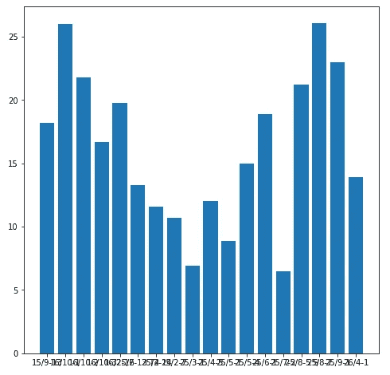

使用 matplotlib 生成的基本条形图。作者提供的图片。

如果我们仔细查看图表，会发现更多问题：

+   阅读 x 轴上的标签很困难

+   我们需要更加动脑筋来理解每个条形的值

+   比较条形图是困难的

让我们看看如何创建一个更有效、更具美感的可视化。

# 1\. 旋转你的图表

改善条形图的第一步是将其旋转 90 度。

这使得阅读像我们这样较长的标签变得更容易。我们还可以考虑旋转 x 轴上的标签，但这需要读者也倾斜头部来尝试阅读它们。

此外，水平条形图是在报告或演示文稿中节省空间的绝佳方式，同时保持可读性。如果你有大量类别，这尤其有用。

要旋转我们的条形图，我们需要将 matplotlib 中调用的图表类型从 `.bar()` 改为 `.barh()`。

```py
fig, ax = plt.subplots(figsize=(8,8))

bars = plt.barh(df['well'], df['porosity'])

plt.show()
```

我们得到的图表是带有类别标签（井名）的格式更加美观和易读。

我们现在可以明确哪一根条形属于哪个井。


Matplotlib 水平条形图显示不同储层区间的孔隙度值。图片由作者提供。

# 2\. 按顺序排列条形

改进图表的下一步是将条形按升序排序。这可以显著提高图表的可读性。

在对数据进行任何排序之前，你需要首先考虑这是否是一个明智的选择。

如果你的条形与应按特定顺序排列的类别相关，那么按从长到短排序可能不是最佳选择。例如，星期几、月份或年龄组。

将条形按从长到短排序，可以使条形图更易于阅读，允许读者轻松比较不同的条形。当条形长度相近时尤为如此。

这还通过赋予数据一种顺序感，使图表看起来更加美观。

要排序数据，我们需要返回到数据框中，并按 `porosity` 排序值。

```py
df = df.sort_values(by='porosity')

fig, ax = plt.subplots(figsize=(8,8))

bars = plt.barh(df['well'], df['porosity'])
plt.show()
```

当我们运行上述代码时，我们得到如下图表。

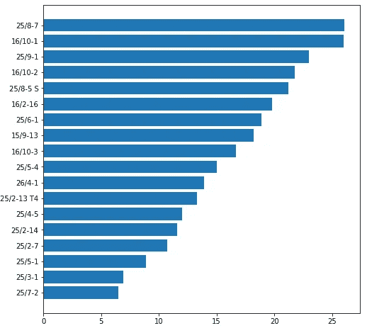

Matplotlib 水平条形图显示不同储层区间的孔隙度值按降序排列。图片由作者提供。

# 3\. 移除边框和坐标轴

如果我们有多余的图表元素，如网格线和边框（通常称为“图表垃圾”），它们可能会分散读者的注意力，并且图表的理解可能需要更长时间。

我们可以去除这些多余的图表垃圾，从而不仅改善图表的可读性，还能提高图表的美观性以及我们想传达的信息。

对于我们的图表，我们将通过调用 `ax.spines[[‘right’, ‘top’, ‘bottom’]].set_visible(False)` 来移除图表的顶部、底部和右侧边缘。

我们还将隐藏 x 轴。你可能会想，为什么我们要移除坐标轴上的数字——这不是会影响可读性吗？

这是正确的，然而，我们将在下一步中看到如何让读者更容易理解这些值。

```py
df = df.sort_values(by='porosity')

fig, ax = plt.subplots(figsize=(8,8))

bars = plt.barh(df['well'], df['porosity'])

ax.spines[['right', 'top', 'bottom']].set_visible(False) 
ax.xaxis.set_visible(False)

plt.show()
```

当我们运行上述代码时，得到如下图表。

现在看起来比前一步干净多了。

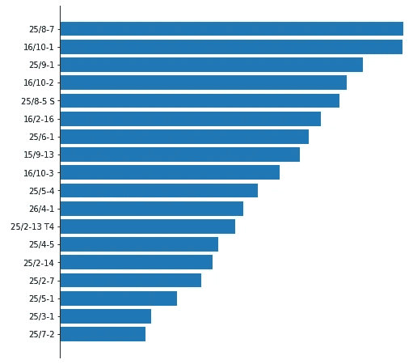

去除多余图表垃圾后的 Matplotlib 水平条形图。图片由作者提供。

# 4\. 添加数据标签

在上述图片中，我们移除了 x 轴的刻度和数字。这确实减少了可读性，然而，如果 x 轴保留，我们期望读者在尝试理解绝对值并比较不同条形时需要额外的工作。

为了使图表更有效，我们可以为每个条形添加绝对值数据标签。这提高了清晰度，节省了空间，并提高了精确性。

为了更方便地在条形图中添加标签，matplotlib 的开发者引入了 `[bar_label()](https://matplotlib.org/stable/api/_as_gen/matplotlib.pyplot.bar_label.html)` 函数。这允许我们在条形图中自动添加标签。

```py
df = df.sort_values(by='porosity')

fig, ax = plt.subplots(figsize=(8,8))

bars = plt.barh(df['well'], df['porosity'])

ax.spines[['right', 'top', 'bottom']].set_visible(False) 
ax.xaxis.set_visible(False)

ax.bar_label(bars)

plt.show()
```

当运行上述代码时，我们得到如下图表。我们可以直接在条形的末端看到绝对值，这显著提高了可读性。例如，如果仅根据条形长度来看前两个条形，我们会说它们是一样的，但如果查看绝对值，我们会发现它们略有不同。

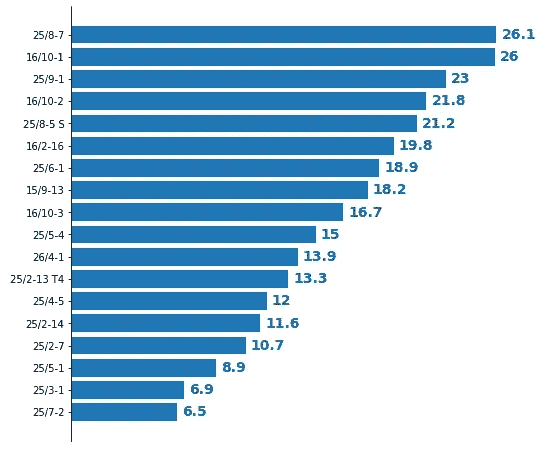

Matplotlib 水平条形图中显示了数据标签，以提高可读性。图片由作者提供。

## 控制 matplotlib 的 bar_label 函数的标签格式

`bar_label()` 函数允许我们提供多个关键字参数。

在下面的示例中，我更改了字体大小、颜色和字体粗细。

此外，为了将标签放置在条形的内边缘，我们可以调用 padding 参数 (`pad`)。如果使用负数，我们将能够将标签放置在条形内部。

`fmt` 参数允许我们控制标签的显示方式。使用 `%.1f%%` 意味着我们使用了 1 位小数，并在标签末尾包含一个 % 符号。

```py
df = df.sort_values(by='porosity')

fig, ax = plt.subplots(figsize=(8,8))

bars = plt.barh(df['well'], df['porosity'])

ax.spines[['right', 'top', 'bottom']].set_visible(False) 
ax.xaxis.set_visible(False)

ax.bar_label(bars, padding=-45, color='white', 
             fontsize=12, label_type='edge', fmt='%.1f%%',
            fontweight='bold')

plt.show()
```

当运行上述代码时，我们得到如下图。

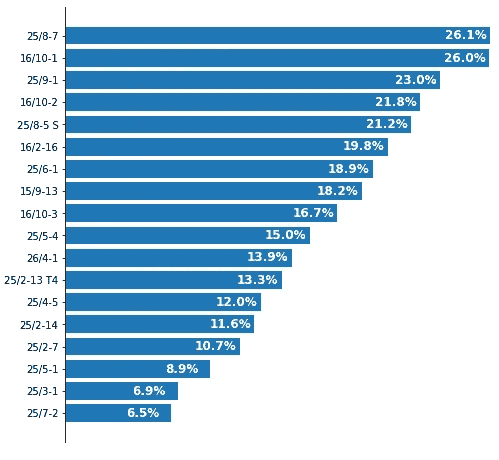

Matplotlib 水平条形图中，数据标签显示在条形的内边缘，以提高可读性，使用了 bar_label。图片由作者提供。

# 5. 增加条形之间的间距

提高可读性的另一个步骤是增加条形之间的间距。它使我们能够创建一个更不拥挤、更具美感的图表。

要增加间距，我们首先需要在 `plt.subplots()` 函数调用中增加图形的高度，然后将 `height` 参数添加到 `plt.barh()` 函数中。

```py
df = df.sort_values(by='porosity')

fig, ax = plt.subplots(figsize=(8,12))

bars = plt.barh(df['well'], df['porosity'], height=0.7)

ax.spines[['right', 'top', 'bottom']].set_visible(False) 
ax.xaxis.set_visible(False)

ax.bar_label(bars, padding=-45, color='white', 
             fontsize=12, label_type='edge', fmt='%.1f%%',
            fontweight='bold')

plt.show()
```

当生成图表时，我们现在拥有了一个稍微宽松的图表，更加舒适。

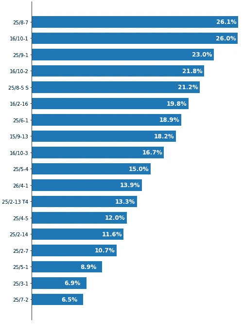

Matplotlib 水平条形图在增加条形之间的间距后。图片由作者提供。

# 6. 为条形图选择颜色

选择图表的颜色可能相当主观且耗时。我们理想上希望避免用彩虹色的调色板来淹没读者。不仅图表效果差，而且可能影响可读性和传达的信息。

我们可以在柱状图中使用颜色的几种方式：

+   我们可以保持颜色的一致性，例如前面图表中的蓝色

+   使用颜色来引起对顶部或底部柱子的关注

+   使用颜色来引起对特定柱状图的关注

+   使用颜色来突出显示符合特定标准的柱子

+   使用与类别品牌相关的颜色，例如使用蓝色代表 Facebook，红色代表 YouTube

+   使用颜色来显示分组

+   改善对色盲读者的可访问性

还有许多其他方法。

如果你在寻找帮助选择颜色工具的文章，可以查看这个：

[](/4-essential-tools-to-help-you-select-a-colour-palette-for-your-data-visualisation-ddb2ec92a08?source=post_page-----f87419cb14cb--------------------------------) ## 4 种选择数据可视化颜色方案的必备工具

### 使选择数据可视化颜色方案变得容易的工具

[towardsdatascience.com

让我们仔细看看这些在 matplotlib 柱状图中使用颜色的不同选项。

## 使用颜色引起对单个柱子的关注

如果我们想要吸引读者对某个特定柱子的注意，可以使用以下代码。

与其为我们的颜色创建列表，不如直接使用 `apply` 函数和 lambda 函数将颜色添加到数据框中。在这里，我们高亮显示了一个特定的井。

```py
well_name = "16/2-16"
highlight_colour = '#d95f02'
non_highlight_colour = '#768493'

df['colours'] = df['well'].apply(lambda x: highlight_colour if x == well_name else non_highlight_colour)

df = df.sort_values(by='porosity')

fig, ax = plt.subplots(figsize=(8,12))

bars = plt.barh(df['well'], df['porosity'], height=0.7, color=df['colours'])

ax.spines[['right', 'top', 'bottom']].set_visible(False) 
ax.xaxis.set_visible(False)
ax.yaxis.set_tick_params(labelsize=14)

ax.bar_label(bars, padding=-45, color='white', 
             fontsize=12, label_type='edge', fmt='%.1f%%',
            fontweight='bold')

plt.show()
```

当运行上述代码时，我们得到如下图表。我们可以看到井 16/2–16 被高亮显示为橙色，立即引起了你的注意。

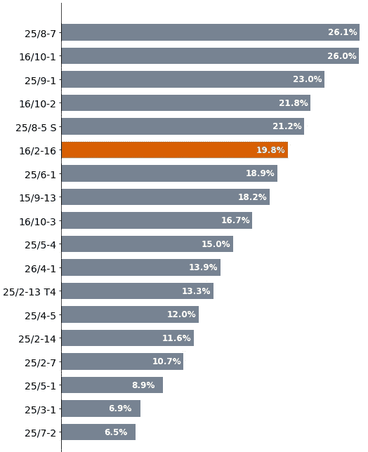

Matplotlib 水平柱状图在应用颜色到单个柱子以引起读者的注意后的效果。图片由作者提供。

## 应用颜色到超过阈值的值

另一种应用颜色的方法是通过突出显示符合或超过阈值的特定类别/柱子。

在这个示例中，我们希望突出显示孔隙度大于 20%的柱子。我们可以让读者通过标签来识别这些柱子，但为了让读者更容易和更快地找到它们，我们可以高亮显示这些柱子。

这是通过在 pandas 中使用 `apply` 函数和 lambda 函数来检查值是否大于我们的阈值来完成的。

```py
porosity_cutoff = 20
highlight_colour = '#d95f02'
non_highlight_colour = '#768493'

df['colours'] = df['porosity'].apply(lambda x: highlight_colour if x >= porosity_cutoff else non_highlight_colour)

df = df.sort_values(by='porosity')

fig, ax = plt.subplots(figsize=(8,12))

bars = plt.barh(df['well'], df['porosity'], height=0.7, color=df['colours'])

ax.spines[['right', 'top', 'bottom']].set_visible(False) 
ax.xaxis.set_visible(False)
ax.yaxis.set_tick_params(labelsize=14)

ax.bar_label(bars, padding=-45, color='white', 
             fontsize=12, label_type='edge', fmt='%.1f%%',
            fontweight='bold')

plt.show()
```

当图表生成后，我们得到如下图表，我们的视线立即被前五个柱子吸引。

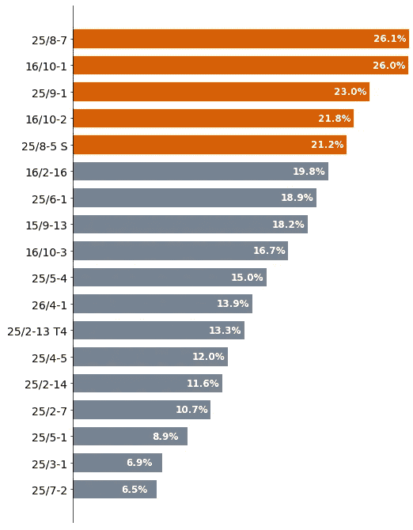

Matplotlib 柱状图显示了大于 20%孔隙度阈值的柱子。图片由作者提供。

然而，读者可能不知道为什么这五个柱子被突出显示，因此我们可以添加文本注释来帮助他们。

```py
porosity_cutoff = 20
highlight_colour = '#d95f02'
non_highlight_colour = '#768493'

df['colours'] = df['porosity'].apply(lambda x: highlight_colour if x >= porosity_cutoff else non_highlight_colour)

df = df.sort_values(by='porosity')

fig, ax = plt.subplots(figsize=(8,12))

bars = plt.barh(df['well'], df['porosity'], height=0.7, color=df['colours'])

ax.spines[['right', 'top', 'bottom']].set_visible(False) 
ax.xaxis.set_visible(False)

ax.bar_label(bars, padding=-45, color='white', 
             fontsize=12, label_type='edge', fmt='%.1f%%',
            fontweight='bold')

ax.yaxis.set_tick_params(labelsize=14)

ax.axvline(x=20, zorder=0, color='grey', ls='--', lw=1.5)

ax.text(x=20, y=1, s='20% Porosity Cutoff', ha='center', 
        fontsize=14, bbox=dict(facecolor='white', edgecolor='grey', ls='--'))
plt.show()
```

使用 matplotlib 的`ax.text`和`ax.axvline`函数，我们可以添加一个标签和一条垂直截断线，以解释为什么前 5 个柱子被突出显示。

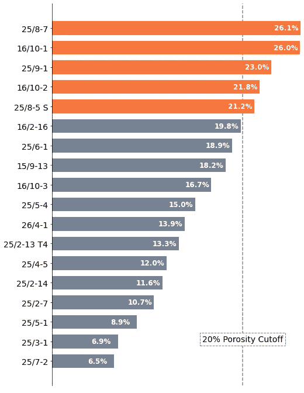

显示大于 20% 孔隙度截断值的柱状图，并在添加文本注释后。图片由作者提供。

## 将交通灯类型刻度应用于柱状图

如果我们有多个截断值或目标值，我们可以使用交通灯类型的刻度来指示每个柱子的位置。使用传统的红色、绿色和黄色时应注意，因为这些颜色对所有人都不适用，特别是对于有色觉问题的人。

在这个示例中，我们将使用从 [**ColorBrewer 2.0**](https://colorbrewer2.org/) 中挑选的三种颜色**，**以指示我们在哪些地方的孔隙度好、平均或差。

与之前的示例中使用 lambda 函数不同，我们可以创建一个名为`bar_highlight`的新函数，并传入三个参数：我们的实际值（`value`）、平均值截断（`average_value`）和良好值截断（`good_value`）。

然后，我们将检查实际值与这些截断值，并为其分配颜色。

```py
def bar_highlight(value, average_value, good_value):
    if value >= good_value:
        return '#1b9e77'
    elif value >= average_value:
        return '#d95f02'
    else:
        return '#7570b3'

#cutoff values
good = 20
average = 10

df['colours'] = df['porosity'].apply(bar_highlight, args=(average, good))

df = df.sort_values(by='porosity')

fig, ax = plt.subplots(figsize=(8,12))

bars = plt.barh(df['well'], df['porosity'], height=0.7, color=df['colours'])

ax.spines[['right', 'top', 'bottom']].set_visible(False) 
ax.xaxis.set_visible(False)

ax.bar_label(bars, padding=-45, color='white', 
             fontsize=12, label_type='edge', fmt='%.1f%%',
            fontweight='bold')

ax.yaxis.set_tick_params(labelsize=14)

ax.axvline(x=good, zorder=0, color='grey', ls='--', lw=1.5)
ax.axvline(x=average, zorder=0, color='grey', ls='--', lw=1.5)

ax.text(x=good, y=18, s=f'{good}% Porosity Cutoff', ha='center', 
        fontsize=14, bbox=dict(facecolor='white', edgecolor='grey', ls='--'))

ax.text(x=average, y=18, s=f'{average}% Porosity Cutoff', ha='center', 
        fontsize=14, bbox=dict(facecolor='white', edgecolor='grey', ls='--'))

plt.show()
```

为了帮助读者，我们可以添加一个新标签和一条垂直线来指示这些截断值的位置。为了避免多次输入值，我们可以在调用`ax.text`时使用 f-strings。

当我们运行代码时，我们会得到以下图表。

我们可以立即看到数据已被分成三组颜色，这有助于向读者讲述我们的故事。

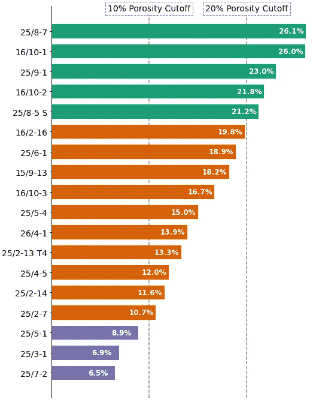

使用颜色来指示不同柱子对截断/基准值的表现。图片由作者提供。

# 7\. 添加标题

如果我们继续使用单一的 20% 孔隙度截断值的图表，我们可以通过添加一个信息丰富的标题来完善图表。这直接告诉读者图表的内容。


添加标题后的 Matplotlib 横向柱状图。图片由作者提供。

我们可以通过在代码中添加对`ax.title`的调用来简单实现这一点。

```py
porosity_cutoff = 20
highlight_colour = '#d95f02'
non_highlight_colour = '#768493'

df['colours'] = df['porosity'].apply(lambda x: highlight_colour if x >= porosity_cutoff else non_highlight_colour)

df = df.sort_values(by='porosity')

fig, ax = plt.subplots(figsize=(8,12))

bars = plt.barh(df['well'], df['porosity'], height=0.7, color=df['colours'])

ax.spines[['right', 'top', 'bottom']].set_visible(False) 
ax.xaxis.set_visible(False)

ax.bar_label(bars, padding=-45, color='white', 
             fontsize=12, label_type='edge', fmt='%.1f%%',
            fontweight='bold')

ax.yaxis.set_tick_params(labelsize=14)

ax.axvline(x=20, zorder=0, color='grey', ls='--', lw=1.5)

ax.text(x=20, y=1, s='20% Porosity Cutoff', ha='center', 
        fontsize=14, bbox=dict(facecolor='white', edgecolor='grey', ls='--'))

ax.set_title('Wells With > 20% Porosity in the Hugin Formation', fontsize=16,
              fontweight='bold', pad=20)

plt.show()
```

# 总结

尽管一开始 matplotlib 看起来很吓人，但它实际上是一个非常强大的库，可以创建有效的可视化。

通过几行额外的代码和 matplotlib 库，我们已经看到如何将一个丑陋且无聊的柱状图变成一个更具美感的图表，帮助向读者讲述一个故事。


在将我们的柱状图从一个平淡的图形转变为更具视觉吸引力的图形之前和之后。图片由作者提供。

为什么不在下一个柱状图上尝试这些示例呢？

我很想在评论中听到你关于使用 matplotlib 和制作美丽数据可视化的任何技巧。

*感谢阅读。在你离开之前，你应该订阅我的内容，以便将我的文章发送到你的邮箱。* [***你可以在这里操作！***](https://andymcdonaldgeo.medium.com/subscribe)*或者，你可以* [***注册我的新闻通讯***](https://fabulous-founder-2965.ck.page/2ca286e572) *以便免费将额外的内容直接发送到你的邮箱。*

*其次，你可以通过注册会员来获得完整的 Medium 体验，同时支持我和成千上万其他作者。每月只需 $5，你就可以全面访问所有精彩的 Medium 文章，并有机会通过写作赚取收入。如果你使用* [***我的链接***](https://andymcdonaldgeo.medium.com/membership)***，*** *你将直接通过部分费用支持我，而不会增加你的花费。如果你这么做了，非常感谢你的支持！*

# 本教程使用的数据集

本教程使用的数据集是 Xeek 和 FORCE 2020 举办的机器学习比赛中的训练数据集的一个子集。

Bormann, Peter, Aursand, Peder, Dilib, Fahad, Manral, Surrender, & Dischington, Peter. (2020). FORCE 2020 油井日志和岩性数据集，用于机器学习竞赛 [数据集]。Zenodo. [`doi.org/10.5281/zenodo.4351156`](https://doi.org/10.5281/zenodo.4351156)

该数据集遵循 Creative Commons Attribution 4.0 International 许可证。
