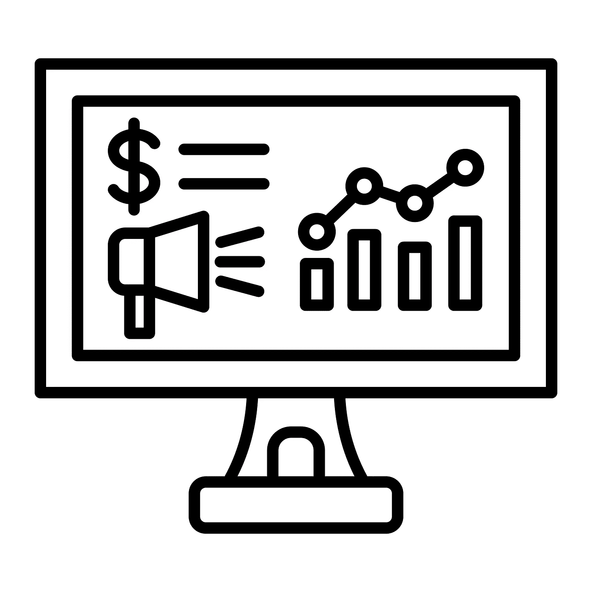
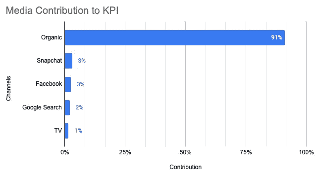
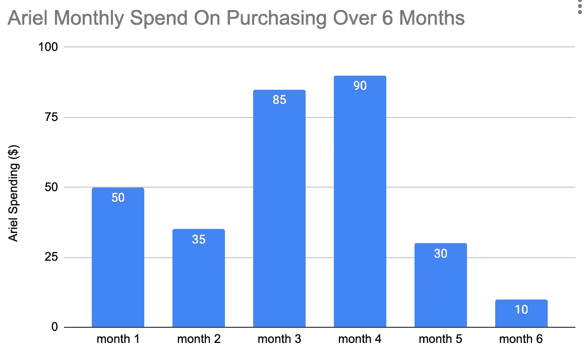
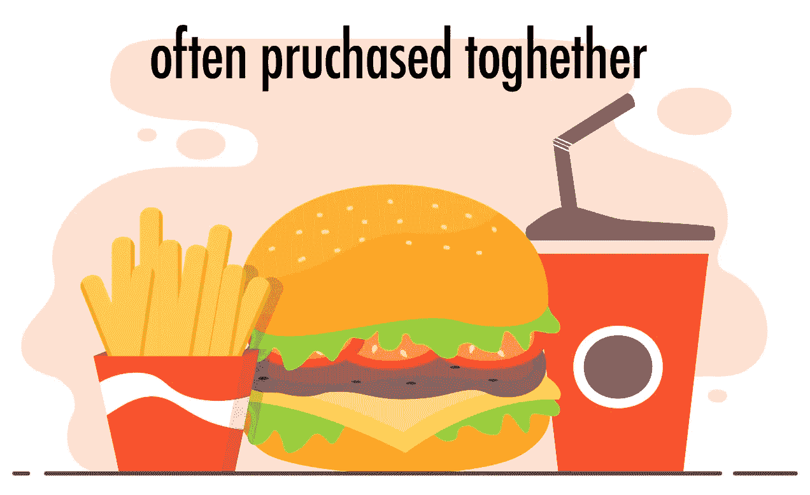
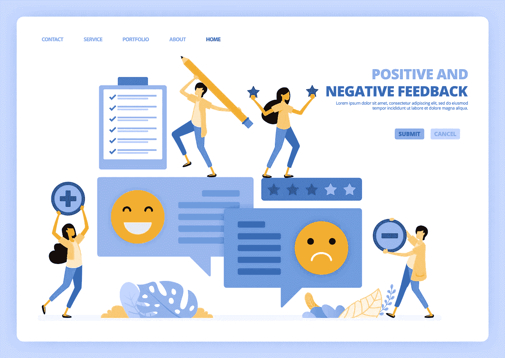
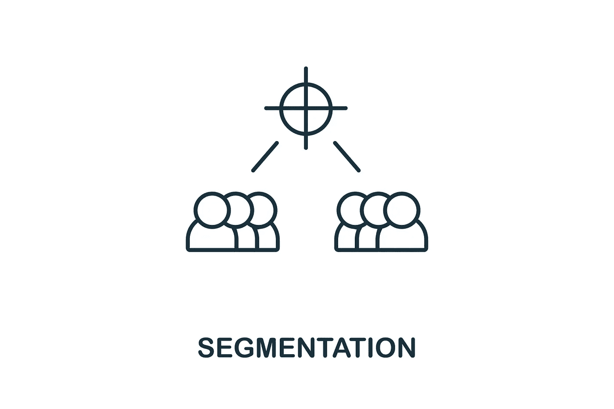

# 7 种营销数据科学的应用

> 原文：[`towardsdatascience.com/7-uses-of-marketing-data-science-7ccc0b7b6c3c`](https://towardsdatascience.com/7-uses-of-marketing-data-science-7ccc0b7b6c3c)

## 什么是营销数据科学

 [Ariel Jiang](https://arieljiangaj.medium.com/?source=post_page-----7ccc0b7b6c3c--------------------------------)

·发表于[数据科学前沿](https://towardsdatascience.com/?source=post_page-----7ccc0b7b6c3c--------------------------------) ·阅读时间 12 分钟·2023 年 2 月 28 日

--

图片来自 Creative Fabrica（由作者支付，允许商业使用）

什么是数据科学在营销中的应用？每当我说我的职业是营销数据科学家时，我总是会被问到这个问题。这个问题在不从事营销领域的数据科学家中尤为常见。

你可能没有意识到，但很可能你已经体验过营销数据科学的结果。

当你在 Google 上搜索产品时，你可能会注意到顶部的列表旁边有一个广告标签。这是付费营销，公司已经竞标了你搜索的关键字。

当你在 Amazon 上进行圣诞购物时，除了其他产品外，还有赞助列表。这些列表也是付费营销，由推荐算法推荐给你，算法认为你可能会点击并购买。

当你查看 Instagram 并看到一个服务的促销券时，你可能处于营销实验的处理组中，以测试 Instagram 广告的效果，运气好的话，因为对照组没有得到促销券。

上述所有都是由营销数据科学推动的。它利用数据科学方法和营销相关的数据来使营销人员和消费者的生活更轻松。

我相信到目前为止，你已经对营销数据科学有了大致了解。继续阅读，你将发现 7 个更详细的领域和示例，以深入理解数据科学如何帮助营销。

# 1\. 营销测量与预算分配

我首先列出这一点是因为我在这方面工作了最久，而且这点至关重要，因为没有衡量完成的工作效果，就无法知道如何改进。测量是指南针。

营销测量的关键在于使用一些北极星指标，例如广告投资的 ROI（广告支出回报率，ROAS），来评估之前营销活动在推动业务 KPI 方面的效率。基于测量的表现，营销团队可以决定调整预算分配、定位策略、竞标策略或其他方面，以提高未来的效率。

数据科学如何帮助营销测量？以下是一些例子：

## a) 实验

> 投入还是不投入，这就是问题

图片来自 Creative Fabrica（由作者付费，允许商业使用）

营销数据科学利用 A/B 测试和因果推断方法，如差异中的差异、回归不连续性等，来理解营销活动是否导致了 KPI 的变化。

以谷歌搜索为例。公司在谷歌上花费数百万美元购买付费搜索，但这是否值得？通常人们在谷歌上搜索时已经对选择的公司有了较好的了解，如果他们已经转化，那么广告预算可能是浪费的。A/B 测试来拯救我们。我们可以使用谷歌的 Conversion Lift 用户级测试平台进行测量。谷歌将用户随机分为对照组和处理组，仅对处理组展示处理广告。通过严格的统计程序，我们可以高信心地了解广告驱动的增量转化。尽管测试很少是完美的，但现在我们因为营销数据科学有了更有信心的良好估计。当 A/B 测试不可行时，因果推断也可以帮助我们理解如果没有广告支出会发生什么，并告诉我们营销是否以及在多大程度上引起了 KPI 的变化。

有关不同营销测量方式的更多比较，请查看我的文章[这里](https://medium.com/towards-data-science/marketing-mix-models-102-the-good-the-bad-and-the-ugly-f5895c86b7c3)。

## b) 营销混合模型

> 花多少以及花在哪里，这也是问题

通过实验，我们对活动和渠道的效率有了很好的理解，那预算分配呢？你应该把广告预算花在哪里，花多少？

想象你是一个拥有 1 亿美元营销预算的营销经理，你会如何分配这些预算？你可以在电视上花 5000 万美元，因为你的家人和朋友都看电视。你可以将其余预算投入到 Instagram，因为 Instagram 似乎总是向你推荐相关广告。这可能是基于个人经验的好方法，但还有更科学的方法——营销混合模型（MMM）来拯救你。

图片由作者提供

MMM 使用时间序列技术将业务关键绩效指标归因于不同的驱动因素（如广告活动、促销等），同时控制其他影响因素（如季节性、趋势、经济、竞争对手活动等）。该模型可以告诉你在当前支出水平下，各营销渠道的关键绩效指标的效率和贡献。它还可以模拟如果支出水平发生变化，在其他因素控制的情况下，关键绩效指标可能会如何变化。考虑到未来的预算水平和约束，模型可以预测关键绩效指标，并提供优化不同渠道营销支出分配的建议，以达到最大化关键绩效指标或广告支出回报率。

如需更深入了解 MMM，请查看我的文章：[营销组合建模 101](https://medium.com/towards-data-science/marketing-mix-modeling-101-d0e24306277d)，[营销组合建模 102](https://medium.com/towards-data-science/marketing-mix-models-102-the-good-the-bad-and-the-ugly-f5895c86b7c3)

# 2\. 竞标优化与自动化

图片来源于 Pexels EKATERINA BOLOVTSOVA

我在 Doordash 参与的一个项目是一个竞标优化和自动化平台，该平台优化竞标金额并自动更新竞标，以 1）最大化感兴趣的关键绩效指标，2）节省时间和人工成本。

许多渠道，特别是搜索，使用广告竞拍来决定当人们在谷歌或其他展示广告的网站上搜索时显示哪些广告。这就像现实生活中的拍卖，但除了最高出价外，还会考虑其他因素。

在现实生活中的拍卖中，当一个物品被拍卖时，它可能不一定与竞标价格一样有价值。你不想出价过高而多付，也不想出价过低而错失机会。广告活动也是如此，一次搜索可能会或可能不会导致转化。你不想在低质量和低相关性的搜索上浪费钱，但你也不想把潜在客户拱手让给竞争对手。数字广告拍卖更复杂的是，它们可能随时发生并且发生得非常快。人们很难科学地确定某些类型的产品或关键词的合理竞标金额，以及何时更新竞标金额。

营销数据科学可以提供帮助。营销数据科学（Marketing DS）可以利用历史营销数据、季节性、趋势和转化数据来建立竞标杠杆与转化之间的关系。通过优化算法和业务约束，我们可以了解理想的竞标金额和时机，以最大化转化（或其他业务关键绩效指标）。这可以将设置竞标以实现业务目标的繁重工作和猜测移除。

# 3\. 客户生命周期价值预测

客户生命周期价值（CLV 或 LTV）是客户在与公司合作的整个生命周期内所创造的总货币价值。

以我为一个过于简化的例子，我找到了一家本地餐馆，连续去那里 6 个月，然后对他们的食物感到厌倦。我在这家餐馆的生命周期是 6 个月，我的总 CLV 是 210 美元（汇总了我在这 6 个月的所有支出）。这可以通过其他方式计算，例如添加我的推荐价值、减去成本等。具体取决于你的定义和业务用例。

作者的图表

为什么 CLV 重要？

它不仅考虑初始购买，还包括他们未来的重复购买，甚至潜在的推荐等。这有助于企业对营销和业务运营策略做出更明智的决策。

对于营销来说，通过了解客户随时间的价值，企业将更好地确定应在获取新客户、留住现有客户以及哪些营销和促销活动可能产生最佳回报上投资多少。假设本地餐馆也在针对另一个顾客汤米。获取他的成本与获取像我这样的顾客相同，但餐馆预算有限。根据历史数据，像汤米这样的人不太可能在第一个月之后回到餐馆，总共只会产生 50 美元的收入，而我则是 210 美元。餐馆可能会决定将预算用在像我这样的人身上，而不是汤米。

计算和预测 CLV 的方法有很多。一种常见做法是

1.  定义起始点——你从什么时候开始预测 CLV，签约时还是第一次购买时等？

1.  定义时间框架——典型客户的生命周期有多长，可能是一个月、一年、几年等

1.  定义预测频率——按天、周或月等进行预测

1.  定义如何为你的业务计算 CLV——总收入，或收入减去某些成本，或收入加上来自该客户的推荐

1.  定义 CLV 的驱动因素并获取数据——影响 CLV 的因素。

1.  选择合适的模型，进行预测、评估、验证、迭代和生产化——业界喜欢使用像 XGB 和 GBM 这样的梯度提升模型进行 CLV 预测，因为这些模型更具多样性，无需假设模型形式，比其他类型的模型更准确。

另外，如果你只寻求快速粗略的解决方案，也可以仅基于历史平均 CLV 进行简单预测。

# 4\. 客户流失预测

图片来自 Unsplash，由 [Mantas Hesthaven](https://unsplash.com/@mantashesthaven) 提供

流失意味着客户停止使用公司的服务或购买产品。任何成功的企业都不希望失去宝贵的客户，因为这可能导致收入损失和未来增长机会的丧失。有时流失是不可避免的，但许多时候可以通过使用保留营销策略或客户关系管理（CRM）策略来预防或推迟流失。企业可以主动联系那些即将流失的客户，了解可以提供什么额外支持，决定是否进行有针对性的保留或再参与营销活动等。

如何知道谁处于高流失风险？有些客户可能不会明确表达，只是默默离开。这时流失预测模型就显得非常有用：通过预测流失来防止流失。

一个典型的流失预测模型会预测某人在某一时间段内流失的可能性。建模步骤可以类似于 CLV 建模，然而目标不是货币值，而是离开或不离开的二元值。预测结果会给出流失的可能性，该可能性介于 0 到 1 之间。模型的特征可以是与客户流失行为相关的历史数据。以当地餐馆为例，上个月的订单金额可能是预测客户下个月是否会回来的一个好的特征。流失预测也可以与 CLV 结合使用，以计算客户的预期未来价值。

像逻辑回归这样的简单模型、更复杂的模型如随机森林或提升模型，甚至神经网络都可以用于流失预测。模型的选择和结构应基于数据的可用性、样本平衡、模型的可解释性和业务需求。

# 5\. 推荐系统

图片来自 Creative Fabrica（作者付费，允许商业使用）

推荐算法被许多企业广泛使用。亚马逊用它来向买家推荐相关产品，Netflix 用它来向观众推荐相关的电视节目和电影，UberEats 用它来向就餐者推荐餐厅和菜品。推荐系统在了解了用户的行为、喜好和厌恶后，会变得更好、更强大。

推荐系统可以是基于内容的或基于协同过滤的。顾名思义，基于内容的推荐是基于产品内容之间的相似性。例如，如果我购买了哈利·波特系列图书，我可能会被推荐购买《纳尼亚传奇》。协同过滤则更侧重于用户属性和行为以及/或项目属性之间的相似性。我会被推荐购买某些东西，因为类似的用户已经购买了这些东西。

推荐产品或服务本身就是营销的一部分。还有广告推荐系统。如果你像我一样经常使用 Uber，你会注意到现在 Uber 应用程序会显示其他企业的广告。有一次我乘 Uber 去健身房，看到了一则针对女性运动服的广告；另一次在前往电影院的路上，我看到了一部下个月上映的电影预告。

# 6\. 情感分析

图片来自 Creative Fabrica（由作者支付，允许商业使用）

情感分析被认为是衡量营销，特别是品牌营销活动的最有效方法之一，用于分析客户对品牌的情感。情感分析识别用词表达的情感和情绪，这有助于企业了解自身的优势和劣势，并发现未来的增长和改进机会。

营销数据科学家挖掘意见和文本数据以提取信息。这属于文本分类的广泛范畴。像朴素贝叶斯这样的分类器可以帮助完成这项工作，它也是自然语言处理（NLP）的一个热门话题。文本分类器有助于判断某些文本背后的情感是积极的、消极的还是中性的。

例如，如果我有三句话来自对一个虚构公司的调查：

1.  Imaginary Service Co. 提供了很棒的服务。

1.  Imaginary Service Co. 很糟糕。

1.  Imaginary Service Co. 提供服务。

模型应该能告诉我情感是积极的、消极的还是中性的，并且有一个相当准确的得分。

我个人没有构建情感分析模型，但我发现这篇[文章](https://www.datacamp.com/tutorial/simplifying-sentiment-analysis-python)对初学者很有帮助。

# 7\. 客户细分

图片来自 Creative Fabrica（由作者支付，允许商业使用）

最后但同样重要的是，数据科学还可以帮助将客户划分为不同的子群体，基于共享特征。我们为什么需要对客户进行细分？从营销的角度来看，这可以帮助营销人员针对每个有意义的细分市场制定不同的策略，并开发更有效和高效的营销策略。

例如，客户对产品有不同的需求和偏好。有些客户对价格更敏感，而有些客户无论如何都会购买；有些客户喜欢奢侈品，有些客户更关心性价比。当我们想进行 20%折扣的促销活动以鼓励更多购买时，我们可以针对那些价格敏感的客户，因为对价格要求较严格的客户可能会在没有折扣的情况下购买。当推出新的高端产品线时，我们可以针对生活方式更奢华的客户，以提高转化率和投资回报率。

市场营销数据科学帮助我们利用机器学习算法和数据对客户进行细分。问题的本质使其成为一个无监督的机器学习问题（通常），可以使用像 K 均值聚类这样的聚类算法来解决。以电子商务为例，客户的过去购买习惯、人口统计信息、消费模式、收入等特征可能是不错的特征。

# 总结

总之，在这个故事中，我介绍了市场营销数据科学的 7 种用途，这些用途帮助企业提高市场营销效率，从而实现更高的增长：

1.  市场营销测量与预算分配——用于衡量过去市场营销活动的效率，并指出未来市场营销策略的方向。

1.  投标优化和自动化——优化广告投标策略并自动化投标过程，以帮助提高转化率和降低成本。

1.  客户终生价值预测——计算长期客户价值并优化长期成功。

1.  流失预测——预测那些高风险的有价值客户，以便公司可以集中资源防止流失发生。

1.  推荐系统——向客户推荐相关广告，提高转化率和投资回报率。

1.  情感分析——分析文本中的客户情感，以便制定更好的品牌营销策略。

1.  客户细分——将客户分为有意义的细分群体，以便进行更准确的目标定位。

# 谢谢，并关注我获取更多内容！

感谢你读到这里，恭喜你对市场营销数据科学有了更深入的了解。

希望你喜欢我的文章，并且对你有所帮助。我撰写有关数据科学、商业、工作经验及其他诸多话题的文章。如果你想阅读更多类似内容并获取免费的有用资源，欢迎关注我并订阅我的邮件！
