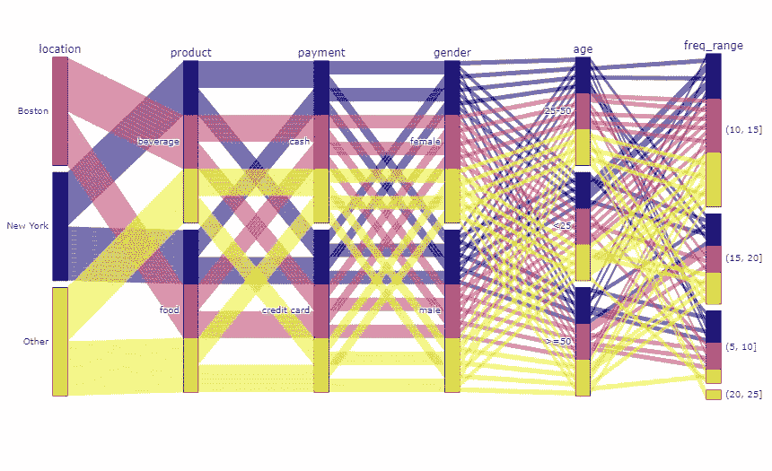
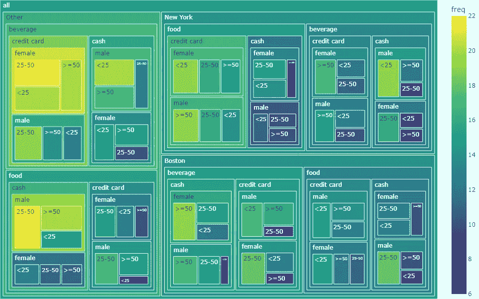
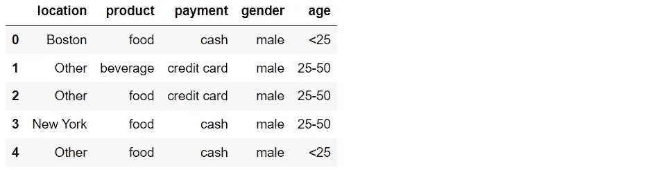
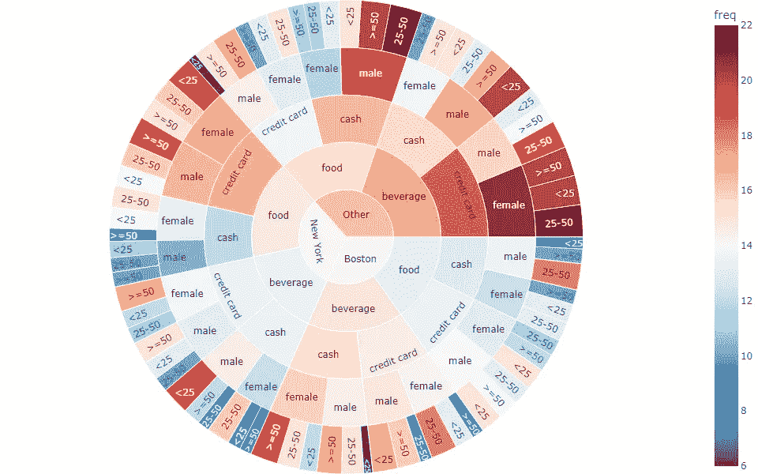
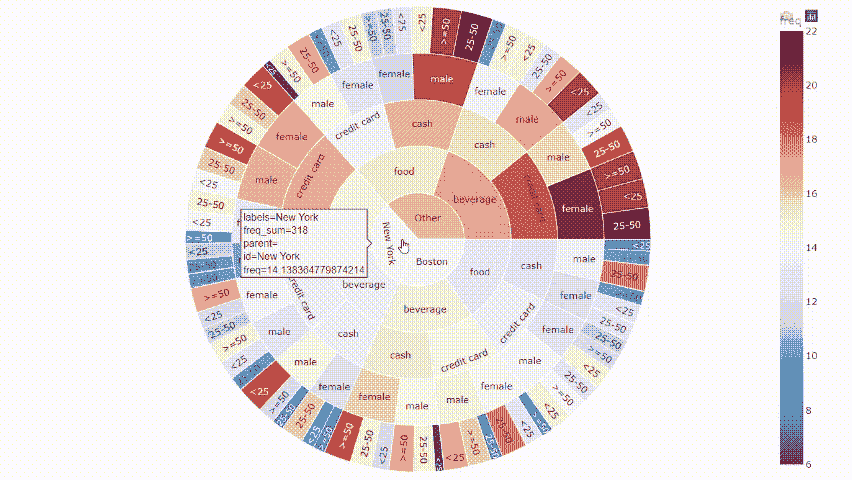
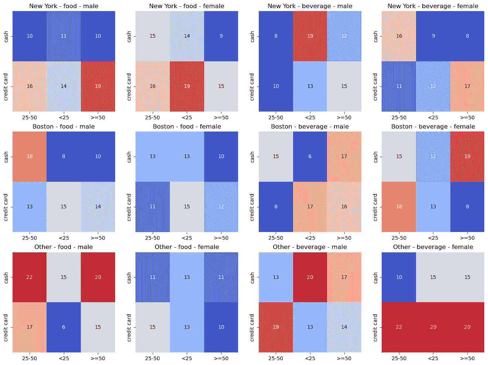
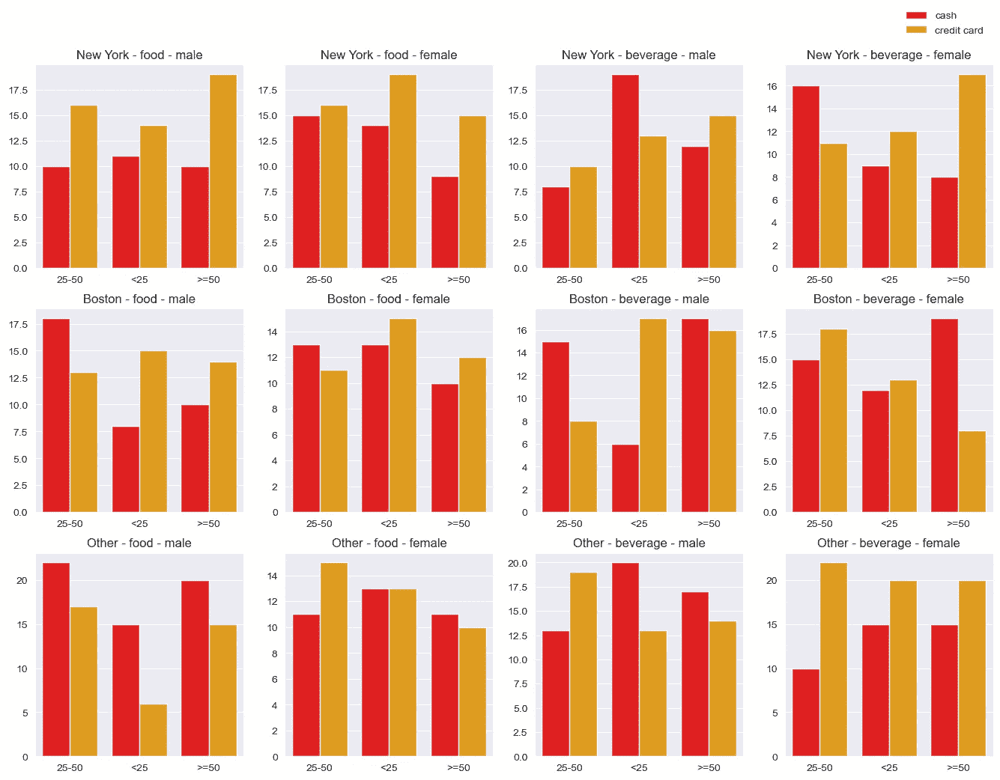
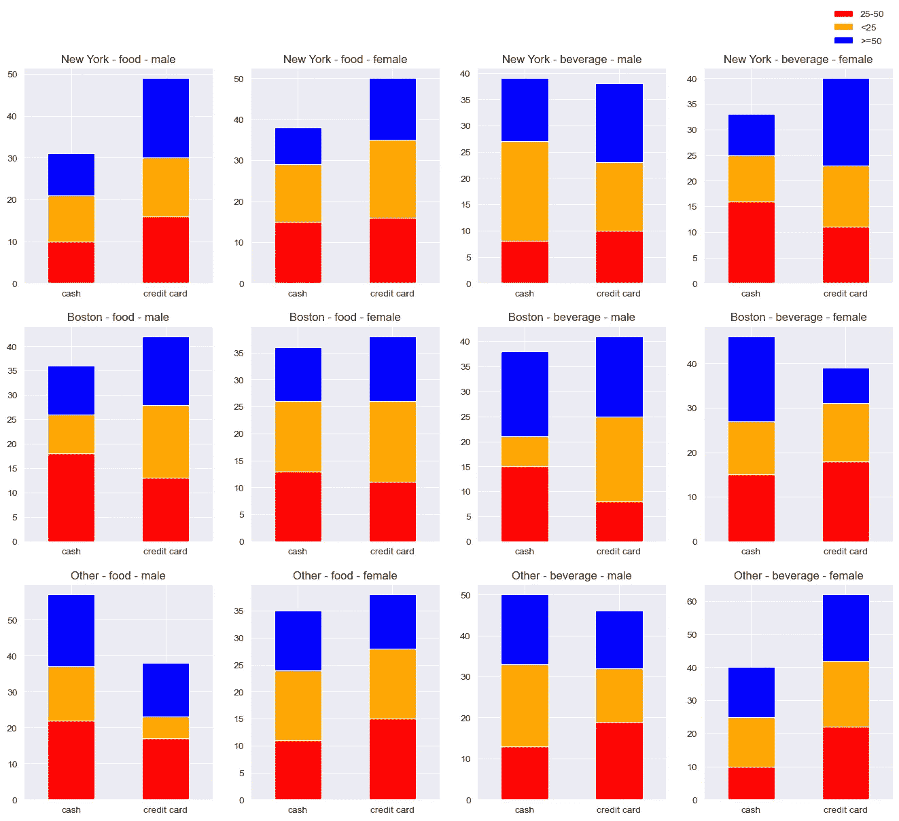
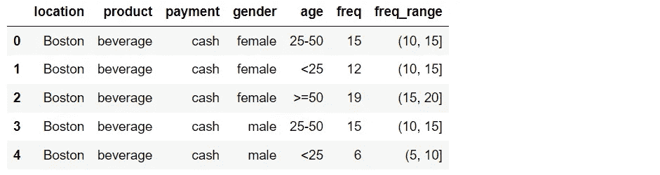
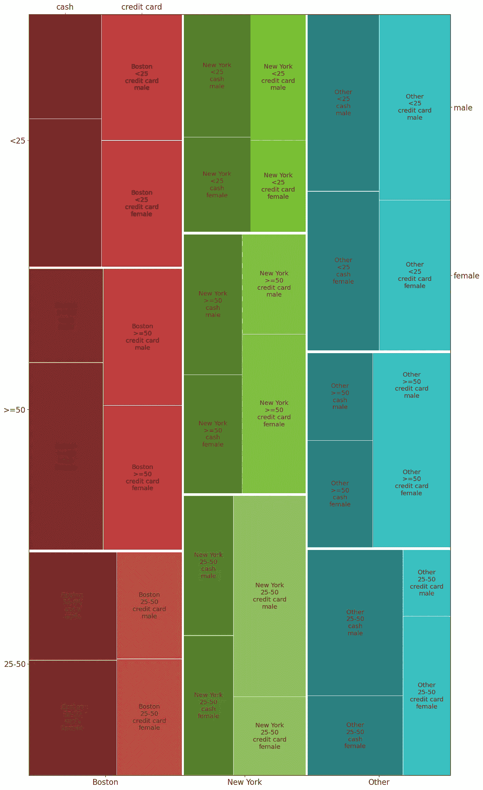

# 7 种用 Python 处理多变量分类数据的可视化方法

> 原文：[`towardsdatascience.com/7-visualizations-with-python-to-handle-multivariate-categorical-data-63158db0911d`](https://towardsdatascience.com/7-visualizations-with-python-to-handle-multivariate-categorical-data-63158db0911d)

## 简单方式展示复杂分类数据的想法。

[](https://medium.com/@borih.k?source=post_page-----63158db0911d--------------------------------)[](https://towardsdatascience.com/?source=post_page-----63158db0911d--------------------------------) [Boriharn K](https://medium.com/@borih.k?source=post_page-----63158db0911d--------------------------------)

·发表于[Towards Data Science](https://towardsdatascience.com/?source=post_page-----63158db0911d--------------------------------) ·阅读时间 8 分钟·2023 年 9 月 20 日

--


图片来源：[Kaizen Nguyễn](https://unsplash.com/@kaizennguyen) 在[Unsplash](https://unsplash.com/?utm_source=medium&utm_medium=referral)

常见数据，如知名的虹膜或企鹅[数据集](https://github.com/mwaskom/seaborn-data)，用于分析时相对简单，因为它们只有少量分类变量。顺便提一下，现实世界的数据可能更加复杂，包含超过两个层级的类别。

多变量分类数据是一种具有众多类别的数据。例如，考虑将人群分组。由于一个人可以根据性别、国籍、薪资范围或教育水平等类别具有不同特征，因此可能会有许多可能性。车辆也有多样的分类变量，如品牌、原产国、燃料类型、细分市场等。



本文中展示的多变量分类数据可视化示例。图片由作者提供。

建议使用数据可视化来进行探索性数据分析（EDA），以帮助理解数据。条形图或饼图等图表是绘制简单分类数据的基本选择。顺便提一下，展示多变量分类数据可能更复杂，因为存在许多分类变量的层级。因此，本文将指导如何使用能够表达多层次类别数据的图表。

# 获取数据

从导入库开始。

```py
import numpy as np
import pandas as pd
import matplotlib.pyplot as plt
import seaborn as sns

%matplotlib inline
```

本文将使用一个包含 5 个分类的模拟数据集。生成的数据集包含杂货店顾客信息：位置、产品、支付方式、性别和年龄范围。每个分类变量都可以使用随机库生成，如下代码所示。

如果你想尝试使用其他多变量分类数据集进行可视化代码的实验，可以跳过下一步。



让我们对 DataFrame 进行分组，以获得每个类别组合的频率。之后，将得到的结果添加到 DataFrame 中。


现在 DataFrame 准备好了，我们继续进入可视化部分。

# 数据可视化

本文将介绍 7 种可视化方法来展示多变量分类数据。每一种方法都将包括概念、Python 代码和所得结果的解释。

开始吧……

# 1\. 使用旭日图构建多级饼图

基本上，旭日图是一个多级饼图。由于能够在一个图表中表达多个数据层次，因此它是展示多变量分类数据或层级数据的一个好选项。在同一层次中，每个项的面积表示其与其他项百分比的比较。

使用旭日图的一个限制是如果每一层有太多分类，注释的密度会很高。顺便说一下，这可以通过使用颜色刻度来区分值，或创建一个可以过滤的交互式旭日图来解决。

我们将使用 Plotly，这是一个强大的 Python 库，用于创建数据可视化。使用 Plotly 的一个优点是它可以轻松创建交互式图表。

啦啦！！



使用旭日图展示多变量分类数据。图片由作者提供。

下面的图片展示了交互功能是如何工作的。



图片由作者提供。

# 2\. 在树图中使用多个矩形区域

通过将绘图区域从圆形更改为矩形，树图与旭日图的概念非常相似。由于它可以占用比之前的图表更多的绘图空间，因此树图是最大化绘图区域的一个好选项。

Plotly 还提供了一个函数，可以快速创建带有交互功能的树图。


使用树图展示多变量分类数据。图片由作者提供。

类似于旭日图，可以注意到颜色刻度帮助我们区分频率值。

# 3\. 应用笛卡尔积和子图与热图图表

理论上，热力图是一种使用颜色表示数据值的二维图表。要将图表应用于显示多层级类别（本文中为五个层级），我们需要使用多个子图和类别的笛卡尔积。请注意，我们需要保留两个类别用于比较值，以绘制热力图。

[itertools](https://docs.python.org/3/library/itertools.html)库可以用于生成笛卡尔积列表。以下代码展示了如何从‘location’，‘product’和‘gender’中获取笛卡尔积。每个热力图将显示‘age’和‘payment’的频率。笛卡尔积中的类别可以更改，请随意修改以下代码。

```py
import itertools
pair_loca_prod_gend = list(itertools.product(dict_loca.values(),
                                             dict_prod.values(),
                                             dict_gender.values()))
pair_loca_prod_gend
```


应用获得的笛卡尔积和子图来显示多个热力图。我们将使用 Seaborn 的[热力图](https://seaborn.pydata.org/generated/seaborn.heatmap.html)函数来绘制结果。

看呐…!!



使用热力图显示多变量类别数据。图像由作者提供。

需要考虑的一点是，使用热力图来显示多变量类别数据有一个限制，即只能比较两个维度的数据，而其他类别用于生成笛卡尔积。

# 4\. 使用聚类条形图回归基础

与应用热力图的概念相同，聚类条形图使用笛卡尔积和子图来显示多个条形图，以便在类别之间进行比较。条形图更简单易懂，因为它是许多人熟悉的基本图表。

以下代码几乎与之前的代码相同，只是我们使用了 Seaborn 的[条形图](https://seaborn.pydata.org/generated/seaborn.barplot.html)函数，而不是热力图函数。



使用聚类条形图显示多变量类别数据。图像由作者提供。

# 5\. 将条形图堆叠为聚类堆叠条形图

条形图可以简单地转换为堆叠条形图。堆叠条形图适用于显示每个类别的总量以及每个堆叠条形图组件的比例。

顺便提一下，请考虑到堆叠条形图可能会产生误导，因为每个组件的基底（除最低组件外）并不从同一点开始。因此，人们可能会很难解释或比较堆叠条形图的组件。

以下代码还使用了笛卡尔积和子图，并结合 Panda DataFrame 的[plot 函数](https://pandas.pydata.org/docs/reference/api/pandas.DataFrame.plot.html)来构建聚类堆叠条形图。



使用聚类堆叠条形图显示多变量类别数据。图像由作者提供。

# 6\. 使用平行坐标图处理多个维度

平行坐标图通过使用多个垂直轴来显示 n 维空间。所有这些轴具有相等的长度，并且平行且间距相等。使用这种图表的一个优势是，我们可以根据类别的顺序看到数据的流动。

如果我们直接绘制每一个频率值，图表可能会过于密集而难以解读。因此，在绘制之前，让我们使用 Panda 的[cut](https://pandas.pydata.org/docs/reference/api/pandas.cut.html)函数将频率分组到范围内。

```py
f_range = pd.cut(x=df_m['freq'], bins=[0, 5, 10, 15, 20, 25])
df_m['freq_range'] = [str(i) for i in f_range] 
df_m.head()
```



下面的代码演示了如何将位置与值映射，以便在图中分配颜色。接下来，让我们使用[Plotly](https://plotly.com/python/parallel-categories-diagram/)构建一个平行坐标图。


使用平行坐标图展示多变量分类数据。图像由作者提供。

# 7\. 使用马赛克图显示部分与整体的关系

这个图表也被称为[Marimekko 图](https://en.wikipedia.org/wiki/Mosaic_plot)或百分比堆积条形图。马赛克图的思想是显示部分与整体的关系，类似于树图。在下面的结果中，这个图表看起来像是宽度不同的堆积条形图。

要快速创建马赛克图，我们可以使用来自 Statsmodels 库的[mosaic](https://www.statsmodels.org/stable/generated/statsmodels.graphics.mosaicplot.mosaic.html)函数。该函数将计算输入类别的频率。因此，我们可以使用没有频率变量的数据框。

请注意，此函数可以绘制的最大类别数为四，这可以被认为是使用马赛克图的一个限制。



使用马赛克图展示多变量分类数据。图像由作者提供。

# **总结**

首先，让我们总结一下本文涵盖的 7 种数据可视化方法：

+   旭日图

+   树图

+   热力图

+   聚类条形图

+   聚类堆积条形图

+   平行坐标图

+   马赛克图

如果我们仔细观察每个图表，会发现它们都有一些共同之处。它们不仅可以表示数据级别，还可以显示每个类别中数据的比率或比例。这可以被认为是它们适合展示多变量分类数据中众多类别的原因。

最后，我非常确定还有更多图表可供使用，而本文中提到的只是使用 Python 的示例。如果你有任何建议，请随时留言。

感谢阅读。

这里有一些我撰写的数据可视化文章，可能会引起你的兴趣：

+   使用 Python 处理多个时间序列数据的 8 种可视化方法 (link)

+   使用 Python 表达排名随时间变化的 7 种可视化方法 (link)

+   使用 Python 的 9 种可视化方法展示比例或百分比，而不是饼图 (link)

+   使用 Python 的 9 种比条形图更引人注目的可视化方法 (link)

+   使用 Python 和 Sklearn 创建动画以展示 4 种基于质心的聚类算法 ([link](https://medium.com/towards-data-science/creating-animation-to-show-4-centroid-based-clustering-algorithms-using-python-and-sklearn-d397ade89cb3))

## 参考文献

+   Wikimedia Foundation. (2023 年 9 月 6 日). *分类变量*. Wikipedia. [`en.wikipedia.org/wiki/Categorical_variable`](https://en.wikipedia.org/wiki/Categorical_variable)

+   Wikimedia Foundation. (2023 年 8 月 31 日). *多变量统计学*. Wikipedia. [`en.wikipedia.org/wiki/Multivariate_statistics`](https://en.wikipedia.org/wiki/Multivariate_statistics)

+   Kassambara. (2017 年 11 月 17 日). *可视化多变量分类数据*. STHDA. [`www.sthda.com/english/articles/32-r-graphics-essentials/129-visualizing-multivariate-categorical-data`](http://www.sthda.com/english/articles/32-r-graphics-essentials/129-visualizing-multivariate-categorical-data)

+   Horbach, A. (2022 年 5 月 3 日). *使用 plotly 可视化多维分类数据*. Medium. `towardsdatascience.com/visualizing-multidimensional-categorical-data-using-plotly-bfb521bc806f`

+   Insightsoftware. (2023 年 7 月 24 日). *比较数据可视化：条形图与堆积图，图标与形状，线图与面积图*. insightsoftware. [`insightsoftware.com/blog/comparing-data-visualizations-bar-vs-stacked-icons-vs-shapes-and-line-vs-area`](https://insightsoftware.com/blog/comparing-data-visualizations-bar-vs-stacked-icons-vs-shapes-and-line-vs-area/)
