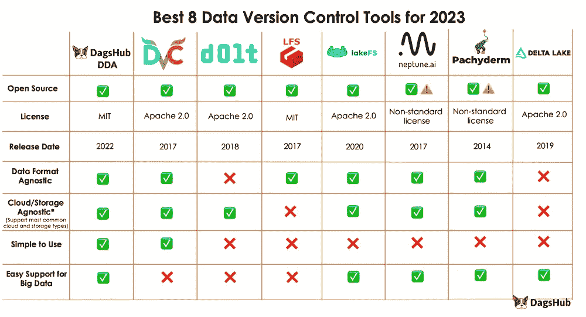

# 2023 年 8 款最佳数据版本控制工具

> 原文：[`towardsdatascience.com/8-best-data-version-control-tools-in-2023-cc9045d37bb8`](https://towardsdatascience.com/8-best-data-version-control-tools-in-2023-cc9045d37bb8)

## 提供每个数据版本控制工具的优势和劣势的全面概述

 [Zoumana Keita](https://zoumanakeita.medium.com/?source=post_page-----cc9045d37bb8--------------------------------)

·发表于 [Towards Data Science](https://towardsdatascience.com/?source=post_page-----cc9045d37bb8--------------------------------) ·阅读时间 8 分钟·2023 年 3 月 24 日

--

图片由 [Alina Grubnyak](https://unsplash.com/@alinnnaaaa) 在 [Unsplash](https://unsplash.com/photos/ZiQkhI7417A) 上提供

# 介绍

随着业务需求的不断变化以及数据集的规模和结构的增长，有效跟踪对数据所做的更改变得具有挑战性，这导致了不幸的情况，如数据不一致和错误。

为帮助数据从业者，本博客将涵盖市场上八种顶级数据版本控制工具。将提供每种工具的清晰解释，包括它们的优缺点。

# 我们为什么需要版本控制我们的数据？

跟踪不同版本的数据可能具有挑战性，就像同时 juggling 多个球一样。没有适当的协调、平衡和精确，事情可能会迅速崩溃。以下几点说明了数据版本控制对任何数据科学和机器学习项目成功的重要性：

## 存储空间

版本化数据的原因之一是能够跟踪同一数据的多个版本，这些版本显然也需要存储。因此，空间不足会使存储变得困难，这*最终*会导致失败。

## 数据审计和合规性

几乎每家公司都面临数据保护法规，如 GDPR，迫使它们存储某些信息以证明合规性和数据来源的历史。在这种情况下，数据版本控制可以帮助公司在内部和外部审计过程中。

## 实验的存储和可重复性

开发机器学习模型不仅仅是运行代码，更涉及到训练数据和正确的参数。更新模型是一个迭代过程，需要跟踪之前所做的所有更改。在涉及多个用户的更复杂环境中，这种跟踪变得尤为重要。使用数据版本控制可以使每次迭代时能够获得训练数据和实验结果的快照，从而简化实施过程。

上述挑战可以通过使用以下八种数据版本控制工具来解决。

# 2023 年最佳数据版本控制工具

现在你对博客的期望有了清晰的理解，让我们从 DagsHub 开始，逐一探索它们。

## DagsHub

[DagsHub](https://dagshub.com/) 是一个以 GitHub 为基础的集中化平台，允许机器学习和数据科学团队构建、管理和协作他们的项目。除了代码版本控制，团队还可以对数据、模型、实验等进行版本控制。

2022 年发布的 DagsHub 的 [直接数据访问](https://dagshub.com/docs/feature_guide/direct_data_access/)（简称 DDA）允许数据科学家和机器学习工程师从 DagsHub 仓库流式传输文件，无需事先下载到本地环境。这可以避免在启动模型训练之前将大量数据下载到本地磁盘。

**优点**

+   使用 DDA 无需将所有训练数据拉取到本地磁盘，这可以帮助节省时间和内存存储。

+   它提供了与 DVC 相同的组织和可重复性，并结合了数据 API 的易用性和灵活性，无需对项目进行任何更改。

+   DDA 使得可以使用 DVC 上传数据并进行版本控制，而无需先将所有数据拉取下来。DagsHub 计算新的哈希值，并代表用户提交新的 DVC 跟踪和修改的 Git 跟踪文件。

**缺点**

+   它不能与连接的 GitHub 仓库对接到 DagsHub。

+   它不支持 'dvc repro' 命令来重现数据管道。

## DVC

DVC（Data Version Control 的简称）于 2017 年发布，是由 iterative 创建的开源工具。

DVC 可用于数据和模型的版本控制、实验追踪，以及比较任何数据、代码、参数模型和性能图表。

**优点**

+   开源，并兼容所有主要的云平台和存储类型。

+   DVC 可以高效处理大文件和机器学习模型。

+   作为 Git 的扩展构建，Git 是许多开发者用于源代码版本控制的标准工具。

**缺点**

+   在处理非常大的数据集时会失败，因为计算哈希值需要相当长的时间。

+   与他人的协作需要多个配置，如设置远程存储、定义角色以及为每个贡献者提供访问权限，这可能会令人沮丧且耗时。

+   添加新数据到存储中需要先提取现有数据，然后计算新的哈希值，再将整个数据推回。

+   DVC 缺乏关键的关系数据库功能，使其不适合那些熟悉关系数据库的人。

## Dolt

[Dolt](https://docs.dolthub.com/introduction/what-is-dolt) 是一个创建于 2019 年的开源工具，用于管理 SQL 数据库，采用类似于 Git 的版本控制。它版本化表格而不是文件，并为这些表格提供 SQL 查询接口。

通过启用数据和结构的同时更改来实现用户体验的提升，使用了版本控制。

**优点**

+   它可以像其他 SQL 数据库一样集成到用户现有的基础设施中，并保证 ACID 属性。

+   大多数开发人员对 Git 进行源代码版本控制非常熟悉。因此，Dolt 与 Git 的集成使其更易于学习。

**缺点**

+   Dolt 完全依赖于 ACID 属性，这意味着它仅在处理关系数据库时才有用。

+   对于计算非常大数量的数据（PB 级数据），它没有提供高性能。

+   由于仅设计用于关系数据库，它不支持图像、音频和自由格式文本等非结构化数据。

## Git LFS

[Git Large File Storage](https://www.atlassian.com/git/tutorials/git-lfs#:~:text=Git%20LFS%20(Large%20File%20Storage,relevant%20versions%20of%20them%20lazily.))（Git LFS）是一个由 Atlassian 开发的开源项目，旨在扩展 Git 管理大二进制文件如音频样本、电影和大数据集的能力，同时保留 Git 轻量化的设计和效率。

使用 Git LFS，大文件存储在云中，并通过指针在远程服务器的本地副本中进行引用。

**优点**

+   它可以存储任何类型的文件，无论格式如何，这使得它在 Git 上进行大文件版本控制时灵活且多功能。

+   开发人员可以轻松地将大文件迁移到 Git LFS，而无需更改现有工作流。

**缺点**

+   Git LFS 需要一个独特的远程 Git 服务器，使其成为单向门。这对于在某些情况下希望返回使用普通 Git 的用户来说是一个劣势。

+   由于其复杂性，对新用户不够直观。

+   Git LFS 需要一个 LFS 服务器才能工作。这种服务器并非每个 Git 托管服务都提供，在某些情况下需要设置或切换到不同的 Git 提供商。

## LakeFS

大多数大数据存储解决方案如 Azure、Google 云存储和 Amazon S3 具有良好的性能，成本效益高，并且与其他工具的连接良好。然而，这些工具在更高级的数据工作流方面存在功能性缺口。

Lake File System（简称 [LakeFS](https://lakefs.io/)）是一个开源版本控制工具，于 2020 年推出，旨在弥合版本控制与大数据解决方案（数据湖）之间的差距。

**优点**

+   它支持所有数据格式，无需用户进行任何更改。

+   它是一个多用户数据管理系统，为各种复杂程度的机器学习管道提供安全的数据摄取和实验环境。

+   提供 UI 和 CLI 接口，并与所有主要云平台和存储类型兼容。

**缺点**

+   LakeFS 强烈依赖对象存储，对于其他用例的价值不大。

+   LakeFS 仅用于数据版本控制，这是整个数据科学生命周期的众多部分之一。这意味着在处理数据科学或机器学习管道的其他步骤时，需要集成外部工具。

## Neptune

[Neptune](https://neptune.ai/) 是一个用于跟踪和记录 ML 实验和模型的平台。它可以被视为一个集成工具，供机器学习工程师将模型的工件、指标、超参数和 MLOps 过程中的所有元数据存储在一个位置。

**优点**

+   直观的协作界面，包括跟踪、比较和组织实验的能力。

+   与超过 25 个 MLOps 库集成。

+   提供本地版和托管版两种版本。

**缺点**

+   并非完全开源。此外，一个订阅可能足以满足个人使用，但可能会有每月使用限制。

+   用户需要手动维护离线和在线版本之间的同步。

## Pachyderm

[Pachyderm](https://www.pachyderm.com/) 被认为是驱动机器学习生命周期的数据层，通过提供 PB 级的数据版本控制和血统跟踪，以及完全自动扩展和数据驱动的管道。

**优点**

+   完全支持结构化和非结构化数据以及任何复杂的领域特定数据类型。

+   提供社区版和企业版两种版本。

+   基于容器，并针对主要云服务提供商和本地部署进行了优化。

+   它具有内置机制来跟踪数据版本和维护数据完整性。

**缺点**

+   社区版的管道数量限制为 16 个。

+   将 Pachyderm 纳入现有基础设施可能会很具挑战性，因为它包含大量技术组件。这也可能使学习过程变得困难。

## Delta Lake

[Delta Lake](https://delta.io/) 由 Databricks 提供，是一个开源数据湖存储层，运行在现有的数据湖文件系统之上，如 Hadoop 分布式文件系统 (HDFS) 和 Amazon S3。它为数据湖提供 ACID 事务、可扩展的元数据管理和模式强制执行。Delta Lake 支持批处理和流处理，并允许多个并发读写。

**优点**

+   Delta Lake 为数据湖操作提供了事务性保证，确保数据操作是原子性的、一致的、隔离的和持久的（ACID）。这使得 Delta Lake 在数据湖应用中更加可靠和稳健，尤其是对于那些需要高数据完整性的应用。

+   它还提供了模式强制功能，确保数据湖中的所有数据结构良好，并遵循预定义的模式。这有助于防止数据不一致、错误以及由数据格式不正确引起的问题。

+   与 Apache Spark API 的兼容性便利了它与现有的大数据处理工作流的集成。

+   自动化跟踪和管理不同数据版本减少了信息丢失或数据不一致的风险。

**缺点**

+   虽然 Delta Lake 提供了许多强大的功能，但它也为数据湖架构引入了额外的复杂性。

+   它仅支持有限的数据格式（Parquet），不适用于其他流行的数据格式，如 CSV、Avro、JSON 等。

+   学习 Delta Lake 并不简单，需要对分布式系统和大数据架构有更深入的理解，以有效管理大规模数据集。

# 结论

我们涵盖了最佳的 8 种数据版本管理工具，揭示了每种工具的多样化优缺点。虽然一些工具更直观，并在速度和简便性上表现优越，但其他工具则提供了更先进的功能和更大的可扩展性。

总结表（图片由作者提供）

在做出选择时，我建议仔细考虑项目的具体要求，并评估每个选项的优缺点。正确的选择不仅取决于你组织的独特需求和限制，还取决于你的目标。

在你离开之前 🔙

**请订阅我的** [**YouTube 频道**](https://www.youtube.com/channel/UC9xKdy8cz6ZuJU5FTNtM_pQ) **并与朋友分享！**

感谢阅读！如果你喜欢我的故事并希望支持我的写作，请考虑 [成为 Medium 会员](https://zoumanakeita.medium.com/membership)。每月 $5 的承诺将解锁对 Medium 上故事的无限访问权限。

你想请我喝杯咖啡 ☕️ 吗？→ [在这里请我](http://www.buymeacoffee.com/zoumanakeig)!

随时关注我 [在 Medium](https://zoumanakeita.medium.com/)、[Twitter](https://twitter.com/zoumana_keita_)，或在 [LinkedIn](https://www.linkedin.com/in/zoumana-keita/) 上打招呼！讨论 AI、ML、数据科学、NLP 和 MLOps 相关内容总是很愉快！
