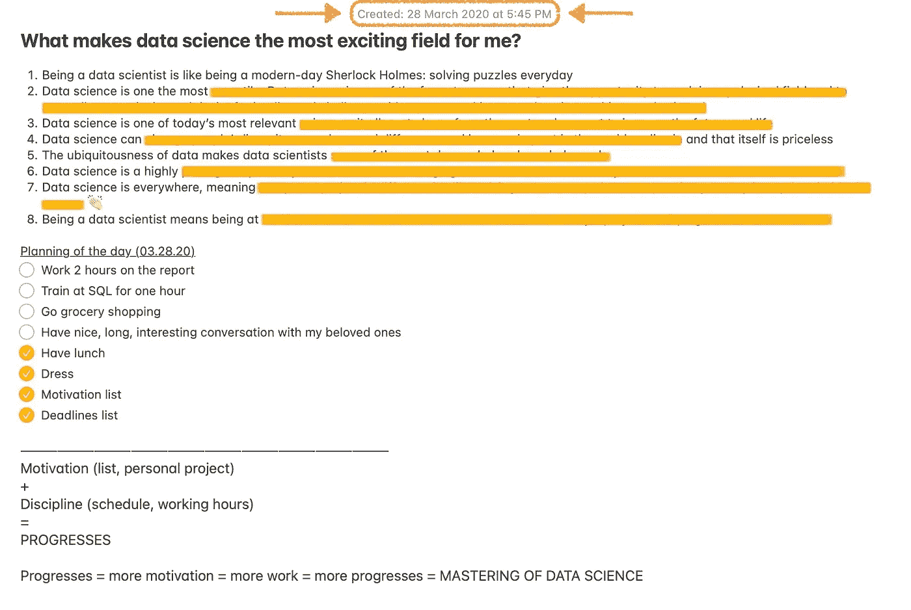

# 我没有放弃成为数据科学家的梦想的 8 个理由，以及你也不应该放弃的原因

> 原文：[`towardsdatascience.com/8-reasons-why-i-didnt-give-up-on-my-dream-to-be-a-data-scientist-why-neither-should-you-4f32b73f2473`](https://towardsdatascience.com/8-reasons-why-i-didnt-give-up-on-my-dream-to-be-a-data-scientist-why-neither-should-you-4f32b73f2473)

## 数据科学家在科技领域的头几年编年史

## 当困难时期来临时，你可以回顾的一份清单

 [Khouloud El Alami](https://medium.com/@elalamik?source=post_page-----4f32b73f2473--------------------------------)

·发布在 [Towards Data Science](https://towardsdatascience.com/?source=post_page-----4f32b73f2473--------------------------------) ·阅读时间 8 分钟·2023 年 7 月 14 日

--

我已经在 Spotify 担任数据科学家 2 年了，我可以说，从商业转行到数据科学是我做出的最佳决定之一。

数据科学可以是一个令人惊叹的职业选择。到达那里是另一回事。

成为真正的数据科学家需要付出大量的努力和决心。为了确保你能成功，你首先需要明确你的*为什么*，然后再解决*怎么做*的问题。

前方的旅程漫长，但一切都是值得的！ — 图片由作者（Midjourney）提供

# 但首先，让我给你讲一个小故事

如果你读过我之前的[文章](https://medium.com/towards-data-science/from-business-student-to-data-scientist-in-tech-eb7bbaab1784)，你知道这次职业转型远非轻松。

早期的旅程变成了过山车，这让我意识到我*真的*需要理清*我的为什么*。

仅仅因为我做出了这个职业选择，并不意味着我总是充满了动力和决心。

当你背负着 6 万美元的学生贷款时，失败的意义变得截然不同。它与最深处的恐惧交织在一起。失败不是一种选择。成功是**唯一**的选择。

## 然后有一天……

在 2020 年 3 月，我感到处于最低谷，因为我快要在纽约大学的 6000 美元课程中失败了，我不知道自己要如何摆脱困境。焦虑开始猛烈地袭击我。

我可以选择站起来为自己争取，或者放弃。我选择了第一个选项。

然后我列了一个清单。确切地说，就是这个 ⬇

我把这条笔记保留得和 2020 年写的一模一样。

*我也不想过多剧透* 😌。*如果你想知道列表的内容，你只有继续阅读（哈哈哈* 😈*)*

## 这是我第一次后来真的查看的列表！

*（相对于我们把它们埋在手机角落里那些笔记）*

我列出了所有理由，说明为什么这一信念的跳跃是值得所有这些挣扎的。我会在**每次**感觉到动力减退或自我怀疑袭来时查看它。

这个列表给了我每次需要的动力，让我坚持自己的梦想。我仍然哭了，哈哈，但至少我在完成作业的同时哭了。

在这篇文章中，我将与您分享我认为数据科学是最令人兴奋的职业路径之一的 8 个理由。列出我认为这一切麻烦都是值得的原因。

*请记住，这个列表基于我的* ***个人*** *兴趣和愿望。其中的一些元素可能不适合每个人。但既然这些对我帮助如此之大，我仍然觉得它们值得分享。*

## **1\. 成为数据科学家就像是现代的福尔摩斯**

我在之前的文章中已经谈到过这个问题，但对于那些没有读过的人，这个理由最接近我内心。

侦探们每天都利用知识来解决难题。他们**不懈地调查**，追寻真相，通过解决最复杂的谜题来寻找答案。

这正是数据科学家所做的工作。

作者提供的图片（Midjourney）

这可能感觉像是在浪漫化这一切，但这确实是我当时的感受，也是我现在的感受。我们每天都在玩弄数据，以揭示它隐藏的机会。这需要培养敏锐的问题解决能力🔎 和在追寻真相的过程中坚持不懈的精神。

每一个新项目的启动都可能是不同的。这就像是面对一个新的案件待解决。作为数据专家意味着你可以找到有趣且新颖的方法来提供**只有** **你** 能揭示的答案。

诚然，我不是每天都在追捕犯罪分子来解决案件。相反，我是在追逐数字，让它们吐露并呈现真相。对我来说，这已经足够了。

## **2\. 数据科学是最具多样性的职业之一**

我在数据科学学位期间结交的所有朋友都来自完全不同的背景。从天体物理学到政治科学（以及更多）。他们现在都是在完全不同的行业工作的数据科学家。有些人在开发抗癌模型，另一些则在帮助游戏开发者提供最佳体验。

这是一个备受追捧的职业路径的原因之一，它允许你**调和你的职业抱负与个人兴趣。** 数据科学给了你在你选择的领域工作的机会。当你对当前行业不再满意时，你还可以更换行业。

我自己就是一个很好的例子。

当我在攻读学位时，除了 Spotify，我无法想象自己在其他公司工作。音乐深深触动了我，以至于我在晚年才开始学习小提琴，并在自己内心发现了新的激情。

现在，我能够将我对数据的终身兴趣与在 Spotify 的职业生涯结合起来。

不论你是在观星还是救援中找到乐趣，数据科学为你打开了与终身热情相关的工作大门。

## **3\.** 数据科学是当今最相关的科学之一

10 年前它是相关的，而今天它变得更加重要。数据无处不在，它的重要性随着时间的推移呈指数增长。

根据 Statista 的数据，全球生成和消费的数据量从 2010 年的 2 泽字节增加到 2023 年的 120 泽字节 *(1 泽字节 = 10 亿兆字节)* [1, 2]。所以“相关”这个词简直是轻描淡写。数据正在**爆炸**。

你认为谁在通过 AI 创新改变科技世界？当然是数据科学家。

所以如果今天这个词可以有不同的含义，那么你想成为的那种数据科学家真的是由你决定的。如果你想乘上 AI 的浪潮，你可以。如果你更愿意调查数据并解开谜团，你也可以。

不论你乘风破浪，你在就业市场上依然会保持相关性。

## **4\. 数据科学可以改变人们的生活**

如果你通过改变世界和产生积极影响来寻求生活的意义，那么数据科学可能是适合你的道路。

当你成为数据科学家时，你可以选择成为更大事物的一部分。由于可以选择的行业范围非常广泛，你甚至有机会参与其中。

我曾经收到过在联合国核部门担任数据科学家的工作邀请。这有多酷？

当你成为数据科学家时，天际线就是你的极限（我说这话不是为了显得老套）。能够成为更大事物的一部分并产生影响是无价的。至少对我来说是这样的。

## 5\. 数据科学家是最受需求的人群之一

由于数据如此普遍，数据科学家将永远是必需的。

几乎每家公司今天都会收集数据。无论它们是初创公司还是成熟企业，它们肯定会在某个时刻需要有人从这些无意义的数据中提取价值。

*为什么？* 因为如果他们想要继续在游戏中保持领先，他们需要开始挖掘隐藏得最深的价值。这就是数据科学家的作用 **→** 他们帮助挖掘出公司保持领先所需的竞争优势。

当你成为数据科学家时，你的组织依赖于你通过发现机会和技术创新来帮助他们成长。他们会把重要的责任托付给你，这意味着你的贡献将被高度重视，你的工作也同样如此。

## 6\. 数据科学极具声望

任何声称成为数据科学家需要 12 个月甚至 6 个月的人，显然遗漏了重要数据。你需要的技能集需要时间来培养，不能一夜之间学会。

如今，我们看到许多人声称自己是数据科学家，这可能使入门门槛看起来很低。但相信我，真正的数据科学家成为自己的过程经历了多年。那些成功的人不一定是最聪明或最有才华的，但他们更可能是最有驱动力和韧性的人。

成为数据科学家的道路既具有挑战性又非常有回报。所以如果你准备好开始这段冒险，欢迎加入，并做好准备，你将经历一段旅程。

## 7\. 数据无处不在，甚至在你的个人生活中

而且，我指的是几乎所有地方。从你拥有设备的那一刻起，你已经开始收集数据。即使不在公司工作，你也可以玩弄数据。

我见过一些人收集自己的健康数据，并尝试解读这些数据以了解健康问题背后的因素。即使在个人生活中，懂得如何处理数据也是有用的。

无论是建模你的日常习惯还是理解你在 Strava 上的统计数据，了解一些数据知识将对你的生活有益。

## **8\. 数据科学处于第四次工业革命的前沿**

这意味着你可以参与塑造明天的世界。

数据科学令人兴奋，因为它在智力上的刺激性和新颖性。你可以学习到各种具有挑战性的技术，掌握这些技术意味着你将能够解答一些最具挑战性、最令人兴奋和神秘的问题。这是一个终身学习的旅程。

这个领域在不断变化和发展，它带着你一起向未来迈进。兴奋感有保障。

# 给你的建议：制定你自己的清单

我希望我的清单能激励你制定自己的理由清单，说明你为什么要做这件事。

这些理由将触动你的内心，而不仅仅是你的大脑（或你的钱包）。因为当你跌入谷底时，只有这些理由才能真正引起你的共鸣。

# 我为你准备了礼物🎁！

订阅我的[**通讯**](https://levelupwithk.substack.com/)**K’s DataLadder**，你将自动获得我的**终极 SQL 备忘单**，其中包含我在大科技公司工作中每天使用的所有查询 + 另一个神秘礼物！

我每周分享成为数据科学家在科技领域的经验，以及实用的技巧、技能和故事，这些都是为了帮助你提升自己——因为没有人真正知道，直到他们亲身经历！

## 如果你还没有这样做的话

+   订阅我的[**YouTube**](https://rebrand.ly/tdf62uv)频道。新视频很快就会发布！

+   关注我在[**Instagram**](https://www.instagram.com/elalamikhouloud/)、[**LinkedIn**](https://www.linkedin.com/in/elalamik/)、[**X**](https://twitter.com/elalamik)上的动态，随你选择。

再见！
