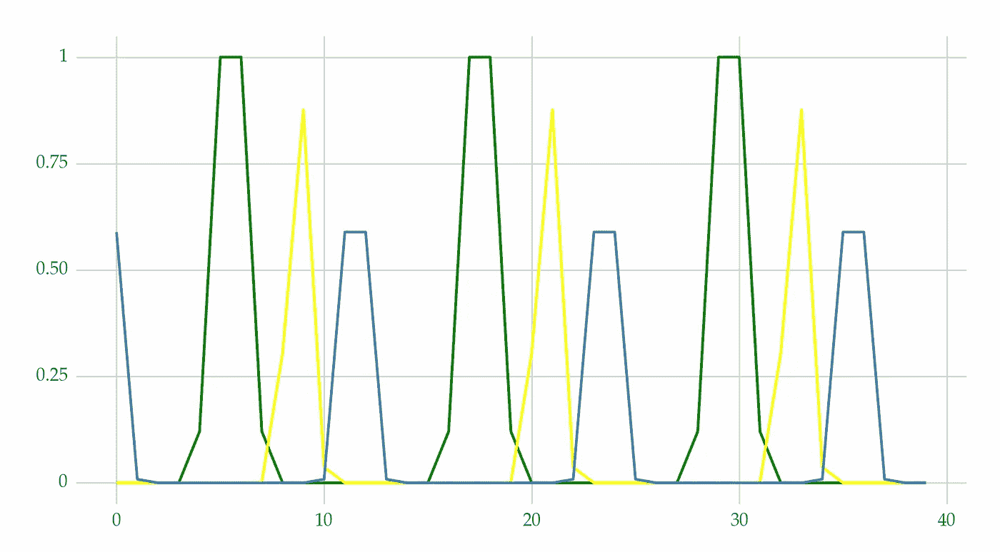

# 8 种建模季节性的方法

> 原文：[`towardsdatascience.com/8-techniques-to-model-seasonality-2f81d739710`](https://towardsdatascience.com/8-techniques-to-model-seasonality-2f81d739710)

## 如何处理季节性以进行预测

[](https://vcerq.medium.com/?source=post_page-----2f81d739710--------------------------------)[](https://towardsdatascience.com/?source=post_page-----2f81d739710--------------------------------) [Vitor Cerqueira](https://vcerq.medium.com/?source=post_page-----2f81d739710--------------------------------)

·发表于 [Towards Data Science](https://towardsdatascience.com/?source=post_page-----2f81d739710--------------------------------) ·8 分钟阅读·2023 年 7 月 14 日

--


照片由 [Clark Young](https://unsplash.com/@cbyoung?utm_source=medium&utm_medium=referral) 拍摄，来源于 [Unsplash](https://unsplash.com/?utm_source=medium&utm_medium=referral)

本文是对 [上一篇帖子](https://medium.com/towards-data-science/3-types-of-seasonality-and-how-to-detect-them-4e03f548d167) 的后续。那里，我们识别了 3 种季节性模式。

在这里，我们将：

+   学习如何描述时间序列的季节性。

+   了解 8 种你可以用来建模季节性的方法。

# 建模季节性模式

季节性指的是在某些时间段内重复出现的模式。它是建模中一个重要的变异来源。


时间序列及其季节性调整版本。数据来源在下一部分。图像由作者提供。

处理季节性的方式有很多。一些方法在建模之前去除季节性成分。季节性调整数据（时间序列减去季节性成分）[突显长期效果，如趋势或商业周期](https://otexts.com/fpp2/components.html)。其他方法则增加额外的变量，以捕捉季节性的周期特性。

在讨论不同的方法之前，让我们创建一个时间序列，并描述其季节性模式。

## 分析示例

我们将使用与 [上一篇文章](https://medium.com/towards-data-science/3-types-of-seasonality-and-how-to-detect-them-4e03f548d167) 相同的过程（另见参考文献 [1]）：

```py
period = 12 # monthly series
size = 120

beta1 = np.linspace(-.6, .3, num=size)
beta2 = np.linspace(.6, -.3, num=size)
sin1 = np.asarray([np.sin(2 * np.pi * i / 12) for i in np.arange(1, size + 1)])
cos1 = np.asarray([np.cos(2 * np.pi * i / 12) for i in np.arange(1, size + 1)])

xt = np.cumsum(np.random.normal(scale=0.1, size=size))

yt = xt + beta1 * sin1 + beta2 * cos1 + np.random.normal(scale=0.1, size=size)

yt = pd.Series(yt)
```

这是本系列的样子：


人工时间序列与随机平稳季节性。图像由作者提供。

我们可以通过其强度来描述季节性模式：

```py
# https://github.com/vcerqueira/blog/tree/main/src
from src.seasonality import seasonal_strength

seasonal_strength(yt, period=12)
# 0.90
```

结果是 0.90，这表明[季节性确实很强](https://medium.com/towards-data-science/3-types-of-seasonality-and-how-to-detect-them-4e03f548d167)。

该时间序列的自相关图如以下图所示：


自相关最多到 24 个滞后期。图片作者提供。

自相关显示出振荡行为。在第一个季节滞后期（12）上有显著的峰值。这些模式确认了季节性的相关性。

最后，我们使用 Canova-Hansen 测试检查季节性单位根：

```py
from pmdarima.arima import nsdiffs

nsdiffs(x=yt, m=period, test='ch')
# 0
```

结果是 0，这表明没有季节性单位根。因此，我们可以得出结论，季节性模式是平稳的。

那么，我们如何处理像这样的季节模式呢？

# 8 种建模季节性的技术

在本文的其余部分，你将学习 8 种建模季节性的技术。

## 1\. 季节虚拟变量

季节虚拟变量是一组二进制变量。这些变量表示观测值是否属于某个特定周期（例如，1 月）。

这是一个创建这些变量的示例：

```py
from sktime.transformations.series.date import DateTimeFeatures
from sklearn.preprocessing import OneHotEncoder

monthly_feats = DateTimeFeatures(ts_freq='M',
                                 keep_original_columns=False,
                                 feature_scope='efficient')

datetime_feats = monthly_feats.fit_transform(yt)
datetime_feats = datetime_feats.drop('year', axis=1)

encoder = OneHotEncoder(drop='first', sparse=False)
encoded_feats = encoder.fit_transform(datetime_feats)

encoded_feats_df = pd.DataFrame(encoded_feats,
                                columns=encoder.get_feature_names_out(),
                                dtype=int)
```

这段代码生成了以下数据。


季节虚拟变量在独热编码前后的效果。图片作者提供。

首先，我们获取每个观测值的季度和月份信息（左侧表格）。这些信息存储在*datetime_feats*对象中。然后，我们使用独热编码创建虚拟变量（右侧表格）。

如果季节性是确定性的，季节虚拟变量特别有效。如果我们不期望季节模式在强度和周期性上发生变化。

我们可以检查季节虚拟变量的系数，以分析季节效应及其变化。这对模型的解释性很有帮助。

季节虚拟变量的缺点是它们假设不同的周期是独立的。1 月的观测值与 12 月的观测值相关。但虚拟变量对这种相关性视而不见。因此，如果季节模式发生变化，虚拟变量可能不是最佳选择。

## 2\. 傅里叶级数


示例正弦和余弦项。图片作者提供。

傅里叶级数是基于正弦和余弦波的周期性和确定性变量。与季节虚拟变量相反，这些三角函数将季节性建模为周期性模式。这种结构更能反映现实。

这种方法在 sktime Python 包中实现：

```py
from sktime.transformations.series.fourier import FourierFeatures

fourier = FourierFeatures(sp_list=[12],
                          fourier_terms_list=[4],
                          keep_original_columns=False)

fourier_feats = fourier.fit_transform(yt)
```

你需要指定两个主要参数：

+   sp_list：作为列表的季节性周期（例如，月度数据的 12）

+   fourier_terms_list：项数，指包含的正弦和余弦级数的数量。这些项会影响表示的平滑度。

在实践中，傅里叶级数是你可以添加到模型中的解释变量。例如，你可以将这些与滞后特征结合使用。

## 3\. 径向基函数



3 个示例径向基函数。图片作者提供。

径向基函数（RBF）是傅里叶级数的替代方法。其思想是创建重复的钟形曲线来模拟重复的模式。

RBF 在*scikit-lego* Python 包中通过*RepeatingBasisFunction*方法实现：

```py
from sklego.preprocessing import RepeatingBasisFunction

rbf_encoder = RepeatingBasisFunction(n_periods=4,
                                     column='month_of_year',
                                     input_range=(1, 12),
                                     remainder='drop',
                                     width=0.25)

rbf_features = rbf_encoder.fit_transform(datetime_feats)
rbf_features_df = pd.DataFrame(rbf_features,
                               columns=[f'RBF{i}'
                                        for i in range(rbf_features.shape[1])])
```

这种方法的三个最重要的参数是：

+   n_periods：要包含的基函数数量

+   input_range：我们想要创建基函数的列的输入范围。例如，在上述示例中，我们使用(1, 12)，即月份的范围；

+   width：径向基函数的宽度，控制其平滑度

与傅里叶级数一样，RBF 变量可以用作模型中的解释变量。

## 4\. 季节性自回归

自回归是大多数预测模型的基础。其思想是利用最近的过去观测值（滞后）来预测未来值。这个概念可以扩展到建模季节性。季节性自回归模型包括相同季节的过去值作为预测变量。

SARIMA 是一种应用这个思想的流行方法：

```py
import pmdarima as pm
model = pm.auto_arima(yt, m=12, trace=True)

model.summary()
# Best model:  ARIMA(0,1,0)(1,0,0)[12]
```

在前面的代码中，我们运行了*auto_arima*来找到 ARIMA 的最佳配置。得到的模型包括相同季节的第一个滞后作为输入。

使用季节性滞后作为解释变量是建模季节性的有效方法。请注意，使用这种方法时应处理季节性单位根。你可以像以前一样使用*nsdiffs*和 Canova-Hansen 测试，并在必要时使用季节性差分。

## 5\. 添加额外变量

像季节性虚拟变量或傅里叶级数等方法捕捉重复的模式。但是，这些方法只是季节性原因的代理。

外生变量，如温度或每月的工作天数，可以用来建模季节性。


每日平均温度时间序列。作者提供的图像。数据来源于参考文献[2]。

你可以通过使用[ARDL 公式](https://medium.com/towards-data-science/machine-learning-for-forecasting-supervised-learning-with-multivariate-time-series-b5b5044fe068)将这些变量纳入模型。

## 6\. 通过季节性差分进行调整

我们可以通过在建模之前从数据中去除季节性来处理季节性。这可以通过季节性差分或分解来完成。

季节性差分是对同一季节连续观测值之间进行差分的过程。此操作特别有用，以去除季节性单位根。

你可以使用*diff*方法进行季节性差分：

```py
from sklearn.model_selection import train_test_split
from sktime.forecasting.compose import make_reduction
from sklearn.linear_model import RidgeCV

train, test = train_test_split(yt, test_size=12, shuffle=False)

train_sdiff = train.diff(periods=12)[12:]

forecaster = make_reduction(estimator=RidgeCV(),
                            strategy='recursive',
                            window_length=3)

forecaster.fit(train_sdiff)
diff_pred = forecaster.predict(fh=list(range(1, 13)))
```

上面，我们还在差分系列上建立了一个 Ridge 回归模型。通过恢复差分操作，你可以获得原始尺度上的预测值。

## 7\. 通过分解进行调整

你也可以使用时间序列分解方法，如 STL，来去除季节性。

差分和分解有什么区别？

差分和分解方法都用于去除时间序列中的季节性。但，变换后的数据建模方式不同。

在应用季节性差分时，模型在差分数据上工作。你需要恢复差分操作以获取原始尺度上的预测。

使用基于分解的方法，你需要两个预测集。一个是季节性部分，另一个是季节调整后的数据。最终的预测是各部分预测的总和。通常，季节性朴素方法用于预测季节性成分。

这是一个基于分解方法的工作示例：

```py
from statsmodels.tsa.api import STL
from sktime.forecasting.naive import NaiveForecaster

# fitting the seasonal decomposition method
series_decomp = STL(yt, period=period).fit()

# adjusting the data
seas_adj = yt - series_decomp.seasonal

# forecasting the non-seasonal part
forecaster = make_reduction(estimator=RidgeCV(),
                            strategy='recursive',
                            window_length=3)

forecaster.fit(seas_adj)

seas_adj_pred = forecaster.predict(fh=list(range(1, 13)))

# forecasting the seasonal part
seas_forecaster = NaiveForecaster(strategy='last', sp=12)
seas_forecaster.fit(series_decomp.seasonal)
seas_preds = seas_forecaster.predict(fh=list(range(1, 13)))

# combining the forecasts
preds = seas_adj_pred + seas_preds
```

在这个示例中，我们建立了一个岭回归模型来预测季节调整后的数据。一个季节性朴素模型预测季节性成分。然后，将两个预测结果加在一起。

## 8\. 动态线性模型（DLM）

回归模型的参数通常是静态的。它们不会随时间变化或是时间不变的。DLM 是线性回归的一种特殊情况。其主要特点是参数随时间变化，而不是静态的。

DLM 认为季节性时间序列的结构会随季节变化。因此，一个合理的方法是建立一个具有时间变化参数的模型。即季节性变化的参数。

[书籍第十五章](https://atsa-es.github.io/atsa-labs/sec-seasonal-dlm-overview.html) 在参考文献[1]中提供了这种方法的一个简洁 R 示例。他们使用了时间变化的 MARSS（多变量自回归状态空间）方法来建模变化的季节性。

# 关键要点

在这篇文章中，你了解了 8 种不同的季节性建模方法。这些方法包括：

+   季节性虚拟变量

+   傅里叶级数

+   径向基函数

+   季节性自回归

+   外生变量

+   季节性差分

+   季节性分解

+   季节性参数变化的动态模型

我们以具有随机平稳季节性的时间序列为例。然而，有些方法可能并不适合这种类型的季节性。你应该测试不同的方法，选择适合你的数据的一种（或多种）方法。

感谢阅读，下一篇故事见！

## 相关文章

+   [3 种季节性及其检测方法](https://medium.com/towards-data-science/3-types-of-seasonality-and-how-to-detect-them-4e03f548d167)

+   [理解时间序列趋势](https://medium.com/towards-data-science/understanding-time-series-trend-addfd9d7764e)

+   气候变化时间序列：能源需求预测

## 代码

+   [`github.com/vcerqueira/blog/blob/main/posts/seasonality/8_methods.py`](https://github.com/vcerqueira/blog/blob/main/posts/seasonality/8_methods.py)

## 参考文献

[1] Holmes, Elizabeth E., Mark D. Scheuerell, and E. J. Ward. “Applied time series analysis for fisheries and environmental data.” *NOAA Fisheries, Northwest Fisheries Science Center, Seattle, WA* (2020).

[2] [来自美国爱达荷州西南部四个以西部刺柏为主的实验流域的天气、雪和流量数据。](https://data.nal.usda.gov/dataset/data-weather-snow-and-streamflow-data-four-western-juniper-dominated-experimental-catchments-south-western-idaho-usa) （许可证：美国公共领域）

[3] Sims, Christopher A. “回归中的季节性。” 《美国统计学会期刊》 69.347 (1974): 618–626。
