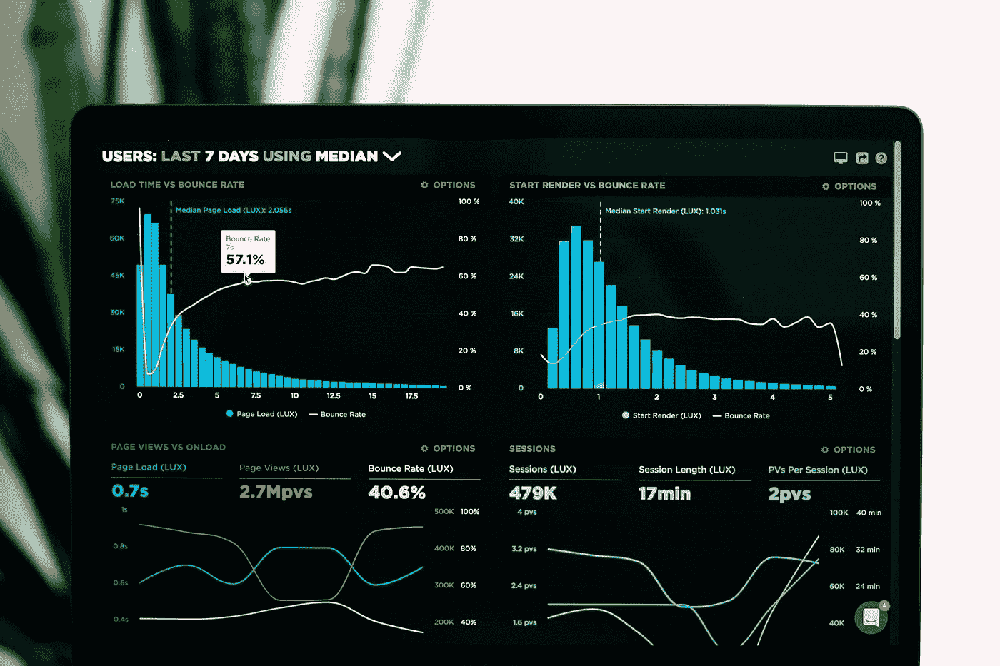
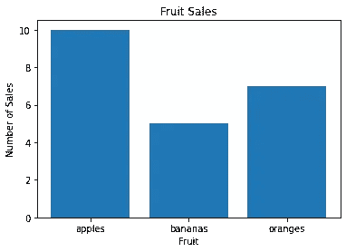
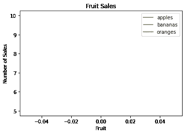
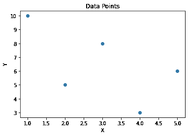
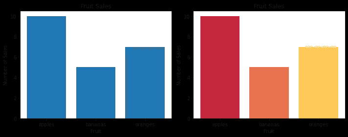
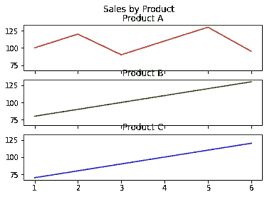
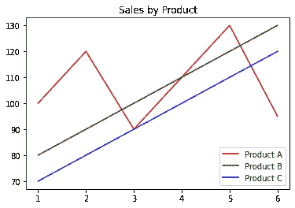
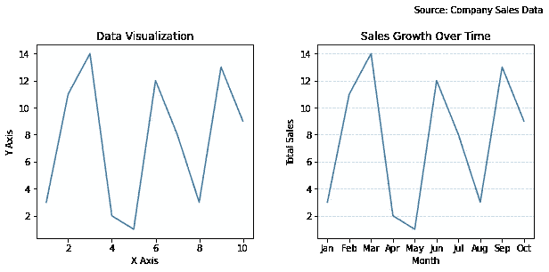
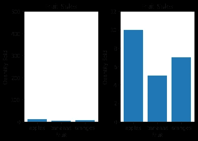
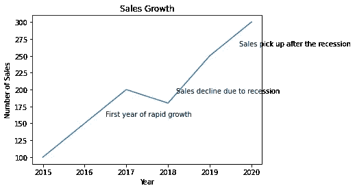

# 高效数据可视化的 8 个技巧

> 原文：[`towardsdatascience.com/8-tips-for-effective-data-visualisation-f00e711b164a`](https://towardsdatascience.com/8-tips-for-effective-data-visualisation-f00e711b164a)

## 数据 | 可视化 | 分析

## 一份正确向观众展示你的见解和观察的指南

[](https://david-farrugia.medium.com/?source=post_page-----f00e711b164a--------------------------------)[](https://towardsdatascience.com/?source=post_page-----f00e711b164a--------------------------------) [David Farrugia](https://david-farrugia.medium.com/?source=post_page-----f00e711b164a--------------------------------)

·发表于 [Towards Data Science](https://towardsdatascience.com/?source=post_page-----f00e711b164a--------------------------------) ·10 分钟阅读·2023 年 4 月 25 日

--



图片由 [Luke Chesser](https://unsplash.com/@lukechesser?utm_source=medium&utm_medium=referral) 提供，来源于 [Unsplash](https://unsplash.com/?utm_source=medium&utm_medium=referral)

当我们讨论数据科学时，我们往往过于关注数据清理和机器学习方面的过程。

讨论的主要点似乎是如何最佳地准备我们的数据集以进行建模，我们需要工程化并包含哪些特征在我们的训练中，我们会首先尝试哪种机器学习技术，以及我们将如何评估它？

虽然这些都是有效且重要的问题需要询问和规划，但作为数据科学家，我们常常忘记优先考虑任何项目的最大卖点之一：**可视化**。

每一个数据科学项目至少涉及两个方面：技术方面（即数据科学家）和非技术方面（即利益相关者，可能是一些经理或高层主管）。

我们需要记住，数据科学的根本目的是提升业务价值。大多数人不理解数据。我们必须**展示**给他们。

当做得有效时，数据可视化可以帮助我们发现洞察、识别趋势并传达复杂的想法。

在多年的经验中，我发现这一领域是许多专业人士的短板——尤其是那些初级职位的人员（包括我自己！）。

创建优秀的数据可视化是另一项独立的技能。数据可视化很容易造成更多的混淆而不是清晰。

在这篇文章中，我们将讨论 8 个关于如何生成美观、易于解释和有效的数据可视化的技巧。

# 提示 #1：选择合适的图表类型

迄今为止，最难掌握的技能是选择合适的可视化类型的直觉。

我们有柱状图、折线图、饼图、散点图、热图和小提琴图——仅举几例。很容易迷失方向并感到不知所措。前往 seaborn 画廊，你会立即开始理解这一决策有多么广泛。

[](https://seaborn.pydata.org/examples/index.html?source=post_page-----f00e711b164a--------------------------------) [## 示例画廊 - seaborn 0.12.2 文档

### 编辑描述

seaborn.pydata.org](https://seaborn.pydata.org/examples/index.html?source=post_page-----f00e711b164a--------------------------------)

正如预期的那样，这可能是我经常看到的最常见错误之一。使用不正确的数据可视化图表。

选择正确的图表类型至关重要，这直接与我们展示的数据类型和想要传达的信息相关。

假设我们有一个小数据集，显示了一个商店本月售出了多少苹果、香蕉和橙子。

```py
# Example data
data = {'apples': 10, 'bananas': 5, 'oranges': 7}
```

让我们深入探讨不同图表类型如何传达信息。

在所有情况下，我们都需要导入以下包：

```py
import matplotlib.pyplot as plt
import pandas as pd
```

## 柱状图

```py
# Bar chart
plt.bar(data.keys(), data.values())
plt.title('Fruit Sales')
plt.xlabel('Fruit')
plt.ylabel('Number of Sales')
plt.show()
```



作者提供的图像

柱状图在显示每个类别（在我们的例子中是水果类型）的值方面做得非常好。这个图表清楚地显示出最畅销的水果是苹果，最不畅销的是香蕉。

## 折线图

```py
# Line chart
df = pd.DataFrame(data, index=[0])
df.plot.line()
plt.title('Fruit Sales')
plt.xlabel('Fruit')
plt.ylabel('Number of Sales')
plt.show()
```



作者提供的图像

如果我们尝试将相同的数据可视化为折线图，我们会得到上面显示的——一个空图表。折线图通常用于显示随时间变化的趋势。因此，我们需要监控某种‘移动’变量。在这种情况下，可以是每月的销售数据，跨多个不同的月份。

## 散点图

我们还可以将相同的水果类别映射到一个数字，并将其可视化为散点图。假设我们有 5 个类别及其各自的值。

```py
# Scatter plot
x = [1, 2, 3, 4, 5]
y = [10, 5, 8, 3, 6]
plt.scatter(x, y)
plt.title('Data Points')
plt.xlabel('X')
plt.ylabel('Y')
plt.show()
```



作者提供的图像

正如我们所见，虽然散点图确实显示了不同类别之间的某种差异，并帮助指示它们的表现，但信息仍然没有清晰呈现。

对于这种特定的洞察交付和使用场景，我认为我们都可以同意柱状图可能是最合适的选择。

Infogram 有一篇关于此主题的好文章。

[](https://infogram.com/page/choose-the-right-chart-data-visualization?source=post_page-----f00e711b164a--------------------------------) [## 如何为你的数据选择正确的图表

### 如果你有数据需要可视化，确保使用正确的图表。虽然你的数据可能适用于多个图表……

infogram.com](https://infogram.com/page/choose-the-right-chart-data-visualization?source=post_page-----f00e711b164a--------------------------------)

# 提示 #2: 有效使用颜色

我不能再强调了——颜色是你在可视化中的最佳朋友。

使用颜色来突出主要的（或值得注意的）见解。

使用颜色来分隔群体。

使用颜色将观众的注意力转移到你希望他们看到的区域。

使用颜色来控制观众的注意力。

为了美观——选择一种与数据和观众相配的令人愉悦的颜色调色板。例如，如果我们展示水果，橙子可能是橙色，香蕉则是黄色。这些小细节是区分好图表和优秀图表的差异。你的观众不应该努力理解图表——而是应该让它对他们说话，告诉他们他们需要知道的一切！

[## 选择颜色调色板 - seaborn 0.12.2 文档](https://seaborn.pydata.org/tutorial/color_palettes.html?source=post_page-----f00e711b164a--------------------------------)

### 由于我们眼睛的工作方式，特定颜色可以通过三个组件来定义。我们通常编程颜色…

[seaborn.pydata.org](https://seaborn.pydata.org/tutorial/color_palettes.html?source=post_page-----f00e711b164a--------------------------------)

额外提示——一旦选择了颜色调色板，请保持一致。在所有图表中使用相同的颜色调色板。尤其是在演示过程中。不要让观众困惑。如果在第一个图表中苹果是红色的，就不要在下一个图表中将它们标记为黄色。

回想一下我们之前展示的条形图示例。让我们用一些颜色来装饰它。

```py
import matplotlib.pyplot as plt
import pandas as pd

data = {'apples': 10, 'bananas': 5, 'oranges': 7}

# create a figure with two subplots
fig, axs = plt.subplots(ncols=2, figsize=(10, 4))

# plot the first chart on the left subplot
axs[0].bar(data.keys(), data.values())
axs[0].set_title('Fruit Sales')
axs[0].set_xlabel('Fruit')
axs[0].set_ylabel('Number of Sales')

# Custom color palette
colors = ['#C5283D', '#E9724C', '#FFC857']
# plot the second chart on the right subplot
axs[1].bar(data.keys(), data.values(), color=colors)
axs[1].set_title('Fruit Sales')
axs[1].set_xlabel('Fruit')
axs[1].set_ylabel('Number of Sales')

# adjust the spacing between the subplots
fig.tight_layout()

# show the plot
plt.show()
```



作者提供的图片

# 提示 #3: 保持简单

和生活中的大多数事物一样，越简单越好。

如果某些元素或样式对图表没有增加任何价值，就不要包括它们。

同时记住，你的目标是尽可能清晰和高效地向观众展示发现。没有人会在乎你的花哨图形。

额外的内容只会有一个目的：分散观众的注意力。

假设有一个数据集，包含三种不同产品——A、B 和 C 的总销售额。我们想创建一个图表来显示销售趋势随时间的变化。

```py
import matplotlib.pyplot as plt
import numpy as np

# Generate some fake data
months = np.arange(1, 7)
sales_a = np.array([100, 120, 90, 110, 130, 95])
sales_b = np.array([80, 90, 100, 110, 120, 130])
sales_c = np.array([70, 80, 90, 100, 110, 120])

# Create the chart
fig, axs = plt.subplots(3, sharex=True, sharey=True)
axs[0].plot(months, sales_a, color='red')
axs[0].set_title('Product A')
axs[1].plot(months, sales_b, color='green')
axs[1].set_title('Product B')
axs[2].plot(months, sales_c, color='blue')
axs[2].set_title('Product C')
fig.suptitle('Sales by Product')
plt.show()
```



作者提供的图片

上面的图表完成了任务——但效果相当糟糕。我们有多个图表，每个图表都有自己的刻度、标题和颜色。很难跟踪和比较。

让我们简化一下，好吗？

```py
import matplotlib.pyplot as plt
import numpy as np

# Generate some fake data
months = np.arange(1, 7)
sales_a = np.array([100, 120, 90, 110, 130, 95])
sales_b = np.array([80, 90, 100, 110, 120, 130])
sales_c = np.array([70, 80, 90, 100, 110, 120])

# Create the chart
plt.plot(months, sales_a, color='red', label='Product A')
plt.plot(months, sales_b, color='green', label='Product B')
plt.plot(months, sales_c, color='blue', label='Product C')
plt.title('Sales by Product')
plt.legend()
plt.show()
```



作者提供的图片

好多了，不是吗？

我们现在可以轻松比较趋势。

当然，这只是一个示例。在生成图表时，请记住，添加到图表中的任何东西都必须具有价值。

# 提示 #4: 提供背景信息

我不能过分强调这一点——提供背景信息！

令人惊讶的是，我经常看到许多图表没有标题或标签轴。你的观众不是心灵感应者。让他们知道他们在看什么！

在必要时添加标签、标题、图例、数据来源和注释。

这是一个没有任何背景的糟糕图表（左侧）和一个具有背景的优秀图表（右侧）的示例。



作者提供的图像

# 提示 #5: 使用比例表示

我们有时需要用不同的尺度或范围可视化多个数据。确保我们处理和表示所有变量时使用相同的尺度，并关注有趣的数据范围，是非常重要的。

小心不要误表述你的数据。

例如，考虑下面的图表：

```py
import matplotlib.pyplot as plt
import pandas as pd

# Example data
data = {'apples': 10, 'bananas': 5, 'oranges': 7}

# First chart: bar chart with proportional representation and inconsistent y-axis
plt.subplot(1, 2, 1)
plt.bar(data.keys(), data.values())
plt.ylim(0, 500)
plt.title('Fruit Sales')
plt.xlabel('Fruit')
plt.ylabel('Quantity Sold')

# Second chart: bar chart with proportional representation and consistent y-axis
plt.subplot(1, 2, 2)
plt.bar(data.keys(), data.values())
plt.ylim(0, 12)
plt.title('Fruit Sales')
plt.xlabel('Fruit')
plt.ylabel('Quantity Sold')

# Adjust the spacing between the charts
plt.subplots_adjust(wspace=0.3)

# Display the charts
plt.show()
```



作者提供的图像

我们非常欣赏两个图表之间的差异。左侧的图表完全失去了比例——使得评估和比较图表变得非常困难。

另一方面，右侧的图表清楚地显示了差异。

# 提示 #6: 讲述一个故事

我们必须尽量使图表易于理解。

我们还必须尽量使图表尽可能有趣。

优秀的图表传达直接的信息。它们挑选一个有趣的观察或见解并讲述其故事。图表应该用来支持论点。

```py
import matplotlib.pyplot as plt
import pandas as pd

# Example data
year = [2015, 2016, 2017, 2018, 2019, 2020]
sales = [100, 150, 200, 180, 250, 300]

# Line chart with a narrative
plt.plot(year, sales)
plt.title('Sales Growth')
plt.xlabel('Year')
plt.ylabel('Number of Sales')
plt.text(2016.5, 160, 'First year of rapid growth')
plt.text(2018.2, 195, 'Sales decline due to recession')
plt.text(2019.7, 265, 'Sales pick up after the recession')
plt.show()
```



作者提供的图像

# 提示 #7: 考虑你的观众

图表应满足观众的需求。

图表应该帮助你的观众更快地得出自己的结论。

不同的观众有不同的需求。

例如，如果我们刚刚训练了预测模型，并且我们将结果呈现给一些高管，我们可能会想要关注财务方面。我们可能会想要突出不同的 KPI 以及该模型如何提高收入。

如果我们向更技术性的观众展示模型，比如其他数据科学家或工程师，我们可能会想要重点关注模型性能方面。我们会想要突出学习曲线或关注评估指标。

观众将影响我们的图表。我们需要使用观众知道和理解的概念和语言。

# 提示 #8: 使其具有互动性

有时，我们的数据本质上很复杂，而让观众容易理解的唯一方法就是使其具有互动性。

这将允许我们的观众手动探索数据并得出自己的见解。

我们可以通过添加其他互动组件，如工具提示、过滤器和缩放，来帮助他们尽可能参与。

Plotly 是生成互动图表的绝佳工具。

[](https://plotly.com/?source=post_page-----f00e711b164a--------------------------------) [## Plotly: 低代码数据应用开发]

### Dash Enterprise 是构建、扩展和部署 Python 数据应用的首选平台。构建数据应用…

plotly.com](https://plotly.com/?source=post_page-----f00e711b164a--------------------------------)

```py
import plotly.graph_objs as go
import numpy as np

# Generate random data
x = np.random.rand(100)
y = np.random.rand(100)

# Create a Plotly trace object
trace = go.Scatter(
    x = x,
    y = y,
    mode = 'markers'
)

# Create a Plotly layout object
layout = go.Layout(
    title = 'Interactive Scatter Plot',
    xaxis = dict(title = 'X Axis'),
    yaxis = dict(title = 'Y Axis'),
    hovermode = 'closest'
)

# Create a Plotly figure object that combines the trace and layout
fig = go.Figure(data=[trace], layout=layout)

# Display the interactive plot in the Jupyter Notebook
fig.show()
```

# 总结

设计美观且有效的数据可视化需要仔细考虑。我们必须记住多种因素，这些因素不仅影响我们展示什么，也影响我们如何展示。我们还必须记住，生成优秀的图表可能需要大量的测试和迭代，以找出最佳的呈现方式。

通过遵循这 8 个数据可视化技巧，你将能够创建更好的可视化图表，有效且清晰地传达你的发现。

**你喜欢这篇文章吗？只需每月$5，你就可以成为会员，解锁 Medium 上的无限访问权限。你将直接支持我以及你所有其他喜欢的 Medium 作者。非常感谢！**

[](https://david-farrugia.medium.com/membership?source=post_page-----f00e711b164a--------------------------------) [## 通过我的推荐链接加入 Medium - David Farrugia

### 获得对我所有 ⚡优质⚡ 内容的独家访问权限，并在 Medium 上无限制地浏览。通过购买我一杯咖啡来支持我的工作…

[david-farrugia.medium.com](https://david-farrugia.medium.com/membership?source=post_page-----f00e711b164a--------------------------------)

# 想要联系我吗？

我很想听听你对这个话题的看法，或者对人工智能和数据的任何想法。

如果你希望联系我，可以发邮件至 ***davidfarrugia53@gmail.com***。

[Linkedin](https://www.linkedin.com/in/david-farrugia/)
