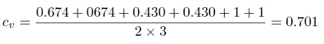

# Cᵥ 话题连贯性解释

> 原文：[`towardsdatascience.com/c%E1%B5%A5-topic-coherence-explained-fc70e2a85227?source=collection_archive---------3-----------------------#2023-01-12`](https://towardsdatascience.com/c%E1%B5%A5-topic-coherence-explained-fc70e2a85227?source=collection_archive---------3-----------------------#2023-01-12)

图片由 [Emile Perron](https://unsplash.com/@emilep?utm_source=medium&utm_medium=referral) 提供，发布在 [Unsplash](https://unsplash.com/?utm_source=medium&utm_medium=referral)

## 理解与人类相关性最高的度量标准

 [Emil Rijcken](https://emilrijcken.medium.com/?source=post_page-----fc70e2a85227--------------------------------)

·

[关注](https://medium.com/m/signin?actionUrl=https%3A%2F%2Fmedium.com%2F_%2Fsubscribe%2Fuser%2F95ae6f4e7791&operation=register&redirect=https%3A%2F%2Ftowardsdatascience.com%2Fc%E1%B5%A5-topic-coherence-explained-fc70e2a85227&user=Emil+Rijcken&userId=95ae6f4e7791&source=post_page-95ae6f4e7791----fc70e2a85227---------------------post_header-----------) 发表在 [Towards Data Science](https://towardsdatascience.com/?source=post_page-----fc70e2a85227--------------------------------) ·7 分钟阅读·2023 年 1 月 12 日

--

在自然语言处理（NLP）中，主题建模是一个流行的任务。目标是从文档语料库中提取隐藏的(*K*)主题。每个主题是一个单词的分布。通常，每个主题中*最有可能的 N*个单词代表该主题。这个想法是，如果主题建模算法工作良好，这些前*最有可能的 N*个单词在语义上是相关的。难点在于如何评估这些单词集合。正如任何机器学习任务一样，模型评估至关重要。在一项大规模系统研究（Röder 等，2015）中，直到那时尚不为人知的 Cᵥ连贯性被发现与人工解释的相关性最高。从那时起，这一度量被广泛用于评估主题模型，并且是 Gensim 的 Coherencemodel 中的默认设置。我在网上找不到直观的算法描述，所以写了一个。许多数据科学家使用主题建模来分析他们的文本。理解评估指标将有助于调整模型和评估指标。

我们将首先讨论一些背景信息。这将为 Röder 等人的研究铺平道路。在讨论了研究方法后，我们将从数学上讲解算法。然后，我们将通过一个例子（关于玫瑰和紫罗兰）逐步讲解这些步骤。最后，我将分享一些使用 Cᵥ连贯性时的观察和考虑因素。

# 背景

一个长期存在的问题，具有远超 NLP 的潜在应用，是量化一组陈述的连贯性。NLP 中的定量方法通常受*分布假设*的启发。1950 年代的几位研究人员（Martin Joos、Zellig S. Harris 和 John Rupert Firth）发现，同义词（如 oculist 和 eye-doctor）往往出现在相同的单词环境中（如‘eye’或‘examined’）。因此，分布假设指出，相同上下文中的单词倾向于具有相似的意义。出于这个原因，语料库中的单词上下文通常用于评估一组主题单词是否连贯。然而，有很多方法可以获取‘上下文’的信息并反映在一个分数中。例如：

+   你是比较（所有）单一主题的单词还是集合？

+   如果你考虑共现，你是考虑整个文档还是仅仅是一个特定的单词窗口？如果选择窗口，窗口中有多少个单词？

+   给定单词/单词集合的比较，你如何指示这些单词在语义上相关的程度？

+   在收集了所有主题的分数之后，你如何聚合这些数字以反映一个唯一的分数？

# 探索主题连贯性的空间

考虑到上述因素，Röder 等人（2015）定义了四个维度，这些维度涵盖了连贯性度量的配置空间。通俗来说，他们将连贯性得分定义为上述四个考虑因素的组合。他们称这些维度为：

+   单词子集的分段，

+   概率估计，

+   确认度量，

+   聚合。

然后，他们为这些维度定义了潜在的设置。基于这些设置，他们可以生成 237,912 种组合。他们计算了给定主题的人类评估分数与每种组合之间的相关性。通过这一系统化研究，一个未知的度量表现出了最高的相关性；Cᵥ 连贯性。

# Cᵥ 连贯性

在 Cᵥ 连贯性中，每个主题词都与所有主题的集合进行比较。使用大小为 110 的布尔滑动窗口来评估两个词是否共现。然后，确认度量由直接确认和间接确认组成。对于每个主题的所有 *N* 个最可能的词，创建一个大小为 *N* 的‘*词向量*’，其中每个单元包含该词与词 *i, i* 属于 {1,2,…, *N*} 之间的归一化点对点互信息 (NPMI)。然后，将一个主题中的所有词向量聚合成一个大的主题向量。所有主题词与其主题向量之间的余弦相似度的平均值（即分割）用于计算 Cᵥ 分数。

现在进行正式描述。由于 Medium 对数学符号的支持不佳，我在此粘贴了我和我的小组创建的另一文档中的一些符号。

Cᵥ 分数在很大程度上依赖于 NPMI 分数，这是一种计算两个词在语料库中共现概率的高级方法。

归一化点对点互信息的公式

epsilon 是一个小常数，用于避免对零取对数。

这个概率基于滑动窗口 *s* (*s* = 110 对于 Cᵥ)。其中 *j* 为文档中滑动窗口的索引，NPMI 公式中的概率计算如下：

基于滑动窗口 s 的两个词之间的概率计算

基于 NPMI，为每个主题词创建长度为 N 的词向量（直接确认）：

词向量的创建（直接确认度量）

对于分割，我们有以下内容：

词子集的分割

为了将每个词与主题向量进行比较，我们创建 *K* 个主题向量作为每个主题中所有 *N* 个词的总和（请注意，*W** 指的是下面相同的 *w**）：

主题向量

基于主题向量和分割，计算每个主题词向量与主题向量之间的余弦相似度。余弦相似度计算如下：

余弦相似度

然后，取所有 *NxK* 余弦相似度的平均值以计算 Cᵥ 分数：

Cᵥ 分数是所有余弦相似度的平均值。

理解复杂事物的美妙之处在于，一旦你理解了它们，它们似乎就不那么复杂了。希望在阅读完这篇博客后，你能有这样的体会。如果没有，我们将进入 B 计划。让我们通过一个例子来说明。

# 示例

此外，我们有三个主题，每个主题有两个最可能的词（因此，*K = 3, N = 2*）：

使用滑动窗口大小为 3 (*s = 3*)，我们有以下窗口：

(’mary’,’had’,’a’), (’had’,’a’,’lamp’), (’mary’,’has’,’roses’), (’roses’,’are’,’red’), (’violets’,’ are’,’light’),(’are’,’light’,’blue’).

因此，我们有：

基于这些得分，我们有：

因此：

并且：

这给我们带来：

因此这些主题的 Cᵥ得分计算为：

# Cᵥ考量

尽管 Cᵥ在 Röder 等人的研究中表现为最佳的一致性得分，但在实践中存在一些问题。Cᵥ得分与[一些实验](https://github.com/dice-group/Palmetto/issues/12)中的其他一致性测量值负相关。然而，作者怀疑这个问题可能是由 epsilon 值引起的，线程中没有进一步调查该错误。我也没有看到任何同行评审的工作讨论这个问题。我的结论是，在证明有罪之前，Cᵥ仍然是无辜的。但了解这个问题是有益的。此外，现在常用基于词嵌入的主题模型。作者声称这些模型与人类判断相关，类似于 Cᵥ得分。然而，在[我的一项研究](https://ieeexplore.ieee.org/document/9945594)中，我和我的团队发现不同（基于嵌入的）一致性得分偏爱不同的主题。因此，关于主题一致性的最后结论仍需进一步讨论。

如果你喜欢这项工作，你可能对主题建模也感兴趣。在这种情况下，你可能也会对以下内容感兴趣。

**我们创建了一种新的主题建模算法，称为 FLSA-W**（官方页面[在这里](https://ieeexplore.ieee.org/abstract/document/9660139)，但你可以在[这里](https://pure.tue.nl/ws/portalfiles/portal/243684581/A_Comparative_Study_of_Fuzzy_Topic_Models_and_LDA_in_terms_of_Interpretability.pdf)查看论文）。

[**FLSA-W 在多个开放数据集上优于其他最先进的算法（如 LDA、ProdLDA、NMF、CTM 等）。**](https://pure.tue.nl/ws/files/222725628/Pure_ExperimentalStudyOfFlsa_wForTopicModeling.pdf) **这项工作已提交，但尚未经过同行评审。**

**如果你想使用 FLSA-W，你可以下载** [**FuzzyTM 包**](https://pypi.org/project/FuzzyTM/) **或 Gensim 中的 flsamodel。** 有关引用，[请使用这篇论文](https://ieeexplore.ieee.org/abstract/document/9882661?casa_token=UsYg7SvoSioAAAAA%3A3ltCVZexA9-lPveuGVeRDh5VQW6rw0pVRDxmYk39tXbx13u4OuB2sTEFZzIGJCkdRiZBg0eJ)。

如果你有任何问题或意见，请告知我。
