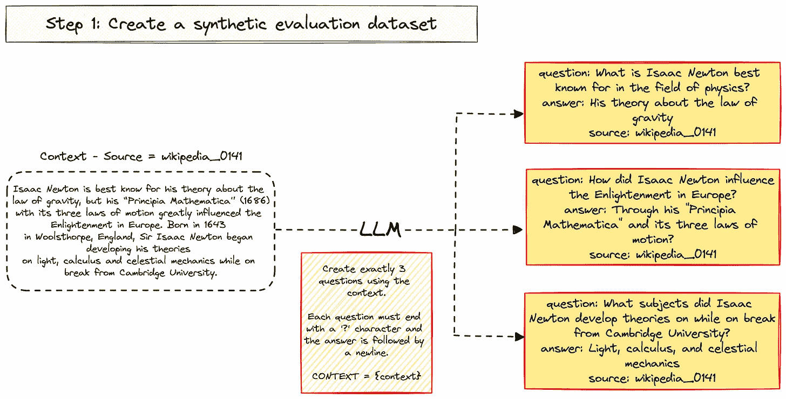
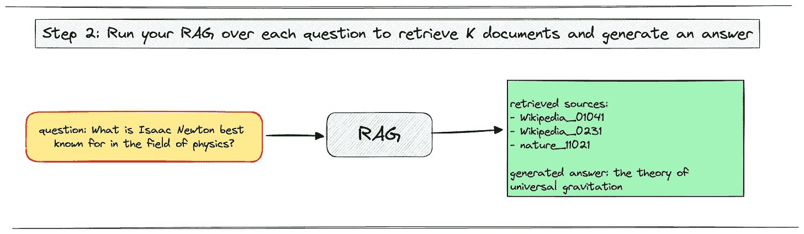
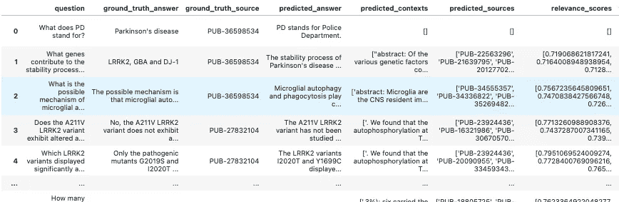
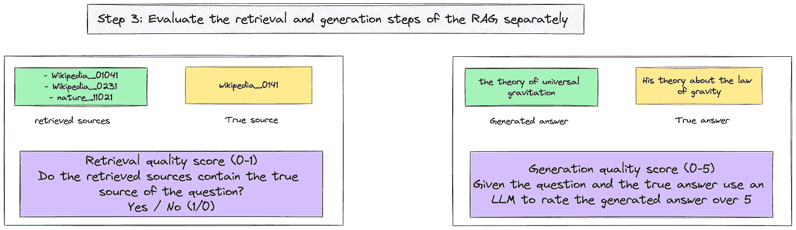
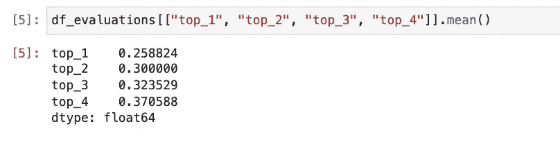
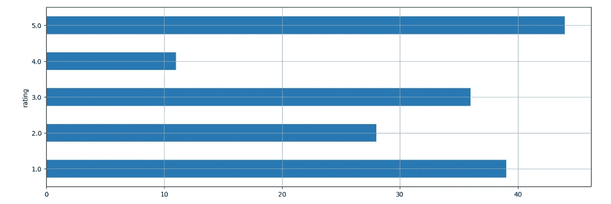
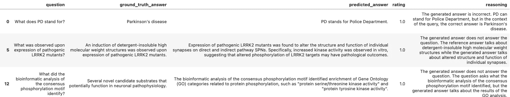
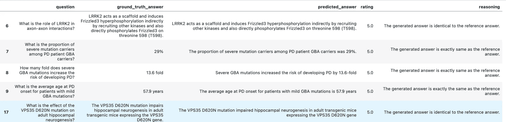

# 评估检索增强生成（RAG）的 3 步法

> 原文：[`towardsdatascience.com/a-3-step-approach-to-evaluate-a-retrieval-augmented-generation-rag-5acf2aba86de`](https://towardsdatascience.com/a-3-step-approach-to-evaluate-a-retrieval-augmented-generation-rag-5acf2aba86de)

## 停止随机选择你的 RAG 参数

[](https://ahmedbesbes.medium.com/?source=post_page-----5acf2aba86de--------------------------------)[](https://towardsdatascience.com/?source=post_page-----5acf2aba86de--------------------------------) [Ahmed Besbes](https://ahmedbesbes.medium.com/?source=post_page-----5acf2aba86de--------------------------------)

·发表于[Towards Data Science](https://towardsdatascience.com/?source=post_page-----5acf2aba86de--------------------------------) ·9 分钟阅读·2023 年 11 月 23 日

--


照片由[Adi Goldstein](https://unsplash.com/@adigold1?utm_source=medium&utm_medium=referral)拍摄，来源于[Unsplash](https://unsplash.com/?utm_source=medium&utm_medium=referral)

调整你的 RAG 以获得最佳性能需要时间，因为这取决于各种相互关联的参数：**块大小、重叠、检索的前 K 个文档、嵌入模型、LLM 等。**

最佳组合通常依赖于你的数据和使用案例：你不能仅仅套用上一个项目中的设置来期望得到相同的结果。

大多数人没有妥善解决这个问题，而是几乎随机地选择参数。虽然有些人对此方法感到舒适，但我决定用数值方法来解决这个问题。

**这就是评估你的 RAG 的地方。**

> 在***这篇文章中，我将展示一个快速的 3 步法，你可以用来高效、快速地评估你的 RAG 在两个任务中的表现。***

1.  **检索**

1.  **生成**

通过掌握这个评估流程，你可以进行迭代，执行多次实验，用指标进行比较，并且希望找到最佳配置

让我们看看这个如何运作 👇。

*附注：在每一节中，都提供了代码片段以帮助你开始实现这些想法。*

> 如果你对提高构建 ML 系统生产力的实用技巧感兴趣，可以随时订阅我的[通讯](https://thetechbuffet.substack.com/): The Tech Buffet。
> 
> 我每周发送编程和系统设计的见解，以帮助你更快地发布 AI 产品。

# 1 — 创建一个合成数据集

评估 LLM 通常需要手动标注测试集。这需要时间、领域专业知识，并且容易出错。

希望 LLM 能帮助我们完成这项任务。

从你的数据中抽取 N 个块。对于每个块，指示 LLM 生成 K 个问题和答案的元组。

生成完成后，你将获得一个包含 N*K 元组的数据集，每个元组都有（问题，答案，上下文）。

*附注：这里的上下文是原始块及其元数据*

在以下示例中，我们将考虑一个提到艾萨克·牛顿的段落。

> 艾萨克·牛顿因其关于引力定律的理论而闻名，但他的《自然哲学的数学原理》（1686 年）
> 
> 通过其三大运动定律极大地影响了欧洲的启蒙时代。生于 1643 年
> 
> 在英格兰的伍尔索普，艾萨克·牛顿爵士开始发展他的理论
> 
> 关于光、微积分和天体力学，同时在剑桥大学休假期间。

我们将指示 LLM 从中生成三对问题和答案。



图片由作者提供

这可以使用这个提示完成。（改编自我的一个项目）

```py
Create exactly {num_questions} questions using the context and make 
sure each question doesn’t reference
terms like "this study", "this research", or anything that’s 
not available to the reader.
End each question with a ‘?’ character and then in a newline
write the answer to that question using only 
the context provided.

Separate each question/answer pair by "XXX"

Each question must start with "question:".

Each answer must start with "answer:".

CONTEXT = {context}
```

我们将进一步了解这个合成数据集的局限性，但现在，它是评估我们实验的一个快速解决方案。

## 代码 💻

在接下来的部分中，我将展示如何使用 LangChain 创建你的合成评估数据集。

我们首先定义提示和 LLM：我正在使用 GCP，所以我将使用 VertexAI。

```py
from random import sample
from langchain.llms import VertexAI
from langchain.prompts import PromptTemplate
from langchain.chains import LLMChain

SYNTHETIC_DATASET_SIZE = 70
NUM_QUESTIONS_TO_GENERATE = 3
sampled_chunks = sample(splits, k=SYNTHETIC_DATASET_SIZE)

prompt = """
Create exactly {num_questions} questions using the context and make sure each question doesn't reference
terms like "this study", "this research", or anything that's not available to the reader.

End each question with a '?' character and then in a newline write the answer to that question using only 
the context provided.
Separate each question/answer pair by "XXX"
Each question must start with "question:".
Each answer must start with "answer:".
CONTEXT = {context}
"""

llm = VertexAI(
    model_name="text-bison",
    max_output_tokens=256,
    temperature=0,
    top_p=0.95,
    top_k=40,
    verbose=True,
)
prompt_template = PromptTemplate(
    template=prompt,
    input_variables=[
        "num_questions",
        "context",
    ],
)
chain = LLMChain(llm=llm, prompt=prompt_template)
```

然后，我们从 BQ 加载一些数据并将其拆分成块。块将是生成问题和答案所需的上下文。

```py
from langchain.document_loaders.bigquery import BigQueryLoader
from langchain.text_splitter import RecursiveCharacterTextSplitter

def load_data_from_bq(query, content_cols, metadata_cols):
    loader = BigQueryLoader(
        query=query, page_content_columns=content_cols, metadata_columns=metadata_cols
    )
    return loader.load()

query = ... # the SQL query to 
content_cols = ... # the content columns of your table
metadata_cols = ... # the metadata columns of your

loaded_data = load_data_from_bq(
    query,
    content_cols=content_cols,
    metadata_cols=metadata,
)

CHUNK_SIZE = 700
CHUNK_OVERLAP = 100

text_splitter = RecursiveCharacterTextSplitter(
    separators=["."],
    chunk_size=CHUNK_SIZE,
    chunk_overlap=CHUNK_OVERLAP,
)

splits = text_splitter.split_documents(loaded_data)
```

一旦数据加载并拆分完毕，你需要从中抽取一些块以生成问题/答案对。

这在以下循环中完成。

```py
import pandas as pd

SYNTHETIC_DATASET_SIZE = 70
NUM_QUESTIONS_TO_GENERATE = 3
sampled_chunks = sample(splits, k=SYNTHETIC_DATASET_SIZE)

synthetic_dataset = []
for sampled_chunk in tqdm(sampled_chunks):
    prediction = chain.invoke(
        {
            "num_questions": NUM_QUESTIONS_TO_GENERATE,
            "context": sampled_chunk.page_content,
        }
    )
    output = prediction["text"]

    try:
        questions_and_answers = parse_output(output)

        for question_and_answer in questions_and_answers:
            synthetic_dataset.append(
                {
                    **question_and_answer,
                    "context": sampled_chunk.page_content,
                    "source": sampled_chunk.metadata["source"],
                }
            )
    except:
        pass

synthetic_dataset_df = pd.DataFrame(synthetic_dataset)
```

# 2 — 对每个合成问题运行你的 RAG

一旦合成数据集构建完成，你可以使用你的 RAG 对每个问题进行预测。

这将生成基于一组检索来源的答案。

对于每个问题，请确保你提取了检索到的文档：这些文档将用于进行评估。



图片由作者提供

## 代码 💻

在接下来的部分中，我们将看到如何构建 RAG 并对评估数据进行预测。

我们首先需要创建一个向量数据库来索引这些块。

```py
from langchain.embeddings import VertexAIEmbeddings
from langchain.vectorstores import Chroma

db = Chroma.from_documents(
    documents=splits,
    embedding=VertexAIEmbeddings(),
    persist_directory="./db",
)
```

LangChain 中默认的 RAG 实现使用了一个特定的提示模板。在我们的案例中，我们将稍微修改它以防止产生幻觉。

```py
RAG_TEMPLATE = """Use the following pieces of context to answer the question at the end. 
If you don't know the answer, just say that you don't know, don't try to make up an answer. 
{context}
Question: {question}
Helpful Answer:"""
```

然后，我们将我们的 RAG 实现包装在一个 Python 类中。

```py
class RAG:
    def __init__(self, vectorstore, rag_template=RAG_TEMPLATE):
        self.vectorstore = vectorstore
        self.rag_prompt = PromptTemplate.from_template(rag_template)
        self.chain = LLMChain(llm=llm, prompt=self.rag_prompt)

    def _format_context(self, docs):
        context = [doc.page_content for doc, score in docs]
        context = "\n---\n".join(context)
        return context

    def _format_source_documents(self, docs):
        source_documents = []
        for doc, score in docs:
            doc.metadata["score"] = score
            source_documents.append(doc)
        return source_documents

    def predict(self, question, k=4, score_threshold=0.6):
        relevant_documents = self.vectorstore.similarity_search_with_relevance_scores(
            query=question,
            k=k,
            score_threshold=score_threshold,
        )
        source_documents = self._format_source_documents(relevant_documents)
        context = self._format_context(relevant_documents)
        answer = self.chain.predict(question=question, context=context)
        output = {
            "question": question,
            "answer": answer,
            "source_documents": source_documents,
        }
        return output

# Create the RAG:

rag = RAG(vectorstore=db)
```

一旦 RAG 构建和初始化完成，你可以进行预测：

```py
evaluations = []

for i, row in tqdm(synthetic_dataset_df.iterrows(), total=len(synthetic_dataset_df)):
    question = row["question"]
    ground_truth_answer = row["answer"]
    ground_truth_context = row["context"]
    ground_truth_source = row["source"]
    evaluation = {
        "question": question,
        "ground_truth_answer": ground_truth_answer,
        "ground_truth_source": ground_truth_source,
    }

    prediction = rag.predict(question)
    predicted_answer = prediction["answer"]
    predicted_contexts = [
        source_document.page_content
        for source_document in prediction["source_documents"]
    ]
    predicted_sources = [
        source_document.metadata["source"]
        for source_document in prediction["source_documents"]
    ]

    evaluation["predicted_answer"] = predicted_answer
    evaluation["predicted_contexts"] = predicted_contexts
    evaluation["predicted_sources"] = predicted_sources
    evaluation["relevance_scores"] = [
        source_document.metadata["score"]
        for source_document in prediction["source_documents"]
    ]

    evaluations.append(evaluation)

df_evaluations = pd.DataFrame(evaluations)
```

完成后，你将大致得到以下结果：



截图由作者提供

# 3 — 计算两个评估指标

现在，你可以对你为每个问题做出的预测计算两个评估指标。

1.  一个**检索分数**用于评估检索到的文档的相关性

    这个分数可以是二进制的（每个预测为 1/0），并且表示每个问题的真实来源是否在检索到的来源列表中。你可以把这个分数看作是*召回率*。

1.  一个**质量评分**用于评估生成的答案，给定问题和真实答案。再次地，可以使用 LLM 在此任务中提供 5 分评价。

这是我用来要求 LLM 评分生成答案的提示。

```py
Your job is to rate the quality of a generated answer
given a query  and a reference answer.

QUERY = {query}

GENERATED ANSWER = {generated_answer}

REFERENCE ANSWER = {reference_answer}

Your score has to be between 1 and 5.
You must return your response in a line with only the score.
Do not return answers in any other format.
On a separate line provide your reasoning for the score as well.
```

在获得每个问题的分数后，对数据集进行平均以获得最终的两个指标。



作者图片

## 代码 💻

在这一部分中，我们从`df_evaluations`数据框开始并计算不同的指标。

**1 — 检索分数**

我们可以通过计算 top_k 指标开始，这些指标表明真实来源是否在前 k 个预测来源中。

```py
df_evaluations["top_1"] = df_evaluations.apply(
    lambda row: row["ground_truth_source"] in row["predicted_sources"][:1], axis=1
)
df_evaluations["top_2"] = df_evaluations.apply(
    lambda row: row["ground_truth_source"] in row["predicted_sources"][:2], axis=1
)
df_evaluations["top_3"] = df_evaluations.apply(
    lambda row: row["ground_truth_source"] in row["predicted_sources"][:3], axis=1
)
df_evaluations["top_4"] = df_evaluations.apply(
    lambda row: row["ground_truth_source"] in row["predicted_sources"][:4], axis=1
)
```

对所有文档进行平均，将给我们每个 k 的检索分数。



作者截图

> **如何解读这些分数：**
> 
> 示例：真实来源在前四个检索来源中的概率为 0.37。

**2 — 生成分数**

为了评估生成答案的质量，我们将使用一个 LLM，它将提供其评分和推理。

```py
EVAL_TEMPLATE = """Your job is to rate the quality of a generated answer
given a query  and a reference answer.

QUERY = {query}

GENERATED ANSWER = {generated_answer}

REFERENCE ANSWER = {reference_answer}

Your score has to be between 1 and 5.
You must return your response in a line with only the score.
Do not return answers in any other format.
On a separate line provide your reasoning for the score as well."""

prompt_template_eval = PromptTemplate.from_template(EVAL_TEMPLATE)
llm_eval_chain = LLMChain(llm=llm, prompt=prompt_template_eval)
```

在这个函数中，我们指导这个 LLM 并获取其评分和推理：

1.  查询

1.  预测的答案

1.  参考答案

```py
def evaluate_answer(query, generated_answer, reference_answer):
    answer = llm_eval_chain.invoke(
        {
            "query": query,
            "generated_answer": generated_answer,
            "reference_answer": reference_answer,
        }
    )
    answer = answer["text"]

    try:
        rating, reasoning = answer.split("\n")
        rating = rating.strip()
        reasoning = reasoning.strip()

        evaluation = {
            "rating": rating,
            "reasoning": reasoning,
        }
        return evaluation
    except:
        return {
            "rating": None,
            "reasoning": None,
        }
```

然后，我们对评估数据运行这个函数：

```py
answer_quality_evaluations = []

for i, row in tqdm(df_evaluations.iterrows(), total=len(df_evaluations)):
    evaluation = evaluate_answer(
        row["question"],
        row["predicted_answer"],
        row["ground_truth_answer"],
    )
    answer_quality_evaluations.append(evaluation)
```

生成评分后，我们得到的分布如下：



作者截图

根据评分过滤，以下是一些 RAG 未能生成答案的问题：



作者截图

这里是一些其他成功的例子。



作者截图

分析这些数据有助于诊断和解决 RAG 出现的错误。

# 这种评估方法的局限性

在为制药行业构建多个 RAG 时，我应用了这种评估方法。

虽然它快速提供了一个端到端的管道并避免了手动标记数据，但我注意到它有两个主要问题：

+   一些生成的问题过于具体，对于没有阅读上下文的人来说毫无意义。因此，它们对评估指标造成了很大的负面影响，因为它们是*不可能*回答的。

    例如：“这项研究讨论的主要问题是什么？”

+   另一方面，一些其他问题过于简单，或者只是原始片段的简单改述。

# 结论

如果你想了解更多关于这种评估方法（也称为冷启动），可以查看这个[指南](https://www.anyscale.com/blog/a-comprehensive-guide-for-building-rag-based-llm-applications-part-1#cold-start)。

如果你是 RAG 的新手并想深入了解，你也可以查看我之前的一些帖子以获取更多信息。

+   [为什么你的 RAG 在生产环境中不可靠](https://thetechbuffet.substack.com/p/the-probelms-behind-rag)

+   [让 RAG 工作得更好是很困难的 — 成为 RAG 大师的 5 篇博客文章](https://thetechbuffet.substack.com/p/5-curated-rag-blog-posts)

你知道其他在构建 RAG 时被证明有效的评估方法吗？请告诉我。

如果你也在研究 RAG 的最佳性能，我也很愿意讨论这个话题。

今天就到这里。下次再见！👋
