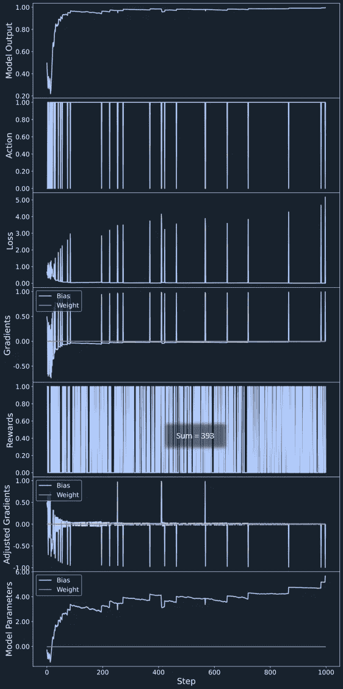
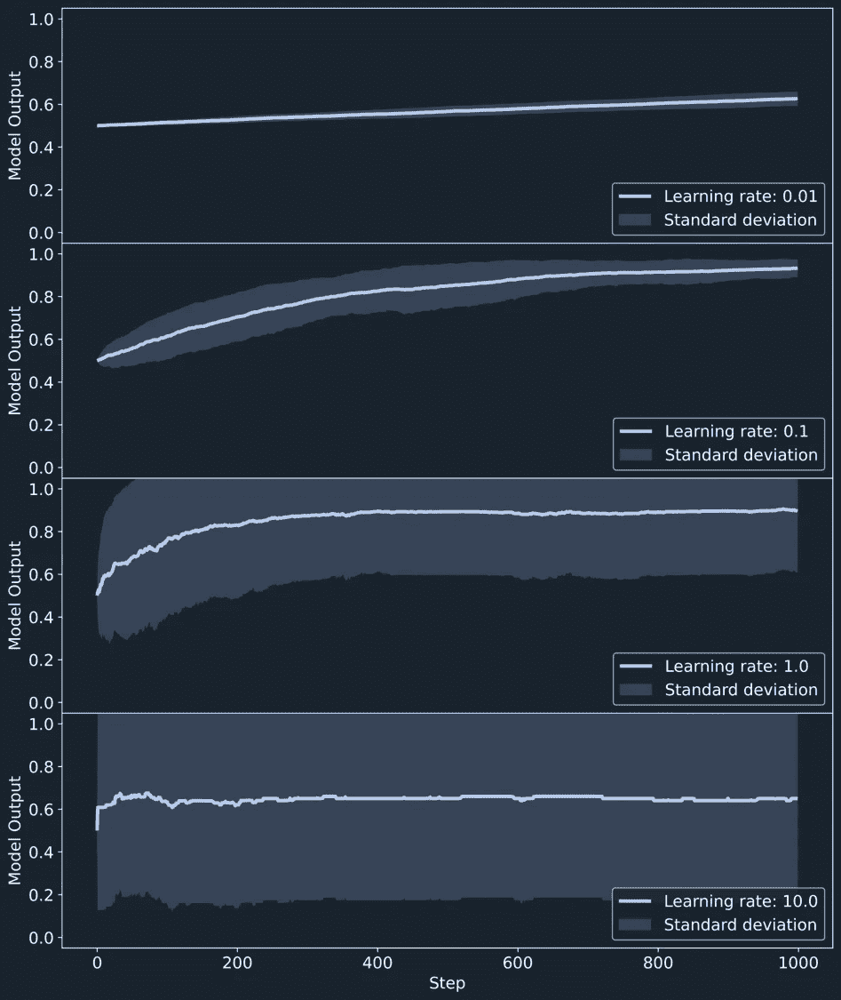
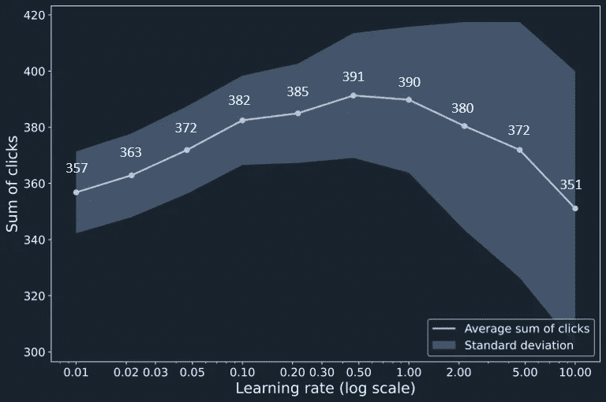

# 使用策略梯度强化学习进行 A/B 优化

> 原文：[`towardsdatascience.com/a-b-optimization-with-policy-gradient-reinforcement-learning-b4a3527f849?source=collection_archive---------13-----------------------#2023-05-23`](https://towardsdatascience.com/a-b-optimization-with-policy-gradient-reinforcement-learning-b4a3527f849?source=collection_archive---------13-----------------------#2023-05-23)

## 关于策略梯度方法的逐步视觉解释

[](https://medium.com/@berndebenhoch?source=post_page-----b4a3527f849--------------------------------)[](https://towardsdatascience.com/?source=post_page-----b4a3527f849--------------------------------) [Dr. Bernd Ebenhoch](https://medium.com/@berndebenhoch?source=post_page-----b4a3527f849--------------------------------)

·

[关注](https://medium.com/m/signin?actionUrl=https%3A%2F%2Fmedium.com%2F_%2Fsubscribe%2Fuser%2F94ac20c7acbb&operation=register&redirect=https%3A%2F%2Ftowardsdatascience.com%2Fa-b-optimization-with-policy-gradient-reinforcement-learning-b4a3527f849&user=Dr.+Bernd+Ebenhoch&userId=94ac20c7acbb&source=post_page-94ac20c7acbb----b4a3527f849---------------------post_header-----------) 发表在 [Towards Data Science](https://towardsdatascience.com/?source=post_page-----b4a3527f849--------------------------------) ·10 分钟阅读·2023 年 5 月 23 日[](https://medium.com/m/signin?actionUrl=https%3A%2F%2Fmedium.com%2F_%2Fvote%2Ftowards-data-science%2Fb4a3527f849&operation=register&redirect=https%3A%2F%2Ftowardsdatascience.com%2Fa-b-optimization-with-policy-gradient-reinforcement-learning-b4a3527f849&user=Dr.+Bernd+Ebenhoch&userId=94ac20c7acbb&source=-----b4a3527f849---------------------clap_footer-----------)

--

[](https://medium.com/m/signin?actionUrl=https%3A%2F%2Fmedium.com%2F_%2Fbookmark%2Fp%2Fb4a3527f849&operation=register&redirect=https%3A%2F%2Ftowardsdatascience.com%2Fa-b-optimization-with-policy-gradient-reinforcement-learning-b4a3527f849&source=-----b4a3527f849---------------------bookmark_footer-----------)

明智选择！（图像由作者借助 Stable Diffusion Online 创建）

在这篇文章中，我们将探讨如何将策略梯度强化学习应用于 A/B 优化。这是一个简单的演示，以观察策略梯度方法，在这里我们将深入理解其基础机制，并逐步可视化学习过程。

# 介绍

强化学习是机器学习中的一个基本概念，与监督学习、自监督学习和无监督学习一样。在强化学习中，智能体试图在环境中找到最佳的一组动作以最大化奖励。强化学习因其与神经网络结合后作为高度灵活的智能体能够击败围棋和象棋的顶级玩家而广为人知。

用作智能体的神经网络通过最大化获得的奖励逐步优化策略。已经开发出几种更新神经网络参数的策略，如策略梯度、Q 学习或演员评论学习。策略梯度方法最接近于反向传播，这在神经网络的监督学习和自监督学习中常常使用。然而，在强化学习中，我们不会像在监督学习中那样直接评估每个动作，而是尝试最大化总奖励，并让神经网络决定采取的具体动作。这些动作从概率分布中选择，这为探索提供了高度的灵活性。在优化初期，动作是随机选择的，智能体探索不同的策略。随着时间的推移，一些动作证明比其他动作更有用，概率分布会收敛到明确的决策上。与其他强化学习方法不同，用户不需要控制探索与利用之间的平衡，最佳平衡由梯度策略方法本身找到。

通常，为了最大化奖励，最佳策略是通过一系列动作实现的，每个动作都会导致环境的新状态。然而，梯度策略方法也可以用来找到统计上奖励最高的最佳动作。这种情况通常出现在进行 A/B 优化时，这是一种选择两个选项中较好者的常见技术。例如，在营销中，A/B 测试用于选择能够带来更高销售的广告方案。你更愿意点击哪个广告？选项 A：“*充分利用你的数据：**我是一名专业的数据科学家——我可以帮助你分析数据*”还是选项 B：“*数据处理遇到困难？**专业数据分析师有空帮助你自动化数据分析*”？


两种广告创意选项。你更愿意点击哪一个？（图片由作者创作）

A/B 优化的难点在于点击率是变量。例如，在网站上看到广告后，每个用户可能有不同的偏好、处于不同的心情，因此反应也会不同。由于这种变异性，我们需要统计技术来选择更好的广告方案。比较 A 和 B 选项的常见方法是假设检验，如 t 检验。要进行 t 检验，必须展示广告的两个潜在版本一段时间，以从用户那里收集点击率。为了获得对首选广告方案的显著评估，需要相当长时间的探索，这会带来潜在的收入损失，因为在探索期间，好的和差的广告会随机展示得一样频繁。尽快通过更频繁地展示更好的广告来最大化点击率是有利的。通过使用梯度策略方法进行 A/B 优化，代理首先会随机探索 A 和 B 两个变体，但对点击率更高的广告给予更高的奖励，因此代理会迅速学会更频繁地向用户展示更好的广告，从而最大化点击率和收入。

# 示例

在我们的例子中，我们有两个广告创意选项，假设选项 A 的点击概率为 30%，选项 B 的点击概率为 40%。我们运行一个包含 1000 次广告展示的广告活动。如果我们仅进行探索，并且两个选项展示的频率相同，我们可以期望平均点击率为 35%，总点击数为 350 次。如果我们知道 B 的点击率会更高，我们只会展示 B 并获得平均 400 次点击。然而，如果我们运气不好，选择只展示 A，我们将获得平均仅 300 次点击。使用政策梯度方法，我们可以实现平均 391 次点击，这清楚地表明，快速应用学习到的策略可以获得几乎与首次选择更好的 B 选项一样多的点击数。

# 如何运作——逐步说明

我们使用 TensorFlow 库在一个小型神经网络上运行 A/B 优化，采用梯度策略方法。首先，我们需要进行一些导入。

```py
import matplotlib.pyplot as plt
import numpy as np
import tensorflow as tf
```

神经网络仅包含一层单个神经元，该神经元决定展示哪个广告。由于我们没有关于用户偏好、位置、时间或其他任何信息，因此决策基于对神经网络的零输入，我们不需要大神经网络所实现的非线性。训练是通过调整该神经元的偏置来实现的。

```py
model = tf.keras.models.Sequential()
model.add(tf.keras.layers.Dense(1, activation="sigmoid", input_shape=(1,)))
model.summary()
```

使用神经网络的函数来选择动作，显示选项 A 或选项 B。该函数装饰为 tf.function()，这会创建一个静态计算图，使其运行速度比在急切模式下快得多。使用 TensorFlow 的 GradientTape 函数，我们在广告选择过程中收集梯度。每当用户进入网站时，神经网络会产生一个输出，这个输出被视为选择展示给用户的广告变体 A 或变体 B 的概率。由于我们只有一个带有 sigmoid 激活的神经元，输出是介于 0 和 1 之间的单一数字。如果输出为 0.5，则广告 B 和广告 A 的展示机会各为 50%。如果输出为 0.8，则广告 B 的展示机会为 80%，广告 A 的展示机会为 20%。通过将神经网络的输出与介于 0 和 1 之间的均匀分布的随机数进行比较来选择动作。如果随机数小于输出，则动作为 True（1），选择广告 B；如果随机数大于输出，则动作为 False（0），选择广告 A。损失值使用 binary_crossentropy_loss 来衡量神经网络输出与所选动作之间的差异。然后我们创建损失相对于模型参数的梯度。

```py
@tf.function()
def action_selection(model):
    with tf.GradientTape() as tape:
        output = model(np.array([[0.0]]))  # [0 ... 1]
        action = (tf.random.uniform((1, 1)) < output)  # [0 or 1]

        loss = tf.reduce_mean(tf.keras.losses.binary_crossentropy(action, output))

    grads = tape.gradient(loss, model.trainable_variables)
    return output, action, loss, grads
```

我们在 1000 次广告展示中进行训练。在每一步中，广告被展示一次，新的用户有机会点击广告。为了评估学习过程，我们计算这一阶段的点击总数。学习率定义为 0.5。我们将稍后讨论学习率对点击总数的影响。

```py
STEPS = 1000
LR = 0.5
```

现在，让我们运行广告活动。神经网络将随着时间的推移改进其预测。通过强化学习，训练和应用同时进行。在实践中，所选广告现在会显示在网站上，我们需要等待并查看用户是否点击了广告或离开了网站而没有点击。在代码中，我们只是模拟用户是否点击。正如上面所述，广告 A 有 30%的点击机会，而广告 B 有 40%的点击机会。点击可以直接作为奖励来训练神经网络。奖励用于修改梯度。如果用户点击了广告，该动作的梯度保持不变；但如果用户没有点击广告，梯度则会被反转。最后，梯度下降通过为神经网络分配新的权重和偏置值来更新神经网络的参数。

```py
for step in range(STEPS):

    output, action, loss, grads = action_selection(model)
    if action == False:  # Action A
        reward = float(np.random.random() < 0.3)

    if action == True:  # Action B
        reward = float(np.random.random() < 0.4)

    grads_adjusted = []
    for var_index in range(len(model.trainable_variables)):
        grads_adjusted.append((reward-0.5)*2 * grads[var_index])

    model.trainable_variables[0].assign(model.trainable_variables[0]-LR*grads_adjusted[0])
    model.trainable_variables[1].assign(model.trainable_variables[1]-LR*grads_adjusted[1])
```

下图总结了学习过程的演变。



使用策略梯度强化学习进行 A/B 优化的学习过程演变。（图片由作者创建）

在前图显示的 1000 次广告展示的活动中，总共得到了 393 次点击，这与我们如果仅选择更好的广告 B 预期的 400 次点击非常接近。我们首先通过观察所有图表在初始步骤 = 1 来回顾学习过程。我们观察到神经网络输出从 0.5 开始，导致广告 B 和广告 A 的选择概率均为 50%。binary_crossentropy_loss 测量模型输出与实际采取的行动之间的差异。由于行动要么是 0，要么是 1，初始损失值为模型输出 0.5 的负对数，大约为 0.7。由于我们在神经网络中只有一个神经元，梯度包含该神经元的权重和偏差的两个标量值。如果选择了广告 A，偏差的梯度是正数；如果选择了广告 B，偏差的梯度是负数。权重参数的梯度始终为零，因为神经网络的输入为零。奖励是高度随机的，因为广告点击的概率只有 30%-40%。如果广告被点击，我们得到奖励，梯度保持不变，否则我们会反转梯度。调整后的梯度乘以学习率并从神经网络的初始参数中减去。我们可以看到，偏差值从零开始，当应用正的调整梯度时变得更负，而当应用负的调整梯度时变得更正。

在广告活动期间，神经网络的输出趋向于一，从而增加了选择广告 B 的机会。然而，即使模型输出已经接近一，广告 A 仍有小概率被展示。当模型输出接近一时，如果选择了动作 B，会有小的损失值和小的负梯度，但在选择广告 A 的少数情况下，会得到较大的损失值，表现为偶尔的峰值和较大的正梯度。在收集奖励后，观察到一些正峰值在调整梯度中被反转，因为这些动作没有带来点击。由于广告 B 的点击概率较高，因此小的负调整梯度比广告 A 点击产生的正梯度更频繁地应用。因此，模型的偏差值逐步增加，而在稀有的情况下，如果广告 A 被选择并点击，偏差值会减少。模型的输出由应用于模型偏差值的 sigmoid 函数提供。

# 学习率的影响

在本演示中，我们观察到神经网络可以学习选择两个选项中的较优者，并更频繁地应用该选项以最大化奖励。在这种设置下，平均将获得 391 次点击，其中广告 A 的点击概率为 30%，广告 B 的点击概率为 40%。在实际操作中，这些概率会低得多，而且它们之间的差异可能会更小，使得神经网络更难探索更好的选项。策略梯度方法的优点在于自动调整探索与利用之间的平衡。然而，这一平衡会受到学习率的影响。较高的学习率将导致较短的探索阶段和更快地应用所学策略，如下图所示，学习率从 0.01 增加到 10\. 模型输出在 100 个单独广告活动中平均随着学习率的增加而更快地增长，直到学习率为 1\. 然而，在较高的学习率下，存在适应错误行动的风险，这种行动可能仅在短暂的探索期内显得更好。在高学习率下，模型输出调整得过快，导致决策不稳定。



学习率对神经网络输出的影响。（图像由作者创建）

因此，存在一个最佳学习率需要选择，这在实践中可能很难找到，因为事先不知道点击概率。将学习率从 0.01 变化到 10.0 可以看到，在 0.1 到 2.0 之间的学习率可以获得点击总数的广泛最大值。较高的学习率明显增加了标准偏差，显示了学习过程的不稳定性，同时也导致了点击总数的减少。



学习率对广告活动期间获得的总点击数的影响。（图像由作者创建）

# 摘要

本演示展示了如何将强化学习用于 A/B 优化。它是一个简单的例子，用于说明策略梯度方法的基本过程。我们已经学习了神经网络如何根据调整后的梯度更新其参数，具体取决于所选择的广告是否被点击。应用所学策略可以迅速最大化点击率。然而，选择最佳学习率在实际操作中可能比较困难。

你可以在 huggingface.co 上找到完整的代码和一个 streamlit 演示：[`huggingface.co/spaces/Bernd-Ebenhoch/AB_optimization`](https://huggingface.co/spaces/Bernd-Ebenhoch/AB_optimization)
