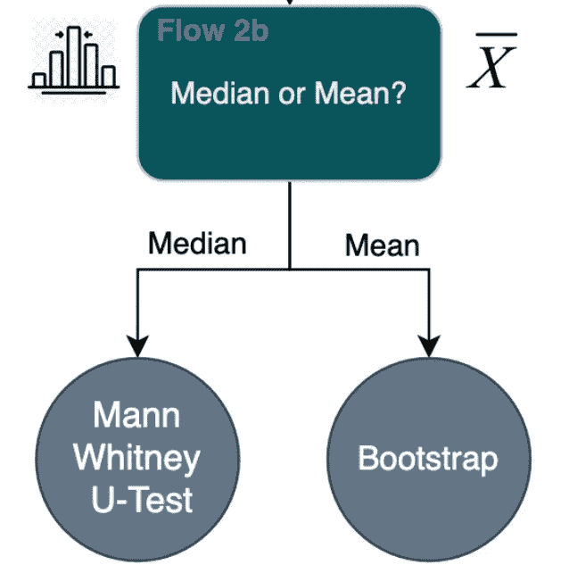

# 像专家一样进行 A/B 测试：掌握统计测试选择的艺术

> 原文：[`towardsdatascience.com/a-b-testing-like-a-pro-master-the-art-of-statistical-test-selection-603eb5803586?source=collection_archive---------7-----------------------#2023-12-29`](https://towardsdatascience.com/a-b-testing-like-a-pro-master-the-art-of-statistical-test-selection-603eb5803586?source=collection_archive---------7-----------------------#2023-12-29)

## 现实世界中的数据可能很棘手！使用 Python 选择和应用正确统计测试的指南

[](https://medium.com/@thauridattadeen?source=post_page-----603eb5803586--------------------------------)[](https://towardsdatascience.com/?source=post_page-----603eb5803586--------------------------------) [Thauri Dattadeen](https://medium.com/@thauridattadeen?source=post_page-----603eb5803586--------------------------------)

·

[Follow](https://medium.com/m/signin?actionUrl=https%3A%2F%2Fmedium.com%2F_%2Fsubscribe%2Fuser%2Fd1a324fa1cfc&operation=register&redirect=https%3A%2F%2Ftowardsdatascience.com%2Fa-b-testing-like-a-pro-master-the-art-of-statistical-test-selection-603eb5803586&user=Thauri+Dattadeen&userId=d1a324fa1cfc&source=post_page-d1a324fa1cfc----603eb5803586---------------------post_header-----------) 发布于 [Towards Data Science](https://towardsdatascience.com/?source=post_page-----603eb5803586--------------------------------) ·15 min read·2023 年 12 月 29 日[](https://medium.com/m/signin?actionUrl=https%3A%2F%2Fmedium.com%2F_%2Fvote%2Ftowards-data-science%2F603eb5803586&operation=register&redirect=https%3A%2F%2Ftowardsdatascience.com%2Fa-b-testing-like-a-pro-master-the-art-of-statistical-test-selection-603eb5803586&user=Thauri+Dattadeen&userId=d1a324fa1cfc&source=-----603eb5803586---------------------clap_footer-----------)

--

[](https://medium.com/m/signin?actionUrl=https%3A%2F%2Fmedium.com%2F_%2Fbookmark%2Fp%2F603eb5803586&operation=register&redirect=https%3A%2F%2Ftowardsdatascience.com%2Fa-b-testing-like-a-pro-master-the-art-of-statistical-test-selection-603eb5803586&source=-----603eb5803586---------------------bookmark_footer-----------)

A/B 测试是强大的工具，但选择错误的统计测试可能导致误导性结果。本指南将帮助你为数据选择完美的测试，以确保可靠的分析并做出自信的推荐。


[Jason Dent](https://unsplash.com/@jdent?utm_source=medium&utm_medium=referral) 拍摄的照片，刊登于 [Unsplash](https://unsplash.com/?utm_source=medium&utm_medium=referral)

刚刚完成了你的 A/B 测试？激动人心的时刻还未结束！真正的魔力在于深入数据，发掘有价值的见解。本指南为你，数据分析师或数据科学家，提供了一种系统的方法来分析你的 A/B 测试结果。

分析的一个重要部分涉及理解数据以及选择正确测试的复杂统计基础。这一步骤通常被忽视，因为 **跳过实施直接开始分析的诱惑，可能会错过关键的见解。**

根据你正在分析的内容，需要做出不同的一组假设，因此选择的测试也不同。本文将指导你如何为你的数据选择‘正确’的测试。

# 指南

直接进入正题。这张表集中于典型移动应用程序的指标，这些指标是 A/B 测试的典型目标，尽管这些原则和假设适用于所有情况。


指标概述及推荐的图表（作者提供）

跳到下面必要的部分，我将描述每种指标类型，如何决定最佳测试，并使用 Python 进行计算！

> **第一部分：每用户平均指标**
> 
> **第二部分：分类指标**
> 
> **第三部分：联合指标**

# **在开始之前，基本定义：**

## **零假设：**

每个假设检验由一个“理论”组成，这被称为 ***零假设 (H₀)***。我们分析的目标是尝试自信地证明这个假设是否正确。

> 零假设 (H₀) 假定两个组之间没有差异，即该特征没有影响。
> 
> **例如** H₀**:** μ1 = μ2
> 
> HA**:** μ1 ≠ μ2

## **显著性水平 (Alpha):**

显著性水平，或 alpha **(α)**，是用于决定测试结果是否具有统计学显著性的一个指标。这是运行测试之前做出的基本假设的一部分。

简而言之，显著性水平帮助你确定你的发现是否可靠，而不仅仅是偶然事件。它充当了一个阈值，用于说“嘿，这可能是真的，而不仅仅是巧合。”

## P 值：

p 值或概率值，是一种用于统计学中帮助确定对零假设的证据强度的度量。

简而言之，p 值与获得假阳性结果的概率有关，即我们得到的数据由于偶然性而发生，我们犯了第一类错误的概率。

如果 p 值很高，我们不能相信数据，因为假阳性结果的可能性很高。如果数据不可靠（即 p 值很高），我们不能自信地证明或否定 H₀。

> **P 值 < 显著性水平 →** **拒绝 H₀。** 我们有足够的数据来得出两个组之间存在显著差异的结论。
> 
> **P 值 >显著性水平 →** **不拒绝 H₀。** 我们没有足够的数据得出两个组有显著差异的结论

## 选择要分析的指标

在开始之前，理解你从 A/B 测试中想要分析的内容是很重要的。

例如，如果你在重新设计首次用户体验（FTUE），你可能会关注用户保留或转化等指标。这些通常涉及是/否（1 或 0）的结果，使得“两个比例 Z 检验”成为一个不错的选择。

我们将探索上面指南中提到的不同类型的指标，解释为什么选择它们以及如何确保你的数据符合测试要求。

## 设置数据

我假设你已经拥有数据，并且数据格式为包含 3 列的表格：唯一 ID、变体、指标。

```py
#Separate the data into 2
group_A = df[df['Variant'] == "A"]["Metric"]
group_B = df[df['Variant'] == "B"]["Metric"]
#Change "A" and "B" to the relevant groups in your dataset
#Change "Metric" to the relevant column name with the values
```

# 第一部分：每用户平均指标

这是最常见的指标分析类型，涉及数据的独立样本。

在大多数实际情况下，每用户平均指标，如每用户平均收入或每用户平均花费时间，都是非常常见的分析对象。如果样本量足够大，你可以直接跳过这一步，选择 Welch 的 t 检验。


选择适合每个用户指标的测试流程图（作者提供）

**我将逐一讲解每个流程，并描述决定使用哪条路径的步骤 -**

# ***流程 1：大样本或正态分布：***


上述流程图中的流程 1（作者提供）

我对“大样本”的一般假设通常是个体样本数量大于 10,000，尽管这个定义是相对的，可能会因具体研究领域、进行的分析类型和需要检测的效应大小而有所不同。

如果 n 相对较小，则执行正态性检验以确定是否选择 T 检验。有几种方法可以检验正态性。最简单的方法是通过创建直方图并目视检查数据。如果数据大致呈现正态分布，则继续。如果仍不确定，最好进行更具统计性的检验，例如 Shapiro-Wilkes 正态性检验。这里有一篇关于各种正态性检验方法的好文章。请记住，每种统计检验通常对数据有不同的假设，因此在选择正态性检验之前请牢记这一点。

请参见下面的代码片段，展示如何通过创建直方图进行视觉检查或使用名为 Shapiro-Wilkes 检验的统计检验来测试数据的正态性。

> **正态性检验**

```py
import pandas as pd
import matplotlib.pyplot as plt
import scipy.stats as stats

alpha=0.05 #We assume an alpha here of 0.05

# Creating Histograms
grouped = df.groupby('Variant') 
#Variant column identifies the group of the user - group_A / group_B etc

# Plotting histograms for each group to visually inspect the shape of the data
for name, group in grouped:
    plt.hist(group['Metric'])
    plt.title(name)
    plt.show()

# Shapiro-Wilkes Test to statistically test for normality
for name, group in grouped:
    shapiro_test = stats.shapiro(group['Value'])
    print(f"Shapiro-Wilk Test for Group {name}: W = {shapiro_test[0]}, p-value = {shapiro_test[1]}")

if p_value < alpha:
    print("Reject the null hypothesis. There is a significant difference between the groups.")
else:
    print("Fail to reject the null hypothesis. There is no significant difference between the groups.")
```

# 流程 2a：方差是否相等？


上述流程图中的流程 2a（作者提供）

## 接着上面“每用户平均”流程图 —

如果你已经确认数据符合正态分布，那么下一步是检查数据集是否具有相等的方差。这将决定你应该使用 Welch 的 t 检验还是 Student 的 t 检验。

Welch 的 t 检验和 Student 的 t 检验之间的主要区别在于自由度和样本方差估计。Student 的检验假设两个样本具有相同的方差，而 Welch 的检验则不要求。

在比较大样本量（n > 10,000）时使用 Welch 的 t 检验或 Student 的 t 检验进行假设检验时，两者之间的显著性水平差异通常可以忽略不计。这是因为在处理大样本量时，Student 的 t 检验对方差相等假设的依赖对检验准确性的影响非常小。

即使方差相等的假设被违反，Student 的 t 检验仍然相对稳健，这意味着它能产生准确的 p 值，并保持所需的 I 型错误率（拒绝真实零假设的概率）。这种稳健性源于中心极限定理，该定理指出，随着样本量的增加，样本均值的分布趋近于正态分布，而不管基础总体分布如何。

相比之下，Welch 的 t 检验专门设计用于处理不等方差的情况，使其在方差相等的假设存在疑问时更为合适。然而，对于大样本量而言，Welch 的 t 检验与 Student 的 t 检验之间的显著性水平差异通常很小。

如果你担心存在不等方差的可能性，Welch 的 t 检验是一个更安全的选择。然而，如果你想最大化效能，并且对样本量足够大的信心很足，那么可以使用 Student 的 t 检验。

参见下面的代码片段，展示如何使用 Bartlett 检验来测试数据的方差是否相等。Bartlett 检验是一种非常稳健的检验，但它要求数据符合正态分布。如果你更倾向于使用一个不那么稳健的检验，那么[Levene 检验](https://medium.com/@kyawsawhtoon/levenes-test-the-assessment-for-equality-of-variances-94503b695a57)可能更为合适。

> **方差相等性检验**

```py
from scipy.stats import bartlett, levene

# Perform Bartlett's test for equal variances (works best on data that conforms to normality)
statistic, p_value = bartlett(group_A, group_B)

# Perform Levene's test for equal variances (less sensitive to Normality assumption)
statistic, p_value = levene(group_A, group_B)

# Display test results
print(f"Test statistic: {statistic}")
print(f"P-value: {p_value}")

if p_value < alpha:
    print("Reject the null hypothesis. There is a significant difference in variances between the groups.")
else:
    print("Fail to reject the null hypothesis. There is no significant difference in variances between the groups.")
```

# 流程 2b：中位数还是均值？



上述流程图中的流程 2b（作者提供）

## 继续以上的用户平均值流程图 —

如果你对数据集是否符合正态分布有合理的疑虑，那么可能需要使用另一种统计方法来分析数据集。下一步是决定数据的均值还是中位数更为有用。

在 A/B 测试中考虑中位数而不是均值在特定情况下可能有益，尤其是当数据可能受到异常值或极度偏斜的非正态分布影响时。

+   **结果沟通：** 使用中位数可以提供更清晰和直观的中心趋势解释，特别是在描述典型或每用户的行为时。这可能对利益相关者或非技术观众更具关联性。

+   **偏态分布：** 如果你的数据高度偏斜或不遵循正态分布，均值可能无法准确代表典型值。在这种情况下，中位数提供了一个更稳健的中心趋势估计，因为它不容易受到极端值或分布形状的影响。

+   **离群值敏感性：** 均值对数据集中的离群值或极端值高度敏感。即使少量的离群值也能显著影响均值，使其无法代表中心趋势。相比之下，中位数不容易受到极端值的影响，因为它代表了按升序排列的数据集中的中间值。

这两种测量方法各有优点，选择其中一种应该与数据的性质、离群值的影响以及你希望从 A/B 测试中得出的具体见解相一致。在得出结论时，你应该考虑均值和中位数。

[这是关于曼-惠特尼 U 检验的非常有用的指南](https://medium.com/@rjacome21/statistical-analysis-with-significance-exploring-the-mann-whitney-u-test-e07752822b4a)。一如既往，在开始之前最好先做一些研究，彻底理解每个检验方法！

# 统计检验

如果你遵循了上面的**每用户平均值**流程图，你现在应该已经决定了什么是确定两组指标是否具有统计显著性差异的最佳检验方法。请参见下面如何进行这些检验。

请参考上述指南和每用户平均值流程图。

> **学生 t 检验**

```py
import scipy.stats

# Student's t-test - This test requires Normality and Equal Variances
t_statistic, p_value = stats.ttest_ind(group_A, group_B)
print(f"Student's t-test: t = {t_statistic}, p-value = {p_value}")

if p_value < alpha:
    print("Reject the null hypothesis. There is a significant difference between the groups.")
else:
    print("Fail to reject the null hypothesis. There is no significant difference between the groups.")
```

> **Welch 检验**

```py
import scipy.stats

# Welch's t-test - This test requires Normality
t_statistic, p_value = stats.ttest_ind(group_A, group_B, equal_var=False)
print(f"Welch's t-test: t = {t_statistic}, p-value = {p_value}")

if p_value < alpha:
    print("Reject the null hypothesis. There is a significant difference between the groups.")
else:
    print("Fail to reject the null hypothesis. There is no significant difference between the groups.")
```

> **曼-惠特尼 U 检验**

```py
# Mann-Whitney U-test - No statistical assumptions, Median preferred over Mean
u_statistic, p_value = stats.mannwhitneyu(group_A, group_B)
print(f"Mann-Whitney U-test: U = {u_statistic}, p-value = {p_value}")

if p_value < alpha:
    print("Reject the null hypothesis. There is a significant difference between the groups.")
else:
    print("Fail to reject the null hypothesis. There is no significant difference between the groups.")
```

> **自助法**

```py
#Bootstrapping - forNon-Normal data/Small sample sizes, and Mean is preferred

# Calculate observed difference in means
observed_diff = np.mean(group_B) - np.mean(group_A)

# Combined data
combined_data = np.concatenate((group_A, group_B))

# Number of bootstrap samples
num_samples = 10000  # You can adjust this number based on computational resources

# Bootstrap resampling
bootstrap_diffs = []
for _ in range(num_samples):
    # Resample with replacement
    bootstrap_sample = np.random.choice(combined_data, size=len(combined_data), replace=True)

    # Calculate difference in means for each bootstrap sample
    bootstrap_mean_A = np.mean(bootstrap_sample[len(group_A):])
    bootstrap_mean_B = np.mean(bootstrap_sample[:len(group_A)])
    bootstrap_diff = bootstrap_mean_B - bootstrap_mean_A

    bootstrap_diffs.append(bootstrap_diff)

# Calculate p-value (significance level)
p_value = np.mean(np.abs(bootstrap_diffs) >= np.abs(observed_diff))

print(f"P-value: {p_value}")

if p_value < alpha:
    print("Reject the null hypothesis. There is a significant difference between the groups.")
else:
    print("Fail to reject the null hypothesis. There is no significant difference between the groups.")
```

# 第二部分：分类变量


选择适合的分类数据检验的流程图（作者提供）

在这一部分，我们将探讨分类指标。这些指标可以是离散的，例如点击/未点击，或者在多变量检验的情况下是连续的。

遵循上面的流程图选择最适合你数据的检验方法。

# 2 组

## 两比例 Z 检验**（二元指标）**

这些指标包括留存、转化、点击等。

二项变量的两样本 z 检验用于比较两个组之间的二元结果比例。从统计角度来看，随着 N 的增大，二项分布趋向于正态分布。这一假设通常适用，因此使用 z 检验是合理的。

**H0：** μ1 — μ2 = 0

**HA：** μ1 — μ2 ≠ 0

> 两比例 Z 检验

```py
from statsmodels.stats.weightstats import ztest

# Calculate the z-statistic and p-value. This assumes binomially distributed and i.i.d. variables.
z_stat, p_value = ztest(group_A, group_B)

print(f"Two Sample z-test: t = {z_stat}, p-value = {p_value}")

if p_value < alpha:
    print("Reject the null hypothesis. There is a significant difference between the groups.")
else:
    print("Fail to reject the null hypothesis. There is no significant difference between the groups.")
```

# 3 组及以上

# 离散变量

**皮尔逊卡方检验**

卡方检验是另一个强大的工具，特别是在 A/B 测试中有多个组（除了对照组）时，尤其有效。

它允许你同时比较多个变体，而无需假设任何分布特性。该方法也适用于类似的二元变量，但使用多个组而不是仅有的 2 个。由于这些组可能会将样本量分割成更小的组，因此必须确保每个组的样本量保持相对较大。

皮尔逊卡方检验用于确定在多个组中观察到的分类数据频率与期望频率之间是否存在显著关联或差异。因此，零假设假定组间没有差异。

由于数据是离散的，我们创建一个列联表来汇总每个变体的计数。然后由 stats.chi2_contingency 函数进行解释。

> **皮尔逊卡方检验**

```py
# Create a contingency table
contingency_table = pd.crosstab(df['Variant'], df["metric"])

# Perform the chi-squared test
chi2, p_value, dof, expected = stats.chi2_contingency(contingency_table)

if p_value < alpha:
    print("There is a statistically significant difference in the distribution of the metric across groups.")
else:
    print("There is no statistically significant difference in the distribution of the metric across groups.")
```

# 连续变量

**ANOVA 检验**

ANOVA 是一种用于比较三个或更多组均值的统计检验。它评估组均值之间观察到的差异是否可能是偶然的，还是实际上代表了它们底层总体中的显著差异。它在发布多个不同变体时很有用，可以将结果相互比较，以节省时间，而不是部署单独的 A/B 测试。

ANOVA 对正态性和方差齐性假设的违反相对鲁棒，特别是当样本量相对较大时。

> **ANOVA 检验**

```py
# Group the counts for the various groups in the data
grouped_data = [df[df['Variant'] == cat]['Metric'] for cat in df['Variant'].unique()]

# Perform ANOVA test
f_statistic, p_value = stats.f_oneway(*grouped_data)

if p_value < alpha:
    print("There is a statistically significant difference in the means of the metric across groups.")
else:
    print("There is no statistically significant difference in the means of the metric across groups.")
```

该检验确定组是否具有统计显著性。我们在这里遇到的一个问题是尝试识别出一个显著优于其他组的特定组。虽然总体 ANOVA 检验突出了普遍的偏差，但需要更深入的调查来识别展示统计差异的特定组。

幸运的是，有一个简洁的函数使用了 Tukey 的范围检验，提供了一种结构化的方法。它生成了一个全面的成对比较表，揭示了各组之间的统计显著差异。

然而，由于 Tukey 的范围检验可能违反了基本假设，必须谨慎使用。该检验应主要用于识别不同组，仅作为组间比较的辅助工具。[这个视频非常有用，展示了如何执行和使用](https://www.youtube.com/watch?v=qOw9jHYw89Y)。

参见下面的代码片段，应作为上述 ANOVA 检验的辅助工具，用于识别优于其他组的特定组。

> **Tukey 的 HSD 检验**

```py
import statsmodels.api as sm
from statsmodels.stats.multicomp import pairwise_tukeyhsd

# Perform Tukey's HSD test for post-hoc analysis
tukey = pairwise_tukeyhsd(df["metric"], df['Variant'])

# Print pairwise comparison results
print(tukey.summary())
```

# 第三部分：联合指标

根据上述指南，如果你确定你的指标实际上是两个或更多变量的联合指标，那么你可能需要采取额外步骤来有效确定各组之间的统计差异。这是因为上述其他检验假设你测试的指标彼此独立。

# Delta t 检验

Delta t 检验是一种统计方法，用于评估两个独立组之间均值的差异，同时考虑形成联合分布的两个随机变量的比率。在 A/B 测试领域，常常会遇到度量本身可能不独立的情况。


联合分布示例（作者提供）

一个例子是广告点击率（Ad Click-Through-Rate）。一个人可能会多次查看同一个广告，但只点击一次。

使用标准 t 检验的问题在于，我们分析的是两个独立的随机变量，它们的比率形成了一个联合分布。虽然对象本身是独立的，但它们的联合比率却不是。这违反了学生 t 检验和 Welch t 检验的独立性假设。

相反，我们使用 Delta 方法来估计方差；


方差估计公式（见下文参考）

参见下面的代码片段，展示了如何计算这个新的方差公式，并使用这个新方差创建 t 检验函数。

> Delta t 检验

```py
# create the new Variance function as described above
def var_ratio(metric1,metric2): 
     mean_x = np.mean(metric1)
     mean_y = np.mean(metric2)
     var_x = np.var(metric1,ddof=1)
     var_y = np.var(metric2,ddof=1)
     cov_xy = np.cov(metric1,metric2,ddof=1)[0][1]
     result = (mean_x**2 / mean_y**2) * (var_x/mean_x**2 - 2*cov_xy/(mean_x*mean_y) + var_y/mean_y**2)
     return result

 # create this new ttest function, using the new Variances above. This is a standard t-test function.
def delta_ttest(mean_c,mean_t,var_c,var_t, alpha = 0.05):
     mean_diff = mean_t - mean_c
     var = var_c + var_t
     std_e = stats.norm.ppf(1 - alpha/2) * np.sqrt(var)
     lower_ci = mean_diff - std_e 
     upper_ci = mean_diff + std_e
     z = mean_diff/np.sqrt(var)
     p_val = stats.norm.sf(abs(z))*2
     return z, p_val, upper_ci, lower_ci

#Eg. Here we calculate the significance of the CTR for a control and treatment group. 
var_c = var_ratio(control['click'],control['view']) #Calculates the delta variance for the control group
var_t = var_ratio(treatment['click'],treatment['view']) #Calculates the delta variance for the treatment group
mean_c = control['click'].sum()/control['view'].sum()
mean_t= treatment['click'].sum()/treatment['view'].sum()
z, p_value, upper_ci, lower_ci = delta_ttest(mean_c,mean_t,var_c,var_t,alpha) #Applies the ttestusing these new delta variances

if p_value < alpha:
    print("Reject the null hypothesis. There is a significant difference between the groups.")
else:
    print("Fail to reject the null hypothesis. There is no significant difference between the groups.")
```

# **结论：**

总结来说，虽然 A/B 测试对于实验和优化至关重要，但选择正确的统计检验方法至关重要。为了获得稳健和可靠的结果，数据科学家应仔细考虑特征和检验假设。

记住，A/B 测试是强大的工具，但选择错误的统计检验方法可能会导致误导性的结果！

**参考文献**：

1\. Sivasai Yadav Mudugandla 的正态性检验

[2\. Kyaw Saw Htoon 的 Levene 检验](https://medium.com/@kyawsawhtoon/levenes-test-the-assessment-for-equality-of-variances-94503b695a57)

[3\. Ricardo Lara Jácome 的 Mann Whitney U 检验](https://medium.com/@rjacome21/statistical-analysis-with-significance-exploring-the-mann-whitney-u-test-e07752822b4a)

4\. Delta 方法：[`arxiv.org/pdf/1803.06336.pdf`](https://arxiv.org/pdf/1803.06336.pdf)

[5\. Ahmad Nur Aziz 的 Delta T 检验](https://medium.com/@ahmadnuraziz3/applying-delta-method-for-a-b-tests-analysis-8b1d13411c22)
