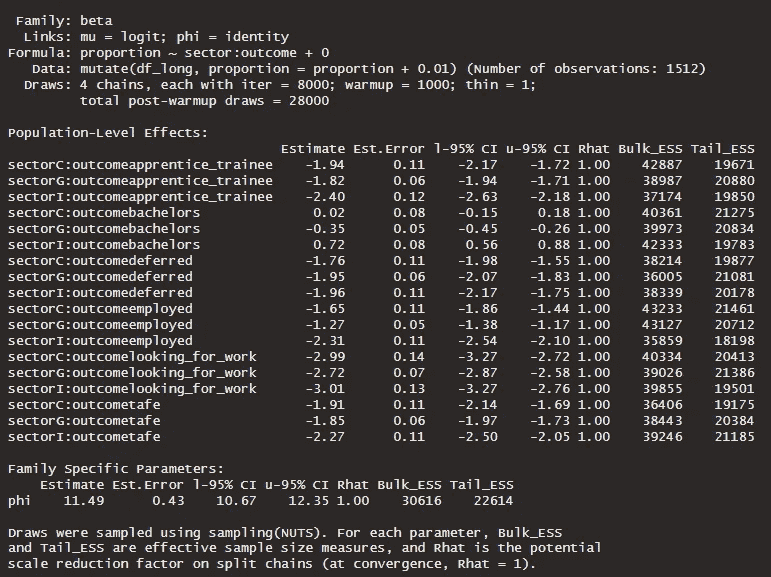

# 使用 R 和 brms 对学校毕业生结果进行贝叶斯比较

> 原文：[`towardsdatascience.com/a-bayesian-comparison-of-school-leaver-outcomes-with-r-and-brms-4da9ae5f9895`](https://towardsdatascience.com/a-bayesian-comparison-of-school-leaver-outcomes-with-r-and-brms-4da9ae5f9895)

## ANOVA — 贝叶斯风格

[](https://mmgillin.medium.com/?source=post_page-----4da9ae5f9895--------------------------------)[](https://towardsdatascience.com/?source=post_page-----4da9ae5f9895--------------------------------) [Murray Gillin](https://mmgillin.medium.com/?source=post_page-----4da9ae5f9895--------------------------------)

·发表于 [Towards Data Science](https://towardsdatascience.com/?source=post_page-----4da9ae5f9895--------------------------------) ·9 分钟阅读·2023 年 9 月 2 日

--

我们在离开学校时常常会思考我们想做什么。作为小孩子时，我们被问及长大后想做什么，然后在 13 年的前高等教育中度过。在公共政策中，政府、天主教和独立学校系统之间的差异被广泛讨论，特别是在非政府学校的公共资助方面，以及如何分配资源。

给定学校部门，学生结果之间是否存在实际差异？

在澳大利亚维多利亚州，州政府每年进行一次调查，以评估高中毕业后的结果 ([On Track Survey](https://www.vic.gov.au/on-track-survey))。该 [数据集](https://www.education.vic.gov.au/Documents/about/research/OnTrack2022/DestinationData2022.xlsx) （在 [CC BY 4.0](https://discover.data.vic.gov.au/dataset/2021-on-track-survey-year-12-or-equivalent-completers-post-school-destinations) 下提供）覆盖了多个年份，我们将只查看本文编写时最新的 2021 年数据。

本文将应用贝叶斯分析方法，使用 R 包 brms 来回答这些问题。


图片由 [Good Free Photos](https://unsplash.com/@goodfreephoto_com?utm_source=medium&utm_medium=referral) 提供，来源于 [Unsplash](https://unsplash.com/?utm_source=medium&utm_medium=referral)

## 加载库和数据集

以下是我们加载所需包的数据集，该数据集以宽格式报告呈现，包含许多合并单元格。R 不喜欢这种格式，因此我们需要做一些硬编码来重新标记向量，并创建一个整洁的数据框。

```py
library(tidyverse) #Tidyverse meta package
library(brms) #Bayesian Modelling Package
library(tidybayes) #Tidy Helper Functions and Visualisation Geoms for Bayesian Models
library(readxl)
df <- read_excel("DestinationData2022.xlsx", 
    sheet = "SCHOOL PUBLICATION TABLE 2022", 
    skip = 3)
colnames(df) <- c('vcaa_code', 
                  'school_name', 
                  'sector', 
                  'locality', 
                  'total_completed_year12', 
                  'on_track_consenters', 
                  'respondants', 
                  'bachelors', 
                  'deferred', 
                  'tafe', 
                  'apprentice_trainee', 
                  'employed', 
                  'looking_for_work', 
                  'other') 

df <- drop_na(df)
```

下面是我们数据集的一个示例。


初始数据框的示例（作者提供的图片）

数据集有 14 个字段。

+   VCAA 代码 — 每个代码的行政 ID

+   学校名称

+   部门 — G = 政府，C = 天主教，I = 独立

+   地域或郊区

+   完成年级 12 的总学生数

+   跟踪同意者

+   受访者

+   其他列表示每个结果的受访者百分比

对于我们的横截面研究，我们对按部门划分的结果比例感兴趣，因此我们需要将这个宽格式数据框转换为长格式。

```py
df_long <- df |> 
  mutate(across(5:14, ~ as.numeric(.x)), #convert all numeric fields captured as characters
         across(8:14, ~ .x/100 * respondants), #calculate counts from proportions
         across(8:14, ~ round(.x, 0)), #round to whole integers
         respondants = bachelors + deferred + tafe + apprentice_trainee + employed + looking_for_work + other) |> #recalculate total respondents |> 
  filter(sector != 'A') |>  #Low volume 
  select(sector, school_name, 7:14) |> 
  pivot_longer(c(-1, -2, -3), names_to = 'outcome', values_to = 'proportion') |> 
  mutate(proportion = proportion/respondants)
```


具有兴趣特征的长格式数据框（作者提供的图片）

## 探索性数据分析

让我们简要地可视化并总结一下我们的数据集。政府部门有 157 所，独立学校有 57 所，天主教学校有 50 所。

```py
df |> 
  mutate(sector = fct_infreq(sector)) |> 
  ggplot(aes(sector)) +
    geom_bar(aes(fill = sector)) + 
    geom_label(aes(label = after_stat(count)), stat = 'count', vjust = 1.5) +
    labs(x = 'Sector', y = 'Count', title = 'Count of Schools by Sector', fill = 'Sector') +
    scale_fill_viridis_d(begin = 0.2, end = 0.8) +
    theme_ggdist()
```


按部门分类的学校数量（作者提供的图片）

```py
df_long |> 
  ggplot(aes(sector, proportion, fill = outcome)) +
    geom_boxplot(alpha = 0.8) +
    geom_point(position = position_dodge(width=0.75), alpha = 0.1, color = 'grey',  aes(group = outcome)) +
    labs(x = 'Sector', y = 'Proportion', fill = 'Outcome', title = 'Boxplot of Respondant Proportions by Sector and Outcome') +
    scale_fill_viridis_d(begin = 0.2, end = 0.8) +
    theme_ggdist()
```


按部门和结果分布的比例（作者提供的图片）

分布情况讲述了一个有趣的故事。学士结果在所有部门中变异性最大，独立学校的学生选择攻读本科教育的中位比例最高。值得注意的是，政府学校在高中毕业后就业的学生比例中位数最高。所有其他结果的变化不大 — 我们会很快重新审视这一点。

## 统计建模 — Beta 似然回归

我们关注的是按学校划分的学生比例及其高中毕业后的结果。在这些情况下，beta 似然是我们最好的选择。brms 是由[Buerkner](https://github.com/paul-buerkner/brms)开发的一个出色的包，用于构建贝叶斯模型。我们的目标是对按结果和部门划分的比例进行建模。

Beta 回归模型有两个参数，μ 和 φ。μ 代表平均比例，φ 是精度（或方差）的度量。

我们的第一个模型如下所示，请注意我们已经开始考虑部门和结果之间的交互，因为这是我们希望模型回答的问题，因此这是一个 ANOVA 模型。

我们要求模型为每个部门和结果的组合创建单独的 Beta 项，并使用一个汇总的 φ 项，或使用相同方差的不同比例均值。我们期望这些比例中的 50% 位于 logit 规模上的（-3, 1）之间或比例上的（0.01, 0.73）之间。这是足够宽泛但有信息的先验。全球 Phi 估计值是一个正数，因此我们使用一个足够宽泛的 gamma 分布。


模型 m3a 的数学形式 — 作者提供的图片

```py
# Modelling Proportion with Sector:Outcome Interaction term using Beta - Pooled Phi term

m3a <- brm(
  proportion ~ sector:outcome + 0, 
  family = Beta,
  data = df_long |> mutate(proportion = proportion + 0.01), # Beta regression can't take outcomes that are 0 so we fudge here by adding tiny increment
  prior = c(prior(normal(-1, 2), class = 'b'),
            prior(gamma(6, 1), class = 'phi')),
  iter = 8000, warmup = 1000, cores = 4, chains = 4, seed = 246, save_pars = save_pars(all = T),
  control = list(adapt_delta = 0.99, max_treedepth = 15)
) |> 
  add_criterion(c('waic', 'loo'), moment_match = T)

summary(m3a)
```



模型 m3a 的输出摘要 — 作者提供的图片

注意在模型设置中，我们对所有比例增加了 1% — 这是因为 Beta 回归无法处理零值。我们尝试使用零膨胀 Beta 来建模，但收敛所需时间更长。

同样地，我们可以在没有合并 phi 的情况下建模，这在考虑到我们在上述分布中观察到的情况时直观上是有意义的，因为每个部门和结果组合中存在变异。模型定义如下。

```py
m3b <- brm(
  bf(proportion ~ sector:outcome + 0,
     phi ~ sector:outcome + 0),
  family = Beta,
  data = df_long |> mutate(proportion = proportion + 0.01),
  prior = c(prior(normal(-1, 2), class = 'b')),
  iter = 8000, warmup = 1000, cores = 4, chains = 4, seed = 246, save_pars = save_pars(all = T),
  control = list(adapt_delta = 0.99)
) |> 
  add_criterion(c('waic', 'loo'), moment_match = T)

summary(m3b)
```


m3b 的输出总结 — 作者提供的图片

## 模型诊断与比较

手中有两个模型后，我们将比较它们在样本外的预测准确性，使用贝叶斯 LOO 估计的期望对数逐点预测密度 (`elpd_loo`)。

```py
comp <- loo_compare(m3a, m3b)

print(comp, simplify = F)
```


模型 m3a 和 m3b 的 LOO 比较 — 作者提供的图片

简而言之，预期的对数逐点留一值越高，对未见数据的预测准确性越大。这为我们提供了模型之间的*相对*准确性度量。我们可以进一步通过完成后验预测检查来验证这一点，即观察值和模拟值的比较。在我们的案例中，模型 m3b 更好地模拟了观察数据。

```py
alt_df <- df_long |> 
  select(sector, outcome, proportion) |> 
  rename(value = proportion) |> 
  mutate(y = 'y', 
         draw = 99) |> 
  select(sector, outcome, draw, value, y)

sim_df <- expand_grid(sector = c('C', 'I', 'G'),
            outcome = unique(df_long$outcome)) |> 
  add_predicted_draws(m3b, ndraws = 1200) |> 
  rename(value = .prediction) |> 
  ungroup() |> 
  mutate(y = 'y_rep',
         draw = rep(seq(from = 1, to = 50, length.out = 50), times = 504)) |> 
  select(sector, outcome, draw, value, y) |> 
  bind_rows(alt_df)

sim_df |> 
  ggplot(aes(value, group = draw)) +
    geom_density(aes(color = y)) +
    facet_grid(outcome ~ sector, scales = 'free_y') +
    scale_color_manual(name = '', 
                       values = c('y' = "darkblue",
                                  'y_rep' = "grey")) +
    theme_ggdist() +
    labs(y = 'Density', x = 'y', title = 'Distribution of Observed and Replicated Proportions by Sector and Outcome')
```


模型 m3a 的后验预测检查 — 作者提供的图片


模型 m3b 的后验预测检查 — 作者提供的图片

模型 m3b 的非合并方差或 phi 项能够更好地捕捉按部门和结果分布的变异。

## ANOVA — 贝叶斯风格

记住，我们的研究问题是关于了解部门间的结果差异及其程度。在频率统计学中，我们可能使用 ANOVA，即组间均值差异的方法。这种方法的弱点在于结果提供了一个估计值和置信区间，但没有关于这些估计的不确定性，并且提供了一个反直觉的 p 值来说明均值差异是否具有统计显著性。不，谢谢。

以下，我们生成每个部门和结果组合交互的期望值集合，然后使用优秀的 `tidybayes::compare_levels()` 函数进行繁重的计算。它计算了每个结果的部门间后验均值差异。为了简洁起见，我们排除了“其他”结果。

```py
new_df <- expand_grid(sector = c('I', 'G', 'C'), 
          outcome = c('apprentice_trainee', 'bachelors', 'deferred', 'employed', 'looking_for_work', 'tafe'))

epred_draws(m3b, newdata = new_df) |> 
  compare_levels(.epred, by = sector, comparison = rlang::exprs(C - G, I - G, C - I)) |> 
    mutate(sector = fct_inorder(sector),
         sector = fct_shift(sector, -1), 
         sector = fct_rev(sector))  |> 
  ggplot(aes(x = .epred, y = sector, fill = sector)) +
      stat_halfeye() +
      geom_vline(xintercept = 0, lty = 2) + 
      facet_wrap(~ outcome, scales = 'free_x') +
      theme_ggdist() +
      theme(legend.position = 'bottom') +
      scale_fill_viridis_d(begin = 0.4, end = 0.8) +
      labs(x = 'Proportional Difference', y = 'Sector', title = 'Differences in Posterior Means by Sector and Outcome', fill = 'Sector')
```


贝叶斯 ANOVA — 作者提供的图片

或者，我们可以用一个整洁的表格总结所有这些分布，以便更容易解释和一个 89% 的可信区间。

```py
marg_gt <- epred_draws(m3b, newdata = new_df) |> 
  compare_levels(.epred, by = sector, comparison = rlang::exprs(C - G, I - G, C - I)) |> 
  median_qi(.width = .89) |> 
  mutate(across(where(is.numeric), ~round(.x, 3))) |> 
  select(-c(.point, .interval, .width)) |> 
  arrange(outcome, sector) |> 
  rename(diff_in_means = .epred, 
         Q5.5 = .lower, 
         Q94.5 = .upper) |> 
  group_by(outcome) |> 
  gt() |> 
  tab_header(title = 'Sector Marginal Distributions by Outcome') |> 
  #tab_stubhead(label = 'Sector Comparison') |> 
  fmt_percent() |> 
  gtExtras::gt_theme_pff()
```


按部门和结果的后验均值差异总结表及 89% 可信区间 — 作者提供的图片

例如，如果我们要在正式报告中总结比较，我们可能会写以下内容。

> 政府学校的学生在完成 VCE 后开始本科学位的可能性低于天主教和独立学校的同学。
> 
> 平均而言，42.5%（介于 39.5%和 45.6%之间）的政府学校学生，53.2%（介于 47.7%和 58.4%之间）的天主教学校学生和 65%（介于 60.1%和 69.7%之间）的独立学校学生在完成 12 年级后开始接受本科教育。
> 
> 在 89%的后验概率下，天主教学校与政府学校学生本科入学的差异在 5.6%到 15.7%之间，平均值为 10.7%。此外，独立学校与政府学校学生本科入学的差异在 17.8%到 27%之间，平均值为 22.5%。
> 
> 这些差异是显著的，差异不为零的概率为 100%。

## 总结与结论

在本文中，我们展示了如何使用贝塔似然函数和贝叶斯建模来建模比例数据，然后执行贝叶斯方差分析（ANOVA）以探索不同部门之间比例结果的差异。

我们没有试图创建这些差异的因果理解。可以想象，有几个因素影响个体学生的表现，包括社会经济背景、父母的教育水平，以及学校层面的影响、资源等。这是一个极其复杂的公共政策领域，常常被零和博弈的 rhetoric 所困扰。

就个人而言，我是我大家庭中第一个接受并完成高等教育的人。我上了一所中等水平的公立高中，并取得了相当不错的成绩，顺利进入了我首选的学校。我的父母鼓励我继续接受教育，他们在 16 岁时选择了辍学。虽然本文提供了政府学校和非政府学校之间差异的证据，但它本质上只是描述性的。
