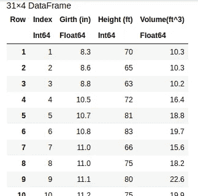
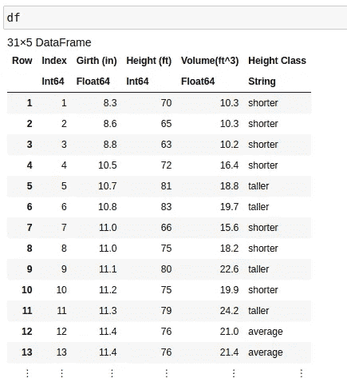

# 面向初学者的应用科学介绍

> 原文：[`towardsdatascience.com/a-beginner-friendly-introduction-to-applied-science-dd60741a9b17`](https://towardsdatascience.com/a-beginner-friendly-introduction-to-applied-science-dd60741a9b17)

## 学习特征和统计分析的基础知识

[](https://emmaccode.medium.com/?source=post_page-----dd60741a9b17--------------------------------)[](https://towardsdatascience.com/?source=post_page-----dd60741a9b17--------------------------------) [Emma Boudreau](https://emmaccode.medium.com/?source=post_page-----dd60741a9b17--------------------------------)

·发表于 [Towards Data Science](https://towardsdatascience.com/?source=post_page-----dd60741a9b17--------------------------------) ·阅读时间 12 分钟·2023 年 6 月 6 日

--


照片由 [Edge2Edge Media](https://unsplash.com/@edge2edgemedia?utm_source=medium&utm_medium=referral) 提供，来源于 [Unsplash](https://unsplash.com/?utm_source=medium&utm_medium=referral)

## 介绍

经验主义可能是形成对任何事物的现实世界理解最重要的方面。虽然轶事观察可能对更基础的事物有很大帮助，但我们实际希望被证明并接受为事实的事物必须通过经验主义来处理。这种经验主义的支柱当然是数据。数据非常重要，因为它为我们提供了对周围世界的洞察。然而，数据的一个大缺陷是，数据必须被解释，而这种解释确实需要一定程度的专业知识——这意味着可能有很多人无法根据数据得出一些经验性结论。将这些人和能够做出经验性结论的人区分开的当然是统计学专业知识。

统计学让我们能够分解数据中的不同内容，并对这些数据的不同方面做出观察。统计学应用于数据可以非常强大，常常推动全球范围内每天做出的最重要的决策。考虑到这一点，很容易理解为什么这样的技能可能是令人向往的、重要的，甚至可能是令人难以承受的。幸运的是，数学就是数学——数字就是数字——事情可能会变得混乱，但总有解释。当涉及到统计学时，一些相对基础的知识实际上可以走很远。所有这些对于许多现代学科都非常重要；从数据科学到分析和营销，简单的统计学通常是一个突出的练习，因此了解这些领域的统计学也可以非常有价值。

> [notebook](https://github.com/emmettgb/Emmetts-DS-NoteBooks/blob/master/Julia/Basic%20Applied%20Science.ipynb)

# 特征

在我们真正理解统计学、数据科学、机器学习或类似的领域之前，我们首先需要理解数据。数据由特征和它们的后续观察组成，这些构成了一个**总体**。总体通常指的是“我们所有的干净数据”，与**样本**相对，后者可能暗示我们在假设检验或类似背景下使用一些数据。这可能听起来有些混乱，但很简单记住：**你的总体是你所有的数据，而样本是你的一部分数据**。特征只是这些数据的一列，观察则是一行。例如，一个人的特征是头发颜色，而观察是金发。我们的特征是数据结构和测量内容的轮廓，而观察是对应于该轮廓的实际数据。

特征主要有三种类型：

+   标签

+   类别

+   连续

## 标签

标签是所有特征中使用最少的一种，但经常可以用来区分不同的观察值。这些标签可以在机器学习或统计学背景下使用，但很少被使用。一个在统计学背景下作为特征使用的例子是，如果我们想测试某个年份是否具有统计学意义。例如，如果我们想测试 2021 年的人是否比 2001 年的人高，我们将从两个年份中各取样本，并测试统计学意义。在机器学习背景下，确实有一些实例中日期或名字可能被用来预测某些特征，我也见过这种情况。我曾经有过的一个实际例子是训练机器学习算法来预测不同物品在不同日期的市场价值。

## 类别

类别数据与标签数据很相似。虽然标签数据并没有提供太多关于观察值的信息，但类别数据往往确实代表了实际的测量。在某些方面，类别数据只是连续空间的一部分标签——这一点在深入了解类别数据时会更加明了……但为了理解我的意思，我需要引用一个例子。

我们可以认为，体重超过 300 磅的人被认为非常超重，体重在 200–300 磅之间的人相当超重，100–200 磅通常为平均水平，而低于 100 磅在特定人群中则为偏瘦。这些都是放在连续空间上的类别标签，但在许多方面可以提供更多关于数据的信息，同时简化了这一特征——使其更易于解释和简化。如果我们的统计只需要知道一个人是否超重，那么我们可能不需要知道确切的体重。这有助于缓解一定程度的偏差，防止模型拟合问题，并且有助于隐藏个人信息。

## 连续

连续特征是最具代表性的特征类型。这些特征可以是评级、仪器测量、温度等任何数值型数据。每一个连续特征似乎都形成了其自身的数值空间。随之而来的是均值、标准差，以及我们传统上用于统计分析的所有其他数据。对分类数据也可以做同样的处理，但在某些情况下，这些特征必须转化为统计学和计算机能够理解的语言——即数字。更常见的是，我们使用分类特征来区分样本中的不同观察。

在许多情况下，你将很可能需要对特征进行一些处理。这通常取决于你所处理的特征类型，这可能会非常棘手。如果你想了解如何处理这些不同类型的特征，这里有一些我写的相关文章：

[](/features-101-an-introduction-to-analyzing-feature-sets-92e19d09ebd2?source=post_page-----dd60741a9b17--------------------------------) ## 特征基础：特征集分析入门

### 一个关于如何更好地处理和理解特征的小指南

towardsdatascience.com [](https://chifi.dev/categorical-data-vs-continuous-data-everything-you-need-to-know-36c2a0dbf6c?source=post_page-----dd60741a9b17--------------------------------) [## 分类数据与连续数据：你需要了解的一切

### 对两种最常见的特征类型的概述，以及一些重要的注意事项。

chifi.dev](https://chifi.dev/categorical-data-vs-continuous-data-everything-you-need-to-know-36c2a0dbf6c?source=post_page-----dd60741a9b17--------------------------------) [](/encoders-how-to-write-them-how-to-use-them-d8dd70f45e39?source=post_page-----dd60741a9b17--------------------------------) ## 编码器——如何编写，如何使用

### 通过这篇“从零开始”的指南，发现编码器在机器学习中的多种用途！

towardsdatascience.com

# 分析

现在我们对数据和可能遇到的不同特征有了基本了解，我们可以开始分析数据。为了使这一过程尽可能易于理解，我将使用一些数据来演示这些不同的概念。我将使用的数据是由佛罗里达州立大学分发的 `trees.csv` 数据，您可以在 [这里](https://people.sc.fsu.edu/~jburkardt/data/csv/csv.html) 找到（GNU LGPL 许可证）。我将使用 Julia 编程语言，但这个过程在大多数不同的解决方案中通常是相同的，方法调用或技术可能会有所不同，但我们所做的技术和最终更改是相同的。我们将通过读取数据并进行一些基本处理来开始这个过程。这将需要一些 Julia 包：

```py
using Pkg; Pkg.activate("ds")
Pkg.add("DataFrames")
Pkg.add("CSV")
Pkg.add("Statistics")
Pkg.add("HypothesisTests")
```

现在让我们导入数据，我将使用 sink 参数来读取我们的 DataFrame。sink 参数允许我们的数据格式模块推断如何将一些数据读取到给定的类型；在我们的案例中，就是 DataFrames。

```py
using DataFrames
using Statistics
using HypothesisTests
```

在大多数情况下，这将是我们清理数据和删除任何缺失值的地方。幸运的是，这些数据非常干净，甚至没有缺失值。删除后形状保持不变：

```py
size(df)
(31, 4)

size(dropmissing!(copy(df)))
(31, 4)
```

话虽如此，我们可以直接查看我们的特征。



我们有四个不同的特征，分别是 Index、Girth、Height 和 Volume。Girth、Height 和 Volume 都是连续特征。Index 只是行的表示，是一个标签特征。在某些情况下，可能会混淆我们是否在查看标签或特征。一个很好的方法是查看有多少个唯一值。特别是在这些唯一值的数量与数据长度相同的情况下，这是一个明显的标签指示器。

```py
println(length(Set(df[!, :Index])))
println(length(df[!, :Index]))
31
31
```

这些数据中没有分类特征，但这给了我们一个很好的机会来创建一个！如前所述，分类特征通常只是对连续特征的测量。例如，我们可以按树的高度对其进行分类。通过一个简单的理解，我将创建一个新的特征，根据均值来确定一个类别：

```py
df[!, Symbol("Height Class")] = [begin
        if x > hmu
            "taller"
        elseif x < hmu
            "shorter"
        else
            "average"
        end
        end for x in df[!, Symbol("Height (ft)")]
     ]
```

现在我们有了一个新特征！

```py
31-element Vector{String}:
 "shorter"
 "shorter"
 "shorter"
 "shorter"
 "taller"
 "taller"
 "shorter"
 "shorter"
 "taller"
 "shorter"
 "taller"
 "average"
 "average"
 ⋮
 "shorter"
 "taller"
 "taller"
 "shorter"
 "shorter"
 "taller"
 "taller"
 "taller"
 "taller"
 "taller"
 "taller"
 "taller"
```

现在我们与数据建立了基本关系，我们实际上可以发现一些见解。例如，查看高度是否与宽度相关可能会很有趣。为此，我们现在需要结构化一个测试。

## 假设检验

现在我们已经建立了特征并识别了数据的格式，我们可以开始制定假设。



根据我们的特征，我们将形成以下假设。

> “如果一棵树的高度更高，那么它的胸围也可能更高。”

这是一个有趣的假设，因为答案并不立即显而易见。当然，树木之间存在大量遗传多样性，一些树木长得很高，而一些树木则长得很宽。这些数据也只有 31 个观察值，这可能意味着我们没有足够的普遍性来接受这个假设。不过，仍然可以进行检验！首先，我们将创建我们之前讨论的样本。我们将使用我们的新类别，将树木按照是否较高或较矮进行分类。使用 Julia，我喜欢为此创建一个干净的小调度，使条件掩码变得更加容易。当然，仍然可以使用 `filter!` 来完成。

```py
import Base: getindex

function getindex(df::DataFrame, bv::Vector{Bool})
    points::Vector{Int64} = findall(x -> x == 0, bv)
    dfcopy::DataFrame = copy(df)
    delete!(dfcopy, points)
    dfcopy::DataFrame
end
```

现在我将分离出较高的 df：

```py
mask = [x == "taller" for x in df[!, Symbol("Height Class")]]
tallerdf = df[mask]
```

现在我们可以进行检验，以检查这个新分离样本中的胸径是否具有统计显著性。如果是这样，我们可以接受或拒绝我们的零假设并得到答案。还有更多内容；我们对任何检验都有一定的置信水平，但在这个简要概述中，我们只会略微触及这一点。现在我将拿出我们的两个样本，注意它们需要具有相同的长度，所以我们将随机抽样到我们的样本长度。

```py
grow_samp = tallerdf[!, Symbol("Girth (in)")]
samples = [begin
        n = rand(1:length(grow))
        grow_pop[n] 
    end for n in 1:length(grow_samp) ]
```

我们的 `grow_samp` 是我们分类为更高的组。我们的 `samples` 是来自我们总体的随机样本。利用这两个数据，我们可以确定被标记为较高的树木和未标记的树木在胸径上是否存在差异。为此，我将使用单样本 T 检验，也称为独立 T 检验。这是一种标准的假设检验，可能是最容易学习的。在统计学中，一切都始于抛物线。大多数数据都位于这个抛物线的中心。统计上显著的事物则位于异常区，远离其他数据，位于抛物线的两侧——即尾部。在正态分布的例子中，我们的均值位于中心，两侧各设置两个标准差。在任一方向——均值的负标准差或正标准差。

抛物线本身被称为分布，因为它描述了我们的数据是如何分布的。在大多数情况下，鉴于我们生活在 2023 年，我们很可能会使用已经为你计算了公式的软件。作为初学者，我建议你熟悉概率密度函数（PDFs）和累积分布函数（CDFs），但不一定要学习这些函数的公式。我们将详细介绍一些内容，但不多，这里有一些文章更深入地探讨了这些主题：

[](/what-is-a-probability-density-function-d9b4b8bea121?source=post_page-----dd60741a9b17--------------------------------) ## 什么是概率密度函数？

towardsdatascience.com [](/what-is-a-cumulative-distribution-function-2e0540ec2a60?source=post_page-----dd60741a9b17--------------------------------) ## 什么是累积分布函数？

### CDF 的概述及其在数据科学中的应用

towardsdatascience.com

一个值得熟悉的 PDF 是正态分布的 PDF。这是一个很简单的公式，很有意义。为了激发思考，让我们从后往前推导；我们希望得到什么回报？

我们希望得到一个分布函数，这个函数会根据概率展示我们的数据，其中每个输入都以其与均值的标准差为比例。如果我们从某些数据中取出一个值，我们如何找到它距离均值多少标准差？我们需要 5 个填充花生来运送我们的箱子，我们有 200 个，但用了 125 个，我们还能装多少个箱子？这是一个类似的问题；首先我们得到值和均值之间的差异，然后看到它距离均值有多少标准差，就像我们减去已用花生的数量并除以每箱花生的数量，以查看我们可能装多少个箱子一样。

> x̄-µ/σ

其中

+   xbar 是我们样本中的一个观测值，

+   mu 是样本均值，

+   小写希腊字母 sigma 是标准差。

如果你想了解这些符号在统计学中的含义，这里有一篇我写的文章：

[](/the-statistical-greek-alphabet-in-python-65295526146?source=post_page-----dd60741a9b17--------------------------------) ## Python 中的统计希腊字母

### 熟悉每个希腊字母在统计学中的含义。

towardsdatascience.com

每当我们测试相关性时，我们测试的是我们的数据是否异常；是否落在距离均值两个标准差的尾部。重要的是要准确记住这些测试的工作原理；我们不是在测试因果关系，我们在测试相关性。这并不意味着这些树木因其高度而变宽，它们只是因为更高而变得更宽。另一个需要考虑的因素是我们的假设：

> 如果一棵树更高，那么它也可能有更大的胸围。

每当我们进行这个测试时，我们并不是在检验某件事是否为真。我们是在检验相反的情况是否为真；我们真正的问题是完全不同的。

> 如果一棵树更高，那么它的胸围仍然是正常的。

每当我们拒绝否定我们的假设时，我们实际上并不是在拒绝我们最初想要证明的东西；我们只是证明了对立的观点不成立。这被称为零假设，在实验过程中应当时刻记在脑海里。现在回到我们的实验。正如我简要提到的，不同分布的各种函数涉及大量数学。对于不同分布的测试，最易接近的可能是 T 分布，这种分布仍有相当复杂的 CDF，通常用于这种类型的一样本测试。也就是说，我们可以利用软件库和 Julia 生态系统来我们的优势。在像 Python 或 R 这样的语言中，也有类似的包能够执行这种测试。为此，我将使用来自`HypothesisTests`的`OneSampleTTest`。

```py
OneSampleTTest(samples, grow_samp)

One sample t-test
-----------------
Population details:
    parameter of interest:   Mean
    value under h_0:         0
    point estimate:          -1.24
    95% confidence interval: (-3.338, 0.8581)

Test summary:
    outcome with 95% confidence: fail to reject h_0
    two-sided p-value:           0.2256

Details:
    number of observations:   15
    t-statistic:              -1.2675959523435136
    degrees of freedom:       14
    empirical standard error: 0.9782296935450965
```

虽然我们在这里可用的观察数据不多，但从这些数据来看，这个假设的统计意义不大。我们发现，相反的情况可能会成立——虽然我们当然需要更多的数据来确定。我们的 P 值仅为 0.225。一般而言，P 值低于 0.05 被认为是具有统计学意义的。我们的值显然表明在这些数据中情况并非如此。

假设检验和应用科学不仅对数据科学家、程序员、分析师等人员具有宝贵的资产，还可以在生活中和理解你周围的世界中发挥重要作用。数学和科学是非常具体和严格的，但同时也常常非常有意义，并让我们通过简单的观察学习新事物。应用科学确实是一种超级力量，而统计在许多不同的情况下具有无限的价值。感谢阅读，希望这篇文章提供了大量有价值的信息！
