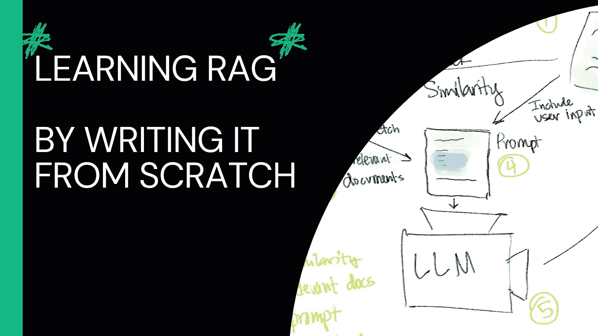
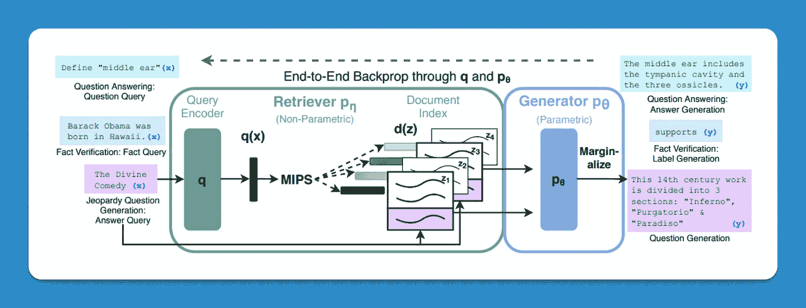
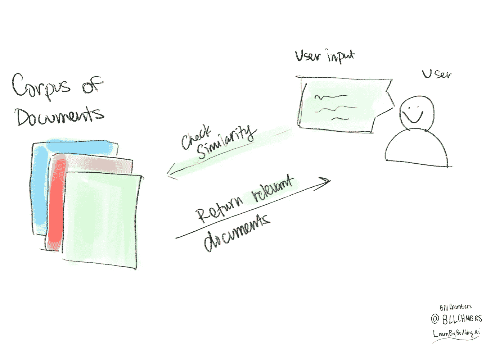
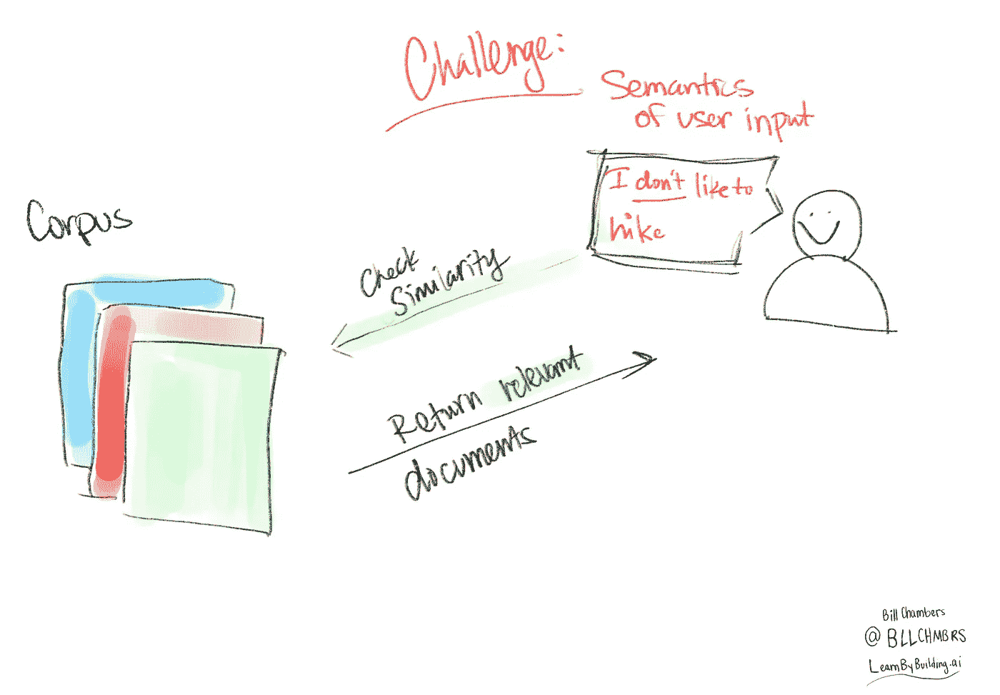
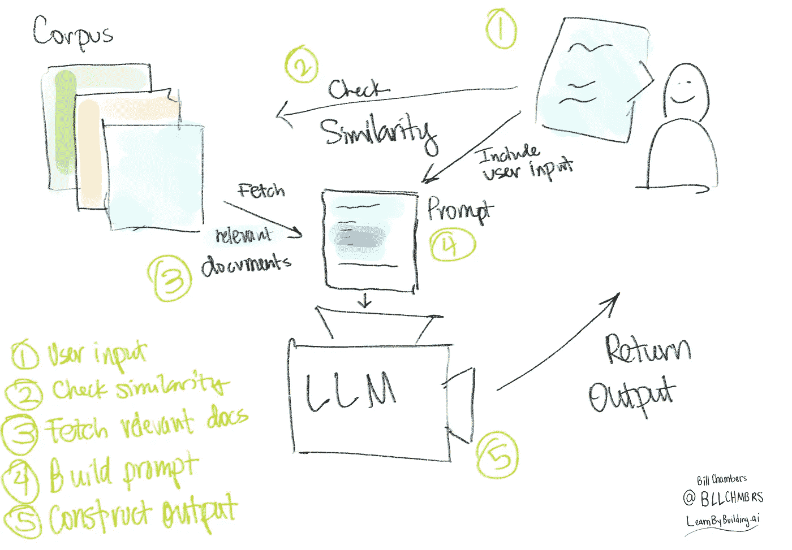

# 从零开始构建检索增强生成（RAG）应用程序的初学者指南

> 原文：[`towardsdatascience.com/a-beginners-guide-to-building-a-retrieval-augmented-generation-rag-application-from-scratch-e52921953a5d?source=collection_archive---------1-----------------------#2023-11-02`](https://towardsdatascience.com/a-beginners-guide-to-building-a-retrieval-augmented-generation-rag-application-from-scratch-e52921953a5d?source=collection_archive---------1-----------------------#2023-11-02)

## 用简单易懂的语言学习构建 AI 应用程序的关键知识

[](https://medium.com/@wachambers?source=post_page-----e52921953a5d--------------------------------)[](https://towardsdatascience.com/?source=post_page-----e52921953a5d--------------------------------) [Bill Chambers](https://medium.com/@wachambers?source=post_page-----e52921953a5d--------------------------------)

·

[关注](https://medium.com/m/signin?actionUrl=https%3A%2F%2Fmedium.com%2F_%2Fsubscribe%2Fuser%2F9627ead2f75f&operation=register&redirect=https%3A%2F%2Ftowardsdatascience.com%2Fa-beginners-guide-to-building-a-retrieval-augmented-generation-rag-application-from-scratch-e52921953a5d&user=Bill+Chambers&userId=9627ead2f75f&source=post_page-9627ead2f75f----e52921953a5d---------------------post_header-----------) 发表在 [Towards Data Science](https://towardsdatascience.com/?source=post_page-----e52921953a5d--------------------------------) ·10 分钟阅读·2023 年 11 月 2 日[](https://medium.com/m/signin?actionUrl=https%3A%2F%2Fmedium.com%2F_%2Fvote%2Ftowards-data-science%2Fe52921953a5d&operation=register&redirect=https%3A%2F%2Ftowardsdatascience.com%2Fa-beginners-guide-to-building-a-retrieval-augmented-generation-rag-application-from-scratch-e52921953a5d&user=Bill+Chambers&userId=9627ead2f75f&source=-----e52921953a5d---------------------clap_footer-----------)

--

[](https://medium.com/m/signin?actionUrl=https%3A%2F%2Fmedium.com%2F_%2Fbookmark%2Fp%2Fe52921953a5d&operation=register&redirect=https%3A%2F%2Ftowardsdatascience.com%2Fa-beginners-guide-to-building-a-retrieval-augmented-generation-rag-application-from-scratch-e52921953a5d&source=-----e52921953a5d---------------------bookmark_footer-----------)

# 从零开始构建检索增强生成（RAG）应用程序的初学者指南

检索增强生成（RAG）目前非常流行，因为它为像 OpenAI 的 GPT-4 这样的语言模型引入了一些强大的功能——即利用和利用自身数据的能力。

本文将教你 RAG 的基本直觉，并提供一个简单的教程帮助你入门。

# 在快速变化的领域中学习的问题

AI 领域有太多噪音，特别是关于 RAG 的噪音。供应商们试图使其过于复杂。他们试图注入他们的工具、生态系统和愿景。

这使得 RAG 变得比实际需要的复杂得多。这个教程旨在帮助初学者从零开始学习如何构建 RAG 应用程序。不包含冗余内容，不使用术语（好吧，尽量少用），不依赖库，只是一个简单的逐步 RAG 应用程序。

[LlamaIndex 的 Jerry 提倡从零开始构建事物以真正理解各个部分](https://twitter.com/jerryjliu0/status/1716122650836439478)。一旦你做到这一点，使用像 LlamaIndex 这样的库就更有意义了。

从零开始学习，然后用库进行扩展。

让我们开始吧！

# 介绍我们的概念：检索增强生成

你可能听说过检索增强生成（RAG），也可能没有。

这是[Facebook 介绍这个概念的博客文章](https://ai.meta.com/blog/retrieval-augmented-generation-streamlining-the-creation-of-intelligent-natural-language-processing-models/)中的定义：

> *构建一个能够研究和上下文化的模型更具挑战性，但这是未来发展的关键。我们最近在这一领域取得了重大进展，推出了我们的检索增强生成（RAG）架构，这是一种端到端的可微模型，将信息检索组件（Facebook AI 的密集段落检索系统）与 seq2seq 生成器（我们的双向自回归变换器[BART]模型）相结合。RAG 可以在知识密集型的下游任务上进行微调，与即使是最大的预训练 seq2seq 语言模型相比，能够达到最先进的结果。而且，与这些预训练模型不同，RAG 的内部知识可以随时轻松更改或补充，使研究人员和工程师能够控制 RAG 知道和不知道的内容，而无需浪费时间或计算能力重新训练整个模型。*

哇，真是太复杂了。

为了简化技术对初学者，我们可以说 RAG 的本质是将你自己的数据（通过检索工具）添加到你传递给大型语言模型的提示中。这样，你将获得一个输出。这带来了几个好处：

1.  你可以在提示中包含事实，以帮助 LLM 避免产生幻觉。

1.  你可以（手动）参考权威来源来回应用户查询，帮助检查潜在问题。

1.  你可以利用 LLM 可能未曾训练过的数据。

# 我们 RAG 系统的高级组件

1.  一组文档（正式称为语料库）

1.  用户输入

1.  文档集合与用户输入之间的相似性测量

是的，就是这么简单。

要开始学习和理解基于 RAG 的系统，你不需要一个向量存储，甚至*不需要*LLM（至少在概念学习和理解方面）。

虽然它经常被描绘得很复杂，但其实不一定如此。

# 查询 RAG 系统的有序步骤

我们将按顺序执行以下步骤。

1.  接收用户输入

1.  执行我们的相似度度量

1.  对用户输入和获取的文档进行后处理。

后处理是通过 LLM 完成的。

# 论文本身的备注

[实际的 RAG 论文](https://arxiv.org/abs/2005.11401)显然是*最重要的*资源。问题在于它假设了大量的上下文。这比我们需要的要复杂得多。

例如，下面是论文中提出的 RAG 系统概述。



[来自 RAG 论文的 RAG 概述](https://arxiv.org/abs/2005.11401) 由 Lewis 等人提供

这很密集。

对于研究人员来说，这很棒，但对于我们其他人来说，通过自己构建系统逐步学习将会容易得多。

# 通过一个示例进行工作——最简单的 RAG 系统

让我们回到从头开始构建 RAG，逐步进行。这里是我们将要经历的简化步骤。虽然这不严格是“RAG”，但它是一个好的简化模型，有助于学习并使我们能够进步到更复杂的变体。



# 获取文档集合

下面你可以看到我们有一个简单的‘文档’语料库（请宽容一点😉）。

```py
corpus_of_documents = [
    "Take a leisurely walk in the park and enjoy the fresh air.",
    "Visit a local museum and discover something new.",
    "Attend a live music concert and feel the rhythm.",
    "Go for a hike and admire the natural scenery.",
    "Have a picnic with friends and share some laughs.",
    "Explore a new cuisine by dining at an ethnic restaurant.",
    "Take a yoga class and stretch your body and mind.",
    "Join a local sports league and enjoy some friendly competition.",
    "Attend a workshop or lecture on a topic you're interested in.",
    "Visit an amusement park and ride the roller coasters."
]
```

# 定义和执行相似度度量

现在我们需要一种方法来衡量我们将要接收的**用户输入**和我们组织的**文档集合**之间的相似度。可以说，最简单的相似度度量是[杰卡德相似度](https://en.wikipedia.org/wiki/Jaccard_index)。我在过去写过这方面的内容（参见[这篇文章](https://billchambers.me/posts/tf-idf-explained-in-python)），但简短的回答是**杰卡德相似度**是“词集”的交集除以并集。

这使我们能够将用户输入与源文档进行比较。

## 附注：预处理

一个挑战是，如果我们有一个简单的字符串像`"Take a leisurely walk in the park and enjoy the fresh air."`，我们需要将其预处理为一个集合，以便进行这些比较。我们将以最简单的方式进行处理，转为小写并按`" "`分割。

```py
def jaccard_similarity(query, document):
    query = query.lower().split(" ")
    document = document.lower().split(" ")
    intersection = set(query).intersection(set(document))
    union = set(query).union(set(document))
    return len(intersection)/len(union)
```

现在我们需要定义一个函数，该函数接收精确的查询和我们的语料库，并选择‘最佳’文档返回给用户。

```py
def return_response(query, corpus):
    similarities = []
    for doc in corpus:
        similarity = jaccard_similarity(query, doc)
        similarities.append(similarity)
    return corpus_of_documents[similarities.index(max(similarities))]
```

现在我们可以运行它了，我们将从一个简单的提示开始。

```py
user_prompt = "What is a leisure activity that you like?"
```

还有一个简单的用户输入…

```py
user_input = "I like to hike"
```

现在我们可以返回响应。

```py
return_response(user_input, corpus_of_documents)
```

```py
'Go for a hike and admire the natural scenery.'
```

恭喜，你已经构建了一个基本的 RAG 应用程序。

## 我有 99 个问题，糟糕的相似度是其中之一

现在我们选择了一个简单的相似性度量进行学习。但这会有问题，因为它过于简单。它没有**语义**的概念。它只是查看两个文档中包含了哪些词。这意味着如果我们提供一个负面例子，我们将得到相同的“结果”，因为这是最接近的文档。



```py
user_input = "I don't like to hike"
```

```py
return_response(user_input, corpus_of_documents)
```

```py
'Go for a hike and admire the natural scenery.'
```

这是一个在“RAG”中经常出现的话题，但目前请放心，我们会在后面解决这个问题。

目前为止，我们还没有对响应的“文档”进行任何后处理。到现在为止，我们只实现了“检索增强生成”的“检索”部分。下一步是通过引入大型语言模型（LLM）来增强生成。

# 添加 LLM

为此，我们将使用[ollama](https://ollama.ai/)来启动并运行本地机器上的开源 LLM。我们同样可以使用 OpenAI 的 gpt-4 或 Anthropic 的 Claude，但现在我们将从[Meta AI](https://ai.meta.com/llama/)的开源 llama2 开始。

+   [ollama 安装说明在这里](https://ollama.ai/)

本文假设你对大型语言模型有一些基本了解，所以我们直接开始查询这个模型吧。

```py
import requests
import json
```

首先，我们将定义输入。为了使用这个模型，我们将采取

1.  用户输入，

1.  获取最相似的文档（按我们的相似性度量来衡量），

1.  将其传递给语言模型的提示，

1.  *然后* 将结果返回给用户

这引入了一个新术语，即**提示**。简而言之，它就是你给 LLM 的指令。

当你运行这段代码时，你会看到流式结果。流式处理对用户体验很重要。

```py
user_input = "I like to hike"
relevant_document = return_response(user_input, corpus_of_documents)
full_response = []
```

```py
prompt = """
You are a bot that makes recommendations for activities. You answer in very short sentences and do not include extra information.
This is the recommended activity: {relevant_document}
The user input is: {user_input}
Compile a recommendation to the user based on the recommended activity and the user input.
"""
```

确定了这一点之后，现在让我们调用 ollama（和 llama2）的 API。一个重要的步骤是确保 ollama 已经在你的本地机器上运行，通过运行`ollama serve`。

> *注意：这在你的机器上可能很慢，在我的机器上肯定很慢。请耐心点，小草 hopper。*

```py
url = 'http://localhost:11434/api/generate'
data = {
    "model": "llama2",
    "prompt": prompt.format(user_input=user_input, relevant_document=relevant_document)
}
```

```py
headers = {'Content-Type': 'application/json'}
response = requests.post(url, data=json.dumps(data), headers=headers, stream=True)
try:
    count = 0
    for line in response.iter_lines():
        # filter out keep-alive new lines
        # count += 1
        # if count % 5== 0:
        #     print(decoded_line['response']) # print every fifth token
        if line:
            decoded_line = json.loads(line.decode('utf-8'))

            full_response.append(decoded_line['response'])
finally:
    response.close()
print(''.join(full_response))
```

```py
Great! Based on your interest in hiking, I recommend trying out the nearby trails for a challenging and rewarding experience with breathtaking views Great! Based on your interest in hiking, I recommend checking out the nearby trails for a fun and challenging adventure.
```

这给了我们一个完整的 RAG 应用，从零开始，没有提供者，没有服务。你了解了检索增强生成应用中的所有组件。视觉上，这是我们构建的内容。



如果你幸运的话，LLM 将处理与推荐文档不符的用户输入。我们可以在下面看到。

```py
user_input = "I don't like to hike"
relevant_document = return_response(user_input, corpus_of_documents)
# https://github.com/jmorganca/ollama/blob/main/docs/api.md
full_response = []
```

```py
prompt = """
You are a bot that makes recommendations for activities. You answer in very short sentences and do not include extra information.
This is the recommended activity: {relevant_document}
The user input is: {user_input}
Compile a recommendation to the user based on the recommended activity and the user input.
"""
url = 'http://localhost:11434/api/generate'
data = {
    "model": "llama2",
    "prompt": prompt.format(user_input=user_input, relevant_document=relevant_document)
}
headers = {'Content-Type': 'application/json'}
response = requests.post(url, data=json.dumps(data), headers=headers, stream=True)
try:
    for line in response.iter_lines():
        # filter out keep-alive new lines
        if line:
            decoded_line = json.loads(line.decode('utf-8'))
            # print(decoded_line['response'])  # uncomment to results, token by token
            full_response.append(decoded_line['response'])
finally:
    response.close()
print(''.join(full_response))
```

```py
Sure, here is my response:

Try kayaking instead! It's a great way to enjoy nature without having to hike.
```

# 改进领域

如果我们回到 RAG 应用的图示，考虑一下我们刚刚构建的内容，我们会看到各种改进的机会。这些机会是工具如向量存储、嵌入和提示“工程”介入的地方。

这里有十个潜在的改进领域：

1.  **文档的数量** 👉 更多文档可能意味着更多的推荐。

1.  **文档的深度/大小** 👉 更高质量的内容和信息更多的长文档可能更好。

1.  **我们提供给 LLM 的文档数量** 👉 目前，我们只给 LLM 一个文档。我们可以将几个文档作为“上下文”输入，并允许模型根据用户输入提供更个性化的推荐。

1.  **我们提供给 LLM 的文档部分** 👉 如果我们有较大或更全面的文档，我们可能只想添加这些文档的部分、各个文档的部分，或其某种变体。在词汇中，这被称为分块（chunking）。

1.  **我们的文档存储工具** 👉 我们可能以不同的方式或不同的数据库存储文档。特别是，如果我们有大量文档，我们可能会探索将它们存储在数据湖或向量存储中。

1.  **相似度度量** 👉 我们如何度量相似度是重要的，我们可能需要在性能和全面性之间进行权衡（例如，查看每一个单独的文档）。

1.  **文档及用户输入的预处理** 👉 我们可能在将用户输入传递到相似度度量之前，进行一些额外的预处理或增强。例如，我们可能会使用嵌入将输入转换为向量。

1.  **相似度度量** 👉 我们可以更改相似度度量，以获取更好或更相关的文档。

1.  **模型** 👉 我们可以更改我们使用的最终模型。我们上面使用的是 llama2，但我们也可以轻松使用 Anthropic 或 Claude 模型。

1.  **提示** 👉 我们可以使用不同的提示输入 LLM/模型，并根据我们希望得到的输出进行调整。

1.  **如果你担心有害或有毒的输出** 👉 我们可以实现一种“断路器”，运行用户输入以检查是否存在有毒、有害或危险的讨论。例如，在医疗保健背景中，你可以检查信息是否包含不安全的语言，并相应地做出回应——超出典型流程之外。

改进的范围不仅限于这些点；可能性广泛，我们将在未来的教程中深入探讨。在此之前，如果你有任何问题，请随时 [在 Twitter 上联系我](https://twitter.com/bllchmbrs)。祝你 RAGING 愉快 :)。

# 参考文献

+   [检索增强生成（RAG）用于知识密集型 NLP 任务](https://arxiv.org/abs/2005.11401)

+   [Jerry Liu 在 Twitter 上倡导用户从零开始构建 RAG](https://twitter.com/jerryjliu0/status/1716122650836439478)

[这篇文章最初发布在 learnbybuilding.ai](https://learnbybuilding.ai/tutorials/rag-from-scratch)。**我将在未来几个月举办一个关于如何为产品经理构建生成式 AI 产品的课程，** [**点击这里报名**](https://maven.com/forms/90684f)**。**
