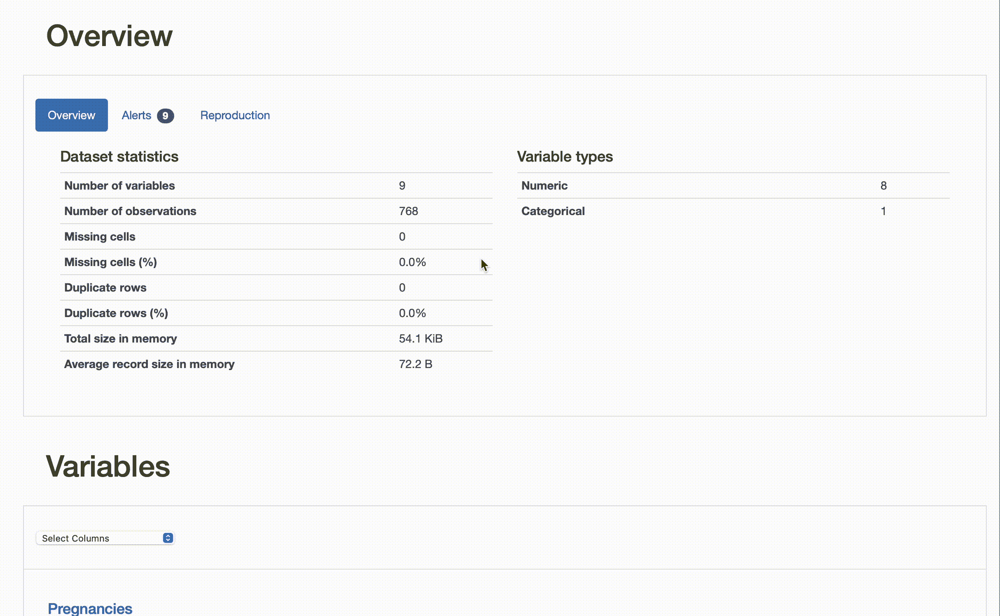
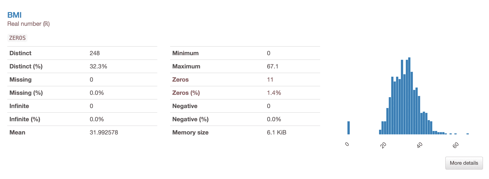
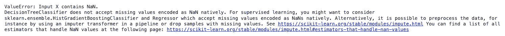
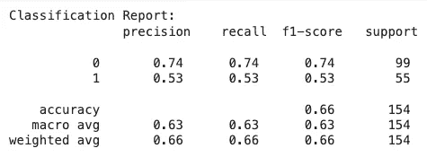
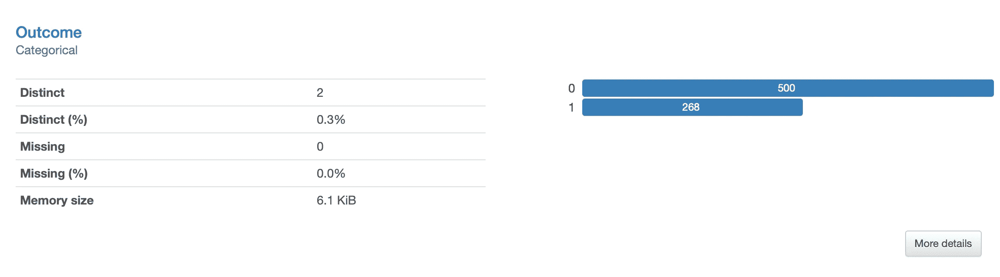
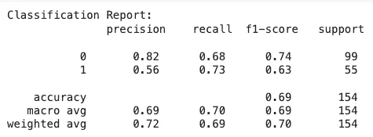

# 构建高质量机器学习数据集的初学者指南

> 原文：[`towardsdatascience.com/a-beginners-guide-to-building-high-quality-datasets-for-machine-learning-586a2ce7a565?source=collection_archive---------1-----------------------#2023-11-11`](https://towardsdatascience.com/a-beginners-guide-to-building-high-quality-datasets-for-machine-learning-586a2ce7a565?source=collection_archive---------1-----------------------#2023-11-11)

## 数据清洗、可视化、增强和合成数据生成的工具和技术

 [Miriam Santos](https://medium.com/@miriam.santos?source=post_page-----586a2ce7a565--------------------------------)

·

[关注](https://medium.com/m/signin?actionUrl=https%3A%2F%2Fmedium.com%2F_%2Fsubscribe%2Fuser%2F243289394aaa&operation=register&redirect=https%3A%2F%2Ftowardsdatascience.com%2Fa-beginners-guide-to-building-high-quality-datasets-for-machine-learning-586a2ce7a565&user=Miriam+Santos&userId=243289394aaa&source=post_page-243289394aaa----586a2ce7a565---------------------post_header-----------) 发表在[Towards Data Science](https://towardsdatascience.com/?source=post_page-----586a2ce7a565--------------------------------) ·9 分钟阅读·2023 年 11 月 11 日

--

找到数据复杂性的真实来源可能就像在扮演“数据侦探”，直到你找到解锁真正有用洞察的“黄金钥匙”。照片由[Michael Dziedzic](https://unsplash.com/@lazycreekimages?utm_source=medium&utm_medium=referral)提供，刊登在[Unsplash](https://unsplash.com/?utm_source=medium&utm_medium=referral)

智能数据胜过大数据。这是“数据中心人工智能”范式的基本假设。

**数据科学家不仅仅是“简单地预处理”数据，还应该建立一种持续且系统的理解和改进数据集的实践。**

这将**最终将我们的重点从盲目追求通过使用越来越复杂的算法来提升分类结果，转向对分类结果本身的深刻理解，问题的复杂性源自何处，以及如何调整数据以便分类器能够更好地学习问题**，从而提高其性能。

如果你是机器学习新手，这可能会让你感到有些畏惧：*“构建高质量数据集的最佳实践是什么，如何实施？”*

在本教程中，我们将通过一个简单的案例来运用数据中心人工智能范式，以实现高质量数据并改善我们的机器学习分类结果。

根据数据中心人工智能的原则——*一切都围绕数据*——我们不会深入到模型本身（说实话，它会是一个简单的决策树）。

我们将使用[皮马印第安人糖尿病数据集](https://www.kaggle.com/datasets/uciml/pima-indians-diabetes-database)，该数据集在 Kaggle 上免费提供（许可证：[CC0: 公开领域](https://creativecommons.org/publicdomain/zero/1.0/)）。你还可以在[数据中心人工智能社区 GitHub](https://github.com/Data-Centric-AI-Community/awesome-python-for-data-science)找到所有代码和额外的材料。

*我们开始吧？*

# 步骤 1：进行数据概况分析以理解数据

在开始整理我们的数据集之前，我们需要**理解我们要解决的问题**以及我们处理的数据的特殊性。彻底理解数据特征、问题复杂性和使用案例领域是数据中心人工智能的基本原则之一。

**这将帮助我们确定下一步行动，以推进你的机器学习流程。**

关于数据概况分析，有几个有趣的开源工具可以探索：我自己做了一些评测，包括`[ydata-profiling](https://github.com/ydataai/ydata-profiling)`、`[dataprep](https://github.com/sfu-db/dataprep)`、`[sweetviz](https://github.com/fbdesignpro/sweetviz)`、`[autoviz](https://github.com/AutoViML/AutoViz)`和`[lux](https://github.com/lux-org/lux)`。

我目前主要使用[ydata-profiling](https://github.com/ydataai/ydata-profiling)：我发现它是一个顶尖的工具，可以让数据从业者在几行代码中完成对数据特征和可视化的全面分析，而无需费劲地使用 pandas。

首先，你需要安装 ydata-profiling（最好使用虚拟环境——如果你不知道怎么做，你可以 [查看这个 2 分钟的视频](https://www.youtube.com/watch?v=fvXZcpTwbtA)，或者如果你从未在 conda 环境中工作过，可以查看这个 [完整教程](https://www.youtube.com/watch?v=jj9X1_cKRwI)）：

然后，我们可以通过保存一个`.html`报告来获得数据的完整概述，其中包含所有必要的特征和可视化：

数据报告立即让我们了解数据的整体特征，并突出一些我们可能需要考虑的警告：

YData Profiling 报告：查找数据集的基本统计信息、可视化和质量警告。

数据集包含 768 个观察值和 9 个变量/特征。虽然 8 个是数值型的，1 个被识别为分类变量（`Outcome`似乎是我们的目标）。没有重复的行，并且***显然***没有缺失值。最后，特征中发现了一些`高相关性`警告。此外，几个特征有大量的`零值`。

现在是时候充当数据侦探了。`高相关性`在生物特征中是比较常见的，但这些`零`值怎么样呢？

查看一些突出的特征（例如`BMI`），我们可以看到这些值与整体分布相差甚远。根据领域知识，这些“0”值实际上是没有意义的：`怀孕次数`的 0 值是可以接受的，但 BMI、葡萄糖、胰岛素、血压或皮肤厚度的 0 值则是无效的。

YData Profiling 报告：BMI 特征，表明零值与分布有很大差距。

我们很快意识到这些零值编码了什么：**缺失数据**。

现在我们将解决这个问题，但一个彻底的 EDA 过程可以涵盖更多内容。查看这个 [探索性数据分析的基本指南](https://medium.com/towards-data-science/a-data-scientists-essential-guide-to-exploratory-data-analysis-25637eee0cf6) 以了解你可以从数据中发现什么其他信息。

# 第 2 步：调查数据质量问题

既然我们发现某些列有无效的零值，我们可以开始处理数据集中的缺失数据问题。

**许多机器学习模型和 scikit-learn 估算器本身不支持缺失值**，因此在将数据集提供给估算器之前，我们需要以某种方式处理这些 NaNs。

首先，我们将这些 0 值标记为 NaN 值：

**现在，我们可以使用数据填充来用合理的替代值替换 NaN 观察值。**

“没有免费午餐”定理告诉我们，没有一种最佳的解决方案适用于所有情况——我们应该调查不同解决方案对训练数据复杂性的影响，并确定什么能最好地提升我们的机器学习模型。这实际上是数据中心 AI 的另一个原则：*不断迭代和改进*。

目前我们将使用一个非常简单的方法——`SimpleImputer`——将零值替换为每个特征的均值。这是一个非常初级的方法，可能会在我们的分布中产生一些不希望有的“尖峰”，但目标只是展示如何突出和填补缺失数据，我们可以稍后尝试更好的方法：

现在，我们可以尝试一个非常简单的决策树分类器，看看我们的分类结果的基线是什么。作为旁注，决策树可以扩展以自然支持缺失值，通过替代拆分或其他方法。确实，在 [scikit-learn 的文档](https://scikit-learn.org/stable/modules/tree.html#missing-values-support) 中似乎决策树在当前版本 (`1.3.2`) 中确实支持缺失值。然而，当我使用版本 `1.2.2` 时，我遇到了这个错误：

即使 NaN 值在内部处理了，**用缺失数据训练你的模型也不是一个好习惯**，因为这会危及模型从混乱和有限的信息中学习到的概念。

这是混淆矩阵：

分类结果不是很好。请记住，我们使用的是简单决策树，但仍然……我们目标类别的预测存在显著差异。**为什么分类器在类别“0”上的表现优于类别“1”？**

# 第 3 步：增强不足代表的类别

如果我们在第 1 步中有留意到（*也许你已经发现了*），我们的目标类别`Outcome`是不平衡的。虽然可能不足以在默认设置中触发警告（[默认阈值](https://docs.profiling.ydata.ai/4.5/advanced_settings/available_settings/#variable-summary-settings)是`0.5`），但足以使分类器对多数类别产生偏向，忽视少数类别。从 Profiling Report 中提供的数据可视化中可以清楚地看出这一点：

YData Profiling Report: 结果类别“0”和“1”并不均等地代表。分类器自然会对代表性较强的类别“0”更有偏向，忽视类别“1”。

请注意，虽然缺失数据可能是由于数据收集、传输或存储过程中出现的多个错误造成的，**类不平衡可能反映了领域的自然特征**：例如，这个医疗中心诊断出的糖尿病患者较少。

**然而，对训练数据进行处理仍然很重要，以确保模型不会忽视少数类别：事实上，这就是我们试图更准确预测的内容。**

**假阳性是糟糕的，因为它会给健康患者错误的信息，告诉她她有糖尿病。** 但当进行额外的测试时，这将只是一个“惊吓”。

**然而，在这种情况下，假阴性更糟。** 我们将告诉一位患有糖尿病的患者一切正常，她未被诊断出来，疾病继续发展。

**增加这些数字的一种方法是使用数据过采样技术。** 数据过采样是数据从业者中流行的一种技术，用于调整数据集中现有类别或分类之间的比例，从而缓解数据不平衡问题。

**这只是合成数据的许多有趣和有用应用之一。**

虽然[合成数据可能有多种解释](https://ydata.ai/resources/10-most-frequently-asked-questions-about-synthetic-data) — 例如，“假数据”，“虚拟数据”，“模拟数据” — 但在这里我们指的是“数据驱动的”合成数据生成。

**从这个意义上说，合成数据是人工生成的，保留了真实数据的特征 — 结构、统计属性、依赖关系和相关性。**

有大量的方法和开源工具可用于生成合成数据 — `[ydata-synthetic](https://github.com/ydataai/ydata-synthetic)`, `[sdv](https://github.com/sdv-dev/SDV)`, `[gretel-synthetics](https://github.com/gretelai/gretel-synthetics)`, `[nbsynthetic](https://github.com/NextBrain-ai/nbsynthetic)`, 和 `[synthcity](https://github.com/vanderschaarlab/synthcity)` 只是我过去尝试过的一些。

同样地…… 这里没有“免费午餐”：选择最合适的方法将始终取决于需要合成数据的目标。

为了快速掌握合成数据如何用于增强，我们将利用`[ydata-synthetic](https://github.com/ydataai/ydata-synthetic)`包，并尝试他们的[高斯混合模型](https://ydata.ai/resources/synthetic-data-generation-with-gaussian-mixture-models)。

首先，我们需要安装该包：

一旦完成这些步骤，创建合成数据就非常简单了：

获得我们的合成数据之后，我们可以简单地从合成数据中抽取新生成的少数类样本的子集，并将其添加到训练数据中，以创建一个平衡（即 50%-50%）的分布：

看看这如何影响我们决策树的学习及其随后的结果：

以及混淆矩阵：

注意到我们对训练集进行如此简单的修改，导致我们的 F-score 提升了 10%，少数类敏感性结果显著改善（从 53%提高到 73%）。

**这就是数据中心化 AI 范式的美妙之处：在不触及模型参数化的情况下，我们用非常简单的启发式方法和标准技术显著改善了我们的训练集的质量** — 想象一下如果我们采用更先进的策略和专门的数据准备流水线能做些什么！

当然，类别 0 的召回率有些下降，但最终，我们需要**这个模型比特异性更敏感**（即更好地检测正类而非负类），这是由于我们所面临的特定约束：疾病诊断——再一次，**数据中心人工智能的另一个原则：方法和结果需要根据领域的需求和约束进行评估。**

# 最终思考和进一步方向

在本文中，我们用一个非常实际的案例实验了数据中心人工智能范式。

我们总是从理解数据开始。我们发现、调查并解决了特定的数据质量问题，如**缺失数据**，**以及通过合成数据来改善我们的训练数据，以克服领域的不平衡性。**当然，对于这样一个快速而简单的案例研究，我们专注于简单的启发式方法来完成工作，但数据科学家的工作从未止步于此。

*如果我们考虑不同的插补方法，结果会如何变化？我们如何在合成数据生成中获得更好的拟合？我们是否应该平衡两个类别，还是提高少数类别的表示？某些特征转换或降维是否有助于分类结果？我们是否应该去除一些混淆特征？*

所有这些问题在任何机器学习项目开始时似乎都是不可知的。**但是随着我们开始测量和揭示每个数据集中的复杂源，我们可以获得更好的见解，了解哪些方法可以改进分类结果（一种“元学习”方法）。**当然，数据需要根据数据特征和项目的最终目标进行处理和改进。

生产一个预定义的流程并将数据准备视为一刀切的解决方案，就像是盲目飞行一样。**相反，一个熟练的数据科学家会不断扮演数据侦探的角色，并尝试根据数据留给我们的线索找到最佳的技术。**通常这确实有效。我们只需要保持警觉！

我希望你喜欢这个教程，像往常一样，反馈、问题和建议非常受欢迎。请在评论中告诉我你希望我写关于哪些其他主题！

# 关于我

博士，机器学习研究员，教育者，数据倡导者，以及全能型人才。在 Medium 上，我撰写关于**数据中心人工智能和数据质量**的文章，教育数据科学和机器学习社区如何将不完美的数据转变为智能数据。

[数据中心人工智能社区](https://tiny.ydata.ai/dcai-medium) | [GitHub](https://github.com/Data-Centric-AI-Community) | [Google Scholar](https://scholar.google.com/citations?user=isaI6u8AAAAJ&hl=en) | [LinkedIn](https://www.linkedin.com/in/miriamseoanesantos/)
