# 《线性规划及单纯形算法初学者指南》

> 原文：[`towardsdatascience.com/a-beginners-guide-to-linear-programming-and-the-simplex-algorithm-87db017e92b4`](https://towardsdatascience.com/a-beginners-guide-to-linear-programming-and-the-simplex-algorithm-87db017e92b4)

玉米农场。Dall-E 2 的静物画。

## 解决各种优化问题

 [Hennie de Harder](https://hennie-de-harder.medium.com/?source=post_page-----87db017e92b4--------------------------------)

·发布于 [Towards Data Science](https://towardsdatascience.com/?source=post_page-----87db017e92b4--------------------------------) ·8 分钟阅读·2023 年 1 月 9 日

--

**线性规划是一种强大的工具。它在工程、金融和运筹学等广泛领域中都有应用。线性规划已被用来解决从航空公司航班调度到制造过程设计等各种问题。在这篇博客文章中，我们将探讨线性规划的基础知识以及它如何用来解决实际问题。**

线性规划（LP）是一种数学优化技术。它用于寻找涉及多个变量和约束条件问题的最佳解决方案。通过将问题的约束条件和目标函数表示为线性方程和不等式的系统，线性规划算法可以系统地搜索解空间，找到最大化或最小化给定目标的解决方案。

首先，我会给出一个简单的例子。然后我们将深入探讨单纯形算法，它在后台用于快速找到 LP 问题的最佳解决方案。

# 线性规划问题的示例

假设一个农民拥有 120 英亩的土地用来种植小麦和玉米。小麦每吨需要 2 英亩土地，玉米每吨需要 1 英亩土地。农民希望最大化作物的利润，小麦每吨€100，玉米每吨€150。农民还有限制，每种小麦的产量不超过 50 吨，每种玉米的产量不超过 40 吨。

要使用线性规划解决这个问题，我们首先需要确定决策变量，即农民将种植的小麦和玉米的数量。我们将使用变量 *w* 和 *c* 分别表示小麦和玉米的吨数。

接下来，我们需要编写目标函数，它表示农民想要最大化的利润。在这种情况下，目标函数是：

然后，我们需要编写约束条件，这些条件代表了可以生产的小麦和玉米的数量限制。约束条件如下：

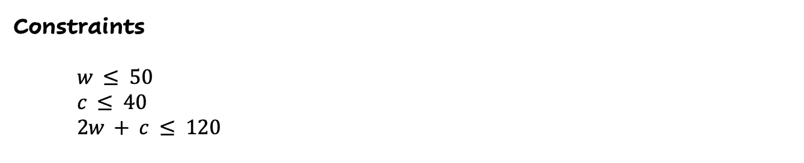

前两个约束条件表示可以生产的小麦和玉米总吨数的限制。第三个约束条件表示可用土地总面积的限制。

为了解决这个问题，我们可以使用简单形算法或其他线性规划方法来寻找最大化目标函数的* w* 和 * c* 的值，同时满足约束条件。在这种情况下，最优解是种植 40 吨小麦和 40 吨玉米，这样可以获得€10,000 的利润。

这只是一个简单的例子，用来说明解决线性规划问题的基本步骤。在实际应用中，线性规划用于解决更多变量和约束条件的复杂问题。

下面是问题的可视化：

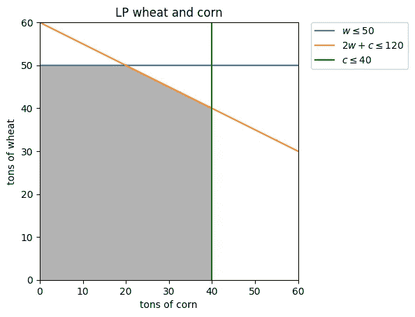

线性规划可视化。图片由作者提供。

灰色区域称为可行区域。区域中的每一个点都包含一个可行解。该区域受约束条件的限制。

[线性规划基本定理](https://en.wikipedia.org/wiki/Fundamental_theorem_of_linear_programming) 说明了最大值出现在区域的角落。这是简单形算法使用的重要信息。

# 简单形算法

简单形算法是一种广泛使用的解决线性规划问题的方法。它由乔治·丹茨格于 1947 年开发。该算法的直观思路是以系统的方式从可行区域的角落“行走”。当找到最优解时，过程结束。

简单形算法是一个迭代过程，依靠数学计算和逻辑推理来找到线性规划问题的最优解。它高效可靠，也用于混合整数规划（在约束条件放松后）。简单形算法的基本步骤如下：

1.  将线性规划问题的约束条件转化为线性方程组的标准形式。

1.  通过将一些变量设置为零，并求解其余变量，找到一个基本可行解。

1.  测试基本可行解是否最优。如果是，算法结束。如果不是，算法选择一个变量进入基准，并相应更新基本可行解。

1.  重复步骤 3，直到找到最优解。

让我们逐步走过小麦和玉米的例子。

**步骤 1\. 将线性规划问题的约束转换为线性方程组，即标准形式。** 第一步是将约束和目标重写为标准形式：

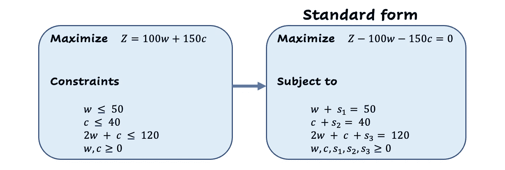

重写为标准形式。图片由作者提供。

在标准形式中，“小于”符号被替换为等号，并且每个约束都有一个松弛变量添加（s1、s2、s3）。这样，小于仍然得以保持，因为松弛变量只能取得正值。

通常，表格用于使问题更具可读性。表格是一个我们写下系数的表格。列代表一个变量，行代表一个约束。在这种情况下，底部行包含目标函数的系数。最后一列包含方程右侧的值。我们使用标准形式来创建表格：

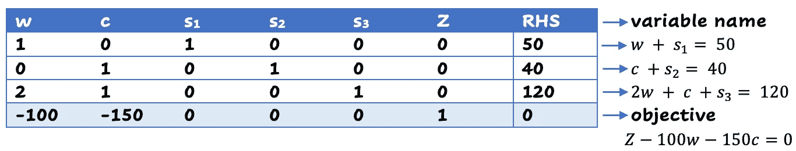

玉米和小麦问题的表格。每个约束和目标都在行中表示，而列表示变量。值是系数。图片由作者提供。

**步骤 2\. 通过将某些变量设置为零并求解其余变量来找到一个基本可行解。** 现在我们有了表格，我们可以使用它来找到一个基本可行解。基本可行解是一个满足所有约束并位于一个顶点上的解。我们可以很容易地从表格中检测到一个。

在表格中，有两种类型的变量：*基本变量* 和 *非基本变量*。基本变量只有一个非零项，而非基本变量有多个非零项。*基变量* 包含所有基本变量。如果我们查看当前的表格状态，松弛变量 *s₁*、*s₂* 和 *s₃* 在基变量中。变量 w 和 c 是非基本的，并被设置为零。当前基本可行解的值为：*s₁* = 50，*s₂* = 40，*s₃* = 120，*Z* = 0，*w* = 0 和 *c* = 0。

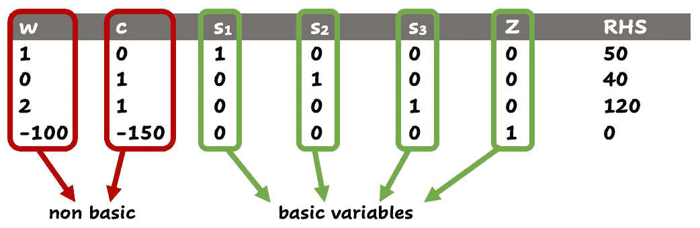

非基本变量和基本变量。图片由作者提供。

该解对应于以下角点：

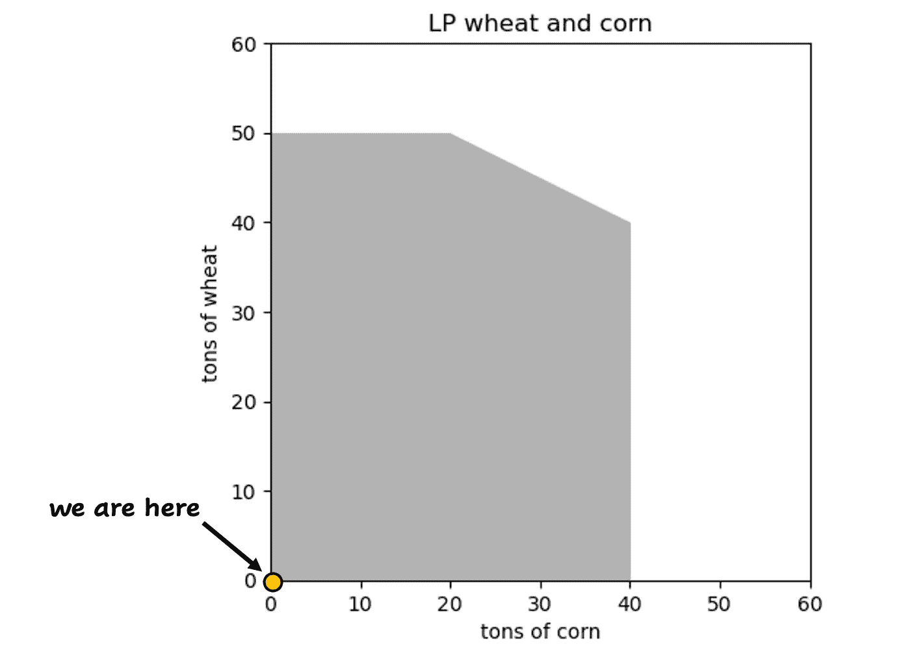

单纯形算法的起点。图片由作者提供。

**步骤 3\. 测试基本可行解是否最优。如果是，则算法结束。如果不是，算法选择一个变量进入基变量，并相应地更新基本可行解。** 通过查看表格中的目标行，可以测试基本可行解是否最优。由于这是一个最大化问题，我们可以通过去除负系数来改进它。如果所有负值都消失了，我们就无法再改进了。底部行中存在负值，因此可以改进，我们尚未找到最优解。

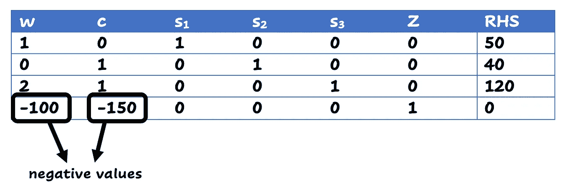

根据目标行中的负值选择进入变量。图像由作者提供。

现在，我们需要选择一个变量进入基。选择进入变量时，取目标行中最低的系数。在我们的例子中，它是 -150，对应于 *c*。这就是进入变量。接着，我们需要选择要进行[高斯消元](https://en.wikipedia.org/wiki/Gaussian_elimination)的行。这是通过将右侧值除以 *c* 的系数来完成的。因此，在我们的例子中，第二行得到 40/1=40，第三行得到 120/1=120。最低值是 40，这就是为什么使用第二行。现在我们可以用第 2 行清除表格，以将 *c* 包括在基中：

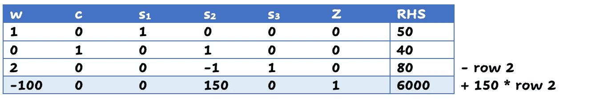

执行高斯消元以使变量`c`进入基：从第 3 行中减去第 2 行，将第 2 行乘以 150 后加到第 4 行。图像由作者提供。

新的目标值是 6000，基中的变量是 *c*、*s₁* 和 *s₃*，分别为 40、50 和 80。我们移动到一个新的角点，即下一个基本可行解：

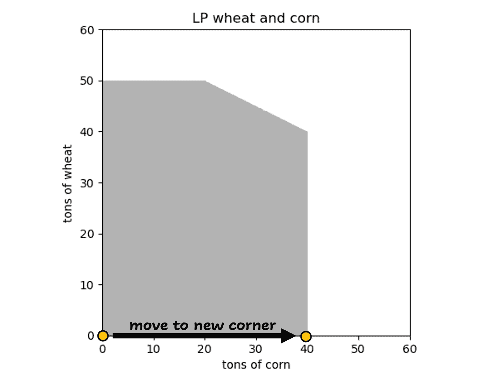

现在我们转到下一个可行解（右下角）。图像由作者提供。

**第 4 步。重复第 3 步，直到找到最优解。** 由于表格的目标行中有负值，因此未找到最优解。所以让我们重复第 3 步：进入变量是 *w*，因为它在目标行中有最低的系数。我们应该使用第 3 行进行高斯消元，因为 80/2 < 50/1。经过行简化，表格如下：

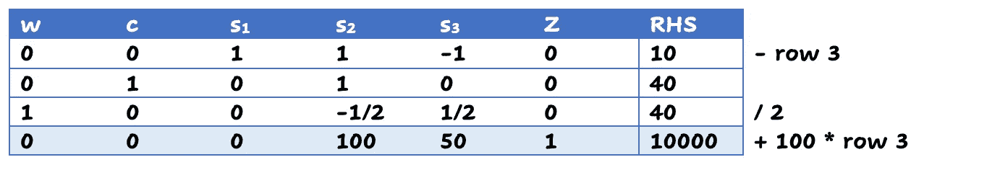

让 *w* 进入基，将第 3 行除以 2，从第 1 行中减去这一新行 3，将第 3 行乘以 100 后加到第 4 行。图像由作者提供。

基中的变量是 *w*、*c* 和 *s₁*，对应的值分别为 40、40 和 10。*Z*（目标）的值等于 10000。这正是我们一开始得到的最优解。底行中没有负值，所以这是最优解。我们采取的步骤：

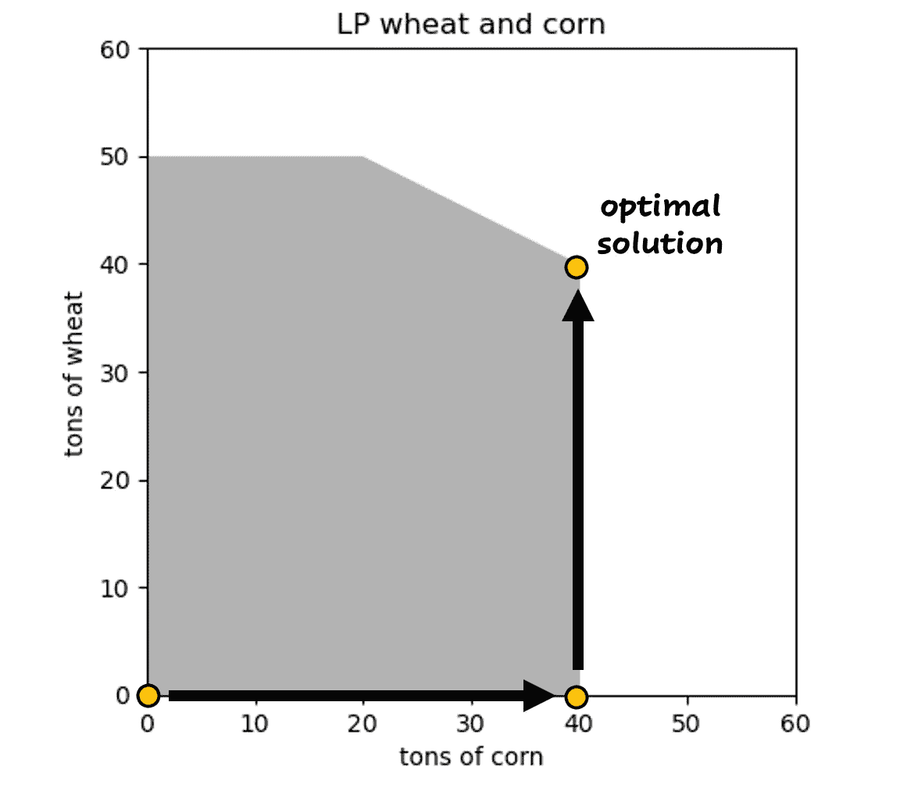

在使用单纯形算法解决问题时所采取的步骤。从左下角开始，走两步到达最优解。图像由作者提供。

这是一个简单的单纯形算法工作原理的例子。它用于解决比我们讨论的更复杂的问题。

# 结论

线性规划是一种工具，可以帮助个人和组织充分利用资源，实现目标。无论你是试图最大化利润的企业主、寻求优化复杂过程的研究员，还是学习优化技术的学生，线性规划都提供了广泛的应用和成长机会。通过理解线性规划的原理和单纯形算法，你可以迈出解决各种优化问题的第一步，并做出能够产生持久影响的明智决策。

在实践中应用这些技术时，你不需要自己实现算法，因为优化软件会为你完成这项工作。

单纯形算法也应用于混合整数规划，其中约束的放松使得算法得以应用。如果你想了解更多，可以阅读下面的文章。

 ## 如何处理优化问题？

### 简单示例及其解决方案和代码。

[towardsdatascience.com  ## 数据科学家应该知道的数学优化启发式方法

### 局部搜索、遗传算法等。

[towardsdatascience.com
