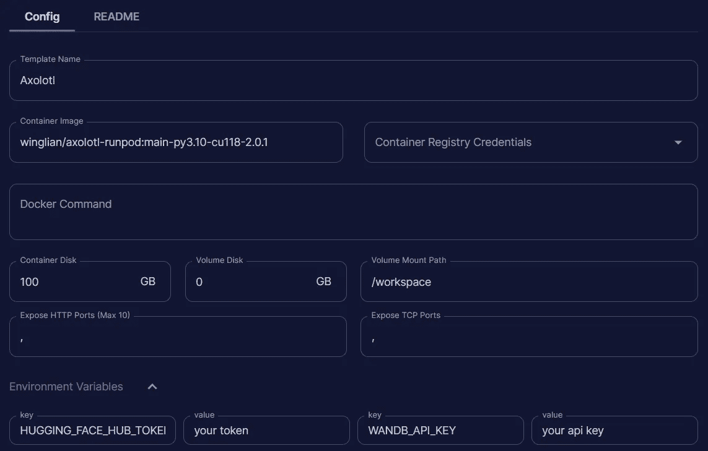
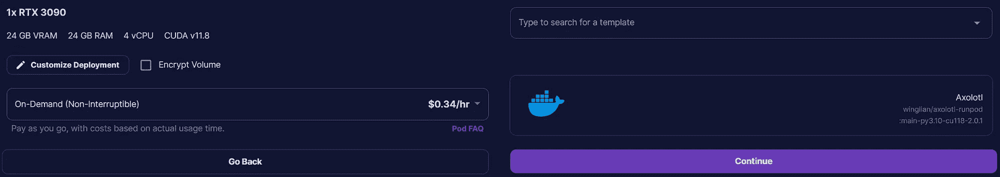
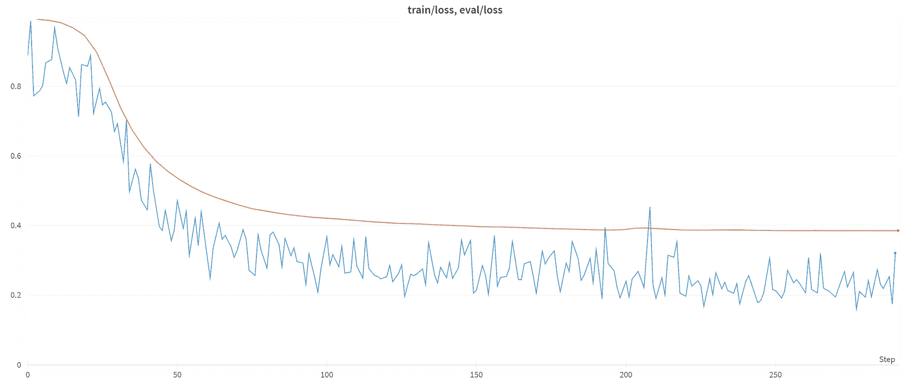

# LLM 微调的初学者指南

> 原文：[`towardsdatascience.com/a-beginners-guide-to-llm-fine-tuning-4bae7d4da672`](https://towardsdatascience.com/a-beginners-guide-to-llm-fine-tuning-4bae7d4da672)

## 如何使用一个工具微调 Llama 及其他 LLM

[](https://medium.com/@mlabonne?source=post_page-----4bae7d4da672--------------------------------)[](https://towardsdatascience.com/?source=post_page-----4bae7d4da672--------------------------------) [Maxime Labonne](https://medium.com/@mlabonne?source=post_page-----4bae7d4da672--------------------------------)

·发表于[Towards Data Science](https://towardsdatascience.com/?source=post_page-----4bae7d4da672--------------------------------) ·8 分钟阅读·2023 年 8 月 30 日

--


图片由作者提供

对大型语言模型（LLMs）的日益关注导致了**旨在简化其训练过程的工具和封装的激增**。

流行的选项包括 LMSYS 的[FastChat](https://github.com/lm-sys/FastChat)（用于训练[Vicuna](https://huggingface.co/lmsys/vicuna-13b-v1.5)）和 Hugging Face 的[transformers](https://github.com/huggingface/transformers)/[trl](https://github.com/huggingface/trl)库（用于我之前的文章）。此外，每个大型 LLM 项目，如[WizardLM](https://github.com/nlpxucan/WizardLM/tree/main)，通常都有自己独特的训练脚本，灵感来自于最初的[Alpaca](https://github.com/tatsu-lab/stanford_alpaca)实现。

在这篇文章中，我们将使用由 OpenAccess AI Collective 创建的[**Axolotl**](https://github.com/OpenAccess-AI-Collective/axolotl)工具。我们将使用它在一个包含 1,000 个 Python 代码样本的 evol-instruct 数据集上微调一个[**Code Llama 7b**](https://github.com/OpenAccess-AI-Collective/axolotl/blob/main/examples/llama-2/qlora.yml)模型。

# 🤔 为什么选择 Axolotl？

Axolotl 的主要吸引力在于它提供了一站式解决方案，其中包括众多功能、模型架构和一个活跃的社区。以下是我最喜欢的几点：

+   **配置**：用于训练 LLM 的所有参数都整齐地存储在 yaml 配置文件中。这使得模型的共享和再现变得方便。你可以在[这里](https://github.com/OpenAccess-AI-Collective/axolotl/tree/main/examples/llama-2)查看 Llama 2 的示例。

+   **数据集灵活性**：Axolotl 允许指定多个数据集，支持各种提示格式，如 alpaca（`{"instruction": "...", "input": "...", "output": "..."}`），sharegpt:chat（`{"conversations": [{"from": "...", "value": "..."}]}`）和原始完成（`{"text": "..."}`）。组合数据集非常顺畅，并且避免了统一提示格式的麻烦。

+   **功能**：Axolotl 配备了 SOTA 技术，如 FSDP、deepspeed、LoRA、QLoRA、ReLoRA、样本打包、GPTQ、FlashAttention、xformers 和 rope scaling。

+   **工具**：集成了众多用户友好的工具，包括添加或更改特殊 token，或自定义 wandb 配置。

一些使用此工具训练的知名模型包括 OpenAccess AI Collective 的[Manticore-13b](https://huggingface.co/openaccess-ai-collective/manticore-13b)和 Eric Hartford 的[Samantha-1.11–70b](https://huggingface.co/ehartford/Samantha-1.11-70b)。像其他包装器一样，它建立在 transformers 库之上，并使用了许多其功能。

# ⚙️ 创建你自己的配置文件

在开始之前，我们需要一个配置文件。你可以重用`[examples](https://github.com/OpenAccess-AI-Collective/axolotl/tree/main/examples)`文件夹中的现有配置。我们将调整[QLoRA 配置](https://github.com/OpenAccess-AI-Collective/axolotl/blob/main/examples/llama-2/qlora.yml)以创建我们自己的**Code Llama**模型。该模型将在`[nickrosh/Evol-Instruct-Code-80k-v1](https://huggingface.co/datasets/nickrosh/Evol-Instruct-Code-80k-v1)`数据集中的 1,000 个 Python 样本子集上进行训练。

首先，我们必须将`base_model`和`base_model_config`字段更改为"codellama/CodeLlama-7b-hf"。为了将我们训练的适配器推送到 Hugging Face Hub，我们需要添加一个新的字段`hub_model_id`，对应我们的模型名称"EvolCodeLlama-7b"。现在，我们必须将数据集更新为`[mlabonne/Evol-Instruct-Python-1k](https://huggingface.co/datasets/mlabonne/Evol-Instruct-Python-1k)`并将`type`设置为"alpaca"。

数据集中没有大于 2048 个 token 的样本，因此我们可以将`sequence_len`减少到"2048"以节省一些 VRAM。说到 VRAM，我们将使用`micro_batch_size`为 10 和`gradient_accumulation_steps`为 1，以最大化其使用。在实际操作中，你可以尝试不同的值，直到使用超过 95%的可用 VRAM。

为了方便，我将"axolotl"添加到`wandb_project`字段中，以便在我的账户上更容易追踪。我还将`warmup_steps`设置为"100"（个人偏好），将`eval_steps`设置为 0.01，以便进行 100 次评估。

最终的配置文件应该是这样的：

```py
base_model: codellama/CodeLlama-7b-hf
base_model_config: codellama/CodeLlama-7b-hf
model_type: LlamaForCausalLM
tokenizer_type: LlamaTokenizer
is_llama_derived_model: true
hub_model_id: EvolCodeLlama-7b

load_in_8bit: false
load_in_4bit: true
strict: false

datasets:
  - path: mlabonne/Evol-Instruct-Python-1k
    type: alpaca
dataset_prepared_path: last_run_prepared
val_set_size: 0.02
output_dir: ./qlora-out

adapter: qlora
lora_model_dir:

sequence_len: 2048
sample_packing: true

lora_r: 32
lora_alpha: 16
lora_dropout: 0.05
lora_target_modules:
lora_target_linear: true
lora_fan_in_fan_out:

wandb_project: axolotl
wandb_entity:
wandb_watch:
wandb_run_id:
wandb_log_model:

gradient_accumulation_steps: 1
micro_batch_size: 10
num_epochs: 3
optimizer: paged_adamw_32bit
lr_scheduler: cosine
learning_rate: 0.0002

train_on_inputs: false
group_by_length: false
bf16: true
fp16: false
tf32: false

gradient_checkpointing: true
early_stopping_patience:
resume_from_checkpoint:
local_rank:
logging_steps: 1
xformers_attention:
flash_attention: true

warmup_steps: 100
eval_steps: 0.01
save_strategy: epoch
save_steps:
debug:
deepspeed:
weight_decay: 0.0
fsdp:
fsdp_config:
special_tokens:
  bos_token: "<s>"
  eos_token: "</s>"
  unk_token: "<unk>"
```

你也可以在[这里](https://gist.github.com/mlabonne/8055f6335e2b85f082c8c75561321a66)找到这个配置文件，作为一个 GitHub gist。

在开始训练模型之前，我想介绍几个重要的参数：

+   **QLoRA**：我们使用 QLoRA 进行微调，这就是为什么我们以 4 位精度（NF4 格式）加载基础模型。你可以查看[这篇文章](https://medium.com/towards-data-science/qlora-fine-tune-a-large-language-model-on-your-gpu-27bed5a03e2b)来了解更多关于 QLoRA 的内容，作者是[本杰明·玛丽](https://medium.com/u/ad2a414578b3?source=post_page-----4bae7d4da672--------------------------------)。

+   **梯度检查点**：通过删除在反向传播过程中按需重新计算的一些激活来降低 VRAM 需求。根据 Hugging Face 的[文档](https://huggingface.co/docs/transformers/v4.18.0/en/performance)，它还会使训练速度降低约 20%。

+   **FlashAttention**：这实现了[FlashAttention](https://github.com/Dao-AILab/flash-attention)机制，通过巧妙融合 GPU 操作来提高模型的速度和内存效率（了解更多内容，请参阅[这篇文章](https://gordicaleksa.medium.com/eli5-flash-attention-5c44017022ad)，作者是[Aleksa Gordić](https://medium.com/u/37f02ae83e8c?source=post_page-----4bae7d4da672--------------------------------)）。

+   **样本打包**：一种通过重新组织样本顺序来创建尽可能少填充的批次的智能方法（[装箱问题](https://en.wikipedia.org/wiki/Bin_packing_problem)）。因此，我们需要更少的批次来训练相同的数据集。它的灵感来自于[Multipack Sampler](https://github.com/imoneoi/multipack_sampler/tree/master)（见[我的笔记](https://mlabonne.github.io/blog/notes/Large%20Language%20Models/multipack_sampler.html)）和[Krell 等人](https://arxiv.org/pdf/2107.02027.pdf)。

你可以在其他一些工具中找到 FlashAttention，但样本打包相对较新。据我所知，[OpenChat](https://github.com/imoneoi/openchat)是第一个在微调过程中使用样本打包的项目。感谢 Axolotl，我们可以免费使用这些技术。

# 🦙 微调 Code Llama

配置文件准备好之后，就该开始实际的微调工作了。你可以考虑在 Colab 笔记本上运行训练。然而，对于那些没有高性能 GPU 的人来说，一个更具成本效益的解决方案是租用**基于云的 GPU 服务**，如 AWS、[Lambda Labs](https://lambdalabs.com/)、[Vast.ai](https://vast.ai/)、[Banana](https://www.banana.dev/)或[RunPod](https://www.runpod.io/)。

就我个人而言，我使用 RunPod，这是微调社区中一个受欢迎的选项。它不是最便宜的服务，但在界面清晰度和成本之间达到了一个良好的折中。你可以使用你喜欢的服务轻松复制以下步骤。

当你的 RunPod 账户设置好后，转到“管理”>“模板”并点击“新建模板”。以下是一个简单的模板：



作者提供的图像

让我们回顾一下不同的字段及其对应的值：

+   **模板名称**：Axolotl（你可以选择任何你想要的名称）

+   **容器镜像**: winglian/axolotl-runpod:main-py3.10-cu118–2.0.1

+   **容器磁盘**: 100 GB

+   **存储卷**: 0 GB

+   **卷挂载路径**: /workspace

此外，还有两个有用的环境变量可以包含：

+   **HUGGING_FACE_HUB_TOKEN**: 你可以在 [此页面](https://huggingface.co/settings/tokens) 上找到你的令牌（需要账户）

+   **WANDB_API_KEY**: 你可以在 [此页面](https://wandb.ai/authorize) 上找到你的密钥（需要账户）

另外，你可以稍后在终端登录（使用 huggingface-cli login 和 wandb login）。设置完成后，前往 Community Cloud 并部署 RTX 3090。你可以在这里搜索你的模板名称并选择它，如下所示：



图片由作者提供

你可以点击“继续”，RunPod 将部署你的模板。你可以在你的 pod 的日志中查看安装情况（管理 > Pods）。当选项可用时，点击“连接”。在这里，点击“启动 Web 终端”，然后“连接到 Web 终端”。你现在已连接到你的 pod！

以下步骤是**无论你选择哪个服务都相同**的：

1.  我们按如下方式安装 Axolotl 和 PEFT 库：

```py
git clone https://github.com/OpenAccess-AI-Collective/axolotl
cd axolotl

pip3 install -e .[flash-attn]
pip3 install -U git+https://github.com/huggingface/peft.git
```

2\. 下载我们创建的配置文件：

```py
wget https://gist.githubusercontent.com/mlabonne/8055f6335e2b85f082c8c75561321a66/raw/93915a9563fcfff8df9a81fc0cdbf63894465922/EvolCodeLlama-7b.yaml
```

3\. 你现在可以使用以下命令 **开始微调模型**：

```py
accelerate launch scripts/finetune.py EvolCodeLlama-7b.yaml
```

如果一切配置正确，你应该能够在 **一个多小时** 内训练模型（我花了 1 小时 11 分钟 44 秒）。如果你检查使用的 GPU 内存，你会发现几乎达到 100%，这意味着我们正在很好地优化它。如果你使用具有更多 VRAM 的 GPU（如 A100），你可以增加微批量大小以确保充分利用它。

与此同时，可以关闭 Web 终端，并在 Weights & Biases 上检查你的损失。我们使用 tmux，所以即使你关闭终端，训练也不会停止。以下是我的损失曲线：



图片由作者提供

我们看到评估损失稳步改善，这是一个好兆头。然而，你也可以发现评估损失的下降并未与输出质量的降低相关联… 评估你的模型的最佳方式是直接使用它：你可以在终端中运行命令 `accelerate launch scripts/finetune.py EvolCodeLlama-7b.yaml --inference --lora_model_dir="./qlora-out"`。

QLoRA 适配器应该已经上传到 Hugging Face Hub。然而，你也可以通过以下步骤**将基础 Code Llama 模型与此适配器合并并将合并后的模型推送**到那里：

1.  下载 [这个脚本](https://gist.github.com/mlabonne/a3542b0519708b8871d0703c938bba9f)：

```py
wget https://gist.githubusercontent.com/mlabonne/a3542b0519708b8871d0703c938bba9f/raw/60abc5afc07f9d843bc23d56f4e0b7ab072c4a62/merge_peft.py
```

2\. 使用以下命令执行：

```py
python merge_peft.py --base_model=codellama/CodeLlama-7b-hf --peft_model=./qlora-out --hub_id=EvolCodeLlama-7b
```

恭喜，你现在应该在 Hugging Face Hub 上拥有**你自己的 EvolCodeLlama-7b**！作为参考，你可以在这里访问我用这个过程训练的模型: `[mlabonne/EvolCodeLlama-7b](https://huggingface.co/mlabonne/EvolCodeLlama-7b)`

考虑到我们的 EvolCodeLlama-7b 是一个代码 LLM，比较它在**标准基准**上的表现与其他模型会很有趣，例如[HumanEval](https://github.com/openai/human-eval)和[MBPP](https://github.com/google-research/google-research/tree/master/mbpp)。作为参考，你可以在以下地址找到排行榜：[多语言代码评估](https://huggingface.co/spaces/bigcode/multilingual-code-evals)。

如果你对这个模型满意，你可以使用 GGML 进行**量化**以便本地推理，使用[这个免费的 Google Colab 笔记本](https://colab.research.google.com/drive/1pL8k7m04mgE5jo2NrjGi8atB0j_37aDD?usp=sharing)。你还可以利用[deepspeed](https://github.com/microsoft/DeepSpeed)对**更大的模型**（例如，70b 参数）进行微调，只需额外的配置文件即可。

# 结论

在本文中，我们覆盖了**如何高效微调 LLMs**的基本要点。我们自定义了参数，在一个小的 Python 数据集上训练了我们的 Code Llama 模型。最后，我们合并了权重，并将结果上传到 Hugging Face。

我希望你觉得这份指南有用。我推荐使用 Axolotl 与基于云的 GPU 服务来获取一些经验，并在 Hugging Face 上上传几个模型。构建自己的数据集，调整参数，过程中可能会遇到一些问题。就像使用任何包装器一样，不要犹豫去查看源代码，以便对其实际操作有一个很好的直观了解。这样在长期内会大大受益。

感谢 OpenAccess AI Collective 和所有贡献者！

如果你对 LLMs 的更多技术内容感兴趣，[在 Medium 上关注我](https://medium.com/@mlabonne)。

# 相关文章

[在 Colab 笔记本中微调你自己的 Llama 2 模型](https://towardsdatascience.com/fine-tune-your-own-llama-2-model-in-a-colab-notebook-df9823a04a32?source=post_page-----4bae7d4da672--------------------------------)

### LLM 微调的实用介绍

[4 位量化与 GPTQ](https://towardsdatascience.com/fine-tune-your-own-llama-2-model-in-a-colab-notebook-df9823a04a32?source=post_page-----4bae7d4da672--------------------------------) 

### 使用 AutoGPTQ 对自己的 LLMs 进行量化

[4 位量化与 GPTQ](https://towardsdatascience.com/4-bit-quantization-with-gptq-36b0f4f02c34?source=post_page-----4bae7d4da672--------------------------------)

*了解更多关于机器学习的内容，并通过一键支持我的工作——在这里成为 Medium 会员：*

[加入 Medium，使用我的推荐链接 - Maxime Labonne](https://medium.com/@mlabonne/membership?source=post_page-----4bae7d4da672--------------------------------)

### 作为 Medium 会员，你的会员费用的一部分会给你阅读的作者，同时你可以全面访问每个故事…

[medium.com](https://medium.com/@mlabonne/membership?source=post_page-----4bae7d4da672--------------------------------)
