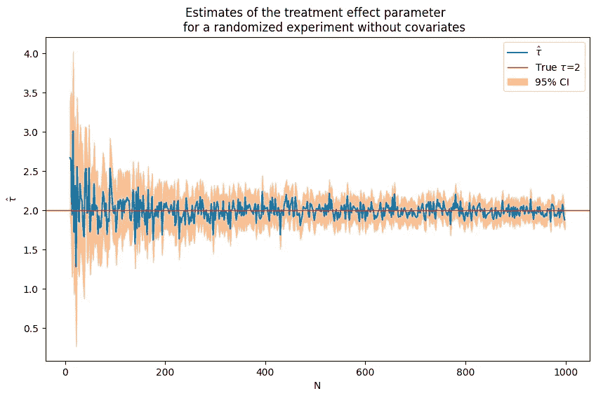
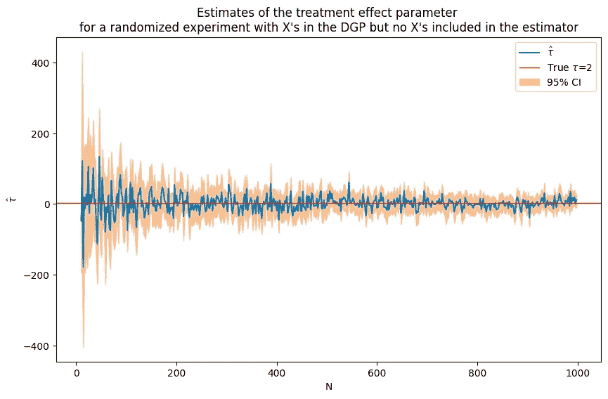
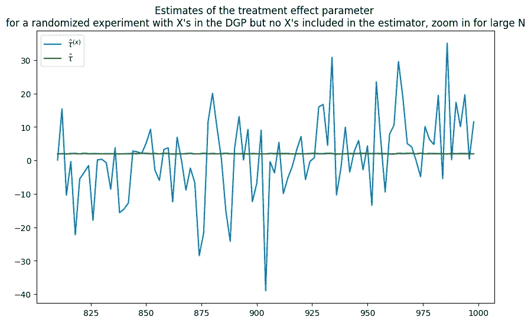
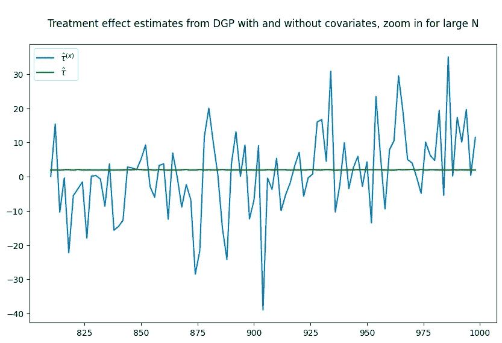
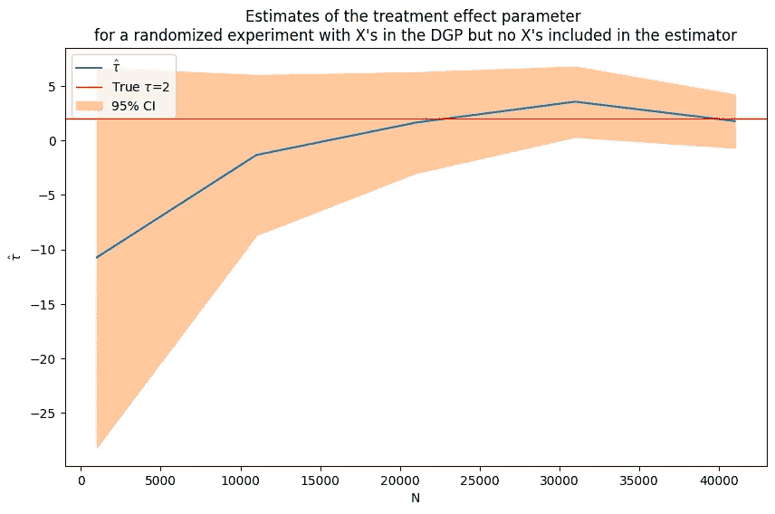
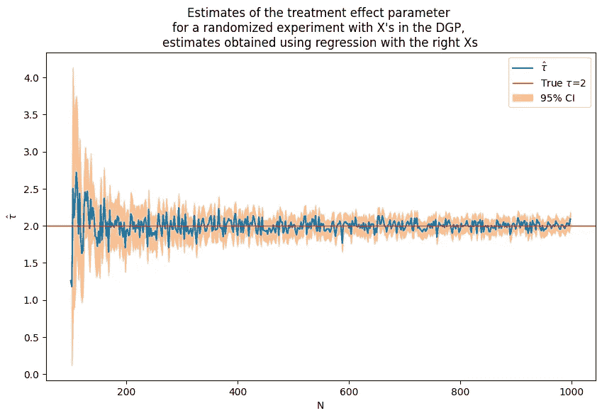
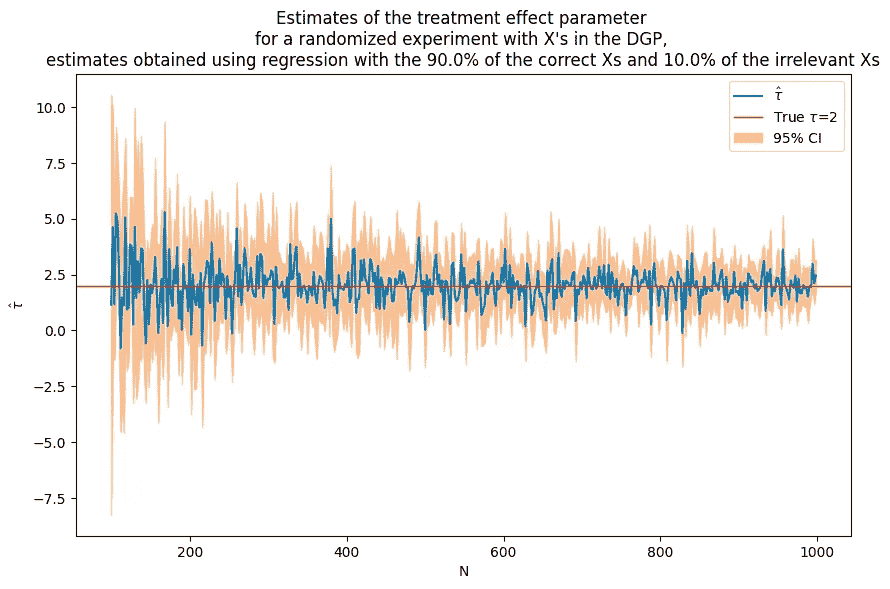

# 初学者指南：通过蒙特卡罗模拟理解 A/B 测试性能

> 原文：[`towardsdatascience.com/a-beginners-guide-to-understanding-a-b-test-performance-through-monte-carlo-simulations-6b1155315376`](https://towardsdatascience.com/a-beginners-guide-to-understanding-a-b-test-performance-through-monte-carlo-simulations-6b1155315376)

[](https://idajohnsson.medium.com/?source=post_page-----6b1155315376--------------------------------)[](https://towardsdatascience.com/?source=post_page-----6b1155315376--------------------------------) [Ida Johnsson, PhD](https://idajohnsson.medium.com/?source=post_page-----6b1155315376--------------------------------)

·发布于 [Towards Data Science](https://towardsdatascience.com/?source=post_page-----6b1155315376--------------------------------) ·16 分钟阅读·2023 年 8 月 5 日

--

本教程探讨了协变量如何在随机实验中影响 A/B 测试的精度。一个适当随机化的 A/B 测试通过比较治疗组和对照组的平均结果来计算提升。然而，除了治疗以外的特征对结果的影响决定了 A/B 测试的统计特性。例如，在测试提升计算中遗漏重要特征可能导致提升估计的不精确，即使随着样本量的增加，它也会收敛到真实值。

你将学习 RMSE、偏差和测试规模是什么，并通过生成模拟数据和运行蒙特卡罗实验来理解 A/B 测试的性能。这种工作有助于了解数据生成过程（DGP）的特性如何影响 A/B 测试的性能，并将帮助你在实际数据上进行 A/B 测试。首先，我们讨论估计量的一些基本统计特性。

# **估计量的统计特性**

## 均方根误差（RMSE）

RMSE（均方根误差）：RMSE 是一个经常使用的衡量模型或估计量预测值与观测值之间差异的指标。它是预测值与实际观测值之间平均平方差异的平方根。RMSE 的公式是：

RMSE = sqrt[(1/n) * Σ(actual - prediction)²]

RMSE 对大误差给予相对较高的权重，因为在平均之前这些误差会被平方，这意味着当大误差不受欢迎时，RMSE 更为有用。

## 偏差

在统计学中，估计量的偏差是该估计量的期望值与被估计参数的真实值之间的差异。一个具有零偏差的估计量被称为无偏的；否则，该估计量被称为有偏的。换句话说，当算法因未能看到准确的潜在关系而始终学习到相同的错误内容时，就会发生偏差。

例如，如果你尝试根据房子的特征预测房价，而你的预测始终比实际价格低$100,000，那么你的模型是有偏的。

## 规模

在统计学中的假设检验中，“检验规模”指的是检验的显著性水平，通常用希腊字母α（alpha）表示。显著性水平或检验规模是检验统计量必须超过的阈值，以拒绝假设。

它表示在零假设实际上为真的情况下，拒绝零假设的概率，这是一种被称为 I 型错误或假阳性的错误。

例如，如果一个检验的显著性水平设为 5%（α = 0.05），这意味着在零假设为真的情况下，有 5%的风险会拒绝零假设。这个水平 0.05 是α的常见选择，尽管其他水平，如 0.01 或 0.10，也可以根据背景和研究领域使用。

检验规模越小，拒绝零假设所需的证据就越强，从而降低了 I 型错误的可能性，但可能会增加 II 型错误的机会（当零假设为假时未能拒绝它）。I 型错误和 II 型错误之间的平衡是设计任何统计检验时的重要考虑因素。

## 实证规模

在通过蒙特卡洛模拟进行的假设检验中，实证规模指的是在零假设为真的情况下，零假设在模拟中被错误拒绝的比例。这本质上是 I 型错误率的模拟版本。

下面是一般的操作流程：

1\. 设置你的零假设并选择一个显著性水平（例如，α = 0.05）。

2\. 在假设零假设为真的情况下生成大量样本。样本的数量通常非常大，如 10,000 或 100,000，以确保结果的稳定性。

对于每个样本，进行假设检验并记录零假设是否被拒绝（你可以将拒绝记录为 1，未拒绝记录为 0）。

4\. 计算实证规模，即在零假设被拒绝的模拟比例。这估计了在给定检验程序下，零假设为真的情况下拒绝零假设的概率。

下面的代码显示了如何实现这一点。

```py
import numpy as np
from scipy.stats import ttest_1samp
import random

random.seed(10)

def calculate_empirical_size(num_simulations: int, sample_size: int, true_mean: float, significance_level: float) -> float:
    """
    Simulates a set of samples and conducts a hypothesis test on each, then calculates the empirical size.

    Parameters:
    num_simulations (int): The number of simulations to run.
    sample_size (int): The size of each simulated sample.
    true_mean (float): The true mean under the null hypothesis.
    significance_level (float): The significance level for the hypothesis tests.

    Returns:
    float: The empirical size, or the proportion of tests where the null hypothesis was rejected.
    """
    import numpy as np
    from scipy.stats import ttest_1samp

    # Initialize counter for null hypothesis rejections
    rejections = 0

    # Run simulations
    np.random.seed(0)  # for reproducibility
    for _ in range(num_simulations):
        sample = np.random.normal(loc=true_mean, scale=1, size=sample_size)
        t_stat, p_value = ttest_1samp(sample, popmean=true_mean)
        if p_value < significance_level:
            rejections += 1

    # Calculate empirical size
    empirical_size = rejections / num_simulations

    return empirical_size

calculate_empirical_size(1000, 1000, 0, 0.05)
```

对于每个 1000 次模拟，从均值为 0 和标准差为 1 的正态分布中抽取一个大小为 1000 的随机样本。进行一次样本 t 检验，以测试样本均值是否显著不同于真实均值（在这种情况下为 0）。如果测试的 p 值小于显著性水平（0.05），则拒绝原假设。

经验规模计算为原假设被拒绝的次数（假阳性次数）除以模拟的总次数。这个值应该在一个良好校准的测试中接近名义显著性水平。在这种情况下，该函数返回经验规模，给出在实际应用中在假设与模拟条件相同的情况下，你可能错误拒绝原假设的频率。

由于随机变异，经验规模可能无法完全匹配名义显著性水平，但如果样本量足够大且测试假设得到满足，它们应该接近。这种经验规模与名义规模之间的差异就是为什么进行这样的模拟研究，以了解名义规模与实际情况的匹配程度。

# **A/B 测试估计的统计性质**

在本节中，你将学习 DGP 的属性以及协变量在 A/B 测试结果估计中的加入如何影响测试的表现。通过下面的代码，你将模拟有或没有协变量的 DGP 的 A/B 测试，并观察测试的表现如何随着是否在估计中包含协变量而变化。

```py
import numpy as np
import random
from matplotlib import pyplot as plt
from tqdm import tqdm
import statsmodels.api as sm

def fn_variance(data: list, ddof: int = 0) -> float:
    """
    Calculate the variance of a given list of data.

    Parameters:
    data (list): The list of data to calculate the variance for.
    ddof (int): Delta Degrees of Freedom. The divisor used in calculations is N - ddof. Default is 0.

    Returns:
    float: The variance of the data.
    """
    n = len(data)
    mean = sum(data) / n
    return sum((x - mean) ** 2 for x in data) / (n - ddof)

def fn_generate_cov(dim: int, corr: float) -> np.ndarray:
    """
    Generate a covariance matrix of a given dimension with a specified correlation.

    Parameters:
    dim (int): The dimension of the covariance matrix.
    corr (float): The correlation value for the off-diagonal entries.

    Returns:
    np.ndarray: The generated covariance matrix.
    """
    acc = []
    for i in range(dim):
        row = np.ones((1, dim)) * corr
        row[0][i] = 1
        acc.append(row)
    return np.concatenate(acc, axis=0)

def fn_generate_multnorm(nobs: int, corr: float, nvar: int) -> np.ndarray:
    """
    Generate a multivariate normal distribution.

    Parameters:
    nobs (int): The number of observations in the distribution.
    corr (float): The correlation coefficient.
    nvar (int): The number of variables in the distribution.

    Returns:
    np.ndarray: The generated multivariate normal distribution.
    """
    mu = np.zeros(nvar)
    std = (np.abs(np.random.normal(loc = 1, scale = .5,size = (nvar,1))))**(1/2)
    # generate random normal distribution
    acc = []
    for i in range(nvar):
        acc.append(np.reshape(np.random.normal(mu[i],std[i],nobs),(nobs,-1)))

    normvars = np.concatenate(acc,axis=1)

    cov = fn_generate_cov(nvar,corr)
    C = np.linalg.cholesky(cov)

    Y = np.transpose(np.dot(C,np.transpose(normvars)))

    return Y

def fn_randomize_treatment(N: int, p: float = 0.5) -> np.ndarray:
    """
    Randomize the treatment assignment for a population.

    Parameters:
    N (int): The total population size.
    p (float): The proportion of the population to be treated. Defaults to 0.5.

    Returns:
    np.ndarray: A binary array where 1 indicates treatment and 0 indicates control.
    """
    treated = random.sample(range(N), round(N*p))
    return np.array([(1 if i in treated else 0) for i in range(N)]).reshape([N,1])

def split_columns(X: np.ndarray, a: float, b: float, p0: int) -> np.ndarray:
    """
    Splits the input array into two sections based on given percentages.

    Parameters:
    X (np.ndarray): The input array of size (n, p).
    a (float): The percentage of the first p0 columns to keep (between 0 and 1).
    b (float): The percentage of the remaining columns to keep (between 0 and 1).
    p0 (int): The index up to which to apply the first percentage.

    Returns:
    np.ndarray: The output array containing a% of the first p0 columns and b% of the remaining columns.
    """
    if not (0 <= a <= 1 and 0 <= b <= 1):
        raise ValueError("a and b must be between 0 and 1.")
    if not (0 <= p0 <= X.shape[1]):
        raise ValueError("p0 must be between 0 and number of columns in X.")

    first_part = X[:, :p0]
    second_part = X[:, p0:]

    first_indices = np.random.choice(first_part.shape[1], int(a * first_part.shape[1]), replace=False)
    second_indices = np.random.choice(second_part.shape[1], int(b * second_part.shape[1]), replace=False)

    return np.concatenate((first_part[:, first_indices], second_part[:, second_indices]), axis=1)

def fn_generate_data(tau: float, N: int, p: int, p0: int, corr: float, flagX: bool = False):
    """
    Generate synthetic data for experimentation.

    Parameters:
    tau (float): Treatment effect.
    N (int): Number of observations.
    p (int): Number of covariates.
    p0 (int): Number of covariates with nonzero coefficients.
    corr (float): Correlation for multivariate normal.
    flagX (bool): If True, return covariates. Defaults to False.

    Returns:
    tuple: Depending on flagX, either returns (Yab,T) or (Yab,T,X).
    """

    X = fn_generate_multnorm(N,corr,p)

    T = fn_randomize_treatment(N) # choose treated units
    err = np.random.normal(0,1,[N,1])
    beta0 = np.random.normal(5,5,[p,1])

    beta0[p0:p] = 0 #set the coefficient of all covariates after p0 to 0
    Yab = tau*T+X@beta0+err
    if flagX==False:
        return (Yab,T)
    else:
        return (Yab,T,X)

def fn_tauhat_means(Yt: np.ndarray, Yc: np.ndarray) -> tuple:
    """
    Calculate the treatment effect estimate and its standard error.

    Parameters:
    Yt (np.ndarray): Outcome for treated units.
    Yc (np.ndarray): Outcome for control units.

    Returns:
    tuple: The treatment effect estimate and its standard error.
    """
    nt = len(Yt)
    nc = len(Yc)
    tauhat = np.mean(Yt)-np.mean(Yc)
    se_tauhat = (np.var(Yt,ddof=1)/nt+np.var(Yc,ddof=1)/nc)**(1/2)
    return (tauhat,se_tauhat)

def fn_bias_rmse_size(theta0: float, thetahat: float, se_thetahat: float, cval: float = 1.96) -> tuple:
    """
    Calculate bias, RMSE, and test size for the parameter estimate.

    Parameters:
    theta0 (float): The true parameter value.
    thetahat (float): The estimated parameter value.
    se_thetahat (float): The standard error of the estimated parameter value.
    cval (float): The critical value for the hypothesis test. Defaults to 1.96.

    Returns:
    tuple: The bias, RMSE, and test size for the parameter estimate.
    """
    b = thetahat - theta0
    bias = np.mean(b)
    rmse = np.sqrt(np.mean(b**2))
    tval = b/se_thetahat
    size = np.mean(1*(np.abs(tval)>cval))
    # note size calculated at true parameter value
    return (bias,rmse,size)

def fn_run_experiments(tau: float, Nrange: list, p: int, p0: int, corr: float, flagX: bool = False, a: float = None, b: float = None) -> tuple:
    """
    Run experiments by generating synthetic data and estimate treatment effect.

    Parameters:
    tau (float): Treatment effect.
    Nrange (list): Range of number of observations.
    p (int): Total number of covariates.
    p0 (int): Number of covariates with nonzero coefficients.
    a (float, optional): Percentage of the first p0 columns to keep (between 0 and 1). Only used if flagX is True.
    b (float, optional): Percentage of the remaining columns to keep (between 0 and 1). Only used if flagX is True.
    corr (float): Correlation for multivariate normal.
    flagX (bool): If True, return covariates. Defaults to False.

    Returns:
    tuple: The treatment effect estimates and their standard errors, and 95% confidence interval.

    Note:
    In the flagX == 2 case, the function uses the split_columns function to select a% of the first p0 columns 
    and b% of the remaining columns from the X data, before performing the regression and estimating the treatment effect.
    """
    n_values = []
    tauhats = []
    sehats = []
    lb = []
    ub = []
    for N in tqdm(Nrange):
        n_values = n_values + [N]
        if flagX==False:
            Yexp,T = fn_generate_data(tau,N,p,p0,corr,flagX)
            Yt = Yexp[np.where(T==1)[0],:]
            Yc = Yexp[np.where(T==0)[0],:]
            tauhat,se_tauhat = fn_tauhat_means(Yt,Yc)            
        elif flagX==1:
            # use the correct covariates in regression
            Yexp,T,X = fn_generate_data(tau,N,p,p0,corr,flagX)
            covars = np.concatenate([T,X],axis = 1)
            mod = sm.OLS(Yexp,covars)
            res = mod.fit()
            tauhat = res.params[0]
            se_tauhat = res.HC1_se[0]
        elif flagX==2:
            # use fraction a of the correct covariates and fraction b of the remaining covariates
            assert a is not None and b is not None, "Please provide valid 'a' and 'b' when flagX is 2"

            Yexp,T,X = fn_generate_data(tau,N,p,p0,corr,flagX)

            Xreg = split_columns(X,a,b,p0)

            covars = np.concatenate([T,Xreg],axis = 1)
            mod = sm.OLS(Yexp,covars)
            res = mod.fit()
            tauhat = res.params[0]
            se_tauhat = res.HC1_se[0]

        tauhats = tauhats + [tauhat]
        sehats = sehats + [se_tauhat]    
        lb = lb + [tauhat-1.96*se_tauhat]
        ub = ub + [tauhat+1.96*se_tauhat]

    return (n_values,tauhats,sehats,lb,ub)

def fn_plot_with_ci(n_values: list, tauhats: list, tau: float, lb: list, ub: list, caption: str):
    """
    Plot the treatment effect estimates and their 95% confidence intervals.

    Parameters:
    n_values (list): List of number of observations.
    tauhats (list): List of treatment effect estimates.
    tau (float): True treatment effect.
    lb (list): List of lower bounds of the confidence intervals.
    ub (list): List of upper bounds of the confidence intervals.
    caption (str): Title for the plot.
    """
    fig = plt.figure(figsize = (10,6))
    plt.plot(n_values,tauhats,label = '$\hat{\\tau}$')
    plt.xlabel('N')
    plt.ylabel('$\hat{\\tau}$')
    plt.axhline(y=tau, color='r', linestyle='-',linewidth=1,
                label='True $\\tau$={}'.format(tau))
    plt.title('{}'.format(caption))
    plt.fill_between(n_values, lb, ub,
        alpha=0.5, edgecolor='#FF9848', facecolor='#FF9848',label = '95% CI')
    plt.legend()
```

## 无协变量的 DGP 实验

以下我们模拟数据，这些数据遵循一个 DGP，其中结果仅受处理和随机误差的影响。

`y_i = tau*T_i+e_i`

如果结果仅受到处理的影响，即使对于相对较小的样本量，处理效应参数的估计也是准确的，并且随着样本量的增加很快就会收敛到真实的参数值。在下面的代码中，参数 `tau` 的值设置为 2。

```py
tau = 2
corr = .5
p = 10
p0 = 0 # number of covariates used in the DGP
Nrange = range(10,1000,2) # loop over N values
(nvalues,tauhats,sehats,lb,ub) = fn_run_experiments(tau,Nrange,p,p0,corr)

caption = """Estimates of the treatment effect parameter 
    for a randomized experiment without covariates"""
fn_plot_with_ci(nvalues,tauhats,tau,lb,ub,caption)
```



## 对于选定的样本量，验证这与进行包含截距的回归分析是一样的。

你可以通过对结果进行一个截距和处理的 OLS 回归来验证你获得了相同的结果。

```py
N = 100
Yexp,T = fn_generate_data(tau,N,10,0,corr)
Yt = Yexp[np.where(T==1)[0],:]
Yc = Yexp[np.where(T==0)[0],:]
tauhat,se_tauhat = fn_tauhat_means(Yt,Yc)
# n_values = n_values + [N]
# tauhats = tauhats + [tauhat]
lb = lb + [tauhat-1.96*se_tauhat]
ub = ub + [tauhat+1.96*se_tauhat]

print(f"Parameter estimate and stadard error obtained by calculating the difference in means:{tauhat:.5f},{se_tauhat:.5f}")

const = np.ones([N,1])

model = sm.OLS(Yexp,np.concatenate([T,const],axis = 1))
res = model.fit()

print(f"Parameter estimate and stadard error obtained by running an OLS regression with an intercept:{res.params[0]:.5f},{ res.HC1_se[0]:.5f}")
```

```py
Parameter estimate and stadard error obtained by calculating the difference in means:1.91756,0.21187
Parameter estimate and stadard error obtained by running an OLS regression with an intercept:1.91756,0.21187
```

## 运行 R 的蒙特卡洛迭代，计算偏差、均方根误差（RMSE）和规模

现在你将进行蒙特卡洛模拟，通过循环遍历 `N` 参数的值列表来增加样本量。你将计算每次迭代的测试 RMSE、偏差和经验规模。

这个 Python 脚本进行了一次实验模拟，研究样本量（`N`）在不考虑协变量的情况下如何影响 A/B 测试性能的偏差、RMSE 和规模。我们逐步解析如下：

1\. `estDict = {}` 初始化一个空字典以存储实验结果。

2\. `R=2000` 设置实验的重复次数为 2000。

3\. `for N in [10,50,100,500,1000]` 遍历不同的样本大小。

4\. 在这个循环中，`tauhats=[], sehats=[]` 被初始化为空列表，用于存储每次实验的估计处理效应 `tauhat`及其对应的标准误差 `se_tauhat`。

5\. `for r in tqdm(range(R)):` 遍历 R 次实验，`tqdm` 提供进度条。

6\. `Yexp,T = fn_generate_data(tau,N,10,0,corr)` 为每次实验生成合成数据，具有预定义的处理效应 `tau`、观测数 `N`、10 个协变量、没有非零系数的协变量，以及预定义的相关性。

7\. `Yt=Yexp[np.where(T==1)[0],:]`和 `Yc=Yexp[np.where(T==0)[0],;]`将合成数据分成处理组和对照组。

8\. `tauhat,se_tauhat=fn_tauhat_means(Yt,Yc)` 计算处理效应估计值及其标准误差。

9\. `tauhats=tauhats+[tauhat]` 和 `sehats=sehats+[se_tauhat]` 将处理效应估计值及其标准误差附加到对应的列表中。

10\. `estDict[N]={‘tauhat':np.array(tauhats).reshape([len(tauahts),1]),’sehat':np.array(sehats).reshape([len(sehats),1])}`将估计值存储在字典中，样本大小作为键。

11\. `tau0 = tau*np.ones([R,1])` 创建一个大小为 R 的数组，所有元素等于真实的处理效应。

12\. 对于 `estDict` 中的每个样本大小，脚本计算并打印使用 `fn_bias_rmse_size()` 函数的偏差、RMSE 和处理效应估计的大小。

正如预期的那样，随着样本大小的增加，偏差和 RMSE 降低，大小接近真实大小 0.05。

```py
estDict = {}
R = 2000
for N in [10,50,100,500,1000]:
    tauhats = []
    sehats = []
    for r in tqdm(range(R)):
        Yexp,T = fn_generate_data(tau,N,10,0,corr)
        Yt = Yexp[np.where(T==1)[0],:]
        Yc = Yexp[np.where(T==0)[0],:]
        tauhat,se_tauhat = fn_tauhat_means(Yt,Yc)
        tauhats = tauhats + [tauhat]
        sehats = sehats + [se_tauhat]
    estDict[N] = {
        'tauhat':np.array(tauhats).reshape([len(tauhats),1]),
        'sehat':np.array(sehats).reshape([len(sehats),1])
    }

tau0 = tau*np.ones([R,1])
for N, results in estDict.items():
    (bias,rmse,size) = fn_bias_rmse_size(tau0,results['tauhat'],
                                         results['sehat'])
    print(f'N={N}: bias={bias}, RMSE={rmse}, size={size}')
```

```py
100%|██████████| 2000/2000 [00:00<00:00, 3182.81it/s]
100%|██████████| 2000/2000 [00:00<00:00, 2729.99it/s]
100%|██████████| 2000/2000 [00:00<00:00, 2238.62it/s]
100%|██████████| 2000/2000 [00:04<00:00, 479.67it/s]
100%|██████████| 2000/2000 [02:16<00:00, 14.67it/s]
N=10: bias=0.038139125088721144, RMSE=0.6593256331782233, size=0.084
N=50: bias=0.002694446014687934, RMSE=0.29664599979723183, size=0.0635
N=100: bias=-0.0006785229668018156, RMSE=0.20246779253127453, size=0.0615
N=500: bias=-0.0009696751953095926, RMSE=0.08985542730497854, size=0.062
N=1000: bias=-0.0011137216061364087, RMSE=0.06156258265280801, size=0.047
```

## 在 DGP 中进行的协变量实验

接下来，你将向 DGP 添加协变量。现在感兴趣的结果不仅依赖于处理，还依赖于一些其他变量 `X`。下面的代码模拟了包含 50 个协变量的 DGP。使用与之前无协变量模拟相同的样本大小和处理效应参数，可以看到这次估计值噪声更大，但仍然趋向于正确的解。

`y_i = tau*T_i + beta*x_i + e_i`

下图比较了两个 DGP 的估计值——你可以看到，当在 DGP 中引入协变量时，估计值的噪声增加了。

```py
tau = 2
corr = .5
p = 100
p0 = 50 # number of covariates used in the DGP
Nrange = range(10,1000,2) # loop over N values
(nvalues_x,tauhats_x,sehats_x,lb_x,ub_x) = fn_run_experiments(tau,Nrange,p,p0,corr)

caption = """Estimates of the treatment effect parameter 
for a randomized experiment with X's in the DGP but no X's included in the estimator"""
fn_plot_with_ci(nvalues_x,tauhats_x,tau,lb_x,ub_x,caption)

# rerun experiment with no covariates
p0 = 0 # number of covariates used in the DGP
Nrange = range(10,1000,2) # loop over N values
(nvalues_x0,tauhats_x0,sehats_x0,lb_x0,ub_x0) = fn_run_experiments(tau,Nrange,p,p0,corr)

fig = plt.figure(figsize = (10,6))
plt.title("""Estimates of the treatment effect parameter 
for a randomized experiment with X's in the DGP but no X's included in the estimator, zoom in for large N""")
plt.plot(nvalues_x[400:],tauhats_x[400:],label = '$\hat{\\tau}^{(x)}$')
plt.plot(nvalues_x[400:],tauhats_x0[400:],label = '$\hat{\\tau}$',color = 'green')
plt.legend()

fig = plt.figure(figsize = (10,6))
plt.title("""
Treatment effect estimates from DGP with and without covariates, zoom in for large N
""")
plt.plot(nvalues_x[400:],tauhats_x[400:],label = '$\hat{\\tau}^{(x)}$')
plt.plot(nvalues_x[400:],tauhats_x0[400:],label = '$\hat{\\tau}$',color = 'green')
plt.legend()
```

```py
100%|██████████| 495/495 [00:41<00:00, 12.06it/s]
100%|██████████| 495/495 [00:42<00:00, 11.70it/s]
```



重复实验时使用更大的样本大小是否能缓解问题？不一定。尽管样本大小增加，估计值仍然相当嘈杂。

```py
tau = 2
corr = .5
p = 100
p0 = 50 # number of covariates used in the DGP
Nrange = range(1000,50000,10000) # loop over N values
(nvalues_x2,tauhats_x2,sehats_x2,lb_x2,ub_x2) = fn_run_experiments(tau,Nrange,p,p0,corr)

fn_plot_with_ci(nvalues_x2,tauhats_x2,tau,lb_x2,ub_x2,caption)
```



## DGP with X — 在回归中添加协变量

在这一部分，你将使用与之前相同的 DGP：

`y_i = tau*T_i + beta*x_i + e_i`

现在，你将把这些协变量`X`包含在回归模型中。你会发现这显著提高了估计的精度。然而，请记住，这有点像是“作弊”——在这种情况下，你从一开始就包含了正确的协变量。

在现实世界的情境中，你可能不知道哪些协变量是“正确”的，可能需要尝试不同的模型和协变量。

```py
tau = 2
corr = .5
p = 100
p0 = 50 # number of covariates used in the DGP
Nrange = range(100,1000,2) # loop over N values
# we need to start with more observations than p
flagX = 1
(nvalues2,tauhats2,sehats2,lb2,ub2) = fn_run_experiments(tau,Nrange,p,p0,corr,flagX)

caption = """Estimates of the treatment effect parameter 
for a randomized experiment with X's in the DGP, 
estimates obtained using regression with the right Xs"""
fn_plot_with_ci(nvalues2,tauhats2,tau,lb2,ub2,caption)
```



## **如果你使用一些会影响结果的 X 和一些不会影响结果的 X，会发生什么？**

本节探讨了在回归模型中包含一些相关的和一些不相关的协变量。这模拟了一个现实世界的情境，在这种情境下，可能不清楚哪些协变量会影响结果。

尽管包含了一些无影响的变量，但可以观察到，与没有包含任何协变量的情况相比，整体估计趋向于改善。然而，包含不相关的变量可能会引入一些噪声和不确定性，使得估计可能不如仅包含相关协变量时那样精确。

总之，理解数据中协变量的影响对于提高 A/B 测试结果的精度和可靠性至关重要。本教程探讨了像 RMSE、偏差和规模这样的估计量的统计特性，并演示了如何通过蒙特卡洛模拟来估计和理解它们。它还强调了在 DGP 和回归模型中包含协变量的影响，突出了在实践中仔细选择模型和假设检验的重要性。

```py
# Use same DGP as before
tau = 2
corr = .5
p = 100
p0 = 50 # number of covariates used in the DGP
a = 0.9
b = 0.1
Nrange = range(100,1000,2) # loop over N values
# we need to start with more observations than p
flagX = 2
(nvalues3,tauhats3,sehats3,lb3,ub3) = fn_run_experiments(tau,Nrange,p,p0,corr,flagX,a,b)

caption = f"""Estimates of the treatment effect parameter 
for a randomized experiment with X's in the DGP, 
estimates obtained using regression with the {100*a:.1f}% of the correct Xs and {100*b:.1f}% of the irrelevant Xs"""
fn_plot_with_ci(nvalues3,tauhats3,tau,lb3,ub3,caption)
```



除非另有说明，所有图像均由作者提供。
