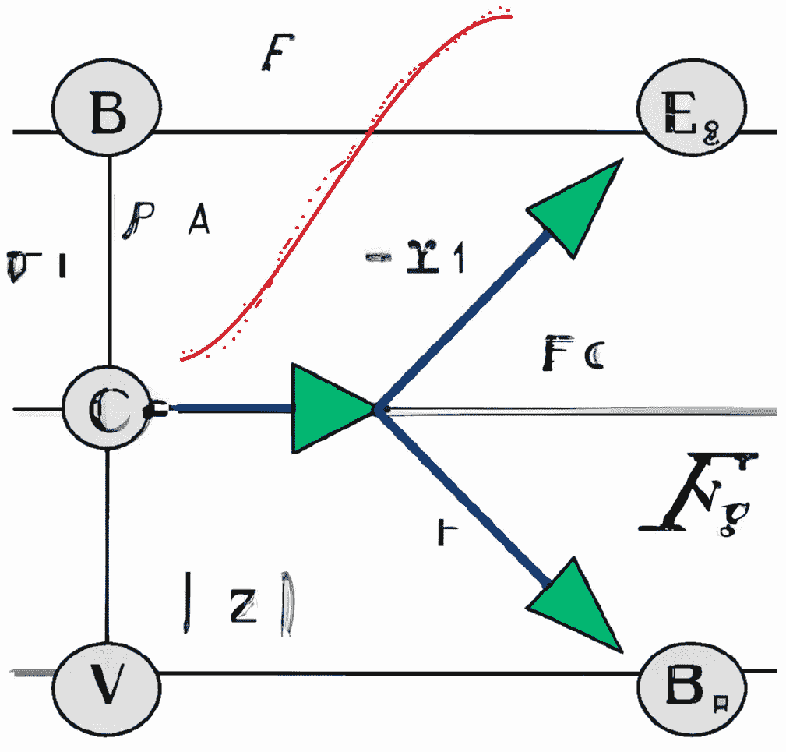

# 一种更好的符号回归方法，通过明确考虑单位

> 原文：[`towardsdatascience.com/a-better-symbolic-regression-method-by-explicitly-considering-units-35b3630165b`](https://towardsdatascience.com/a-better-symbolic-regression-method-by-explicitly-considering-units-35b3630165b)

## 通过提供根植于基本概念的更具可解释性的模型，有助于将机器学习与经典科学和工程方法相结合

 [LucianoSphere (Luciano Abriata, PhD)](https://lucianosphere.medium.com/?source=post_page-----35b3630165b--------------------------------)

·发表于 [Towards Data Science](https://towardsdatascience.com/?source=post_page-----35b3630165b--------------------------------) ·7 分钟阅读·2023 年 3 月 16 日

--

图由作者通过结合不同的 Dall-E-2 生成图像创建。

**符号回归是一种技术，帮助我们理解不同数据之间的关系，通过找到描述这些关系的数学方程。我对符号回归方法充满期待，并且大力支持它们，因为通过提供明确的方程，它们原则上是高度可解释的，以直接的方式 - 这与大多数现代 AI 模型形成对比，后者像黑箱一样运作，我们无法理解其工作原理和原因，从而难以知道它们如何以及为什么有效。**

**由 Tenachi 等人提出的新工作，现已在 arXiv 上以预印本形式发布，提出了一种新方法，该方法利用深度强化学习来寻找数据集变量的方程，同时考虑数据相关的单位。这种方法有助于消除物理上不可能的解，并通过限制方程生成器的自由度来提高性能。**

## 索引

**-** **介绍** **-** **关于符号回归及介绍新方法** **-** **新符号回归方法的工作原理** **-** **总结说明、预印本和代码**

# 介绍

自然科学和工程学中的一个基本问题是发现给定系统的自变量和因变量之间的定量关系。虽然可以通过类似黑箱模型的现代常规人工智能方法完美地建模这些关系，但更理想的方式是通过符号方程量化这些关系，比如说 *a=F/m* 或 *I=I0exp(-kt)*。

为什么？好吧，有很多原因：

+   方程是可解释的，因此对人类思维来说更易理解，可能甚至通过已经知道的科学或工程概念来连接变量之间的关系。例如，在 *a=F/m* 中，我们可以直接理解施加更强的力会使物体加速更快，以线性方式表现；而在 *I=Ioexp(-kt)* 中，我们知道因变量的衰减是随着时间的指数变化，从中我们可以利用数学得到半衰期时间的方程、线性化形式（通过对数）等。

+   如果可以用简单的术语解释，连接变量的方程有很大可能直接与被建模的科学或工程问题的基础概念、想法和公理相关。例如，考虑应用于放射性衰变的 *I=I0exp(-kt)*，从其导数 (*dI/dt = -kt*) 我们可以理解同位素衰变的速率与样本中剩余的放射性核数成正比，因此这是一个一级过程。

+   通过方程传播自变量（输入）以建模结果变量（因变量）是一种极其快速的计算，几乎是即时的，相比之下，将输入传播通过神经网络的所有单元则更为复杂。这对个别预测可能没有影响，但在需要进行大量预测时可能很重要。此外，通过符号方式关联变量的方程可以通过简单地插入拟合方程来无缝集成到其他程序中。例如，查看一个很好的用例 这里。

+   重要的是，分析地关联变量的方程可能在输入数据采样的领域之外更安全地进行外推。

对于常规的机器学习模型，这些点通常不适用，至少不是以如此直接的方式，因为这些模型通过大量嵌套函数和组合来混合和卷积信号，直到它们能够正确建模因变量，虽然这些模型可能表现得非常好，但解释性往往很差——如果有的话。

上述解释说明了当一个关系可以通过方程建模时，你最好选择这种方法。但当你找不到数学表达式来关联变量时，会发生什么呢？这时你可以尝试常规神经网络，或者尝试符号回归。

# 关于符号回归，并介绍新方法

符号回归的目标是找到适合给定数据集变量的自由形式符号解析函数，这比仅仅在线性或非线性函数中拟合系数的方法要更为通用。简单来说，符号回归不仅是拟合方程，更是找到它们的表达式（然后是拟合其中的系数）。从介绍中总结但用不同术语表述，符号回归的优势包括紧凑性、泛化能力（这意味着如果正确，解析表达式在训练范围外的外推能力会更强）以及可理解性和可解释性。

为了明确这些优势，并理解符号回归在建模数据集中的作用，请查看我从近期文献中涉及的符号回归在科学应用中的最新进展和示例：

[## 符号回归的实际应用](https://towardsdatascience.com/real-world-applications-of-symbolic-regression-2025d17b88ef?source=post_page-----35b3630165b--------------------------------)

### 比起常规神经网络，这种方法较少像黑箱，提供的模型不仅预测数据，还能进行合理化…

[## 谷歌提出新的方法推导量子力学术语的解析表达式…](https://towardsdatascience.com/google-proposes-new-method-to-derive-analytical-expressions-for-terms-in-quantum-mechanics-d70fff6e1ef2?source=post_page-----35b3630165b--------------------------------)

### 该新方法以符号形式推导准确的泛函（量子力学计算的元素），因此…

[谷歌提出新的方法推导量子力学术语的解析表达式](https://towardsdatascience.com/google-proposes-new-method-to-derive-analytical-expressions-for-terms-in-quantum-mechanics-d70fff6e1ef2?source=post_page-----35b3630165b--------------------------------)

不幸的是，实现符号回归以发现新的物理定律是极具挑战性的。更难的是获得紧凑且简单的方程，这些方程可以真正用基础科学或工程概念进行解释。我强调这一点是因为许多符号回归模型提出的方程非常复杂，以至于很难解释，并且与标准机器学习模型相比几乎没有或根本没有贡献。而在最成功的案例中，找到足够简单的方程通常需要很长的执行时间，因为程序需要探索可能的数学操作的巨大树的不同分支，这些操作必须组合并测试以构建可能的方程。

最后这两点，即对简化方程的需求和可能快速收敛到这些方程，是 Tenachi 等人新工作的主要动机。以下是他们的主要贡献：作者意识到，通过符号回归程序连接的变量的单位对方程的形状施加了强有力的约束。他们探索了如何利用这一事实来优化方程搜索，从而提出了一种将物理单位信息纳入符号回归程序的具体框架。

> 作者意识到，通过符号回归程序连接的变量的单位对他们寻找的方程的形状施加了强有力的约束。他们利用这一点来优化方程搜索，并提出了一种将物理单位信息纳入符号回归程序的框架。

通过在方程搜索过程中将单位作为约束，新框架有效地解决了试验表达式的巨大搜索空间的组合挑战。搜索空间显著缩小，结果是方程搜索速度更快。此外，作者发现该程序生成的表达式更简单，因此比其他符号回归方法获得的表达式更易解释且更准确。

# 新的符号回归方法如何工作

其核心是框架包括一种新颖的符号嵌入，这里针对物理学进行了调整，但原则上可以更广泛地扩展，这使得能够控制在部分组合的数学表达式中生成的每个符号的单位。这使得程序能够自动将搜索空间引导到单位保持一致的路径上。当程序运行时，它使用递归神经网络生成解析表达式，并在单位约束下通过强化学习的步骤进行循环，从而得到物理上有意义的输入变量组合。

更详细地说，该过程首先通过使用二叉树生成符号表达式，其中每个节点表示库中可用符号的一个符号。表达式被视为类别向量的序列，并使用递归神经网络生成标记序列。（顺便说一下，这些类别向量可以被人为调整以纳入先验知识；在这一阶段采用了一些先验，例如限制分析表达式的最大可能大小，允许不超过两级的嵌套三角函数操作，并且不允许指数和对数运算符的自我嵌套，这在科学中是不寻常的，等等。）

生成的表达式受到物理单位约束，这些约束通过一种程序进行计算，该程序在可能的情况下计算所需的单位，否则将其留作自由。然后，在强化学习部分，生成一组试验符号函数，并通过与数据对比计算每个函数的奖励。网络随后需要生成一批新的试验函数，通过强化与高奖励值相关的行为来鼓励生成更好的结果。这种方法强化基于不仅是强化网络的输出，还基于从先验分布得出的局部单位约束的候选项，这确保了标记选择的物理正确性。

值得注意的是，该方法允许候选函数包含具有固定单位的常数，但数值自由，从而可以模拟问题中存在一些未知物理尺度的情况。最后，常数的最佳值通过使用标准优化程序的梯度下降找到。

# 结论、预印本和代码

在展示了新方法在一系列天体物理学示例中的有效性后，这项新工作的作者旨在为其他物理科学构建一个强大的通用符号回归算法。

你可以在 arXiv 上阅读完整的预印本：

 [## 深度符号回归与单位约束：朝着自动化发现…

### 符号回归是研究自动化搜索与数据拟合的解析表达式的算法。虽然…

arxiv.org](https://arxiv.org/abs/2303.03192?source=post_page-----35b3630165b--------------------------------)

你可以在这里尝试该程序：

 [## GitHub - WassimTenachi/PhySO: 物理符号优化

### 物理符号回归（$\Phi$-SO）包 physo 是一个完全利用…

[github.com](https://github.com/WassimTenachi/PhySO?source=post_page-----35b3630165b--------------------------------)

你还可能会觉得预印本的首席作者的演讲很有用，以及他在推特上发布的讨论：

正如 Tenachi 在他的推特讨论中总结的那样，

> 虽然神经网络是建模物理系统的出色工具，但它们缺乏可解释性和泛化能力。[新方法] 提供了打开这些黑箱并恢复基本方程的机会，作为物理学家，我们都知道并喜爱这些方程。

[***www.lucianoabriata.com***](https://www.lucianoabriata.com/) *我写作和拍摄的内容涵盖了我广泛兴趣领域中的一切：自然、科学、技术、编程等。* [***成为 Medium 会员***](https://lucianosphere.medium.com/membership) *以访问所有故事（平台的关联链接，为我带来少量收入，但对你没有费用），并且* [***订阅获取我的新故事***](https://lucianosphere.medium.com/subscribe) ***通过电子邮件****。要* ***咨询关于小工作，*** *请查看我的* [***服务页面在这里***](https://lucianoabriata.altervista.org/services/index.html)*。你也可以* [***在这里联系我***](https://lucianoabriata.altervista.org/office/contact.html)***。***
