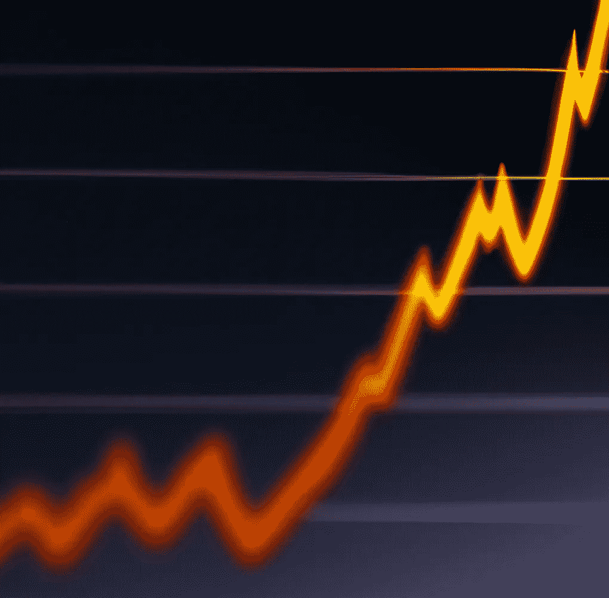
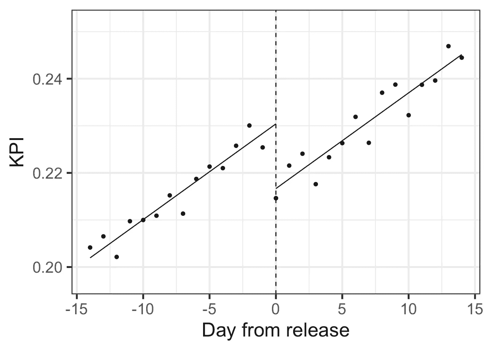
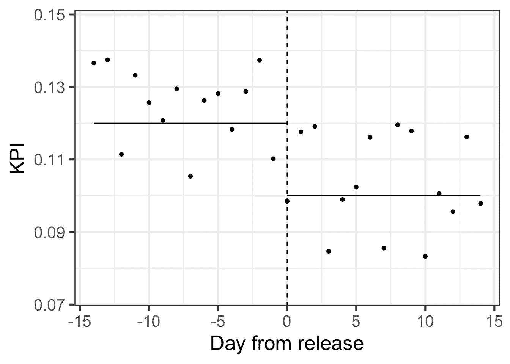
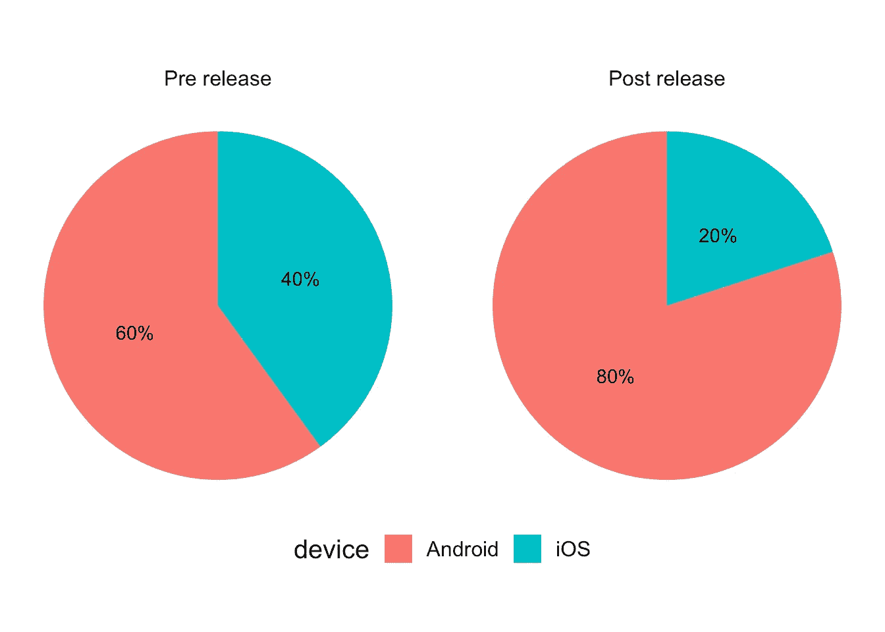
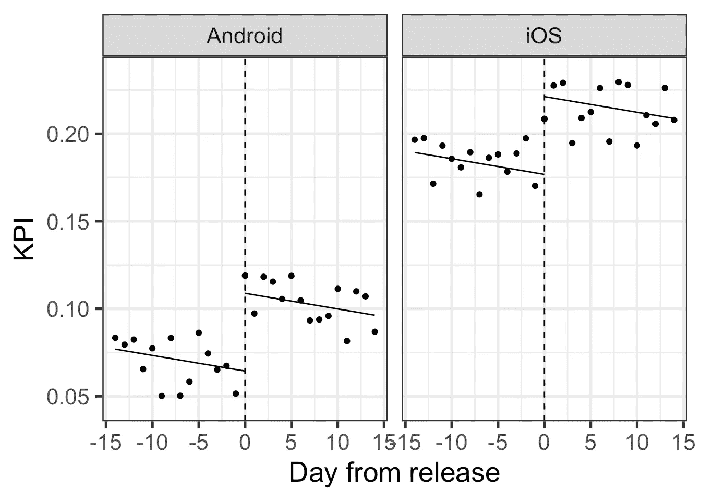
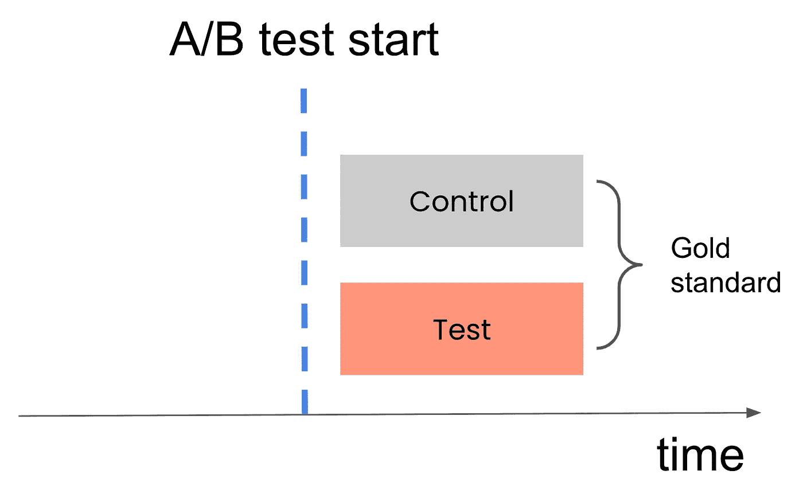
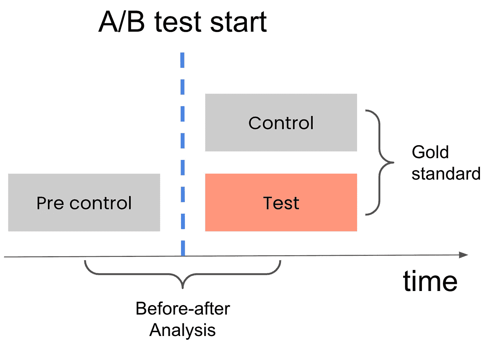

# 更好的分析功能发布影响的方法

> 原文：[`towardsdatascience.com/a-better-way-to-analyze-feature-release-impact-72529f907ccd?source=collection_archive---------14-----------------------#2023-05-23`](https://towardsdatascience.com/a-better-way-to-analyze-feature-release-impact-72529f907ccd?source=collection_archive---------14-----------------------#2023-05-23)

## 或者——为什么简单的“前后”比较可能导致糟糕的产品决策

 [Iyar Lin](https://iyarlin.medium.com/?source=post_page-----72529f907ccd--------------------------------)

·

[关注](https://medium.com/m/signin?actionUrl=https%3A%2F%2Fmedium.com%2F_%2Fsubscribe%2Fuser%2F407629a566a2&operation=register&redirect=https%3A%2F%2Ftowardsdatascience.com%2Fa-better-way-to-analyze-feature-release-impact-72529f907ccd&user=Iyar+Lin&userId=407629a566a2&source=post_page-407629a566a2----72529f907ccd---------------------post_header-----------) 发表在 [Towards Data Science](https://towardsdatascience.com/?source=post_page-----72529f907ccd--------------------------------) ·5 分钟阅读·2023 年 5 月 23 日

--

作者提供的照片 — 使用 DALL-E 2

A/B 测试是估计产品分析中因果效应的金标准。但在许多情况下，它们并不可行。最常见的情况之一是功能发布。

在这篇文章中，我将讨论使用简单的“前后”比较来衡量功能发布影响的常见做法，以及这些分析中常见的偏差。我还会提供一些建议，说明如何减轻这些偏差。

# 一些背景信息

很多时候，公司在发布新产品功能或应用版本时，未进行 A/B 测试来评估其对主要 KPI 的影响。这可能由于各种原因，如流量较低或技术复杂性较高。

在特定日期将功能部署给所有用户后，产品经理通常会通过简单的“前后”分析来评估功能发布的影响：比较发布后短时间内的 KPI 与发布前相同时间段的 KPI。

尽管直观，但这种幼稚的比较可能忽略重要的偏差来源。

以下我将讨论简单的前后分析中最常见的两个偏差来源及其如何导致错误结论。

# 偏差 1：时间效应

一个常见的情况是产品经理进行“前后”分析并获得积极的结果。

然而，查看 KPI 随时间变化的图表时，他们可能会遇到令人失望的结论：

作者提供的照片

无论发布如何，KPI 在整个时期内都呈上升趋势，而发布本身似乎有负面影响。简单的“前后”比较假设没有时间动态，这可能是非常错误的，就像上面所示的情况一样。

# 偏差 2：业务组合的变化

尽管时间效应引入的偏差可能非常明显，但其他的可能更为微妙。

在另一种情况下，产品经理可能会测得负面的“前后”发布影响。绘制 KPI 随时间变化的图表似乎没有提供替代结论：

作者提供的照片

许多公司会在这里停下，假设发布效果不好，需要回滚。

然而，在许多情况下，发布前后期间的差异可能是由于用户组合的变化。这可能是偶然发生的，但通常与伴随功能发布的营销活动有关。

为了使例子具体化，可能是在发布后的某一时期，Android 用户的比例显著上升，相比于发布前的时期。

作者提供的照片

在这个具体的例子中，那些 Android 用户的转化率往往低于 iOS 用户，但这些组内的发布效果实际上是积极的：

作者提供的照片

因此，考虑到设备因素，发布的影响实际上是积极的。总体差异与组内差异相反的情况是[辛普森悖论](https://en.wikipedia.org/wiki/Simpson%27s_paradox)的经典例子。

# 这是否意味着我们不能没有 A/B 测试？

上述情况相对简单。时间效应可能包括复杂的趋势和每日季节性变化，细分比例变化可能更微妙，并且分布在许多子集中。

可能会给人一种分析功能发布数据毫无意义的印象。然而，我认为情况不一定是这样。

# 引入发布影响算法

在[Loops](https://getloops.ai/)工作时，我设计了一个算法来自动和透明地处理上述偏差。由于业务和知识产权原因，我无法分享完整的实现细节，但以下是一个总体概述：

1.  使用 ML 算法找到在发布前后期间中比例变化最大的细分市场。

1.  在每个细分市场中，**分别**建模时间趋势和季节性以及发布影响。

1.  对所有细分市场内估计的发布影响进行加权平均，以得出最终的影响估计。

# 测试算法的有效性

你无法确定任何方法是否适用于特定的数据集。然而，你可以通过使用过去的 A/B 测试来获得粗略估计。

例如，执行了一个包含控制组和处理组的 A/B 测试。比较这两个组之间的平均 KPI 可以得到对处理影响的**无偏**估计。这作为我们的“金标准”。

我们将测试前的用户段命名为“前控制”。将前控制人群与处理人群进行比较类似于我们在前后分析中所做的比较。

使用多种不同的测试，我们可以将“金标准”估计与“前后”估计进行比较，看看它们的接近程度。

在[Loops](https://getloops.ai/)工作时，我可以访问来自数十个客户使用我们系统的数百个 A/B 测试。使用上述基准方法，我们发现该算法的准确性远远优于简单的“前后”比较。

# 总结

我希望到此时读者已经意识到使用简单的“前后”比较方法的风险，并且上述算法将为任何希望更好地评估功能发布影响的人提供基础。

*这篇文章的修改版已于* [*https://getloops.ai*](https://getloops.ai/the-false-sense-of-confidence-with-before-after-analysis/) *在 2023 年 5 月 11 日发布。*
