# 线性代数的全景视角：为什么矩阵乘法是这样的？

> 原文：[`towardsdatascience.com/a-birds-eye-view-of-linear-algebra-why-is-matrix-multiplication-like-that-a4d94067651e`](https://towardsdatascience.com/a-birds-eye-view-of-linear-algebra-why-is-matrix-multiplication-like-that-a4d94067651e)

## 为什么第一个矩阵的列数必须与第二个矩阵的行数匹配？为什么不让两个矩阵的行数匹配呢？

[](https://medium.com/@rohitpandey576?source=post_page-----a4d94067651e--------------------------------)[](https://towardsdatascience.com/?source=post_page-----a4d94067651e--------------------------------) [Rohit Pandey](https://medium.com/@rohitpandey576?source=post_page-----a4d94067651e--------------------------------)

·发表于 [Towards Data Science](https://towardsdatascience.com/?source=post_page-----a4d94067651e--------------------------------) ·18 分钟阅读·2023 年 11 月 23 日

--


图像由 midjourney 创建

这是正在进行的线性代数书籍《线性代数的全景视角》的第三章。到目前为止的目录：

1.  [第一章：基础知识](https://medium.com/towards-data-science/a-birds-eye-view-of-linear-algebra-the-basics-29ad2122d98f)

1.  第二章：[映射的度量 — 行列式](https://medium.com/p/1e5fd752a3be)

1.  **第三章：**（当前）为什么矩阵乘法是这样的？

1.  第四章：[方程组、线性回归和神经网络](https://medium.com/p/fe5b88a57f66)

1.  第五章：秩、零空间及为什么行秩 == 列秩

在这里，我们将描述我们可以用两个矩阵进行的操作，但要记住它们只是线性映射的表示。

# I) 为什么关心矩阵乘法？

几乎任何信息都可以嵌入到向量空间中。图像、视频、语言、语音、生物识别信息以及你能想象的任何其他东西。所有的机器学习和人工智能应用（如最近的聊天机器人、文本转图像等）都基于这些向量嵌入。由于线性代数是处理高维向量空间的科学，它是一个不可或缺的基础。


现实世界中的复杂概念，如图像、文本、语音等，可以嵌入到高维向量空间中。向量空间的维度越高，它能编码的信息就越复杂。图像由 midjourney 创建。

许多技术涉及将某些输入向量从一个空间映射到其他空间的其他向量。

但为什么要关注“线性”，而大多数有趣的函数是非线性的？这是因为使模型高维和使其非线性（足够通用以捕捉各种复杂关系）的问题被发现是正交的。许多神经网络架构通过在它们之间使用简单的一维非线性线性层来工作。而且有一个定理表明，这种架构可以建模任何函数。

由于我们操作高维向量的方式主要是矩阵乘法，所以说它是现代人工智能革命的基石并不为过。

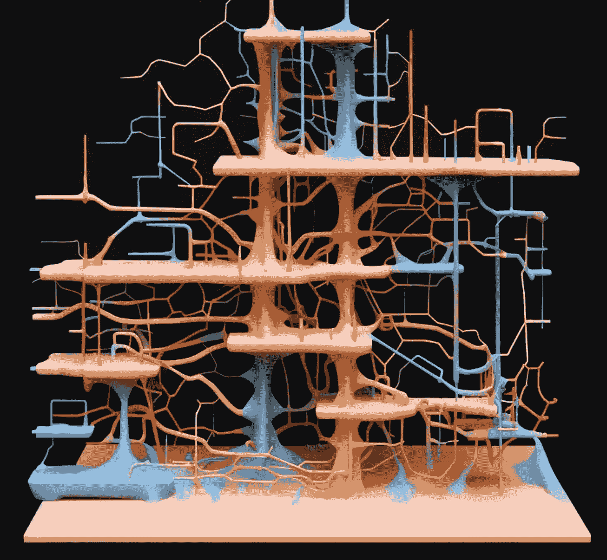

深度神经网络每一层都有向量，并且相邻层之间的连接以矩阵的形式编码。层间的转换通过线性代数和矩阵乘法完成。使用 midjourney 创建的图像。

# II) 地图上的代数


使用 midjourney 创建的图像

在 [第二章](https://medium.com/towards-data-science/a-birds-eye-view-of-linear-algebra-the-measure-of-a-map-determinant-1e5fd752a3be)中，我们学习了如何通过行列式量化线性映射。现在，让我们对它们进行一些代数运算。我们需要两个线性映射和一个基。

## II-A) 加法

如果我们可以加矩阵，我们可以加线性映射，因为矩阵是线性映射的表示。如果你了解标量加法，那么矩阵加法并不很有趣。就像向量一样，它仅在两个矩阵大小相同（行列相同）时定义，并涉及对齐它们并逐元素相加。

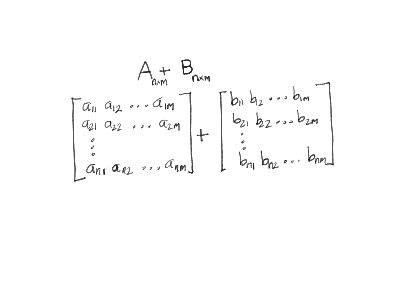

动画-0：两个矩阵的加法。图像由作者提供。

所以，我们只是在做一堆标量加法。这意味着标量加法的属性在逻辑上扩展。

**交换律：如果你交换，结果不会改变**

*A+B = B+A*

*但上班通勤可能不是交换的，因为从 A 到 B 可能比从 B 到 A 花的时间更长。*

**结合律：在链中，不要犹豫，任选两个继续**

***A+(B+C) = (A+B)+C***

**恒等：我在这里回到起点！这对一个人来说可不公平！**

存在一个特殊的元素，当它与任何东西相加时，结果还是原来的东西。对于标量来说，它是数字 *0*。对于矩阵来说，它是全零矩阵。

***A + 0 = A 或 0 + A = A***

同样，可以从任何元素开始，通过加法到达任何其他元素。因此，必须能够从 *A* 开始，到达加法单位 *0*。实现这一点所需加上的内容是 *A* 的加法逆元，称为 *-A*。

*A + (-A) = 0*

对于矩阵，你只需访问矩阵中的每一个标量元素，并用每个元素的加法逆元替换（如果标量是数字，则切换符号）以获得矩阵的加法逆元。

## II-B) 减法

减法实际上只是将第二个矩阵的加法逆元用于加法。

*A-B = A+(-B)*

## II-C) 乘法

我们可以像定义矩阵加法一样定义矩阵乘法。只需取两个大小相同（行和列）的矩阵，然后逐元素相乘。对这种操作有一个名称，称为[Hadamard 积](https://en.wikipedia.org/wiki/Hadamard_product_(matrices))。

但实际上，我们将矩阵乘法定义为一种更复杂的操作，比加法更“异域”。它并不是为了复杂而复杂。它是线性代数中最重要的操作。

它享有这种特殊地位，因为它是将线性映射应用于向量的方式，建立在点积的基础上。

实际上它是如何工作的需要一个专门的部分来讨论，我们将在第 III 节中覆盖这一点。在这里，让我们列出一些它的属性。

**交换律**

与加法不同，矩阵乘法并不总是满足交换律。这意味着你应用线性映射到输入向量的顺序很重要。

*A.B != B.A*

**结合律**

它仍然是结合律的

*A.B.C = A.(B.C) = (A.B).C*

而且这个属性有很大的深度，我们将在第 IV 节中看到。

**单位**

与加法类似，矩阵乘法也有一个单位元素，*I*，当任何矩阵与其相乘时会得到相同的矩阵。大问题在于，这个元素仅存在于方阵中，而且它自身也是方阵。

由于矩阵乘法的重要性，通常所说的“单位矩阵”是指矩阵乘法的单位元素（而不是加法或 Hadamard 积的单位元素）。

加法的单位元素是由*0*构成的矩阵，而 Hadamard 积的单位元素是由*1*构成的矩阵。矩阵乘法的单位元素是：

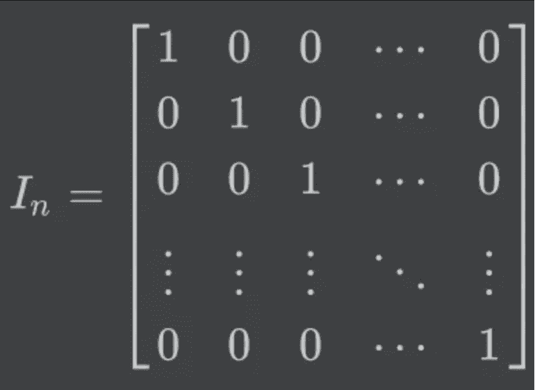

矩阵乘法的单位矩阵以及线性代数的单位矩阵。图像由作者提供。

所以，主对角线上的*1*和其他地方的*0*。什么样的矩阵乘法定义会导致这样的单位元素？我们需要描述它是如何工作的，但首先让我们继续到最后的操作。

## II-D) 除法

就像加法一样，单位矩阵的存在表明任何矩阵* A* 可以与另一个矩阵*A^-1*相乘并得到单位矩阵。这称为逆矩阵。由于矩阵乘法不是交换的，这里有两种方法来实现这一点。幸运的是，两者都导致单位矩阵。

*A.(A^-1) = (A^-1).A = I*

所以，“除以”一个矩阵其实就是与第二个矩阵的逆相乘，即 *A.B^-1*。如果矩阵乘法非常重要，那么这个操作也同样重要，因为它是逆操作。它也与我们如何历史性地发展（或许偶然发现）线性代数有关。不过这一点将在下一章（第四章）中讨论。

我们还将使用一个结合了加法和乘法的性质，即分配律。它适用于所有类型的矩阵乘法，从传统的乘法到 Hadamard 积：

*A.(B+C) = A.B + A.C*

# III) 为什么矩阵乘法被定义成这样？

我们终于来到了本章的核心部分，回答标题中的问题。

矩阵乘法是线性映射作用于向量的方式。所以，我们可以这样来激励它。

## III-A) 线性映射在实践中的应用是什么？

考虑一个线性映射，它将 *m* 维向量（来自 *R^m*）作为输入，并映射到 *n* 维向量（在 *R^n* 中）。我们将 *m* 维输入向量称为 *v*。

在这一点上，考虑一下你自己实际在某种编程语言中编写这个线性映射的代码可能会有帮助。它应该是一个将 *m* 维向量 *v* 作为输入并返回 *n* 维向量 *u* 的函数。

```py
# Code block-1: the skeleton of a linear map
import numpy as np

def linear_map(v, n):
  """
  A linear map that takes a vector, v as input and returns a vector, u
  n is the size of the output vector, u. For now, lets just return some
  random vector.
  """
  # get a vector u somehow. For now, let's just generate it.
  u = np.random.uniform(size=n)
  return u
```

线性映射必须以某种方式将这个向量转化为 *n* 维向量。在上面的函数中，你会注意到我们只是随机生成了一些向量。但这完全忽略了输入向量 *v*。这是不合理的，*v* 应该有所影响。现在，*v* 只是一个有序的 *m* 个标量的列表 *v = [v1, v2, v3, …, vm]*。标量的作用是什么？它们缩放向量。我们需要的输出向量应该是 *n* 维的。我们可以用一些（固定的）*m* 个向量（凭空抽取，每个都是 *n* 维的），*w1, w2, …, wm*。然后，将 *w1* 按 *v1* 缩放，*w2* 按 *v2* 缩放，依此类推，并将它们全部加起来。这就得到我们的线性映射的方程（输出在左边）。

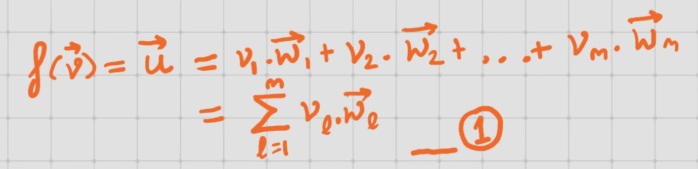

Eq (1) 作为 *m* 个向量的线性组合激发的线性映射。图片由作者提供。

请注意上述方程（1），因为我们会再次使用它。

由于 *w1*, *w2,…* 都是 *n* 维的，所以 *u* 也是。并且 *v=[v1, v2, …, vm]* 的所有元素都对输出 *u* 产生影响。方程（1）的思想在下面得到实现。我们取一些随机生成的向量作为 *w*，但用固定的种子（确保每次调用函数时向量相同）。

```py
# Code block-2: example of a linear map.
import numpy as np

def linear_map(v, n=3):
  """
  A linear map that takes a 2-d vector, v as input and returns 
  a 3-d vector, u
  """
  m = len(v)
  u = np.zeros(size=n)
  for i in range(m):
    # Fixing the seed ensures that the same m vectors are generated
    # every time the function is called. Ensuring it's the same linear
    # map.
    np.random.seed(i)
    # The linear map requires some fixed vectors, wi.
    wi = np.random.uniform(size=n)
    u = u + v[i]*wi
  return u
```

现在我们有一种方法可以将 *m* 维向量 (*v*) 映射到 *n* 维向量 (*u*)。但这个“映射”是否满足线性映射的性质？请回顾第一章第 II 节的线性映射性质，*f*（这里，*a* 和 *b* 是向量，*c* 是标量）：

*f(a+b) = f(a) + f(b)*

*f(c.a) = c.f(a)*

很明显，方程（1）所指定的映射满足上述两个线性映射的性质。

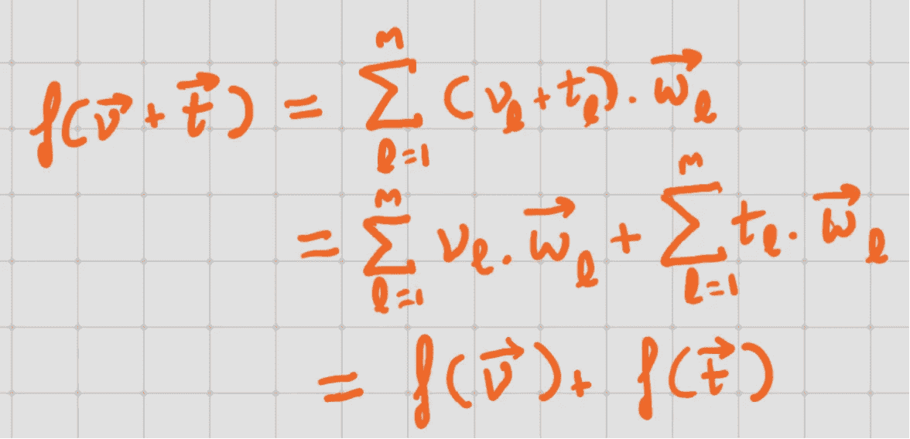

方程（1）中定义的函数满足一个属性，即函数的和是函数的和。图片来源：作者。

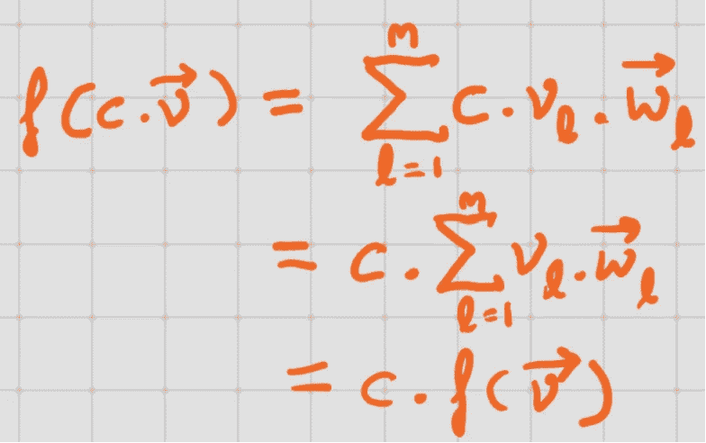

方程（1）中定义的函数满足一个属性，即标量乘以传递给函数的向量等同于标量乘以传递给函数的向量。图片来源：作者。

*m*个向量*w1, w2, …, wm*是任意的，无论我们选择什么，它们，方程（1）中定义的函数*f*都是一个线性映射。因此，对于这些*w*向量的不同选择会导致不同的线性映射。此外，对于你能想象的任何线性映射，都将有一些向量*w1, w2,…*可以与方程（1）一起应用来表示它。

现在，对于给定的线性映射，我们可以将向量*w1, w2,…*收集到一个矩阵的列中。这样的矩阵将具有*n*行和*m*列。这个矩阵表示了线性映射，*f*，它与输入向量*v*的乘积表示了线性映射*f*作用于*v*。这种应用就是矩阵乘法定义的来源。

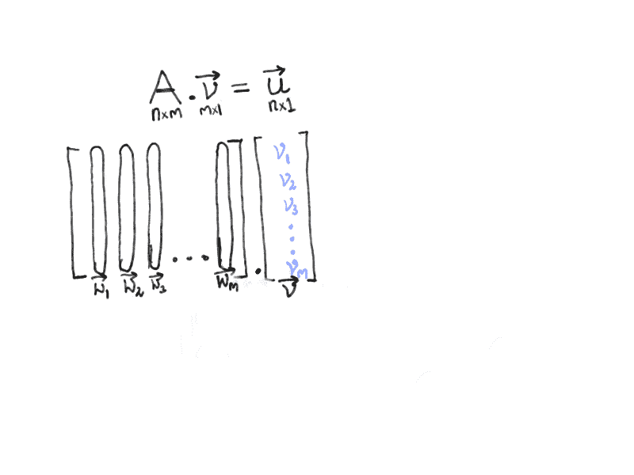

动画（1）：矩阵向量乘法。 图片来源：作者。

我们现在可以看到为什么矩阵乘法的单位元素是现在的样子：

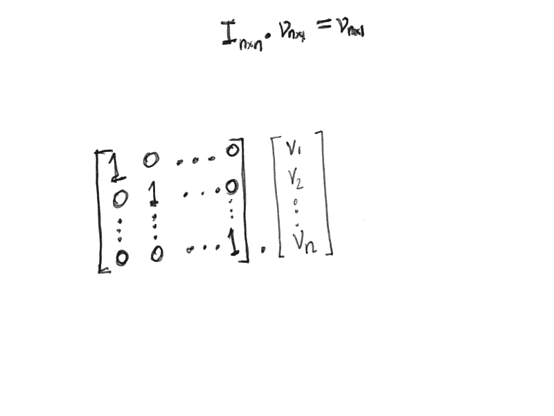

动画（2）为什么乘法的单位矩阵是它现在的样子？ 图片来源：作者。

我们从一个列向量*v*开始，并以一个列向量*u*结束（每个只有一列）。由于*v*的元素必须与表示线性映射的矩阵的列向量对齐，因此矩阵的列数必须等于*v*中的元素数。更多内容请参见第 III-C 节。

## III-B) 矩阵乘法作为线性映射的组合

现在我们已经描述了矩阵如何与向量相乘，我们可以继续讨论矩阵与另一个矩阵的相乘。

当我们将矩阵视为线性映射的表示时，矩阵乘法的定义自然得多。

线性映射是将一个向量作为输入并产生一个向量作为输出的函数。假设与两个矩阵对应的线性映射是*f*和*g*。你如何理解这些映射的加法*(f+g)*？

*(f+g)(v) = f(v)+g(v)*

这让人想起了加法的分配律，其中参数进入括号内的两个函数，然后我们将结果相加。如果我们固定一个基，这对应于将两个线性映射应用于输入向量并将结果相加。根据矩阵和向量乘法的分配律，这等同于将对应于线性映射的矩阵相加，并将结果应用于向量。

现在，让我们考虑乘法*(f.g)*。

*(f.g)(v) = f(g(v))*

由于线性映射是函数，乘法的最自然解释是将它们组合在一起（按顺序一个接一个地应用到输入向量上）。

当两个矩阵相乘时，结果矩阵表示相应线性映射的组合。考虑矩阵 A 和 B；积*AB*体现了先对输入向量应用由*B*表示的线性映射，然后再应用由*A*表示的线性映射所实现的变换。

所以我们有一个与矩阵*A*对应的线性映射，以及一个与矩阵*B*对应的线性映射。我们希望知道与这两个线性映射的组合对应的矩阵*C*。因此，首先对任意向量应用*B*，然后对结果应用*A*，应该等同于直接应用*C*。

*A.(B.v) = C.v = (A.B).v*

在上一部分，我们学习了如何乘以矩阵和向量。让我们对*A.(B.v)*再做一次。假设*B*的列是列向量*b1, b2, …, bm*。从前一部分的方程（1）来看，

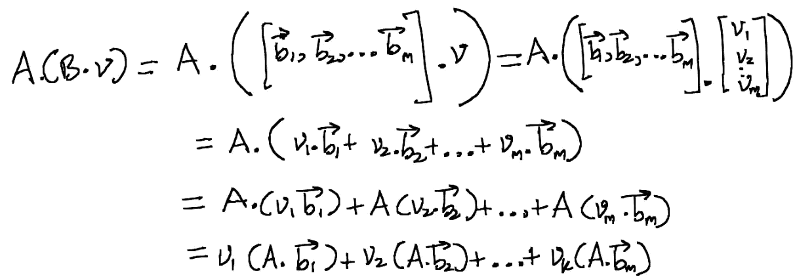

证明矩阵乘法只是顺序应用的线性映射。图片由作者提供。

如果我们直接将与*C=A.B*对应的线性映射应用到向量*v*上会怎样呢？矩阵*C*的列向量是*c1, c2, …, ck*。

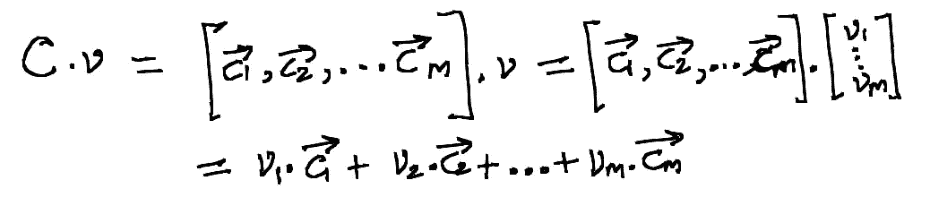

与动画（2）相同，矩阵与向量的乘法。图片由作者提供。

比较上述两个方程，我们得到，

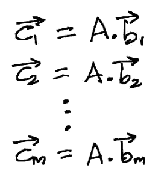

方程（2）：矩阵 C = AB 的列向量，其中 b1, b2,… 是 B 的列向量。图片由作者提供。

所以，乘积矩阵*C=AB*的列是通过对矩阵*B*的每一列应用与矩阵*A*对应的线性映射来获得的。将这些结果向量收集成一个矩阵就得到了*C*。

我们刚刚将矩阵-向量乘法的结果扩展到了两个矩阵的乘法。我们只是将第二个矩阵分解为一个向量集合，将第一个矩阵应用到所有这些向量上，然后将结果向量收集到结果矩阵的列中。

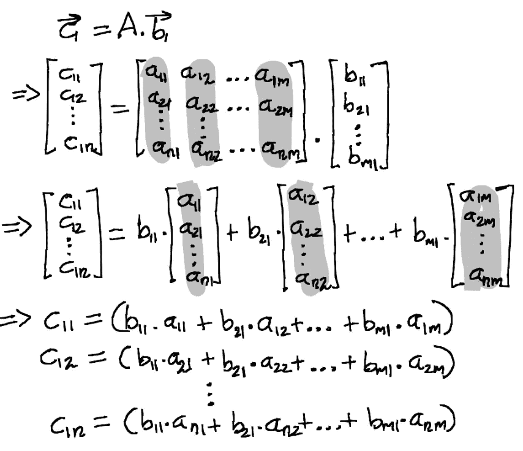

方程（3）：矩阵 C（C=A.B）的列向量。图片由作者提供。

所以结果矩阵*C*的第一行第一列是矩阵*B*的第一列与矩阵*A*的第一行的点积。一般而言，*C*的第*i*行第*j*列是矩阵*A*的第*i*行与矩阵*B*的第*j*列的点积。这是我们大多数人最初学习的矩阵乘法定义。

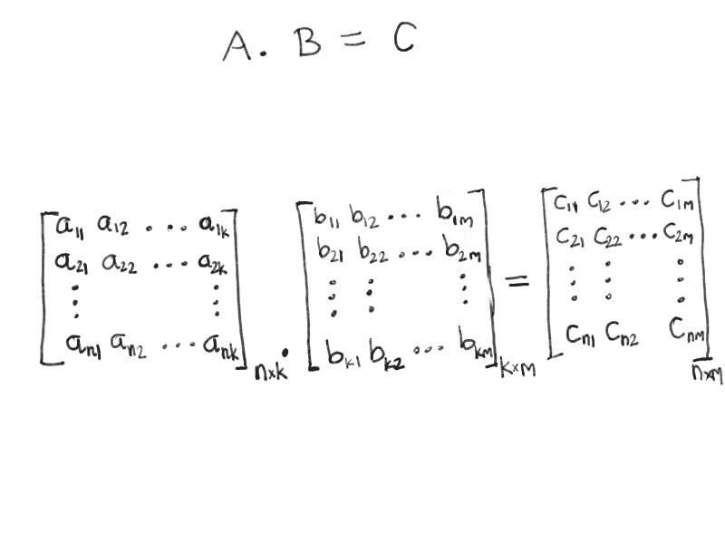

动画（3）：矩阵乘法作为点积。图片由作者提供。

**结合律证明**

我们现在也可以展示矩阵乘法是结合的。用 *AB* 的乘积代替单一向量 *v*，将其应用于一组向量 *w1, w2, …, wl*。假设含有这些向量作为列向量的矩阵是 *W*。我们可以使用上面完全相同的技巧来展示：

*(A.B).W = A.(B.W)*

这是因为 *(A.B).w1 = A.(B.w1)*，所有其他 *w* 向量也一样。

**外积的和**

假设我们在乘两个矩阵 *A* 和 *B*：

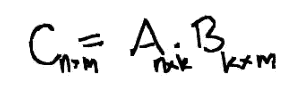

两个矩阵的乘法。图片由作者提供。

方程 (3) 可以推广为显示结果矩阵 *C* 的 *i*,*j* 元素是：

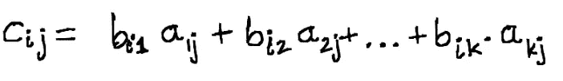

等式 (4)：方程 (3) 的推广。图片由作者提供。

我们有对 *k* 项的求和。如果我们将每一项取出并创建 *k* 个单独的矩阵。例如，第一个矩阵将具有 *i*,*j-* 项：*b_{i,1}. a_{1,j}*。这 *k* 个矩阵及其与 *C* 的关系：

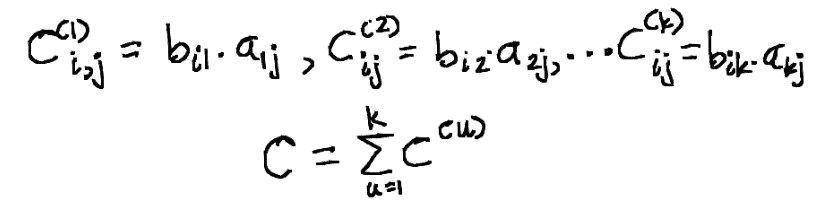

矩阵乘法是 *k* 个子矩阵的和。图片由作者提供。

对 *k* 个矩阵的求和过程可以如下可视化（类似于 III-A 节中将矩阵乘法可视化为向量的动画）：

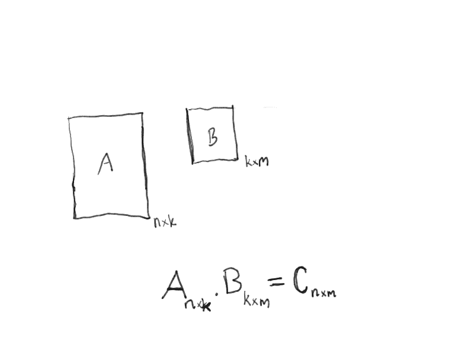

动画 (4)：通过扩展到三维展示矩阵乘法。图片由作者提供。

我们在这里看到对 *k* 个相同大小 (*n*x*m*) 矩阵的求和，这些矩阵的大小与结果矩阵 *C* 相同。注意在等式 (4) 中，对于第一个矩阵 *A*，列索引保持不变，而对于第二个矩阵 *B*，行索引保持不变。所以我们得到的 *k* 个矩阵是 *A* 的第 *i* 列和 *B* 的第 *i* 个**行**的矩阵乘积。

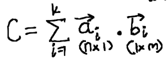

矩阵乘法作为外积的和。图片由作者提供。

在求和内部，两个向量相乘生成矩阵。这是一种应用于向量（矩阵的特殊情况）的矩阵乘法，称为“外积”。这里还有另一个动画展示这个外积和过程：

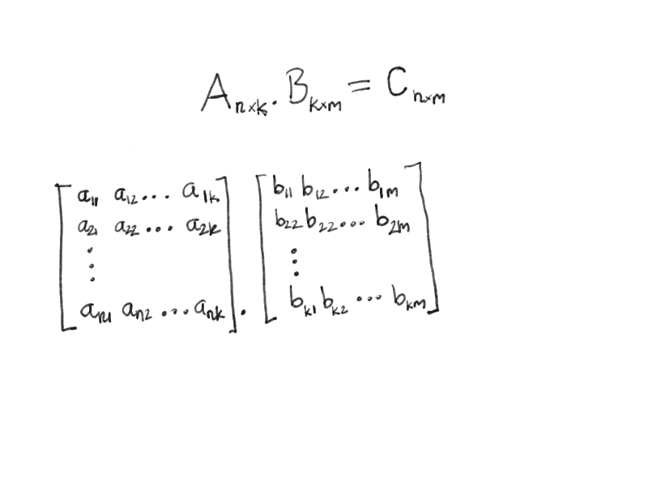

动画 (5)：将矩阵乘法视为外积的和。图片由作者提供。

这告诉我们为什么 *B* 的行向量数量应该与 *A* 的列向量数量相同。因为它们必须一一对应以获得各自的矩阵。

我们已经看到很多可视化和一些数学内容，现在让我们通过代码查看相同的内容，特别是 *A* 和 *B* 是方阵的情况。这基于《算法导论》第 4.2 节，[2]。

```py
# Code block-3: naive matrix multiplication.
import numpy as np

def square_matrix_mult(a, b):
    """Multiply two matrices"""
    # The number of rows of a
    n = len(a)
    c = np.zeros((n, n))
    for i in range(n):
        for j in range(n):
            for k in range(n):
                c[i, j] = c[i, j] + a[i][k]*b[k][j]
    return c

a = [[1, 2, 3],
     [3, 4, 5],
     [2, 3, 4]]

square_matrix_mult(a, a)
```

## III-C) 矩阵乘法：结构选择

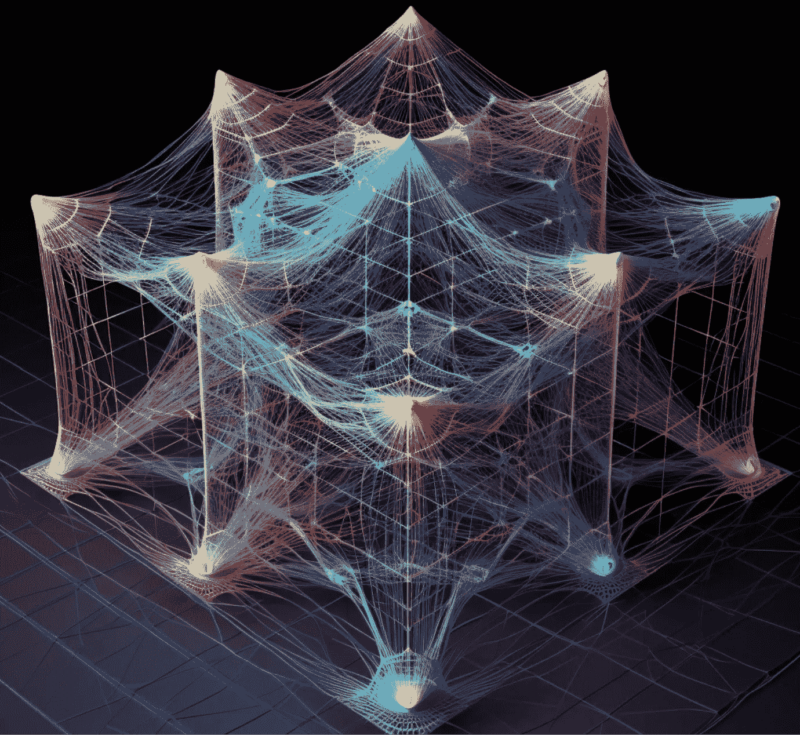

图片由 midjourney 创建

矩阵乘法似乎以一种奇怪的方式结构化。很明显，我们需要进行一堆点积运算。因此，其中一个维度必须匹配。但是为什么要使第一个矩阵的列数等于第二个矩阵的行数呢？

如果我们重新定义矩阵，使得两个矩阵的行数（或列数）相同，这样会不会使事情变得更简单？这将使识别两个矩阵是否可以相乘变得更加容易。

传统定义中要求第一个矩阵的行与第二个矩阵的列对齐有多个优点。我们首先来看矩阵-向量乘法。第三节 A 中的动画（1）向我们展示了传统版本是如何工作的。让我们可视化一下，如果我们要求矩阵的行与向量中的元素数量对齐会是什么样的。现在，矩阵的 *n* 行将需要与向量的 *n* 元素对齐。

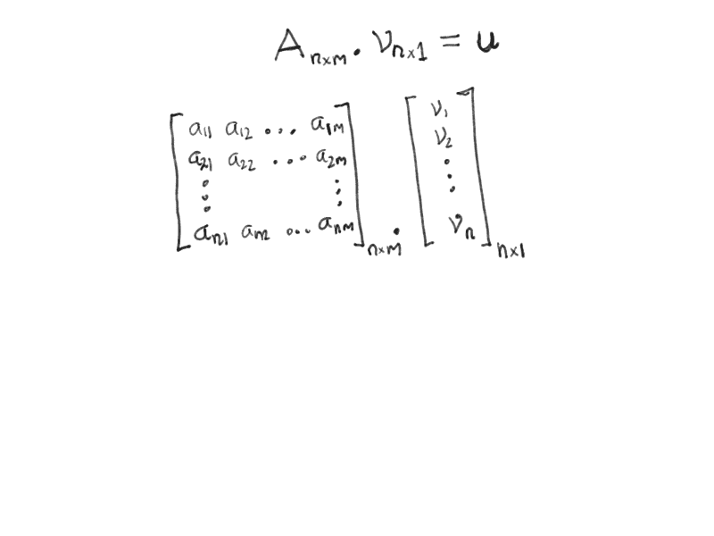

动画（6）：矩阵乘法的替代设置会是什么样的？作者图片。

我们可以看到，我们必须以一个具有 *n* 行和一列的列向量 *v* 开始，最终得到一个具有 *1* 行和 *m* 列的行向量 *u*。这很尴尬，并且使得为矩阵乘法定义一个单位元素变得具有挑战性，因为输入和输出向量永远不能具有相同的形状。使用传统定义，这不是问题，因为输入是一个列向量，而输出也是一个列向量（见动画（1））。

另一个考虑因素是矩阵链的乘法。在传统方法中，很容易首先看到下面的矩阵链可以根据它们的维度进行相乘。

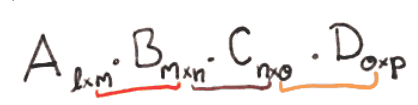

传统接受的方法下矩阵链乘法的样子。作者图片。

此外，我们可以确定输出矩阵将有 *l* 行和 *p* 列。

在要求两个矩阵的行对齐的框架下，这很快就会变得混乱。对于前两个矩阵，我们可以看出行应该对齐，并且结果将会有 *n* 行和 *l* 列。但是，想象一下结果会有多少行和列，然后再推断它是否与 *C* 兼容等，就成了一场噩梦。

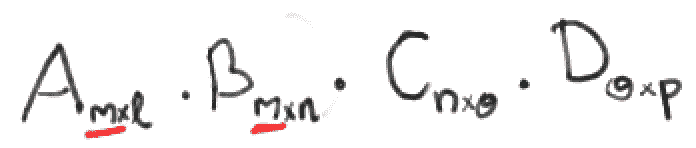

如果我们修改矩阵乘法的定义，矩阵链乘法可能会是什么样的。作者图片。

这就是为什么我们要求第一个矩阵的行与第二个矩阵的列对齐的原因。但也许我遗漏了什么。也许有一个“更干净”的替代定义能够绕过这两个挑战。欢迎在评论中分享想法 :)

## III-D) 矩阵乘法作为基变换

到目前为止，我们把矩阵乘法与向量视为一种线性映射，它接受一个向量作为输入，并返回另一个向量作为输出。但矩阵乘法还有另一种思考方式——作为一种改变视角的方式。

让我们考虑二维空间 *R²*。我们用两个数字来表示这个空间中的任何向量。这些数字代表什么？它们分别是沿 x 轴和 y 轴的坐标。一个指向 x 轴的单位向量是 *[1,0]*，一个指向 y 轴的单位向量是 *[0,1]*。这些是我们空间的基底。现在每个向量都有了一个地址。例如，向量 *[2,3]* 意味着我们将第一个基底向量缩放 *2* 倍，第二个基底向量缩放 *3* 倍。

但这并不是空间的唯一基底。其他人（比如，那位不可提及者）可能想使用另外两个向量作为他们的基底。例如，向量 *e1=[3,2]* 和 *e2=[1,1]*。空间 *R²* 中的任何向量也可以用他们的基底来表示。相同的向量在我们的基底和他们的基底下会有不同的表示。就像同一所房子的不同地址（可能基于不同的邮政系统）。

当我们在那位不可提及者的基底下时，向量 *e1 = [1,0]* 和向量 *e2 = [0,1]* （这是按基底向量的定义，从他的视角看是基底向量）。将向量从我们的基底系统转换到那位不可提及者的基底系统以及反向转换的函数是线性映射。因此，这些转换可以表示为矩阵乘法。我们将将向量从我们这里转换到那位不可提及者的向量的矩阵称为 *M1*，而执行相反操作的矩阵称为 *M2*。我们如何找到这些矩阵呢？


改变你看待世界的视角。图像由 midjourney 提供。图像由作者提供。

我们知道，我们称之为 *e1=[3,2]* 和 *e2=[1,1]* 的向量，而那位不可提及者称 *e1=[1,0]* 和 *e2=[0,1]*。让我们将我们版本的向量收集到一个矩阵的列中。

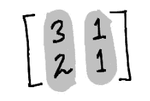

由两个列向量组成的基本 2 乘 2 矩阵。图像由作者提供。

并将那位不可提及者的向量 *e1* 和 *e2* 收集到另一个矩阵的列中。这只是单位矩阵。

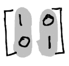

我们希望将 2 乘 2 矩阵转换为单位矩阵以改变基底。图像由作者提供。

由于矩阵乘法对第二个矩阵的列进行独立操作，

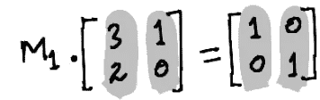

将矩阵移到单位矩阵的方程。图像由作者提供。

在两侧乘以适当的矩阵得到 *M1:*

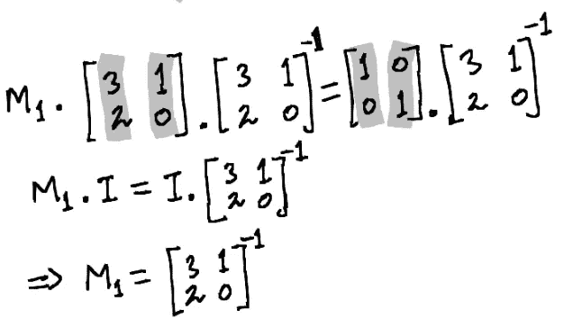

用矩阵改变基底。图像由作者提供。

反向操作得到 *M2:*

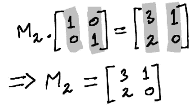

反向映射到基底。图像由作者提供。

这可以概括为以下陈述：一个列向量为 *w1, w2, …, wn* 的矩阵将以 *w1, w2, …, wn* 为基向量的基中表达的向量转换到我们的基中。

而该矩阵的逆矩阵将向量从我们的基变换到* w1, w2, …, wn* 为基的那个基。

因此，所有方阵可以被视为“基变换器”。

> 注意：在特殊情况下，正交归一矩阵（每列是单位向量且与其他列正交）的逆矩阵与其转置矩阵相同。因此，将矩阵的列作为基变换就等同于将一个向量与每一行进行点积。

欲了解更多信息，请参见 [3B1B 视频，[1]](https://www.youtube.com/watch?v=P2LTAUO1TdA&t=2s)。

# 结论

矩阵乘法可以说是现代计算和几乎所有数据科学领域中最重要的操作之一。深入理解其工作原理对任何数据科学家来说都非常重要。大多数线性代数教材描述了“是什么”，但没有解释其结构的原因。希望这篇博客填补了这个空白。

# 参考文献

[1] 关于基变换的 3B1B 视频: [`www.youtube.com/watch?v=P2LTAUO1TdA&t=2s`](https://www.youtube.com/watch?v=P2LTAUO1TdA&t=2s)

[2] 《算法导论》，作者 Cormen 等，第三版

[3] 矩阵乘法作为外积之和: [`math.stackexchange.com/questions/2335457/matrix-at-a-as-sum-of-outer-products`](https://math.stackexchange.com/questions/2335457/matrix-at-a-as-sum-of-outer-products)

[4] 卡塔兰数维基百科条目 [`en.wikipedia.org/wiki/Catalan_number`](https://en.wikipedia.org/wiki/Catalan_number)
