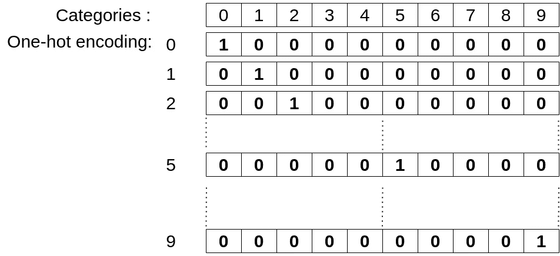
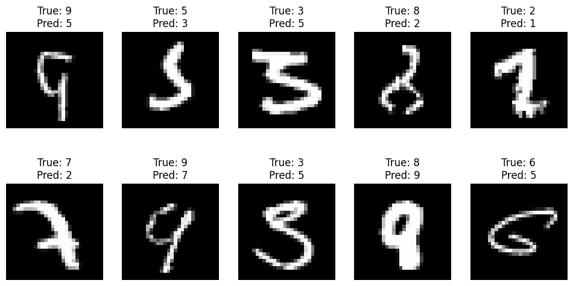

# 神经网络简介：一个分类问题

> 原文：[`towardsdatascience.com/a-brief-introduction-to-neural-networks-a-classification-problem-43e68c770081`](https://towardsdatascience.com/a-brief-introduction-to-neural-networks-a-classification-problem-43e68c770081)

## 实用的 Python 神经网络初学者指南

[](https://medium.com/@chimso1994?source=post_page-----43e68c770081--------------------------------)[](https://towardsdatascience.com/?source=post_page-----43e68c770081--------------------------------) [Chayma Zatout](https://medium.com/@chimso1994?source=post_page-----43e68c770081--------------------------------)

· 发布于 [Towards Data Science](https://towardsdatascience.com/?source=post_page-----43e68c770081--------------------------------) · 18 分钟阅读 · 2023 年 1 月 24 日

--


图片来源 [W T](https://unsplash.com/ja/@goodfunlover?utm_source=medium&utm_medium=referral) 在 [Unsplash](https://unsplash.com/?utm_source=medium&utm_medium=referral)

在 [上一篇教程](https://medium.com/towards-data-science/a-brief-introduction-to-neural-networks-a-regression-problem-c58c26e18008#6dba)中，我介绍了神经网络的基础，并提供了一个简单的回归问题示例。我简要概述了使用神经网络的一般过程。在本教程中，我们将进一步深入学习如何将神经网络用于分类任务。我们将遵循之前相同的一般流程。然而，如果你需要更多关于神经网络的背景信息，我建议你回顾上一篇教程，在其中我也简要讨论了神经元和多层网络的概念。

**目录**

· 1. 介绍

· 2. 问题理解

· 3. 数据准备与预处理

∘ 3.1. 数据描述

∘ 3.2. 数据转换

· 4. 模型构思

∘ 4.1. 单个单元输出

∘ 4.2. 单热输出

∘ 4.3. 卷积神经网络

· 5. 训练

∘ 5.1. 单个单元输出

∘ 5.2. 单热输出

∘ 5.3. 卷积单元

· 6. 验证

∘ 6.1 预测

∘ 6.2. 学习曲线

∘ 6.3. 测试集评估

∘ 6.4. 评估指标

∘ 6.5. 显示一些数据

· 7. 结论

# 1. 介绍

正如之前讨论的，机器学习解决方案的目标是开发一个能够通过分析为特定任务创建的数据集来生成所需输出的模型。为实现这一目标，必须遵循一系列步骤，包括：

+   问题理解。

+   数据准备和预处理。

+   模型构思。

+   训练模型。

+   模型评估和验证

# 2\. 问题理解

在讨论我们将在本教程中解决的分类问题之前，理解有几种分类类型是很重要的。具体来说：

+   **二分类**，当类别数量为两个时，例如将电子邮件分类为垃圾邮件或非垃圾邮件。

+   **多类分类**，当有两个以上不同类别时，例如在[Iris 数据集](https://www.kaggle.com/datasets/uciml/iris)中，类别是不同类型的花。

+   **多标签分类**，当输入有多个类别时，例如将包含多个对象的图像进行分类。

+   此外，如果输入是图像，当每个像素都有自己的类别时，分类可以是**逐像素分类**（或图像分割）。

了解分类类型有助于我们选择合适的模型类型和适当的训练参数，例如损失函数。例如，对于二分类，通常使用`binary_crossentropy`函数作为损失函数，而对于多类分类，则使用`categorical_crossentropy`。

我们在本教程中要解决的问题是手写数字分类（多类分类）。换句话说，给定一个手写数字作为输入（从 0 到 9），模型必须识别它并给出写了什么数字作为输出。我们将测试三种类型的模型：一个基本的直接神经网络、一个输出进行过 one-hot 编码的基本直接神经网络和一个卷积神经网络（CNN）。

让我们从导入所需的库开始：

```py
from tensorflow.python.keras import Input
from tensorflow.python.keras.models import Sequential
from tensorflow.python.keras.layers import Dense, Dropout, Conv2D, MaxPooling2D, Flatten
import tensorflow as tf
import matplotlib.pyplot as plt
import numpy as np
from sklearn.metrics import accuracy_score, precision_score, recall_score, ConfusionMatrixDisplay, f1_score
from sklearn.model_selection import train_test_split
import os
```

并设置种子，以便我们可以重新生成结果：

```py
from numpy.random import seed
seed(1)

from tensorflow import random, config
random.set_seed(1)
config.experimental.enable_op_determinism()

import random
random.seed(2)
```

# 3\. 数据准备和预处理

为了训练我们的模型，我们将使用 MNIST 数据集，该数据集包括 60,000 个训练样本和 10,000 个测试样本。如果您希望使用原始的 IDX 格式数据集，可以查看[我的教程](https://medium.com/mlearning-ai/how-to-effortlessly-explore-your-idx-dataset-97753246031f)，以便轻松探索它。或者，您可以直接使用 Keras 提供的数据集，如下所示：

```py
# read dataset:
(x_train, y_train), (x_test, y_test) = tf.keras.datasets.mnist.load_data()
```

## **3.1\. 数据描述**

我们从显示数据形状开始：

```py
print(f"The training data shape: {x_train.shape}, its label shape: {y_train.shape}")
print(f"The test data shape: {x_test.shape}, its label shape: {y_test.shape}")
```

```py
The training data shape: (60000, 28, 28), its label shape: (60000,)
The test data shape: (10000, 28, 28), its label shape: (10000,)
```

单个样本是一个通道的图像（灰度图像），形状为 28×28 像素。显示图像中像素值的范围也很重要，以确定是否需要后续的数据缩放。

```py
print("Minimum value:", np.min(x_train[0]))
print("Maximum value:", np.max(x_train[0]))
```

```py
Minimum value: 0
Maximum value: 255
```

确实，后续需要进行数据缩放。

另一个重要因素是显示每个类别中的样本数量。这对于确定是否面对数据不平衡非常重要：

```py
# Display bars:
fig, axs = plt.subplots(1, 2)
unique, counts = np.unique(y_train, return_counts=True)
axs[0].bar(unique, counts, width=0.4)
axs[0].set_title('Train set')
unique, counts = np.unique(y_test, return_counts=True)
axs[1].bar(unique, counts, width=0.4)
axs[1].set_title('Test set')
plt.show()
```


数据不平衡是机器学习中的一个问题，其中不同类别之间样本数量差异显著。在我们的案例中，样本数量大致相同。

## 3.2. 数据转换

数据转换是数据预处理技术之一。它包括：数据归一化、数据编码、填补缺失值的数据插补、将连续特征转化为分类特征的数据离散化，以及减少数据集中特征数量的降维。对于这个例子，我们将只应用数据归一化和数据编码，因为没有缺失值，也不需要数据离散化和降维。

+   **数据归一化**：是一种将数据集特征的值转换到特定范围内的技术。这通常是为了确保数据在适合神经网络或其他机器学习方法的范围内。我们将像素归一化到[0,1]的范围：

```py
# Scale images to the [0, 1] range:
x_train = x_train.astype("float32") / 255
x_test = x_test.astype("float32") / 255
```

+   **重新塑形（从 2D 图像到行图像）**：图像重新塑形或展平是一种常见的数据转换技术，将空间信息转换为一行像素。这是输入到一些机器学习模型（如多层感知器（MLP）或线性回归）之前的必要步骤。


我们为前两个模型重新塑形图像：

```py
# Data reshaping : from 2D image to row image
x_train = x_train.reshape((x_train.shape[0], x_train.shape[1] * x_train.shape[2]))
x_test = x_test.reshape((x_test.shape[0], x_test.shape[1] * x_test.shape[2]))
```

+   **数据编码：一热编码**是一种用于用二进制向量表示有限类别数量的分类变量的技术。对于一组 n 个标签，每个标签由长度为 n 的向量表示，其中每个元素为 0，除了对应标签的元素为 1。在我们的案例中，我们要预测的变量是从 0 到 9 的数字类别，这是一个可以用一热编码表示的有限类别。例如：



一热编码将用于第二和第三模型的输出：

```py
# One-hot encoding:
y_train = tf.keras.utils.to_categorical(y_train, num_classes=10)
y_test = tf.keras.utils.to_categorical(y_test, num_classes=10)
```

+   **重新塑形（以扩展维度）。** 重新塑形以扩展维度通常在 CNN 中使用，以增加输入图像中的通道数：

```py
x_train = np.expand_dims(x_train, -1)
x_test = np.expand_dims(x_test, -1)
print(f"The training data shape: {x_train.shape}, its label shape: {y_train.shape}")
print(f"The test data shape: {x_test.shape}, its label shape: {y_test.shape}")
```

```py
The training data shape: (60000, 28, 28, 1), its label shape: (60000, 10)
The test data shape: (10000, 28, 28, 1), its label shape: (10000, 10)
```

总结数据处理：对所有模型的输入应用数据缩放，对输入从 2D 图像转换为展平图像（行表示）应用于第一个和第二个模型，因为它们不是基于 CNN 的，对第二个和最后一个模型的输出应用一热编码，最后，仅对基于 CNN 的模型扩展输入，以使输入图像变为大小为 28×28 像素的单通道输入。

在预处理阶段结束时，训练集被分为训练集和验证集：

```py
# Split dataset:
x_train, x_val, y_train, y_val = train_test_split(x_train, y_train, test_size=0.3, random_state=42)
```

我们的数据准备好用于训练，但在此之前，我们需要构建我们的模型。

# 4. 模型构思

现在，我们将演示三种不同模型的实现，首先是一个简单的全连接层模型，然后逐步改进。在本教程中，我们将重点介绍前一个教程中未涵盖的基础知识，例如人工神经元模型、激活函数、层和多层模型。

## 4.1\. 单一输出单元

第一个模型是一个完全连接层的序列，最后跟随一个单一的输出单元。这个模型类似于前一个教程中使用的模型。它易于实现，并且可以为这个特定示例产生良好的结果。

现在我们已经概述了模型的一般架构，我们需要考虑如何根据前一个教程中讨论的可用激活函数来预测输入类别（标签）。这些函数都返回实数，但我们可以使用它们并将预测的数字四舍五入为整数。然而，我们需要确保最终层中激活函数的输出范围包含所有可能的类别值。因此，像*sigmoid*、*tanh*和*softsign*这样的函数在这种情况下不能使用。


带有单一输出以预测输入标签的全连接神经网络

让我们创建我们的模型！它将有 5 个隐藏层，每层有 224 个单元，并使用*sigmoid*激活函数。输出层将有一个单元，并使用*relu*激活函数。

```py
# Create model:
model = Sequential()
model.add(Input(shape=(train_x.shape[1],)))
model.add(Dense(224, activation='sigmoid'))
model.add(Dense(224, activation='sigmoid'))
model.add(Dense(224, activation='sigmoid'))
model.add(Dense(224, activation='sigmoid'))
model.add(Dense(224, activation='sigmoid'))
model.add(Dense(1, activation='relu'))
print(model.summary())
```

模型总结：

```py
Model: "sequential"
_________________________________________________________________
Layer (type)                 Output Shape              Param #   
=================================================================
dense (Dense)                (None, 224)               175840    
_________________________________________________________________
dense_1 (Dense)              (None, 224)               50400     
_________________________________________________________________
dense_2 (Dense)              (None, 224)               50400     
_________________________________________________________________
dense_3 (Dense)              (None, 224)               50400     
_________________________________________________________________
dense_4 (Dense)              (None, 224)               50400     
_________________________________________________________________
dense_5 (Dense)              (None, 1)                 225       
=================================================================
Total params: 377,665
Trainable params: 377,665
Non-trainable params: 0
_________________________________________________________________
```

## 4.2\. 一热输出

虽然前面的模型产生了良好的结果，但正如我们稍后看到的那样，通过一个更小的模型可以获得更好的结果。关键的区别在于输出层使用了一热编码。通常，在机器学习中，一热编码是通过具有 n 个单元的密集层实现的（其中 n 是可能的类别数量），并且使用*softmax*激活函数。

嗯，我不确定前一个教程中是否定义了*softmax*，那么*softmax*是什么呢？

> “Softmax 函数将值向量转换为概率分布。输出向量的元素在(0, 1)范围内，并且总和为 1。Softmax 通常用作分类网络最后一层的激活函数，因为结果可以解释为概率分布。” [1]

总体模型具有以下架构：


带有分类输出的全连接神经网络

为了创建我们的模型，我们将首先定义 dropout 层，这是一种正则化技术，用于防止过拟合（稍后会解释）：

> “Dropout 层在训练期间以`rate`的频率随机将输入单元设置为 0，这有助于防止过拟合。请注意，Dropout 层仅在训练设置为 True 时应用，因此在推断过程中不会丢失任何值。” [2]

在 Keras 中，dropout 层定义如下，其中`rate`是一个介于 0 和 1 之间的浮点数，表示要丢弃的输入单元的比例：

```py
keras.layers.Dropout(rate, **kwargs)
```

现在，让我们创建我们的模型！它将有 2 个隐藏层，每个隐藏层有 224 个单元，并使用 relu 激活函数。将添加一个具有 10 个单元和 softmax 激活函数的密集输出层。在每个密集隐藏层后添加一个 dropout 层以防止过拟合。

```py
# Create model:
model = Sequential()
model.add(Input(shape=(train_x.shape[1],)))
model.add(Dense(224, activation='relu'))
model.add(Dropout(rate=0.4))
model.add(Dense(224, activation='relu'))
model.add(Dropout(rate=0.4))
model.add(Dense(10, activation='softmax'))
print(model.summary())
```

模型摘要：

```py
Model: "sequential"
_________________________________________________________________
Layer (type)                 Output Shape              Param #   
=================================================================
dense (Dense)                (None, 224)               175840    
_________________________________________________________________
dropout (Dropout)            (None, 224)               0         
_________________________________________________________________
dense_1 (Dense)              (None, 224)               50400     
_________________________________________________________________
dropout_1 (Dropout)          (None, 224)               0         
_________________________________________________________________
dense_2 (Dense)              (None, 10)                2250      
=================================================================
Total params: 228,490
Trainable params: 228,490
Non-trainable params: 0
_________________________________________________________________
```

如你所见，此模型相比于之前的模型（377,665 个参数）具有较少的参数，你会发现它能提供更好的结果。

## 4.3\. 卷积神经网络

到目前为止，我们将图像视为一个向量。然而，如果我们想利用图像是一个 2D 矩阵的事实，我们应该怎么做？一种方法是使用专门的 2D 单元。在本节中，我将简要介绍它们。然而，如果你想了解更多关于它们的内容，我建议你参考这个[教程](https://cs231n.github.io/convolutional-networks/)。

+   **Conv2D**：使用卷积核对输入应用卷积以产生输出（称为滤波器）。在训练过程中，这些卷积核会被更新（训练）。确实，它们在密集层中扮演着权重的角色。在 Keras 中，它定义为：

```py
keras.layers.Conv2D(
    filters,
    kernel_size,
    **kwargs
)
```

其中：`filters`是卷积核的数量，由于每个卷积核生成一个输出，因此它也代表输出空间的维度。`kernel_size`是卷积核的大小，通常是一个奇数。

+   **MaxPooling2D**：在输入窗口上取最大值。在 Keras 中，它定义如下，其中`pool_size`是用来取最大值的窗口大小：

```py
keras.layers.MaxPooling2D(
    pool_size=(2, 2), **kwargs
)
```

现在，让我们创建我们的 CNN 模型：

```py
# Create model:
model = Sequential()
model.add(Input(shape=(28, 28, 1)))
model.add(Conv2D(32, kernel_size=3, activation="relu"))
model.add(MaxPooling2D(pool_size=2))
model.add(Conv2D(64, kernel_size=3, activation="relu"))
model.add(MaxPooling2D(pool_size=2))
model.add(Flatten())
model.add(Dropout(0.5))
model.add(Dense(n_labels, activation="softmax"))
print(model.summary())
```

模型摘要：

```py
_________________________________________________________________
Layer (type)                 Output Shape              Param #   
=================================================================
conv2d (Conv2D)              (None, 26, 26, 32)        320       
_________________________________________________________________
max_pooling2d (MaxPooling2D) (None, 13, 13, 32)        0         
_________________________________________________________________
conv2d_1 (Conv2D)            (None, 11, 11, 64)        18496     
_________________________________________________________________
max_pooling2d_1 (MaxPooling2 (None, 5, 5, 64)          0         
_________________________________________________________________
flatten (Flatten)            (None, 1600)              0         
_________________________________________________________________
dropout (Dropout)            (None, 1600)              0         
_________________________________________________________________
dense (Dense)                (None, 10)                16010     
=================================================================
Total params: 34,826
Trainable params: 34,826
Non-trainable params: 0
_________________________________________________________________
```

该模型是最小的，仅有 34,826 个参数，大约是之前模型的 7 倍小。此外，你会发现它也能实现最高的性能。

# 5\. 训练

正如之前的教程所解释的，训练神经网络就是更新权重，以便模型能够很好地拟合数据。在开始训练之前，需要定义一组参数，包括：优化器、损失函数、批次大小、训练周期数和其他训练过程中需要跟踪的指标。损失函数和附加指标的选择很大程度上取决于输出的类型，无论是回归问题还是分类问题等。

在接下来的所有训练中，我们将优化器设置为`'adam'`，这是一个不错的选择，如果我们不想自己处理学习率的话，批次大小设置为`128`。

## 5.1\. 单一单元输出

由于此模型具有单个输出层，因此我们在之前的教程中介绍和使用的指标和损失函数也可以在这里使用。我们将设置损失函数为`mae`，附加指标为`mse`，训练周期数为 200：

```py
# Train:
loss = 'mae'
metric = 'mse'
epochs = 200
model.compile(loss=loss, optimizer='adam', metrics=[metric])
history = model.fit(x_train, y_train, epochs=epochs, batch_size=128, verbose=1, validation_data=(x_val, y_val))
```

通过观察详细显示，我们可以得出结论：模型已经很好地学习了，并且也能够泛化（训练集和验证集上都取得了良好的结果）：

```py
Epoch 200/200
329/329 [==============================] - 1s 2ms/step - loss: 0.0188 - mse: 0.0525 - val_loss: 0.0946 - val_mse: 0.3838
```

然而，通过使用较少的训练轮次并进行一热编码（第二个模型），我们可以获得更好的结果。

## 5.2\. 一热编码输出

与之前的模型不同，我们使用`'categorical_crossentropy'`作为损失函数，并将`accuracy`作为附加指标。`'categorical_crossentropy'`是一个概率损失函数，用于计算标签和预测之间的交叉熵损失，当标签类别有两个或更多时使用。它期望标签以`one_hot`表示。至于`accuracy`，它是一个更适合分类问题的指标。

```py
# Train:
loss = 'categorical_crossentropy'
metric = 'accuracy'
epochs = 20
model.compile(loss=loss, optimizer='adam', metrics=[metric])
history = model.fit(x_train, y_train, epochs=epochs, batch_size=128, verbose=1, validation_data=(x_val, y_val))
```

通过观察详细显示，我们可以得出结论：模型在仅 20 轮训练中就已经很好地学习了，并且也能够泛化（训练集和验证集上都取得了良好的结果）：

```py
Epoch 20/20
329/329 [==============================] - 1s 2ms/step - loss: 0.0469 - accuracy: 0.9838 - val_loss: 0.0868 - val_accuracy: 0.9769
```

## 5.3\. 卷积单元

现在让我们训练我们的最后一个模型！我们使用与之前模型相同的损失函数和指标，但轮次更少：

```py
# Train:
loss = 'categorical_crossentropy'
metric = 'accuracy'
epochs = 15
model.compile(loss=loss, optimizer='adam', metrics=[metric])
history = model.fit(x_train, y_train, epochs=epochs, batch_size=128, verbose=1, validation_data=(x_val, y_val))
```

通过观察详细显示，我们可以说模型学习得很好，并且在仅 15 轮训练中成功地泛化（训练集和验证集上的结果更好）：

```py
Epoch 15/15
329/329 [==============================] - 4s 14ms/step - loss: 0.0340 - accuracy: 0.9892 - val_loss: 0.0371 - val_accuracy: 0.9893
```

# 6\. 验证

最后几轮的显示指标不足以得出模型是否从数据中学习的结论。首先需要观察学习曲线。然后，我们可以使用其他指标来评估我们的模型。如果有可用的测试集，我们还会对其进行测试。

不过在这之前，让我们看看如何进行预测并获取预测的类别。

## 6.1 进行预测

一旦模型训练完成，我们可以开始进行预测：预测输入图像的类别。在这一部分，我们将看到如何获取两种输出类型的预测类别。

在 Keras 中，使用`predict`函数，其中 x 是输入：

```py
Model.predict(x)
```

由于模型是基于批次进行训练的，因此在预测之前需要扩展输入维度。我们以训练集的第一个实例为例：

```py
x = np.expand_dims(x_train[0], 0)
```

现在，我们可以进行预测：

```py
y = model.predict(x)[0]
```

+   **单一输出预测。** 在这种情况下返回的值是一个浮点数，如果模型对给定输入表现不好，该值可能超出范围`[0, 9]`。第一步是对输出进行裁剪，使所有值都在该范围内，然后将其四舍五入为`int`，以得到如下输入输出：

```py
print(y)
y = np.clip(y, 0, 9)
print(y)
y = np.rint(y)
print(y)
```

预测值为 6.9955063，在这种情况下，clip 函数返回相同的值。最后，将该值四舍五入为`int`：输入类别为 7。

```py
[6.9955063]
[6.9955063]
[7.]
```

+   **一热编码输出。** 在这种情况下，predict 函数返回一个包含 10 个概率元素的列表，因此我们需要获取具有最高概率的元素的索引：

```py
print(y)
y = np.argmax(y)
print(y)
```

在这里，最高概率是第 8 个元素，对应于类别 7：

```py
[4.8351421e-07 2.1228843e-04 2.9102326e-04 2.4277648e-04 9.7677308e-05
 6.5721008e-07 9.9738841e-08 9.9599850e-01 3.5152045e-06 3.1529362e-03]
7
```

我向你展示如何进行预测的原因不仅仅是为了了解如何进行预测，还为了在计算一些验证指标时能够使用它。

## 6.2\. 学习曲线

学习曲线揭示了模型在训练期间对已见数据（训练集）和未见数据（验证集）的性能。它允许：

+   **识别过拟合：** 当训练损失下降而验证损失增加时。


过拟合示例。

+   **识别欠拟合：** 当训练和验证损失都很高时，训练和验证错误都很高。


欠拟合示例：损失函数约为 2，在我们的案例中这是一个较高的值。

+   **通过比较不同模型的学习曲线来比较模型。**


训练模型的学习曲线（第一行表示损失函数，第二行表示准确率指标）。我们可以说这三种模型都学得很好，而第三种模型优于其他模型，因为它能够对训练集和验证集中的类进行高准确度预测。换句话说，它的泛化能力更强。

学习曲线可以如下绘制：

```py
# Display loss:
plt.plot(history.history['loss'])
plt.plot(history.history['val_loss'])
plt.title('Single output model loss')
plt.ylabel('loss')
plt.xlabel('epoch')
plt.legend(['train', 'validation'])
plt.show()
# Display metric:
plt.plot(history.history[metric])
plt.plot(history.history[f'val_{metric}'])
plt.title(f'Single output model {metric}')
plt.ylabel(metric)
plt.xlabel('epoch')
plt.legend(['train', 'validation'])
plt.show()
```

## 6.3\. 测试集评估

让我们在测试集上评估我们的模型：

```py
# Evaluation:
test_results = model.evaluate(x_test, y_test, verbose=1)
print(f'Test set: - loss: {test_results[0]} - {metric}: {test_results[1]}')
```

第一种模型：

```py
Test set: - loss: 0.09854138642549515 - mse: 0.4069458544254303
```

第二种模型：

```py
Test set: - loss: 0.08896738290786743 - accuracy: 0.9793999791145325
```

第三种模型：

```py
Test set: - loss: 0.02704194374382496 - accuracy: 0.9908000230789185
```

## 6.4\. 评估指标

训练后，使用额外的指标评估模型。计算的指标很大程度上取决于模型输出的性质：如果是回归（或连续变量），可以使用均方误差（MSE）或平均绝对误差（MAE）；如果是分类（或离散变量），可以使用精确度、召回率、F-measure、混淆矩阵和 ROC 曲线。

+   **准确率。** 准确率是正确预测与所有预测的比例。

+   **精确度。** 精确度表示属于正类的正类预测。它提供了所有预测正确的正类中实际为正的样本数量。

+   **召回率**。召回率表示从数据集中正类示例中得到的正类预测。它提供了从所有正类中正确预测的样本数量。

+   **F-measure**。它是一个平衡精确度和召回率的单一评分。

让我们展示这些指标在训练、验证和测试集上的表现。请注意，以下说明是针对第二种和第三种模型编写的。如果你想展示第一种模型的指标，请参阅第 6.1 节（做出预测），或者访问我的 [GitHub 仓库](https://github.com/Chim-SO/MNIST_classification)。

```py
# Classificati evaluation with output one-hot encoding:
pred_train = np.argmax(model.predict(x_train), axis=1)
pred_val = np.argmax(model.predict(x_val), axis=1)
pred_test = np.argmax(model.predict(x_test), axis=1)
yy_train = np.argmax(y_train, axis=1)
yy_val = np.argmax(y_val, axis=1)
yy_test = np.argmax(y_test, axis=1)
print("Displaying other metrics:")
print("\t\tAccuracy (%)\tPrecision (%)\tRecall (%)")
print(
    f"Train:\t{round(accuracy_score(yy_train, pred_train, normalize=True) * 100, 2)}\t\t\t"
    f"{round(precision_score(yy_train, pred_train, average='macro') * 100, 2)}\t\t\t"
    f"{round(recall_score(yy_train, pred_train, average='macro') * 100, 2)}")
print(
    f"Val :\t{round(accuracy_score(yy_val, pred_val, normalize=True) * 100, 2)}\t\t\t"
    f"{round(precision_score(yy_val, pred_val, average='macro') * 100, 2)}\t\t\t"
    f"{round(recall_score(yy_val, pred_val, average='macro') * 100, 2)}")
print(
    f"Test:\t{round(accuracy_score(yy_test, pred_test, normalize=True) * 100, 2)}\t\t\t"
    f"{round(precision_score(yy_test, pred_test, average='macro') * 100, 2)}\t\t\t"
    f"{round(recall_score(yy_test, pred_test, average='macro') * 100, 2)}")
```

第一种模型：

```py
Displaying other metrics:
  Accuracy (%) Precision (%) Recall (%) F-measure (%)
Train: 99.67   99.67   99.67   99.67
Val : 97.02   96.99   97.0   96.99
Test: 97.14   97.1   97.11   97.11
```

第二种模型：

```py
Displaying other metrics:
  Accuracy (%) Precision (%) Recall (%) F-measure (%)
Train: 99.86   99.86   99.86   99.86
Val : 97.98   97.98   97.95   97.96
Test: 97.94   97.94   97.91   97.92
```

第三种模型：

```py
Displaying other metrics:
    Accuracy (%) Precision (%) Recall (%) F-measure (%)
Train: 99.55   99.56   99.54   99.55
Val : 98.93   98.93   98.92   98.92
Test: 99.08   99.09   99.07   99.08
```

正如你所见，第三种模型，即基于 CNN 的模型，在测试集和验证集上的表现更好。

+   **混淆矩阵。** 混淆矩阵总结了每个类别的所有正确预测和类别之间的所有混淆情况。它提供了模型表现的详细见解，以及它所犯的错误类型。例如，借助混淆矩阵，我们可以了解给定类别与之混淆的其他类别及其程度。此外，如果两个类别之间的混淆程度较高，我们可以理解模型难以区分它们。

```py
# Confusion matrix:
ConfusionMatrixDisplay.from_predictions(yy_val, pred_val, normalize='true')
plt.savefig('output/conv/confmat.png', bbox_inches='tight')
plt.show()
```


第三模型（基于 CNN 的模型）的混淆矩阵。

## 6.5. 显示一些数据

显示模型输出总是很有好处。在分类问题中，通常会显示误分类的样本，以获得对模型错误类型的见解。所以，让我们使用 Matplotlib 库显示 10 张误分类的图像：

```py
# create an array of the misclassified indexes
misclass_indexes = np.where(yy_test != pred_test)[0]
# display the 5 worst classifications
fig, axs = plt.subplots(2, 5, figsize=(12, 6))
axs = axs.flat
for i in range(10):
    if i < len(misclass_indexes):
        axs[i].imshow(x_test[misclass_indexes[i]], cmap='gray')
        axs[i].set_title("True: {}\nPred: {}".format(yy_test[misclass_indexes[i]],
                                                     pred_test[misclass_indexes[i]]))
        axs[i].axis('off')
# plt.show()
plt.show()
```



第三模型的部分误分类数据。

# 7. 结论

这就是本文的全部内容！在这篇文章中，我们学习了如何创建神经网络，并对分类问题进行训练和验证。本文是“神经网络简要介绍”系列的第二篇教程；其他类型的神经网络将以相同的方式呈现。如果你想深入了解，可以尝试探索和构建其他分类问题的模型（例如 Iris 数据集），同时遵循我在教程中描述的相同流程。尽管本教程旨在介绍神经网络中的分类，但它将作为未来更高级教程的参考。

谢谢，我希望你喜欢阅读这篇文章。你可以在我的[GitHub 仓库](https://github.com/Chim-SO/MNIST_classification)中找到示例。如果你有任何问题或建议，请随时在下方留言。

[## 神经网络的简要介绍：回归问题

### Python 中神经网络的实用初学者指南

[关于神经网络的简要介绍：回归问题](https://towardsdatascience.com/a-brief-introduction-to-neural-networks-a-regression-problem-c58c26e18008?source=post_page-----43e68c770081--------------------------------)

# **参考文献**

[1] [`keras.io/api/layers/activations/#softmax-function`](https://keras.io/api/layers/activations/#softmax-function)

[2] [`keras.io/api/layers/regularization_layers/dropout/`](https://keras.io/api/layers/regularization_layers/dropout/)

# 图片来源

本文中所有未在图注中提及来源的图像和图表均由作者提供。
