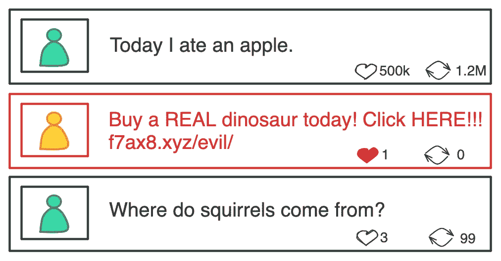

# 精准度和召回率的商业视角

> 原文：[`towardsdatascience.com/a-business-lens-on-precision-and-recall-1ce2f5b77eed?source=collection_archive---------8-----------------------#2023-12-22`](https://towardsdatascience.com/a-business-lens-on-precision-and-recall-1ce2f5b77eed?source=collection_archive---------8-----------------------#2023-12-22)

## 社交媒体垃圾信息案例研究

 [Matt Sosna](https://mgsosna.medium.com/?source=post_page-----1ce2f5b77eed--------------------------------)

·

[关注](https://medium.com/m/signin?actionUrl=https%3A%2F%2Fmedium.com%2F_%2Fsubscribe%2Fuser%2Ff17fb22b897&operation=register&redirect=https%3A%2F%2Ftowardsdatascience.com%2Fa-business-lens-on-precision-and-recall-1ce2f5b77eed&user=Matt+Sosna&userId=f17fb22b897&source=post_page-f17fb22b897----1ce2f5b77eed---------------------post_header-----------) 发表在 [Towards Data Science](https://towardsdatascience.com/?source=post_page-----1ce2f5b77eed--------------------------------) ·18 分钟阅读·2023 年 12 月 22 日

--

照片由[Nong](https://unsplash.com/@californong?utm_source=medium&utm_medium=referral)拍摄，来源于[Unsplash](https://unsplash.com/?utm_source=medium&utm_medium=referral)

*免责声明：本文中的例子仅用于说明目的，并非对任何特定公司内容政策的评论。文章中表达的所有观点均为个人观点，不代表雇主。*

为什么社交媒体上会有*垃圾信息*？除了发垃圾信息的人，没有人喜欢点击诱饵骗局或钓鱼尝试。我们有*几十年*的训练数据来喂养机器学习分类器。那么为什么每个主要的科技平台上的垃圾信息似乎是不可避免的？多年来，为什么机器人农场依然存在？

作者提供的图片

简而言之，答案是 *确实* 很难大规模地对抗垃圾邮件，而且在不伤害真正用户和广告商的情况下，这一难度会呈指数级增长。在这篇文章中，我们将使用**精准度**和**召回率**作为理解垃圾邮件问题的框架。我们将看到，消除 100%的垃圾邮件是不切实际的，并且存在一种基于金融、法规和用户情感的“均衡”垃圾邮件流行度。
