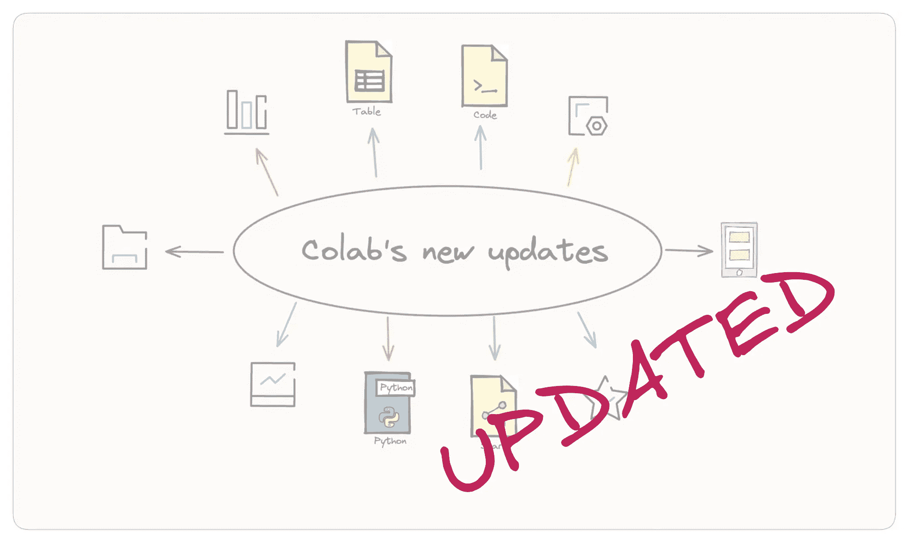

# 深入了解 Colab 的新更新和增强功能

> 原文：[`towardsdatascience.com/a-close-look-at-colabs-new-updates-and-enhancements-f1225fd5d504?source=collection_archive---------4-----------------------#2023-10-03`](https://towardsdatascience.com/a-close-look-at-colabs-new-updates-and-enhancements-f1225fd5d504?source=collection_archive---------4-----------------------#2023-10-03)

## 利用 Google Colab 笔记本的优势

 [Parul Pandey](https://pandeyparul.medium.com/?source=post_page-----f1225fd5d504--------------------------------)

·

[关注](https://medium.com/m/signin?actionUrl=https%3A%2F%2Fmedium.com%2F_%2Fsubscribe%2Fuser%2F7053de462a28&operation=register&redirect=https%3A%2F%2Ftowardsdatascience.com%2Fa-close-look-at-colabs-new-updates-and-enhancements-f1225fd5d504&user=Parul+Pandey&userId=7053de462a28&source=post_page-7053de462a28----f1225fd5d504---------------------post_header-----------) 发表在 [Towards Data Science](https://towardsdatascience.com/?source=post_page-----f1225fd5d504--------------------------------) ·8 分钟阅读·2023 年 10 月 3 日

--

图片由作者使用 [Excalidraw](https://excalidraw.com/) 创建。

*最后更新于 2023 年 12 月 20 日*

每当我进行编码工作坊或教程时，[Google Colaboratory Notebooks](https://colab.google/)——更常被称为 Colab——始终是我首选的资源。它消除了演讲者和与会者的环境设置麻烦，并且提供免费访问强大计算资源如 GPUs 和 TPUs。通过其易于分享的链接，Colab 使整个学习过程更加高效和有效。为了充分利用 Colab 的功能，我会持续关注其最新版本和更新。

虽然我通常会通过 [LinkedIn 分享这些更新](https://www.linkedin.com/posts/parulpandeyindia_googlecolab-datascience-dataanalysis-activity-7092134378327195649-KRHb?utm_source=share&utm_medium=member_desktop)，但大量的新功能和改进值得像这样更全面的文章。我的上一份 Colab 主要功能的汇编是在 2022 年，因此现在是时候更新一下概述了。

 ## 使用这些技巧更高效地使用 Colab

towardsdatascience.com

让我们来看一些 Colab 的突出功能，这些功能在我的工作中极其宝贵。希望你们也能找到同样的价值…
