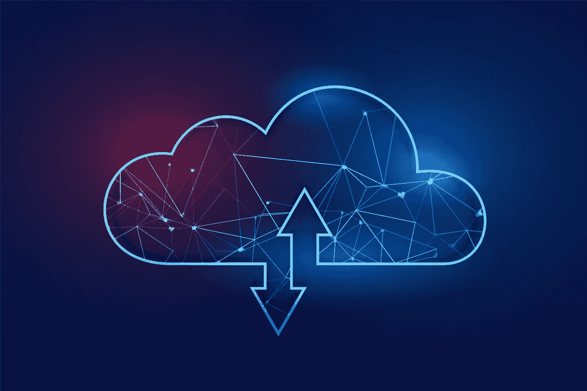

# 云迁移策略：5 步检查清单

> 原文：[`towardsdatascience.com/a-cloud-migration-strategy-a-5-step-checklist-1668c2ece01?source=collection_archive---------18-----------------------#2023-04-18`](https://towardsdatascience.com/a-cloud-migration-strategy-a-5-step-checklist-1668c2ece01?source=collection_archive---------18-----------------------#2023-04-18)

## 优化迁移到云端的成本和工作

 [Andrey Koptelov](https://medium.com/@a.koptelov?source=post_page-----1668c2ece01--------------------------------)

·

[关注](https://medium.com/m/signin?actionUrl=https%3A%2F%2Fmedium.com%2F_%2Fsubscribe%2Fuser%2Fd222ee3fb918&operation=register&redirect=https%3A%2F%2Ftowardsdatascience.com%2Fa-cloud-migration-strategy-a-5-step-checklist-1668c2ece01&user=Andrey+Koptelov&userId=d222ee3fb918&source=post_page-d222ee3fb918----1668c2ece01---------------------post_header-----------) 发表在 [Towards Data Science](https://towardsdatascience.com/?source=post_page-----1668c2ece01--------------------------------) ·6 分钟阅读·2023 年 4 月 18 日

--

[由 Starline 设计 — Freepik.com](https://www.freepik.com)

云迁移策略在开始带来好处之前需要大量的初始投资。这是一个复杂的过程，通常需要做出许多困难的决策。在某些情况下，迁移到云端的需求会落在你的技术专家身上，从数据科学家到机器学习工程师，他们可能无法单独处理这项任务。为了缓解这种情况，我们的专业 IT 顾问和 [云迁移服务专家](https://www.itransition.com/cloud) 已经联合努力，帮助你解决问题。

以下指南提供了控制云迁移项目的五个关键步骤。

# 1\. 确定你需要多少云容量

传统的互联网基础设施提供商并不出售计算能力。相反，他们出售的是资源，或者更具体地说，是全天候运行的服务器，即使你没有使用这些资源，也按小时收费。在大多数情况下，你的云应用程序或系统在预付时间内并未完全加载，因此你在为服务器的空闲时间付费时浪费了预算。

现在，具体数值会根据你的运营规模有所不同。例如，如果一家本地公司不进行夜间操作，如报告或维护，它将面临 12 小时的停机时间。这意味着 50% 的基础设施预算将浪费。

# 可扩展性是一个敏感的问题

单凭抽象的流量预测来购买大型服务器可能过于乐观，而购买小型服务器则可能在系统因突发流行而承受巨大压力时出现故障。

因此，云迁移策略的正确方法是选择能够自动扩展的云服务，或使用基于 AWS Lambda、Azure Functions 或类似专业服务的无服务器后台系统。这些服务支持自动后台扩展，意味着你可以享受按需付费和按使用付费的模式。

然而，使用云服务并不总是一个好主意。例如，当托管在云端时，你不知道你的组件将部署在哪些物理服务器上。网络附加存储可能不如本地硬盘高效。在响应时间至关重要的高负载系统中，本地服务器可能表现更好。

# 2\. 调整你的架构

如果你按原样迁移你的系统，云服务将总是比本地存储更贵。为了优化成本，你应该在迁移之前调整你的架构，并选择合适的服务来促进这一复杂过程。

你还应该考虑云提供商的管理成本和可扩展性开销，因为云提供商提供的是完全托管的服务。

考虑到所有这些因素，对[云迁移](https://www.g2.com/glossary/cloud-migration-definition)的唯一正确方法是决定哪些系统组件必须保留在本地，哪些需要迁移到云端。

# 平衡服务利用

在做出重大决策之前，分析那些已满载和未充分利用的服务。首先优化架构将使云服务比专用服务器更便宜。为帮助你完成这一点，以下是一些最典型的开箱即用的步骤：

+   将所有静态资源迁移到 CDN：这应能减轻应用服务器的一部分负担。

+   使用平台内基础设施组件，如负载均衡器、消息队列和缓存服务。

+   用无服务器处理程序（来自 AWS Lambda 或 Azure Functions）替换不常用的例程和服务。

+   对于负载偶尔且对响应时间宽容的简单后端服务，可以完成完全替换。

要发现可以替换的更多服务，你可以咨询云计算提供商，如 AWS 和 Azure，它们目前是最受欢迎的两家。

# 计算成本

回答臭名昭著的定价问题非常困难。计算结果可能会因你认为的最佳选择——本地还是云——而倾斜到任何一边。

让我们举一个简单的例子。假设你有一个最初设计为本地运行的系统。这个系统非常繁忙，拥有超过 10 TB 的数据，每天有 8,000,000 多次事件更新，以及每分钟 30,000 次事件吞吐量。你需要为这个系统制定一个云迁移策略。

在这种情况下，你将分两步迁移：

1.  你将重写基础设施组件，以便从无服务器服务中受益。

1.  你将选择最佳的现成云服务。

通过优化和重新工程你的基础设施，你将能够在需要更少语言的情况下迁移。而且，通过使用无服务器服务，你将看到总体成本的显著下降。

通过这种方式迁移的一些好处包括自动扩展、简化开发和支持以及资源优化。

# 保护你的数据

出于安全原因，某些行业无法完全考虑云迁移：例如，银行和金融、公共部门、保险和医疗保健。然而，包括政府机构在内的许多高度监管组织已经找到了一种在云中托管其系统的方法。

他们选择了混合模型，只需在云中存储数据的一部分，从而通过维护严格的用户访问限制和利用强大的政府防火墙来保护自己免受攻击。

即使你有多个安全顾虑，如果你和你选择的云服务提供商能够共享以下责任，迁移到云中仍然是可能的。

**你的责任**

**云服务提供商的责任**

根据云服务提供商的安全认证来选择。

分析安全风险并扫描你的架构漏洞。

制定有效的 SLA，涵盖提供商-客户关系、第三方和云经纪人。

制定针对特定案例的威胁管理计划，明确的事件解决路线图。

选择混合模型，在这种模型中，你可以将关键任务解决方案保存在本地以确保安全。

使用与企业网络隔离的虚拟机来应对安全风险。

维护一个灵活的安全模型，随着威胁的变化不断演进。

# 选择开源

许多企业在寻求外部软件开发服务并希望采用云服务时，担心所谓的供应商锁定，即在承诺某个供应商后无法离开云服务或更改供应商。其他重要的担忧还包括在更换供应商时应用程序的互操作性和可移植性，以及可能需要支付更多费用来更改基础设施。

为了应对锁定问题，你应该通过研究提供商的文档或咨询专家，发现其品牌名称背后的实际内容。例如，以下是一些来自 AWS 生态系统的开源或可互操作的服务：

+   AWS ElastiCache：使用 Redis 或 Memcached 作为后台缓存服务

+   亚马逊 Aurora：与 MySQL 兼容的数据库服务

+   亚马逊 Redshift：最初基于 PostgreSQL 构建的数据仓库服务，仍然兼容大多数 SQL 功能

你还可以选择使用标准或开放协议的云服务，允许在必要时更换提供商。此外，开放协议为设备互操作性提供了空间，无需使用专有的网关或接口。

现在，如果云服务提供商在开放协议的基础上还提供自己的专有协议，那么建议总是选择后者。例如，Azure 服务总线提供了自己的 API 以及一个支持的 AMQP——一种开放的消息传递协议。通过选择开放标准，你可以保持灵活性。这意味着你可以更换提供商，甚至部署支持相同协议的自有服务实例，而无需对客户端组件做出重大更改。

# 结论

云迁移是一个复杂的多层次过程，需要大量的规划。本指南概述了关键的云迁移步骤，帮助你最小化基础设施成本，避免供应商锁定，并解决云采用过程中常见的担忧。
