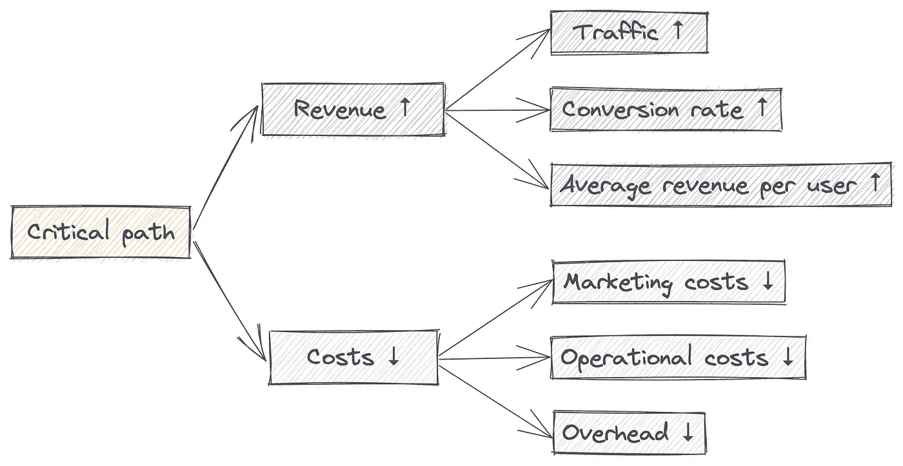
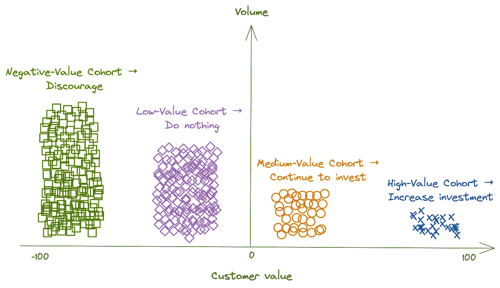
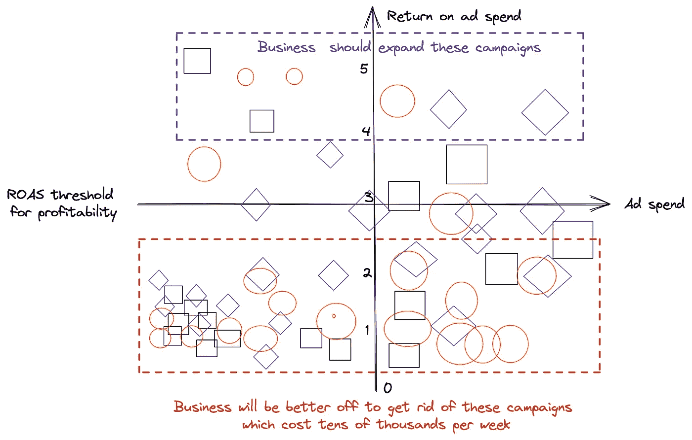
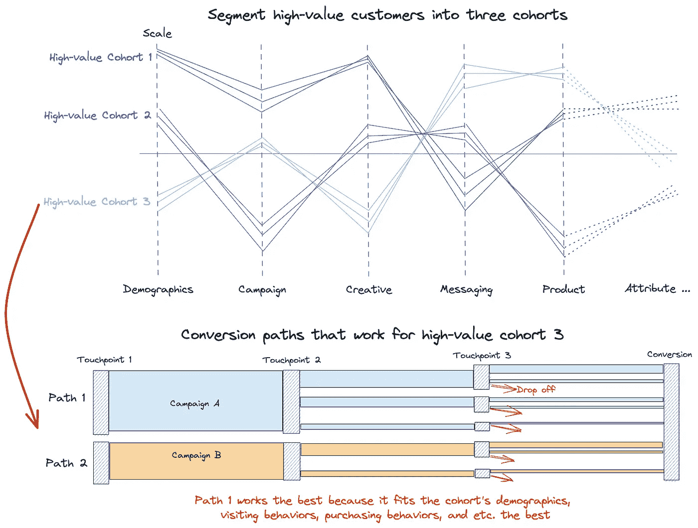
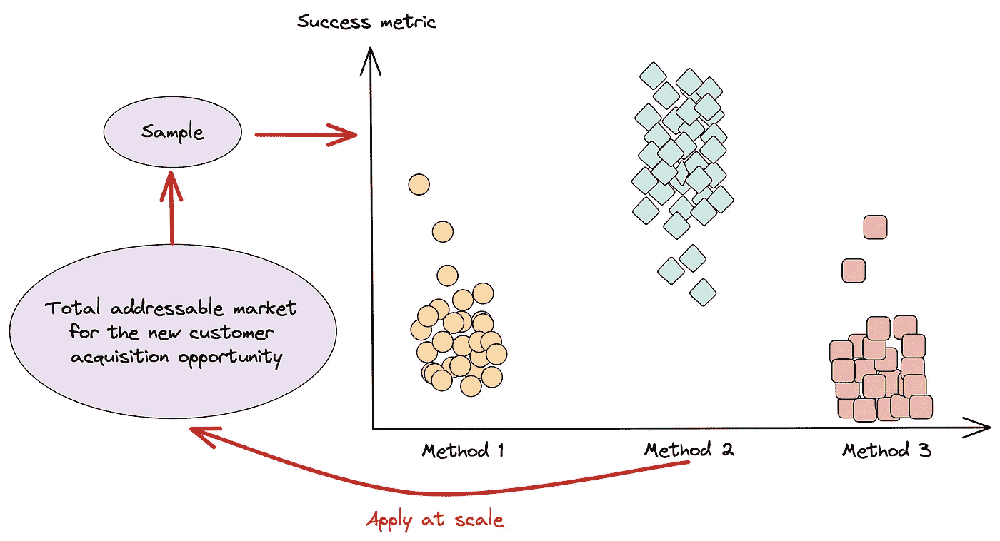
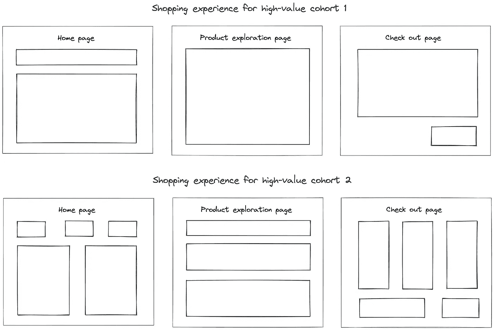

# 数据驱动的客户获取完整指南

> 原文：[`towardsdatascience.com/a-complete-guide-to-data-driven-customer-acquisition-f0f1708b328?source=collection_archive---------2-----------------------#2023-01-18`](https://towardsdatascience.com/a-complete-guide-to-data-driven-customer-acquisition-f0f1708b328?source=collection_archive---------2-----------------------#2023-01-18)

 [Ivy Liu](https://ivylc.medium.com/?source=post_page-----f0f1708b328--------------------------------)

·

[关注](https://medium.com/m/signin?actionUrl=https%3A%2F%2Fmedium.com%2F_%2Fsubscribe%2Fuser%2F71fa5614d897&operation=register&redirect=https%3A%2F%2Ftowardsdatascience.com%2Fa-complete-guide-to-data-driven-customer-acquisition-f0f1708b328&user=Ivy+Liu&userId=71fa5614d897&source=post_page-71fa5614d897----f0f1708b328---------------------post_header-----------) 发表在 [数据科学前沿](https://towardsdatascience.com/?source=post_page-----f0f1708b328--------------------------------) ·6 分钟阅读·2023 年 1 月 18 日

--

在过去的十年中，我有幸与超过 100 位企业家合作。不论他们的地理位置、产品、财务状况或行业经验如何，他们都有一个共同点：客户获取让他们寝食难安。为了推动客户获取，公司不懈地努力建立其营销引擎。出色的营销带来流量，提高转化率，并降低成本。

作者提供的图片

优化顾客获取的一种方法是通过精准营销，公司只针对目标顾客进行投资。传统上，这些努力主要依赖于行业和营销经验。然而，形成既有行业知识又有营销经验的团队是具有挑战性的。正如你所想象的那样，行业专家专注于他们的市场和产品，通常并不是营销专家。另一方面，偶尔理解特定市场的营销人才既稀缺又昂贵。对于定义新产品类别的初创公司来说，情况更加困难。

这就是数据科学家帮助营销的地方。公司可以通过定期发起实验、实时监控表现，并根据市场反馈快速迭代，从而获得对其行业独特的营销经验。此外，数据科学比人工努力更好地处理高维度的营销数据，并提供更丰富的见解来支持商业决策。在本文中，我将讨论经过验证的低成本数据分析方法，这些方法能有效改善营销决策，并逐步介绍如何应用它们。

# 选择目标顾客

正如古话所说，做出选择比花费精力更具影响力。当公司资源有限时，这总是情况，过于分散的努力会导致在激烈的市场竞争中失去优势。投资于正确的顾客提供了更多成功的可能性。

如在重点关注最有价值的顾客中讨论的那样，顾客价值可以通过以下方式计算：

**顾客的长期价值 = 顾客重复购买的收入 — 获取成本**

例如，一家奢侈珠宝品牌的顾客不会频繁购买。在这种情况下，可以将顾客价值计算的时间框架设置为一年。基于其销售和营销归因系统，该品牌可以计算每位顾客（或未转化的访客）的年度收入和获取成本。通过这些数据，品牌可以迅速得出每位顾客的价值，并决定谁值得投入营销预算。

在大多数公司中，顾客价值分布图如下所示。大多数顾客对公司带来的价值较低或为负，因此应予以忽视或劝阻。下图中的左右分界通常遵循 80/20 法则。

作者提供的图片

# 确定对目标顾客有效的营销活动

商业的本质是一种实验，这意味着大多数商业活动注定不会产生积极的结果。在初创公司中，多达 95%的工作是无效的。公司必须迅速在噪声中找出有效的部分才能成功。通过实时监控市场营销表现，公司有最佳的机会立即区分出好的信号与坏的信号，并[采取行动](https://seizing-the-low-hanging-fruit-in-business-with-data-science-7b3a3265e07e)。

图片由作者提供

根据客户价值分析，该珠宝品牌决定针对高价值群体推出营销活动。这些活动在 Google、Facebook、TikTok 等广告平台上进行。品牌根据假设实施所有策略——它认为客户喜欢某些东西，但不确定。只有当品牌收集并评估活动表现数据后，才能确定哪些活动值得投资，哪些不值得。

尽管上述图表的含义似乎很明显，但大多数公司却忽略了这些信号。因此，当公司开始关注时，通过简单地削减那些无效的市场营销举措的预算，它们将获得巨大的增长机会。

# 揭示市场营销举措为何有效与否

公司通过加倍投入那些有效的市场营销举措，在短期内获得超额回报。通过在新的举措中复制这些成功的经验，公司在竞争中拥有优势。

然而，当外部环境发生变化时，复制和粘贴以前的经验可能不会产生预期的回报。因此，公司需要揭示为什么以及为什么某项举措有效。这样，当市场和时间发生变化时，公司可以更好地确定哪些旧方法仍然适用，哪些不适用。

手动估算市场营销举措背后的原因可能很具挑战性。有太多维度需要分析：客户的 demographic 信息、接触点互动、访问行为、购买行为等等。

[客户细分](https://ivylc.medium.com/empower-precise-marketing-with-customer-segmentation-97fe69027d57)是一种有价值的技术，可以简化上述分析。通过客户细分提供的详细信息，公司可以识别出对每个客户群体最有吸引力的活动、购物体验和产品，并回顾它们为何具有吸引力。

图片由作者提供

这个珠宝品牌在情人节期间测试其活动策略，取得了初步成功。当下一个重要节日母亲节临近时，品牌希望了解情人节的经验是否适用。因此，它进行客户细分分析，以了解哪些因素促成了情人节的成功。从分析中，品牌发现情人节的目标客户只有一部分与母亲节的目标客户重叠。它可能会在母亲节促销中部署针对这部分客户的有效活动策略。

# 测试和学习

通过实验发现有效的方法后，企业可以在新客户获取机会出现时，应用成功的方案。来自客户细分的丰富信息帮助公司在业务迭代中领先一步。

在大规模实施之前，公司必须通过对样本进行测试和学习，验证经验是否适用于新的机会。常见的测试和学习方法包括 A/B 测试和可视化。

图片由作者提供

在母亲节的大促销之前，珠宝品牌基于情人节的所有经验启动了一次小规模的活动。大多数经验仍然有效，但创意和信息传达可以做一些调整。品牌修改了其活动并在更大范围内进行测试。它在每天的几个周期内重复这个过程，直到获得满意的结果并全面推广。

# 个性化

与常识相反，对于大多数企业来说，个性化是一种一对多的营销机制。一旦公司找出如何通过营销渠道、活动、创意、信息传达等吸引每个客户细分，他们就准备在客户获取计划中推广个性化。例如，公司可以为每个客户细分预定义其网站、浏览体验和产品推荐。当一个符合特定细分的访问者进入网站时，公司可以自动为他们提供合适的购物体验。

图片由作者提供

在进行了一年的不同促销活动后，这个珠宝品牌收集了足够的客户数据。品牌了解每个客户群体的购物偏好。因此，品牌设计了五种不同的客户体验，以适应最多的目标客户。提供了理想的购物体验后，目标客户转化更快，购买量比之前增加。

# 背后的数据科学

两组数据科学技术对于实现上述分析至关重要。第一组包括能够[连接点滴](https://medium.com/towards-data-science/connect-the-dots-in-data-strategy-56f65a1e63a5)的数据工程技术。常听说数据管道基础设施是数据科学项目最大的障碍。得益于数据行业的发展，越来越多的连接工具简化了从多个来源获取数据的过程。

第二个关键因素是身份技术。由于 iOS 隐私政策的变化，使用唯一用户标识符来关联用户旅程中的不同接触点变得越来越具有挑战性。幸运的是，独立于个人标识符的营销技术，如营销混合建模，提供了另一种选择。

我在文章中讨论了如何利用数据科学提升业务和优化营销。如果你想讨论客户获取或其他数据科学主题，请在[LinkedIn](https://www.linkedin.com/in/ivylc/)关注我或通过 newsletter@ivyliu.io 联系我。下次见。
