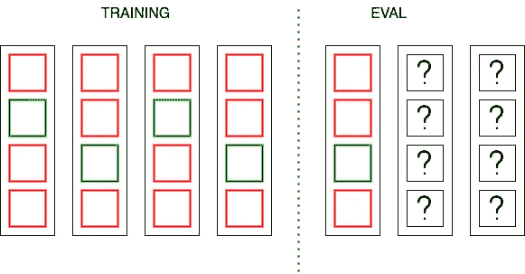
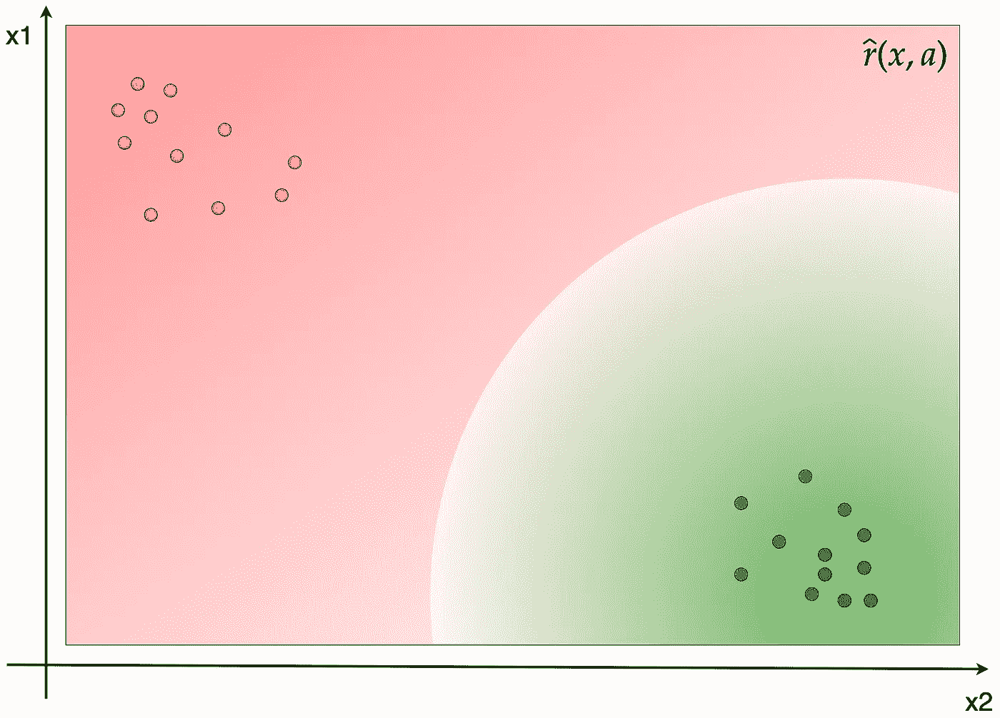
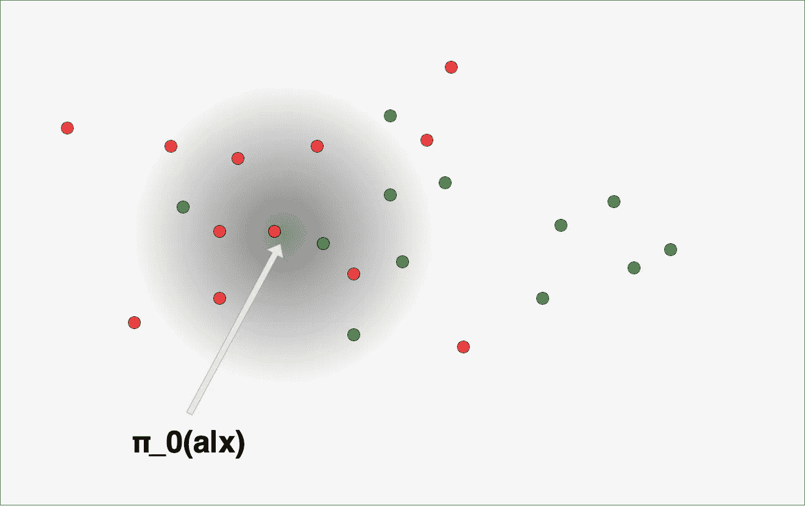
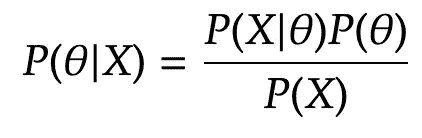

# 推荐系统离线评估的完整教程

> 原文：[`towardsdatascience.com/a-complete-tutorial-on-off-policy-evaluation-for-recommender-systems-e92085018afe`](https://towardsdatascience.com/a-complete-tutorial-on-off-policy-evaluation-for-recommender-systems-e92085018afe)

## 如何缩小离线与在线评估之间的差距

 [Adrien Biarnes](https://biarnes-adrien.medium.com/?source=post_page-----e92085018afe--------------------------------)

·发表于 [Towards Data Science](https://towardsdatascience.com/?source=post_page-----e92085018afe--------------------------------) ·18 分钟阅读·2023 年 3 月 11 日

--

推荐系统跨越离线与在线评估差距（AI 生成的图像）

# 介绍

在本教程中，我将解释为什么应该关注离线评估。接着我会介绍适量的理论。我不会深入探讨最新的方法，而是停留在经验上效果良好的方法。这对于接下来的实际实施部分将足够。

# 评估推荐系统

假设你有一个提高推荐系统性能的想法。假设你获得了关于项目的新元数据，例如项目的主要主题，这应该有助于更准确地预测用户在平台上的参与度。那么你如何利用这个新特性呢？在对新数据进行全面探索后，你需要对数据管道进行必要的修改，以转换特性并将其与其他特性一起输入模型。现在你可以启动学习阶段以生成新版本的模型。

太好了！那么，你如何评估新模型的表现？你如何确定新特性是否有助于推荐，并能驱动平台上的更多参与？

好的，你可以直接将新版本与旧版本一起投入生产，将一部分流量重定向到新模型，并使用你为业务定义的最重要的指标（点击率、观看时间、深入时间、订阅等）比较两者的表现。这确实被称为 AB 测试。

作者提供的图像

但如果新版本糟糕，导致收入大幅下降或严重恶化服务质量，那可能会非常糟糕！

通常，作为机器学习从业者，你首先需要验证新版本是否比旧版本更好，采用离线方式进行，即无需向真实用户展示任何内容（我感觉对你们中的大多数人来说这很简单——但请耐心，我马上就会讲到）。

避免收入下降非常重要，但这并不是唯一的关注点。进行在线 AB 测试需要时间，尤其是在流量不大的情况下。在这种情况下，可能需要几周才能得出具有足够统计信心的结论。此外，在这种情况下，你可能需要将模型重写成不同的堆栈，以便它可以扩展并满足延迟要求。这可能需要额外的几周（甚至几个月）的工作。因此，拥有一个强大的离线评估策略可以更快地迭代不同的想法或超参数进行调整。可以在离线评估中评估数千个想法，并仅选择最有前景的候选者进行在线 AB 测试。

使用日志数据 D_0 离线构建多个候选策略

但是在离线环境中，我们无法直接测量点击率或观看时间，因为我们事先不知道未来的用户是否会点击或他们将花多长时间消费推荐的项目。我们在操作一个反事实场景。也就是说，我们无法观察到我们没有采取的行动的奖励，只能看到已采取行动的奖励。

在在线环境中，这一主要评估缺陷不再是问题。我们根据用户在平台上的实际行为收集反馈。相反，离线评估始终会严重偏向于测量过去的行为，并且在评估实际会发生什么方面有限。

> 那么我们是否要接受这一事实而不加以改变，还是可以对此做些什么呢？

# 什么是离线策略评估，为什么你应该关心？

让我们首先介绍一些在阅读关于离线策略评估时会遇到的重要词汇。当用户进入你的平台时，会发生以下情况：

图片由作者提供

离线策略评估是指使用从不同策略收集的数据来评估新策略。我们希望提出一个估计器**V_hat**，该估计器将基于日志数据**D_0**估计新推荐器**π_e**的性能，而这些日志数据**D_0**是用于训练旧策略**π_0**的：

## 直接方法

正如我之前所说，在评估我们的推荐系统时，我们在一个反事实环境中操作。我们不知道我们没有采取的行动会产生什么结果。因此，基本上我们有一个缺失标签的问题。

作者提供的图像 — 新推荐项目的缺失标签问题

在上图中，对于第一次推荐，我们成功推荐了记录数据中看到的点击项，因此我们可以说我们有一个积极的预测，而其他项是负面的。但对于其余的评估数据集，我们推荐了完全不同的项目，因此我们不知道结果会是什么。

鉴于我们已经记录了交互数据**D_0，** 一个简单的想法是，许多机器学习从业者可能会想到，利用这些数据来生成一个机器学习模型，该模型将直接估计缺失的奖励（例如，用我们的最佳猜测替换上面的问号）。然后我们可以像往常一样进行评估。更正式地说，我们希望生成一个奖励模型**r_hat**，该模型将给出在给定上下文和特定行动时奖励的期望值：

许多机器学习模型可以用于这个任务。这虽然很好，但实际上效果并不理想！让我们来看看原因……

似乎记录的数据和我们想要预测的数据不来自相同的分布。存在较大的协变量偏移。我们记录了某些特定行动的数据，而尝试预测其他（可能完全不同）行动的奖励。假设我们利用了 2 个特征来尽量减少奖励模型的遗憾。我们可以如下绘制奖励空间：

作者提供的图像 — 奖励空间的可视化

绿色点是正观察（用户感兴趣的观察），红色点是负观察。发生的情况是，奖励空间大部分是空的。存在广阔的区域我们没有任何观察数据。但我们的新政策可能需要在这些未知空间中做出决策。这意味着奖励模型如何外推非常重要。决策边界在上述图中的位置也非常重要。而这不会在奖励模型尝试最小化的遗憾函数中反映出来。因此，外推出现错误的可能性非常高。最终，这种方法表现出低方差但可能非常偏倚。

因此，使用模型来预测奖励似乎不是一个有效的方法。我们还能做什么？这时模型无关的方法就派上用场了。

## 逆倾向评分（IPS）

这个估计器的目标是**重新加权奖励，以便根据旧政策和新政策采取行动的倾向来赋予行动更多或更少的重要性。** 我们希望降低旧政策比新政策更多采取的行动的重要性（反之亦然）。

让我们可视化一下这个概念。下面是旧政策**π_0**在给定上下文的情况下采取行动的概率空间**：**

作者提供的图像

红色和绿色的点仍然是观察到的奖励。暗区是条件动作概率质量的集中区域。

现在，新策略**π_e**将在空间的不同部分采取行动，如下所示：

图片由作者提供

IPS 估计器的目标是通过应用以下公式来重新加权奖励：

两个动作概率之间的比率称为重要性权重。结果如下：

图片由作者提供

可以证明，这种方法是无偏的，意味着我们收集的数据越多，IPS 估计器将越趋近于在线奖励的真实值。

如果你还是很难理解这个概念，让我们进一步简化。假设我们只有 2 个推荐的项目。我们已经收集了这些项目的用户互动数据（如评估数据集中所见）：

图片由作者提供

当然，如果你的新策略**π_e**总是预测项目 1，那么你的推荐系统的整体精度将高于一个总是预测项目 2 的策略。或者会这样吗？现在让我们将显示数据加入其中：

图片由作者提供

现在，从这些角度来看，你肯定能理解离线评估的附加价值。考虑到显示数据，我们看到旧策略**π_0**（生成了上述日志）高度偏爱项目 1。而这可能不是最佳推荐。偏爱项目 2 似乎是一个更好的选择，但为了实现这一点，我们需要在评估过程中考虑显示数据（例如，策略推荐项目的倾向）。

但这种方法可能会表现出很强的方差，因为某些奖励估计可能完全偏离。这是因为我们在计算两个动作概率的比率，而这些比率有时可能非常小。例如，如果给定观察的旧策略的动作概率非常小，则重要性权重可能变得很大，使得这个特定观察的权重过高。

## 裁剪反向倾向评分（CIPS）

这个估计器是经典 IPS 的一个变体，试图解决我们刚刚提到的挑战。它通过裁剪重要性权重来实现这一点，以使其不会超过最大值：

问题在于，这种修改破坏了 IPS 估计器的无偏性，但更重要的是，它引入了一个可能非常不实用的超参数。

## 自归一化反向倾向评分（SNIPS）

这一次，我们通过重要性权重的经验均值的倒数来重新加权普通的 IPS。这只是简单地调整了普通 IPS 的结果。正如我所说，IPS 的问题在于有时我们可能会因为一个微小的旧策略动作概率而获得巨大的重要性权重。SNIPS 估计器通过将这种巨大的重要性权重“取消”来解决这个问题，因为它也会包含在分母中。

最终，估计器在经验上表现非常好，并且没有超参数需要调整，这使得它对大多数机器学习从业者非常有吸引力。

# 如何实现重新加权的离线策略评估方法？

在研究相关文献时，我们可以看到，大多数机器学习研究者的努力都集中在寻找最佳方法，以获得一个无偏差且方差低的在线奖励离线策略估计器。但几乎没有人讨论实现这些策略的实际问题。更糟糕的是，大多数研究者使用模拟数据来展示他们方法的稳健性。这在理论上很棒，但在实际应用中，实施方法时会遇到困难。

我们已经看到，自我标准化逆倾向评分（SNIPS）估计器在经验上表现良好，没有需要调整的超参数，方差低且一致（尽管有偏）。

> 那么我们准备好实现这个估计器了吗？嗯，还没有完全准备好。

离线策略评估是否有效很大程度上取决于我们能多准确地计算动作概率**π(a_i|x_i)**。这实际上是**最重要的部分**！

为了做到这一点，我们首先要花时间正确地定义这些概率。让我们首先思考概率**π**在给定上下文**x_i**的情况下“选择”动作**a_i**的定义。

人们必须记住，**我们的目标是重新加权奖励，以便在新策略π_e 很不可能采取这些动作时，减少对由旧日志策略π_0 收集的动作的重视**（反之亦然）。

那么，什么是动作**a_i**？在这里，区分策略输出推荐项的概率和项被显示给用户的概率是很重要的。这些概率差异很大。确实，一个算法可以输出 1000 个项目，但由于 UI 限制（我们不能在移动设备上显示 1000 个项目），只有一小部分会显示给用户。正如我刚才所说，我们关注的是所采取的动作将最终出现在日志数据中的概率。因此，我们关心的是显示概率，而不是推荐系统的输出概率。这一点非常重要，因为它改变了如果一个人想要估计动作概率（例如，推断显示而不是输出）时需要考虑的数据源。

现在，**x_i**的背景是什么？实际上，它可以是任何东西。作为建模者，你负责定义它。从理论上讲，背景越相关和精确，也就是说，我们拥有的信息越相关，我们应该能够更准确地估计展示概率。但在实践中，这也使得任务更加困难。特征空间越大，你需要的数据就越多以产生稳健的估计。而拥有稳健的估计至关重要。如果你的展示概率完全错误，你将会给特定奖励过多或过少的重视，这完全违背了离线评估的目的。正如我将简要说明的那样，一个好的做法是简化背景，仅使用最重要的特征。

# 展示概率估计

## 首先，一个失败的方法

当我第一次接触离线评估时，我需要了解我的前任之一实施的方法。这是一种高级方法，其中展示概率由深度学习模型直接估计。澄清一下，我们在这里没有使用直接方法。模型没有用于直接估计未知的奖励。它用于估计旧政策和新政策的展示概率**π(a|x)**。凭借这些概率，我们可以计算重要性权重并应用如 IPS、CIPS 或 SNIPS 等估计器。

不深入细节，我们可以用一张图片来简单解释。这里做的是从一个从非常广角看起来像这样的模型：

作者提供的图像 — 深度推荐系统架构的广泛概述

变成这样：

作者提供的图像 — 修改后的架构以预测展示概率

理论上，这非常整洁，因为我们可以在给定非常精确的输入集合时获得概率。我们可以在非常细粒度的层面上估计展示概率。这是[谷歌 YouTube 团队的这篇论文](https://arxiv.org/pdf/1812.02353.pdf)中找到的一个想法的实现。

但在实践中，它失败了，原因如下：

+   我们现在有了两个目标而不是一个（用户**和**展示作为推荐的序列的下一个视频）。这引入了额外的问题，这些问题没有得到妥善管理，比如：如果我们只有序列中的下一个视频但没有相关的展示（只有一个目标）怎么办？确实，在训练数据中，我们使用的是来自其他来源（外部）的序列视频，而不是我们没有展示任何推荐的平台。

+   拥有两个目标意味着有两个不同的损失函数。你如何将它们结合起来？如果其中一个损失在完全不同的值范围内（这就是发生的情况），那么在你将它们结合时，它可能会变得不重要（这会导致其中一个分支没有学习到任何东西）。

+   整体代码库变得复杂得多。

+   理论上，引入辅助任务对主要任务是有利的，但需要它们之间良好的对齐。在这种情况下，增加的复杂性使得新的显示概率任务使主要任务的性能下降。

+   输出的概率并不是实际的概率。实际上，模型要么过于自信，要么完全没有自信。这是深度学习模型中的一种常见情况，因为这些模型倾向于过拟合而表现出过度自信。

这就是显示概率的内核密度图（使用虚假数据模拟的）会是什么样的。

作者提供的图片 — 估计的显示概率分布

在这里需要注意的是，仅仅因为你在神经网络的最后激活函数中使用了 sigmoïd 或 softmax，并不意味着你会得到正确的概率。网络的输出确实会位于[0,1]的范围内，但概率很可能不会得到良好的校准。当一个良好校准的模型对一个给定的观察值输出 0.6 时，我们在长期内应找到 60%的目标。这里有[一篇维基百科文章](https://en.wikipedia.org/wiki/Calibration_(statistics))讨论这个问题。在离策略重要性权重计算的背景下，使用良好校准的概率非常重要，因为我们使用的是两个显示概率的比率。当模型输出 0.4 的概率时，应该意味着目标被找到的次数是模型输出 0.2 概率的两倍。0.2 和 0.4 的比率应具有与 0.4 和 0.8 之间的比率相同的重要性。

## 更简单、更准确的方法？

鉴于我第一次的经历，并且考虑到它并不成功，我的问题是：我们真的需要使用机器学习模型来估计显示概率吗？为什么不直接使用现有的数据进行估计呢？

如果你想进行离策略评估，你需要记录显示的项目。因此，你应该在你的数据库中拥有这些信息（无论是什么）。如果你的日志系统经过充分考虑，你也会在日志中拥有上下文。

在使用日志数据进行展示概率的直接估计时，我们需要简化问题。上下文越简单，你将能够生成更稳健的估计。例如，如果你正在创建一个推荐系统，试图在特定项目后推荐一组项目，那么最重要的特征就是输入项。你的目标将是估计当特定项目（我们称之为**i2**）被消费（上下文**x_i**）时，某个项目（我们称之为**i1**）被展示（动作**a_i**）的概率。

为了估计这个概率，你有两种选择。你可以选择：

+   频率估计，即**i1**在**i2**被消费时被展示的次数除以**i2**被消费的总次数。

+   贝叶斯估计：当试验次数（在此情况下为展示次数）过少时，频率估计可能不可靠。当我们在 2 次试验中有 2 次展示时，将展示概率声明为 1.0 似乎不是一个稳健的估计。我们将在最后的专门部分解释其工作原理。

因为我们使用的是由旧策略**π_0**产生的日志数据来计算这些估计，所以实际上我们是在计算旧策略的展示概率。换句话说，我们是在回答这样一个问题：旧策略在这种特定情况下展示这个特定项目的可能性有多大？

现在，我们如何估计新策略**π_e**的展示概率，考虑到该策略从未投入生产，我们也没有收集过与之相关的展示日志？

实际上，我们确实拥有用于生成策略**π_e**的训练数据，因此我们有上下文（在此情况下为每次观察的输入项），并且我们可以记录**π_e**在训练数据上的预测。所以我们拥有了策略的输入和输出。我们唯一缺少的就是策略的输出是否会展示给用户以及展示的排名。因此，这里有一个技巧。我们知道推荐系统输出顶部的项目更有可能展示给用户。我们甚至可以确定项目在特定排名下被展示的总体概率。例如，它可能看起来像这样：

因此，技巧在于将一个项目（由策略输出）展示给用户视为具有概率 p 的伯努利试验。然后我们可以根据 p 进行样本展示结果。

最终，我们将拥有所有需要的东西，以相同的方式精确计算新策略**π_e**的展示概率，就像我们对**π_0**所做的那样（无论是频率方法还是贝叶斯方法）。

拥有展示概率后，我们可以计算重要性权重，并使用 SNIPS 估计器进行离策略评估。

我采用了这种方法，并且效果非常好。事实上，没有离线策略评估时，评估流程的主要指标下降了 10%，但有了离线策略评估，它转变为 2%的增长。于是决定进行一次 AB 测试，结果确实是积极的。

# 关于展示概率的贝叶斯估计的附注

如上所述，展示概率可以通过贝叶斯方法来估计，以获得更稳健的结果。

在频率主义范式中，我们想要估计的参数有一个真实唯一的值，我们通过不断增加实验次数来逐步接近它。它是一个固定的量，与其无关的是概率。相反，在贝叶斯视角下，感兴趣的参数没有真实的唯一值，而是通过概率分布来描述。

**在我们的情况下，频率主义方法有什么问题？**

我们感兴趣的参数是基于输入项的展示概率。因此，我们正在计算两个计数变量的比率。问题在于，在某些情况下，比率的分子过低。当展示次数非常少时，我们的估计不确定性非常高。估计器的误差方差非常大。

**我们如何解决这个问题？**

计数变量遵循二项分布。展示次数遵循参数 p（二项展示的概率）的二项分布。有 p 的概率获得展示，1-p 的概率获得不展示事件。两个计数之间的比率遵循一个参数为 alpha =（成功次数+1）和 beta =（失败次数+1）的贝塔分布。

**我们要计算什么？**

在贝叶斯范式中，我们定义了一个关于参数分布的先验信念 P(Θ)。我们还定义了一个似然函数 P(X|Θ)，它告诉我们在给定对参数分布的信念的情况下观察到数据的可能性。所有的工作都基于贝叶斯公式：

贝叶斯定理

后验分布 P(Θ|X)等于似然函数 P(X|Θ)乘以前验 P(Θ)，再除以证据 P(X)，即观察数据的概率。现在计算观察数据的概率通常是不可处理的。如果我们确实需要获得精确的概率估计以及可信区间等，我们需要依赖先进的贝叶斯推断方法，如马尔可夫链蒙特卡洛 - MCMC（这就涉及到完全不同的领域）。

现在在我们的情况下，优点是先验遵循一个知名分布，似乎似然也遵循一个知名分布。似然模型描述了在给定试验（显示）中观察到成功（点击）的概率，因此它也遵循二项分布。感兴趣的参数是两个计数变量的比率，这两个变量都遵循二项分布，因此先验遵循 beta 分布。而二项分布和 beta 分布的优点是它们是共轭先验。这意味着我们有一个经过验证的理论结果，可以直接给出后验分布的形式，而无需计算证据。在这种情况下，后验分布也遵循 beta 分布，参数为 alpha_posterior = (alpha_prior + nb_success)和 beta_posterior = (beta_prior + nb_failures)。

现在我们知道后验分布遵循 beta 分布，应用 beta 分布的期望值公式，我们可以直接计算显示概率，该概率只是 alpha_posterior 和 beta_posterior 的比率。有关更多信息，请参见[维基百科](https://en.wikipedia.org/wiki/Beta_distribution)。

此外，选择贝叶斯方法计算显示概率的额外好处是我们知道后验的确切分布。除了使用期望值进行排序，我们还可以通过对后验分布进行抽样来执行随机排序程序，以获得排序分数。这将有利于探索，但会牺牲开发，但可能会导致更为多样化的推荐。

# 结论

总之，离线策略评估是一种非常有效的方法，用于减少离线与在线之间的差距，并避免当离线结果是积极的（或相反）时在在线测试中获得包容性结果的失望。

当你开始进行推荐工作时，设置离线策略评估策略可能不是绝对最重要的优先事项，但一旦你开始有了生产中的模型并开始迭代改进模型时，这可能是一个认真考虑的好时机。

此外，从我的经验中可以得出一个重要的教训，即应始终从简单的方法开始，并从那里迭代。
