# 使用 Python 完整的文字处理

> 原文：[`towardsdatascience.com/a-complete-word-processing-with-python-ac4e66963f40?source=collection_archive---------3-----------------------#2023-01-25`](https://towardsdatascience.com/a-complete-word-processing-with-python-ac4e66963f40?source=collection_archive---------3-----------------------#2023-01-25)

## 读取 PDF 文件，利用正则表达式，导出到 Excel 和 Word 文档，并转换回 PDF 格式

[](https://medium.com/@himalaya.birshrestha?source=post_page-----ac4e66963f40--------------------------------)[](https://towardsdatascience.com/?source=post_page-----ac4e66963f40--------------------------------) [Himalaya Bir Shrestha](https://medium.com/@himalaya.birshrestha?source=post_page-----ac4e66963f40--------------------------------)

·

[关注](https://medium.com/m/signin?actionUrl=https%3A%2F%2Fmedium.com%2F_%2Fsubscribe%2Fuser%2Fba33e6d0d27b&operation=register&redirect=https%3A%2F%2Ftowardsdatascience.com%2Fa-complete-word-processing-with-python-ac4e66963f40&user=Himalaya+Bir+Shrestha&userId=ba33e6d0d27b&source=post_page-ba33e6d0d27b----ac4e66963f40---------------------post_header-----------) 发表在 [Towards Data Science](https://towardsdatascience.com/?source=post_page-----ac4e66963f40--------------------------------) · 10 分钟阅读 · 2023 年 1 月 25 日 [](https://medium.com/m/signin?actionUrl=https%3A%2F%2Fmedium.com%2F_%2Fvote%2Ftowards-data-science%2Fac4e66963f40&operation=register&redirect=https%3A%2F%2Ftowardsdatascience.com%2Fa-complete-word-processing-with-python-ac4e66963f40&user=Himalaya+Bir+Shrestha&userId=ba33e6d0d27b&source=-----ac4e66963f40---------------------clap_footer-----------)

--

[](https://medium.com/m/signin?actionUrl=https%3A%2F%2Fmedium.com%2F_%2Fbookmark%2Fp%2Fac4e66963f40&operation=register&redirect=https%3A%2F%2Ftowardsdatascience.com%2Fa-complete-word-processing-with-python-ac4e66963f40&source=-----ac4e66963f40---------------------bookmark_footer-----------)

最近在一个自学项目中，我不得不处理一个 800 页的 PDF 文件。文件的每一章都包含一组共同的问题，而我需要每章中特定问题的答案。现在，逐页浏览文档并评估这些问题的答案会花费我很长时间。我在想是否有快速的办法来扫描每一页，只提取对我有用的信息。我找到了一个 Pythonic 的解决方案。在这篇文章中，我将分享如何使用 Python 读取 PDF 文件，提取每章中仅相关的信息，将数据导出到 Excel 和可编辑的 Word 文档中，然后使用不同的 Python 包将其转换回 PDF 格式。让我们开始吧。


图片由[Dariusz Sankowski](https://unsplash.com/@dariuszsankowski)提供，来自[Unsplash](https://unsplash.com/)。

## 数据

我将使用一个[4 页的 PDF 文件](https://github.com/hbshrestha/Data_Analytics/blob/main/data/autobook.pdf)作为示例，而不是 800 页的文档。在高中最后几天，我的同学们传阅了一本叫做“Auto book”的日记，作为一个记忆，收集彼此的兴趣、偏好和联系信息。我使用的 PDF 文件包含关于四个虚构朋友 Ram、Shyam、Hari 和 Shiva 的虚拟信息。该文件包含他们的国籍、出生日期、偏好（食物、水果、运动、球员、电影、演员）、喜欢的名言、目标、对政治的看法和对世界的留言。

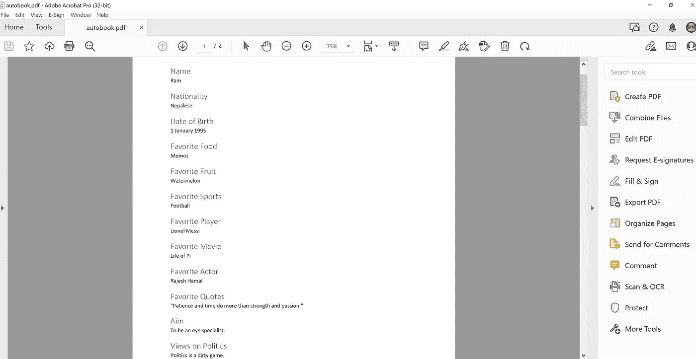

一个名为 autobook.pdf 的 PDF 文件，包含四位朋友的信息和消息。图片由作者提供。

对于几个朋友，直接从 PDF 文件中复制粘贴信息会很简单。然而，如果 PDF 文件很大，使用 Python 来完成将会更加高效和准确。接下来的部分将逐步展示如何在 Python 中完成这项工作。

## 1\. 使用 PyPDF2 或 PyMuPDF 包读取 PDF 文档

**a. 使用 PyPDF2 读取第一页**

要使用 Python 读取 PDF 文件中的文本，我使用了一个叫做[PyPDF2](https://pypi.org/project/PyPDF2/)的包及其 PdfReader 模块。在下面的代码片段中，我只读取了 PDF 文件的第一页，并从中提取了文本。

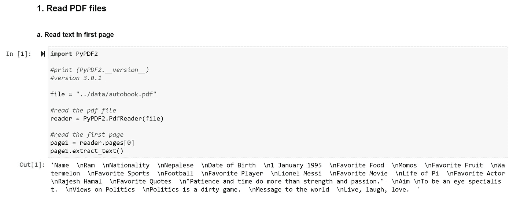

读取 PDF 文件第一页的脚本。图片由作者提供。

**b. 使用 PyPDF2 读取整个文件的文本**

要从 PDF 文件中读取全部文本，我使用了一个叫做`extract_text_from_pdf`的函数，如下所示。首先，函数以二进制格式打开 PDF 文件进行读取，并初始化读取对象。接着，初始化一个名为`pdf_text`的空列表。然后，在循环遍历 PDF 文件的每一页时，将每一页的内容提取出来并追加到列表中。

```py
def extract_text_from_pdf(pdf_file: str) -> [str]:

     # Open the pdf file for reading in binary format
     with open(pdf_file, ‘rb’) as pdf:

     #initialize a PDfReader object
     reader = PyPDF2.PdfReader(pdf)

     #start an empty list
     pdf_text = []

     #loop through each page in document
     for page in reader.pages:
          content = page.extract_text()
          pdf_text.append(content)

     return pdf_text
```

当文件作为参数传递给上述函数时，它返回一个包含元素的列表，每个元素指向每一页的文本。给定文件 `autobook.pdf` 被使用 `extract_text_from_pdf()` 函数读取为 4 个元素，如下所示：

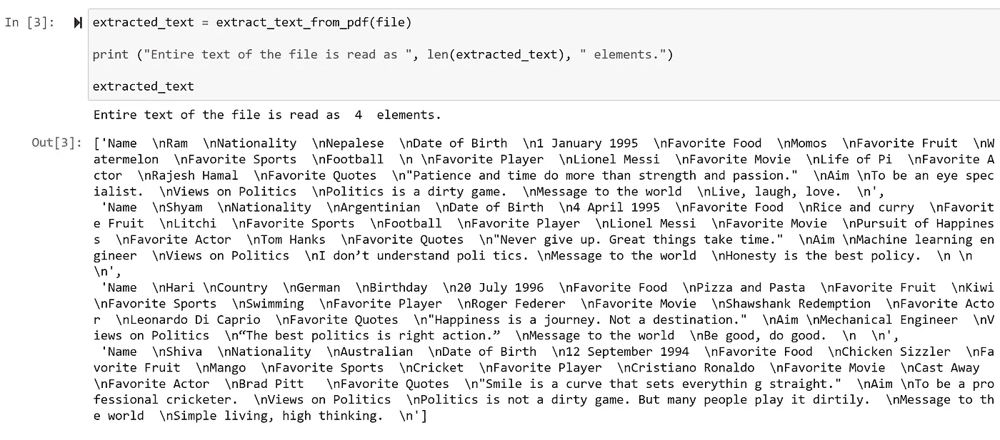

`extracted_text` 内的元素也可以使用以下方法连接为一个单一元素：

```py
all_text = [''.join(extracted_text)]
len(all_text) #returns 1
```

`all_text` 返回一个包含整个 pdf 文件所有页面文本的单一元素的列表。

**c. 使用 PyMUPDF 包读取整个 pdf 文件的替代方法。**

或者，我发现了一个名为 [PyMUPDF](https://pymupdf.readthedocs.io/en/latest/tutorial.html) 的包来读取 pdf 文件中的所有文本，如下所示：

```py
# install using: pip install PyMuPDF
import fitz

with fitz.open(file) as doc:
     text = ""
     for page in doc:
          #append characeter in each page
          text += page.get_text()

print ("Pdf file is read as a collection of ", len(text), "text elements.")
#returns 1786 elements.
```

首先，pdf 文件作为文档打开。`text` 被初始化为空字符串。通过循环遍历文档中的每一页，将每一页上的字符附加到 `text` 中。因此，`text` 的长度为 1786 个元素，其中包括每个字符、空格、换行符和标点符号。

## 2\. RegEx

RegEx 或正则表达式是一系列字符，形成一个搜索模式。Python 有一个内置的 `re` 包用于此目的。

从给定的 pdf 文件中的所有文本中，我想提取出特定的信息。下面描述了我为此目的使用的函数，尽管 RegEx 的使用场景可能更广泛。

**a. findall**

当给定的模式在字符串/文本中匹配时，findall 函数会返回所有匹配项的列表。

在下面的代码片段中，`x`、`y` 和 `z` 返回文本中 `Name`、`Nationality` 和 `Country` 的所有匹配项。在文本中，`Name` 出现了四次，`Nationality` 出现了三次，而 `Country` 仅出现了一次。

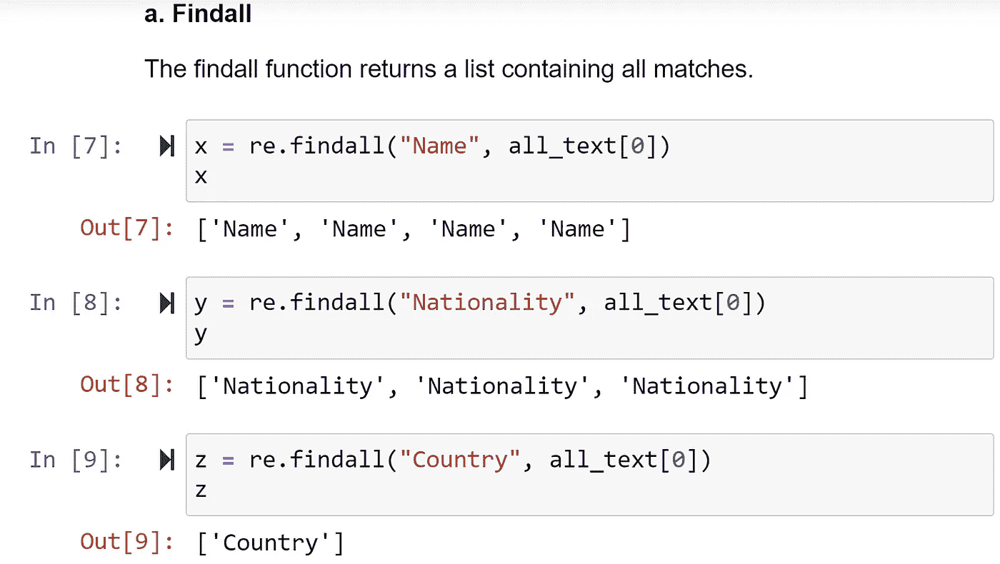

Findall 函数用于返回所有匹配项的列表。图片由作者提供。

**b. sub**

Sub 函数用于用字符串替代/替换一个或多个匹配项。

在给定的文本中，`Nationality` 在名为 Hari 的朋友的情况下被称为 `Country`。为了将 `Country` 替换为 `Nationality`，首先我编译了一个 `Country` 的正则表达式模式。接下来，我使用 sub 方法将模式替换为新词，并创建了一个名为 `new_text` 的新字符串。在 `new_text` 中，我发现 `Nationality` 出现了四次，而在前一个情况下是三次。

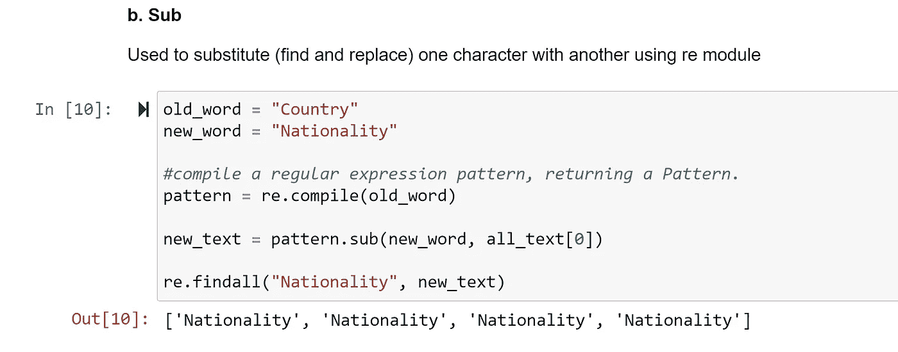

Sub 函数用于在字符串中进行替换/查找和替换。图片由作者提供。

**c. finditer**

finditer 方法可以用来查找字符串中模式的匹配项。

在给定的文本中，`Name` 和 `Nationality` 字段之间的文本包含朋友的实际姓名，而 `Nationality` 和 `Date of Birth` 字段之间的文本包含实际的国籍。我创建了以下名为 `find_between()` 的函数，以在给定文本中查找任何两个连续单词之间的文本。

```py
def find_between(first_word, last_word, text):
    """Find characters between any two first_word and last_word."""

    pattern = rf"(?P<start>{first_word})(?P<match>.+?)(?P<end>{last_word})"

    #Returns an iterator called matches based on pattern in the string.
    #re.DOTALL flag allows the '.' character to inclde new lines in matching 
    matches = re.finditer(pattern, text, re.DOTALL)

    new_list = []
    for match in matches:
        new_list.append(match.group("match"))

    return new_list
```

上述函数中的一个主要参数是 `pattern`。`pattern` 被设置为提取给定文本中 `first_word` 和 `last_word` 之间的字符。finditer 函数返回一个迭代器，遍历字符串中所有不重叠的匹配项。对于每个匹配项，迭代器返回一个 Match 对象。一个名为 `new_list` 的空列表被初始化。通过遍历 `matches`，在每次迭代中，确切的 `match` 被附加到 `new_list` 中，并由函数返回。

通过这种方式，我能够从 PDF 文件中创建每个字段的列表，如姓名、国籍、出生日期、偏好等，如下方代码片段所示：

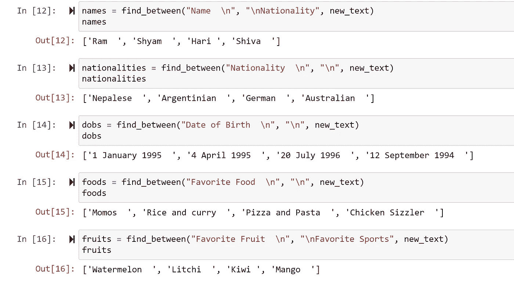

使用 find_between 函数从 PDF 中提取每个朋友的相关档案信息。图片由作者提供。

**注意：**

Python 中的 ‘.’ 特殊字符可以匹配文本/字符串中的任何字符，但不包括换行符。然而，**re.DOTALL** 标志使得 ‘.’ 字符可以匹配包括换行符在内的任何字符。

## 3\. 导出数据到 Excel

**a. 从列表中创建 pandas dataframe**

在上一步中，我获取了每个朋友每个档案字段的列表。在这一步，我将这些列表转换为 pandas dataframe：

```py
import pandas as pd

df = pd.DataFrame()
df["Name"] = names
df["Nationality"] = nationalities
df["Date of Birth"] = dobs
df["Favorite Food"] = foods
df["Favorite Fruit"] = fruits
df["Favorite Sports"] = sports
df["Favorite Player"] = players
df["Favorite Movie"] = movies
df["Favorite Actor"] = actors
df["Favorite Quotes"] = quotes
df["Aim"] = aims
df["Views on Politics"] = politics
df["Messages"] = messages

df = df.T
df.columns = df.iloc[0]

df.drop(index = "Name", inplace = True)

df
```

dataframe `df` 如下所示：

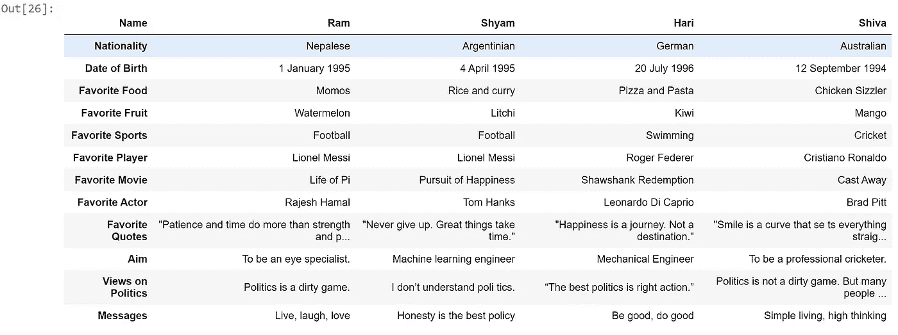

从每个朋友的每个档案字段的列表中推导 pandas dataframe。图片由作者提供。

**b. 使用 pandas dataframe 进行条件格式化**

Pandas dataframe 提供了类似于 Excel 的条件格式化功能。假设我想在 `df` 中突出显示包含我最喜欢的球员 `Lionel Messi` 的单元格。这可以通过 `df.style.applymap()` 函数完成，如下所示：

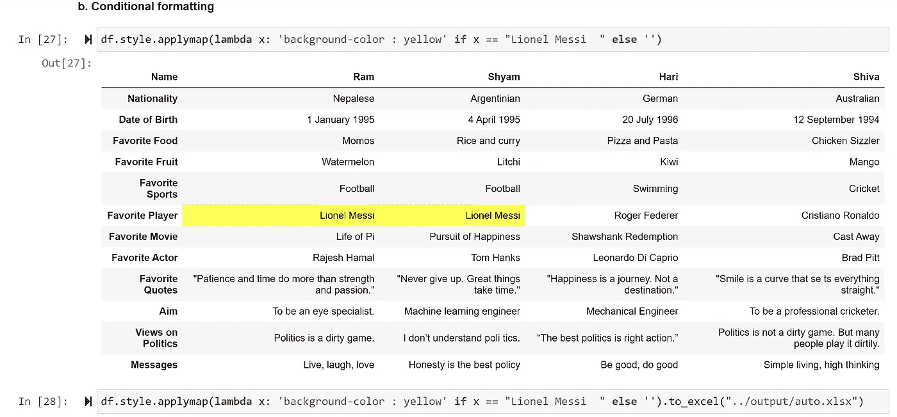

使用 df.style.applymap 函数在选定单元格中应用背景颜色。

当文件以 *.xlsx 格式导出时，如第 [28] 行所示，导出的文件还包含了对包含 `Lionel Messi` 的单元格的黄色高亮。

## 4\. **从 Python 导出到 Word 格式**

**a. 使用 Python-docx 创建 Word 文档**

要将数据从 Python 导出到 Word 格式，我使用了一个叫做 [python-docx](https://python-docx.readthedocs.io/en/latest/) 的包。docx 包中的 `Document` 模块允许创建 Word 文档的不同部分，如标题和段落。

在下面的代码中，我首先为每位朋友添加标题“Name”，接着是包含朋友实际姓名的段落。然后是每个个人资料字段的标题和对应的文本。我在每个朋友的个人资料末尾添加了分页符。

```py
from docx import Document
document = Document()

for column in df.columns:  
    document.add_heading("Name")
    p = document.add_paragraph()
    p.add_run(column)

    for index in df.index:
        document.add_heading(index)
        p = document.add_paragraph()
        p.add_run(df.loc[index, column])

    #add page break after profile of each friend
    document.add_page_break()
```

上述代码有助于在保存后生成以下格式的 Word 文档：

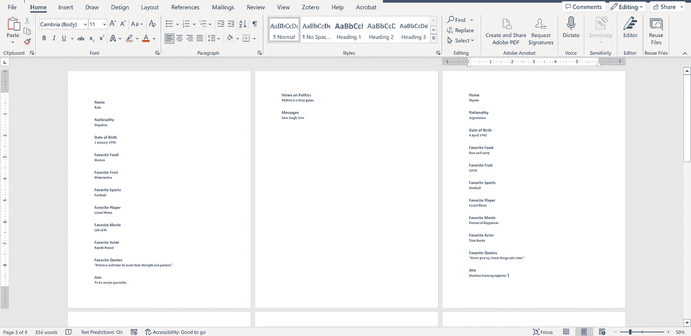

上述代码生成的 Word 文档。图片由作者提供。

**b. 使用 Python-docx 高亮段落**

Python-docx 包帮助生成具有 Microsoft Word 应用程序中大多数功能的 Word 文档。例如，可以添加不同字体样式、字体颜色和大小的字体，并具有粗体、斜体和下划线等功能。

假设我想在文档末尾创建一个名为 Favorites 的部分，并高亮文档中的文本。可以使用以下代码完成：

```py
from docx.enum.text import WD_COLOR_INDEX
document.add_heading("Favorites")
p = document.add_paragraph()
p.add_run("This section consists of favorite items of each friend.").font.highlight_color=WD_COLOR_INDEX.YELLOW
```

**c. 使用 Python-docx 创建表格**

Python-docx 还允许直接从 Python 创建 Word 文档中的表格。假设我想在文档末尾的“Favorites”部分添加一个包含每位朋友最喜欢项目的表格。可以使用 `document.add_tables(rows = nrows, cols = ncols)` 创建表格。此外，需要为表格的每一行/列或单元格定义文本。

在下面的代码中，我定义了一个具有 8 行和 5 列的表格对象。接下来，我定义了表头和第一列。通过循环遍历数据框 `df`，我根据每位朋友的最喜欢项目定义表格中每个单元格的文本。

```py
table = document.add_table(rows = 8, cols = 5)

# Adding heading in the 1st row of the table
column1 = table.rows[0].cells
column1[0].text = ‘Items’

#table header
for i in range(1, len(df.columns)+1):
  column1[i].text = df.columns[i-1]

#first column in the table for labels
for i in range(1,8):
     table.cell(i,0).text = df.index[i+1]
for i in range(2, 9):
     for j in range(1, 5):
          table.cell(i-1, j).text = df.iloc[i, j-1]

#define table style
table.style = “Light Grid Accent 1”
```

**d. 保存文档。**

文档保存为 *.docx 格式文件：

```py
document.save(“../output/python_to_word.docx”)
```

包含“favorites”部分和表格的文档的最后一页如下所示：

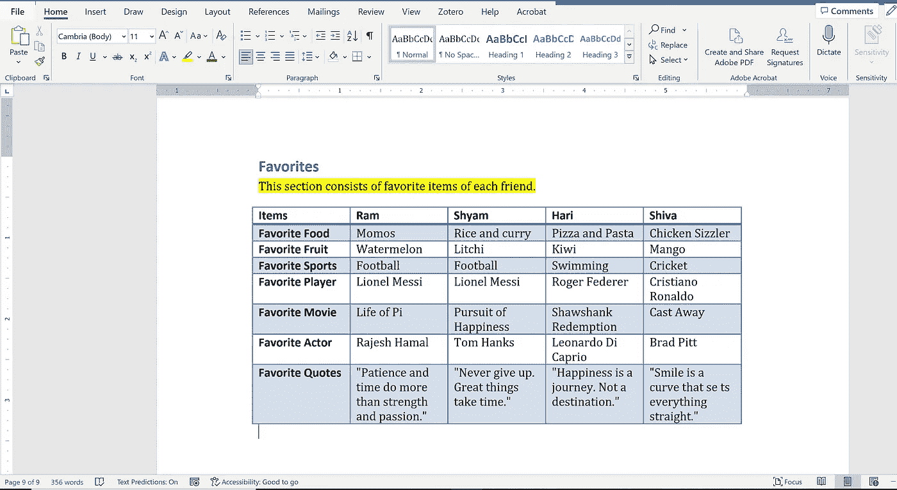

“Favorites”部分和通过步骤 b 和 c 创建的表格。文件使用步骤 d 中的代码保存为 *.docx 格式。图片由作者提供。

## 5\. 将 Word 文档转换为 pdf 格式。

要使用 Python 将文档从 Word *.docx 格式转换为 *.pdf 格式，我发现了一个叫做 [docx2pdf](https://pypi.org/project/docx2pdf/) 的包。可以使用该包的 convert 模块 `convert(input_path, output_path)` 将 Word 文档转换为 pdf 格式。

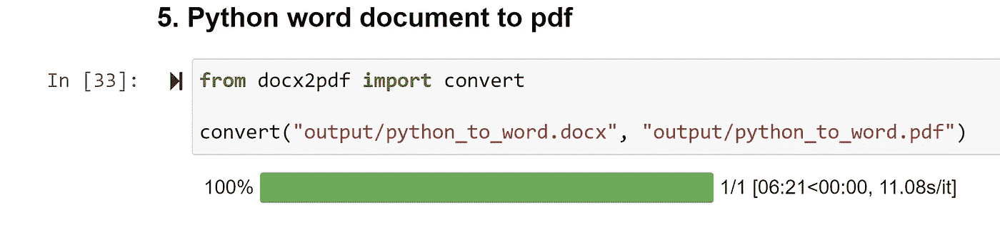

将 Word 文档从 *.docx 转换为 *.pdf 格式。图片由作者提供。

对我来说，输出文件夹如下所示：

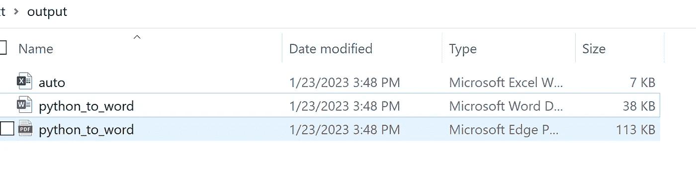

包含 Excel 文件、Word 文档和所有通过 Python 导出的 pdf 文件的输出文件夹。图片由作者提供。

## 结论

扫描 pdf 文件并提取仅必要的信息可能非常耗时和压力大。Python 中有不同的包可以帮助自动化此过程，减轻繁琐性，并使提取精确信息的过程更高效。

在这篇文章中，我使用了一个包含四个朋友个人档案中常见字段/部分/标题的 pdf 文件作为示例，并提取了每个朋友每个字段的相关信息。首先，我使用了 PyPDF2 或 PyMuPDF 包来读取 pdf 文件并打印出整个文本。其次，我使用正则表达式（RegEx）来检测模式并在文本中找到每个模式的匹配项，以提取仅相关的信息。第三，我将每个朋友每个个人档案字段的信息列表转换为 pandas dataframe，并导出为 Excel 文件。接下来，我使用 Python-docx 包创建了一个 word 文件。最后，我再次使用 docx2pdf 文件将 word 文件转换为 pdf 格式。

本文的笔记本和输入的 pdf 文件可以在这个 GitHub [仓库](https://github.com/hbshrestha/Data_Analytics)中找到。感谢阅读！
