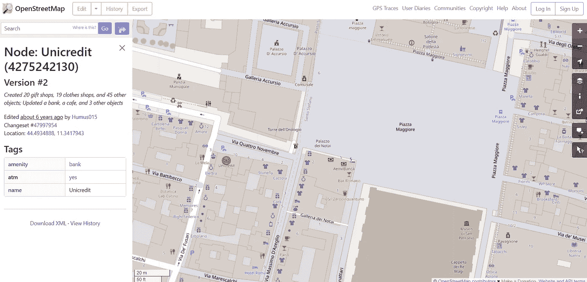
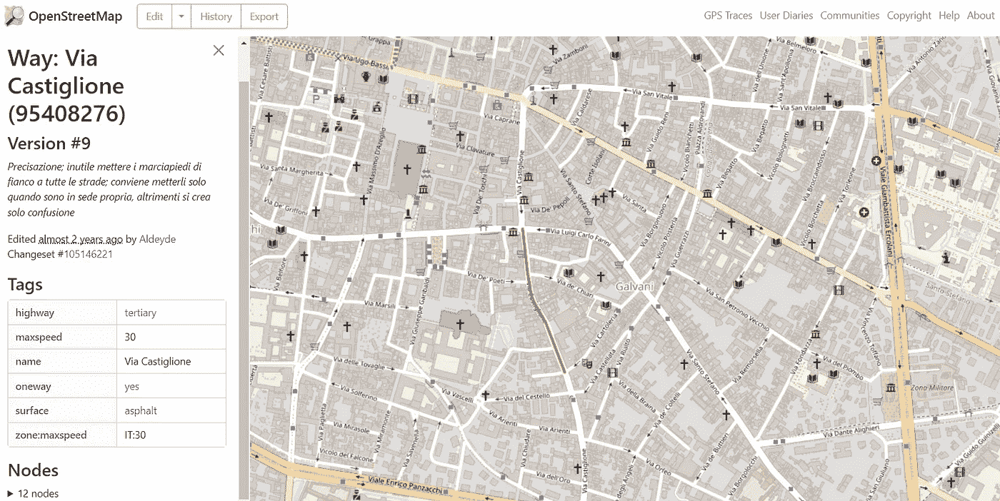
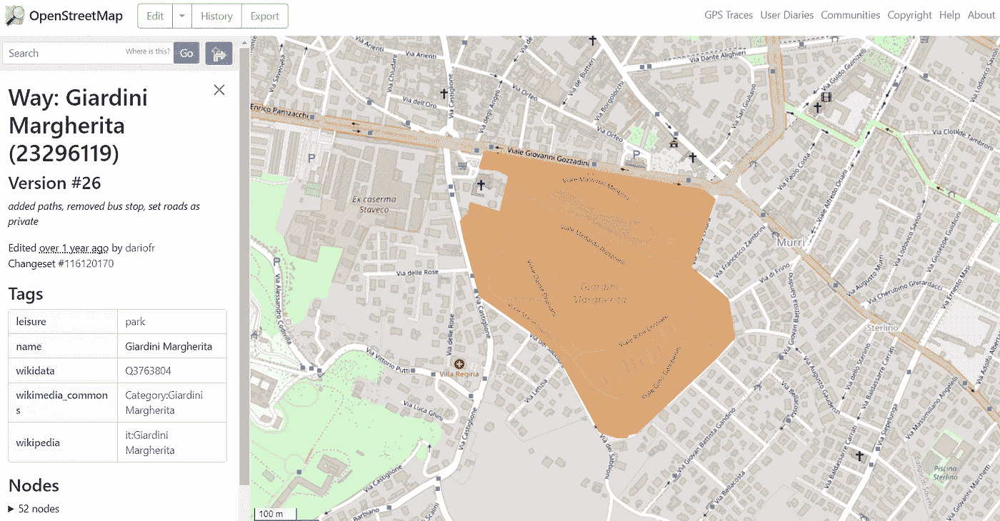
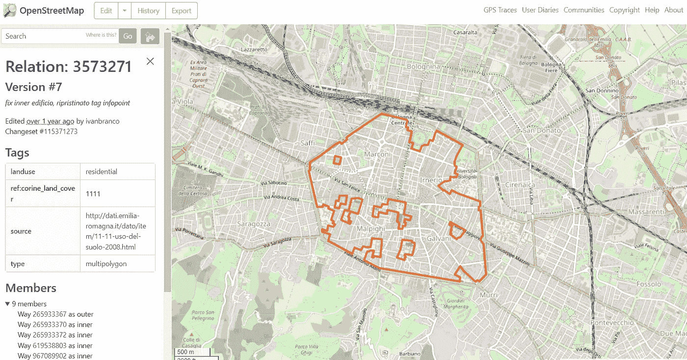
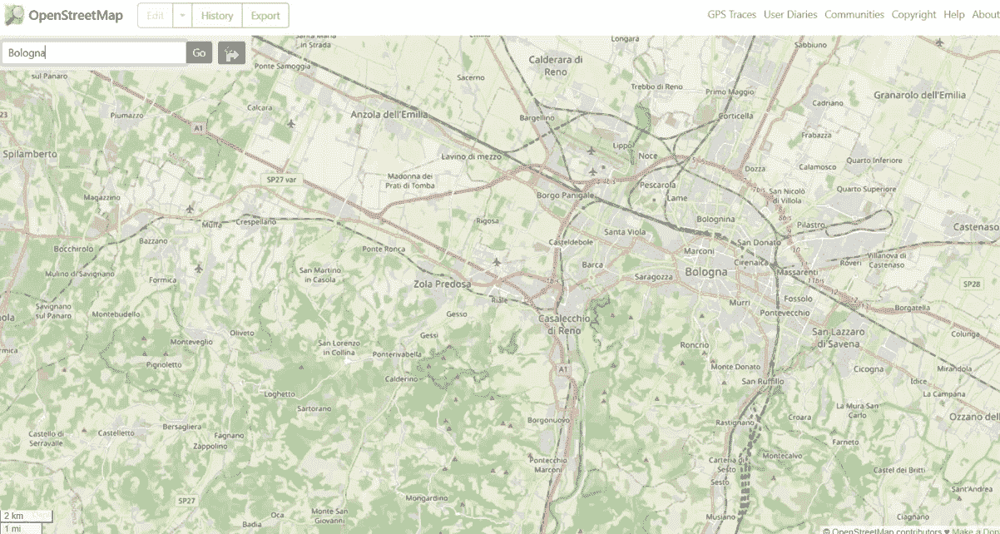
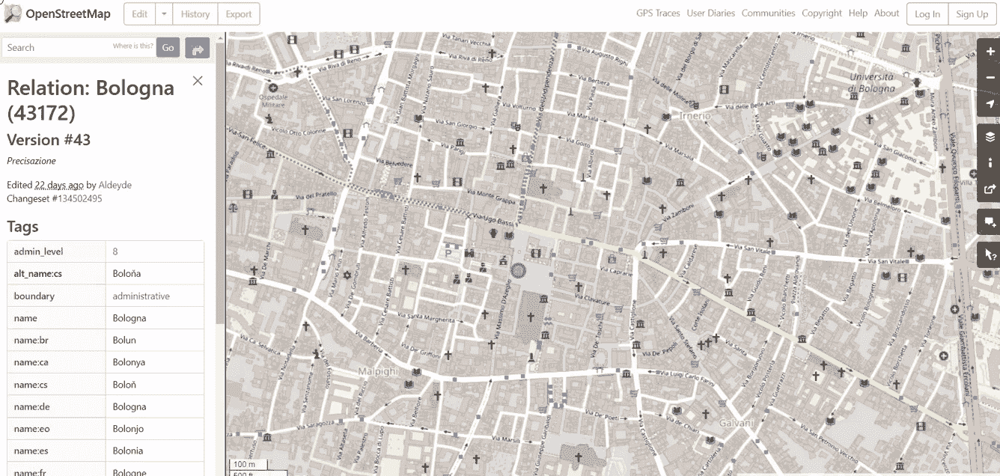
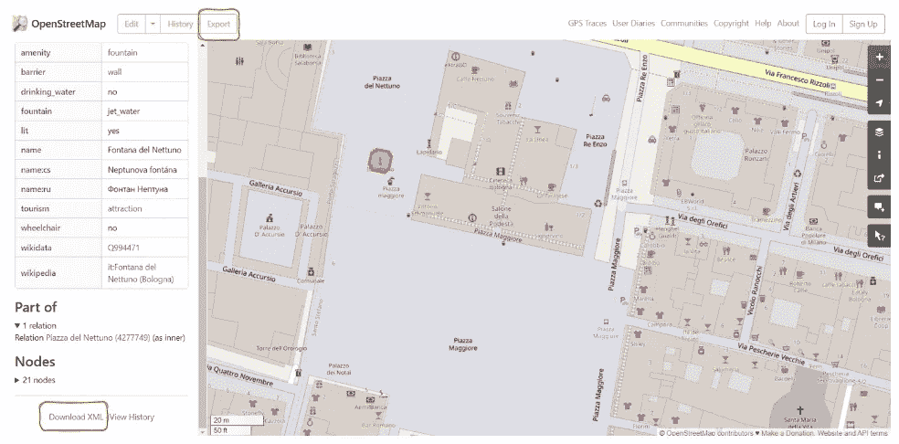
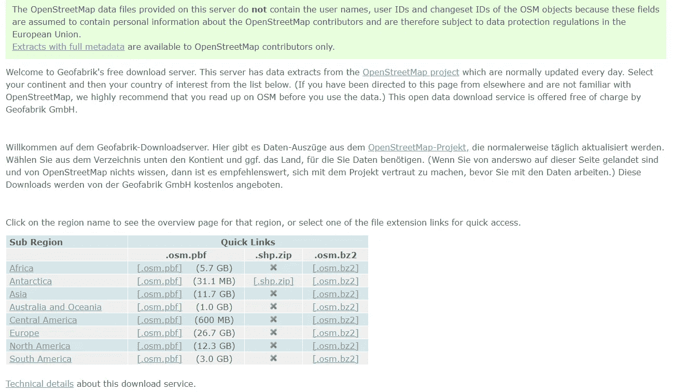

# 一本全面的 OpenStreetMap 入门指南

> 原文：[`towardsdatascience.com/a-comprehensive-guide-for-getting-started-with-openstreetmap-e92dff95fc80`](https://towardsdatascience.com/a-comprehensive-guide-for-getting-started-with-openstreetmap-e92dff95fc80)

## 学习 OpenStreetMap 的基础概念，同时练习使用该网站

[](https://eugenia-anello.medium.com/?source=post_page-----e92dff95fc80--------------------------------)[](https://towardsdatascience.com/?source=post_page-----e92dff95fc80--------------------------------) [Eugenia Anello](https://eugenia-anello.medium.com/?source=post_page-----e92dff95fc80--------------------------------)

·发表于 [Towards Data Science](https://towardsdatascience.com/?source=post_page-----e92dff95fc80--------------------------------) ·阅读时间 6 分钟·2023 年 4 月 24 日

--


图片由 [Unsplash+](https://unsplash.com/plus?referrer=%2Fphotos%2Fw98knetr8EA) 提供，照片来源于 [Unsplash](https://unsplash.com/photos/w98knetr8EA)

*这是关于地理空间数据分析系列的第二篇文章：*

1.  *使用 QGIS 进行地理空间数据分析*

1.  *OpenStreetMap 入门指南（本帖子）*

1.  *使用 GeoPandas 进行地理空间数据分析*

1.  *使用 OSMnx 进行地理空间数据分析*

1.  [*数据科学家的地理编码*](https://www.datacamp.com/tutorial/geocoding-for-data-scientists)

1.  [*使用 Geemap 进行地理空间数据分析*](https://www.kdnuggets.com/geospatial-data-analysis-with-geemap)

本文继续讲述 使用 QGIS 进行地理空间数据分析的实用介绍 的故事。在上一篇文章中，我介绍了地理空间数据分析的神奇世界，这是一种数据科学的子领域，涉及从一种特殊类型的数据（称为地理空间数据）中操作和推断信息。

与普通数据不同，每行地理空间数据对应一个特定的位置，并可以绘制在地图上。最简单的情况是通过经纬度描述的位置数据点，但也可能有更复杂的特征，如道路、河流、国家边界和地形，在这些情况下，一对坐标已经不够用了。

这次我专注于更好地理解 [OpenStreet](https://www.openstreetmap.org/) 是什么，它背后的概念，以及如何下载数据。首先，**OpenStreetMap** 是最大的免费且可编辑的地理数据库和项目，任何人都可以参与贡献，甚至包括你，因为你现在已经知道了这个世界地图的存在。它也被称为制图世界的维基百科，因为它们都由来自世界各地的志愿者维护。这引起了你的兴趣吗？那就开始吧！

**目录：**

+   **OpenStreetMap 的基本组成部分**

+   **OSM 数据格式**

+   **开始使用 OpenStreetMap**

+   **如何下载 OSM 数据**

## **OpenStreetMap 的基本组成部分**

在 OpenStreetMap 中，有三个主要组成部分：**节点**、**道路**和**关系**。最简单的数据类型是节点，它由一对坐标（纬度和经度）描述。节点的例子包括餐馆、酒吧、商店、图书馆、银行、博物馆等。



作者截图。OpenStreetMap 上获得的节点示例

在上图中，我选择了 Unicredit 银行，这是一种节点，如左侧边栏所示。如果你尝试从地图上选择不同的特征，也可以注意到每个现实世界的特征都有**标签**，这些标签描述了该特征的地理属性。

就像 Python 字典一样，它是一个键值对集合，其中键指定节点、道路或关系的属性。在这个例子中，Unicredit 银行的属性包括 amenity、atm 和 name。特别是，**amenity** 通常用来指定居民和游客使用的设施类型，例如咖啡馆、学校、酒吧和餐馆。



作者截图。OpenStreetMap 上获得的道路（线性特征）示例

现在是时候谈谈**道路**了，它被表示为一组节点。道路可以是**线性特征**或**多边形特征**。当我们处理线性特征时，总是有一个起始节点和一个结束节点。常见的例子有道路和铁路。

另一种情况是多边形特征，其中第一个和最后一个节点重合。在多边形特征中，有两种可能的类型：大型建筑，如教堂和宫殿，以及用于住宅、工业或商业目的的区域。需要注意的是，一条道路最多可以包含 2,000 个节点。



作者截图。OpenStreetMap 上获得的道路（多边形特征）示例

第三种数据类型是关系，它是一种特殊的结构，用于将大量节点或道路组织成一个更大的整体。经典的例子包括国家或城市的边界。与道路类似，你可以区分线性特征和多边形特征。它也可以是一个多边形，描述一个包含多个多边形的区域。



作者截图。 从 OpenStreetMap 获得的关系（多边形）的示例

这是博洛尼亚的一个住宅区示例，其中包含 9 条道路，每条道路由不同的节点组成。

## **OSM 数据格式**

在我之前的教程中，我展示了表示矢量数据和栅格数据的最流行格式分别是 Shapefile 和 GeoTIFF。对于 OSM 数据，最常见的格式是**PBF**和**XML**格式。PDF 文件通常比 XML 文件更受欢迎，因为它压缩程度高，优化了空间效率和速度。

## **开始使用 OpenStreetMap**

一旦 OpenStreetMap 的概念清晰后，就该进入教程的最有趣部分了。你不需要安装任何东西，只需要访问 [OpenStreetMap](https://www.openstreetmap.org/) 的网站。

我们可以搜索博洛尼亚，这是一座位于意大利艾米利亚-罗马涅地区的充满活力的城市，以世界上最古老的大学和著名菜肴（如意大利饺子和千层面）而闻名。程序如下：

+   输入你喜欢的城市并点击“前往”

+   在左侧边栏选择“City Bologna, Emilia-Romagna, Italy”选项



作者 GIF。从 OpenStreetMap 获得的关系（博洛尼亚的边界）示例

我们可以在城市中移动并选择一个地图元素。例如，我们可以去皮亚察·马焦雷，按下“查询特征”按钮，然后点击“Artwork Il Nettuno”，这是一座献给海神 Nettuno 的喷泉。



作者 GIF。从 OpenStreetMap 获得的节点（Artwork Il Nettuno）示例

这就是在 OpenStreetMap 上查看你感兴趣的元素的主要信息的方法。例如，如果你想提取博洛尼亚的所有餐厅，最好先了解这些地方的共同特点。你需要在网站上进行一些这样的探索，然后再直接提取你的兴趣点。

## **如何下载 OSM 数据**

从 OpenStreetMap 下载数据有很多种方法。合适的方法取决于数据集的大小。如果你只是想下载一个小数据集，比如一个酒吧，一个公园或一个住宅区，你可以直接从 OpenStreetMap 的网站上下载。你有两个选择：可以点击“下载 XML”或“导出”按钮。



作者截图。 从 OpenStreetMap 的网站下载数据。

如果你需要来自整个大陆和国家的 OSM 地图数据，你可以从 [geofabrik](https://download.geofabrik.de/) 下载数据。如果你需要特定国家的数据，可以点击大陆文件的链接或子区域的链接。



作者截图。 从 geofabrik 的网站下载数据。

第三种方法是直接使用 Python 下载 OSM 数据。Python 有一个库叫做 [Pyrosm](https://github.com/HTenkanen/pyrosm/)，可以从世界各地的大量位置下载和读取 PBF 数据。

```py
from pyrosm import get_data
fp = get_data("Lisbon")
```

不幸的是，并不是所有的城市都有提供。你可以通过打印可以下载的城市列表来检查：

```py
print(sources.cities.available)
```

输出：

```py
['Aachen', 'Aarhus', 'Adelaide', 'Albuquerque', 'Alexandria', 'Amsterdam', 'Antwerpen', 'Arnhem',...]
```

我需要说明的是，这些并不是下载 OSM 数据的唯一方法。你可以查看我在最后建议的资源中其他的方法。

## 最后的想法：

就这些了！这只是 OpenStreetMap 世界的一个概述！在开始分析这种数据时，如果对主要数据类型没有任何了解，并且只是通过直观的例子来浏览网站，可能会有些挑战。虽然有很多资源，但我发现它们很分散，因为涵盖的方面很少。希望这个教程能帮助你开始分析地理空间数据的旅程。感谢阅读！祝你有美好的一天！

## 有用的资源：

+   [OpenStreetMap 初学者指南](https://wiki.openstreetmap.org/wiki/Beginners_Guide_1.3)

+   [OpenStreetMap: 开放数据与参与式制图 — YouTube 教程](https://www.youtube.com/watch?v=4iCXMH88KPM)

+   [OpenStreetMap 的历史及其内在质量评估，作者 M. Minghini 和 F. Frassinelli](https://www.researchgate.net/publication/335692603_OpenStreetMap_history_for_intrinsic_quality_assessment_Is_OSM_up-to-date)

+   [如何下载 OSM GIS 数据](https://mapscaping.com/how-to-download-osm-gis-data/)

+   [Pyrosm 文档](https://pyrosm.readthedocs.io/en/latest/index.html#)
