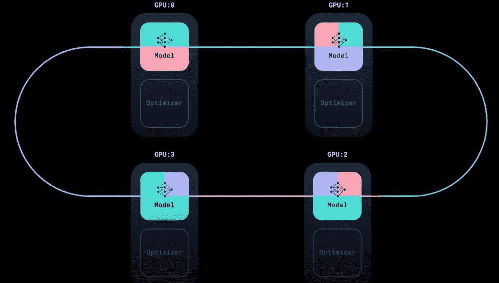

# 分布式数据并行（DDP）的全面指南

> 原文：[`towardsdatascience.com/a-comprehensive-guide-of-distributed-data-parallel-ddp-2bb1d8b5edfb`](https://towardsdatascience.com/a-comprehensive-guide-of-distributed-data-parallel-ddp-2bb1d8b5edfb)

## 关于如何使用分布式数据并行（DDP）加速模型训练的全面指南

[](https://medium.com/@francoisporcher?source=post_page-----2bb1d8b5edfb--------------------------------)[](https://towardsdatascience.com/?source=post_page-----2bb1d8b5edfb--------------------------------) [François Porcher](https://medium.com/@francoisporcher?source=post_page-----2bb1d8b5edfb--------------------------------)

·发表于 [Towards Data Science](https://towardsdatascience.com/?source=post_page-----2bb1d8b5edfb--------------------------------) ·12 分钟阅读·2023 年 10 月 30 日

--


作者提供的图像

# 引言

大家好！我是 Francois，Meta 的研究科学家。欢迎来到这个新的教程，它是 [Awesome AI Tutorials](https://github.com/FrancoisPorcher/awesome-ai-tutorials) 系列的一部分。

在本教程中，我们将揭示一种称为 DDP 的著名技术，以便在多个 GPU 上同时训练模型。

在我工程学校的日子里，我记得利用 Google Colab 的 GPU 进行训练。然而，在企业领域，情况有所不同。如果你在一个对 AI 投资巨大的组织中工作，特别是如果你在一个科技巨头公司，你很可能有大量的 GPU 集群可供使用。

本节旨在为你提供利用多个 GPU 力量的知识，实现快速高效的训练。你猜怎么着？这比你想象的要简单！在我们继续之前，我建议你对 PyTorch 有一个良好的掌握，包括其核心组件如数据集、数据加载器、优化器、CUDA 和训练循环。

最初，我认为 DDP 是一个复杂且几乎不可实现的工具，认为它需要一个大团队来建立必要的基础设施。然而，我向你保证，DDP 不仅直观而且简洁，只需少量的代码行即可实现。让我们一起开始这段启发性的旅程吧！

# DDP 的高层次直觉

分布式数据并行（DDP）一旦拆解就变得简单明了。想象一下你有一个包含 4 个 GPU 的集群。使用 DDP，同一个模型会被加载到每个 GPU 上，包括优化器。主要的区别在于我们如何分配数据。


DDP，图像来自 PyTorch [教程](https://www.youtube.com/watch?v=Cvdhwx-OBBo)

如果你对深度学习有所了解，你会记得 DataLoader，这是一个将你的数据集分割成不同批次的工具。通常会将整个数据集分割成这些批次，在每个批次计算后更新模型。

更深入地看，DDP 通过将每个批次划分为我们可以称之为“子批次”的部分来改进这个过程。本质上，每个模型副本处理主批次的一部分，从而为每个 GPU 生成不同的梯度计算。

在 DDP 中，我们通过一个叫做**DistributedSampler**的工具将批次拆分为子批次，如下图所示：


DDP，图像来自 PyTorch [教程](https://www.youtube.com/watch?v=Cvdhwx-OBBo)

在每个子批次分配到各个 GPU 之后，每个 GPU 计算其独特的梯度。


DDP，图像来自 PyTorch [教程](https://www.youtube.com/watch?v=Cvdhwx-OBBo)

+   现在进入 DDP 的神奇部分。在更新模型参数之前，需要汇总在每个 GPU 上计算的梯度，以便每个 GPU 都有整个数据批次上计算的平均梯度。

+   这是通过从所有 GPU 获取梯度并进行平均来完成的。例如，如果你有 4 个 GPU，那么某个特定模型参数的平均梯度就是该参数在 4 个 GPU 上的梯度之和除以 4。

+   DDP 使用`NCCL`或`Gloo`后端（NCCL 针对 NVIDIA GPU 进行了优化，Gloo 则更为通用）来有效地在 GPU 之间通信和平均梯度。



DDP，图像来自 PyTorch [教程](https://www.youtube.com/watch?v=Cvdhwx-OBBo)

# 术语、节点和排名词汇表

在深入代码之前，理解我们将频繁使用的词汇至关重要。让我们揭开这些术语的神秘面纱：

+   `节点:` 可以把节点想象成一台配备有多个 GPU 的强大机器。当我们谈论集群时，它不仅仅是一堆 GPU 堆在一起。相反，它们**被组织成组或“节点”**。例如，一个节点可能包含 8 个 GPU。

+   `主节点:` 在多节点环境中，通常有一个节点负责主控。这个“主节点”处理诸如同步、启动模型副本、监督模型加载和管理日志条目等任务。如果没有主节点，每个 GPU 都会独立生成日志，导致混乱。

+   `本地排名:` “排名”这个术语可以类比为一个 ID 或位置。本地排名指的是 GPU 在其特定节点（或机器）中的位置或 ID。它是“本地的”，因为它仅限于那台机器。

+   `全球排名:` 从更广泛的角度看，全球排名识别所有可用节点中的 GPU。这是一个**无论机器如何都唯一的标识符**。

+   `World Size:` 从根本上说，这是所有**在所有节点上可用的 GPU 数量**的计数。简单来说，这是节点数和每个节点中 GPU 数量的乘积。

从实际情况来看，如果你只使用一台机器，那么事情会更加简单，因为本地排名等于全局排名。

用图像来澄清这个问题：


本地排名，图像来自 [教程](https://www.youtube.com/watch?v=KaAJtI1T2x4)


本地排名，图像来自 [教程](https://www.youtube.com/watch?v=KaAJtI1T2x4)

# 理解 DDP 限制：

分布式数据并行（DDP）在许多深度学习工作流中具有变革性，但理解其局限性非常重要。

DDP 限制的核心在于其**内存消耗**。使用 DDP 时，**每个 GPU 加载一个模型副本、优化器及其相应的数据批次。** GPU 内存通常从几 GB 到高端 GPU 的 80GB 不等。

对于较小的模型，这不是问题。然而，当涉足大型语言模型（LLMs）或类似 GPT 的架构时，单个 GPU 内存的限制可能是不够的。

在计算机视觉中，虽然有很多轻量级模型，但**增加批量大小**时会遇到挑战，特别是在涉及**3D 图像**或目标检测任务的场景中。

进入完全分片数据并行（FSDP）。这种方法通过不仅分布数据，还将模型和优化器状态分散到 GPU 内存中，从而扩展了 DDP 的好处。虽然这听起来很有优势，但 FSDP 会增加 GPU 之间的通信，可能会导致训练速度变慢。

## 总结：

+   如果你的模型及其对应的批量数据能够舒适地适应 GPU 的内存，DDP 是你最好的选择，因为它速度较快。

+   对于需要更多内存的巨型模型，FSDP 是更合适的选择。然而，请记住其权衡：你是在为内存牺牲速度。

# 为什么你应该更倾向于使用 DDP 而不是 DP？

如果你访问 PyTorch 的网站，实际上有两种选择：DP 和 DDP。但我提到这一点只是为了让你不要迷路或困惑：**只使用 DDP，它更快且不限于单个节点。**


来自 PyTorch 的比较 [教程](https://pytorch.org/tutorials/beginner/ddp_series_theory.html)

# 代码演示：

实现分布式深度学习比你想象的要简单。美在于你不会被手动配置 GPU 或梯度分布的复杂性所困扰。

你可以在以下位置找到所有模板和脚本：

[](https://github.com/FrancoisPorcher/awesome-ai-tutorials?source=post_page-----2bb1d8b5edfb--------------------------------) [## GitHub - FrancoisPorcher/awesome-ai-tutorials: 最佳 AI 教程集合，让你成为数据科学的…

### 最佳 AI 教程集合，让你成为数据科学的高手！ - GitHub …

[github.com](https://github.com/FrancoisPorcher/awesome-ai-tutorials?source=post_page-----2bb1d8b5edfb--------------------------------)

下面是我们将采取的步骤的细分：

1.  进程初始化：这涉及到指定主节点、指定端口，并设置`world_size`。

1.  分布式 DataLoader 设置：这个步骤至关重要的是将每个批次在可用 GPU 之间进行分区。我们将确保数据均匀分布而没有任何重叠。

1.  模型训练/测试：本质上，这一步与单 GPU 过程几乎没有变化。

## 在 1 GPU 1 节点上训练（基准）

首先，让我们定义一个简单的代码，它加载一个数据集，创建一个模型，并在单个 GPU 上进行端到端训练。这将是我们的起点：

```py
import torch
import torch.nn.functional as F
from torch.utils.data import Dataset, DataLoader
from sklearn.datasets import load_wine
from sklearn.model_selection import train_test_split
from sklearn.preprocessing import StandardScaler
import numpy as np

class WineDataset(Dataset):
    def __init__(self, data, targets):
        self.data = data
        self.targets = targets

    def __len__(self):
        return len(self.data)

    def __getitem__(self, idx):
        return torch.tensor(self.data[idx], dtype=torch.float), torch.tensor(self.targets[idx], dtype=torch.long)

class SimpleNN(torch.nn.Module):
    def __init__(self):
        super(SimpleNN, self).__init__()
        self.fc1 = torch.nn.Linear(13, 64)
        self.fc2 = torch.nn.Linear(64, 3)

    def forward(self, x):
        x = F.relu(self.fc1(x))
        x = self.fc2(x)
        return x

class Trainer():
    def __init__(self, model, train_data, optimizer, gpu_id, save_every):
        self.model = model
        self.train_data = train_data
        self.optimizer = optimizer
        self.gpu_id = gpu_id
        self.save_every = save_every
        self.losses = []

    def _run_batch(self, source, targets):
        self.optimizer.zero_grad()
        output = self.model(source)
        loss = F.cross_entropy(output, targets)
        loss.backward()
        self.optimizer.step()
        return loss.item()

    def _run_epoch(self, epoch):
        total_loss = 0.0
        num_batches = len(self.train_data)
        for source, targets in self.train_data:
            source = source.to(self.gpu_id)
            targets = targets.to(self.gpu_id)
            loss = self._run_batch(source, targets)
            total_loss += loss

        avg_loss = total_loss / num_batches
        self.losses.append(avg_loss)
        print(f"Epoch {epoch}, Loss: {avg_loss:.4f}")

    def _save_checkpoint(self, epoch):
        checkpoint = self.model.state_dict()
        PATH = f"model_{epoch}.pt"
        torch.save(checkpoint, PATH)
        print(f"Epoch {epoch} | Model saved to {PATH}")

    def train(self, max_epochs):
        self.model.train()
        for epoch in range(max_epochs):
            self._run_epoch(epoch)
            if epoch % self.save_every == 0:
                self._save_checkpoint(epoch)

def load_train_objs():
    wine_data = load_wine()
    X = wine_data.data
    y = wine_data.target

    # Normalize and split
    X_train, X_test, y_train, y_test = train_test_split(X, y, test_size=0.2, random_state=42)
    scaler = StandardScaler().fit(X_train)
    X_train = scaler.transform(X_train)
    X_test = scaler.transform(X_test)

    train_set = WineDataset(X_train, y_train)
    test_set = WineDataset(X_test, y_test)

    print("Sample from dataset:")
    sample_data, sample_target = train_set[0]
    print(f"Data: {sample_data}")
    print(f"Target: {sample_target}")

    model = SimpleNN()
    optimizer = torch.optim.Adam(model.parameters(), lr=0.001)

    return train_set, model, optimizer

def prepare_dataloader(dataset, batch_size):
    return DataLoader(dataset, batch_size=batch_size, pin_memory=True, shuffle=True)

def main(device, total_epochs, save_every, batch_size):
    dataset, model, optimizer = load_train_objs()
    train_data = prepare_dataloader(dataset, batch_size)
    trainer = Trainer(model, train_data, optimizer, device, save_every)
    trainer.train(total_epochs)

main(device=torch.device("cuda:0" if torch.cuda.is_available() else "cpu"), total_epochs=100, save_every=50, batch_size=32)
```

## 在多个 GPU，1 节点上训练

现在我们将使用单节点上的所有 GPU，步骤如下：

1.  导入进行分布式训练所需的库。

1.  初始化分布式环境：（特别是`MASTER_ADDR`和`MASTER_PORT`）

1.  使用`DistributedDataParallel`包装器包装模型。

1.  使用分布式采样器确保数据集在 GPU 之间以分布式的方式划分。

1.  调整主函数以`spawn`多个进程进行多 GPU 训练。

对于库，我们需要这些：

```py
import torch.multiprocessing as mp
from torch.utils.data.distributed import DistributedSampler
from torch.nn.parallel import DistributedDataParallel as DDP
from torch.distributed import init_process_group, destroy_process_group
import os
```

然后我们需要设置每个进程。例如，如果我们在 1 节点上有 8 个 GPU，我们将调用以下函数 8 次，每次针对一个 GPU，并设置正确的`local_rank`：

```py
def ddp_setup(rank, world_size):
    """
    Set up the distributed environment.

    Args:
        rank: The rank of the current process. Unique identifier for each process in the distributed training.
        world_size: Total number of processes participating in the distributed training.
    """

    # Address of the main node. Since we are doing single-node training, it's set to localhost.
    os.environ["MASTER_ADDR"] = "localhost"

    # Port on which the master node is expected to listen for communications from workers.
    os.environ["MASTER_PORT"] = "12355"

    # Initialize the process group. 
    # 'backend' specifies the communication backend to be used, "nccl" is optimized for GPU training.
    init_process_group(backend="nccl", rank=rank, world_size=world_size)

    # Set the current CUDA device to the specified device (identified by rank).
    # This ensures that each process uses a different GPU in a multi-GPU setup.
    torch.cuda.set_device(rank)
```

对该函数的一些解释：

+   `MASTER_ADDR`是主机（或 rank 0 进程）运行的机器的主机名。在这里是 localhost

+   `MASTER_PORT`：指定主节点监听来自工作进程或其他进程的连接的端口。12355 是任意的。你可以选择任何未被占用的端口号，只要它不被系统上的其他服务使用，并且被你的防火墙规则允许。

+   `torch.cuda.set_device(rank)`：这确保每个进程使用其对应的 GPU。

然后我们需要稍微修改 Trainer 类。我们将简单地用 DDP 函数包装模型：

```py
class Trainer():
    def __init__(self, model, train_data, optimizer, gpu_id, save_every):
        self.model = model.to(gpu_id)
        self.train_data = train_data
        self.optimizer = optimizer
        self.gpu_id = gpu_id
        self.save_every = save_every
        self.losses = []

        # This changes
        self.model = DDP(self.model, device_ids=[gpu_id])
```

Trainer 类的其他部分保持不变，真是太棒了！

现在我们必须更改 dataloader，因为记住，我们必须在每个 GPU 上拆分批次：

```py
def prepare_dataloader(dataset: Dataset, batch_size: int):
    return DataLoader(
        dataset,
        batch_size=batch_size,
        pin_memory=True,
        shuffle=False,
        sampler=DistributedSampler(dataset)
    )
```

现在我们可以修改`main`函数，这个函数会为每个进程调用（所以在我们的例子中是 8 次）：

```py
def main(rank: int, world_size: int, save_every: int, total_epochs: int, batch_size: int):
    """
    Main training function for distributed data parallel (DDP) setup.

    Args:
        rank (int): The rank of the current process (0 <= rank < world_size). Each process is assigned a unique rank.
        world_size (int): Total number of processes involved in the distributed training.
        save_every (int): Frequency of model checkpoint saving, in terms of epochs.
        total_epochs (int): Total number of epochs for training.
        batch_size (int): Number of samples processed in one iteration (forward and backward pass).
    """

    # Set up the distributed environment, including setting the master address, port, and backend.
    ddp_setup(rank, world_size)

    # Load the necessary training objects - dataset, model, and optimizer.
    dataset, model, optimizer = load_train_objs()

    # Prepare the data loader for distributed training. It partitions the dataset across the processes and handles shuffling.
    train_data = prepare_dataloader(dataset, batch_size)

    # Initialize the trainer instance with the loaded model, data, and other configurations.
    trainer = Trainer(model, train_data, optimizer, rank, save_every)

    # Train the model for the specified number of epochs.
    trainer.train(total_epochs)

    # Cleanup the distributed environment after training is complete.
    destroy_process_group()
```

最后，在执行脚本时，我们需要启动 8 个进程。这是通过`mp.spawn()`函数完成的：

```py
if __name__ == "__main__":
    import argparse
    parser = argparse.ArgumentParser(description='simple distributed training job')
    parser.add_argument('total_epochs', type=int, help='Total epochs to train the model')
    parser.add_argument('save_every', type=int, help='How often to save a snapshot')
    parser.add_argument('--batch_size', default=32, type=int, help='Input batch size on each device (default: 32)')
    args = parser.parse_args()

    world_size = torch.cuda.device_count()
    mp.spawn(main, args=(world_size, args.save_every, args.total_epochs, args.batch_size), nprocs=world_size)
```

## 终极步骤：在多个节点上训练

如果你已经做到这些，恭喜你！终极步骤是能够招募所有在不同节点上的 GPU。但是如果你理解了我们迄今为止所做的，这将非常简单。

在跨多个节点扩展时，关键的区别在于从`local_rank`到`global_rank`的转换。这一点非常重要，因为每个进程都需要一个唯一的标识符。例如，如果你在两个节点上工作，每个节点有 8 个 GPU，那么进程 0 和 8 都会有一个`local_rank`为 0。

global_rank 由非常直观的公式给出：

global_rank = node_rank * world_size_per_node + local_rank

所以首先让我们修改`ddp_setup`函数：

```py
def ddp_setup(local_rank, world_size_per_node, node_rank):
    os.environ["MASTER_ADDR"] = "MASTER_NODE_IP"  # <-- Replace with your master node IP
    os.environ["MASTER_PORT"] = "12355"  
    global_rank = node_rank * world_size_per_node + local_rank
    init_process_group(backend="nccl", rank=global_rank, world_size=world_size_per_node*torch.cuda.device_count())
    torch.cuda.set_device(local_rank)
```

我们需要调整主函数，它现在接受`world_size_per_node`作为参数：

```py
def main(local_rank: int, world_size_per_node: int, save_every: int, total_epochs: int, batch_size: int, node_rank: int):
    ddp_setup(local_rank, world_size_per_node, node_rank)
    # ... (rest of the main function)
```

最后，我们也要调整`mp.spawn()`函数以适应`world_size_per_node`：

```py
if __name__ == "__main__":
    import argparse
    parser = argparse.ArgumentParser(description='simple distributed training job')
    parser.add_argument('total_epochs', type=int, help='Total epochs to train the model')
    parser.add_argument('save_every', type=int, help='How often to save a snapshot')
    parser.add_argument('--batch_size', default=32, type=int, help='Input batch size on each device (default: 32)')
    parser.add_argument('--node_rank', default=0, type=int, help='The rank of the node in multi-node training')
    args = parser.parse_args()

    world_size_per_node = torch.cuda.device_count()
    mp.spawn(main, args=(world_size_per_node, args.save_every, args.total_epochs, args.batch_size, args.node_rank), nprocs=world_size_per_node)
```

## 使用集群（SLURM）

你现在可以准备将训练发送到集群。这非常简单，你只需调用所需的节点数量即可。

这是 SLURM 脚本的模板：

```py
#!/bin/bash
#SBATCH --job-name=DDPTraining       # Name of the job
#SBATCH --nodes=$1                   # Number of nodes specified by the user
#SBATCH --ntasks-per-node=1          # Ensure only one task runs per node
#SBATCH --cpus-per-task=1            # Number of CPU cores per task
#SBATCH --gres=gpu:1                 # Number of GPUs per node
#SBATCH --time=01:00:00              # Time limit hrs:min:sec (1 hour in this example)
#SBATCH --mem=4GB                    # Memory limit per GPU
#SBATCH --output=training_%j.log     # Output and error log name (%j expands to jobId)
#SBATCH --partition=gpu              # Specify the partition or queue

srun python3 your_python_script.py --total_epochs 10 --save_every 2 --batch_size 32 --node_rank $SLURM_NODEID
```

现在你可以使用以下命令从终端启动训练

```py
sbatch train_net.sh 2  # for using 2 nodes
```

恭喜，你完成了！

感谢阅读！在你离开之前：

欲获取更多精彩教程，请查看我在 Github 上的 [AI 教程汇编](https://github.com/FrancoisPorcher/awesome-ai-tutorials)

[](https://github.com/FrancoisPorcher/awesome-ai-tutorials?source=post_page-----2bb1d8b5edfb--------------------------------) [## GitHub - FrancoisPorcher/awesome-ai-tutorials: 最佳的 AI 教程集合，让你成为……

### 最佳的 AI 教程集合，让你成为数据科学的高手！ - GitHub …

github.com](https://github.com/FrancoisPorcher/awesome-ai-tutorials?source=post_page-----2bb1d8b5edfb--------------------------------)

*你应该在收件箱中获取我的文章。* [***在这里订阅。***](https://medium.com/@francoisporcher/subscribe)

*如果你想访问 Medium 上的高级文章，只需每月支付 $5 的会员费用。如果你通过* [***我的链接***](https://medium.com/@francoisporcher/membership)*注册，你将以额外的费用支持我。*

> 如果你觉得这篇文章有洞察力并且有帮助，请考虑关注我并点赞以获取更多深入内容！你的支持帮助我继续制作有助于我们共同理解的内容。

# 参考资料

+   [PyTorch DDP 指南](https://pytorch.org/tutorials/intermediate/ddp_tutorial.html)

+   [教程系列](https://www.youtube.com/watch?v=-K3bZYHYHEA&list=PL_lsbAsL_o2CSuhUhJIiW0IkdT5C2wGWj)
