# 《SQL 中公共表表达式的全面指南》

> 原文：[`towardsdatascience.com/a-comprehensive-guide-on-common-table-expression-in-sql-8c892ffda2f5`](https://towardsdatascience.com/a-comprehensive-guide-on-common-table-expression-in-sql-8c892ffda2f5)

## 回到基础 | 简化复杂查询并提高可读性

[](https://iffatm.medium.com/?source=post_page-----8c892ffda2f5--------------------------------)[](https://towardsdatascience.com/?source=post_page-----8c892ffda2f5--------------------------------) [Iffat Malik](https://iffatm.medium.com/?source=post_page-----8c892ffda2f5--------------------------------)

·发表于 [数据科学前沿](https://towardsdatascience.com/?source=post_page-----8c892ffda2f5--------------------------------) ·14 分钟阅读·2023 年 8 月 22 日

--

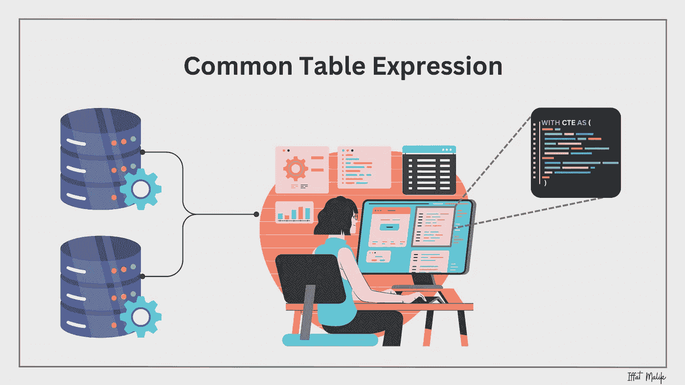

图片由作者提供

在编程中，将指令或语句分组到更小、更易于管理的代码块中是一种常见做法。这种做法通常被称为 [*代码块组织*](https://en.wikipedia.org/wiki/Block_(programming))。它基本上是将程序或程序的大块分解成更小且逻辑上相关的块。这些块旨在执行特定任务或仅仅是将相关功能分组。这种方法不仅提高了代码的可读性，还使代码更有组织和更易于维护。各种编程结构，如函数、方法、try-catch 块、循环和条件语句，通常用于此目的。

在*SQL*中，实现相同效果的一种方法是使用*公共表表达式（CTE）*。在本文中，我们将探讨*CTE*如何显著简化和优化复杂的 SQL 查询。

## 什么是 CTE？

> CTE（公共表表达式）是一个**临时**存储结果集的查询，以便在另一条查询中引用和使用。只要在**同一执行范围**内，CTE 就会保持可用。

简而言之，*CTE* 像是一个临时表，它保存查询的中间结果，允许你在另一条*SQL*查询中使用这些结果。它也被称为*子查询重构*。

在这里，有两个关键点需要注意，

+   ***‘临时结果集’***，意味着*CTE*的输出会被暂时存储，而不会在数据库中创建一个永久表。

+   ***‘同一执行范围’***，指的是它只能在定义它的相同*SQL*语句中使用。一旦该*SQL*语句完成，*CTE*将不再可用，使其局限于定义的范围内。

*CTE*的目的是简化长而复杂的查询。通过将长查询拆分成简单、小而可管理的代码块，它降低了复杂性，同时提高了可读性，在某些数据库中，也增加了可重用性。

通过使用***WITH***子句来定义。*CTE*的常见语法是，

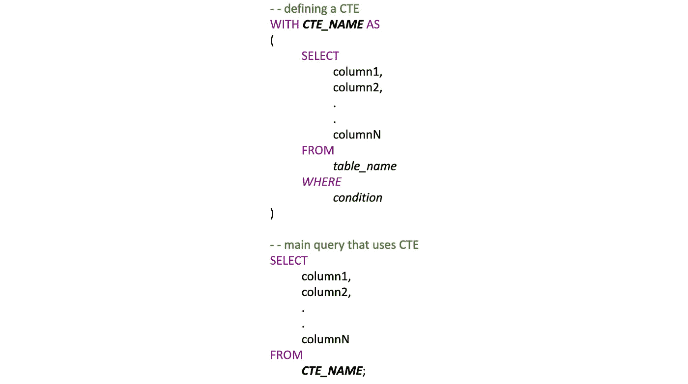

作者提供的图像：*CTE*的常见语法

你也可以定义多个*CTEs*，定义多个*CTEs*的常见语法是，

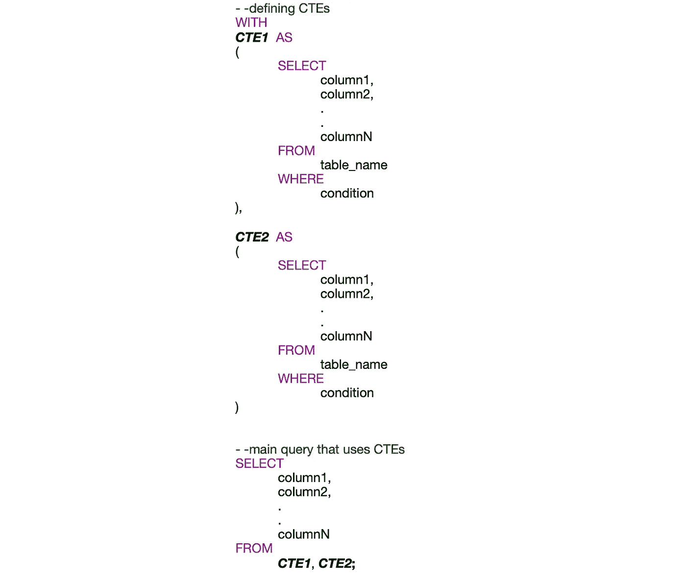

作者提供的图像：使用多个*CTE*的常见语法

*CTEs*可以在以下*SQL*语句中使用，

+   选择

+   插入

+   更新

+   删除

一个*CTE*也可以在另一个*CTE*中被引用。当一个*CTE*引用自身时，它就成为了*递归 CTE*。

现在我们对*CTE*有了基本了解，让我们开始实际操作。在这里，我们将使用来自虚拟车辆零售公司数据，你可以在我的[GitHub Repo](https://github.com/PhoenixIM/All_Things_SQL/tree/main/Common%20Table%20Expression)中找到源数据，

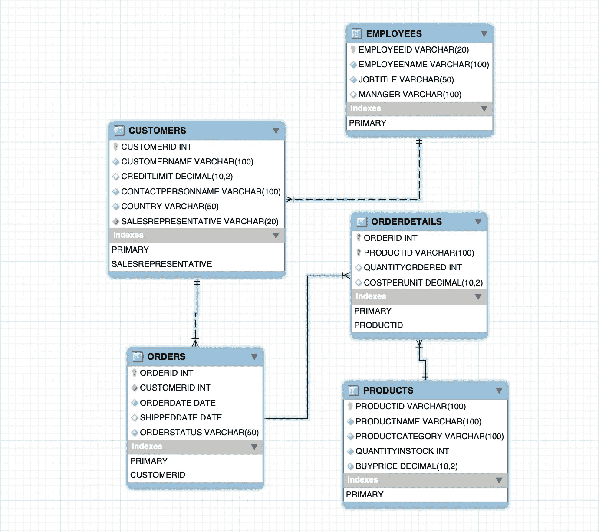

作者提供的图像：车辆零售公司 ER 图

假设我们需要生成一个基于总收入排名的产品报告。这个报告应提供关键的信息，如产品 ID、产品名称、总销售数量、总收入以及基于总收入的销售排名。

```py
--calculate total quantity sold and total revenue for each product
WITH PRODUCTSALES AS (
  SELECT
    PRD.PRODUCTID, 
    PRD.PRODUCTNAME,
    SUM(ORDET.QUANTITYORDERED) AS TOTAL_QUANTITY_SOLD,
    SUM(ORDET.QUANTITYORDERED * PRD.BUYPRICE) AS TOTAL_REVENUE
  FROM 
    PRODUCTS PRD
  JOIN 
    ORDERDETAILS ORDET 
    ON PRD.PRODUCTID = ORDET.PRODUCTID
  GROUP BY 
    PRD.PRODUCTID, PRD.PRODUCTNAME
)

--retrieve product sales information with ranking based on total revenue
SELECT
  PRODUCTID, 
  PRODUCTNAME,
  TOTAL_QUANTITY_SOLD,
  TOTAL_REVENUE,
  RANK() OVER (ORDER BY TOTAL_REVENUE DESC) AS SALES_RANK
FROM 
  PRODUCTSALES;
```

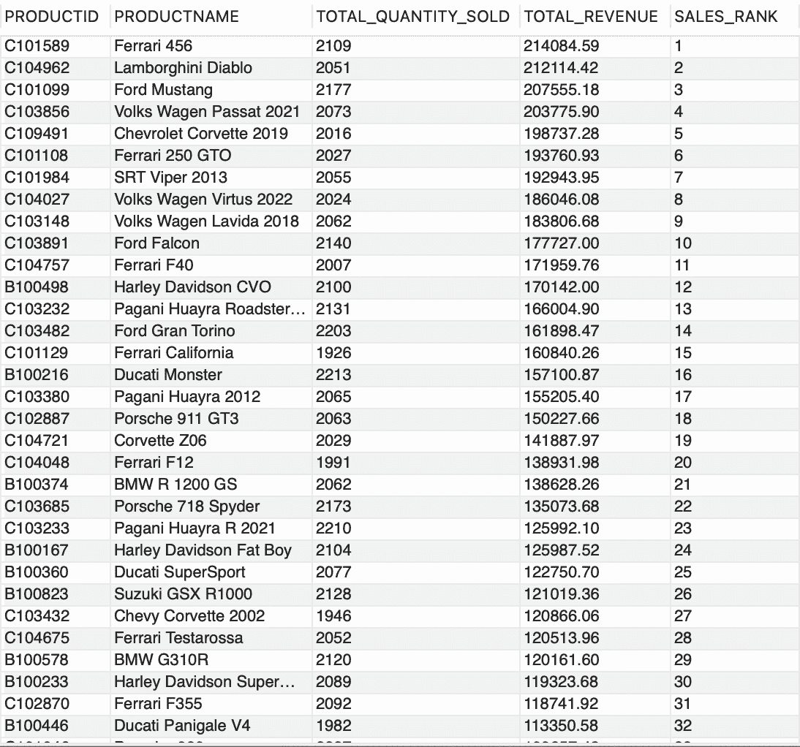

作者提供的 GIF

在上述查询中，我们为每个产品计算了两个重要指标，在*CTE, ‘PRODUCTSALES’*中：

+   销售的总数量（*‘TOTAL_QUANTITY_SOLD’*）和

+   从这些销售中产生的总收入（*‘TOTAL_REVENUE’*）。

在主要的*SQL*查询中，我们使用了这些指标。此外，我们使用了*RANK()*函数。这个*窗口函数*为表中每一行数据分配一个唯一的顺序编号，或在指定的分区内保持相同的排名，针对具有相同值的行。

你可以在这里查看更多关于*窗口函数*的细节，

[](/window-functions-a-must-know-for-data-engineers-and-data-scientists-4dd3e4ad0d2?source=post_page-----8c892ffda2f5--------------------------------) ## 窗口函数 — 数据工程师和数据科学家必须了解的

### 回到基础 | SQL 初学者基础

towardsdatascience.com

在我们的案例中，我们根据*‘TOTAL_REVENUE’*使用了*RANK()*，并按降序排列结果。这就像拥有一个报告，帮助我们理解哪些产品在销售和收入方面最成功。

## 实践练习

我创建了一些实践练习，以便熟悉使用*CTE*。欢迎在本文的回复部分发布你的答案。如果你需要任何帮助，随时留言。

```py
**1\. Customer Credit Limit Analysis
----------------------------------**

Write a query to perform a customer credit analysis using the table
'CUSTOMERS'. Calculate the following details,

* Customer Name,
* Country,
* Average Credit Limit, 
* Maximum Credit Limit, 
* Minimum Credit Limit

Display credit limits - Average, Maximum and Minimum - such that it is 
partitioned for each Country.

**Hint:** Use the Window Functions AVG(), MAX() and MIN()
```

```py
**2\. Order Frequency Analysis
---------------------------** 
Write a query to examine the ordering patterns of customers, segmenting 
them according to order counts as follows:

* If a customer has placed 10 or more orders, classify as 'High Frequency'.
* For those with 5 to 9 orders, categorise as 'Medium Frequency'.
* Otherwise, designate as 'Low Frequency'.

Display the customer's ID, name, order count, and order frequency 
category. 

**Hint:** Use CASE statement
```

```py
3\. Employee Performance Analysis
--------------------------------

Write a query to analyse the performance of employees based on their 
total sales contributions. Display the following details, 

* employee ID, 
* employee name, 
* total number of orders
* total sales amount 
* rank based on total sales amount.

**Hint:** Use Window Function *RANK()* or *DENSE_RANK()*
```

您可以参考以下文章以获取有关聚合函数的更多详细信息，

[](/how-to-use-sql-aggregate-functions-92f7244a07cb?source=post_page-----8c892ffda2f5--------------------------------) ## SQL 聚合函数，为您的下一个数据科学面试

### 返回基础知识 | SQL 基础知识

towardsdatascience.com

## 递归 CTE

现在我们已经熟悉了 CTE，让我们了解一下*递归 CTE*。

> *递归 CTE* 是一种特殊的*CTE*，它会引用**自身**并以迭代的方式构建结果集。它就像在 SQL 中使用循环一样。

它由两个部分组成，通过[***UNION ALL***](https://www.mssqltips.com/sqlservertip/1387/union-vs-union-all-in-sql-server/)连接：

+   第一部分，通常也称为***基本部分***。这一部分提供初始数据或可以说提供递归的起始点。

+   第二部分是***递归部分***，它根据第一部分（基本部分）构建结果集，然后在每次迭代中添加更多数据。这个过程会继续，直到没有更多数据可添加或满足特定条件为止。

对于初学者来说，一个常见的问题是何时使用它？好吧！*递归* *CTEs* 在处理可以表示为父子关系的数据时非常有用，比如家谱、嵌套分类、组织层级等。它也用于生成顺序日期系列。

*递归 CTE* 的常见语法是，

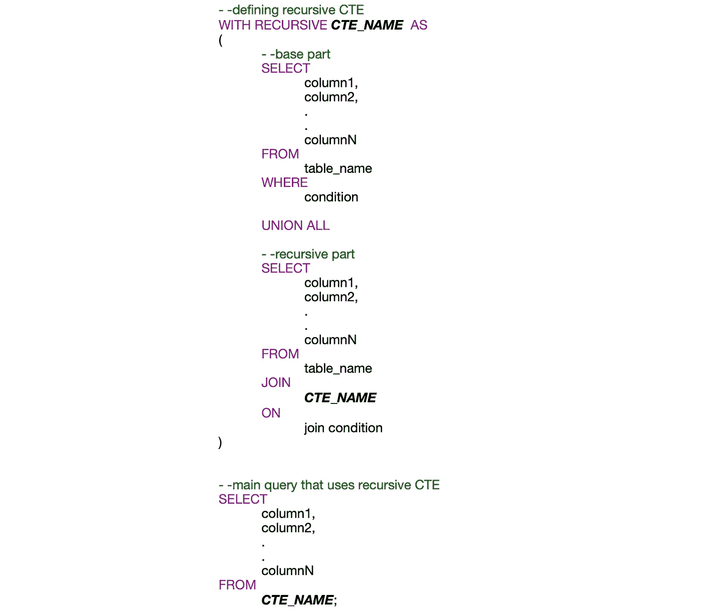

作者提供的图片：递归 CTE 的常见语法

这是来自*‘EMPLOYEES’*表的示例数据，我们将使用这些数据创建一个*递归 CTE*来生成员工层级*。

```py
SELECT 
    *
FROM
    EMPLOYEES
LIMIT 10;
```

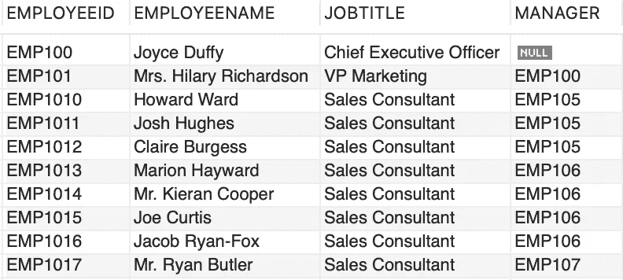

作者提供的图片

比如，我们想要检索整个员工层级，以跟踪公司层级结构中每个员工的深度或级别。

首先，我们将选择一个起始点，特定的员工*‘Joyce Duffy’*，她的‘*JOBTITLE’*是*‘首席执行官’*，她的*‘EMPLOYEEID’*是*‘EMP100’*。

```py
--cte to define a hierarchical structure in the company
WITH RECURSIVE EMPLOYEEHIERARCHY AS 
(
    --base part
    SELECT 
        EMPLOYEEID, 
        EMPLOYEENAME, 
        JOBTITLE,
        MANAGER,
        1 AS EMPHIERARCHYDEPTH
    FROM 
        EMPLOYEES
    WHERE
        EMPLOYEEID = 'EMP100'

    UNION ALL

    --recursive part
    SELECT 
        EMP.EMPLOYEEID, 
        EMP.EMPLOYEENAME,
        EMP.JOBTITLE,
        EMP.MANAGER,
        EH.EMPHIERARCHYDEPTH + 1
    FROM 
        EMPLOYEES EMP
    JOIN 
        EMPLOYEEHIERARCHY EH 
    ON 
        EMP.MANAGER = EH.EMPLOYEEID
)

--main query
SELECT 
    *
FROM 
    EMPLOYEEHIERARCHY;
```

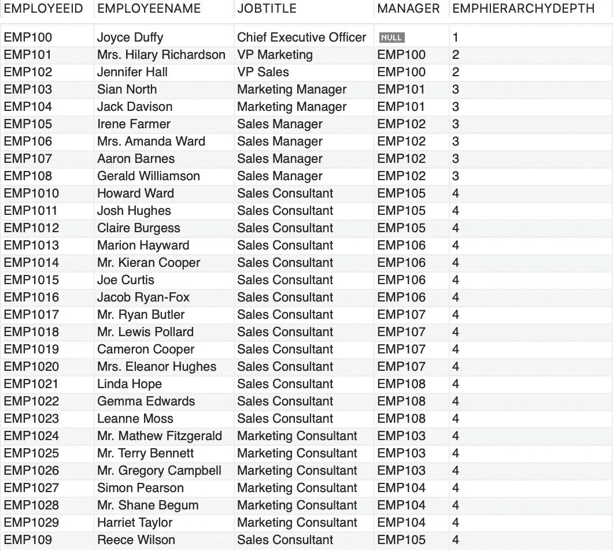

作者提供的图片：查询结果

在上面的代码块中，我们创建了一个*CTE*，‘*EMPLOYEEHIERARCHY’*。现在让我们关注**基本部分**。如前所述，我们选择了员工*‘Joyce Duffy’*作为我们的基点或起始点来构建员工层级列*‘EMPHIERARCHYDEPTH’*，并将其深度设定为*‘1’*。这意味着她处于层级结构的最顶层。

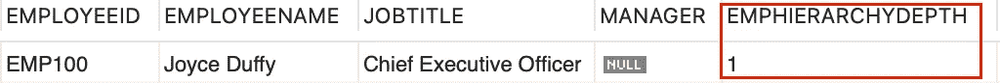

作者提供的图片

更高层级（例如 3、4 等）表示由其他员工管理的员工，形成树状结构。‘*EMPHIERARCHYDEPTH*’列对可视化和理解组织中员工之间的层级关系非常有用。

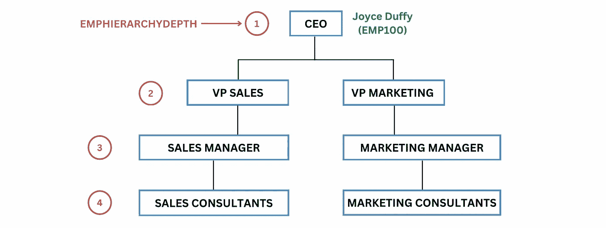

作者提供的图片：员工层级

现在第二部分，即**递归部分**是实际发生“魔法”的地方。它回溯到*CTE* ‘*EMPLOYEEHIERARCHY*’并重复将*‘EMPLOYEES’*表与*CTE*的前一个结果（来自基础部分）连接，使用连接条件*‘EMP.MANAGER = EH.EMPLOYEEID’*。这意味着它会查找经理的 ID 与当前员工的 ID 匹配的员工，从而创建父子关系链。

要理解**递归部分**，我们以仅包含市场部员工的信息的数据集为例，

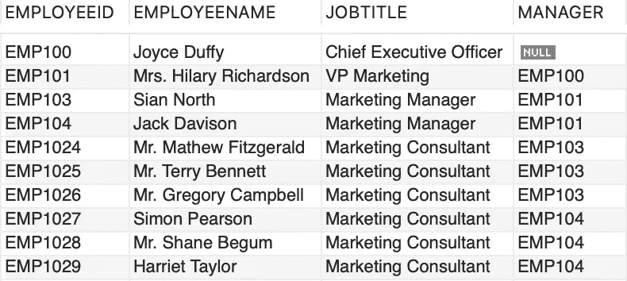

作者提供的图片：市场部员工层级

以下是上述数据集的可视化表示。注意它如何增强清晰度并快速促进理解，是不是？

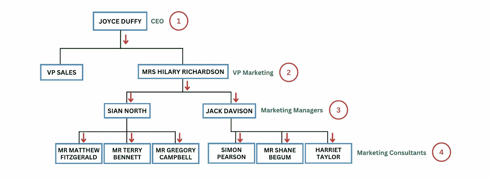

作者提供的图片：市场部员工层级

回到我们的递归逻辑，我们将*‘EMPLOYEES’*（别名为*‘EMP’*）表与递归*CTE* *‘EMPLOYEEHIERARCHY’*（别名为*‘EH’*）连接，使用条件*‘EMP.MANAGER = EH.EMPLOYEEID’*。此条件意味着员工的*‘MANAGER’*必须与前一个迭代的*‘EMPLOYEEID’*匹配。（此连接帮助我们在层级结构中找到员工及其对应的经理。）

+   从基础部分，我们已经知道，


作者提供的图片

+   在递归步骤的第一轮中，连接条件被评估为*‘EH.EMPLOYEEID = EMP100’*，这意味着它将检查*‘EMP.MANAGER = EMP100’（‘EMP.MANAGER = EH.EMPLOYEEID’）*。这帮助我们找到所有由*‘EMP100’*管理的员工。这得到了 2 个结果，为了简化演示，我们将集中于理解市场部的层级结构，

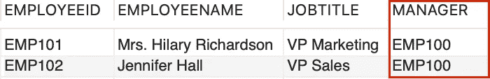

作者提供的图片

+   对于*‘Mrs. Hilary Richardson’*，她是*‘VP Marketing’*，*‘EMPHIERARCHYDEPTH’*增加到*2*。这是通过将*1*加到*‘EMPHIERARCHYDEPTH + 1’*（*1 + 1 = 2*）实现的。这表示我们在层级中向下移动了*1*级别。

+   转到递归的第二轮，连接条件现在检查*‘EH.EMPLOYEEID = EMP101’*。这将列出所有经理是*‘EMP101 - Mrs Hilary Richardson’*的员工，

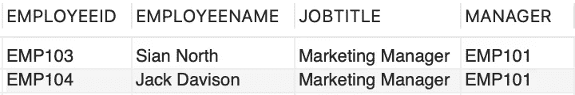

作者提供的图片

以类似的方式，查询不断迭代并将行添加到结果集中，直到找不到满足条件 *‘EMP.MANAGER = EH.EMPLOYEEID’* 的匹配项，表明层次结构中没有更多的级别可以遍历。当没有更多的子员工与他们的经理连接时，递归结束。

> 一个重要的点是，每次递归部分的迭代只在由前一次迭代产生的行上操作。

## CTE 与子查询

*SQL* 中的 *子查询* 实质上是 *“查询中的查询”*。有时也称为 *嵌套查询* 或 *内部查询*。

那么，百万美元的问题来了：哪种方法更好，*CTEs* 还是 *子查询*？好吧！没有一刀切的答案。这取决于多个因素，如你的表布局、数据内容、索引策略等。单一的方法或解决方案不能普遍适用于所有用例。*子查询* 和 *CTEs* 之间有 3 个主要区别，

+   ***CTEs* 可以递归** *CTEs* 的一个重要优点是其递归能力。它可以像我们之前讨论的那样引用自身，使其适用于创建层次结构数据结构。然而，*子查询* 缺乏这种内在的递归能力。

+   **可读性和维护性** 在专业领域，*SQL* 并不总被视为编程语言。遗憾的是，结果通常会遇到比其他编程语言更混乱的嵌套查询。在这种情况下，*CTEs* 通过整洁地封装逻辑来增强可读性，相比于 *子查询*；然而，它们可能不会始终提供性能优化。

+   **可重用性** 你可以在一个 *SQL* 查询中多次引用 *CTE*，这对于复杂的计算或转换非常有用。然而，这种可重用性因数据库而异。而 *子查询* 每次使用时都必须重写。

让我们快速查询每个客户所订购的产品总数量，

**使用子查询：**

```py
SELECT
    CUST.CUSTOMERID,
    CUST.CUSTOMERNAME,
    COALESCE((
        SELECT SUM(ORDET.QUANTITYORDERED)
        FROM ORDERS ORD
        JOIN ORDERDETAILS ORDET 
        ON ORD.ORDERID = ORDET.ORDERID
        WHERE ORD.CUSTOMERID = CUST.CUSTOMERID), 0) AS TOTAL_ORDER_QUANTITY
FROM 
    CUSTOMERS CUST;
```

**使用 CTE：**

```py
WITH CUSTOMERORDERSUMMARY AS (
    SELECT
        CUST.CUSTOMERID,
        CUST.CUSTOMERNAME,
        COALESCE(SUM(ORDET.QUANTITYORDERED), 0) AS TOTAL_ORDER_QUANTITY
    FROM 
        CUSTOMERS CUST
    LEFT JOIN 
        ORDERS ORD 
        ON CUST.CUSTOMERID = ORD.CUSTOMERID
    LEFT JOIN 
        ORDERDETAILS ORDET 
        ON ORD.ORDERID = ORDET.ORDERID
    GROUP BY 
        CUST.CUSTOMERID, CUST.CUSTOMERNAME
)

SELECT  
   * 
FROM 
   CUSTOMERORDERSUMMARY;
```

两种方法将产生相同的结果集，

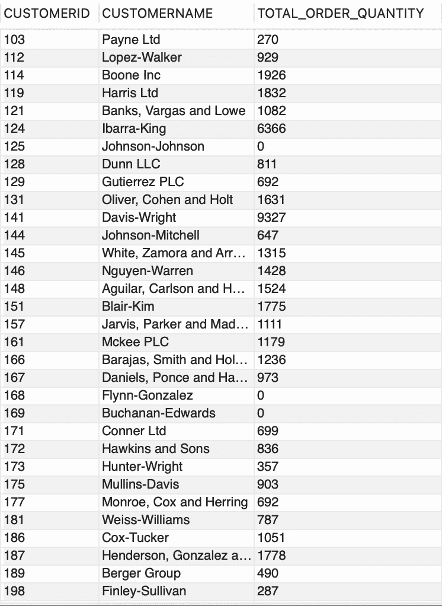

作者提供的 GIF

在现实世界的场景中，没有水晶球，你必须在你正在使用的数据集上测试和测量性能。选择它们之间的方案时，考虑具体的使用情况、查询复杂性和数据库引擎优化是至关重要的。

## CTE 与派生表

*派生表* 和 *子查询* 的术语经常互换使用。但它们之间有区别。当 *子查询* 能够独立于外部查询运行时，它就成为了 *派生表*。与 *子查询* 不同，*派生表* 需要指定一个别名。此外，*子查询* 定义在 *‘WHERE’* 子句中，而 *派生表* 定义在 *‘FROM’* 子句中。

*MySQL* 将派生表视为在执行主查询之前计算或实现的中间结果。数据库引擎生成一个执行计划，首先计算派生表，然后在主查询中使用它。

回到*CTE*与*派生表*，这两种技术用于封装和简化复杂查询。不过，它们在语法和使用上存在差异，

+   **语法**

    正如我们已经知道的，*CTE* 是通过*‘WITH’*子句定义的；而*派生表*是在主查询的*‘FROM’*子句中通过子查询创建的。

+   **可读性**

    *CTE*和*派生表*通过将复杂查询分解为较小的查询来提高可读性。然而，我个人认为*CTE*稍微容易阅读一些，因为它在语句的开头定义，而不是嵌入在查询中。

+   **递归性** *CTE* 可以自我引用*（递归）*，正如我们之前讨论的，而*派生表*则不具备这种能力。

+   **性能**

    *派生表*通常被认为是主查询中的虚拟表，在不同的数据库中可能会引入轻微的性能开销。*PostgreSQL* 可以优化它们的执行，而*MySQL*可能将它们视为实现的子查询。另一方面，*CTE*，某些数据库可以优化它们的执行，尽管这并不普遍适用。例如，*SQL Server* 通常优化*CTE*的执行，而*MySQL*在这方面的行为可能较不一致。

*CTE*和*派生表*在可读性和简化复杂查询方面提供了或多或少类似的优势。选择它们之间的使用取决于具体的用例和你使用的数据库系统。

让我们找出每个产品的库存总量与销售总量，

**使用派生表：**

```py
SELECT 
   PRD.PRODUCTNAME, 
   PRD.QUANTITYINSTOCK,
   PS.TOTAL_QUANTITY_SOLD
FROM 
   PRODUCTS PRD
JOIN (
    SELECT
        PRODUCTID,
        SUM(QUANTITYORDERED) AS TOTAL_QUANTITY_SOLD
    FROM ORDERDETAILS
    GROUP BY PRODUCTID
) AS PS
ON PRD.PRODUCTID = PS.PRODUCTID;
```

**使用 CTE：**

```py
--cte
WITH PRODUCTSALES AS (
    SELECT
       PRODUCTID,
       SUM(QUANTITYORDERED) AS TOTAL_QUANTITY_SOLD
    FROM 
       ORDERDETAILS
    GROUP BY 
       PRODUCTID
)

--main query
SELECT 
   PRD.PRODUCTNAME, 
   PRD.QUANTITYINSTOCK,
   PS.TOTAL_QUANTITY_SOLD
FROM 
   PRODUCTS PRD
JOIN 
   PRODUCTSALES PS 
   ON PRD.PRODUCTID = PS.PRODUCTID;
```

两者将产生相同的结果集。

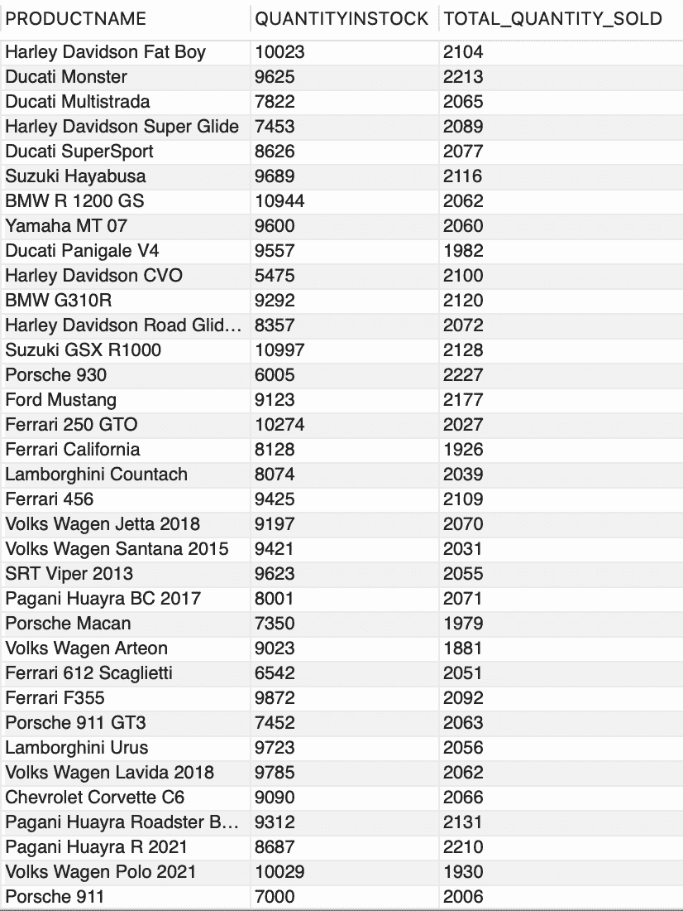

作者提供的 GIF

## CTE 与临时表

*临时表* 是数据库中的特殊类型表，你可以在处理数据时临时存放数据。这些表是会话特定的，意味着它们仅在当前会话中可见，并在会话结束时自动删除。删除数据库不会自动删除在该数据库中创建的任何*临时表*。

*CTE*与*临时表*之间的主要区别是，

+   **存储和可见性**

    *临时表*在数据库中物理存储。它们超出单个查询的范围，并且在明确删除或会话结束之前保持可用。

    而*CTE* 是虚拟的，并且不会在数据库中物理存储。它们是查询执行的一部分，只存在于该查询的持续时间内。

+   **可重用性**

    一些数据库确实允许*CTE*在同一会话中被多个查询重用。

    *临时表* 可以在同一会话中的多个查询之间重用，非常适合需要多次引用相同数据的场景。

+   **索引与优化**

    *CTE* 不允许创建索引，因为它们是查询执行计划的一部分。

    *临时表* 可以被索引，其数据可以优化以提高查询性能。

+   **性能**

    由于*临时表*是物理存储的，它们有时可能会导致磁盘 I/O 和存储开销。它们在管理大量数据时非常有用，并且需要在同一会话中跨多个查询引用这些数据。然而，根据数据大小，它们可能会影响性能。另一方面，*CTE*通常由查询优化器优化，它们的数据可以驻留在内存中，从而减少磁盘 I/O 并提高性能。当目标是简化复杂查询以提高查询可读性时，*CTE*是首选。

假设我们想要找出每个产品类别的总销售收入，

**使用临时表：**

```py
--create a temporary table to store intermediate results
CREATE TEMPORARY TABLE TEMPREVENUECATEGORY AS
SELECT
    PRD.PRODUCTCATEGORY,
    SUM(ORDET.QUANTITYORDERED * PRD.BUYPRICE) AS TOTAL_REVENUE
FROM
    PRODUCTS PRD
JOIN
    ORDERDETAILS ORDET ON PRD.PRODUCTID = ORDET.PRODUCTID
GROUP BY
    PRD.PRODUCTCATEGORY;

--select data from the temporary table
SELECT 
  * 
FROM 
  TEMPREVENUECATEGORY;
```

**使用 CTE：**

```py
--use CTE to calculate total revenue by product category
WITH REVENUECATEGORY AS (
    SELECT
        PRD.PRODUCTCATEGORY,
        SUM(ORDET.QUANTITYORDERED * PRD.BUYPRICE) AS TOTAL_REVENUE
    FROM
        PRODUCTS PRD
    JOIN
        ORDERDETAILS ORDET ON PRD.PRODUCTID = ORDET.PRODUCTID
    GROUP BY
        PRD.PRODUCTCATEGORY
)

--select data from the CTE
SELECT 
   * 
FROM 
   REVENUECATEGORY;
```

两个查询产生类似的结果，

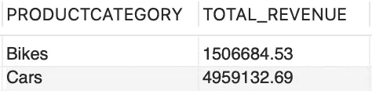

图片由作者提供

## 最终挑战

```py
**Analysing Customer Orders
-------------------------**

Write a query to find the customer or customers with the highest total 
order value for 'shipped' orders. Your query should include the following 
details for the customer with the highest value order,

* Customer ID 
* Customer Name
* Total count of orders
* Total value of the orders placed by the customer
* Sales representative employee for the customer

**Hint:** Refer to the ER Diagram provided at the start of the article to 
grasp the interconnections between tables. Create a list of the columns 
you intend to retrieve, present them in tabular format, and cross-
reference the diagram to identify the corresponding fields available 
in each table.
```

在回复部分分享你的答案，如果需要帮助，随时留下评论！

## 结论

无论你是初学者还是经验丰富的*SQL*从业者，编写查询有点像在厨房里做菜。你最喜欢的厨师刀可能在切菜时表现出色，但同样的刀可能不适合嫩化肉类。（这个比喻的出处归功于我对《顶级厨师》的狂热追看。）同样，你常用的技术在某些情况下可能表现优异，但在其他情况下可能效果不佳。这完全是关于评估用例并选择合适的技术以获得最佳解决方案。请务必参考你正在使用的数据库的官方文档。

这里有一些有用的资源可以帮助你入门*CTE*，

+   [MySQL 中的 CTE](https://dev.mysql.com/doc/refman/8.0/en/with.html)

+   [MySQL 中的临时表](https://dev.mysql.com/doc/refman/8.0/en/create-temporary-table.html)

+   [MySQL 中的派生表](https://dev.mysql.com/doc/refman/8.0/en/derived-tables.html)

+   [MySQL 中的子查询](https://dev.mysql.com/doc/refman/8.0/en/subqueries.html)

*本文使用的源数据、代码文件和练习题的解决方案可以在我的* [*GitHub 仓库*](https://github.com/PhoenixIM/All_Things_SQL/tree/main/Common%20Table%20Expression)*.* 

[*成为会员并阅读 Medium 上的所有故事*](https://medium.com/@iffatm/membership)*.*

学习愉快！
