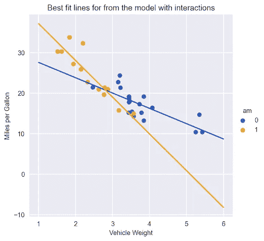

# 时间序列预测中交互项的全面指南

> 原文：[`towardsdatascience.com/a-comprehensive-guide-on-interaction-terms-in-time-series-forecasting-16bfa468ae`](https://towardsdatascience.com/a-comprehensive-guide-on-interaction-terms-in-time-series-forecasting-16bfa468ae)


图片由 Midjourney 创建

## 了解如何通过使线性模型对趋势变化更加灵活来提高模型的拟合度

[](https://eryk-lewinson.medium.com/?source=post_page-----16bfa468ae--------------------------------)[](https://towardsdatascience.com/?source=post_page-----16bfa468ae--------------------------------) [Eryk Lewinson](https://eryk-lewinson.medium.com/?source=post_page-----16bfa468ae--------------------------------)

·发表于 [Towards Data Science](https://towardsdatascience.com/?source=post_page-----16bfa468ae--------------------------------) ·阅读时间 7 分钟·2023 年 8 月 1 日

--

建模时间序列数据可能具有挑战性（也很有趣），因为其固有的复杂性和不可预测性。例如，时间序列中的长期趋势可能由于某些事件而发生剧烈变化。回想全球疫情初期，航空公司或实体店等业务的客户数量和销售额迅速下降。相比之下，电子商务企业在较少的干扰下继续运营。

交互项有助于建模这些模式。它们捕捉变量之间的复杂关系，从而导致更准确的预测。

本文探讨：

+   交互项在时间序列预测中的应用

+   在建模复杂关系时，交互项的好处

+   如何在模型中有效实施交互项

# 交互项概述

交互项使你能够调查目标与特征之间的关系是否会根据另一个特征的值而变化。欲了解更多详情，请参阅 [我之前的文章](https://medium.com/towards-data-science/unlocking-the-power-of-interaction-terms-in-linear-regression-ba30c2cf158f)。

图 1 展示了一个散点图，表示每加仑行驶里程（目标）与车辆重量（特征）之间的关系。根据变速器类型（另一个特征），关系会有所不同。



*图 1\. 各种车辆变速器类型的最佳拟合线，包括交互项*

如果不使用交互项，线性模型将无法捕捉到如此复杂的关系。实际上，它将为权重特征分配相同的系数，无论传输类型如何。图 1 显示了按权重特征的系数（线的斜率），不同传输类型的系数差异极大。

为了克服这种谬误并使线性模型更具灵活性，我们可以使用交互项。通常，它们是原始特征的乘积。通过将这些新变量添加到回归模型中，我们可以测量它们与目标之间的交互效果。

# 时间序列预测中的交互项

交互项使线性模型更具灵活性。以下示例展示了它们在时间序列预测中的作用。

## 先决条件

首先，我们加载所需的库：

```py
import numpy as np
import pandas as pd

from sklearn.linear_model import LinearRegression

import seaborn as sns 
import matplotlib.pyplot as plt
```

## 数据集生成

然后，我们生成一些具有以下特征的人工时间序列数据：

+   10 年的日数据

+   时间序列中的重复模式（季节性）

+   前 7 年的下降趋势

+   最后 3 年没有趋势

+   随机噪声，作为最后一步添加

```py
# for reproducibility
np.random.seed(42)

# generate the DataFrame with dates
range_of_dates = pd.date_range(
    start="2010-01-01",
    end="2019-12-30"
)
df = pd.DataFrame(index=range_of_dates)

# create a sequence of day numbers
df["linear_trend"] = range(len(df))
df["trend"] = 0.004 * df["linear_trend"].values[::-1]
df.loc["2017-01-01":, "trend"] = 4

# generate the components of the target
signal_1 = 10 + 4 * np.sin(df["linear_trend"] / 365 * 2 * np.pi)
noise = np.random.normal(0, 0.85, len(df))

# combine them to get the target series
df["target"] = signal_1 + noise + df["trend"]

# plot
df["target"].plot(title="Generated time series");
```

图 2 显示了生成的时间序列，涵盖了所有期望的特征。


*图 2\. 生成的时间序列*

## 训练基准模型

现在，我们将训练一个线性模型并检查最佳拟合线。在本文中，我们只创建几个特征的简单模型。这将使我们能够直观地检查交互项对模型拟合的影响。

最简单的模型只包含一个特征——时间的指示符。为时间序列创建的`linear_trend`列实际上是 DataFrame 的行号（按日期排序）。

```py
X = df[["linear_trend"]]
y = df[["target"]]

lm = LinearRegression()
lm.fit(X, y)

df["model_1"] = lm.predict(X)

df[["target", "model_1"]].plot(title="Linear trend");
```

值得一提的是，这里的重点不是使用独立的训练和测试集来正确评估预测，而是解释交互项对模型拟合的影响。通过检查拟合值（训练集上的预测）并将这些拟合值与原始时间序列进行比较，可以更容易地观察交互项的影响。

图 3 显示线性模型识别了整个时间序列的下降趋势。同时，对于最后 3 年的数据，拟合效果似乎不佳，因为那里没有趋势。


*图 3\. 从线性模型中获得的最佳拟合线，使用线性趋势作为特征*

## 添加断点

接下来，我们尝试通过特征工程让模型学习新的模式（趋势变化）。为此，我们创建了一个断点变量，表示给定观测是否在 2017 年 1 月 1 日之后。在这种情况下，我们知道趋势变化发生的确切时间点。

接下来，我们训练另一个线性模型，这次使用两个特征：

```py
df["after_2017_breakpoint"] = np.where(df.index >= pd.Timestamp('2017-01-01'), 1, 0)

X = df[["linear_trend", "after_2017_breakpoint"]]
y = df[["target"]]

lm = LinearRegression()
lm.fit(X, y)

df["model_2"] = lm.predict(X)

df[["target", "model_2"]].plot(title="Linear trend + breakpoint");
```


*图 4\. 使用线性趋势和断点作为特征从线性模型获得的最佳拟合线*

图 4 展示了一些重要的变化，如下所列：

+   拟合线显示了一个垂直跳跃，这对应于新布尔特征的系数。

+   垂直跳跃恰好发生在特征变为激活（值为 1 而非 0）的第一个日期。

+   在引入的断点之前和之后，线的斜率是相同的。

+   模型试图通过在断点之后的预测中添加固定量来弥补不正确的斜率。

在最后 3 年的数据中没有趋势，因此理想情况下，2017 年 1 月 1 日后线应接近平坦。

## 添加交互项

为了在断点后改变斜率，我们添加了对时间戳的更复杂的依赖（由线性趋势表示）。这正是交互项的作用——它是线性趋势和占位符变量的乘积。

```py
df["interaction_term"] = df["after_2017_breakpoint"] * df["linear_trend"]

X = df[["linear_trend", "after_2017_breakpoint", "interaction_term"]]
y = df[["target"]]

lm = LinearRegression()
lm.fit(X, y)

df["model_3"] = lm.predict(X)

df[["target", "model_3"]].plot(title="Linear trend + breakpoint + interaction term"); 
```


*图 5\. 使用线性趋势、断点和交互项作为特征从线性模型获得的最佳拟合线*

图 5 显示了在模型中添加交互项的影响。与图 4 相比，最佳拟合线在断点后的斜率不同。

更准确地说，差异实际上是交互项的系数值。虽然新线并没有完全平坦，但它在时间序列的早期部分仍然比以前的斜率更平缓。

引入断点和交互项一起提高了模型捕捉时间序列趋势的能力。反过来，这应增加模型的预测性能。

# 总结

+   使用交互项可以使线性模型的规格更加灵活（不同的斜率用于不同的线），这可能会导致对数据的更好拟合和更好的预测性能。

+   我们可以将交互项添加为原始特征的乘积。

+   在时间序列的背景下，我们可以使用交互项更好地捕捉趋势的变化。

你可以在我的 [GitHub](https://github.com/erykml/medium_articles/blob/master/Time%20Series/interaction_terms_time_series.ipynb) 上找到本文使用的代码。此外，笔记本中的代码展示了如何利用 cuDF 和 cuML 使用 GPU 加速训练模型。如常，欢迎反馈。你可以通过 [Twitter](https://twitter.com/erykml1) 或在评论中与我联系。

*喜欢这篇文章？成为 Medium 会员继续阅读无限制地学习。如果你使用* [*这个链接*](https://eryk-lewinson.medium.com/membership) *成为会员，你将以零额外费用支持我。提前感谢，并期待再次见面！*

你可能还对以下内容感兴趣：

## 解锁线性回归中的交互项的威力

### 学习如何通过包括交互项使你的线性模型更加灵活

towardsdatascience.com ## 将 VS Code 转变为机器学习实验的一站式工具

### 如何在不离开 IDE 的情况下运行和评估实验

towardsdatascience.com ## 帮助你进行时间序列分析的 5 种图表类型

### 以及如何使用 Python 快速创建这些图像！

towardsdatascience.com ## 时间序列特征工程的三种方法

### 使用虚拟变量、周期编码和径向基函数

towardsdatascience.com

# 参考文献

+   [`quantifyinghealth.com/why-and-when-to-include-interactions-in-a-regression-model/`](https://quantifyinghealth.com/why-and-when-to-include-interactions-in-a-regression-model/)

+   [`en.wikipedia.org/wiki/Interaction_(statistics)`](https://en.wikipedia.org/wiki/Interaction_(statistics))

+   [`www.youtube.com/watch?v=UVny7a8AoA4`](https://www.youtube.com/watch?v=UVny7a8AoA4)

除非另有说明，所有图片均由作者提供。

*最初发布于* [*NVIDIA 的开发者博客*](https://developer.nvidia.com/blog/a-comprehensive-guide-on-interaction-terms-in-time-series-forecasting/) *于 2023 年 7 月 20 日*
