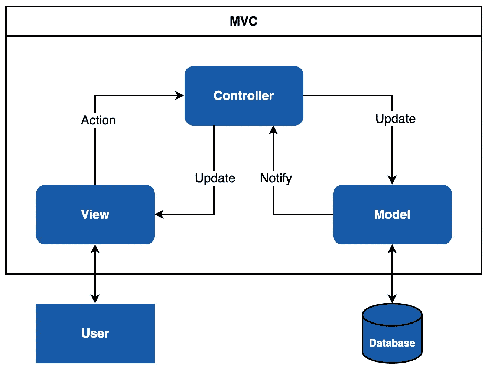
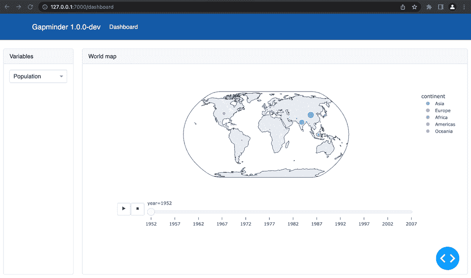
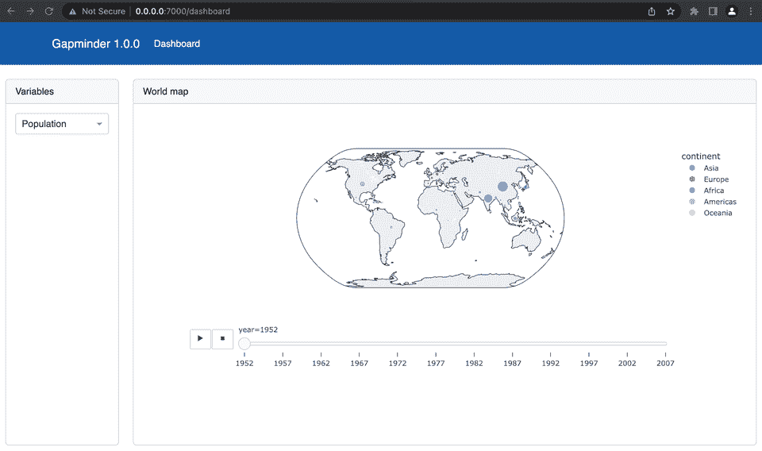

# 构建企业级 Plotly Dash 应用程序的全面指南

> 原文：[`towardsdatascience.com/a-comprehensive-guide-to-building-enterprise-level-plotly-dash-apps-bd40dfe1313c`](https://towardsdatascience.com/a-comprehensive-guide-to-building-enterprise-level-plotly-dash-apps-bd40dfe1313c)

## 使用纯 Python 和 Docker 构建生产就绪的 web 应用程序

[](https://tinztwinspro.medium.com/?source=post_page-----bd40dfe1313c--------------------------------)[](https://towardsdatascience.com/?source=post_page-----bd40dfe1313c--------------------------------) [Janik 和 Patrick Tinz](https://tinztwinspro.medium.com/?source=post_page-----bd40dfe1313c--------------------------------)

·发表于 [Towards Data Science](https://towardsdatascience.com/?source=post_page-----bd40dfe1313c--------------------------------) ·阅读时间 10 分钟·2023 年 5 月 15 日

--


图片由 [Scott Graham](https://unsplash.com/@homajob?utm_source=medium&utm_medium=referral) 提供，来源于 [Unsplash](https://unsplash.com/?utm_source=medium&utm_medium=referral)

数据科学项目总是需要某种形式的可视化。对于初步分析，数据科学家通常使用 Jupyter Notebooks 和像 matplotlib 或 seaborn 这样的库。在探索性数据分析中，数据科学家使用直方图、散点图或进行统计评估。对于初步见解，这种方法非常合适。然而，交互式仪表板更适合呈现结果。许多客户正是需要这种功能！交互式仪表板是以易于理解的方式解释结果的有效方法。

但创建交互式仪表板并非易事。在我们看来，Plotly Dash 是创建令人印象深刻图表的最佳选择。对于生产就绪的仪表板应用程序，您必须考虑其他方面（例如使用 Docker 部署）。

在本文中，我们想分享使用 Plotly Dash 构建结构良好的仪表板应用程序的最佳实践。此外，我们展示了如何使用 Docker 清洁地部署 Dash 应用程序。我们始终欢迎改进建议，请在评论中写下你的想法！

# 为什么选择 Plotly Dash？

[Plotly Dash](https://dash.plotly.com/) 是一个用于构建基于网页应用的高效 Python 框架。这个开源库使用宽松的 MIT 许可证。它建立在 [Flask](https://flask.palletsprojects.com/en/2.2.x/)、[Plotly.js](https://plotly.com/javascript/) 和 [React.js](https://react.dev/) 之上。你可以用 [Python](https://www.python.org/)、[R](https://www.r-project.org/)、[Julia](https://julialang.org/) 和 [F#](https://fsharp.org/) 创建和部署具有自定义用户界面的网页应用。该框架抽象了创建全栈网页应用所需的协议和技术。

## 优点

+   你可以用纯 Python 实现网页接口。不需要 JavaScript！

+   Dash 是响应式的！你可以实现具有多个 Inputs、多个 Outputs 和依赖于其他 Inputs 的 Inputs 的复杂 UI。

+   Dash 应用是多用户应用。多个用户可以在独立会话中查看 Dash 应用。

+   Dash 是建立在 React.js 之上的。你可以用 React 实现并使用你自己的 Dash 组件。

+   Dash 应用使用 Flask 作为后端，因此你可以使用 [Gunicorn](https://gunicorn.org/) 来运行它们。Gunicorn 允许你通过增加工作进程的数量，将 Dash 应用扩展到成千上万的用户。

+   开源框架（使用宽松的 MIT 许可证）。

+   出色的文档和社区（[Dash Community Forum](https://community.plotly.com/) 和 [GitHub](https://github.com/plotly/dash)）。

## 缺点

+   回调函数必须有 Inputs 和 Outputs。

+   两个回调函数不能更新同一个输出元素。

每个框架都有缺点，但 Dash 的缺点可以通过解决方法来克服。优点大于缺点！

# 为什么选择 Docker？

你可以使用 [Docker](https://www.docker.com/) 隔离应用程序。它使用一种称为容器虚拟化的概念。应用程序可以轻松地用 Docker 部署，因为轻量级容器包含所有必要的包。容器共享单一操作系统内核的服务，因此它们比虚拟机使用更少的资源。

Docker 使部署 Dash 应用变得简单。使用 Docker，你可以将 Dash 应用部署到所有架构（amd64、i386、arm64、arm）。这种方法使你不依赖于部署环境（本地或云）。

# 模型视图控制器模式

模型视图控制器（MVC）是一种将软件划分为三个组件的模式：*Model*、*View* 和 *Controller*。



模型视图控制器架构（图源自作者）

模型组件包含业务逻辑。这个组件与数据库或其他后端组件进行通信。视图组件展示数据。需要注意的是，视图与模型没有直接的连接。控制器形成了这种连接。控制器负责数据处理。控制器用一个或多个模型中的数据更新视图。

## 优点

+   **并行开发**：不同的开发者可以实现各自的组件。

+   **可扩展性：** 针对相同数据模型的多个视图

+   **避免复杂性：** 将应用程序分成独立的 MVC 单元

+   **概念的清晰分离：** 具体任务的逻辑分组

## 缺点

+   **模型和控制器之间的强依赖**

# 最佳实践：Dash 应用的项目结构

我们通过一个示例 Dash 应用展示我们的最佳实践。可以自由使用此示例作为你下一个 Dash 应用的基础。

我们推荐在虚拟环境中工作（例如 [conda](https://docs.conda.io/en/latest/)）。请在你的系统上安装 conda。创建虚拟环境以保持你的主系统的清洁。

**创建并激活 conda 环境：**

```py
$ conda create -n dash-app python=3.9.12
$ conda activate dash-app
```

Web 应用由许多组件和页面组成。我们建议将各个概念分成几个文件夹和文件。这种方法大大简化了 Web 应用的维护。

**我们推荐以下结构：**

```py
.
├── dash-app              
│   └── assets              # this folder contains style files
│   │   ├── style.py
│   │   └── typography.css
│   ├── components          # this folder contains reusable components
│   │   ├── dropdown.py
│   │   └── navbar.py
│   ├── environment         # this folder contains environment settings
│   │   ├── .env
│   │   ├── .env_development
│   │   └── settings.py
│   ├── pages               # this folder contains the pages
│   ├── plots               # this folder contains different plots
│   ├── utils               # this folder contains helper functions
│   ├── app.py
│   ├── Dockerfile
│   ├── index.py
│   └── requirements.txt
```

我们将从上到下详细介绍各个文件夹和文件。

## assets 文件夹

该文件夹包含你的 Dash 应用的样式信息（例如 CSS、JavaScript 文件或 favicon.ico）。Dash 会自动提供所有文件，只要你将文件夹命名为 `assets`。

**style.py**

```py
# main style of the app
MAIN_COLORS = {
    'primary': '#165AA7',
    'secondary': '#000000',
    'third': '#FFFFFF',
}
```

在 `style.py` 文件中，我们定义应用程序的配色方案。Python 字典是一个不错的选择。我们可以轻松地从其他文件访问字典信息。有关更多样式信息，你可以轻松创建另一个字典。

**typography.css**

```py
body {
    font-family: sans-serif;
}

h1, h2, h3, h4, h5, h6 {
    text-align: center;
}
```

`typography.css` 文件包含排版信息。

## components 文件夹

该文件夹包含所有可重用的组件（例如下拉菜单、按钮或表格）。其优点是你可以在多个页面上使用这些组件。

**dropdown.py**

```py
from dash import dcc

def render_dropdown(dropdown_id: str, items=[''], clearable_option=False):
    dropdown = dcc.Dropdown(
        id=dropdown_id,
        clearable=clearable_option,
        options=[{'label': i, 'value': i} for i in items],
        value=items[0],
    )
    return dropdown
```

对于下拉菜单，我们使用 [Dash Core Components](https://dash.plotly.com/dash-core-components)。每当我们需要一个下拉菜单时，可以使用 `render_dropdown()` 函数。其优点是所有下拉菜单具有相同的样式。

**navbar.py**

```py
import dash_bootstrap_components as dbc

from environment.settings import VERSION

# import own style (see /assets)
from assets.style import MAIN_COLORS

navbar = dbc.NavbarSimple(
    children=[
        dbc.NavItem(dbc.NavLink("Dashboard", href="/dashboard")),
    ],
    brand="Gapminder " + VERSION,
    brand_href="/",
    color=MAIN_COLORS["primary"],
    sticky='top',
    links_left=True,
    dark=True
)
```

导航栏包含指向各个页面的链接。对于导航栏，我们使用 [Dash Bootstrap Components](https://dash-bootstrap-components.opensource.faculty.ai/docs/components/navbar/)。你可以单独设计 `dbc.NavbarSimple()` 组件。

## environment 文件夹

不同的环境有不同的配置文件。包括 Dev、Staging、Prod 等。该文件夹包含不同的环境文件。在我们的例子中，我们有一个开发环境（`.env_development`）和一个生产环境（`.env`）。

**.env**

```py
VERSION=1.0.0
```

该文件包含生产参数。我们在网页界面中稍后使用 `VERSION` 参数来查看哪个环境是活动的。

**.env_development**

```py
VERSION=1.0.0-dev
HOST=127.0.0.1
PORT=7000
DEBUG=True
```

该文件包含开发参数。`HOST`、`PORT` 和 `DEBUG` 参数将用于本地开发服务器。

**settings.py**

```py
import os
from dotenv import load_dotenv

env_path = os.path.join(os.path.dirname(__file__), os.getenv('ENV_FILE') or ".env_development")
load_dotenv(dotenv_path=env_path, override=True)

VERSION = os.environ.get("VERSION")

APP_HOST = os.environ.get("HOST")
APP_PORT = os.environ.get("PORT")
APP_DEBUG = bool(os.environ.get("DEBUG"))
```

在这个文件中，我们读取环境配置。为此，我们使用 Python 包 [python-dotenv](https://pypi.org/project/python-dotenv/)。首先，我们根据环境变量 `ENV_FILE` 读取正确的配置文件。对于本地开发，我们使用 `.env_development`。通过 `ENV_FILE` 环境变量，我们可以定义相应的环境。我们稍后在 Dockerfile 中设置 `ENV_FILE` 变量。在我们的例子中，`.env` 是生产环境。

## pages 文件夹

一个网页应用程序通常由多个页面组成。我们建议为每个页面创建一个文件夹。每个页面文件夹包含三个文件，以应用 MVC 模式。一个页面有一个模型、视图和控制器文件。这样我们就有了概念的清晰分离。

**dashboard/dashboard_controller.py**

```py
from dash.dependencies import Input, Output
from app import app
from pages.dashboard.dashboard_model import map_dataframe

# import components
from plots.map_plot import *

@app.callback(
    Output(component_id='div-vis', component_property='children'),
    Input(component_id='dropdown-choose-item', component_property='value')
)
def update_vis(variable):
    df = map_dataframe()
    fig = bubble_map(df, variable)

    return fig
```

控制器是视图和模型之间的接口。控制器响应网页界面的事件。此外，控制器从模型中获取数据。最后，控制器将结果返回给网页界面。

**dashboard/dashboard_model.py**

```py
import plotly.express as px

def get_map_data():
     df = px.data.gapminder()
     return df

def map_dataframe():
    return get_map_data()
```

在 `dashboard_model.py` 文件中，我们通过 [plotly.express.data](https://plotly.com/python-api-reference/generated/plotly.express.data.html) 包的内置数据集 gapminder 获取数据。

**dashboard/dashboard_view.py**

```py
import dash_bootstrap_components as dbc
from dash import html

# import components
from components.dropdown import render_dropdown
from components.navbar import navbar

def render_dashboard():
    return html.Div([
        navbar,
        html.Div(
            [
                html.Br(),
                dbc.Container(
                    fluid=True,
                    children=[
                        dbc.Row(
                            [
                                dbc.Col(
                                    width=2,
                                    children=dbc.Card(
                                        [
                                            dbc.CardHeader("Variables"),
                                            dbc.CardBody(
                                                [
                                                    render_dropdown(dropdown_id="dropdown-choose-item", items=['Population', 'Life expectancy', 'GDP per capita'])
                                                ]
                                            )
                                        ],
                                        style={'height': "84vh"},
                                    )
                                ),
                                dbc.Col(
                                    width=10,
                                    children=dbc.Card(
                                        [
                                            dbc.CardHeader("World map"),
                                            dbc.CardBody(
                                                [
                                                    html.Div(id='div-vis')
                                                ]
                                            )
                                        ],
                                        style={'height': '84vh'}
                                    )
                                )
                            ]
                        )
                    ]
                ),
            ]
        )
    ])
```

在这个文件中，我们定义了网页界面的外观。在这种情况下，我们使用来自组件文件夹的下拉菜单和导航栏。

**page_not_found.py**

```py
from dash import html

def page_not_found():
    return html.Div([
        html.H1('404'),
        html.H2('Page not found'),
        html.H2('Oh, something went wrong!')
    ])
```

当页面未找到时，会显示这个页面。例如，如果你在 URL 中输入了错误的路径。

## plots 文件夹

这个文件夹包含了应用程序的不同图表。我们建议为每种图表类型创建一个新的文件。

**map_plot.py**

```py
from dash import dcc
import plotly.express as px

def bubble_map(df, variable):
    dict_variable = {'Population':'pop', 'Life expectancy':'lifeExp', 'GDP per capita':'gdpPercap'}
    variable = dict_variable[variable]

    fig = px.scatter_geo(df, locations="iso_alpha", color="continent",
                     hover_name="country", size=variable,
                     animation_frame="year",
                     projection="natural earth")

    return dcc.Graph(figure=fig)
```

我们使用 [Plotly Express](https://plotly.com/python/plotly-express/) 绘制地图图表。

## utils 文件夹

这个文件夹包含可以通用的辅助函数和组件。例如，一个连接到其他服务（例如 RESTful 服务）的连接器。

## app.py

```py
import dash
import dash_bootstrap_components as dbc

APP_TITLE = "Plotly Dash"
app = dash.Dash(__name__,
                title=APP_TITLE,
                update_title='Loading...',
                suppress_callback_exceptions=True,
                external_stylesheets=[dbc.themes.FLATLY])
```

在这个文件中，我们创建了 Dash 实例 `dash.Dash()`。我们有一个动态布局，因此我们将 `suppress_callback_exceptions` 设置为 `True`。此外，我们使用来自 [Dash Bootstrap Components themes](https://dash-bootstrap-components.opensource.faculty.ai/docs/themes/explorer/) 的 FLATLY 主题。

## index.py

```py
from dash import dcc
from dash import html
from dash.dependencies import Input, Output

# import pages
from pages.dashboard.dashboard_view import render_dashboard
from pages.dashboard.dashboard_controller import *
from pages.page_not_found import page_not_found

from app import app

from environment.settings import APP_HOST, APP_PORT, APP_DEBUG

server = app.server

def serve_content():
    return html.Div([
        dcc.Location(id='url', refresh=False),
        html.Div(id='page-content')
    ])

app.layout = serve_content()

@app.callback(Output('page-content', 'children'),
              Input('url', 'pathname'))
def display_page(pathname):
    if pathname in '/' or pathname in '/dashboard':
        return render_dashboard()
    return page_not_found()

if __name__ == '__main__':
    app.run_server(debug=APP_DEBUG, host=APP_HOST, port=APP_PORT)
```

这个文件是 Dash 应用程序的入口点。对于 Gunicorn，重要的是定义 `server = app.server`。这设置了应用程序的 Flask 服务器。当页面发生变化时，函数 `display_page()` 将被触发。对于开发环境，我们将 `app.run_server()` 的参数从开发环境文件中传递。

## requirements.txt

```py
dash==2.9.1
dash-bootstrap-components==1.4.1
gunicorn==20.1.0
python-dotenv==1.0.0
geopandas==0.13.0
```

这个文件包含所有必需的依赖项。请使用以下命令安装这些依赖项：

```py
$ pip install -r requirements.txt
```

现在我们准备开始应用程序。

## 本地开发

导航到 `dash-app` 文件夹并执行以下命令：

```py
$ python index.py
```

Dash 应用程序启动。你可以在 [`127.0.0.1:7000`](http://127.0.0.1:7000) 打开应用程序。



仪表板开发版本（作者截图）

我们可以看到在开发环境中设置的版本号 1.0.0-dev。Dash 在右下角提供调试信息。在开发 Dash 应用程序时，[Dash 开发工具](https://dash.plotly.com/devtools) 被启用。

## Docker 化 Dash 应用程序（生产环境）

*注意：* 请在您的系统上安装 [Docker](https://www.docker.com/get-started/)。

**Dockerfile**

```py
FROM python:3.9.12

# Create non-root group and user
RUN addgroup --system shared1 \
    && adduser --system --home /var/cache/shared1 --ingroup shared1 --uid 1001 dashuser

WORKDIR /usr/share/shared1/dashapp

COPY requirements.txt /usr/share/shared1/dashapp/

# Elegantly activating a venv in Dockerfile
ENV VIRTUAL_ENV=/usr/share/shared1/dashapp/venv
RUN python3 -m venv $VIRTUAL_ENV
ENV PATH="$VIRTUAL_ENV/bin:$PATH"

# Install requirements
RUN pip install --trusted-host pypi.python.org -r requirements.txt

COPY . /usr/share/shared1/dashapp/

# set enviroment variables
# This prevent Python from writing out pyc files
ENV PYTHONDONTWRITEBYTECODE=1
# This keeps Python from buffering stdin/stdout
ENV PYTHONUNBUFFERED=1

ENV ENV_FILE=".env"

EXPOSE 7000

USER dashuser

ENTRYPOINT ["gunicorn", "index:server", "-b", "0.0.0.0:7000", "--workers=4"]
```

在 Dockerfile 中，我们创建了一个用户和一个虚拟环境。虚拟环境有助于控制 Python 依赖项。它还保持本地开发环境与容器应用程序之间的差异较小。Itamar Turner-Trauring 的教程 “[优雅地在 Dockerfile 中激活 virtualenv](https://pythonspeed.com/articles/activate-virtualenv-dockerfile/)” 介绍了如何在 Dockerfile 中激活虚拟环境。如果您感兴趣，请阅读！虚拟环境不会减慢 Dash 应用程序的速度。此外，我们也不太可能随着时间的推移遇到奇怪的 bug（例如，操作系统层面的变化）。在最后一行中，我们定义了入口点。主机必须是 **0.0.0.0** 以便 Dash 应用程序可以访问。

现在，您可以使用以下命令构建应用程序：

```py
docker build -t dash-app:latest .
```

使用以下命令运行应用程序：

```py
docker run --name dashboard -d -p 7000:7000 dash-app
```

现在，您可以在 [`0.0.0.0:7000`](http://127.0.0.1:7000) 打开应用程序。



仪表板生产版本（作者截图）

我们可以看到在生产环境文件中设置的版本号 1.0.0。Docker 允许我们在云端或本地环境中以轻量级容器的形式部署 Dash 应用程序。

# 结论

在本文中，我们提出了一个构建 Dash 应用程序的概念。我们展示了如何应用模型-视图-控制器模式，以实现概念的清晰分离。这种方法有助于维护 Dash 应用程序。我们还展示了如何使用不同的环境。最后，我们介绍了一种在 Docker 容器中部署 Dash 应用程序的简洁方法。

👉🏽 [**加入我们的免费每周 Magic AI 通讯，获取最新的 AI 更新！**](https://magicai.tinztwins.de)

👉🏽 [**您可以在我们的数字产品页面找到所有免费的资源！**](https://shop.tinztwins.de/)

[**免费订阅**](https://tinztwinspro.medium.com/subscribe) **以便在我们发布新故事时收到通知：**

[](https://tinztwinspro.medium.com/subscribe?source=post_page-----bd40dfe1313c--------------------------------) [## 每当 Janik 和 Patrick Tinz 发布新内容时，您将收到一封电子邮件。

### 每当 Janik 和 Patrick Tinz 发布新内容时，您将收到一封电子邮件。通过注册，如果您还没有 Medium 账户，系统将为您创建一个账户……

tinztwinspro.medium.com](https://tinztwinspro.medium.com/subscribe?source=post_page-----bd40dfe1313c--------------------------------)

在我们的[关于页面](https://medium.com/@tinztwinspro/about)了解更多关于我们的信息。别忘了在[X](https://twitter.com/tinztwins)上关注我们。非常感谢你的阅读。如果你喜欢这篇文章，随时分享它。**祝你有美好的一天！**

使用[我们的链接](https://tinztwinspro.medium.com/membership)注册成为 Medium 会员，即可阅读无限量的 Medium 故事。
